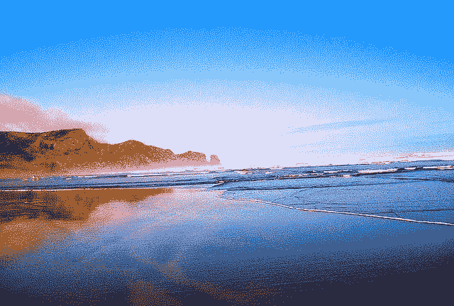

# 为 CNN 准备和扩充图像数据的最佳实践

> 原文：<https://machinelearningmastery.com/best-practices-for-preparing-and-augmenting-image-data-for-convolutional-neural-networks/>

最后更新于 2019 年 7 月 5 日

当训练卷积神经网络时，知道如何最好地准备图像数据是具有挑战性的。

这包括在模型的训练和评估期间缩放像素值和使用[图像数据扩充](https://machinelearningmastery.com/how-to-configure-image-data-augmentation-when-training-deep-learning-neural-networks/)技术。

一个有用的捷径不是测试广泛的选项，而是考虑最先进的模型所使用的数据准备、训练时间扩充和测试时间扩充的类型，这些模型在具有挑战性的计算机视觉数据集上取得了显著的最佳表现，即使用 ImageNet 数据集的大规模视觉识别挑战(ILSVRC)。

在本教程中，您将发现使用卷积神经网络为图像分类任务准备和扩充照片的最佳实践。

完成本教程后，您将知道:

*   图像数据可能应该通过减去在训练数据集上计算的每通道平均像素值来居中。
*   训练数据的扩充可能包括随机重新缩放、水平翻转、对亮度、对比度和颜色的扰动，以及随机裁剪。
*   测试时间扩充可能既包括对每个图像的多次重新缩放，也包括对图像的每个重新缩放版本的多个不同系统裁剪的预测。

**用我的新书[计算机视觉深度学习](https://machinelearningmastery.com/deep-learning-for-computer-vision/)启动你的项目**，包括*分步教程*和所有示例的 *Python 源代码*文件。

我们开始吧。

为卷积神经网络准备和扩充图像数据的最佳实践
图片来源于新西兰的[标记，保留部分权利。](https://www.flickr.com/photos/markdefleury/5715968837/)

## 教程概述

本教程分为五个部分；它们是:

1.  顶级 ILSVRC 模型
2.  监管(AlexNet)数据准备
3.  谷歌网(初始)数据准备
4.  VGG 数据准备
5.  ResNet 数据准备
6.  数据准备建议

## 顶级 ILSVRC 模型

当将卷积神经网络应用于图像分类时，准确地知道如何准备图像用于建模(例如缩放或归一化像素值)可能是具有挑战性的。

此外，图像数据扩充可用于提高模型表现并减少泛化误差，测试时间扩充可用于提高拟合模型的预测表现。

与其猜测什么可能是有效的，一个好的做法是仔细看看文献中描述的表现最好的模型上使用的数据准备、训练时间扩充和测试时间扩充的类型。

ImageNet 大规模视觉识别挑战赛(简称 ILSVRC)是 2010 年至 2017 年间举办的年度竞赛，挑战任务使用 ImageNet 数据集的子集。这场竞赛产生了一系列用于图像分类的最先进的深度学习卷积神经网络模型，其体系结构和配置已经成为该领域的启发和最佳实践。

描述在这个年度竞赛中赢得任务或在任务中表现良好的模型的论文可以被回顾，以便发现图像扩充所执行的数据准备类型。反过来，在为您自己的图像分类任务准备图像数据时，这些可以用作建议和最佳实践。

在接下来的部分中，我们将回顾四个顶级模型中使用的数据准备和图像扩充:它们是 Supervisor/AlexNet、Google net/Inception、VGG 和 ResNet。

## 监管(AlexNet)数据准备

多伦多大学的 Alex Krizhevsky 等人在他们 2012 年发表的题为“使用深度卷积神经网络的 [ImageNet 分类”](https://papers.nips.cc/paper/4824-imagenet-classification-with-deep-convolutional-neural-networks)的论文中开发了一种卷积神经网络，该网络在 ILSVRC-2010 和 ILSVRC-2012 图像分类任务中取得了最佳结果。

这些结果激发了人们对计算机视觉深度学习的兴趣。他们称他们的模型为 SuperVision，但后来被称为 AlexNet。

### 数据准备

训练数据集中的图像具有不同的大小，因此图像在用作模型的输入之前必须调整大小。

正方形图像的大小调整为 256×256 像素。矩形图像的最短边被调整到 256 像素，然后中间的 256×256 的正方形从图像中被裁剪掉。注意:网络期望输入图像具有 224×224 的形状，通过训练增强来实现。

> ImageNet 由可变分辨率的图像组成，而我们的系统需要恒定的输入维度。因此，我们将图像下采样到 256 × 256 的固定分辨率。给定一个矩形图像，我们首先重新缩放图像，使较短的边长为 256，然后从结果图像中裁剪出中心的 256×256 块。

——[深度卷积神经网络的 ImageNet 分类](https://papers.nips.cc/paper/4824-imagenet-classification-with-deep-convolutional-neural-networks)，2012。

然后从每个像素中减去平均像素值，称为居中。据信这是按通道执行的:也就是说，从训练数据集中估计平均像素值，彩色图像的红色、绿色和蓝色通道各一个。

> 我们没有以任何其他方式预处理图像，除了从每个像素中减去训练集的平均活动。所以我们在像素的原始 RGB 值上训练我们的网络。

——[深度卷积神经网络的 ImageNet 分类](https://papers.nips.cc/paper/4824-imagenet-classification-with-deep-convolutional-neural-networks)，2012。

### 列车时间扩充

对训练数据集进行图像扩充。

具体来说，扩增是在内存中执行的，结果没有保存，所谓的及时扩增现在是使用该方法的标准方式。

执行的第一种增强是水平翻转较小的裁剪正方形图像，使用图像内的水平反射将其扩展到所需的一侧。

> 数据扩充的第一种形式包括生成图像平移和水平反射。我们通过从 256×256 幅图像中随机提取 224×224 个面片(以及它们的水平反射)并在这些提取的面片上训练我们的网络来做到这一点。

——[深度卷积神经网络的 ImageNet 分类](https://papers.nips.cc/paper/4824-imagenet-classification-with-deep-convolutional-neural-networks)，2012。

第二种类型的增强是随机改变图像的亮度。

> 第二种形式的数据扩充包括改变训练图像中的 RGB 通道的强度。具体来说，我们在整个 ImageNet 训练集中对 RGB 像素值集执行 PCA。对于每个训练图像，我们添加找到的主成分的倍数，其幅度与相应的[特征值](https://machinelearningmastery.com/introduction-to-eigendecomposition-eigenvalues-and-eigenvectors/)乘以随机变量成比例，该随机变量从均值为零且标准偏差为 0.1 的高斯中提取。

——[深度卷积神经网络的 ImageNet 分类](https://papers.nips.cc/paper/4824-imagenet-classification-with-deep-convolutional-neural-networks)，2012。

### 测试时间扩充

执行测试时间扩充是为了给拟合模型做出稳健预测的每一个机会。

这包括创建输入图像的五个裁剪版本和图像水平翻转版本的五个裁剪版本，然后对预测进行平均。

> 在测试时，网络通过提取五个 224×224 的面片(四个角面片和中心面片)以及它们的水平反射(因此总共有十个面片)进行预测，并对网络的 softmax 层在这十个面片上进行的预测进行平均。

——[深度卷积神经网络的 ImageNet 分类](https://papers.nips.cc/paper/4824-imagenet-classification-with-deep-convolutional-neural-networks)，2012。

## 谷歌网(初始)数据准备

来自谷歌的 Christian Szegedy 等人通过其利用了初始模型和初始架构的谷歌网络模型，在对象检测方面取得了最好的结果。这种方法在他们 2014 年发表的题为“用盘旋走得更深”的论文中有所描述

### 数据准备

数据准备被描述为减去平均像素值，可能以每个通道为中心，就像 AlexNet 一样。

> 我们网络中的感受野大小为 224×224，采用均值相减的 RGB 颜色通道。

——[用回旋更深入](https://arxiv.org/abs/1409.4842)，2014。

第一篇论文中描述的架构版本通常被称为 Inception v1。2015 年一篇名为[重新思考计算机视觉的 Inception 架构](https://arxiv.org/abs/1512.00567)的后续论文描述了 Inception v2 和 v3。该架构的第 3 版和模型权重[可在 Keras 深度学习库](https://keras.io/applications/)中获得。

在这个实现中，基于开源的 TensorFlow 实现，图像不居中；取而代之的是，像素值按每幅图像缩放到范围[-1，1]内，图像输入形状为 299×299 像素。这种正常化和缺乏对中似乎没有在最近的论文中提到。

### 列车时间扩充

使用一系列技术来执行列车时间图像扩充。

使用随机选择的 3/4 或 4/3 的纵横比拍摄训练数据集中随机大小的图像作物。

> 尽管如此，一个在比赛后被证实非常有效的处方包括对图像的各种大小的块进行采样，这些块的大小均匀地分布在图像区域的 8%和 100%之间，并且其纵横比在 3/4 和 4/3 之间随机选择

——[用回旋更深入](https://arxiv.org/abs/1409.4842)，2014。

此外，还使用了“*光度失真*”，涉及到图像属性的随机变化，如颜色、对比度和亮度。

调整图像以适合模型的预期输入形状，并随机选择不同的插值方法。

> 此外，我们开始使用随机插值方法(双线性，面积，最近邻和立方，概率相等)来调整大小

——[用回旋更深入](https://arxiv.org/abs/1409.4842)，2014。

### 测试时间扩充

类似于 AlexNet，测试时间扩充被执行，尽管更广泛。

每幅图像都以四种不同的比例重新采样，从中获取多个方形裁剪，并将其大小调整为图像的预期输入形状。结果是对给定输入图像的多达 144 个版本的预测。

> 具体来说，我们将图像调整为 4 个比例，其中较短的尺寸(高度或宽度)分别为 256、288、320 和 352，取这些调整后的图像的左、中、右方块(在人像图像的情况下，我们取上、中、下方块)。然后，对于每个正方形，我们将 4 个角和中心 224×224 裁剪，以及调整到 224×224 的正方形及其镜像版本。这导致每个图像 4×3×6×2 = 144 个作物。

——[用回旋更深入](https://arxiv.org/abs/1409.4842)，2014。

然后对预测进行平均，以做出最终预测。

> 对多个作物和所有单个分类器的软最大概率进行平均，以获得最终预测。

——[用回旋更深入](https://arxiv.org/abs/1409.4842)，2014。

## VGG 数据准备

牛津视觉几何集团(VGG)的卡伦·西蒙扬和安德鲁·齐塞曼用他们的 VGG 模型在图像分类和定位方面取得了最好的结果。他们的方法在他们 2015 年发表的题为“用于大规模图像识别的非常深的卷积网络”的论文中有所描述

### 数据准备

如先前模型所述，数据准备包括将输入图像的形状标准化为小正方形，并减去在训练数据集上计算的每通道像素平均值。

> 在训练过程中，我们的 ConvNets 的输入是一个固定大小的 224 × 224 RGB 图像。我们所做的唯一预处理是从每个像素中减去在训练集上计算的平均 RGB 值。

——[用于大规模图像识别的超深度卷积网络](https://arxiv.org/abs/1409.1556)，2015。

### 列车时间扩充

该模型探索了一系列不同的图像缩放。

所描述的一种方法涉及首先训练具有固定但较小图像尺寸的模型，保留模型权重，然后将它们用作训练具有较大但仍固定尺寸图像的新模型的起点。这种方法是为了加快更大(第二)模型的训练而设计的。

> 给定一个 ConvNet 配置，我们首先使用 S = 256 训练网络。为了加速 S = 384 网络的训练，它被初始化为预先用 S = 256 训练的权重

——[用于大规模图像识别的超深度卷积网络](https://arxiv.org/abs/1409.1556)，2015。

另一种图像缩放方法被描述为“多尺度训练”，包括为每幅图像随机选择图像缩放尺寸。

> 设置 S 的第二种方法是多尺度训练，其中每个训练图像通过从某个范围[Smin，Smax]随机采样 S 来单独重新缩放(我们使用了 Smin = 256 和 Smax = 512)。

——[用于大规模图像识别的超深度卷积网络](https://arxiv.org/abs/1409.1556)，2015。

在这两种训练方法中，输入图像都被当作输入的较小部分。此外，水平翻转和颜色偏移被应用于作物。

> 为了获得固定大小的 224×224 ConvNet 输入图像，从重新缩放的训练图像中随机裁剪它们(每个 SGD 迭代每个图像一次裁剪)。为了进一步扩充训练集，作物经历了随机水平翻转和随机 RGB 颜色偏移。

——[用于大规模图像识别的超深度卷积网络](https://arxiv.org/abs/1409.1556)，2015。

### 测试时间扩充

在训练时间评估的“*多尺度*”方法也在测试时间进行评估，更一般地称为“*尺度抖动*

创建给定测试图像的多个不同缩放版本，对每个版本进行预测，然后对预测进行平均以给出最终预测。

> …我们现在评估测试时秤抖动的影响。它包括在测试图像的几个重新缩放版本上运行模型(对应于不同的 Q 值)，然后对得到的类后验进行平均。[……]结果[……]表明，测试时的规模抖动会带来更好的表现(与在单个规模上评估相同的模型相比…

——[用于大规模图像识别的超深度卷积网络](https://arxiv.org/abs/1409.1556)，2015。

## ResNet 数据准备

来自微软研究院的何等人在他们 2015 年发表的论文《用于图像识别的深度残差学习》中描述了他们的残差网络或 ResNet，在对象检测和带有定位任务的对象检测方面取得了顶级成果

### 数据准备

与其他模型一样，从图像中减去训练中计算的平均像素值，看起来每个通道居中。

> …减去每像素平均值。

——[图像识别的深度残差学习](https://arxiv.org/abs/1512.03385)，2015。

### 列车时间扩充

图像数据扩充是所描述的方法的组合，依赖于 AlexNet 和 VGG。

这些图像被随机调整大小，或者是小尺寸，或者是大尺寸，这就是在 VGG 使用的所谓的比例放大。然后用可能的水平翻转和增色进行小的方形裁剪。

> 图像被调整大小，其短边在[256，480]中随机采样，用于缩放放大[41]。224×224 的裁剪是从图像或其水平翻转中随机取样的[……]使用了[21]中的标准颜色增强。

——[图像识别的深度残差学习](https://arxiv.org/abs/1512.03385)，2015。

### 测试时间扩充

测试时间扩充是一个主要因素，也被应用于 ResNet。

与 AlexNet 一样，测试集中每个图像的 10 个作物被创建，尽管作物是在固定大小的每个测试图像的多个版本上计算的，实现了针对 VGG 描述的尺度抖动。然后对所有变量的预测进行平均。

> 在测试中，为了进行比较研究，我们采用了标准的 10 作物测试。在测试中，为了进行比较研究，我们采用了标准的 10 作物测试[21]。为了获得最佳结果，我们采用了[41，13]中的全卷积形式，并在多个尺度上对分数进行平均(调整图像大小，使较短的一边在{224，256，384，480，640}中)。

——[图像识别的深度残差学习](https://arxiv.org/abs/1512.03385)，2015。

## 数据准备建议

鉴于对跨顶级模型执行的数据准备的审查，我们可以总结一些最佳实践，以便在为您自己的图像分类任务准备数据时考虑。本节总结了这些发现。

*   **数据准备**。必须为输入图像选择固定大小，并且所有图像都必须调整到该形状。最常见的像素缩放类型包括对每个通道的像素值进行居中，之后可能会进行某种类型的标准化。
*   **列车时间扩充**。需要扩充训练时间，最常见的包括调整输入图像的大小和裁剪，以及修改图像，如移位、翻转和改变颜色。
*   **测试时间扩充**。测试时间扩充集中于输入图像的系统裁剪，以确保检测到输入图像中存在的特征。

## 进一步阅读

如果您想更深入地了解这个主题，本节将提供更多资源。

### 报纸

*   [深度卷积神经网络的 ImageNet 分类](https://papers.nips.cc/paper/4824-imagenet-classification-with-deep-convolutional-neural-networks)，2012。
*   [用回旋更深入](https://arxiv.org/abs/1409.4842)，2014。
*   [重新思考计算机视觉的初始架构](https://arxiv.org/abs/1512.00567)，2015 年。
*   [用于大规模图像识别的超深度卷积网络](https://arxiv.org/abs/1409.1556)，2015。
*   [图像识别的深度残差学习](https://arxiv.org/abs/1512.03385)，2015。

### 应用程序接口

*   [Keras 应用程序接口](https://keras.io/applications/)
*   [Keras 应用源代码](https://github.com/keras-team/keras-applications/tree/master/keras_applications)

## 摘要

在本教程中，您发现了使用卷积神经网络为图像分类任务准备和扩充照片的最佳实践。

具体来说，您了解到:

*   图像数据可能应该通过减去在训练数据集上计算的每通道平均像素值来居中。
*   训练数据的扩充可能包括随机重新缩放、水平翻转、对亮度、对比度和颜色的扰动，以及随机裁剪。
*   测试时间扩充可能既包括对每个图像的多次重新缩放，也包括对图像的每个重新缩放版本的多个不同系统裁剪的预测。

你有什么问题吗？
在下面的评论中提问，我会尽力回答。