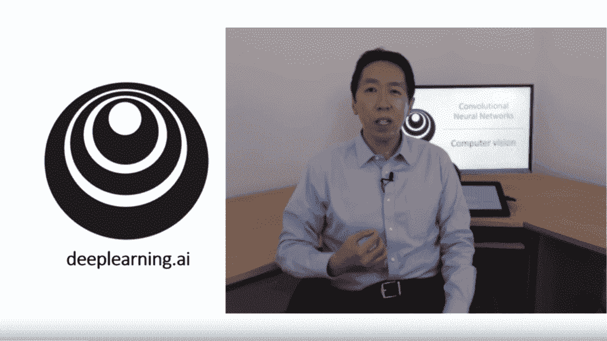

# DeepLearningAI 卷积神经网络课程（复习）

> 原文：<https://machinelearningmastery.com/deeplearning-ai-convolutional-neural-networks-deep-learning-specialization-review/>

最后更新于 2019 年 7 月 5 日

吴恩达因其在 Coursera 上提供的斯坦福机器学习课程而闻名。

2017 年，他还在 Coursera 上发布了一个由五部分组成的深度学习课程，名为“深度学习专业化”，其中包括一个名为“T2 卷积神经网络”的计算机视觉深度学习模块

本课程为那些已经熟悉深度学习基础的从业者提供了关于[计算机视觉](https://machinelearningmastery.com/what-is-computer-vision/)应用的深度学习方法的极好介绍。它不太关注数学，也不包含任何代码。相反，它旨在为该领域使用的主要技术开发直觉。

在这篇文章中，你会发现吴恩达教授的关于计算机视觉深度学习的卷积神经网络课程的分解和回顾。

看完这篇文章，你会知道:

*   该课程实际上是 deeplearning.ai 提供的更广泛的深度学习课程中的一个子课程。
*   该课程不是免费的，需要在 Coursera 上订阅和注册，尽管所有视频在 YouTube 上都是免费的。
*   该课程为熟悉深度学习基础知识的开发人员提供了一个极好的计算机视觉深度学习入门。

**用我的新书[计算机视觉深度学习](https://machinelearningmastery.com/deep-learning-for-computer-vision/)启动你的项目**，包括*分步教程*和所有示例的 *Python 源代码*文件。

我们开始吧。

## 概观

本教程分为五个部分；它们是:

1.  深度学习专业化概述
2.  卷积神经网络课程分解
3.  YouTube 上的课程视频
4.  讨论和回顾

## 深度学习专业化概述

[吴恩达](https://en.wikipedia.org/wiki/Andrew_Ng)是一位机器学习研究员，他以公开他的[斯坦福机器学习](https://www.coursera.org/learn/machine-learning)课程而闻名，后来为全科医生量身定制，并在 Coursera 上提供。

他也是 Coursera 的联合创始人，曾任[谷歌大脑](https://en.wikipedia.org/wiki/Google_Brain)总监和百度首席科学家。

2017 年，他推出了一个名为 [deeplearning.ai](https://www.deeplearning.ai/) 的新网站，通过其 Coursera 平台提供的[课程(需要订阅)，为全科医生(如开发人员)提供深度学习培训。](https://www.coursera.org/specializations/deep-learning)

完整的课程分为五个子课程；它们是:

*   **课程 1** :神经网络和深度学习
*   **课程 2** :改善深层神经网络
*   **课程 3** :构建机器学习项目
*   **课程 4:卷积神经网络(我们的重点)**
*   **课程 5** :序列模型

这些课程采用视频教程的形式，由安德鲁以与他著名的机器学习课程相同的实践风格呈现。

该课程是为深度学习领域的初学者开发人员设计的。

卷积神经网络课程分解

值得注意的是计算机视觉的深度学习子课程，名为“卷积神经网络”

卷积神经网络-计算机视觉

本课程旨在教开发人员卷积神经网络是如何工作的，以及如何将它们用于标准的计算机视觉任务。

> 本课程将教你如何建立卷积神经网络，并将其应用于图像数据。得益于深度学习，计算机视觉比两年前工作得好得多，这使得许多令人兴奋的应用成为可能，从安全自动驾驶到精确的人脸识别，再到放射学图像的自动读取。

——[关于本课程，Coursera](https://www.coursera.org/learn/convolutional-neural-networks?action=enroll&specialization=deep-learning) 。

分为四周；它们是:

*   **第 1 周**:卷积神经网络基础
*   **第 2 周**:深度卷积模型:案例研究
*   **第 3 周**:对象探测
*   **第 4 周**:特殊应用:人脸识别&神经风格转换

每周分为 10 到 12 个主题，每个主题都包含在一个持续几分钟到不超过 15 分钟的短视频中。

大多数主题都是以实用的方式呈现的，很少涉及数学。所包括的数学内容主要集中在计算损失函数或计算模型中的参数(权重)数量等主题上。

除了缺乏数学知识，这门课程也没有展示代码，而是专注于帮助观众对所讨论的技术产生直觉。

**第 1 周**。第一周专门介绍用于计算机视觉问题的主要类型的神经网络:卷积神经网络或 CNN。主题集中在卷积层如何工作，过滤器，填充，[大步](https://machinelearningmastery.com/padding-and-stride-for-convolutional-neural-networks/)，以及相关的池层。

**第 2 周**。第二周重点关注开发有效 CNN 模型的重要里程碑，例如用于数字识别的 LeNet 和为 ImageNet 开发的一套模型，例如 AlexNet、ResNet 和Inception。随着每个里程碑的讨论，模型设计的创新被描述成解释为什么模型是有效的，以及如何更普遍地使用该技术。这一周以数据准备结束，包括数据扩充和[转移学习](https://machinelearningmastery.com/how-to-use-transfer-learning-when-developing-convolutional-neural-network-models/)。

**第三周**。第三周的重点是目标检测，介绍更简单的图像分类、图像定位和地标检测问题。这些是计算机视觉深度学习的“T2”杀手级应用程序“T3”，YOLO 方法的重要子技术被逐步引入并构建成一个完整的工作系统。

**第 4 周**。最后，最后一周以人脸检测和识别结束，建立这样一个系统所需的技术，包括一次性学习、暹罗网络和合适的损失函数。这一周分为两部分，第二部分集中在神经风格转移，这种技术虽然纯粹是审美的，但很有趣。

## YouTube 上的课程视频

课程主题的完整分类如下。

*   **第 1 周:卷积神经网络基础**
    *   计算机视觉
    *   边缘检测示例
    *   更多边缘检测
    *   填料
    *   条纹回旋
    *   体积上的卷积
    *   卷积网络的一层
    *   简单卷积网络示例
    *   汇集层
    *   美国有线电视新闻网例子
    *   为什么是卷积？
    *   Yann LeCun 访谈
*   **第 2 周:深度卷积模型:案例研究**
    *   为什么要看案例研究？
    *   经典网络
    *   ResNets
    *   为什么厌恶工作
    *   网络和 1×1 卷积中的网络
    *   初始网络动机
    *   初始网络
    *   使用开源实现
    *   迁移学习
    *   日期增加
    *   计算机视觉的现状
*   **第 3 周:对象检测**
    *   对象定位
    *   地标检测
    *   目标检测
    *   滑动窗口的卷积实现
    *   边界框预测
    *   联合上的交集
    *   非最大抑制
    *   锚箱
    *   YOLO 算法
    *   (可选)地区提案
*   **第 4 周:特殊应用:人脸识别&神经风格转移**
    *   什么是人脸识别？
    *   一次性学习
    *   暹罗网络
    *   三重态损失
    *   人脸验证和二进制分类
    *   什么是神经风格转移？
    *   什么是深度 ConvNets 学习？
    *   价值函数
    *   内容成本函数
    *   风格成本函数
    *   1D 和三维推广

请注意，本课程的视频也已通过 YouTube 提供。

吴恩达教授的卷积神经网络

该课程的 YouTube 播放列表也是可用的，尽管第三周的一些视频有问题:

*   [卷积神经网络(深度学习专业化课程 4)，YouTube 播放列表](https://www.youtube.com/playlist?list=PLkDaE6sCZn6Gl29AoE31iwdVwSG-KnDzF)。

视频有 C4W *n* L *nn* 的命名约定，其中 W *n* 表示周数(1-4)，L *nn* 表示讲座号(如 01-12)。记下第三周视频的顺序；您可能需要手动跳转播放列表。

播放列表中缺少两个视频；它们是:

*   [第 3 周:边界框预测](https://www.youtube.com/watch?v=gKreZOUi-O0)
*   [【yann lecun 访谈】](https://www.youtube.com/watch?v=JS12eb1cTLE)

请注意，第一周包括对卷积神经网络的发明者 Yann LeCun 的视频采访。这是名为“*深度学习访谈英雄*”的视频系列的一部分，也可以在 YouTube 上找到。

*   [深度学习访谈英雄，YouTube 播放列表](https://www.youtube.com/playlist?list=PLkDaE6sCZn6FcbHlDzbVzf3TVgxzxK7lr)。

您可以在几个小时内轻松观看所有视频。

## 讨论和回顾

我通过 YouTube(以双倍速度)观看了所有视频，并做了大量笔记。

这是一门很棒的课程，我认为它在为所涵盖的主题发展直觉方面做得很好，包括CNN、里程碑模型、对象检测、人脸识别和风格转换。

卷积层和填充、跨步等相关主题的介绍，可能是我见过的最干净的介绍之一。我还发现第二周和第三周在里程碑 CNN 模型和对象检测上非常清晰。第 4 周还不错，开局不错，但是当我们进入神经类型转换时，情况变得非常糟糕。

如果你已经像许多深度学习实践者一样熟悉CNN的基础知识，那么我建议关注第 3 周和第 4 周。第三周尤其精彩，深入探讨了对象探测的杀手级应用程序的元素，以及解决这个问题的具有挑战性的 YOLO 方法。

YOLO 是一个重要的话题，但如果把重点放在一个更简单(更容易实现的方法)如快速或更快的美国有线电视新闻网上，它可能会被简化。

我发现自己几乎每分钟都在看这门课，只跳过了一些凌乱的数学描述。事实上，深入研究损失函数的解释可能是课程中最不有趣，也可能是不必要的部分。

我从未发现视频是教数学的有效媒介。它需要慢慢来，有清晰的(LaTeX)方程、解释和工作代码。

如果你是计算机视觉深度学习的新手，但是熟悉深度学习的基础知识，那么我推荐这门课，特别是看视频。你可以一两次轻松完成。

## 进一步阅读

如果您想更深入地了解这个主题，本节将提供更多资源。

*   [深度学习专业化，深度学习 ai](https://www.deeplearning.ai/deep-learning-specialization/) 。
*   [卷积神经网络，深度学习专业化，Coursera](https://www.coursera.org/learn/convolutional-neural-networks?specialization=deep-learning) 。
*   [卷积神经网络(深度学习专业化课程 4)，YouTube 播放列表](https://www.youtube.com/playlist?list=PLkDaE6sCZn6Gl29AoE31iwdVwSG-KnDzF)。
*   [深度学习访谈英雄，YouTube 播放列表](https://www.youtube.com/playlist?list=PLkDaE6sCZn6FcbHlDzbVzf3TVgxzxK7lr)。

## 摘要

在这篇文章中，你发现了吴恩达教授的关于计算机视觉深度学习的卷积神经网络课程的分解和回顾。

具体来说，您了解到:

*   该课程实际上是 deeplearning.ai 提供的更广泛的深度学习课程中的一个子课程。
*   该课程不是免费的，需要在 Coursera 上订阅和注册，尽管所有视频在 YouTube 上都是免费的。
*   该课程为熟悉深度学习基础知识的开发人员提供了一个极好的计算机视觉深度学习入门。

你有什么问题吗？
在下面的评论中提问，我会尽力回答。