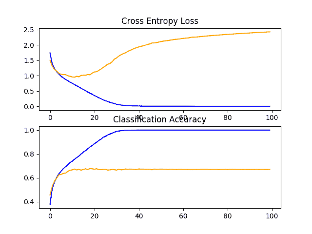
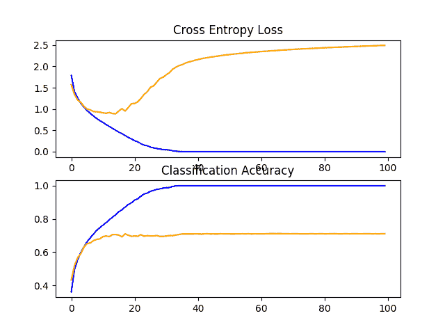
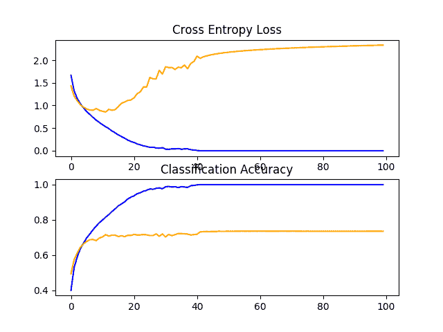
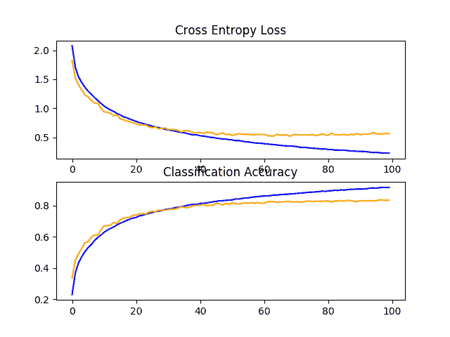
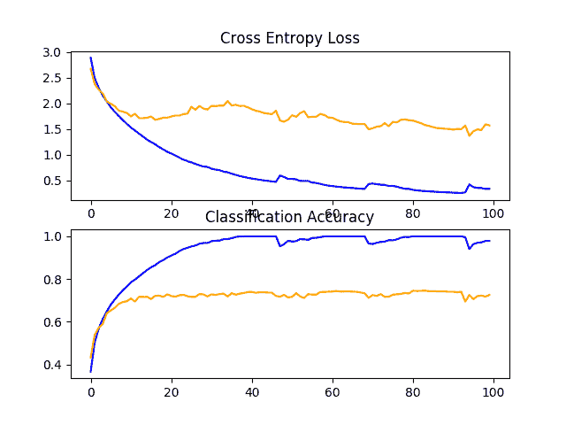
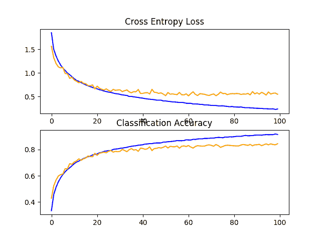
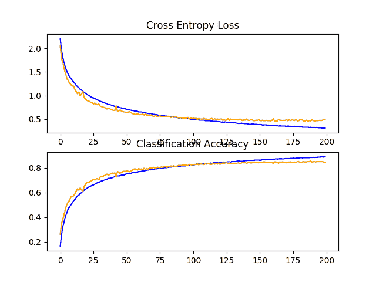
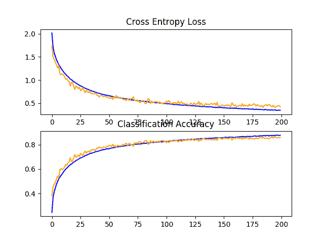

# 如何从零开始为 CIFAR-10 照片分类开发 CNN

> 原文:[https://machinelearning master . com/如何开发-a-CNN-从头开始-for-cifar-10-photo-classification/](https://machinelearningmastery.com/how-to-develop-a-cnn-from-scratch-for-cifar-10-photo-classification/)

最后更新于 2020 年 8 月 28 日

#### 了解如何为 CIFAR-10 对象分类数据集从头开发深度卷积神经网络模型。

CIFAR-10 小照片分类问题是计算机视觉和深度学习中使用的标准数据集。

虽然数据集得到了有效解决，但它可以作为学习和实践如何从头开始开发、评估和使用卷积深度学习神经网络进行图像分类的基础。

这包括如何开发一个健壮的测试工具来评估模型的性能，如何探索模型的改进，以及如何保存模型并在以后加载它来对新数据进行预测。

在本教程中，您将发现如何从头开始为对象照片分类开发卷积神经网络模型。

完成本教程后，您将知道:

*   如何开发一个测试工具来开发一个健壮的模型评估，并为分类任务建立一个性能基线。
*   如何探索基线模型的扩展，以提高学习和模型能力。
*   如何开发最终模型，评估最终模型的性能，并使用它对新图像进行预测。

**用我的新书[计算机视觉深度学习](https://machinelearningmastery.com/deep-learning-for-computer-vision/)启动你的项目**，包括*分步教程*和所有示例的 *Python 源代码*文件。

我们开始吧。

*   **2019 年 10 月更新**:针对 Keras 2.3 和 TensorFlow 2.0 更新。


如何从零开始为 CIFAR-10 照片分类开发卷积神经网络
照片作者: [Rose Dlhopolsky](https://www.flickr.com/photos/rmdobservations/7886626362/) ，版权所有。

## 教程概述

本教程分为六个部分；它们是:

1.  CIFAR-10 照片分类数据集
2.  模型评估测试线束
3.  如何开发基线模型
4.  如何开发改进的模型
5.  如何进一步改进
6.  如何最终确定模型并做出预测

## CIFAR-10 照片分类数据集

CIFAR 是首字母缩略词，代表[加拿大高级研究所](https://www.cs.toronto.edu/~kriz/cifar.html)， [CIFAR-10 数据集](https://en.wikipedia.org/wiki/CIFAR-10)是由 CIFAR 研究所的研究人员与 CIFAR-100 数据集一起开发的。

数据集由 60，000 张 32×32 像素彩色照片组成，这些照片来自 10 个类别的物体，如青蛙、鸟类、猫、船等。类别标签及其标准相关整数值如下所示。

*   0:飞机
*   1:汽车
*   2:鸟
*   3:猫
*   4:鹿
*   5:狗
*   6:青蛙
*   7:马
*   8:船
*   9:卡车

这些是非常小的图像，比典型的照片小得多，数据集是为计算机视觉研究而设计的。

CIFAR-10 是一个众所周知的数据集，广泛用于机器学习领域的计算机视觉算法基准测试。问题是“*解决了*”达到 80%的分类准确率相对简单。通过深度学习卷积神经网络在测试数据集上达到 90%以上的分类精度，在该问题上取得了最佳性能。

下面的示例使用 Keras API 加载 CIFAR-10 数据集，并创建训练数据集中前九个图像的图。

```py
# example of loading the cifar10 dataset
from matplotlib import pyplot
from keras.datasets import cifar10
# load dataset
(trainX, trainy), (testX, testy) = cifar10.load_data()
# summarize loaded dataset
print('Train: X=%s, y=%s' % (trainX.shape, trainy.shape))
print('Test: X=%s, y=%s' % (testX.shape, testy.shape))
# plot first few images
for i in range(9):
	# define subplot
	pyplot.subplot(330 + 1 + i)
	# plot raw pixel data
	pyplot.imshow(trainX[i])
# show the figure
pyplot.show()
```

运行该示例将加载 CIFAR-10 训练和测试数据集，并打印它们的形状。

我们可以看到训练数据集中有 50000 个例子，测试数据集中有 10000 个例子，图像确实是 32×32 像素、彩色的正方形，有三个通道。

```py
Train: X=(50000, 32, 32, 3), y=(50000, 1)
Test: X=(10000, 32, 32, 3), y=(10000, 1)
```

还会创建数据集中前九幅图像的图。很明显，与现代照片相比，这些图像确实非常小；在分辨率极低的情况下，很难看清某些图像中到底表现了什么。

这种低分辨率很可能是顶级算法在数据集上所能达到的有限性能的原因。


从 CIFAR-10 数据集绘制图像子集

## 模型评估测试线束

CIFAR-10 数据集可以成为开发和实践使用卷积神经网络解决图像分类问题的方法的有用起点。

我们可以从头开始开发一个新的模型，而不是回顾数据集上表现良好的模型的文献。

数据集已经有了一个我们将使用的定义良好的训练和测试数据集。另一种方法是用 k=5 或 k=10 进行 k 倍交叉验证。如果有足够的资源，这是可取的。在这种情况下，为了确保本教程中的示例在合理的时间内执行，我们将不使用 k-fold 交叉验证。

测试线束的设计是模块化的，我们可以为每个部件开发单独的功能。如果我们愿意，这允许测试装具的给定方面与其余部分分开修改或互换。

我们可以用五个关键元素来开发这个测试工具。它们是数据集的加载、数据集的准备、模型的定义、模型的评估和结果的呈现。

### 加载数据集

我们知道一些关于数据集的事情。

例如，我们知道图像都是预分割的(例如，每个图像包含单个对象)，图像都具有相同的 32×32 像素的正方形大小，并且图像是彩色的。因此，我们几乎可以立即加载图像并将其用于建模。

```py
# load dataset
(trainX, trainY), (testX, testY) = cifar10.load_data()
```

我们还知道有 10 个类，类被表示为唯一的整数。

因此，我们可以对每个样本的类元素使用[一热编码](https://machinelearningmastery.com/why-one-hot-encode-data-in-machine-learning/)，将整数转换为 10 元素二进制向量，类值的索引为 1。我们可以通过*to _ classic()*效用函数来实现。

```py
# one hot encode target values
trainY = to_categorical(trainY)
testY = to_categorical(testY)
```

*load_dataset()* 函数实现了这些行为，可以用来加载数据集。

```py
# load train and test dataset
def load_dataset():
	# load dataset
	(trainX, trainY), (testX, testY) = cifar10.load_data()
	# one hot encode target values
	trainY = to_categorical(trainY)
	testY = to_categorical(testY)
	return trainX, trainY, testX, testY
```

### 准备像素数据

我们知道，数据集中每个图像的像素值都是无符号整数，范围在无颜色和全色之间，或者在 0 到 255 之间。

我们不知道缩放用于建模的像素值的最佳方式，但是我们知道需要一些缩放。

一个好的起点是归一化像素值，例如将它们重新缩放到范围[0，1]。这包括首先将数据类型从无符号整数转换为浮点数，然后将像素值除以最大值。

```py
# convert from integers to floats
train_norm = train.astype('float32')
test_norm = test.astype('float32')
# normalize to range 0-1
train_norm = train_norm / 255.0
test_norm = test_norm / 255.0
```

下面的 *prep_pixels()* 函数实现了这些行为，并提供了需要缩放的训练和测试数据集的像素值。

```py
# scale pixels
def prep_pixels(train, test):
	# convert from integers to floats
	train_norm = train.astype('float32')
	test_norm = test.astype('float32')
	# normalize to range 0-1
	train_norm = train_norm / 255.0
	test_norm = test_norm / 255.0
	# return normalized images
	return train_norm, test_norm
```

在任何建模之前，必须调用该函数来准备像素值。

### 定义模型

接下来，我们需要一种建立神经网络模型的方法。

下面的 *define_model()* 函数将定义并返回该模型，并且可以为我们希望稍后评估的给定模型配置进行填充或替换。

```py
# define cnn model
def define_model():
	model = Sequential()
	# ...
	return model
```

### 评估模型

在模型定义之后，我们需要对其进行拟合和评估。

拟合模型需要指定训练时期的数量和批次大小。我们现在将使用通用的 100 个训练时期和 64 个适度的批量。

最好使用单独的验证数据集，例如通过将训练数据集分成训练集和验证集。在这种情况下，我们不会分割数据，而是使用测试数据集作为验证数据集，以保持示例简单。

测试数据集可以像验证数据集一样使用，并在每个训练周期结束时进行评估。这将在每个时期的训练和测试数据集上产生模型评估分数的轨迹，该轨迹可以在以后绘制。

```py
# fit model
history = model.fit(trainX, trainY, epochs=100, batch_size=64, validation_data=(testX, testY), verbose=0)
```

一旦模型合适，我们就可以直接在测试数据集上对其进行评估。

```py
# evaluate model
_, acc = model.evaluate(testX, testY, verbose=0)
```

### 呈现结果

一旦评估了模型，我们就可以展示结果了。

有两个关键方面需要介绍:训练期间模型学习行为的诊断和模型性能的估计。

首先，诊断包括创建一个线图，显示训练期间模型在列车和测试集上的表现。这些图对于了解模型是过拟合、欠拟合还是非常适合数据集很有价值。

我们将创建一个有两个支线剧情的单一人物，一个是损失，一个是准确性。蓝色线将指示训练数据集上的模型性能，橙色线将指示等待测试数据集上的性能。下面的*summary _ diagnostics()*函数在给定收集的训练历史的情况下创建并显示该图。剧情保存到文件中，特别是与脚本同名的文件，扩展名为“ *png* ”。

```py
# plot diagnostic learning curves
def summarize_diagnostics(history):
	# plot loss
	pyplot.subplot(211)
	pyplot.title('Cross Entropy Loss')
	pyplot.plot(history.history['loss'], color='blue', label='train')
	pyplot.plot(history.history['val_loss'], color='orange', label='test')
	# plot accuracy
	pyplot.subplot(212)
	pyplot.title('Classification Accuracy')
	pyplot.plot(history.history['accuracy'], color='blue', label='train')
	pyplot.plot(history.history['val_accuracy'], color='orange', label='test')
	# save plot to file
	filename = sys.argv[0].split('/')[-1]
	pyplot.savefig(filename + '_plot.png')
	pyplot.close()
```

接下来，我们可以在测试数据集上报告最终的模型性能。

这可以通过直接打印分类精度来实现。

```py
print('> %.3f' % (acc * 100.0))
```

### 完整示例

我们需要一个驱动测试线束的功能。

这包括调用所有的定义函数。下面的*run _ test _ 线束()*函数实现了这一点，并且可以被调用来启动给定模型的评估。

```py
# run the test harness for evaluating a model
def run_test_harness():
	# load dataset
	trainX, trainY, testX, testY = load_dataset()
	# prepare pixel data
	trainX, testX = prep_pixels(trainX, testX)
	# define model
	model = define_model()
	# fit model
	history = model.fit(trainX, trainY, epochs=100, batch_size=64, validation_data=(testX, testY), verbose=0)
	# evaluate model
	_, acc = model.evaluate(testX, testY, verbose=0)
	print('> %.3f' % (acc * 100.0))
	# learning curves
	summarize_diagnostics(history)
```

我们现在有了测试装具所需的一切。

下面列出了 CIFAR-10 数据集测试工具的完整代码示例。

```py
# test harness for evaluating models on the cifar10 dataset
import sys
from matplotlib import pyplot
from keras.datasets import cifar10
from keras.utils import to_categorical
from keras.models import Sequential
from keras.layers import Conv2D
from keras.layers import MaxPooling2D
from keras.layers import Dense
from keras.layers import Flatten
from keras.optimizers import SGD

# load train and test dataset
def load_dataset():
	# load dataset
	(trainX, trainY), (testX, testY) = cifar10.load_data()
	# one hot encode target values
	trainY = to_categorical(trainY)
	testY = to_categorical(testY)
	return trainX, trainY, testX, testY

# scale pixels
def prep_pixels(train, test):
	# convert from integers to floats
	train_norm = train.astype('float32')
	test_norm = test.astype('float32')
	# normalize to range 0-1
	train_norm = train_norm / 255.0
	test_norm = test_norm / 255.0
	# return normalized images
	return train_norm, test_norm

# define cnn model
def define_model():
	model = Sequential()
	# ...
	return model

# plot diagnostic learning curves
def summarize_diagnostics(history):
	# plot loss
	pyplot.subplot(211)
	pyplot.title('Cross Entropy Loss')
	pyplot.plot(history.history['loss'], color='blue', label='train')
	pyplot.plot(history.history['val_loss'], color='orange', label='test')
	# plot accuracy
	pyplot.subplot(212)
	pyplot.title('Classification Accuracy')
	pyplot.plot(history.history['accuracy'], color='blue', label='train')
	pyplot.plot(history.history['val_accuracy'], color='orange', label='test')
	# save plot to file
	filename = sys.argv[0].split('/')[-1]
	pyplot.savefig(filename + '_plot.png')
	pyplot.close()

# run the test harness for evaluating a model
def run_test_harness():
	# load dataset
	trainX, trainY, testX, testY = load_dataset()
	# prepare pixel data
	trainX, testX = prep_pixels(trainX, testX)
	# define model
	model = define_model()
	# fit model
	history = model.fit(trainX, trainY, epochs=100, batch_size=64, validation_data=(testX, testY), verbose=0)
	# evaluate model
	_, acc = model.evaluate(testX, testY, verbose=0)
	print('> %.3f' % (acc * 100.0))
	# learning curves
	summarize_diagnostics(history)

# entry point, run the test harness
run_test_harness()
```

该测试工具可以评估我们可能希望在 CIFAR-10 数据集上评估的任何有线电视新闻网模型，并且可以在中央处理器或图形处理器上运行。

**注**:原样，没有定义模型，所以这个完整的例子无法运行。

接下来，让我们看看如何定义和评估基线模型。

## 如何开发基线模型

我们现在可以研究 CIFAR-10 数据集的基线模型。

基线模型将建立一个最低的模型性能，我们所有的其他模型都可以与之进行比较，以及一个我们可以用作研究和改进基础的模型架构。

一个很好的起点是 VGG 模型的一般架构原则。这些是一个很好的起点，因为它们在 ILSVRC 2014 竞赛中取得了顶级的性能，并且因为体系结构的模块化结构易于理解和实施。有关 VGG 模型的更多详细信息，请参见 2015 年的论文“[用于大规模图像识别的超深度卷积网络](https://arxiv.org/abs/1409.1556)”

该架构包括堆叠卷积层和 3×3 小滤波器，然后是最大池层。这些层一起形成一个块，并且这些块可以重复，其中每个块中的过滤器的数量随着网络的深度而增加，例如对于模型的前四个块为 32、64、128、256。卷积层上使用填充来确保输出特征映射的高度和宽度与输入匹配。

我们可以在 CIFAR-10 问题上探索这种体系结构，并将具有这种体系结构的模型与具有 1、2 和 3 个数据块的模型进行比较。

每层将使用 [ReLU 激活功能](https://machinelearningmastery.com/rectified-linear-activation-function-for-deep-learning-neural-networks/)和 he 权重初始化，这通常是最佳实践。例如，3 块 VGG 风格的架构可以在 Keras 中定义如下:

```py
# example of a 3-block vgg style architecture
model = Sequential()
model.add(Conv2D(32, (3, 3), activation='relu', kernel_initializer='he_uniform', padding='same', input_shape=(32, 32, 3)))
model.add(Conv2D(32, (3, 3), activation='relu', kernel_initializer='he_uniform', padding='same'))
model.add(MaxPooling2D((2, 2)))
model.add(Conv2D(64, (3, 3), activation='relu', kernel_initializer='he_uniform', padding='same'))
model.add(Conv2D(64, (3, 3), activation='relu', kernel_initializer='he_uniform', padding='same'))
model.add(MaxPooling2D((2, 2)))
model.add(Conv2D(128, (3, 3), activation='relu', kernel_initializer='he_uniform', padding='same'))
model.add(Conv2D(128, (3, 3), activation='relu', kernel_initializer='he_uniform', padding='same'))
model.add(MaxPooling2D((2, 2)))
...
```

这定义了模型的特征检测器部分。这必须与模型的分类器部分相结合，分类器部分解释特征并预测给定照片属于哪个类别。

对于我们研究的每个模型，这都是固定的。首先，从模型的特征提取部分输出的特征图必须展平。然后，我们可以用一个或多个完全连接的层来解释它们，然后输出预测。对于 10 个类，输出层必须有 10 个节点，并使用 softmax 激活功能。

```py
# example output part of the model
model.add(Flatten())
model.add(Dense(128, activation='relu', kernel_initializer='he_uniform'))
model.add(Dense(10, activation='softmax'))
...
```

模型将使用随机梯度下降进行优化。

我们将使用 0.001 的适度学习率和 0.9 的大动量，这两者都是很好的一般起点。该模型将优化多类分类所需的[分类交叉熵损失函数](https://machinelearningmastery.com/how-to-choose-loss-functions-when-training-deep-learning-neural-networks/)，并将监控分类精度。

```py
# compile model
opt = SGD(lr=0.001, momentum=0.9)
model.compile(optimizer=opt, loss='categorical_crossentropy', metrics=['accuracy'])
```

我们现在有足够的元素来定义我们的 VGG 风格的基线模型。我们可以用 1、2 和 3 个 VGG 模块定义三种不同的模型架构，这要求我们定义 3 个不同版本的 *define_model()* 函数，如下所示。

要测试每个模型，必须使用上一节中定义的测试工具和下面定义的新版本的*定义 _ 模型()*功能创建新的脚本(例如 *model_baseline1.py* 、 *model_baseline2.py* 、…)。

让我们依次看一下每个 *define_model()* 函数以及对生成的测试线束的评估。

### 基线:1 个 VGG 区块

下面列出了一个 VGG 区块的 *define_model()* 功能。

```py
# define cnn model
def define_model():
	model = Sequential()
	model.add(Conv2D(32, (3, 3), activation='relu', kernel_initializer='he_uniform', padding='same', input_shape=(32, 32, 3)))
	model.add(Conv2D(32, (3, 3), activation='relu', kernel_initializer='he_uniform', padding='same'))
	model.add(MaxPooling2D((2, 2)))
	model.add(Flatten())
	model.add(Dense(128, activation='relu', kernel_initializer='he_uniform'))
	model.add(Dense(10, activation='softmax'))
	# compile model
	opt = SGD(lr=0.001, momentum=0.9)
	model.compile(optimizer=opt, loss='categorical_crossentropy', metrics=['accuracy'])
	return model
```

在测试线束中运行模型首先会在测试数据集上打印分类精度。

**注**:考虑到算法或评估程序的随机性，或数值精度的差异，您的[结果可能会有所不同](https://machinelearningmastery.com/different-results-each-time-in-machine-learning/)。考虑运行该示例几次，并比较平均结果。

在这种情况下，我们可以看到该模型实现了不到 70%的分类准确率。

```py
> 67.070
```

创建一个图形并保存到文件中，显示在训练和测试数据集上训练期间模型的学习曲线，包括损失和精度。

在这种情况下，我们可以看到模型快速地覆盖了测试数据集。如果我们查看损失图(顶部图)，我们可以看到模型在训练数据集(蓝色)上的性能继续提高，而在测试数据集(橙色)上的性能提高，然后在大约 15 个时期开始变差。



CIFAR-10 数据集上 VGG 1 基线的学习曲线线图

### 基线:2 个 VGG 区块

下面列出了两个 VGG 区块的 *define_model()* 函数。

```py
# define cnn model
def define_model():
	model = Sequential()
	model.add(Conv2D(32, (3, 3), activation='relu', kernel_initializer='he_uniform', padding='same', input_shape=(32, 32, 3)))
	model.add(Conv2D(32, (3, 3), activation='relu', kernel_initializer='he_uniform', padding='same'))
	model.add(MaxPooling2D((2, 2)))
	model.add(Conv2D(64, (3, 3), activation='relu', kernel_initializer='he_uniform', padding='same'))
	model.add(Conv2D(64, (3, 3), activation='relu', kernel_initializer='he_uniform', padding='same'))
	model.add(MaxPooling2D((2, 2)))
	model.add(Flatten())
	model.add(Dense(128, activation='relu', kernel_initializer='he_uniform'))
	model.add(Dense(10, activation='softmax'))
	# compile model
	opt = SGD(lr=0.001, momentum=0.9)
	model.compile(optimizer=opt, loss='categorical_crossentropy', metrics=['accuracy'])
	return model
```

在测试线束中运行模型首先会在测试数据集上打印分类精度。

**注**:考虑到算法或评估程序的随机性，或数值精度的差异，您的[结果可能会有所不同](https://machinelearningmastery.com/different-results-each-time-in-machine-learning/)。考虑运行该示例几次，并比较平均结果。

在这种情况下，我们可以看到具有两个块的模型比具有单个块的模型表现更好:这是一个好迹象。

```py
> 71.080
```

创建一个显示学习曲线的图形并保存到文件中。在这种情况下，我们继续看到强劲的过度拟合。



CIFAR-10 数据集上 VGG 2 基线的学习曲线线图

### 基线:3 个 VGG 区块

下面列出了三个 VGG 区块的 *define_model()* 功能。

```py
# define cnn model
def define_model():
	model = Sequential()
	model.add(Conv2D(32, (3, 3), activation='relu', kernel_initializer='he_uniform', padding='same', input_shape=(32, 32, 3)))
	model.add(Conv2D(32, (3, 3), activation='relu', kernel_initializer='he_uniform', padding='same'))
	model.add(MaxPooling2D((2, 2)))
	model.add(Conv2D(64, (3, 3), activation='relu', kernel_initializer='he_uniform', padding='same'))
	model.add(Conv2D(64, (3, 3), activation='relu', kernel_initializer='he_uniform', padding='same'))
	model.add(MaxPooling2D((2, 2)))
	model.add(Conv2D(128, (3, 3), activation='relu', kernel_initializer='he_uniform', padding='same'))
	model.add(Conv2D(128, (3, 3), activation='relu', kernel_initializer='he_uniform', padding='same'))
	model.add(MaxPooling2D((2, 2)))
	model.add(Flatten())
	model.add(Dense(128, activation='relu', kernel_initializer='he_uniform'))
	model.add(Dense(10, activation='softmax'))
	# compile model
	opt = SGD(lr=0.001, momentum=0.9)
	model.compile(optimizer=opt, loss='categorical_crossentropy', metrics=['accuracy'])
	return model
```

在测试线束中运行模型首先会在测试数据集上打印分类精度。

**注**:考虑到算法或评估程序的随机性，或数值精度的差异，您的[结果可能会有所不同](https://machinelearningmastery.com/different-results-each-time-in-machine-learning/)。考虑运行该示例几次，并比较平均结果。

在这种情况下，随着模型深度的增加，性能又有了适度的提高。

```py
> 73.500
```

回顾显示学习曲线的数字，我们再次看到在最初的 20 个训练阶段中出现了戏剧性的过度适应。



CIFAR-10 数据集上 VGG 3 基线的学习曲线线图

### 讨论

我们探索了基于 VGG 架构的三种不同模式。

结果可以总结如下，尽管我们必须假设这些结果中存在一些方差，因为算法具有随机性:

*   **VGG 1** : 67，070%
*   **vgg 2**:71 080%
*   **VGG 3** : 73，500%

在所有情况下，模型都能够学习训练数据集，显示出对训练数据集的改进，至少持续到 40 个时代，也许更多。这是一个好的迹象，因为它表明这个问题是可以学习的，并且所有三个模型都有足够的能力来学习这个问题。

模型在测试数据集上的结果表明，随着模型深度的增加，分类精度会提高。如果对四层和五层模型进行评估，这种趋势可能会继续下去，这可能是一个有趣的扩展。尽管如此，这三个模型在大约 15 到 20 个时期都显示出同样的戏剧性过度拟合模式。

这些结果表明，具有三个 VGG 区块的模型是我们研究的良好起点或基线模型。

结果还表明，该模型需要正则化来解决测试数据集的快速过拟合。更一般地，结果表明，研究减缓模型收敛(学习速率)的技术可能是有用的。这可能包括一些技术，如数据扩充、学习速率计划、批量变化等等。

在下一节中，我们将研究一些提高模型性能的想法。

## 如何开发改进的模型

现在我们已经建立了一个基线模型，即具有三个模块的 VGG 体系结构，我们可以研究模型和训练算法的修改，以提高性能。

我们将首先关注两个主要领域来解决观察到的严重过拟合，即正则化和数据增强。

### 正则化技术

我们可以尝试许多正则化技术，尽管观察到的过拟合的性质表明，也许提前停止是不合适的，并且减慢收敛速度的技术可能是有用的。

我们将研究丢失和权重正则化或权重衰减的影响。

#### 辍学正规化

丢弃是一种简单的技术，它会将节点随机地从网络中丢弃。它有一个规则化的效果，因为剩余的节点必须适应拾起被移除的节点的松弛。

有关辍学的更多信息，请参阅帖子:

*   [轻度介绍用于调节深层神经网络的缺失](https://machinelearningmastery.com/dropout-for-regularizing-deep-neural-networks/)

可以通过添加新的 drop 图层将 drop 添加到模型中，其中移除的节点数量被指定为参数。将 drop 添加到模型中有许多模式，比如在模型中的什么位置添加层以及使用多少 drop。

在这种情况下，我们将在每个最大池层之后和完全连接层之后添加丢弃层，并使用 20%的固定丢弃率(例如，保留 80%的节点)。

下面列出了更新后的 VGG 3 基线辍学模型。

```py
# define cnn model
def define_model():
	model = Sequential()
	model.add(Conv2D(32, (3, 3), activation='relu', kernel_initializer='he_uniform', padding='same', input_shape=(32, 32, 3)))
	model.add(Conv2D(32, (3, 3), activation='relu', kernel_initializer='he_uniform', padding='same'))
	model.add(MaxPooling2D((2, 2)))
	model.add(Dropout(0.2))
	model.add(Conv2D(64, (3, 3), activation='relu', kernel_initializer='he_uniform', padding='same'))
	model.add(Conv2D(64, (3, 3), activation='relu', kernel_initializer='he_uniform', padding='same'))
	model.add(MaxPooling2D((2, 2)))
	model.add(Dropout(0.2))
	model.add(Conv2D(128, (3, 3), activation='relu', kernel_initializer='he_uniform', padding='same'))
	model.add(Conv2D(128, (3, 3), activation='relu', kernel_initializer='he_uniform', padding='same'))
	model.add(MaxPooling2D((2, 2)))
	model.add(Dropout(0.2))
	model.add(Flatten())
	model.add(Dense(128, activation='relu', kernel_initializer='he_uniform'))
	model.add(Dropout(0.2))
	model.add(Dense(10, activation='softmax'))
	# compile model
	opt = SGD(lr=0.001, momentum=0.9)
	model.compile(optimizer=opt, loss='categorical_crossentropy', metrics=['accuracy'])
	return model
```

为了完整起见，下面提供了完整的代码列表。

```py
# baseline model with dropout on the cifar10 dataset
import sys
from matplotlib import pyplot
from keras.datasets import cifar10
from keras.utils import to_categorical
from keras.models import Sequential
from keras.layers import Conv2D
from keras.layers import MaxPooling2D
from keras.layers import Dense
from keras.layers import Flatten
from keras.layers import Dropout
from keras.optimizers import SGD

# load train and test dataset
def load_dataset():
	# load dataset
	(trainX, trainY), (testX, testY) = cifar10.load_data()
	# one hot encode target values
	trainY = to_categorical(trainY)
	testY = to_categorical(testY)
	return trainX, trainY, testX, testY

# scale pixels
def prep_pixels(train, test):
	# convert from integers to floats
	train_norm = train.astype('float32')
	test_norm = test.astype('float32')
	# normalize to range 0-1
	train_norm = train_norm / 255.0
	test_norm = test_norm / 255.0
	# return normalized images
	return train_norm, test_norm

# define cnn model
def define_model():
	model = Sequential()
	model.add(Conv2D(32, (3, 3), activation='relu', kernel_initializer='he_uniform', padding='same', input_shape=(32, 32, 3)))
	model.add(Conv2D(32, (3, 3), activation='relu', kernel_initializer='he_uniform', padding='same'))
	model.add(MaxPooling2D((2, 2)))
	model.add(Dropout(0.2))
	model.add(Conv2D(64, (3, 3), activation='relu', kernel_initializer='he_uniform', padding='same'))
	model.add(Conv2D(64, (3, 3), activation='relu', kernel_initializer='he_uniform', padding='same'))
	model.add(MaxPooling2D((2, 2)))
	model.add(Dropout(0.2))
	model.add(Conv2D(128, (3, 3), activation='relu', kernel_initializer='he_uniform', padding='same'))
	model.add(Conv2D(128, (3, 3), activation='relu', kernel_initializer='he_uniform', padding='same'))
	model.add(MaxPooling2D((2, 2)))
	model.add(Dropout(0.2))
	model.add(Flatten())
	model.add(Dense(128, activation='relu', kernel_initializer='he_uniform'))
	model.add(Dropout(0.2))
	model.add(Dense(10, activation='softmax'))
	# compile model
	opt = SGD(lr=0.001, momentum=0.9)
	model.compile(optimizer=opt, loss='categorical_crossentropy', metrics=['accuracy'])
	return model

# plot diagnostic learning curves
def summarize_diagnostics(history):
	# plot loss
	pyplot.subplot(211)
	pyplot.title('Cross Entropy Loss')
	pyplot.plot(history.history['loss'], color='blue', label='train')
	pyplot.plot(history.history['val_loss'], color='orange', label='test')
	# plot accuracy
	pyplot.subplot(212)
	pyplot.title('Classification Accuracy')
	pyplot.plot(history.history['accuracy'], color='blue', label='train')
	pyplot.plot(history.history['val_accuracy'], color='orange', label='test')
	# save plot to file
	filename = sys.argv[0].split('/')[-1]
	pyplot.savefig(filename + '_plot.png')
	pyplot.close()

# run the test harness for evaluating a model
def run_test_harness():
	# load dataset
	trainX, trainY, testX, testY = load_dataset()
	# prepare pixel data
	trainX, testX = prep_pixels(trainX, testX)
	# define model
	model = define_model()
	# fit model
	history = model.fit(trainX, trainY, epochs=100, batch_size=64, validation_data=(testX, testY), verbose=0)
	# evaluate model
	_, acc = model.evaluate(testX, testY, verbose=0)
	print('> %.3f' % (acc * 100.0))
	# learning curves
	summarize_diagnostics(history)

# entry point, run the test harness
run_test_harness()
```

在测试线束中运行模型会在测试数据集上打印分类精度。

**注**:考虑到算法或评估程序的随机性，或数值精度的差异，您的[结果可能会有所不同](https://machinelearningmastery.com/different-results-each-time-in-machine-learning/)。考虑运行该示例几次，并比较平均结果。

在这种情况下，我们可以看到分类准确率提高了约 10%，从没有辍学的约 73%提高到辍学的约 83%。

```py
> 83.450
```

回顾模型的学习曲线，我们可以看到过度拟合已经得到解决。该模型在大约 40 或 50 个时期内收敛良好，此时测试数据集没有进一步的改进。

这是一个伟大的结果。我们可以详细说明这个模型，并以大约 10 个时期的耐心添加早期停止，以便在训练期间在测试集上保存一个性能良好的模型，此时没有观察到进一步的改进。

我们也可以尝试探索一种学习速率计划，在测试集停滞后降低学习速率。

辍学率表现不错，我们不知道 20%的选择率是最好的。我们可以探索其他辍学率，以及辍学层在模型架构中的不同定位。



CIFAR-10 数据集上缺失基线模型的学习曲线线图

#### 重量衰减

权重正则化或权重衰减涉及更新损失函数，以与模型权重的大小成比例地惩罚模型。

这具有正则化效果，因为较大的权重导致更复杂和不太稳定的模型，而较小的权重通常更稳定和更通用。

要了解有关权重正则化的更多信息，请查看帖子:

*   [使用权重正则化减少深度学习模型的过拟合](https://machinelearningmastery.com/weight-regularization-to-reduce-overfitting-of-deep-learning-models/)

我们可以通过定义“*核 _ 正则化器*”参数并指定正则化类型，为卷积层和全连通层添加权重正则化。在这种情况下，我们将使用 *L2* 权重正则化，用于神经网络的最常见类型和 0.001 的合理默认权重。

下面列出了带有重量衰减的更新基线模型。

```py
# define cnn model
def define_model():
	model = Sequential()
	model.add(Conv2D(32, (3, 3), activation='relu', kernel_initializer='he_uniform', padding='same', kernel_regularizer=l2(0.001), input_shape=(32, 32, 3)))
	model.add(Conv2D(32, (3, 3), activation='relu', kernel_initializer='he_uniform', padding='same', kernel_regularizer=l2(0.001)))
	model.add(MaxPooling2D((2, 2)))
	model.add(Conv2D(64, (3, 3), activation='relu', kernel_initializer='he_uniform', padding='same', kernel_regularizer=l2(0.001)))
	model.add(Conv2D(64, (3, 3), activation='relu', kernel_initializer='he_uniform', padding='same', kernel_regularizer=l2(0.001)))
	model.add(MaxPooling2D((2, 2)))
	model.add(Conv2D(128, (3, 3), activation='relu', kernel_initializer='he_uniform', padding='same', kernel_regularizer=l2(0.001)))
	model.add(Conv2D(128, (3, 3), activation='relu', kernel_initializer='he_uniform', padding='same', kernel_regularizer=l2(0.001)))
	model.add(MaxPooling2D((2, 2)))
	model.add(Flatten())
	model.add(Dense(128, activation='relu', kernel_initializer='he_uniform', kernel_regularizer=l2(0.001)))
	model.add(Dense(10, activation='softmax'))
	# compile model
	opt = SGD(lr=0.001, momentum=0.9)
	model.compile(optimizer=opt, loss='categorical_crossentropy', metrics=['accuracy'])
	return model
```

为了完整起见，下面提供了完整的代码列表。

```py
# baseline model with weight decay on the cifar10 dataset
import sys
from matplotlib import pyplot
from keras.datasets import cifar10
from keras.utils import to_categorical
from keras.models import Sequential
from keras.layers import Conv2D
from keras.layers import MaxPooling2D
from keras.layers import Dense
from keras.layers import Flatten
from keras.optimizers import SGD
from keras.regularizers import l2

# load train and test dataset
def load_dataset():
	# load dataset
	(trainX, trainY), (testX, testY) = cifar10.load_data()
	# one hot encode target values
	trainY = to_categorical(trainY)
	testY = to_categorical(testY)
	return trainX, trainY, testX, testY

# scale pixels
def prep_pixels(train, test):
	# convert from integers to floats
	train_norm = train.astype('float32')
	test_norm = test.astype('float32')
	# normalize to range 0-1
	train_norm = train_norm / 255.0
	test_norm = test_norm / 255.0
	# return normalized images
	return train_norm, test_norm

# define cnn model
def define_model():
	model = Sequential()
	model.add(Conv2D(32, (3, 3), activation='relu', kernel_initializer='he_uniform', padding='same', kernel_regularizer=l2(0.001), input_shape=(32, 32, 3)))
	model.add(Conv2D(32, (3, 3), activation='relu', kernel_initializer='he_uniform', padding='same', kernel_regularizer=l2(0.001)))
	model.add(MaxPooling2D((2, 2)))
	model.add(Conv2D(64, (3, 3), activation='relu', kernel_initializer='he_uniform', padding='same', kernel_regularizer=l2(0.001)))
	model.add(Conv2D(64, (3, 3), activation='relu', kernel_initializer='he_uniform', padding='same', kernel_regularizer=l2(0.001)))
	model.add(MaxPooling2D((2, 2)))
	model.add(Conv2D(128, (3, 3), activation='relu', kernel_initializer='he_uniform', padding='same', kernel_regularizer=l2(0.001)))
	model.add(Conv2D(128, (3, 3), activation='relu', kernel_initializer='he_uniform', padding='same', kernel_regularizer=l2(0.001)))
	model.add(MaxPooling2D((2, 2)))
	model.add(Flatten())
	model.add(Dense(128, activation='relu', kernel_initializer='he_uniform', kernel_regularizer=l2(0.001)))
	model.add(Dense(10, activation='softmax'))
	# compile model
	opt = SGD(lr=0.001, momentum=0.9)
	model.compile(optimizer=opt, loss='categorical_crossentropy', metrics=['accuracy'])
	return model

# plot diagnostic learning curves
def summarize_diagnostics(history):
	# plot loss
	pyplot.subplot(211)
	pyplot.title('Cross Entropy Loss')
	pyplot.plot(history.history['loss'], color='blue', label='train')
	pyplot.plot(history.history['val_loss'], color='orange', label='test')
	# plot accuracy
	pyplot.subplot(212)
	pyplot.title('Classification Accuracy')
	pyplot.plot(history.history['accuracy'], color='blue', label='train')
	pyplot.plot(history.history['val_accuracy'], color='orange', label='test')
	# save plot to file
	filename = sys.argv[0].split('/')[-1]
	pyplot.savefig(filename + '_plot.png')
	pyplot.close()

# run the test harness for evaluating a model
def run_test_harness():
	# load dataset
	trainX, trainY, testX, testY = load_dataset()
	# prepare pixel data
	trainX, testX = prep_pixels(trainX, testX)
	# define model
	model = define_model()
	# fit model
	history = model.fit(trainX, trainY, epochs=100, batch_size=64, validation_data=(testX, testY), verbose=0)
	# evaluate model
	_, acc = model.evaluate(testX, testY, verbose=0)
	print('> %.3f' % (acc * 100.0))
	# learning curves
	summarize_diagnostics(history)

# entry point, run the test harness
run_test_harness()
```

在测试线束中运行模型会打印测试数据集的分类精度。

**注**:考虑到算法或评估程序的随机性，或数值精度的差异，您的[结果可能会有所不同](https://machinelearningmastery.com/different-results-each-time-in-machine-learning/)。考虑运行该示例几次，并比较平均结果。

在这种情况下，我们在测试集上看不到模型性能的改善；事实上，我们看到分类准确率从大约 73%下降到大约 72%。

```py
> 72.550
```

回顾学习曲线，我们确实看到过度拟合略有减少，但影响不如辍学有效。

我们或许可以通过使用更大的权重，比如 0.01 甚至 0.1，来改善权重衰减的效果。



CIFAR-10 数据集上权重衰减基线模型的学习曲线线图

### 日期增加

数据扩充包括用小的随机修改复制训练数据集中的例子。

这具有正则化效果，因为它既扩展了训练数据集，又允许模型学习相同的一般特征，尽管是以更一般化的方式。

有许多类型的数据扩充可以应用。假设数据集由对象的小照片组成，我们不希望使用过度扭曲图像的增强，以便可以保留和使用图像中的有用特征。

可能有用的随机增强类型包括水平翻转、图像的微小移动以及图像的小缩放或裁剪。

我们将研究简单增强对基线图像的影响，特别是水平翻转和图像高度和宽度 10%的移动。

这可以在 Keras 中使用 [ImageDataGenerator 类](https://keras.io/preprocessing/image/)实现；例如:

```py
# create data generator
datagen = ImageDataGenerator(width_shift_range=0.1, height_shift_range=0.1, horizontal_flip=True)
# prepare iterator
it_train = datagen.flow(trainX, trainY, batch_size=64)
```

这可以在训练期间通过将迭代器传递给 *model.fit_generator()* 函数并定义单个时期内的批次数量来使用。

```py
# fit model
steps = int(trainX.shape[0] / 64)
history = model.fit_generator(it_train, steps_per_epoch=steps, epochs=100, validation_data=(testX, testY), verbose=0)
```

不需要对模型进行更改。

支持数据扩充的*run _ test _ 线束()*功能的更新版本如下。

```py
# run the test harness for evaluating a model
def run_test_harness():
	# load dataset
	trainX, trainY, testX, testY = load_dataset()
	# prepare pixel data
	trainX, testX = prep_pixels(trainX, testX)
	# define model
	model = define_model()
	# create data generator
	datagen = ImageDataGenerator(width_shift_range=0.1, height_shift_range=0.1, horizontal_flip=True)
	# prepare iterator
	it_train = datagen.flow(trainX, trainY, batch_size=64)
	# fit model
	steps = int(trainX.shape[0] / 64)
	history = model.fit_generator(it_train, steps_per_epoch=steps, epochs=100, validation_data=(testX, testY), verbose=0)
	# evaluate model
	_, acc = model.evaluate(testX, testY, verbose=0)
	print('> %.3f' % (acc * 100.0))
	# learning curves
	summarize_diagnostics(history)
```

为了完整起见，下面提供了完整的代码列表。

```py
# baseline model with data augmentation on the cifar10 dataset
import sys
from matplotlib import pyplot
from keras.datasets import cifar10
from keras.utils import to_categorical
from keras.models import Sequential
from keras.layers import Conv2D
from keras.layers import MaxPooling2D
from keras.layers import Dense
from keras.layers import Flatten
from keras.optimizers import SGD
from keras.preprocessing.image import ImageDataGenerator

# load train and test dataset
def load_dataset():
	# load dataset
	(trainX, trainY), (testX, testY) = cifar10.load_data()
	# one hot encode target values
	trainY = to_categorical(trainY)
	testY = to_categorical(testY)
	return trainX, trainY, testX, testY

# scale pixels
def prep_pixels(train, test):
	# convert from integers to floats
	train_norm = train.astype('float32')
	test_norm = test.astype('float32')
	# normalize to range 0-1
	train_norm = train_norm / 255.0
	test_norm = test_norm / 255.0
	# return normalized images
	return train_norm, test_norm

# define cnn model
def define_model():
	model = Sequential()
	model.add(Conv2D(32, (3, 3), activation='relu', kernel_initializer='he_uniform', padding='same', input_shape=(32, 32, 3)))
	model.add(Conv2D(32, (3, 3), activation='relu', kernel_initializer='he_uniform', padding='same'))
	model.add(MaxPooling2D((2, 2)))
	model.add(Conv2D(64, (3, 3), activation='relu', kernel_initializer='he_uniform', padding='same'))
	model.add(Conv2D(64, (3, 3), activation='relu', kernel_initializer='he_uniform', padding='same'))
	model.add(MaxPooling2D((2, 2)))
	model.add(Conv2D(128, (3, 3), activation='relu', kernel_initializer='he_uniform', padding='same'))
	model.add(Conv2D(128, (3, 3), activation='relu', kernel_initializer='he_uniform', padding='same'))
	model.add(MaxPooling2D((2, 2)))
	model.add(Flatten())
	model.add(Dense(128, activation='relu', kernel_initializer='he_uniform'))
	model.add(Dense(10, activation='softmax'))
	# compile model
	opt = SGD(lr=0.001, momentum=0.9)
	model.compile(optimizer=opt, loss='categorical_crossentropy', metrics=['accuracy'])
	return model

# plot diagnostic learning curves
def summarize_diagnostics(history):
	# plot loss
	pyplot.subplot(211)
	pyplot.title('Cross Entropy Loss')
	pyplot.plot(history.history['loss'], color='blue', label='train')
	pyplot.plot(history.history['val_loss'], color='orange', label='test')
	# plot accuracy
	pyplot.subplot(212)
	pyplot.title('Classification Accuracy')
	pyplot.plot(history.history['accuracy'], color='blue', label='train')
	pyplot.plot(history.history['val_accuracy'], color='orange', label='test')
	# save plot to file
	filename = sys.argv[0].split('/')[-1]
	pyplot.savefig(filename + '_plot.png')
	pyplot.close()

# run the test harness for evaluating a model
def run_test_harness():
	# load dataset
	trainX, trainY, testX, testY = load_dataset()
	# prepare pixel data
	trainX, testX = prep_pixels(trainX, testX)
	# define model
	model = define_model()
	# create data generator
	datagen = ImageDataGenerator(width_shift_range=0.1, height_shift_range=0.1, horizontal_flip=True)
	# prepare iterator
	it_train = datagen.flow(trainX, trainY, batch_size=64)
	# fit model
	steps = int(trainX.shape[0] / 64)
	history = model.fit_generator(it_train, steps_per_epoch=steps, epochs=100, validation_data=(testX, testY), verbose=0)
	# evaluate model
	_, acc = model.evaluate(testX, testY, verbose=0)
	print('> %.3f' % (acc * 100.0))
	# learning curves
	summarize_diagnostics(history)

# entry point, run the test harness
run_test_harness()
```

在测试线束中运行模型会在测试数据集上打印分类精度。

**注**:考虑到算法或评估程序的随机性，或数值精度的差异，您的[结果可能会有所不同](https://machinelearningmastery.com/different-results-each-time-in-machine-learning/)。考虑运行该示例几次，并比较平均结果。

在这种情况下，我们看到了模型性能的另一个大的改进，很像我们看到的辍学。在这种情况下，从基线模型的约 73%提高到约 84%，提高了约 11%。

```py
> 84.470
```

回顾学习曲线，我们看到模型性能有类似于辍学的改善，尽管损失图表明测试集上的模型性能可能比辍学稍早停滞。

结果表明，同时使用丢失和数据增加的配置可能是有效的。



在 CIFAR-10 数据集上增加数据的基线模型的学习曲线的线图

### 讨论

在本节中，我们探索了三种旨在减缓模型收敛速度的方法。

结果摘要如下:

*   **基线+辍学率** : 83.450%
*   **基线+体重衰减** : 72.550%
*   **基线+数据增加** : 84.470%

结果表明，下降和数据增加都有预期的效果，而重量下降，至少对于所选的配置，没有。

现在模型学习得很好，我们可以寻找正在工作的改进，以及正在工作的组合。

## 如何进一步改进

在前面的部分中，我们发现，当丢失和数据增加被添加到基线模型中时，会产生一个很好地学习问题的模型。

我们现在将研究这些技术的改进，看看我们是否能进一步提高模型的性能。具体来说，我们将研究一个变体的辍学正规化，并结合辍学与数据增加。

学习已经变慢，因此我们将研究增加训练时期的数量，以便在需要时给模型足够的空间，从而在学习曲线中暴露学习动态。

### 脱落正则化的变分

辍学是非常好的工作，所以它可能值得研究辍学是如何应用于模型的变化。

一个有趣的变化是将辍学率从 20%提高到 25%或 30%。另一个有趣的变化是，在模型的分类器部分，使用一种模式，在完全连接的层，从第一块的 20%，第二块的 30%，以此类推，到 50%。

这种随着模型深度的增加而减少的现象是常见的模式。这是有效的，因为它迫使模型深处的层比更接近输入的层更规则。

下面定义了根据模型深度增加辍学率百分比的模式更新的辍学基线模型。

```py
# define cnn model
def define_model():
	model = Sequential()
	model.add(Conv2D(32, (3, 3), activation='relu', kernel_initializer='he_uniform', padding='same', input_shape=(32, 32, 3)))
	model.add(Conv2D(32, (3, 3), activation='relu', kernel_initializer='he_uniform', padding='same'))
	model.add(MaxPooling2D((2, 2)))
	model.add(Dropout(0.2))
	model.add(Conv2D(64, (3, 3), activation='relu', kernel_initializer='he_uniform', padding='same'))
	model.add(Conv2D(64, (3, 3), activation='relu', kernel_initializer='he_uniform', padding='same'))
	model.add(MaxPooling2D((2, 2)))
	model.add(Dropout(0.3))
	model.add(Conv2D(128, (3, 3), activation='relu', kernel_initializer='he_uniform', padding='same'))
	model.add(Conv2D(128, (3, 3), activation='relu', kernel_initializer='he_uniform', padding='same'))
	model.add(MaxPooling2D((2, 2)))
	model.add(Dropout(0.4))
	model.add(Flatten())
	model.add(Dense(128, activation='relu', kernel_initializer='he_uniform'))
	model.add(Dropout(0.5))
	model.add(Dense(10, activation='softmax'))
	# compile model
	opt = SGD(lr=0.001, momentum=0.9)
	model.compile(optimizer=opt, loss='categorical_crossentropy', metrics=['accuracy'])
	return model
```

为了完整起见，下面提供了包含此更改的完整代码列表。

```py
# baseline model with increasing dropout on the cifar10 dataset
import sys
from matplotlib import pyplot
from keras.datasets import cifar10
from keras.utils import to_categorical
from keras.models import Sequential
from keras.layers import Conv2D
from keras.layers import MaxPooling2D
from keras.layers import Dense
from keras.layers import Flatten
from keras.layers import Dropout
from keras.optimizers import SGD

# load train and test dataset
def load_dataset():
	# load dataset
	(trainX, trainY), (testX, testY) = cifar10.load_data()
	# one hot encode target values
	trainY = to_categorical(trainY)
	testY = to_categorical(testY)
	return trainX, trainY, testX, testY

# scale pixels
def prep_pixels(train, test):
	# convert from integers to floats
	train_norm = train.astype('float32')
	test_norm = test.astype('float32')
	# normalize to range 0-1
	train_norm = train_norm / 255.0
	test_norm = test_norm / 255.0
	# return normalized images
	return train_norm, test_norm

# define cnn model
def define_model():
	model = Sequential()
	model.add(Conv2D(32, (3, 3), activation='relu', kernel_initializer='he_uniform', padding='same', input_shape=(32, 32, 3)))
	model.add(Conv2D(32, (3, 3), activation='relu', kernel_initializer='he_uniform', padding='same'))
	model.add(MaxPooling2D((2, 2)))
	model.add(Dropout(0.2))
	model.add(Conv2D(64, (3, 3), activation='relu', kernel_initializer='he_uniform', padding='same'))
	model.add(Conv2D(64, (3, 3), activation='relu', kernel_initializer='he_uniform', padding='same'))
	model.add(MaxPooling2D((2, 2)))
	model.add(Dropout(0.3))
	model.add(Conv2D(128, (3, 3), activation='relu', kernel_initializer='he_uniform', padding='same'))
	model.add(Conv2D(128, (3, 3), activation='relu', kernel_initializer='he_uniform', padding='same'))
	model.add(MaxPooling2D((2, 2)))
	model.add(Dropout(0.4))
	model.add(Flatten())
	model.add(Dense(128, activation='relu', kernel_initializer='he_uniform'))
	model.add(Dropout(0.5))
	model.add(Dense(10, activation='softmax'))
	# compile model
	opt = SGD(lr=0.001, momentum=0.9)
	model.compile(optimizer=opt, loss='categorical_crossentropy', metrics=['accuracy'])
	return model

# plot diagnostic learning curves
def summarize_diagnostics(history):
	# plot loss
	pyplot.subplot(211)
	pyplot.title('Cross Entropy Loss')
	pyplot.plot(history.history['loss'], color='blue', label='train')
	pyplot.plot(history.history['val_loss'], color='orange', label='test')
	# plot accuracy
	pyplot.subplot(212)
	pyplot.title('Classification Accuracy')
	pyplot.plot(history.history['accuracy'], color='blue', label='train')
	pyplot.plot(history.history['val_accuracy'], color='orange', label='test')
	# save plot to file
	filename = sys.argv[0].split('/')[-1]
	pyplot.savefig(filename + '_plot.png')
	pyplot.close()

# run the test harness for evaluating a model
def run_test_harness():
	# load dataset
	trainX, trainY, testX, testY = load_dataset()
	# prepare pixel data
	trainX, testX = prep_pixels(trainX, testX)
	# define model
	model = define_model()
	# fit model
	history = model.fit(trainX, trainY, epochs=200, batch_size=64, validation_data=(testX, testY), verbose=0)
	# evaluate model
	_, acc = model.evaluate(testX, testY, verbose=0)
	print('> %.3f' % (acc * 100.0))
	# learning curves
	summarize_diagnostics(history)

# entry point, run the test harness
run_test_harness()
```

在测试线束中运行模型会在测试数据集上打印分类精度。

**注**:考虑到算法或评估程序的随机性，或数值精度的差异，您的[结果可能会有所不同](https://machinelearningmastery.com/different-results-each-time-in-machine-learning/)。考虑运行该示例几次，并比较平均结果。

在这种情况下，我们可以看到从大约 83%的固定辍学率到大约 84%的增加辍学率的适度提升。

```py
> 84.690
```

回顾学习曲线，我们可以看到模型收敛得很好，测试数据集上的性能可能停滞在大约 110 到 125 个时期。与固定辍学率的学习曲线相比，我们可以再次看到，学习速度进一步放缓，允许在不过度拟合的情况下进一步细化模型。

这是对该模型进行研究的一个富有成果的领域，也许更多的脱落层和/或更积极的脱落会导致进一步的改进。



在 CIFAR-10 数据集上，基线模型的学习曲线随着缺失的增加而线性变化

### 辍学和数据增加

在前一节中，我们发现丢失和数据增加都会导致模型性能的显著提高。

在本节中，我们可以尝试将这两种变化结合到模型中，看看是否可以实现进一步的改进。具体来说，两种正则化技术一起使用是否会比单独使用任何一种技术产生更好的性能。

为了完整起见，下面提供了具有固定丢失和数据增加的模型的完整代码列表。

```py
# baseline model with dropout and data augmentation on the cifar10 dataset
import sys
from matplotlib import pyplot
from keras.datasets import cifar10
from keras.utils import to_categorical
from keras.models import Sequential
from keras.layers import Conv2D
from keras.layers import MaxPooling2D
from keras.layers import Dense
from keras.layers import Flatten
from keras.optimizers import SGD
from keras.preprocessing.image import ImageDataGenerator
from keras.layers import Dropout

# load train and test dataset
def load_dataset():
	# load dataset
	(trainX, trainY), (testX, testY) = cifar10.load_data()
	# one hot encode target values
	trainY = to_categorical(trainY)
	testY = to_categorical(testY)
	return trainX, trainY, testX, testY

# scale pixels
def prep_pixels(train, test):
	# convert from integers to floats
	train_norm = train.astype('float32')
	test_norm = test.astype('float32')
	# normalize to range 0-1
	train_norm = train_norm / 255.0
	test_norm = test_norm / 255.0
	# return normalized images
	return train_norm, test_norm

# define cnn model
def define_model():
	model = Sequential()
	model.add(Conv2D(32, (3, 3), activation='relu', kernel_initializer='he_uniform', padding='same', input_shape=(32, 32, 3)))
	model.add(Conv2D(32, (3, 3), activation='relu', kernel_initializer='he_uniform', padding='same'))
	model.add(MaxPooling2D((2, 2)))
	model.add(Dropout(0.2))
	model.add(Conv2D(64, (3, 3), activation='relu', kernel_initializer='he_uniform', padding='same'))
	model.add(Conv2D(64, (3, 3), activation='relu', kernel_initializer='he_uniform', padding='same'))
	model.add(MaxPooling2D((2, 2)))
	model.add(Dropout(0.2))
	model.add(Conv2D(128, (3, 3), activation='relu', kernel_initializer='he_uniform', padding='same'))
	model.add(Conv2D(128, (3, 3), activation='relu', kernel_initializer='he_uniform', padding='same'))
	model.add(MaxPooling2D((2, 2)))
	model.add(Dropout(0.2))
	model.add(Flatten())
	model.add(Dense(128, activation='relu', kernel_initializer='he_uniform'))
	model.add(Dropout(0.2))
	model.add(Dense(10, activation='softmax'))
	# compile model
	opt = SGD(lr=0.001, momentum=0.9)
	model.compile(optimizer=opt, loss='categorical_crossentropy', metrics=['accuracy'])
	return model

# plot diagnostic learning curves
def summarize_diagnostics(history):
	# plot loss
	pyplot.subplot(211)
	pyplot.title('Cross Entropy Loss')
	pyplot.plot(history.history['loss'], color='blue', label='train')
	pyplot.plot(history.history['val_loss'], color='orange', label='test')
	# plot accuracy
	pyplot.subplot(212)
	pyplot.title('Classification Accuracy')
	pyplot.plot(history.history['accuracy'], color='blue', label='train')
	pyplot.plot(history.history['val_accuracy'], color='orange', label='test')
	# save plot to file
	filename = sys.argv[0].split('/')[-1]
	pyplot.savefig(filename + '_plot.png')
	pyplot.close()

# run the test harness for evaluating a model
def run_test_harness():
	# load dataset
	trainX, trainY, testX, testY = load_dataset()
	# prepare pixel data
	trainX, testX = prep_pixels(trainX, testX)
	# define model
	model = define_model()
	# create data generator
	datagen = ImageDataGenerator(width_shift_range=0.1, height_shift_range=0.1, horizontal_flip=True)
	# prepare iterator
	it_train = datagen.flow(trainX, trainY, batch_size=64)
	# fit model
	steps = int(trainX.shape[0] / 64)
	history = model.fit_generator(it_train, steps_per_epoch=steps, epochs=200, validation_data=(testX, testY), verbose=0)
	# evaluate model
	_, acc = model.evaluate(testX, testY, verbose=0)
	print('> %.3f' % (acc * 100.0))
	# learning curves
	summarize_diagnostics(history)

# entry point, run the test harness
run_test_harness()
```

在测试线束中运行模型会在测试数据集上打印分类精度。

**注**:考虑到算法或评估程序的随机性，或数值精度的差异，您的[结果可能会有所不同](https://machinelearningmastery.com/different-results-each-time-in-machine-learning/)。考虑运行该示例几次，并比较平均结果。

在这种情况下，我们可以看到，正如我们所希望的那样，同时使用这两种正则化技术已经在测试集上进一步提升了模型性能。在这种情况下，将大约 83%的固定丢失率和大约 84%的数据增加率相结合，已经导致分类准确率提高到大约 85%。

```py
> 85.880
```

回顾学习曲线，我们可以看到模型的收敛行为也优于单独的固定丢失和数据增加。在没有过度适应的情况下，学习速度有所减缓，允许持续改进。

情节还表明，学习可能没有停滞不前，如果允许继续，可能会继续提高，但可能非常温和。

如果在整个模型的深度范围内使用一种增加辍学率的模式，而不是固定的辍学率，结果可能会进一步改善。



在 CIFAR-10 数据集上具有缺失和数据增加的基线模型的学习曲线的线图

### 丢失和数据增加以及批量标准化

我们可以从几个方面来扩展前面的例子。

首先，我们可以将训练纪元的数量从 200 个增加到 400 个，给模型更多的改进机会。

接下来，我们可以添加[批处理规范化](https://machinelearningmastery.com/how-to-accelerate-learning-of-deep-neural-networks-with-batch-normalization/)，以努力稳定学习，并可能加快学习过程。为了抵消这种加速，我们可以通过将丢失从固定模式改为增加模式来增加正则化。

更新后的模型定义如下所示。

```py
# define cnn model
def define_model():
	model = Sequential()
	model.add(Conv2D(32, (3, 3), activation='relu', kernel_initializer='he_uniform', padding='same', input_shape=(32, 32, 3)))
	model.add(BatchNormalization())
	model.add(Conv2D(32, (3, 3), activation='relu', kernel_initializer='he_uniform', padding='same'))
	model.add(BatchNormalization())
	model.add(MaxPooling2D((2, 2)))
	model.add(Dropout(0.2))
	model.add(Conv2D(64, (3, 3), activation='relu', kernel_initializer='he_uniform', padding='same'))
	model.add(BatchNormalization())
	model.add(Conv2D(64, (3, 3), activation='relu', kernel_initializer='he_uniform', padding='same'))
	model.add(BatchNormalization())
	model.add(MaxPooling2D((2, 2)))
	model.add(Dropout(0.3))
	model.add(Conv2D(128, (3, 3), activation='relu', kernel_initializer='he_uniform', padding='same'))
	model.add(BatchNormalization())
	model.add(Conv2D(128, (3, 3), activation='relu', kernel_initializer='he_uniform', padding='same'))
	model.add(BatchNormalization())
	model.add(MaxPooling2D((2, 2)))
	model.add(Dropout(0.4))
	model.add(Flatten())
	model.add(Dense(128, activation='relu', kernel_initializer='he_uniform'))
	model.add(BatchNormalization())
	model.add(Dropout(0.5))
	model.add(Dense(10, activation='softmax'))
	# compile model
	opt = SGD(lr=0.001, momentum=0.9)
	model.compile(optimizer=opt, loss='categorical_crossentropy', metrics=['accuracy'])
	return model
```

为了完整起见，下面提供了一个模型的完整代码列表，该模型具有越来越多的丢失、数据增加、批处理规范化和 400 个训练时期。

```py
# baseline model with dropout and data augmentation on the cifar10 dataset
import sys
from matplotlib import pyplot
from keras.datasets import cifar10
from keras.utils import to_categorical
from keras.models import Sequential
from keras.layers import Conv2D
from keras.layers import MaxPooling2D
from keras.layers import Dense
from keras.layers import Flatten
from keras.optimizers import SGD
from keras.preprocessing.image import ImageDataGenerator
from keras.layers import Dropout
from keras.layers import BatchNormalization

# load train and test dataset
def load_dataset():
	# load dataset
	(trainX, trainY), (testX, testY) = cifar10.load_data()
	# one hot encode target values
	trainY = to_categorical(trainY)
	testY = to_categorical(testY)
	return trainX, trainY, testX, testY

# scale pixels
def prep_pixels(train, test):
	# convert from integers to floats
	train_norm = train.astype('float32')
	test_norm = test.astype('float32')
	# normalize to range 0-1
	train_norm = train_norm / 255.0
	test_norm = test_norm / 255.0
	# return normalized images
	return train_norm, test_norm

# define cnn model
def define_model():
	model = Sequential()
	model.add(Conv2D(32, (3, 3), activation='relu', kernel_initializer='he_uniform', padding='same', input_shape=(32, 32, 3)))
	model.add(BatchNormalization())
	model.add(Conv2D(32, (3, 3), activation='relu', kernel_initializer='he_uniform', padding='same'))
	model.add(BatchNormalization())
	model.add(MaxPooling2D((2, 2)))
	model.add(Dropout(0.2))
	model.add(Conv2D(64, (3, 3), activation='relu', kernel_initializer='he_uniform', padding='same'))
	model.add(BatchNormalization())
	model.add(Conv2D(64, (3, 3), activation='relu', kernel_initializer='he_uniform', padding='same'))
	model.add(BatchNormalization())
	model.add(MaxPooling2D((2, 2)))
	model.add(Dropout(0.3))
	model.add(Conv2D(128, (3, 3), activation='relu', kernel_initializer='he_uniform', padding='same'))
	model.add(BatchNormalization())
	model.add(Conv2D(128, (3, 3), activation='relu', kernel_initializer='he_uniform', padding='same'))
	model.add(BatchNormalization())
	model.add(MaxPooling2D((2, 2)))
	model.add(Dropout(0.4))
	model.add(Flatten())
	model.add(Dense(128, activation='relu', kernel_initializer='he_uniform'))
	model.add(BatchNormalization())
	model.add(Dropout(0.5))
	model.add(Dense(10, activation='softmax'))
	# compile model
	opt = SGD(lr=0.001, momentum=0.9)
	model.compile(optimizer=opt, loss='categorical_crossentropy', metrics=['accuracy'])
	return model

# plot diagnostic learning curves
def summarize_diagnostics(history):
	# plot loss
	pyplot.subplot(211)
	pyplot.title('Cross Entropy Loss')
	pyplot.plot(history.history['loss'], color='blue', label='train')
	pyplot.plot(history.history['val_loss'], color='orange', label='test')
	# plot accuracy
	pyplot.subplot(212)
	pyplot.title('Classification Accuracy')
	pyplot.plot(history.history['accuracy'], color='blue', label='train')
	pyplot.plot(history.history['val_accuracy'], color='orange', label='test')
	# save plot to file
	filename = sys.argv[0].split('/')[-1]
	pyplot.savefig(filename + '_plot.png')
	pyplot.close()

# run the test harness for evaluating a model
def run_test_harness():
	# load dataset
	trainX, trainY, testX, testY = load_dataset()
	# prepare pixel data
	trainX, testX = prep_pixels(trainX, testX)
	# define model
	model = define_model()
	# create data generator
	datagen = ImageDataGenerator(width_shift_range=0.1, height_shift_range=0.1, horizontal_flip=True)
	# prepare iterator
	it_train = datagen.flow(trainX, trainY, batch_size=64)
	# fit model
	steps = int(trainX.shape[0] / 64)
	history = model.fit_generator(it_train, steps_per_epoch=steps, epochs=400, validation_data=(testX, testY), verbose=0)
	# evaluate model
	_, acc = model.evaluate(testX, testY, verbose=0)
	print('> %.3f' % (acc * 100.0))
	# learning curves
	summarize_diagnostics(history)

# entry point, run the test harness
run_test_harness()
```

在测试线束中运行模型会在测试数据集上打印分类精度。

**注**:考虑到算法或评估程序的随机性，或数值精度的差异，您的[结果可能会有所不同](https://machinelearningmastery.com/different-results-each-time-in-machine-learning/)。考虑运行该示例几次，并比较平均结果。

在这种情况下，我们可以看到，我们实现了模型性能的进一步提升，达到约 88%的准确率，仅在丢失和数据增加方面就提高了约 84%，仅在丢失增加方面就提高了约 85%。

```py
> 88.620
```

回顾学习曲线，我们可以看到模型的训练显示在近 400 个时期的持续改进。我们可以看到在大约 300 个时代，测试数据集可能会略有下降，但改善趋势确实会继续。

该模型可能受益于进一步的培训时代。


在 CIFAR-10 数据集上具有增加的缺失、数据增加和批量标准化的基线模型的学习曲线的线图

### 讨论

在本节中，我们探索了两种方法，这两种方法旨在扩展我们已知已经导致改进的模型变更

结果摘要如下:

*   **基线+增加辍学率** : 84.690%
*   **基线+丢失+数据增加** : 85.880%
*   **基线+增加丢失+数据增加+批量归一化** : 88.620%

模型现在学习得很好，我们可以很好地控制学习速度，而不会过度拟合。

我们也许能够通过额外的正则化实现进一步的改进。这可以通过在后面的层中更积极地退出来实现。进一步增加重量衰减可能会改进模型。

到目前为止，我们还没有调整学习算法的超参数，例如学习率，这可能是最重要的超参数。我们可以期待随着学习速率的适应性变化而进一步改进，例如使用适应性学习速率技术，如 [Adam](https://machinelearningmastery.com/adam-optimization-algorithm-for-deep-learning/) 。一旦收敛，这些类型的变化可能有助于改进模型。

## 如何最终确定模型并做出预测

只要我们有想法，有时间和资源来测试，模型改进的过程可能会持续很长时间。

在某些时候，必须选择并采用最终的模型配置。在这种情况下，我们将保持简单，并使用基线模型(VGG 有 3 个区块)作为最终模型。

首先，我们将通过在整个训练数据集上拟合模型并将模型保存到文件中以备后用来最终确定我们的模型。然后，我们将加载模型，并在等待测试数据集上评估其性能，以了解所选模型在实践中的实际表现。最后，我们将使用保存的模型对单个图像进行预测。

### 保存最终模型

最终模型通常适合所有可用数据，例如所有训练和测试数据集的组合。

在本教程中，我们将仅在训练数据集上演示最终的模型拟合，以保持示例的简单性。

第一步是在整个训练数据集上拟合最终模型。

```py
# fit model
model.fit(trainX, trainY, epochs=100, batch_size=64, verbose=0)
```

一旦合适，我们可以通过调用模型上的 *save()* 函数将最终模型保存到一个 H5 文件中，并传入选择的文件名。

```py
# save model
model.save('final_model.h5')
```

注意:保存和加载 Keras 模型需要在您的工作站上安装 [h5py 库](https://www.h5py.org/)。

下面列出了在训练数据集上拟合最终模型并将其保存到文件中的完整示例。

```py
# save the final model to file
from keras.datasets import cifar10
from keras.utils import to_categorical
from keras.models import Sequential
from keras.layers import Conv2D
from keras.layers import MaxPooling2D
from keras.layers import Dense
from keras.layers import Flatten
from keras.optimizers import SGD

# load train and test dataset
def load_dataset():
	# load dataset
	(trainX, trainY), (testX, testY) = cifar10.load_data()
	# one hot encode target values
	trainY = to_categorical(trainY)
	testY = to_categorical(testY)
	return trainX, trainY, testX, testY

# scale pixels
def prep_pixels(train, test):
	# convert from integers to floats
	train_norm = train.astype('float32')
	test_norm = test.astype('float32')
	# normalize to range 0-1
	train_norm = train_norm / 255.0
	test_norm = test_norm / 255.0
	# return normalized images
	return train_norm, test_norm

# define cnn model
def define_model():
	model = Sequential()
	model.add(Conv2D(32, (3, 3), activation='relu', kernel_initializer='he_uniform', padding='same', input_shape=(32, 32, 3)))
	model.add(Conv2D(32, (3, 3), activation='relu', kernel_initializer='he_uniform', padding='same'))
	model.add(MaxPooling2D((2, 2)))
	model.add(Conv2D(64, (3, 3), activation='relu', kernel_initializer='he_uniform', padding='same'))
	model.add(Conv2D(64, (3, 3), activation='relu', kernel_initializer='he_uniform', padding='same'))
	model.add(MaxPooling2D((2, 2)))
	model.add(Conv2D(128, (3, 3), activation='relu', kernel_initializer='he_uniform', padding='same'))
	model.add(Conv2D(128, (3, 3), activation='relu', kernel_initializer='he_uniform', padding='same'))
	model.add(MaxPooling2D((2, 2)))
	model.add(Flatten())
	model.add(Dense(128, activation='relu', kernel_initializer='he_uniform'))
	model.add(Dense(10, activation='softmax'))
	# compile model
	opt = SGD(lr=0.001, momentum=0.9)
	model.compile(optimizer=opt, loss='categorical_crossentropy', metrics=['accuracy'])
	return model

# run the test harness for evaluating a model
def run_test_harness():
	# load dataset
	trainX, trainY, testX, testY = load_dataset()
	# prepare pixel data
	trainX, testX = prep_pixels(trainX, testX)
	# define model
	model = define_model()
	# fit model
	model.fit(trainX, trainY, epochs=100, batch_size=64, verbose=0)
	# save model
	model.save('final_model.h5')

# entry point, run the test harness
run_test_harness()
```

运行此示例后，您的当前工作目录中将有一个名为“ *final_model.h5* ”的 4.3 兆字节文件。

### 评估最终模型

我们现在可以加载最终模型，并在等待测试数据集上对其进行评估。

如果我们有兴趣向项目涉众展示所选模型的性能，这是我们可以做的事情。

测试数据集用于评估和选择候选模型。因此，它不会成为一个好的最终测试支持数据集。然而，在这种情况下，我们将使用它作为一个保持数据集。

可通过 *load_model()* 功能加载模型。

下面列出了加载保存的模型并在测试数据集上对其进行评估的完整示例。

```py
# evaluate the deep model on the test dataset
from keras.datasets import cifar10
from keras.models import load_model
from keras.utils import to_categorical

# load train and test dataset
def load_dataset():
	# load dataset
	(trainX, trainY), (testX, testY) = cifar10.load_data()
	# one hot encode target values
	trainY = to_categorical(trainY)
	testY = to_categorical(testY)
	return trainX, trainY, testX, testY

# scale pixels
def prep_pixels(train, test):
	# convert from integers to floats
	train_norm = train.astype('float32')
	test_norm = test.astype('float32')
	# normalize to range 0-1
	train_norm = train_norm / 255.0
	test_norm = test_norm / 255.0
	# return normalized images
	return train_norm, test_norm

# run the test harness for evaluating a model
def run_test_harness():
	# load dataset
	trainX, trainY, testX, testY = load_dataset()
	# prepare pixel data
	trainX, testX = prep_pixels(trainX, testX)
	# load model
	model = load_model('final_model.h5')
	# evaluate model on test dataset
	_, acc = model.evaluate(testX, testY, verbose=0)
	print('> %.3f' % (acc * 100.0))

# entry point, run the test harness
run_test_harness()
```

运行该示例将加载保存的模型，并在暂挂测试数据集上评估该模型。

计算并打印测试数据集中模型的分类精度。

**注**:考虑到算法或评估程序的随机性，或数值精度的差异，您的[结果可能会有所不同](https://machinelearningmastery.com/different-results-each-time-in-machine-learning/)。考虑运行该示例几次，并比较平均结果。

在这种情况下，我们可以看到模型达到了大约 73%的精度，非常接近我们在评估模型作为测试工具的一部分时看到的精度。

```py
73.750
```

### 作出预测

我们可以使用保存的模型对新图像进行预测。

该模型假设新图像是彩色的，它们已经被分割，使得一幅图像包含一个居中的对象，并且图像的大小是 32×32 像素的正方形。

下面是从 CIFAR-10 测试数据集提取的图像。您可以将其保存在当前工作目录中，文件名为“ *sample_image.png* ”。


鹿

*   [下载鹿图片(sample_image.png)](https://machinelearningmastery.com/wp-content/uploads/2019/02/sample_image-1.png)

我们将假装这是一个全新的、看不见的图像，按照要求的方式准备，看看我们如何使用保存的模型来预测图像所代表的整数。

对于这个例子，我们期望类“ *4* ”为“*鹿*”。

首先，我们可以加载图像，并强制其大小为 32×32 像素。然后，可以调整加载图像的大小，使其具有单个通道，并表示数据集中的单个样本。 *load_image()* 函数实现了这一点，并将返回已加载的准备分类的图像。

重要的是，像素值的准备方式与在拟合最终模型时为训练数据集准备像素值的方式相同，在这种情况下，最终模型是归一化的。

```py
# load and prepare the image
def load_image(filename):
	# load the image
	img = load_img(filename, target_size=(32, 32))
	# convert to array
	img = img_to_array(img)
	# reshape into a single sample with 3 channels
	img = img.reshape(1, 32, 32, 3)
	# prepare pixel data
	img = img.astype('float32')
	img = img / 255.0
	return img
```

接下来，我们可以像上一节一样加载模型，并调用*predict _ class()*函数来预测图像中的对象。

```py
# predict the class
result = model.predict_classes(img)
```

下面列出了完整的示例。

```py
# make a prediction for a new image.
from keras.preprocessing.image import load_img
from keras.preprocessing.image import img_to_array
from keras.models import load_model

# load and prepare the image
def load_image(filename):
	# load the image
	img = load_img(filename, target_size=(32, 32))
	# convert to array
	img = img_to_array(img)
	# reshape into a single sample with 3 channels
	img = img.reshape(1, 32, 32, 3)
	# prepare pixel data
	img = img.astype('float32')
	img = img / 255.0
	return img

# load an image and predict the class
def run_example():
	# load the image
	img = load_image('sample_image.png')
	# load model
	model = load_model('final_model.h5')
	# predict the class
	result = model.predict_classes(img)
	print(result[0])

# entry point, run the example
run_example()
```

运行该示例首先加载和准备图像，加载模型，然后正确预测加载的图像代表“*鹿*或类“ *4* ”。

```py
4
```

## 扩展ˌ扩张

本节列出了一些您可能希望探索的扩展教程的想法。

*   **像素缩放**。探索缩放像素的替代技术，如居中和标准化，并比较性能。
*   **学习率**。探索替代学习率、自适应学习率和学习率计划，并比较绩效。
*   **迁移学习**。探索使用迁移学习，例如在此数据集上预先训练的 VGG-16 模型。

如果你探索这些扩展，我很想知道。
在下面的评论中发表你的发现。

## 进一步阅读

如果您想更深入地了解这个主题，本节将提供更多资源。

### 邮件

*   [利用 Keras 深度学习库中的卷积神经网络进行对象识别](https://machinelearningmastery.com/object-recognition-convolutional-neural-networks-keras-deep-learning-library/)
*   [轻度介绍用于调节深层神经网络的缺失](https://machinelearningmastery.com/dropout-for-regularizing-deep-neural-networks/)
*   [使用权重正则化减少深度学习模型的过拟合](https://machinelearningmastery.com/weight-regularization-to-reduce-overfitting-of-deep-learning-models/)

### 应用程序接口

*   [硬数据集 API](https://keras.io/datasets/)
*   [喀拉斯数据集代码](https://github.com/keras-team/keras/tree/master/keras/datasets)

### 文章

*   [分类数据集结果，这个图像的类别是什么？](https://rodrigob.github.io/are_we_there_yet/build/classification_datasets_results.html)
*   [CIFAR-10，维基百科](https://en.wikipedia.org/wiki/CIFAR-10)。
*   [CIFAR-10 数据集和 CIFAR-100 数据集](https://www.cs.toronto.edu/~kriz/cifar.html)。
*   [CIFAR-10–图像中的物体识别，卡格尔](https://www.kaggle.com/c/cifar-10)。
*   [简单 CNN 90%+，Pasquale Giovenale，Kaggle](https://www.kaggle.com/c/cifar-10/discussion/40237) 。

## 摘要

在本教程中，您发现了如何从头开始为对象照片分类开发卷积神经网络模型。

具体来说，您了解到:

*   如何开发一个测试工具来开发一个健壮的模型评估，并为分类任务建立一个性能基线。
*   如何探索基线模型的扩展，以提高学习和模型能力。
*   如何开发最终模型，评估最终模型的性能，并使用它对新图像进行预测。

你有什么问题吗？
在下面的评论中提问，我会尽力回答。