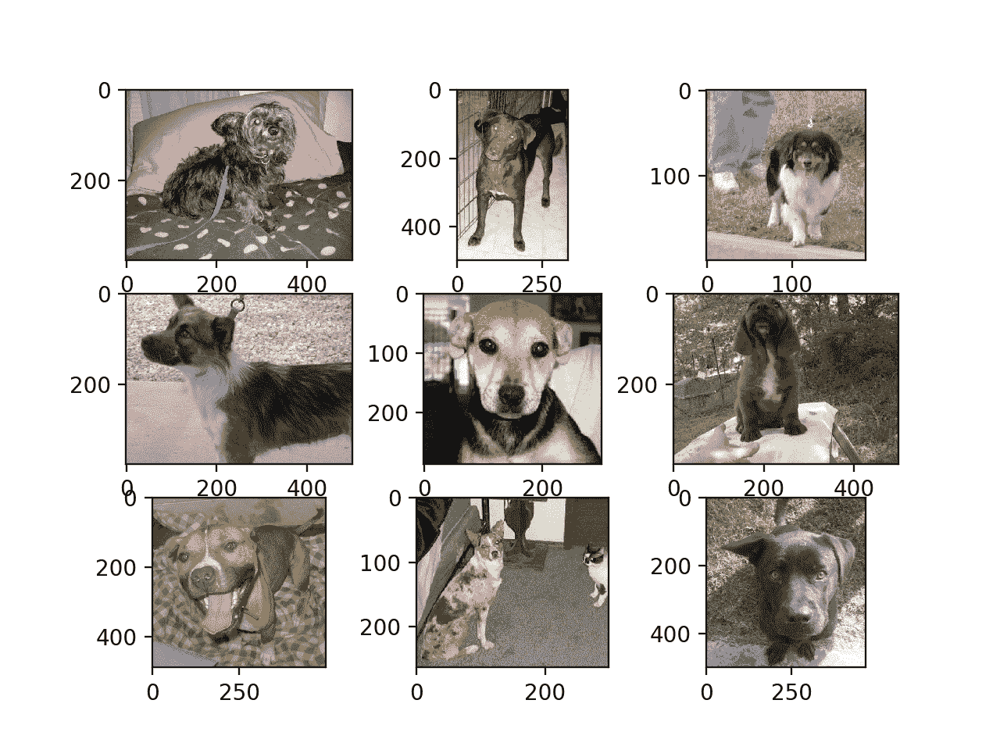
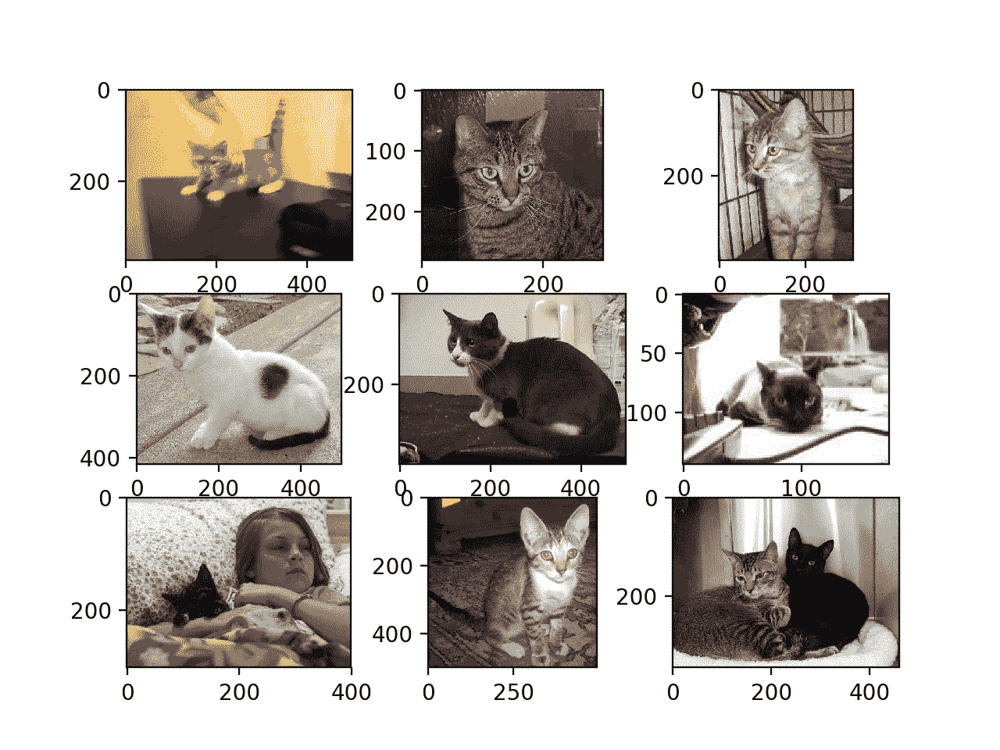
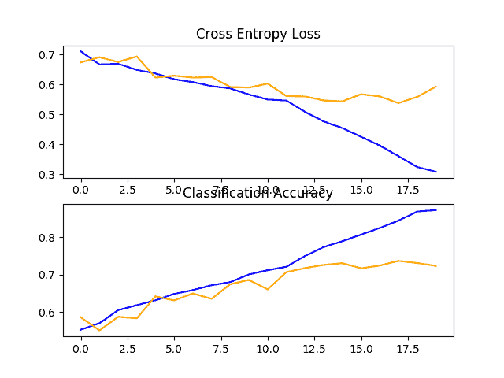
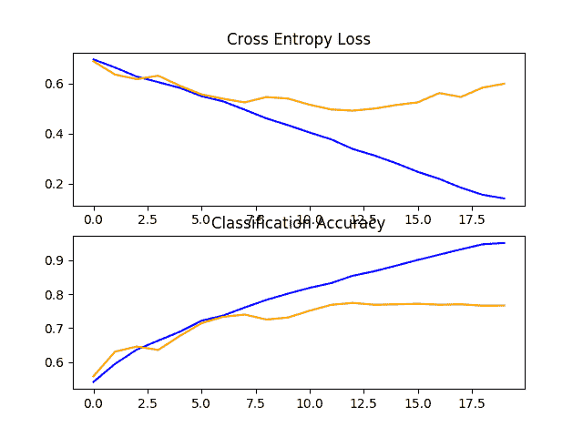
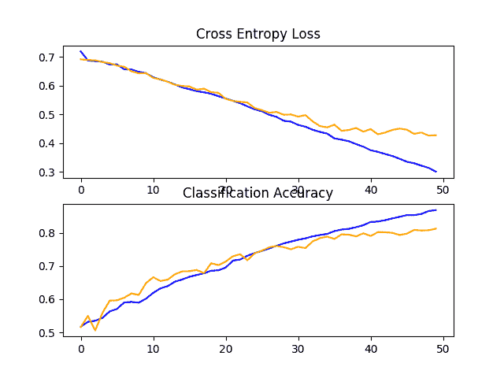
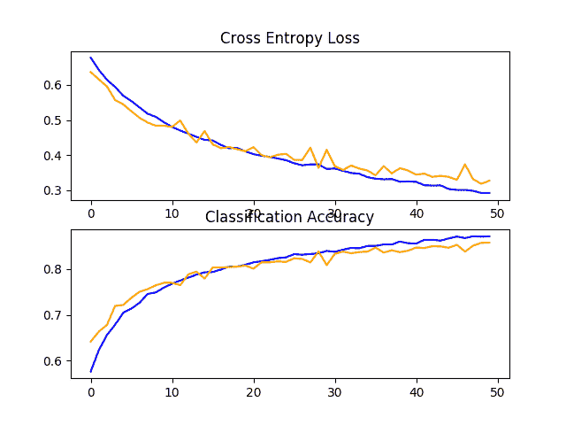
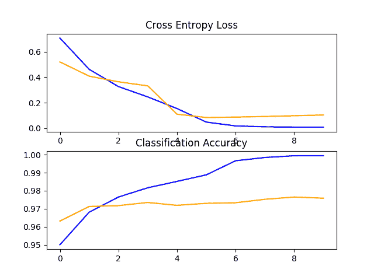
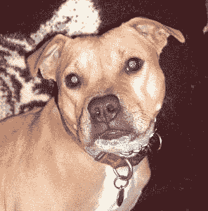

# 如何分类猫狗照片（准确率 97%）

> 原文：<https://machinelearningmastery.com/how-to-develop-a-convolutional-neural-network-to-classify-photos-of-dogs-and-cats/>

最后更新于 2021 年 12 月 8 日

#### 逐步开发深度卷积神经网络对狗和猫的照片进行分类

狗与猫数据集是一个标准的计算机视觉数据集，包括将照片分类为包含狗或猫。

虽然这个问题听起来很简单，但它只是在过去几年中使用深度学习卷积神经网络得到了有效解决。在数据集得到有效解决的同时，它可以作为学习和实践如何从零开始开发、评估和使用卷积深度学习神经网络进行图像分类的基础。

这包括如何开发一个健壮的测试工具来评估模型的表现，如何探索模型的改进，以及如何保存模型并在以后加载它来对新数据进行预测。

在本教程中，您将发现如何开发一个卷积神经网络来对狗和猫的照片进行分类。

完成本教程后，您将知道:

*   如何加载和准备狗和猫的照片进行建模？
*   如何从零开始开发卷积神经网络进行照片分类并提高模型表现？
*   如何利用迁移学习开发照片分类模型？

**用我的新书[计算机视觉深度学习](https://machinelearningmastery.com/deep-learning-for-computer-vision/)启动你的项目**，包括*分步教程*和所有示例的 *Python 源代码*文件。

我们开始吧。

*   **2019 年 10 月更新**:针对 Keras 2.3 和 TensorFlow 2.0 更新。
*   **2021 年 12 月更新**:修复“预处理照片尺寸(可选)”部分代码中的错别字


如何开发卷积神经网络来对狗和猫的照片进行分类
照片作者:[科恩·范德维尔德](https://www.flickr.com/photos/cohenvandervelde/24578441890/)，版权所有。

## 教程概述

本教程分为六个部分；它们是:

1.  狗与猫的预测问题
2.  狗与猫数据集准备
3.  开发一个基线有线电视新闻网模型
4.  开发模型改进
5.  探索迁移学习
6.  如何最终确定模型并做出预测

## 狗与猫的预测问题

狗 vs 猫数据集是指 2013 年举行的 Kaggle 机器学习竞赛中使用的数据集。

数据集由狗和猫的照片组成，这些照片是从 300 万张手动注释照片的更大数据集中提供的照片子集。该数据集是 Petfinder.com 和微软合作开发的。

该数据集最初被用作验证码(或完全自动的公共图灵测试，以区分计算机和人类)，即一项被认为是人类发现微不足道但机器无法解决的任务，用于网站上区分人类用户和机器人。具体来说，该任务被称为“限制访问的动物物种图像识别”，这是验证码的一种。这项任务在 2007 年的论文《T2·阿西拉:利用兴趣对齐的手动图像分类的验证码》中有所描述。

> 我们展示了阿西拉，一种验证码，要求用户从一组 12 张猫和狗的照片中识别猫。Asirra 对用户来说很容易；用户研究表明，人类可以在 30 秒内解决 99.6%的问题。除非机器视觉取得重大进展，否则我们预计计算机解决这个问题的可能性不会超过 1/54，000。

——[Asirra:利用兴趣对齐的手动图像分类的验证码](https://www.microsoft.com/en-us/research/publication/asirra-a-captcha-that-exploits-interest-aligned-manual-image-categorization/)，2007。

在比赛发布时，最先进的结果是通过一个 SVM 实现的，并在 2007 年的一篇论文中进行了描述，该论文的标题为“对阿西拉验证码的机器学习攻击”([PDF](http://xenon.stanford.edu/~pgolle/papers/dogcat.pdf))达到了 80%的分类准确率。正是这篇论文证明了在任务被提出后不久，该任务就不再是适合验证码的任务。

> ……我们描述了一个分类器，它在区分在 Asirra 中使用的猫和狗的图像方面有 82.7%的准确性。该分类器是基于从图像中提取的颜色和纹理特征训练的支持向量机分类器的组合。[……]我们的结果表明，不要在没有保障措施的情况下部署阿西拉。

——[针对 Asirra 验证码的机器学习攻击](https://dl.acm.org/citation.cfm?id=1455838)，2007 年。

卡格尔竞赛提供了 25000 张贴有标签的照片:12500 只狗和同样数量的猫。然后需要对 12，500 张未标记照片的测试数据集进行预测。比赛由皮埃尔·塞马奈(目前是谷歌大脑的一名研究科学家)赢得，他在 70%的测试数据集子样本上获得了大约 98.914%的分类准确率。他的方法后来被描述为 2013 年论文的一部分，题为“T2 超吃:使用卷积网络的集成识别、定位和检测”

数据集很容易理解，并且小到可以放入内存。因此，当初学者开始使用卷积神经网络时，它已经成为一个很好的“*你好世界*”或“*入门*”计算机视觉数据集。

因此，在此任务中，使用手动设计的卷积神经网络达到大约 80%的准确率和使用[转移学习](https://machinelearningmastery.com/how-to-use-transfer-learning-when-developing-convolutional-neural-network-models/)达到 90%+的准确率是常规的。

## 狗与猫数据集准备

数据集可以从 Kaggle 网站免费下载，虽然我相信你一定有 Kaggle 账号。

如果您没有 Kaggle 帐户，请先注册。

通过[访问犬猫数据页面](https://www.kaggle.com/c/dogs-vs-cats/data)下载数据集，点击*全部下载*按钮。

这会将 850 兆字节的文件“ *dogs-vs-cats.zip* ”下载到你的工作站。

解压文件，你会看到*列车. zip* 、*列车 1.zip* 和一个*。csv* 文件。解压缩 *train.zip* 文件，因为我们将只关注这个数据集。

现在，您将拥有一个名为“ *train/* ”的文件夹，其中包含 25，000 个。狗和猫的 jpg 文件。这些照片是用它们的文件名标注的，带有“T2”狗“T3”或“T4”猫“T5”的字样。文件命名约定如下:

```py
cat.0.jpg
...
cat.124999.jpg
dog.0.jpg
dog.124999.jpg
```

### 绘制狗和猫的照片

在目录里随便看几张照片，可以看到照片是彩色的，形状大小不一。

例如，让我们将狗的前九张照片加载并绘制成一个图形。

下面列出了完整的示例。

```py
# plot dog photos from the dogs vs cats dataset
from matplotlib import pyplot
from matplotlib.image import imread
# define location of dataset
folder = 'train/'
# plot first few images
for i in range(9):
	# define subplot
	pyplot.subplot(330 + 1 + i)
	# define filename
	filename = folder + 'dog.' + str(i) + '.jpg'
	# load image pixels
	image = imread(filename)
	# plot raw pixel data
	pyplot.imshow(image)
# show the figure
pyplot.show()
```

运行该示例会创建一个图表，显示数据集中狗的前九张照片。

我们可以看到有些照片是风景格式的，有些是人像格式的，有些是方形的。



狗与猫数据集中狗的前九张照片图

我们可以更新示例，改为绘制猫咪照片；下面列出了完整的示例。

```py
# plot cat photos from the dogs vs cats dataset
from matplotlib import pyplot
from matplotlib.image import imread
# define location of dataset
folder = 'train/'
# plot first few images
for i in range(9):
	# define subplot
	pyplot.subplot(330 + 1 + i)
	# define filename
	filename = folder + 'cat.' + str(i) + '.jpg'
	# load image pixels
	image = imread(filename)
	# plot raw pixel data
	pyplot.imshow(image)
# show the figure
pyplot.show()
```

同样，我们可以看到照片都是不同的尺寸。

我们还可以看到一张猫几乎看不见的照片(左下角)和另一张有两只猫的照片(右下角)。这表明任何适合这个问题的分类器都必须是健壮的。



狗与猫数据集中猫的前九张照片图

### 选择标准化照片尺寸

这些照片必须在建模前进行重塑，以便所有图像具有相同的形状。这通常是一个小正方形图像。

有许多方法可以实现这一点，尽管最常见的是一个简单的调整大小操作，它将拉伸和变形每个图像的纵横比，并强制将其转换为新的形状。

我们可以加载所有照片，查看照片宽度和高度的分布，然后设计一个新的照片大小，最好地反映我们在实践中最有可能看到的内容。

较小的输入意味着模型的训练速度更快，通常这种考虑主导了图像尺寸的选择。在这种情况下，我们将遵循这种方法，选择 200×200 像素的固定大小。

### 预处理照片尺寸(可选)

如果我们想将所有图像加载到内存中，我们可以估计它需要大约 12gb 的内存。

即 25，000 幅图像，每幅图像 200x200x3 像素，即 3，000，000，000 个 32 位像素值。

我们可以加载所有的图像，重塑它们，并将它们存储为一个 NumPy 数组。这可以放入许多现代机器的内存中，但不是全部，尤其是如果你只有 8gb 的空间。

我们可以编写自定义代码将图像加载到内存中，并在加载过程中调整它们的大小，然后保存它们以备建模。

下面的示例使用 Keras 图像处理 API 加载训练数据集中的所有 25，000 张照片，并将其重塑为 200×200 平方的照片。标签也是根据文件名为每张照片确定的。然后保存一组照片和标签。

```py
# load dogs vs cats dataset, reshape and save to a new file
from os import listdir
from numpy import asarray
from numpy import save
from keras.preprocessing.image import load_img
from keras.preprocessing.image import img_to_array
# define location of dataset
folder = 'train/'
photos, labels = list(), list()
# enumerate files in the directory
for file in listdir(folder):
	# determine class
	output = 0.0
	if file.startswith('dog'):
		output = 1.0
	# load image
	photo = load_img(folder + file, target_size=(200, 200))
	# convert to numpy array
	photo = img_to_array(photo)
	# store
	photos.append(photo)
	labels.append(output)
# convert to a numpy arrays
photos = asarray(photos)
labels = asarray(labels)
print(photos.shape, labels.shape)
# save the reshaped photos
save('dogs_vs_cats_photos.npy', photos)
save('dogs_vs_cats_labels.npy', labels)
```

运行该示例可能需要大约一分钟的时间将所有图像加载到内存中，并打印加载数据的形状，以确认其加载正确。

**注意**:运行这个例子假设你有超过 12gb 的内存。如果没有足够的内存，可以跳过这个例子；它仅作为演示提供。

```py
(25000, 200, 200, 3) (25000,)
```

运行结束时，将创建两个名为“*dogs _ vs _ cat _ photos . npy*”和“*dogs _ vs _ cat _ labels . npy*的文件，其中包含所有调整大小的图像及其关联的类别标签。这些文件总共只有大约 12 千兆字节，加载速度比单个图像快得多。

准备好的数据可以直接加载；例如:

```py
# load and confirm the shape
from numpy import load
photos = load('dogs_vs_cats_photos.npy')
labels = load('dogs_vs_cats_labels.npy')
print(photos.shape, labels.shape)
```

### 将照片预处理到标准目录中

或者，我们可以使用 [Keras ImageDataGenerator 类](https://keras.io/preprocessing/image/)和*flow _ from _ directory()*API 逐步加载图像。这将会降低执行速度，但会在更多的机器上运行。

该 API 更倾向于将数据划分为单独的 *train/* 和 *test/* 目录，并且在每个目录下为每个类都有一个子目录，例如一个 *train/dog/* 和一个 *train/cat/* 子目录，同样用于测试。然后，图像被组织在子目录下。

我们可以编写一个脚本来创建具有这种首选结构的数据集副本。我们将随机选择 25%的图像(或 6，250 张)用于测试数据集。

首先，我们需要创建如下目录结构:

```py
dataset_dogs_vs_cats
├── test
│   ├── cats
│   └── dogs
└── train
    ├── cats
    └── dogs
```

我们可以使用 *makedirs()* 函数在 Python 中创建目录，并使用循环为 *train/* 和 *test/* 目录创建 *dog/* 和 *cat/* 子目录。

```py
# create directories
dataset_home = 'dataset_dogs_vs_cats/'
subdirs = ['train/', 'test/']
for subdir in subdirs:
	# create label subdirectories
	labeldirs = ['dogs/', 'cats/']
	for labldir in labeldirs:
		newdir = dataset_home + subdir + labldir
		makedirs(newdir, exist_ok=True)
```

接下来，我们可以枚举数据集中的所有图像文件，并根据它们的文件名将其复制到*狗/* 或*猫/* 子目录中。

此外，我们可以随机决定将 25%的图像保留在测试数据集中。这是通过固定伪随机数发生器的种子来实现的，这样我们每次运行代码时都会得到相同的数据分割。

```py
# seed random number generator
seed(1)
# define ratio of pictures to use for validation
val_ratio = 0.25
# copy training dataset images into subdirectories
src_directory = 'train/'
for file in listdir(src_directory):
	src = src_directory + '/' + file
	dst_dir = 'train/'
	if random() < val_ratio:
		dst_dir = 'test/'
	if file.startswith('cat'):
		dst = dataset_home + dst_dir + 'cats/'  + file
		copyfile(src, dst)
	elif file.startswith('dog'):
		dst = dataset_home + dst_dir + 'dogs/'  + file
		copyfile(src, dst)
```

下面列出了完整的代码示例，并假设您已经将下载的 *train.zip* 中的图像解压缩到了 *train/* 中的当前工作目录中。

```py
# organize dataset into a useful structure
from os import makedirs
from os import listdir
from shutil import copyfile
from random import seed
from random import random
# create directories
dataset_home = 'dataset_dogs_vs_cats/'
subdirs = ['train/', 'test/']
for subdir in subdirs:
	# create label subdirectories
	labeldirs = ['dogs/', 'cats/']
	for labldir in labeldirs:
		newdir = dataset_home + subdir + labldir
		makedirs(newdir, exist_ok=True)
# seed random number generator
seed(1)
# define ratio of pictures to use for validation
val_ratio = 0.25
# copy training dataset images into subdirectories
src_directory = 'train/'
for file in listdir(src_directory):
	src = src_directory + '/' + file
	dst_dir = 'train/'
	if random() < val_ratio:
		dst_dir = 'test/'
	if file.startswith('cat'):
		dst = dataset_home + dst_dir + 'cats/'  + file
		copyfile(src, dst)
	elif file.startswith('dog'):
		dst = dataset_home + dst_dir + 'dogs/'  + file
		copyfile(src, dst)
```

运行示例后，您现在将拥有一个新的*dataset _ dogs _ vs _ cat/*目录，其中包含一个 *train/* 和 *val/* 子文件夹，此外 *dogs/* 还可以包含*cat/*子目录，与设计完全一致。

## 开发一个基线有线电视新闻网模型

在本节中，我们可以为狗和猫数据集开发一个基线卷积神经网络模型。

基线模型将建立一个最低的模型表现，我们所有的其他模型都可以与之进行比较，以及一个我们可以用作研究和改进基础的模型架构。

一个很好的起点是 VGG 模型的一般架构原则。这些是一个很好的起点，因为它们在 ILSVRC 2014 竞赛中取得了顶级的表现，并且因为体系结构的模块化结构易于理解和实现。有关 VGG 模型的更多详细信息，请参见 2015 年的论文“[用于大规模图像识别的超深度卷积网络](https://arxiv.org/abs/1409.1556)”

该架构包括堆叠卷积层和 3×3 小滤波器，然后是最大池层。这些层一起形成一个块，并且这些块可以重复，其中每个块中的过滤器的数量随着网络的深度而增加，例如对于模型的前四个块为 32、64、128、256。卷积层上使用填充，以确保输出要素图的高度和宽度形状与输入匹配。

我们可以在狗与猫的问题上探索这种体系结构，并将一个模型与具有 1、2 和 3 个块的这种体系结构进行比较。

每层将使用 [ReLU 激活功能](https://machinelearningmastery.com/rectified-linear-activation-function-for-deep-learning-neural-networks/)和 he 权重初始化，这通常是最佳实践。例如，一个 3 块 VGG 风格的体系结构，其中每个块都有一个卷积和池层，可以在 Keras 中定义如下:

```py
# block 1
model.add(Conv2D(32, (3, 3), activation='relu', kernel_initializer='he_uniform', padding='same', input_shape=(200, 200, 3)))
model.add(MaxPooling2D((2, 2)))
# block 2
model.add(Conv2D(64, (3, 3), activation='relu', kernel_initializer='he_uniform', padding='same'))
model.add(MaxPooling2D((2, 2)))
# block 3
model.add(Conv2D(128, (3, 3), activation='relu', kernel_initializer='he_uniform', padding='same'))
model.add(MaxPooling2D((2, 2)))
```

我们可以创建一个名为 *define_model()* 的函数，该函数将定义一个模型，并将其返回以准备好适应数据集。然后可以定制该功能来定义不同的基线模型，例如，具有 1、2 或 3 个 VGG 风格块的模型版本。

该模型将适用于随机梯度下降，我们将从 0.001 的保守学习率和 0.9 的动量开始。

这个问题是一个二进制分类任务，需要预测一个 0 或 1 的值。将使用具有 1 个节点和 sigmoid 激活的输出层，并将使用二元交叉熵损失函数优化模型。

下面是 *define_model()* 函数的一个例子，该函数用一个 vgg 类型的块来定义狗对猫问题的卷积神经网络模型。

```py
# define cnn model
def define_model():
	model = Sequential()
	model.add(Conv2D(32, (3, 3), activation='relu', kernel_initializer='he_uniform', padding='same', input_shape=(200, 200, 3)))
	model.add(MaxPooling2D((2, 2)))
	model.add(Flatten())
	model.add(Dense(128, activation='relu', kernel_initializer='he_uniform'))
	model.add(Dense(1, activation='sigmoid'))
	# compile model
	opt = SGD(lr=0.001, momentum=0.9)
	model.compile(optimizer=opt, loss='binary_crossentropy', metrics=['accuracy'])
	return model
```

可以根据需要调用它来准备模型，例如:

```py
# define model
model = define_model()
```

接下来，我们需要准备数据。

这包括首先定义*图像数据生成器*的实例，该实例将像素值缩放到 0-1 的范围。

```py
# create data generator
datagen = ImageDataGenerator(rescale=1.0/255.0)
```

接下来，需要为训练和测试数据集准备迭代器。

我们可以在数据生成器上使用 *flow_from_directory()* 函数，并为*列车/* 和*测试/* 目录各创建一个迭代器。我们必须通过“ *class_mode* ”参数指定问题为二值分类问题，并通过“ *target_size* ”参数加载 200×200 像素大小的图像。我们将把批量固定在 64。

```py
# prepare iterators
train_it = datagen.flow_from_directory('dataset_dogs_vs_cats/train/',
	class_mode='binary', batch_size=64, target_size=(200, 200))
test_it = datagen.flow_from_directory('dataset_dogs_vs_cats/test/',
	class_mode='binary', batch_size=64, target_size=(200, 200))
```

然后，我们可以使用训练迭代器( *train_it* )拟合模型，并在训练期间使用测试迭代器( *test_it* )作为验证数据集。

必须指定训练和测试迭代器的步数。这是构成一个纪元的批次数量。这可以通过每个迭代器的长度来指定，并且将是训练和测试目录中的图像总数除以批次大小(64)。

该模型将适合 20 个时代，这是一个很小的数字，用于检查模型是否能够学习问题。

```py
# fit model
history = model.fit_generator(train_it, steps_per_epoch=len(train_it),
	validation_data=test_it, validation_steps=len(test_it), epochs=20, verbose=0)
```

一旦拟合，最终模型可以直接在测试数据集上进行评估，并报告分类精度。

```py
# evaluate model
_, acc = model.evaluate_generator(test_it, steps=len(test_it), verbose=0)
print('> %.3f' % (acc * 100.0))
```

最后，我们可以创建一个存储在从调用 *fit_generator()* 返回的“ *history* ”目录中的训练期间收集的历史的图。

历史记录包含每个时期结束时测试和训练数据集的模型精度和损失。这些度量在训练时期的线图提供了学习曲线，我们可以用它来了解模型是过拟合、欠拟合还是拟合良好。

下面的*summary _ diagnostics()*函数获取历史目录，并创建一个单独的数字，一个是损失的线图，另一个是精度图。然后，图形被保存到一个文件中，该文件的文件名基于脚本的名称。如果我们希望评估不同文件中模型的许多变化，并为每个变化自动创建线图，这将非常有用。

```py
# plot diagnostic learning curves
def summarize_diagnostics(history):
	# plot loss
	pyplot.subplot(211)
	pyplot.title('Cross Entropy Loss')
	pyplot.plot(history.history['loss'], color='blue', label='train')
	pyplot.plot(history.history['val_loss'], color='orange', label='test')
	# plot accuracy
	pyplot.subplot(212)
	pyplot.title('Classification Accuracy')
	pyplot.plot(history.history['accuracy'], color='blue', label='train')
	pyplot.plot(history.history['val_accuracy'], color='orange', label='test')
	# save plot to file
	filename = sys.argv[0].split('/')[-1]
	pyplot.savefig(filename + '_plot.png')
	pyplot.close()
```

我们可以将所有这些结合到一个简单的测试工具中，用于测试模型配置。

下面列出了在狗和猫数据集上评估单块基线模型的完整示例。

```py
# baseline model for the dogs vs cats dataset
import sys
from matplotlib import pyplot
from keras.utils import to_categorical
from keras.models import Sequential
from keras.layers import Conv2D
from keras.layers import MaxPooling2D
from keras.layers import Dense
from keras.layers import Flatten
from keras.optimizers import SGD
from keras.preprocessing.image import ImageDataGenerator

# define cnn model
def define_model():
	model = Sequential()
	model.add(Conv2D(32, (3, 3), activation='relu', kernel_initializer='he_uniform', padding='same', input_shape=(200, 200, 3)))
	model.add(MaxPooling2D((2, 2)))
	model.add(Flatten())
	model.add(Dense(128, activation='relu', kernel_initializer='he_uniform'))
	model.add(Dense(1, activation='sigmoid'))
	# compile model
	opt = SGD(lr=0.001, momentum=0.9)
	model.compile(optimizer=opt, loss='binary_crossentropy', metrics=['accuracy'])
	return model

# plot diagnostic learning curves
def summarize_diagnostics(history):
	# plot loss
	pyplot.subplot(211)
	pyplot.title('Cross Entropy Loss')
	pyplot.plot(history.history['loss'], color='blue', label='train')
	pyplot.plot(history.history['val_loss'], color='orange', label='test')
	# plot accuracy
	pyplot.subplot(212)
	pyplot.title('Classification Accuracy')
	pyplot.plot(history.history['accuracy'], color='blue', label='train')
	pyplot.plot(history.history['val_accuracy'], color='orange', label='test')
	# save plot to file
	filename = sys.argv[0].split('/')[-1]
	pyplot.savefig(filename + '_plot.png')
	pyplot.close()

# run the test harness for evaluating a model
def run_test_harness():
	# define model
	model = define_model()
	# create data generator
	datagen = ImageDataGenerator(rescale=1.0/255.0)
	# prepare iterators
	train_it = datagen.flow_from_directory('dataset_dogs_vs_cats/train/',
		class_mode='binary', batch_size=64, target_size=(200, 200))
	test_it = datagen.flow_from_directory('dataset_dogs_vs_cats/test/',
		class_mode='binary', batch_size=64, target_size=(200, 200))
	# fit model
	history = model.fit_generator(train_it, steps_per_epoch=len(train_it),
		validation_data=test_it, validation_steps=len(test_it), epochs=20, verbose=0)
	# evaluate model
	_, acc = model.evaluate_generator(test_it, steps=len(test_it), verbose=0)
	print('> %.3f' % (acc * 100.0))
	# learning curves
	summarize_diagnostics(history)

# entry point, run the test harness
run_test_harness()
```

现在我们有了一个测试工具，让我们看看三个简单基线模型的评估。

### 单块 VGG 模型

单块 VGG 模型有一个带有 32 个滤波器的卷积层，后面是一个最大池层。

该模型的 *define_model()* 函数已在上一节中定义，但为了完整起见，下面再次提供。

```py
# define cnn model
def define_model():
	model = Sequential()
	model.add(Conv2D(32, (3, 3), activation='relu', kernel_initializer='he_uniform', padding='same', input_shape=(200, 200, 3)))
	model.add(MaxPooling2D((2, 2)))
	model.add(Flatten())
	model.add(Dense(128, activation='relu', kernel_initializer='he_uniform'))
	model.add(Dense(1, activation='sigmoid'))
	# compile model
	opt = SGD(lr=0.001, momentum=0.9)
	model.compile(optimizer=opt, loss='binary_crossentropy', metrics=['accuracy'])
	return model
```

运行此示例首先打印训练和测试数据集的大小，确认数据集加载正确。

然后对模型进行拟合和评估，在现代图形处理器硬件上大约需要 20 分钟。

```py
Found 18697 images belonging to 2 classes.
Found 6303 images belonging to 2 classes.
> 72.331
```

**注**:考虑到算法或评估程序的随机性，或数值精度的差异，您的[结果可能会有所不同](https://machinelearningmastery.com/different-results-each-time-in-machine-learning/)。考虑运行该示例几次，并比较平均结果。

在这种情况下，我们可以看到模型在测试数据集上达到了大约 72%的准确率。

还创建了一个图形，显示了列车(蓝色)和测试(橙色)数据集上的损耗线图和另一个模型精度图。

回顾这个图，我们可以看到模型在大约 12 个时期对训练数据集进行了过拟合。



狗和猫数据集上具有一个 VGG 块的基线模型的损失和精度学习曲线的线图

### 两块 VGG 模型

双块 VGG 模型扩展了一个块模型，并添加了具有 64 个过滤器的第二个块。

为了完整起见，下面提供了该模型的 *define_model()* 函数。

```py
# define cnn model
def define_model():
	model = Sequential()
	model.add(Conv2D(32, (3, 3), activation='relu', kernel_initializer='he_uniform', padding='same', input_shape=(200, 200, 3)))
	model.add(MaxPooling2D((2, 2)))
	model.add(Conv2D(64, (3, 3), activation='relu', kernel_initializer='he_uniform', padding='same'))
	model.add(MaxPooling2D((2, 2)))
	model.add(Flatten())
	model.add(Dense(128, activation='relu', kernel_initializer='he_uniform'))
	model.add(Dense(1, activation='sigmoid'))
	# compile model
	opt = SGD(lr=0.001, momentum=0.9)
	model.compile(optimizer=opt, loss='binary_crossentropy', metrics=['accuracy'])
	return model
```

再次运行此示例将打印训练和测试数据集的大小，确认数据集加载正确。

对模型进行拟合和评估，并报告测试数据集上的表现。

```py
Found 18697 images belonging to 2 classes.
Found 6303 images belonging to 2 classes.
> 76.646
```

**注**:考虑到算法或评估程序的随机性，或数值精度的差异，您的[结果可能会有所不同](https://machinelearningmastery.com/different-results-each-time-in-machine-learning/)。考虑运行该示例几次，并比较平均结果。

在这种情况下，我们可以看到，该模型在表现上实现了小幅提升，从一个块的约 72%提升到两个块的约 76%

回顾学习曲线的曲线，我们可以再次看到，模型似乎过度填充了训练数据集，也许更快，在这种情况下，大约在八个训练时期。

这可能是模型容量增加的结果，我们可能预计这种更快过拟合的趋势会在下一个模型中继续。



狗和猫数据集上具有两个 VGG 块的基线模型的损失和精度学习曲线的线图

### 三块 VGG 模型

三块 VGG 模型扩展了两块模型，并添加了具有 128 个滤波器的第三块。

该模型的 *define_model()* 函数已在上一节中定义，但为了完整起见，下面再次提供。

```py
# define cnn model
def define_model():
	model = Sequential()
	model.add(Conv2D(32, (3, 3), activation='relu', kernel_initializer='he_uniform', padding='same', input_shape=(200, 200, 3)))
	model.add(MaxPooling2D((2, 2)))
	model.add(Conv2D(64, (3, 3), activation='relu', kernel_initializer='he_uniform', padding='same'))
	model.add(MaxPooling2D((2, 2)))
	model.add(Conv2D(128, (3, 3), activation='relu', kernel_initializer='he_uniform', padding='same'))
	model.add(MaxPooling2D((2, 2)))
	model.add(Flatten())
	model.add(Dense(128, activation='relu', kernel_initializer='he_uniform'))
	model.add(Dense(1, activation='sigmoid'))
	# compile model
	opt = SGD(lr=0.001, momentum=0.9)
	model.compile(optimizer=opt, loss='binary_crossentropy', metrics=['accuracy'])
	return model
```

运行此示例将打印训练和测试数据集的大小，确认数据集已正确加载。

对模型进行拟合和评估，并报告测试数据集上的表现。

```py
Found 18697 images belonging to 2 classes.
Found 6303 images belonging to 2 classes.
> 80.184
```

**注**:考虑到算法或评估程序的随机性，或数值精度的差异，您的[结果可能会有所不同](https://machinelearningmastery.com/different-results-each-time-in-machine-learning/)。考虑运行该示例几次，并比较平均结果。

在这种情况下，我们可以看到，我们实现了表现的进一步提升，从两个模块的 76%左右提升到三个模块的 80%左右。这个结果是好的，因为它接近于该论文中使用 SVM 以大约 82%的准确度报道的现有技术水平。

回顾学习曲线的曲线，我们可以看到类似的过拟合的趋势，在这种情况下，也许可以追溯到五六世纪。


狗和猫数据集上具有三个 VGG 块的基线模型的损失和精度学习曲线的线图

## 讨论

我们探索了基于 VGG 架构的三种不同模式。

结果可以总结如下，尽管我们必须假设这些结果中存在一些方差，因为算法具有随机性:

*   **vgg 1**:72 331%
*   **vgg 2**:76 646%
*   **VGG 3** : 80，184%

随着容量的增加，我们看到了表现提高的趋势，但在运行中也出现了越来越早的过拟合的类似情况。

结果表明，该模型将可能受益于正则化技术。这可能包括技术，如丢弃，权重下降，和数据增加。后者还可以通过扩展训练数据集来鼓励模型学习位置不变的特征，从而提高表现。

## 开发模型改进

在上一节中，我们使用 VGG 风格的模块开发了一个基线模型，并发现了随着模型容量的增加而提高表现的趋势。

在本节中，我们将从具有三个 VGG 区块(即 VGG 3)的基线模型开始，并探索模型的一些简单改进。

从训练期间查看模型的学习曲线来看，模型显示出强烈的过拟合迹象。我们可以探索两种方法来尝试解决这种过拟合的问题:[丢弃正规化](https://machinelearningmastery.com/how-to-reduce-overfitting-with-dropout-regularization-in-keras/)和[数据增加](https://machinelearningmastery.com/image-augmentation-deep-learning-keras/)。

这两种方法都有望减缓训练过程中的改进速度，并有望对抗训练数据集的[过拟合。因此，我们将训练阶段的数量从 20 个增加到 50 个，以给模型更多的细化空间。](https://machinelearningmastery.com/introduction-to-regularization-to-reduce-overfitting-and-improve-generalization-error/)

## 丢弃正规化

脱落正则化是一种计算量小的正则化深度神经网络的方法。

丢弃的工作原理是从概率上移除，或者“T0”从“T1”中移除，输入到一个层，该层可以是数据样本中的输入变量或者来自前一层的激活。它具有模拟大量具有非常不同的网络结构的网络的效果，并且反过来使得网络中的节点通常对输入更加鲁棒。

有关丢弃的更多信息，请参阅帖子:

*   [如何利用 Keras 中的丢弃正则化减少过拟合](https://machinelearningmastery.com/how-to-reduce-overfitting-with-dropout-regularization-in-keras/)

通常，每个 VGG 模块后可以施加少量压降，更多压降施加于模型输出层附近的全连接层。

下面是添加了 Dropout 的基线模型的更新版本的 *define_model()* 函数。在这种情况下，在每个 VGG 块之后应用 20%的丢失率，在模型的分类器部分的完全连接层之后应用更大的 50%的丢失率。

```py
# define cnn model
def define_model():
	model = Sequential()
	model.add(Conv2D(32, (3, 3), activation='relu', kernel_initializer='he_uniform', padding='same', input_shape=(200, 200, 3)))
	model.add(MaxPooling2D((2, 2)))
	model.add(Dropout(0.2))
	model.add(Conv2D(64, (3, 3), activation='relu', kernel_initializer='he_uniform', padding='same'))
	model.add(MaxPooling2D((2, 2)))
	model.add(Dropout(0.2))
	model.add(Conv2D(128, (3, 3), activation='relu', kernel_initializer='he_uniform', padding='same'))
	model.add(MaxPooling2D((2, 2)))
	model.add(Dropout(0.2))
	model.add(Flatten())
	model.add(Dense(128, activation='relu', kernel_initializer='he_uniform'))
	model.add(Dropout(0.5))
	model.add(Dense(1, activation='sigmoid'))
	# compile model
	opt = SGD(lr=0.001, momentum=0.9)
	model.compile(optimizer=opt, loss='binary_crossentropy', metrics=['accuracy'])
	return model
```

为了完整起见，下面列出了基线模型的完整代码列表，并在犬猫数据集上增加了 drop。

```py
# baseline model with dropout for the dogs vs cats dataset
import sys
from matplotlib import pyplot
from keras.utils import to_categorical
from keras.models import Sequential
from keras.layers import Conv2D
from keras.layers import MaxPooling2D
from keras.layers import Dense
from keras.layers import Flatten
from keras.layers import Dropout
from keras.optimizers import SGD
from keras.preprocessing.image import ImageDataGenerator

# define cnn model
def define_model():
	model = Sequential()
	model.add(Conv2D(32, (3, 3), activation='relu', kernel_initializer='he_uniform', padding='same', input_shape=(200, 200, 3)))
	model.add(MaxPooling2D((2, 2)))
	model.add(Dropout(0.2))
	model.add(Conv2D(64, (3, 3), activation='relu', kernel_initializer='he_uniform', padding='same'))
	model.add(MaxPooling2D((2, 2)))
	model.add(Dropout(0.2))
	model.add(Conv2D(128, (3, 3), activation='relu', kernel_initializer='he_uniform', padding='same'))
	model.add(MaxPooling2D((2, 2)))
	model.add(Dropout(0.2))
	model.add(Flatten())
	model.add(Dense(128, activation='relu', kernel_initializer='he_uniform'))
	model.add(Dropout(0.5))
	model.add(Dense(1, activation='sigmoid'))
	# compile model
	opt = SGD(lr=0.001, momentum=0.9)
	model.compile(optimizer=opt, loss='binary_crossentropy', metrics=['accuracy'])
	return model

# plot diagnostic learning curves
def summarize_diagnostics(history):
	# plot loss
	pyplot.subplot(211)
	pyplot.title('Cross Entropy Loss')
	pyplot.plot(history.history['loss'], color='blue', label='train')
	pyplot.plot(history.history['val_loss'], color='orange', label='test')
	# plot accuracy
	pyplot.subplot(212)
	pyplot.title('Classification Accuracy')
	pyplot.plot(history.history['accuracy'], color='blue', label='train')
	pyplot.plot(history.history['val_accuracy'], color='orange', label='test')
	# save plot to file
	filename = sys.argv[0].split('/')[-1]
	pyplot.savefig(filename + '_plot.png')
	pyplot.close()

# run the test harness for evaluating a model
def run_test_harness():
	# define model
	model = define_model()
	# create data generator
	datagen = ImageDataGenerator(rescale=1.0/255.0)
	# prepare iterator
	train_it = datagen.flow_from_directory('dataset_dogs_vs_cats/train/',
		class_mode='binary', batch_size=64, target_size=(200, 200))
	test_it = datagen.flow_from_directory('dataset_dogs_vs_cats/test/',
		class_mode='binary', batch_size=64, target_size=(200, 200))
	# fit model
	history = model.fit_generator(train_it, steps_per_epoch=len(train_it),
		validation_data=test_it, validation_steps=len(test_it), epochs=50, verbose=0)
	# evaluate model
	_, acc = model.evaluate_generator(test_it, steps=len(test_it), verbose=0)
	print('> %.3f' % (acc * 100.0))
	# learning curves
	summarize_diagnostics(history)

# entry point, run the test harness
run_test_harness()
```

运行该示例首先适合模型，然后在等待测试数据集上报告模型表现。

**注**:考虑到算法或评估程序的随机性，或数值精度的差异，您的[结果可能会有所不同](https://machinelearningmastery.com/different-results-each-time-in-machine-learning/)。考虑运行该示例几次，并比较平均结果。

在这种情况下，我们可以看到模型表现的小幅提升，从基线模型的 80%左右的精度提升到增加了脱落的 81%左右。

```py
Found 18697 images belonging to 2 classes.
Found 6303 images belonging to 2 classes.
> 81.279
```

回顾学习曲线，我们可以看到丢弃对模型在训练集和测试集上的改进速度都有影响。

过拟合已经减少或延迟，尽管表现可能在接近运行结束时开始停滞。

结果表明，进一步的训练阶段可能导致模型的进一步改进。除了训练时期的增加之外，探索 VGG 街区之后稍高的丢弃率也可能是有趣的。



犬猫数据集上缺失基线模型的损失和精度学习曲线的线图

### 图像数据增长

图像数据扩充是一种技术，可用于通过在数据集中创建图像的修改版本来人工扩展训练数据集的大小。

在更多的数据上训练深度学习神经网络模型可以产生更熟练的模型，并且增强技术可以创建图像的变化，这可以提高拟合模型将他们所学知识推广到新图像的能力。

数据扩充也可以作为一种正则化技术，向训练数据添加噪声，并鼓励模型学习相同的特征，这些特征在输入中的位置是不变的。

对狗和猫的输入照片进行一些小的改变可能对这个问题有用，比如小的移动和水平翻转。这些扩充可以被指定为用于训练数据集的 ImageDataGenerator 的参数。增强不应用于测试数据集，因为我们希望在未修改的照片上评估模型的表现。

这要求我们为训练和测试数据集有一个单独的 ImageDataGenerator 实例，然后为从各自的数据生成器创建的训练和测试集有迭代器。例如:

```py
# create data generators
train_datagen = ImageDataGenerator(rescale=1.0/255.0,
	width_shift_range=0.1, height_shift_range=0.1, horizontal_flip=True)
test_datagen = ImageDataGenerator(rescale=1.0/255.0)
# prepare iterators
train_it = train_datagen.flow_from_directory('dataset_dogs_vs_cats/train/',
	class_mode='binary', batch_size=64, target_size=(200, 200))
test_it = test_datagen.flow_from_directory('dataset_dogs_vs_cats/test/',
	class_mode='binary', batch_size=64, target_size=(200, 200))
```

在这种情况下，训练数据集中的照片将通过小的(10%)随机水平和垂直移动以及创建照片镜像的随机水平翻转进行增强。训练和测试步骤中的照片将以相同的方式缩放其像素值。

为了完整起见，下面列出了带有狗和猫数据集训练数据扩充的基线模型的完整代码列表。

```py
# baseline model with data augmentation for the dogs vs cats dataset
import sys
from matplotlib import pyplot
from keras.utils import to_categorical
from keras.models import Sequential
from keras.layers import Conv2D
from keras.layers import MaxPooling2D
from keras.layers import Dense
from keras.layers import Flatten
from keras.optimizers import SGD
from keras.preprocessing.image import ImageDataGenerator

# define cnn model
def define_model():
	model = Sequential()
	model.add(Conv2D(32, (3, 3), activation='relu', kernel_initializer='he_uniform', padding='same', input_shape=(200, 200, 3)))
	model.add(MaxPooling2D((2, 2)))
	model.add(Conv2D(64, (3, 3), activation='relu', kernel_initializer='he_uniform', padding='same'))
	model.add(MaxPooling2D((2, 2)))
	model.add(Conv2D(128, (3, 3), activation='relu', kernel_initializer='he_uniform', padding='same'))
	model.add(MaxPooling2D((2, 2)))
	model.add(Flatten())
	model.add(Dense(128, activation='relu', kernel_initializer='he_uniform'))
	model.add(Dense(1, activation='sigmoid'))
	# compile model
	opt = SGD(lr=0.001, momentum=0.9)
	model.compile(optimizer=opt, loss='binary_crossentropy', metrics=['accuracy'])
	return model

# plot diagnostic learning curves
def summarize_diagnostics(history):
	# plot loss
	pyplot.subplot(211)
	pyplot.title('Cross Entropy Loss')
	pyplot.plot(history.history['loss'], color='blue', label='train')
	pyplot.plot(history.history['val_loss'], color='orange', label='test')
	# plot accuracy
	pyplot.subplot(212)
	pyplot.title('Classification Accuracy')
	pyplot.plot(history.history['accuracy'], color='blue', label='train')
	pyplot.plot(history.history['val_accuracy'], color='orange', label='test')
	# save plot to file
	filename = sys.argv[0].split('/')[-1]
	pyplot.savefig(filename + '_plot.png')
	pyplot.close()

# run the test harness for evaluating a model
def run_test_harness():
	# define model
	model = define_model()
	# create data generators
	train_datagen = ImageDataGenerator(rescale=1.0/255.0,
		width_shift_range=0.1, height_shift_range=0.1, horizontal_flip=True)
	test_datagen = ImageDataGenerator(rescale=1.0/255.0)
	# prepare iterators
	train_it = train_datagen.flow_from_directory('dataset_dogs_vs_cats/train/',
		class_mode='binary', batch_size=64, target_size=(200, 200))
	test_it = test_datagen.flow_from_directory('dataset_dogs_vs_cats/test/',
		class_mode='binary', batch_size=64, target_size=(200, 200))
	# fit model
	history = model.fit_generator(train_it, steps_per_epoch=len(train_it),
		validation_data=test_it, validation_steps=len(test_it), epochs=50, verbose=0)
	# evaluate model
	_, acc = model.evaluate_generator(test_it, steps=len(test_it), verbose=0)
	print('> %.3f' % (acc * 100.0))
	# learning curves
	summarize_diagnostics(history)

# entry point, run the test harness
run_test_harness()
```

运行该示例首先适合模型，然后在等待测试数据集上报告模型表现。

**注**:考虑到算法或评估程序的随机性，或数值精度的差异，您的[结果可能会有所不同](https://machinelearningmastery.com/different-results-each-time-in-machine-learning/)。考虑运行该示例几次，并比较平均结果。

在这种情况下，我们可以看到表现提升了大约 5%，从基线模型的大约 80%提升到具有简单数据增加的基线模型的大约 85%。

```py
> 85.816
```

回顾学习曲线，我们可以看到该模型似乎能够进一步学习，即使在运行结束时，训练和测试数据集上的损失仍在减少。用 100 个或更多的时代重复这个实验很可能会产生一个表现更好的模型。

探索可以进一步鼓励学习不随其在输入中的位置而变化的特征的其他扩展可能是有趣的，例如微小的旋转和缩放。



狗和猫数据集上具有数据增加的基线模型的损失和精度学习曲线的线图

### 讨论

我们对基线模型进行了三种不同的改进。

结果可以总结如下，尽管我们必须假设这些结果中存在一些方差，因为算法具有随机性:

*   **基线 VGG3** +丢弃率:81.279%
*   **基线 VGG3** +数据增加:85 816

正如所怀疑的那样，正则化技术的加入减缓了学习算法的进程，减少了过拟合，从而提高了保持数据集的表现。这两种方法的结合以及训练时期数量的进一步增加很可能会导致进一步的改进。

这只是可以在这个数据集上探索的改进类型的开始。除了对所描述的正则化方法进行调整之外，还可以探索其他正则化方法，例如[权重衰减](https://machinelearningmastery.com/how-to-reduce-overfitting-in-deep-learning-with-weight-regularization/)和[提前停止](https://machinelearningmastery.com/how-to-stop-training-deep-neural-networks-at-the-right-time-using-early-stopping/)。

可能值得探索学习算法的变化，例如[学习率](https://machinelearningmastery.com/understand-the-dynamics-of-learning-rate-on-deep-learning-neural-networks/)的变化，学习率时间表的使用，或者自适应学习率，例如[亚当](https://machinelearningmastery.com/adam-optimization-algorithm-for-deep-learning/)。

替代模型架构也值得探索。所选的基准模型预计会提供比解决此问题所需的更多的容量，较小的模型可能会更快地进行训练，从而提高表现。

## 探索迁移学习

迁移学习涉及使用在相关任务上训练的模型的全部或部分。

Keras 提供了一系列预先训练好的模型，可以通过 [Keras 应用 API](https://keras.io/applications/) 全部或部分加载和使用。

迁移学习的一个有用模型是 VGG 模型之一，例如 VGG-16，它有 16 层，在开发时，在 ImageNet 照片分类挑战中取得了顶级表现。

该模型由两个主要部分组成，模型的特征提取器部分由 VGG 块组成，模型的分类器部分由完全连接的层和输出层组成。

我们可以使用模型的特征提取部分，并添加一个新的分类器部分的模型，这是量身定制的狗和猫数据集。具体来说，我们可以在训练过程中保持所有卷积层的权重固定，只训练新的完全连接的层，这些层将学习解释从模型中提取的特征并进行二进制分类。

这可以通过加载 [VGG-16 模型](https://keras.io/applications/#vgg16)，从模型的输出端移除全连接层，然后添加新的全连接层来解释模型输出并进行预测来实现。通过将“ *include_top* ”参数设置为“ *False* ，可以自动移除模型的分类器部分，这也要求为模型指定输入的形状，在本例中为(224，224，3)。这意味着加载的模型在最后一个最大池层结束，之后我们可以手动添加一个*扁平化*层和新的 clasifier 层。

下面的 *define_model()* 函数实现了这一点，并返回一个准备训练的新模型。

```py
# define cnn model
def define_model():
	# load model
	model = VGG16(include_top=False, input_shape=(224, 224, 3))
	# mark loaded layers as not trainable
	for layer in model.layers:
		layer.trainable = False
	# add new classifier layers
	flat1 = Flatten()(model.layers[-1].output)
	class1 = Dense(128, activation='relu', kernel_initializer='he_uniform')(flat1)
	output = Dense(1, activation='sigmoid')(class1)
	# define new model
	model = Model(inputs=model.inputs, outputs=output)
	# compile model
	opt = SGD(lr=0.001, momentum=0.9)
	model.compile(optimizer=opt, loss='binary_crossentropy', metrics=['accuracy'])
	return model
```

一旦创建，我们就可以像以前一样在训练数据集上训练模型。

在这种情况下，不需要大量的训练，因为只有新的完全连接和输出层具有可训练的权重。因此，我们将把训练时期的数量固定在 10 个。

VGG16 模型在特定的 ImageNet 挑战数据集上进行了训练。因此，它被配置为期望输入图像具有 224×224 像素的形状。当从狗和猫的数据集中加载照片时，我们将使用这个作为目标大小。

该模型还希望图像居中。也就是说，从输入中减去在 ImageNet 训练数据集上计算的每个通道(红色、绿色和蓝色)的平均像素值。Keras 通过*预处理 _ 输入()*功能提供了一个为单个照片执行该准备的功能。然而，我们可以通过将“ *featurewise_center* ”参数设置为“ *True* ”并手动指定居中时使用的平均像素值作为来自 ImageNet 训练数据集的平均值来达到相同的效果:[123.68，116.779，103.939]。

下面列出了狗和猫数据集上用于迁移学习的 VGG 模型的完整代码列表。

```py
# vgg16 model used for transfer learning on the dogs and cats dataset
import sys
from matplotlib import pyplot
from keras.utils import to_categorical
from keras.applications.vgg16 import VGG16
from keras.models import Model
from keras.layers import Dense
from keras.layers import Flatten
from keras.optimizers import SGD
from keras.preprocessing.image import ImageDataGenerator

# define cnn model
def define_model():
	# load model
	model = VGG16(include_top=False, input_shape=(224, 224, 3))
	# mark loaded layers as not trainable
	for layer in model.layers:
		layer.trainable = False
	# add new classifier layers
	flat1 = Flatten()(model.layers[-1].output)
	class1 = Dense(128, activation='relu', kernel_initializer='he_uniform')(flat1)
	output = Dense(1, activation='sigmoid')(class1)
	# define new model
	model = Model(inputs=model.inputs, outputs=output)
	# compile model
	opt = SGD(lr=0.001, momentum=0.9)
	model.compile(optimizer=opt, loss='binary_crossentropy', metrics=['accuracy'])
	return model

# plot diagnostic learning curves
def summarize_diagnostics(history):
	# plot loss
	pyplot.subplot(211)
	pyplot.title('Cross Entropy Loss')
	pyplot.plot(history.history['loss'], color='blue', label='train')
	pyplot.plot(history.history['val_loss'], color='orange', label='test')
	# plot accuracy
	pyplot.subplot(212)
	pyplot.title('Classification Accuracy')
	pyplot.plot(history.history['accuracy'], color='blue', label='train')
	pyplot.plot(history.history['val_accuracy'], color='orange', label='test')
	# save plot to file
	filename = sys.argv[0].split('/')[-1]
	pyplot.savefig(filename + '_plot.png')
	pyplot.close()

# run the test harness for evaluating a model
def run_test_harness():
	# define model
	model = define_model()
	# create data generator
	datagen = ImageDataGenerator(featurewise_center=True)
	# specify imagenet mean values for centering
	datagen.mean = [123.68, 116.779, 103.939]
	# prepare iterator
	train_it = datagen.flow_from_directory('dataset_dogs_vs_cats/train/',
		class_mode='binary', batch_size=64, target_size=(224, 224))
	test_it = datagen.flow_from_directory('dataset_dogs_vs_cats/test/',
		class_mode='binary', batch_size=64, target_size=(224, 224))
	# fit model
	history = model.fit_generator(train_it, steps_per_epoch=len(train_it),
		validation_data=test_it, validation_steps=len(test_it), epochs=10, verbose=1)
	# evaluate model
	_, acc = model.evaluate_generator(test_it, steps=len(test_it), verbose=0)
	print('> %.3f' % (acc * 100.0))
	# learning curves
	summarize_diagnostics(history)

# entry point, run the test harness
run_test_harness()
```

运行该示例首先适合模型，然后在等待测试数据集上报告模型表现。

**注**:考虑到算法或评估程序的随机性，或数值精度的差异，您的[结果可能会有所不同](https://machinelearningmastery.com/different-results-each-time-in-machine-learning/)。考虑运行该示例几次，并比较平均结果。

在这种情况下，我们可以看到该模型在保持测试数据集上以大约 97%的分类准确率获得了非常令人印象深刻的结果。

```py
Found 18697 images belonging to 2 classes.
Found 6303 images belonging to 2 classes.
> 97.636
```

回顾学习曲线，我们可以看到模型很快拟合数据集。它没有表现出很强的过拟合，尽管结果表明，也许分类器的额外容量和/或正则化的使用可能是有帮助的。

对这种方法可以进行许多改进，包括向模型的分类器部分添加缺失正则化，甚至可能微调模型的特征检测器部分中的一些或所有层的权重。



狗和猫数据集上 VGG16 迁移学习模型的损失和精度学习曲线的线图

## 如何最终确定模型并做出预测

只要我们有想法，有时间和资源来测试，模型改进的过程可能会持续很长时间。

在某些时候，必须选择并采用最终的模型配置。在这种情况下，我们将保持事情简单，并使用 VGG-16 转移学习方法作为最终模型。

首先，我们将通过在整个训练数据集上拟合模型并将模型保存到文件中以备后用来最终确定我们的模型。然后，我们将加载保存的模型，并使用它对单个图像进行预测。

### 准备最终数据集

最终模型通常适合所有可用数据，例如所有训练和测试数据集的组合。

在本教程中，我们将仅在训练数据集上演示最终模型拟合，因为我们只有训练数据集的标签。

第一步是准备训练数据集，以便通过 *flow_from_directory()* 函数由 *ImageDataGenerator* 类加载。具体来说，我们需要创建一个新的目录，将所有训练图像组织到*狗/* 和*猫/* 子目录中，而不将其分离到*训练/* 或*测试/* 目录中。

这可以通过更新我们在教程开始时开发的脚本来实现。在这种情况下，我们将为整个训练数据集创建一个新的*finalize _ dogs _ vs _ cat/*文件夹，其中包含 *dogs/* 和*cat/*子文件夹。

结构如下所示:

```py
finalize_dogs_vs_cats
├── cats
└── dogs
```

为了完整起见，下面列出了更新后的脚本。

```py
# organize dataset into a useful structure
from os import makedirs
from os import listdir
from shutil import copyfile
# create directories
dataset_home = 'finalize_dogs_vs_cats/'
# create label subdirectories
labeldirs = ['dogs/', 'cats/']
for labldir in labeldirs:
	newdir = dataset_home + labldir
	makedirs(newdir, exist_ok=True)
# copy training dataset images into subdirectories
src_directory = 'dogs-vs-cats/train/'
for file in listdir(src_directory):
	src = src_directory + '/' + file
	if file.startswith('cat'):
		dst = dataset_home + 'cats/'  + file
		copyfile(src, dst)
	elif file.startswith('dog'):
		dst = dataset_home + 'dogs/'  + file
		copyfile(src, dst)
```

### 保存最终模型

我们现在准备在整个训练数据集上拟合最终模型。

必须更新 *flow_from_directory()* 以加载新的*finalize _ dogs _ vs _ cat/*目录中的所有图像。

```py
# prepare iterator
train_it = datagen.flow_from_directory('finalize_dogs_vs_cats/',
	class_mode='binary', batch_size=64, target_size=(224, 224))
```

此外，对 *fit_generator()* 的调用不再需要指定验证数据集。

```py
# fit model
model.fit_generator(train_it, steps_per_epoch=len(train_it), epochs=10, verbose=0)
```

一旦合适，我们可以通过调用模型上的 *save()* 函数将最终模型保存到一个 H5 文件中，并传入选择的文件名。

```py
# save model
model.save('final_model.h5')
```

注意，保存和加载 Keras 模型需要在您的工作站上安装 [h5py 库](https://www.h5py.org/)。

下面列出了在训练数据集上拟合最终模型并将其保存到文件中的完整示例。

```py
# save the final model to file
from keras.applications.vgg16 import VGG16
from keras.models import Model
from keras.layers import Dense
from keras.layers import Flatten
from keras.optimizers import SGD
from keras.preprocessing.image import ImageDataGenerator

# define cnn model
def define_model():
	# load model
	model = VGG16(include_top=False, input_shape=(224, 224, 3))
	# mark loaded layers as not trainable
	for layer in model.layers:
		layer.trainable = False
	# add new classifier layers
	flat1 = Flatten()(model.layers[-1].output)
	class1 = Dense(128, activation='relu', kernel_initializer='he_uniform')(flat1)
	output = Dense(1, activation='sigmoid')(class1)
	# define new model
	model = Model(inputs=model.inputs, outputs=output)
	# compile model
	opt = SGD(lr=0.001, momentum=0.9)
	model.compile(optimizer=opt, loss='binary_crossentropy', metrics=['accuracy'])
	return model

# run the test harness for evaluating a model
def run_test_harness():
# define model
	model = define_model()
	# create data generator
	datagen = ImageDataGenerator(featurewise_center=True)
	# specify imagenet mean values for centering
	datagen.mean = [123.68, 116.779, 103.939]
	# prepare iterator
	train_it = datagen.flow_from_directory('finalize_dogs_vs_cats/',
		class_mode='binary', batch_size=64, target_size=(224, 224))
	# fit model
	model.fit_generator(train_it, steps_per_epoch=len(train_it), epochs=10, verbose=0)
	# save model
	model.save('final_model.h5')

# entry point, run the test harness
run_test_harness()
```

运行此示例后，您将在当前工作目录中拥有一个名为“ *final_model.h5* ”的 81 兆字节大文件。

### 作出预测

我们可以使用保存的模型对新图像进行预测。

该模型假设新图像是彩色的，并且它们已经被分割，因此一幅图像至少包含一只狗或猫。

下面是从狗和猫比赛的测试数据集中提取的图像。它没有标签，但我们可以清楚地看出它是一张狗的照片。您可以将其保存在当前工作目录中，文件名为“ *sample_image.jpg* ”。



Dog (sample_image.jpg)

*   [下载狗狗照片(sample_image.jpg)](https://machinelearningmastery.com/wp-content/uploads/2019/03/sample_image.jpg)

我们将假装这是一个全新的、看不见的图像，按照要求的方式准备，看看我们如何使用保存的模型来预测图像所代表的整数。对于这个例子，我们期望类“ *1* ”为“*狗*”。

注意:图像的子目录，每个类一个，由 *flow_from_directory()* 函数按字母顺序加载，并为每个类分配一个整数。子目录“*猫*”在“*狗*之前，因此类标签被分配了整数:*猫=0，狗=1* 。这可以通过训练模型时调用 *flow_from_directory()* 中的“*类*参数来更改。

首先，我们可以加载图像，并强制其大小为 224×224 像素。然后可以调整加载图像的大小，使其在数据集中具有单个样本。像素值也必须居中，以匹配模型训练期间准备数据的方式。 *load_image()* 函数实现了这一点，并将返回已加载的准备分类的图像。

```py
# load and prepare the image
def load_image(filename):
	# load the image
	img = load_img(filename, target_size=(224, 224))
	# convert to array
	img = img_to_array(img)
	# reshape into a single sample with 3 channels
	img = img.reshape(1, 224, 224, 3)
	# center pixel data
	img = img.astype('float32')
	img = img - [123.68, 116.779, 103.939]
	return img
```

接下来，我们可以像上一节一样加载模型，并调用 predict()函数将图像中的内容预测为“ *0* ”和“ *1* 之间的数字，分别表示“*猫*”和“*狗*”。

```py
# predict the class
result = model.predict(img)
```

下面列出了完整的示例。

```py
# make a prediction for a new image.
from keras.preprocessing.image import load_img
from keras.preprocessing.image import img_to_array
from keras.models import load_model

# load and prepare the image
def load_image(filename):
	# load the image
	img = load_img(filename, target_size=(224, 224))
	# convert to array
	img = img_to_array(img)
	# reshape into a single sample with 3 channels
	img = img.reshape(1, 224, 224, 3)
	# center pixel data
	img = img.astype('float32')
	img = img - [123.68, 116.779, 103.939]
	return img

# load an image and predict the class
def run_example():
	# load the image
	img = load_image('sample_image.jpg')
	# load model
	model = load_model('final_model.h5')
	# predict the class
	result = model.predict(img)
	print(result[0])

# entry point, run the example
run_example()
```

运行该示例首先加载和准备图像，加载模型，然后正确预测加载的图像代表“*狗*或类“ *1* ”。

```py
1
```

## 扩展ˌ扩张

本节列出了一些您可能希望探索的扩展教程的想法。

*   **调整正则化**。探索基线模型中使用的正则化技术的微小变化，例如不同的丢弃率和不同的图像扩充。
*   **调整学习率**。探索对用于训练基线模型的学习算法的更改，例如替代学习率、学习率计划或自适应学习率算法，例如 Adam。
*   **交替预训练模型**。探索一种替代的预先训练的模型，用于问题的迁移学习，如Inception或 ResNet。

如果你探索这些扩展，我很想知道。
在下面的评论中发表你的发现。

## 进一步阅读

如果您想更深入地了解这个主题，本节将提供更多资源。

### 报纸

*   [Asirra:利用兴趣对齐的手动图像分类的验证码](https://www.microsoft.com/en-us/research/publication/asirra-a-captcha-that-exploits-interest-aligned-manual-image-categorization/)，2007。
*   [机器学习攻击阿西拉验证码](https://dl.acm.org/citation.cfm?id=1455838)，2007。
*   [overheat:使用卷积网络的集成识别、定位和检测](https://arxiv.org/abs/1312.6229)，2013。

### 应用程序接口

*   [Keras 应用程序接口](https://keras.io/applications/)
*   [Keras 图像处理 API](https://keras.io/preprocessing/image/)
*   [Keras 顺序模型 API](https://keras.io/models/sequential/)

### 文章

*   [狗 vs 猫卡格尔比赛](https://www.kaggle.com/c/dogs-vs-cats/)。
*   [狗 vs 猫 Redux:内核版](https://www.kaggle.com/c/dogs-vs-cats-redux-kernels-edition)。
*   [狗 vs 猫数据集，卡格尔](https://www.kaggle.com/c/dogs-vs-cats/data)。
*   [用很少的数据构建强大的图像分类模型](https://blog.keras.io/building-powerful-image-classification-models-using-very-little-data.html)，2016。

## 摘要

在本教程中，您发现了如何开发卷积神经网络来对狗和猫的照片进行分类。

具体来说，您了解到:

*   如何加载和准备狗和猫的照片进行建模？
*   如何从零开始开发卷积神经网络进行照片分类并提高模型表现？
*   如何利用迁移学习开发照片分类模型？

你有什么问题吗？
在下面的评论中提问，我会尽力回答。