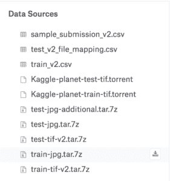
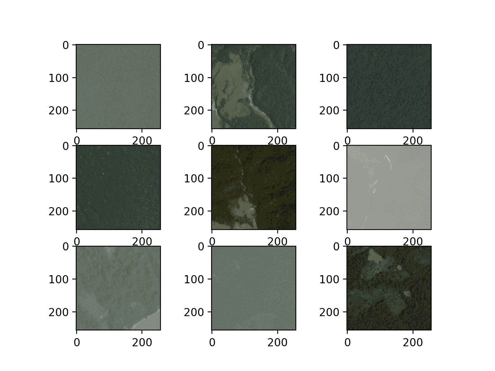
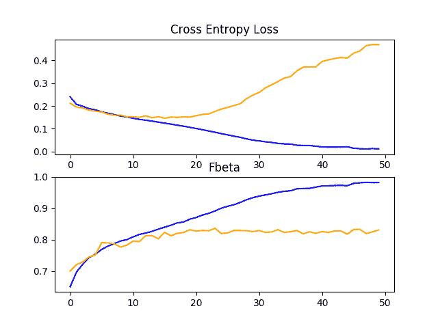
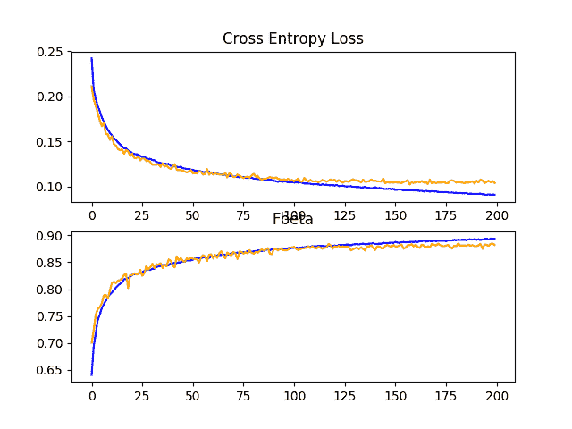
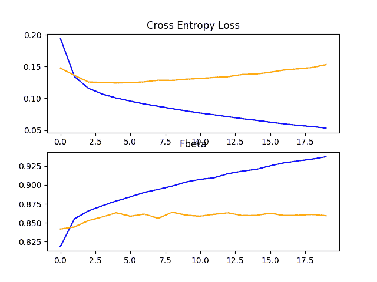
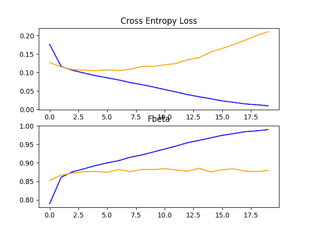
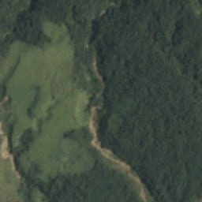

# 亚马逊雨林卫星照片多标签分类

> 原文：<https://machinelearningmastery.com/how-to-develop-a-convolutional-neural-network-to-classify-satellite-photos-of-the-amazon-rainforest/>

最后更新于 2020 年 8 月 24 日

**行星数据集**已经成为一个标准的计算机视觉基准，它涉及对亚马逊热带雨林卫星照片的内容进行多标签分类或标记。

该数据集是 Kaggle 网站上数据科学竞赛的基础，并得到了有效解决。然而，它可以作为学习和实践如何从头开始开发、评估和使用卷积深度学习神经网络进行图像分类的基础。

这包括如何开发一个健壮的测试工具来评估模型的性能，如何探索模型的改进，以及如何保存模型并在以后加载它来对新数据进行预测。

在本教程中，您将发现如何开发卷积神经网络来对亚马逊热带雨林的卫星照片进行分类。

完成本教程后，您将知道:

*   如何加载准备亚马逊热带雨林卫星照片进行建模？
*   如何从零开始开发卷积神经网络进行照片分类并提高模型性能？
*   如何开发最终模型，并使用它对新数据进行特别预测。

**用我的新书[计算机视觉深度学习](https://machinelearningmastery.com/deep-learning-for-computer-vision/)启动你的项目**，包括*分步教程*和所有示例的 *Python 源代码*文件。

我们开始吧。

*   **更新 2019 年 9 月**:更新了如何下载数据集的说明。
*   **2019 年 10 月更新**:针对 Keras 2.3.0 和 TensorFlow 2.0.0 更新。


如何开发卷积神经网络来对亚马逊雨林的卫星照片进行分类[安娜&米歇尔](https://www.flickr.com/photos/michalo/34834427174/)的照片，保留部分权利。

## 教程概述

本教程分为七个部分；它们是:

1.  行星数据集简介
2.  如何为建模准备数据
3.  模型评估方法
4.  如何评估基线模型
5.  如何提高模型性能
6.  如何使用迁移学习
7.  如何最终确定模型并做出预测

## 行星数据集简介

“T0”星球:从太空了解亚马逊比赛于 2017 年在卡格尔举行。

比赛涉及将从巴西亚马逊雨林太空拍摄的卫星图像小方块按照“农业”*、“T2】晴空、“T4】水等 17 类进行分类。鉴于竞赛的名称，数据集通常简称为“*行星数据集*”。*

 *彩色图像以 256×256 像素的 TIFF 和 JPEG 格式提供。训练数据集中总共提供了 40，779 幅图像，测试集中提供了 40，669 幅需要预测的图像。

该问题是一个[多标签图像分类任务](https://en.wikipedia.org/wiki/Multi-label_classification)的例子，其中必须为每个标签预测一个或多个类别标签。这不同于多类别分类，在多类别分类中，每个图像被分配多个类别中的一个。

为训练数据集中的每个图像提供了多个类别标签，并附带了一个将图像文件名映射到字符串类别标签的文件。

比赛进行了大约四个月(2017 年 4 月至 7 月)，共有 938 个团队参加，围绕数据准备、数据扩充和卷积神经网络的使用展开了大量讨论。

比赛由名为“ [bestfitting](https://www.kaggle.com/bestfitting) ”的竞争对手赢得，在 66%的测试数据集上，公共排行榜 F-beta 评分为 0.93398，在 34%的测试数据集上，私有排行榜 F-beta 评分为 0.93317。他的方法在帖子“[星球:从太空理解亚马逊，第一名得主的采访](http://blog.kaggle.com/2017/10/17/planet-understanding-the-amazon-from-space-1st-place-winners-interview/)”中有所描述，并涉及大量模型的流水线和集成，其中大部分是具有转移学习的卷积神经网络。

这是一场具有挑战性的比赛，尽管数据集仍然是免费提供的(如果你有一个 Kaggle 帐户)，并为使用卷积神经网络对航空和卫星数据集进行图像分类提供了一个很好的基准问题。

因此，在这项任务中，使用手动设计的卷积神经网络获得大于 80 的 F-β分数和使用转移学习获得 89+的 F-β分数是常规。

## 如何为建模准备数据

第一步是下载数据集。

为了下载数据文件，您必须有一个 Kaggle 帐户。如果你没有卡格尔账号，可以在这里创建一个:[卡格尔主页](https://www.kaggle.com/about/team)。

数据集可以从行星数据页面下载。此页面列出了为比赛提供的所有文件，尽管我们不需要下载所有文件。

*   [星球:从太空数据下载页面了解亚马逊](https://www.kaggle.com/c/planet-understanding-the-amazon-from-space/data)

下载数据集前，必须点击*加入竞赛*按钮。您可能需要同意竞赛规则，然后数据集将可供下载。


加入竞争

要下载给定的文件，当你用鼠标悬停在文件上时，点击出现在文件旁边的下载按钮的小图标(*在右侧*)，如下图所示。



下载行星数据集文件的下载按钮示例

本教程所需的具体文件如下:

*   **列车-jpg.tar.7z** (600MB)
*   **train_v2.csv.zip** (159KB)

**注意:**JPEG zip 文件可能没有. 7z 扩展名。如果是，请下载。焦油版本。

下载数据集文件后，必须将其解压缩。那个。CSV 文件的 zip 文件可以使用您最喜欢的解压程序解压。

那个。 [7z](https://en.wikipedia.org/wiki/7z) 包含 JPEG 图像的文件也可以使用您最喜欢的解压缩程序解压缩。如果这是一种新的 zip 格式，您可能需要额外的软件，例如 MacOS 上的“[Unarchiver](https://itunes.apple.com/au/app/the-unarchiver/id425424353?mt=12)”软件，或者许多平台上的 [p7zip](http://p7zip.sourceforge.net/) 。

例如，在大多数基于 POSIX 的工作站的命令行上，可以使用 p7zip 和 tar 文件对. 7z 文件进行解压缩，如下所示:

```py
7z x test-jpg.tar.7z
tar -xvf test-jpg.tar
7z x train-jpg.tar.7z
tar -xvf train-jpg.tar
```

解压缩后，您将拥有一个 CSV 文件和一个位于当前工作目录中的目录，如下所示:

```py
train-jpg/
train_v2.csv
```

检查文件夹，你会看到许多 jpeg 文件。

检查 *train_v2.csv* 文件，您将看到训练数据集中的 jpeg 文件的映射( *train-jpg/* )以及它们到类标签的映射，每个类标签用空格分隔；例如:

```py
image_name,tags
train_0,haze primary
train_1,agriculture clear primary water
train_2,clear primary
train_3,clear primary
train_4,agriculture clear habitation primary road
...
```

建模前必须准备好数据集。

我们至少有两种方法可以探索；它们是:内存方法和渐进加载方法。

准备数据集的目的是在拟合模型时将整个训练数据集加载到内存中。这将需要一台具有足够内存来保存所有图像的机器(例如 32GB 或 64GB 的内存)，例如亚马逊 EC2 实例，尽管训练模型会快得多。

或者，数据集可以在训练期间根据需要逐批加载。这需要开发一个数据生成器。训练模型会慢得多，但训练可以在内存较少的工作站上进行(例如 8GB 或 16GB)。

在本教程中，我们将使用前一种方法。因此，我强烈建议您在具有足够内存和 GPU 访问权限的亚马逊 EC2 实例上运行本教程，例如价格合理的[深度学习 AMI(亚马逊 Linux) AMI](https://aws.amazon.com/marketplace/pp/B077GF11NF) 上的 [p3.2xlarge](https://aws.amazon.com/ec2/instance-types/p3/) 实例，每小时费用约为 3 美元。有关如何为深度学习设置亚马逊 EC2 实例的分步教程，请参见文章:

*   [如何设置亚马逊 AWS EC2 GPUs 训练深度学习模型(分步)](https://machinelearningmastery.com/develop-evaluate-large-deep-learning-models-keras-amazon-web-services/)

如果使用 EC2 实例不是您的选择，那么我将在下面给出提示，说明如何进一步减小训练数据集的大小，使其适合您工作站上的内存，以便您可以完成本教程。

### 可视化数据集

第一步是检查训练数据集中的一些图像。

我们可以通过加载一些图像并使用 Matplotlib 在一个图形中绘制多个图像来实现这一点。

下面列出了完整的示例。

```py
# plot the first 9 images in the planet dataset
from matplotlib import pyplot
from matplotlib.image import imread
# define location of dataset
folder = 'train-jpg/'
# plot first few images
for i in range(9):
	# define subplot
	pyplot.subplot(330 + 1 + i)
	# define filename
	filename = folder + 'train_' + str(i) + '.jpg'
	# load image pixels
	image = imread(filename)
	# plot raw pixel data
	pyplot.imshow(image)
# show the figure
pyplot.show()
```

运行该示例会创建一个图形，绘制训练数据集中的前九幅图像。

我们可以看到这些图像确实是雨林的卫星照片。一些显示明显的雾霾，另一些显示树木、道路或河流和其他结构。

这些图表明，建模可能会受益于数据扩充以及简单的技术，使图像中的特征更加明显。



图中显示了行星数据集中的前九幅图像

### 创建映射

下一步包括理解可以分配给每个图像的标签。

我们可以直接使用 [read_csv()熊猫函数](https://pandas.pydata.org/pandas-docs/stable/reference/api/pandas.read_csv.html)加载训练数据集( *train_v2.csv* )的 CSV 映射文件。

下面列出了完整的示例。

```py
# load and summarize the mapping file for the planet dataset
from pandas import read_csv
# load file as CSV
filename = 'train_v2.csv'
mapping_csv = read_csv(filename)
# summarize properties
print(mapping_csv.shape)
print(mapping_csv[:10])
```

运行该示例首先总结训练数据集的形状。我们可以看到，映射文件确实有 40，479 个已知的训练图像。

接下来，总结文件的前 10 行。我们可以看到，文件的第二列包含一个用空格分隔的标签列表，用于分配给每个图像。

```py
(40479, 2)

  image_name                                         tags
0    train_0                                 haze primary
1    train_1              agriculture clear primary water
2    train_2                                clear primary
3    train_3                                clear primary
4    train_4    agriculture clear habitation primary road
5    train_5                           haze primary water
6    train_6  agriculture clear cultivation primary water
7    train_7                                 haze primary
8    train_8        agriculture clear cultivation primary
9    train_9   agriculture clear cultivation primary road
```

我们需要将所有已知标签的集合分配给图像，以及应用于每个标签的唯一且一致的整数。这是为了让我们可以为每个图像开发一个目标向量，使用一个热编码，例如，对于应用于图像的每个标签，在索引处具有全 0 和 1 的向量。

这可以通过循环遍历“*标签*”列中的每一行，按空间分割标签，并将其存储在一个集合中来实现。然后我们将有一组所有已知的标签。例如:

```py
# create a set of labels
labels = set()
for i in range(len(mapping_csv)):
	# convert spaced separated tags into an array of tags
	tags = mapping_csv['tags'][i].split(' ')
	# add tags to the set of known labels
	labels.update(tags)
```

然后，可以按字母顺序对其进行排序，并根据该字母顺序为每个标签分配一个整数。

这将意味着为了一致性，相同的标签将总是被分配相同的整数。

```py
# convert set of labels to a list to list
labels = list(labels)
# order set alphabetically
labels.sort()
```

我们可以创建一个字典，将标签映射到整数，这样我们就可以编码训练数据集进行建模。

我们还可以创建一个字典，它具有从整数到字符串标记值的反向映射，因此稍后当模型进行预测时，我们可以将其转换为可读的东西。

```py
# dict that maps labels to integers, and the reverse
labels_map = {labels[i]:i for i in range(len(labels))}
inv_labels_map = {i:labels[i] for i in range(len(labels))}
```

我们可以将所有这些绑定到一个名为 *create_tag_mapping()* 的便利函数中，该函数将获取包含 *train_v2.csv* 数据的已加载数据帧，并返回一个映射和逆映射字典。

```py
# create a mapping of tags to integers given the loaded mapping file
def create_tag_mapping(mapping_csv):
	# create a set of all known tags
	labels = set()
	for i in range(len(mapping_csv)):
		# convert spaced separated tags into an array of tags
		tags = mapping_csv['tags'][i].split(' ')
		# add tags to the set of known labels
		labels.update(tags)
	# convert set of labels to a list to list
	labels = list(labels)
	# order set alphabetically
	labels.sort()
	# dict that maps labels to integers, and the reverse
	labels_map = {labels[i]:i for i in range(len(labels))}
	inv_labels_map = {i:labels[i] for i in range(len(labels))}
	return labels_map, inv_labels_map
```

我们可以测试这个函数，看看我们需要处理多少标签和什么标签；下面列出了完整的示例。

```py
# create a mapping of tags to integers
from pandas import read_csv

# create a mapping of tags to integers given the loaded mapping file
def create_tag_mapping(mapping_csv):
	# create a set of all known tags
	labels = set()
	for i in range(len(mapping_csv)):
		# convert spaced separated tags into an array of tags
		tags = mapping_csv['tags'][i].split(' ')
		# add tags to the set of known labels
		labels.update(tags)
	# convert set of labels to a list to list
	labels = list(labels)
	# order set alphabetically
	labels.sort()
	# dict that maps labels to integers, and the reverse
	labels_map = {labels[i]:i for i in range(len(labels))}
	inv_labels_map = {i:labels[i] for i in range(len(labels))}
	return labels_map, inv_labels_map

# load file as CSV
filename = 'train_v2.csv'
mapping_csv = read_csv(filename)
# create a mapping of tags to integers
mapping, inv_mapping = create_tag_mapping(mapping_csv)
print(len(mapping))
print(mapping)
```

运行该示例，我们可以看到数据集中总共有 17 个标签。

我们还可以看到映射字典，其中每个标签都被分配了一个一致且唯一的整数。这些标签似乎是对我们在给定卫星图像中可能看到的特征类型的合理描述。

作为进一步的扩展，探索标签在图像中的分布，看看它们在训练数据集中的分配或使用是平衡的还是不平衡的，可能会很有趣。这可以让我们进一步了解预测问题有多难。

```py
17

{'agriculture': 0, 'artisinal_mine': 1, 'bare_ground': 2, 'blooming': 3, 'blow_down': 4, 'clear': 5, 'cloudy': 6, 'conventional_mine': 7, 'cultivation': 8, 'habitation': 9, 'haze': 10, 'partly_cloudy': 11, 'primary': 12, 'road': 13, 'selective_logging': 14, 'slash_burn': 15, 'water': 16}
```

我们还需要一个训练集文件名到图像标签的映射。

这是一个简单的字典，以图像的文件名作为关键字，以标签列表作为值。

下面的 *create_file_mapping()* 实现了这一点，也将加载的*数据帧*作为参数，并返回映射，每个文件名的标记值存储为一个列表。

```py
# create a mapping of filename to tags
def create_file_mapping(mapping_csv):
	mapping = dict()
	for i in range(len(mapping_csv)):
		name, tags = mapping_csv['image_name'][i], mapping_csv['tags'][i]
		mapping[name] = tags.split(' ')
	return mapping
```

我们现在可以准备数据集的图像部分。

### 创建内存数据集

我们需要能够将 JPEG 图像加载到内存中。

这可以通过枚举 *train-jpg/* 文件夹中的所有文件来实现。Keras 提供了一个简单的 API，通过 [load_img()函数](https://github.com/keras-team/keras-preprocessing/blob/master/keras_preprocessing/image/utils.py)从文件加载图像，并通过 *img_to_array()* 函数将其覆盖到 NumPy 数组。

作为加载图像的一部分，我们可以强制将大小变小，以节省内存并加快训练速度。在这种情况下，我们将把图像的大小从 256×256 减半到 128×128。我们还将像素值存储为无符号 8 位整数(例如，0 到 255 之间的值)。

```py
# load image
photo = load_img(filename, target_size=(128,128))
# convert to numpy array
photo = img_to_array(photo, dtype='uint8')
```

照片将代表模型的输入，但我们需要照片的输出。

然后，我们可以使用文件名检索加载图像的标签，而无需使用前一节中开发的 *create_file_mapping()* 函数准备的文件名到标签的映射的扩展名。

```py
# get tags
tags = file_mapping(filename[:-4])
```

我们需要对图像的标签进行热编码。这意味着我们需要一个 17 个元素的向量，每个标签的值为 1。我们可以通过上一节中开发的 *create_tag_mapping()* 函数创建的标签到整数的映射，得到 1 值放置位置的索引。

下面的 *one_hot_encode()* 函数实现了这一点，给定一个图像的标签列表和标签到整数的映射作为参数，它将返回一个 17 元素的 NumPy 数组，该数组描述了一张照片的标签的 one hot 编码。

```py
# create a one hot encoding for one list of tags
def one_hot_encode(tags, mapping):
	# create empty vector
	encoding = zeros(len(mapping), dtype='uint8')
	# mark 1 for each tag in the vector
	for tag in tags:
		encoding[mapping[tag]] = 1
	return encoding
```

我们现在可以为整个训练数据集加载输入(照片)和输出(一个热编码矢量)元素。

下面的 *load_dataset()* 函数实现了这一点，给定了 JPEG 图像的路径，文件到标签的映射，以及标签到整数的映射作为输入；它将返回用于建模的 *X* 和 *y* 元素的 NumPy 数组。

```py
# load all images into memory
def load_dataset(path, file_mapping, tag_mapping):
	photos, targets = list(), list()
	# enumerate files in the directory
	for filename in listdir(folder):
		# load image
		photo = load_img(path + filename, target_size=(128,128))
		# convert to numpy array
		photo = img_to_array(photo, dtype='uint8')
		# get tags
		tags = file_mapping[filename[:-4]]
		# one hot encode tags
		target = one_hot_encode(tags, tag_mapping)
		# store
		photos.append(photo)
		targets.append(target)
	X = asarray(photos, dtype='uint8')
	y = asarray(targets, dtype='uint8')
	return X, y
```

注意:这将把整个训练数据集加载到内存中，可能需要至少 128x128x3 x 40，479 个图像 x 8 位，或者大约 2 GB 的内存来保存加载的照片。

如果内存不足，或者稍后在建模时(当像素为 16 或 32 位时)，请尝试将加载的照片缩小到 32×32 和/或在加载 20，000 张照片后停止循环。

加载后，我们可以将这些 NumPy 数组保存到文件中供以后使用。

我们可以使用 [*save()*](https://docs.scipy.org/doc/numpy/reference/generated/numpy.save.html) 或 [*savez()*](https://docs.scipy.org/doc/numpy/reference/generated/numpy.savez.html) NumPy 函数来保存数组方向。相反，我们将使用 [savez_compressed() NumPy 函数](https://docs.scipy.org/doc/numpy/reference/generated/numpy.savez_compressed.html)以压缩格式在一次函数调用中保存两个数组，从而多保存几兆字节。在建模过程中，加载较小图像的阵列将明显快于每次加载原始 JPEG 图像。

```py
# save both arrays to one file in compressed format
savez_compressed('planet_data.npz', X, y)
```

我们可以将所有这些联系在一起，为内存建模准备行星数据集，并将其保存到一个新的单个文件中，以便稍后快速加载。

下面列出了完整的示例。

```py
# load and prepare planet dataset and save to file
from os import listdir
from numpy import zeros
from numpy import asarray
from numpy import savez_compressed
from pandas import read_csv
from keras.preprocessing.image import load_img
from keras.preprocessing.image import img_to_array

# create a mapping of tags to integers given the loaded mapping file
def create_tag_mapping(mapping_csv):
	# create a set of all known tags
	labels = set()
	for i in range(len(mapping_csv)):
		# convert spaced separated tags into an array of tags
		tags = mapping_csv['tags'][i].split(' ')
		# add tags to the set of known labels
		labels.update(tags)
	# convert set of labels to a list to list
	labels = list(labels)
	# order set alphabetically
	labels.sort()
	# dict that maps labels to integers, and the reverse
	labels_map = {labels[i]:i for i in range(len(labels))}
	inv_labels_map = {i:labels[i] for i in range(len(labels))}
	return labels_map, inv_labels_map

# create a mapping of filename to a list of tags
def create_file_mapping(mapping_csv):
	mapping = dict()
	for i in range(len(mapping_csv)):
		name, tags = mapping_csv['image_name'][i], mapping_csv['tags'][i]
		mapping[name] = tags.split(' ')
	return mapping

# create a one hot encoding for one list of tags
def one_hot_encode(tags, mapping):
	# create empty vector
	encoding = zeros(len(mapping), dtype='uint8')
	# mark 1 for each tag in the vector
	for tag in tags:
		encoding[mapping[tag]] = 1
	return encoding

# load all images into memory
def load_dataset(path, file_mapping, tag_mapping):
	photos, targets = list(), list()
	# enumerate files in the directory
	for filename in listdir(folder):
		# load image
		photo = load_img(path + filename, target_size=(128,128))
		# convert to numpy array
		photo = img_to_array(photo, dtype='uint8')
		# get tags
		tags = file_mapping[filename[:-4]]
		# one hot encode tags
		target = one_hot_encode(tags, tag_mapping)
		# store
		photos.append(photo)
		targets.append(target)
	X = asarray(photos, dtype='uint8')
	y = asarray(targets, dtype='uint8')
	return X, y

# load the mapping file
filename = 'train_v2.csv'
mapping_csv = read_csv(filename)
# create a mapping of tags to integers
tag_mapping, _ = create_tag_mapping(mapping_csv)
# create a mapping of filenames to tag lists
file_mapping = create_file_mapping(mapping_csv)
# load the jpeg images
folder = 'train-jpg/'
X, y = load_dataset(folder, file_mapping, tag_mapping)
print(X.shape, y.shape)
# save both arrays to one file in compressed format
savez_compressed('planet_data.npz', X, y)
```

运行该示例首先加载整个数据集并汇总形状。我们可以确认输入样本( *X* )是 128×128 的彩色图像，输出样本是 17 元向量。

在运行结束时，会保存一个文件“ *planet_data.npz* ”，其中包含大小约为 1.2 千兆字节的数据集，由于压缩节省了约 700 兆字节。

```py
(40479, 128, 128, 3) (40479, 17)
```

稍后可以使用 [load() NumPy 函数](https://docs.scipy.org/doc/numpy/reference/generated/numpy.load.html)轻松加载数据集，如下所示:

```py
# load prepared planet dataset
from numpy import load
data = load('planet_data.npz')
X, y = data['arr_0'], data['arr_1']
print('Loaded: ', X.shape, y.shape)
```

运行这个小示例确认数据集被正确加载。

```py
Loaded: (40479, 128, 128, 3) (40479, 17)
```

## 模型评估方法

在开始建模之前，我们必须选择一个性能指标。

分类精度通常适用于每个类别中具有平衡数量的示例的二进制分类任务。

在这种情况下，我们既不处理二进制分类任务，也不处理多类分类任务；相反，它是一个多标签分类任务，标签的数量并不均衡，有些标签的使用量比其他标签更大。

因此，卡格尔竞赛组织选择了 F-beta 指标，特别是 F2 分数。这是一个与 [F1 得分](https://en.wikipedia.org/wiki/F1_score)相关的指标(也称为 F-measure)。

F1 分数计算[召回率和](https://en.wikipedia.org/wiki/Precision_and_recall)精确度的平均值。您可能还记得精度和召回率的计算方法如下:

```py
precision = true positives / (true positives + false positives)
recall = true positives / (true positives + false negatives)
```

精度描述了模型在预测正类方面有多好。回忆描述了当实际结果为正时，模型预测正类的能力。

F1 是这两个分数的平均值，特别是[调和平均值](https://machinelearningmastery.com/arithmetic-geometric-and-harmonic-means-for-machine-learning/)，而不是算术平均值，因为这些值是比例。在不平衡数据集上评估模型性能时，F1 优于精确度，最差和最佳可能得分的值介于 0 和 1 之间。

```py
F1 = 2 x (precision x recall) / (precision + recall)
```

F-β度量是 F1 的推广，它允许引入一个名为*β*的术语，该术语衡量在计算平均值时，回忆与精度相比有多重要

```py
F-Beta = (1 + Beta^2) x (precision x recall) / (Beta^2 x precision + recall)
```

beta 的一个常见值是 2，这是竞争中使用的值，召回的价值是精度的两倍。这通常被称为 F2 分数。

正负类的思想只对二元分类问题有意义。当我们预测多个类时，正项、负项和相关项的概念以一个相对于其余项的方式为每个类计算，然后在每个类中取平均值。

scikit-learn 库通过 [fbeta_score()函数](https://scikit-learn.org/stable/modules/generated/sklearn.metrics.fbeta_score.html)提供 F-beta 的实现。我们可以调用该函数来评估一组预测，并指定β值为 2，将“*平均值*参数设置为“*样本*”。

```py
score = fbeta_score(y_true, y_pred, 2, average='samples')
```

例如，我们可以在准备好的数据集上进行测试。

我们可以将加载的数据集分割成单独的训练和测试数据集，用于训练和评估这个问题的模型。这可以通过使用 *train_test_split()* 并指定一个“ *random_state* 参数来实现，以便每次运行代码时给出相同的数据分割。

我们将使用 70%用于训练集，30%用于测试集。

```py
trainX, testX, trainY, testY = train_test_split(X, y, test_size=0.3, random_state=1)
```

下面的 *load_dataset()* 函数通过加载保存的数据集，将其拆分为训练和测试组件，并返回以备使用来实现这一点。

```py
# load train and test dataset
def load_dataset():
	# load dataset
	data = load('planet_data.npz')
	X, y = data['arr_0'], data['arr_1']
	# separate into train and test datasets
	trainX, testX, trainY, testY = train_test_split(X, y, test_size=0.3, random_state=1)
	print(trainX.shape, trainY.shape, testX.shape, testY.shape)
	return trainX, trainY, testX, testY
```

然后，我们可以预测一个热编码向量中的所有类或所有 1 值。

```py
# make all one predictions
train_yhat = asarray([ones(trainY.shape[1]) for _ in range(trainY.shape[0])])
test_yhat = asarray([ones(testY.shape[1]) for _ in range(testY.shape[0])])
```

然后可以使用 scikit-learn fbeta_score()函数，用训练和测试数据集中的真实值来评估预测。

```py
train_score = fbeta_score(trainY, train_yhat, 2, average='samples')
test_score = fbeta_score(testY, test_yhat, 2, average='samples')
```

将这些联系在一起，完整的示例如下所示。

```py
# test f-beta score
from numpy import load
from numpy import ones
from numpy import asarray
from sklearn.model_selection import train_test_split
from sklearn.metrics import fbeta_score

# load train and test dataset
def load_dataset():
	# load dataset
	data = load('planet_data.npz')
	X, y = data['arr_0'], data['arr_1']
	# separate into train and test datasets
	trainX, testX, trainY, testY = train_test_split(X, y, test_size=0.3, random_state=1)
	print(trainX.shape, trainY.shape, testX.shape, testY.shape)
	return trainX, trainY, testX, testY

# load dataset
trainX, trainY, testX, testY = load_dataset()
# make all one predictions
train_yhat = asarray([ones(trainY.shape[1]) for _ in range(trainY.shape[0])])
test_yhat = asarray([ones(testY.shape[1]) for _ in range(testY.shape[0])])
# evaluate predictions
train_score = fbeta_score(trainY, train_yhat, 2, average='samples')
test_score = fbeta_score(testY, test_yhat, 2, average='samples')
print('All Ones: train=%.3f, test=%.3f' % (train_score, test_score))
```

运行此示例首先加载准备好的数据集，然后将其拆分为训练集和测试集，并报告准备好的数据集的形状。我们可以看到，我们在训练数据集中有略多于 28，000 个示例，在测试集中有略多于 12，000 个示例。

接下来，准备所有的预测，然后进行评估，并报告分数。我们可以看到，两个数据集的全 1 预测结果得分约为 0.48。

```py
(28335, 128, 128, 3) (28335, 17) (12144, 128, 128, 3) (12144, 17)
All Ones: train=0.484, test=0.483
```

我们将需要一个版本的 F-beta 分数计算在 Keras 使用作为一个指标。

在库的 2.0 版本之前，Keras 用于支持二进制分类问题(2 类)的这个度量；我们可以在这里看到这个旧版本的代码: [metrics.py](https://github.com/keras-team/keras/blob/4fa7e5d454dd4f3f33f1d756a2a8659f2e789141/keras/metrics.py#L134) 。该代码可用作定义可与 Keras 一起使用的新度量函数的基础。这个函数的一个版本也在一个名为“T2”的 Kaggle 内核中被提出。下面列出了这个新功能。

```py
from keras import backend

# calculate fbeta score for multi-class/label classification
def fbeta(y_true, y_pred, beta=2):
	# clip predictions
	y_pred = backend.clip(y_pred, 0, 1)
	# calculate elements
	tp = backend.sum(backend.round(backend.clip(y_true * y_pred, 0, 1)), axis=1)
	fp = backend.sum(backend.round(backend.clip(y_pred - y_true, 0, 1)), axis=1)
	fn = backend.sum(backend.round(backend.clip(y_true - y_pred, 0, 1)), axis=1)
	# calculate precision
	p = tp / (tp + fp + backend.epsilon())
	# calculate recall
	r = tp / (tp + fn + backend.epsilon())
	# calculate fbeta, averaged across each class
	bb = beta ** 2
	fbeta_score = backend.mean((1 + bb) * (p * r) / (bb * p + r + backend.epsilon()))
	return fbeta_score
```

它可以在 Keras 中编译模型时使用，通过 metrics 参数指定；例如:

```py
...
model.compile(... metrics=[fbeta])
```

我们可以测试这个新功能，并将结果与 scikit-learn 功能进行比较，如下所示。

```py
# compare f-beta score between sklearn and keras
from numpy import load
from numpy import ones
from numpy import asarray
from sklearn.model_selection import train_test_split
from sklearn.metrics import fbeta_score
from keras import backend

# load train and test dataset
def load_dataset():
	# load dataset
	data = load('planet_data.npz')
	X, y = data['arr_0'], data['arr_1']
	# separate into train and test datasets
	trainX, testX, trainY, testY = train_test_split(X, y, test_size=0.3, random_state=1)
	print(trainX.shape, trainY.shape, testX.shape, testY.shape)
	return trainX, trainY, testX, testY

# calculate fbeta score for multi-class/label classification
def fbeta(y_true, y_pred, beta=2):
	# clip predictions
	y_pred = backend.clip(y_pred, 0, 1)
	# calculate elements
	tp = backend.sum(backend.round(backend.clip(y_true * y_pred, 0, 1)), axis=1)
	fp = backend.sum(backend.round(backend.clip(y_pred - y_true, 0, 1)), axis=1)
	fn = backend.sum(backend.round(backend.clip(y_true - y_pred, 0, 1)), axis=1)
	# calculate precision
	p = tp / (tp + fp + backend.epsilon())
	# calculate recall
	r = tp / (tp + fn + backend.epsilon())
	# calculate fbeta, averaged across each class
	bb = beta ** 2
	fbeta_score = backend.mean((1 + bb) * (p * r) / (bb * p + r + backend.epsilon()))
	return fbeta_score

# load dataset
trainX, trainY, testX, testY = load_dataset()
# make all one predictions
train_yhat = asarray([ones(trainY.shape[1]) for _ in range(trainY.shape[0])])
test_yhat = asarray([ones(testY.shape[1]) for _ in range(testY.shape[0])])
# evaluate predictions with sklearn
train_score = fbeta_score(trainY, train_yhat, 2, average='samples')
test_score = fbeta_score(testY, test_yhat, 2, average='samples')
print('All Ones (sklearn): train=%.3f, test=%.3f' % (train_score, test_score))
# evaluate predictions with keras
train_score = fbeta(backend.variable(trainY), backend.variable(train_yhat))
test_score = fbeta(backend.variable(testY), backend.variable(test_yhat))
print('All Ones (keras): train=%.3f, test=%.3f' % (train_score, test_score))
```

运行该示例像以前一样加载数据集，在这种情况下，使用 scikit-learn 和 Keras 计算 F-beta。我们可以看到这两个函数实现了相同的结果。

```py
(28335, 128, 128, 3) (28335, 17) (12144, 128, 128, 3) (12144, 17)
All Ones (sklearn): train=0.484, test=0.483
All Ones (keras): train=0.484, test=0.483
```

我们可以使用测试集上 0.483 的分数作为天真的预测，后续部分中的所有模型都可以与之进行比较，以确定它们是否熟练。

## 如何评估基线模型

我们现在准备为准备好的行星数据集开发和评估基线卷积神经网络模型。

我们将设计一个具有 [VGG 型结构](https://machinelearningmastery.com/use-pre-trained-vgg-model-classify-objects-photographs/)的基线模型。也就是说，卷积层的块具有小的 3×3 滤波器，然后是最大池层，随着每个块的增加，滤波器的数量加倍，重复这种模式。

具体来说，每个块将有两个具有 3×3 滤波器的卷积层， [ReLU 激活](https://machinelearningmastery.com/how-to-fix-vanishing-gradients-using-the-rectified-linear-activation-function/)和 He 权重初始化具有相同的填充，确保输出的特征图具有相同的宽度和高度。接下来是一个 3×3 内核的最大池层。其中三个模块将分别用于 32、64 和 128 个滤波器。

```py
model = Sequential()
model.add(Conv2D(32, (3, 3), activation='relu', kernel_initializer='he_uniform', padding='same', input_shape=(128, 128, 3)))
model.add(Conv2D(32, (3, 3), activation='relu', kernel_initializer='he_uniform', padding='same'))
model.add(MaxPooling2D((2, 2)))
model.add(Conv2D(64, (3, 3), activation='relu', kernel_initializer='he_uniform', padding='same'))
model.add(Conv2D(64, (3, 3), activation='relu', kernel_initializer='he_uniform', padding='same'))
model.add(MaxPooling2D((2, 2)))
model.add(Conv2D(128, (3, 3), activation='relu', kernel_initializer='he_uniform', padding='same'))
model.add(Conv2D(128, (3, 3), activation='relu', kernel_initializer='he_uniform', padding='same'))
model.add(MaxPooling2D((2, 2)))
```

最终汇集层的输出将被展平并馈送到完全连接的层进行解释，然后最终馈送到输出层进行预测。

该模型必须为每个输出类生成一个预测值介于 0 和 1 之间的 17 元素向量。

```py
model.add(Flatten())
model.add(Dense(128, activation='relu', kernel_initializer='he_uniform'))
model.add(Dense(17, activation='sigmoid'))
```

如果这是一个多类分类问题，我们将使用 softmax 激活函数和[分类交叉熵损失函数](https://machinelearningmastery.com/how-to-choose-loss-functions-when-training-deep-learning-neural-networks/)。这不适合多标签分类，因为我们期望模型输出多个 1 值，而不是单个 1 值。在这种情况下，我们将在输出层使用 sigmoid 激活函数，并优化二元交叉熵损失函数。

模型将采用小批量随机梯度下降进行优化，保守[学习率](https://machinelearningmastery.com/understand-the-dynamics-of-learning-rate-on-deep-learning-neural-networks/)为 0.01，动量为 0.9，模型将在训练过程中跟踪“ *fbeta* ”度量。

```py
# compile model
opt = SGD(lr=0.01, momentum=0.9)
model.compile(optimizer=opt, loss='binary_crossentropy', metrics=[fbeta])
```

下面的 *define_model()* 函数将所有这些联系在一起，并将输入和输出的形状参数化，以防您想要通过更改这些值或在另一个数据集上重用代码来进行实验。

该函数将返回一个准备好适合行星数据集的模型。

```py
# define cnn model
def define_model(in_shape=(128, 128, 3), out_shape=17):
	model = Sequential()
	model.add(Conv2D(32, (3, 3), activation='relu', kernel_initializer='he_uniform', padding='same', input_shape=in_shape))
	model.add(Conv2D(32, (3, 3), activation='relu', kernel_initializer='he_uniform', padding='same'))
	model.add(MaxPooling2D((2, 2)))
	model.add(Conv2D(64, (3, 3), activation='relu', kernel_initializer='he_uniform', padding='same'))
	model.add(Conv2D(64, (3, 3), activation='relu', kernel_initializer='he_uniform', padding='same'))
	model.add(MaxPooling2D((2, 2)))
	model.add(Conv2D(128, (3, 3), activation='relu', kernel_initializer='he_uniform', padding='same'))
	model.add(Conv2D(128, (3, 3), activation='relu', kernel_initializer='he_uniform', padding='same'))
	model.add(MaxPooling2D((2, 2)))
	model.add(Flatten())
	model.add(Dense(128, activation='relu', kernel_initializer='he_uniform'))
	model.add(Dense(out_shape, activation='sigmoid'))
	# compile model
	opt = SGD(lr=0.01, momentum=0.9)
	model.compile(optimizer=opt, loss='binary_crossentropy', metrics=[fbeta])
	return model
```

选择这个模型作为基线模型有些随意。您可能希望探索具有更少层次或不同学习率的其他基线模型。

我们可以使用上一节中开发的 *load_dataset()* 函数来加载数据集，并将其拆分为训练集和测试集，用于拟合和评估定义的模型。

在拟合模型之前，像素值将被归一化。我们将通过定义一个 [ImageDataGenerator](https://keras.io/preprocessing/image/) 实例来实现这一点，并将重新缩放参数指定为 1.0/255.0。这将使每批像素值标准化为 32 位浮点值，这可能比在内存中一次重新缩放所有像素值更节省内存。

```py
# create data generator
datagen = ImageDataGenerator(rescale=1.0/255.0)
```

我们可以从这个数据生成器为训练集和测试集创建迭代器，在这种情况下，我们将使用 128 个图像的相对较大的批量来加速学习。

```py
# prepare iterators
train_it = datagen.flow(trainX, trainY, batch_size=128)
test_it = datagen.flow(testX, testY, batch_size=128)
```

然后可以使用训练迭代器来拟合定义的模型，并且可以使用测试迭代器来评估每个时期结束时的测试数据集。这个模型将适用于 50 个时代。

```py
# fit model
history = model.fit_generator(train_it, steps_per_epoch=len(train_it),
	validation_data=test_it, validation_steps=len(test_it), epochs=50, verbose=0)
```

一旦拟合，我们可以计算测试数据集上的最终损失和 F-beta 分数，以估计模型的技能。

```py
# evaluate model
loss, fbeta = model.evaluate_generator(test_it, steps=len(test_it), verbose=0)
print('> loss=%.3f, fbeta=%.3f' % (loss, fbeta))
```

为拟合模型而调用的 *fit_generator()* 函数返回一个字典，其中包含列车和测试数据集中每个时期记录的损失和 F-beta 分数。我们可以创建这些痕迹的图，这可以提供对模型学习动态的洞察。

*summary _ diagnostics()*功能将根据该记录的历史数据创建一个图形，其中一个图显示损失，另一个图显示训练数据集(蓝色线)和测试数据集(橙色线)上每个训练时期结束时模型的 F-beta 分数。

创建的图形保存到一个 PNG 文件中，该文件的文件名与扩展名为“ *_plot.png* 的脚本相同。这允许相同的测试线束与不同模型配置的多个不同脚本文件一起使用，从而将学习曲线保存在单独的文件中。

```py
# plot diagnostic learning curves
def summarize_diagnostics(history):
	# plot loss
	pyplot.subplot(211)
	pyplot.title('Cross Entropy Loss')
	pyplot.plot(history.history['loss'], color='blue', label='train')
	pyplot.plot(history.history['val_loss'], color='orange', label='test')
	# plot accuracy
	pyplot.subplot(212)
	pyplot.title('Fbeta')
	pyplot.plot(history.history['fbeta'], color='blue', label='train')
	pyplot.plot(history.history['val_fbeta'], color='orange', label='test')
	# save plot to file
	filename = sys.argv[0].split('/')[-1]
	pyplot.savefig(filename + '_plot.png')
	pyplot.close()
```

我们可以将这些联系在一起，定义一个函数*run _ test _ 线束()*来驱动测试线束，包括数据的加载和准备以及模型的定义、拟合和评估。

```py
# run the test harness for evaluating a model
def run_test_harness():
	# load dataset
	trainX, trainY, testX, testY = load_dataset()
	# create data generator
	datagen = ImageDataGenerator(rescale=1.0/255.0)
	# prepare iterators
	train_it = datagen.flow(trainX, trainY, batch_size=128)
	test_it = datagen.flow(testX, testY, batch_size=128)
	# define model
	model = define_model()
	# fit model
	history = model.fit_generator(train_it, steps_per_epoch=len(train_it),
		validation_data=test_it, validation_steps=len(test_it), epochs=50, verbose=0)
	# evaluate model
	loss, fbeta = model.evaluate_generator(test_it, steps=len(test_it), verbose=0)
	print('> loss=%.3f, fbeta=%.3f' % (loss, fbeta))
	# learning curves
	summarize_diagnostics(history)
```

下面列出了在行星数据集上评估基线模型的完整示例。

```py
# baseline model for the planet dataset
import sys
from numpy import load
from matplotlib import pyplot
from sklearn.model_selection import train_test_split
from keras import backend
from keras.preprocessing.image import ImageDataGenerator
from keras.models import Sequential
from keras.layers import Conv2D
from keras.layers import MaxPooling2D
from keras.layers import Dense
from keras.layers import Flatten
from keras.optimizers import SGD

# load train and test dataset
def load_dataset():
	# load dataset
	data = load('planet_data.npz')
	X, y = data['arr_0'], data['arr_1']
	# separate into train and test datasets
	trainX, testX, trainY, testY = train_test_split(X, y, test_size=0.3, random_state=1)
	print(trainX.shape, trainY.shape, testX.shape, testY.shape)
	return trainX, trainY, testX, testY

# calculate fbeta score for multi-class/label classification
def fbeta(y_true, y_pred, beta=2):
	# clip predictions
	y_pred = backend.clip(y_pred, 0, 1)
	# calculate elements
	tp = backend.sum(backend.round(backend.clip(y_true * y_pred, 0, 1)), axis=1)
	fp = backend.sum(backend.round(backend.clip(y_pred - y_true, 0, 1)), axis=1)
	fn = backend.sum(backend.round(backend.clip(y_true - y_pred, 0, 1)), axis=1)
	# calculate precision
	p = tp / (tp + fp + backend.epsilon())
	# calculate recall
	r = tp / (tp + fn + backend.epsilon())
	# calculate fbeta, averaged across each class
	bb = beta ** 2
	fbeta_score = backend.mean((1 + bb) * (p * r) / (bb * p + r + backend.epsilon()))
	return fbeta_score

# define cnn model
def define_model(in_shape=(128, 128, 3), out_shape=17):
	model = Sequential()
	model.add(Conv2D(32, (3, 3), activation='relu', kernel_initializer='he_uniform', padding='same', input_shape=in_shape))
	model.add(Conv2D(32, (3, 3), activation='relu', kernel_initializer='he_uniform', padding='same'))
	model.add(MaxPooling2D((2, 2)))
	model.add(Conv2D(64, (3, 3), activation='relu', kernel_initializer='he_uniform', padding='same'))
	model.add(Conv2D(64, (3, 3), activation='relu', kernel_initializer='he_uniform', padding='same'))
	model.add(MaxPooling2D((2, 2)))
	model.add(Conv2D(128, (3, 3), activation='relu', kernel_initializer='he_uniform', padding='same'))
	model.add(Conv2D(128, (3, 3), activation='relu', kernel_initializer='he_uniform', padding='same'))
	model.add(MaxPooling2D((2, 2)))
	model.add(Flatten())
	model.add(Dense(128, activation='relu', kernel_initializer='he_uniform'))
	model.add(Dense(out_shape, activation='sigmoid'))
	# compile model
	opt = SGD(lr=0.01, momentum=0.9)
	model.compile(optimizer=opt, loss='binary_crossentropy', metrics=[fbeta])
	return model

# plot diagnostic learning curves
def summarize_diagnostics(history):
	# plot loss
	pyplot.subplot(211)
	pyplot.title('Cross Entropy Loss')
	pyplot.plot(history.history['loss'], color='blue', label='train')
	pyplot.plot(history.history['val_loss'], color='orange', label='test')
	# plot accuracy
	pyplot.subplot(212)
	pyplot.title('Fbeta')
	pyplot.plot(history.history['fbeta'], color='blue', label='train')
	pyplot.plot(history.history['val_fbeta'], color='orange', label='test')
	# save plot to file
	filename = sys.argv[0].split('/')[-1]
	pyplot.savefig(filename + '_plot.png')
	pyplot.close()

# run the test harness for evaluating a model
def run_test_harness():
	# load dataset
	trainX, trainY, testX, testY = load_dataset()
	# create data generator
	datagen = ImageDataGenerator(rescale=1.0/255.0)
	# prepare iterators
	train_it = datagen.flow(trainX, trainY, batch_size=128)
	test_it = datagen.flow(testX, testY, batch_size=128)
	# define model
	model = define_model()
	# fit model
	history = model.fit_generator(train_it, steps_per_epoch=len(train_it),
		validation_data=test_it, validation_steps=len(test_it), epochs=50, verbose=0)
	# evaluate model
	loss, fbeta = model.evaluate_generator(test_it, steps=len(test_it), verbose=0)
	print('> loss=%.3f, fbeta=%.3f' % (loss, fbeta))
	# learning curves
	summarize_diagnostics(history)

# entry point, run the test harness
run_test_harness()
```

运行该示例首先加载数据集，并将其拆分为训练集和测试集。打印每个训练和测试数据集的输入和输出元素的形状，确认与之前执行了相同的数据分割。

对模型进行拟合和评估，并报告测试数据集上最终模型的 F-beta 分数。

**注**:考虑到算法或评估程序的随机性，或数值精度的差异，您的[结果可能会有所不同](https://machinelearningmastery.com/different-results-each-time-in-machine-learning/)。考虑运行该示例几次，并比较平均结果。

在这种情况下，基线模型获得了大约 0.831 的 F-beta 分数，这比前一节中报告的 0.483 的幼稚分数好得多。这表明基线模型是有技巧的。

```py
(28335, 128, 128, 3) (28335, 17) (12144, 128, 128, 3) (12144, 17)
> loss=0.470, fbeta=0.831
```

还创建了一个图形并保存到文件中，该图形显示了模型在列车和测试集上关于损失和 F-beta 的学习曲线。

在这种情况下，损失学习曲线的图表明模型已经过度拟合了训练数据集，可能大约在 50 个时期中的第 20 个时期，尽管过度拟合似乎没有负面影响模型在测试数据集上关于 F-beta 分数的性能。



显示列车基线模型和行星问题测试数据集的损失和 F-Beta 学习曲线的线图

既然我们已经有了数据集的基线模型，我们就有了实验和改进的坚实基础。

我们将在下一节探讨一些提高模型性能的想法。

## 如何提高模型性能

在前一节中，我们定义了一个基线模型，可以作为改进行星数据集的基础。

该模型获得了合理的 F-beta 分数，尽管学习曲线表明该模型过度训练了训练数据集。探索解决过度拟合的两种常见方法是辍学正规化和数据扩充。两者都有破坏和减缓学习过程的效果，特别是模型在训练阶段的改进速度。

我们将在本节中探讨这两种方法。鉴于我们预计学习速度会减慢，我们通过将训练阶段的数量从 50 个增加到 200 个，给模型更多的学习时间。

### 辍学正规化

脱落正则化是一种计算量小的正则化深度神经网络的方法。

丢弃的工作原理是从概率上移除，或者“T0”从“T1”中移除，输入到一个层，该层可以是数据样本中的输入变量或者来自前一层的激活。它具有模拟大量具有非常不同的网络结构的网络的效果，并且反过来使得网络中的节点通常对输入更加鲁棒。

有关辍学的更多信息，请参阅帖子:

*   [如何利用 Keras 中的下降正则化减少过拟合](https://machinelearningmastery.com/how-to-reduce-overfitting-with-dropout-regularization-in-keras/)

通常，每个 VGG 模块后可以施加少量压降，更多压降施加于模型输出层附近的全连接层。

下面是添加了 Dropout 的基线模型的更新版本的 *define_model()* 函数。在这种情况下，在每个 VGG 块之后应用 20%的丢失率，在模型的分类器部分的完全连接层之后应用更大的 50%的丢失率。

```py
# define cnn model
def define_model(in_shape=(128, 128, 3), out_shape=17):
	model = Sequential()
	model.add(Conv2D(32, (3, 3), activation='relu', kernel_initializer='he_uniform', padding='same', input_shape=in_shape))
	model.add(Conv2D(32, (3, 3), activation='relu', kernel_initializer='he_uniform', padding='same'))
	model.add(MaxPooling2D((2, 2)))
	model.add(Dropout(0.2))
	model.add(Conv2D(64, (3, 3), activation='relu', kernel_initializer='he_uniform', padding='same'))
	model.add(Conv2D(64, (3, 3), activation='relu', kernel_initializer='he_uniform', padding='same'))
	model.add(MaxPooling2D((2, 2)))
	model.add(Dropout(0.2))
	model.add(Conv2D(128, (3, 3), activation='relu', kernel_initializer='he_uniform', padding='same'))
	model.add(Conv2D(128, (3, 3), activation='relu', kernel_initializer='he_uniform', padding='same'))
	model.add(MaxPooling2D((2, 2)))
	model.add(Dropout(0.2))
	model.add(Flatten())
	model.add(Dense(128, activation='relu', kernel_initializer='he_uniform'))
	model.add(Dropout(0.5))
	model.add(Dense(out_shape, activation='sigmoid'))
	# compile model
	opt = SGD(lr=0.01, momentum=0.9)
	model.compile(optimizer=opt, loss='binary_crossentropy', metrics=[fbeta])
	return model
```

为了完整起见，下面列出了基线模型的完整代码列表，并在行星数据集上添加了 drop。

```py
# baseline model with dropout on the planet dataset
import sys
from numpy import load
from matplotlib import pyplot
from sklearn.model_selection import train_test_split
from keras import backend
from keras.preprocessing.image import ImageDataGenerator
from keras.models import Sequential
from keras.layers import Conv2D
from keras.layers import MaxPooling2D
from keras.layers import Dense
from keras.layers import Flatten
from keras.layers import Dropout
from keras.optimizers import SGD

# load train and test dataset
def load_dataset():
	# load dataset
	data = load('planet_data.npz')
	X, y = data['arr_0'], data['arr_1']
	# separate into train and test datasets
	trainX, testX, trainY, testY = train_test_split(X, y, test_size=0.3, random_state=1)
	print(trainX.shape, trainY.shape, testX.shape, testY.shape)
	return trainX, trainY, testX, testY

# calculate fbeta score for multi-class/label classification
def fbeta(y_true, y_pred, beta=2):
	# clip predictions
	y_pred = backend.clip(y_pred, 0, 1)
	# calculate elements
	tp = backend.sum(backend.round(backend.clip(y_true * y_pred, 0, 1)), axis=1)
	fp = backend.sum(backend.round(backend.clip(y_pred - y_true, 0, 1)), axis=1)
	fn = backend.sum(backend.round(backend.clip(y_true - y_pred, 0, 1)), axis=1)
	# calculate precision
	p = tp / (tp + fp + backend.epsilon())
	# calculate recall
	r = tp / (tp + fn + backend.epsilon())
	# calculate fbeta, averaged across each class
	bb = beta ** 2
	fbeta_score = backend.mean((1 + bb) * (p * r) / (bb * p + r + backend.epsilon()))
	return fbeta_score

# define cnn model
def define_model(in_shape=(128, 128, 3), out_shape=17):
	model = Sequential()
	model.add(Conv2D(32, (3, 3), activation='relu', kernel_initializer='he_uniform', padding='same', input_shape=in_shape))
	model.add(Conv2D(32, (3, 3), activation='relu', kernel_initializer='he_uniform', padding='same'))
	model.add(MaxPooling2D((2, 2)))
	model.add(Dropout(0.2))
	model.add(Conv2D(64, (3, 3), activation='relu', kernel_initializer='he_uniform', padding='same'))
	model.add(Conv2D(64, (3, 3), activation='relu', kernel_initializer='he_uniform', padding='same'))
	model.add(MaxPooling2D((2, 2)))
	model.add(Dropout(0.2))
	model.add(Conv2D(128, (3, 3), activation='relu', kernel_initializer='he_uniform', padding='same'))
	model.add(Conv2D(128, (3, 3), activation='relu', kernel_initializer='he_uniform', padding='same'))
	model.add(MaxPooling2D((2, 2)))
	model.add(Dropout(0.2))
	model.add(Flatten())
	model.add(Dense(128, activation='relu', kernel_initializer='he_uniform'))
	model.add(Dropout(0.5))
	model.add(Dense(out_shape, activation='sigmoid'))
	# compile model
	opt = SGD(lr=0.01, momentum=0.9)
	model.compile(optimizer=opt, loss='binary_crossentropy', metrics=[fbeta])
	return model

# plot diagnostic learning curves
def summarize_diagnostics(history):
	# plot loss
	pyplot.subplot(211)
	pyplot.title('Cross Entropy Loss')
	pyplot.plot(history.history['loss'], color='blue', label='train')
	pyplot.plot(history.history['val_loss'], color='orange', label='test')
	# plot accuracy
	pyplot.subplot(212)
	pyplot.title('Fbeta')
	pyplot.plot(history.history['fbeta'], color='blue', label='train')
	pyplot.plot(history.history['val_fbeta'], color='orange', label='test')
	# save plot to file
	filename = sys.argv[0].split('/')[-1]
	pyplot.savefig(filename + '_plot.png')
	pyplot.close()

# run the test harness for evaluating a model
def run_test_harness():
	# load dataset
	trainX, trainY, testX, testY = load_dataset()
	# create data generator
	datagen = ImageDataGenerator(rescale=1.0/255.0)
	# prepare iterators
	train_it = datagen.flow(trainX, trainY, batch_size=128)
	test_it = datagen.flow(testX, testY, batch_size=128)
	# define model
	model = define_model()
	# fit model
	history = model.fit_generator(train_it, steps_per_epoch=len(train_it),
		validation_data=test_it, validation_steps=len(test_it), epochs=200, verbose=0)
	# evaluate model
	loss, fbeta = model.evaluate_generator(test_it, steps=len(test_it), verbose=0)
	print('> loss=%.3f, fbeta=%.3f' % (loss, fbeta))
	# learning curves
	summarize_diagnostics(history)

# entry point, run the test harness
run_test_harness()
```

运行该示例首先适合模型，然后在等待测试数据集上报告模型性能。

**注**:考虑到算法或评估程序的随机性，或数值精度的差异，您的[结果可能会有所不同](https://machinelearningmastery.com/different-results-each-time-in-machine-learning/)。考虑运行该示例几次，并比较平均结果。

在这种情况下，我们可以看到模型性能的小幅提升，从基线模型的约 0.831 的 F-beta 分数提升到约 0.859，并增加了脱落。

```py
(28335, 128, 128, 3) (28335, 17) (12144, 128, 128, 3) (12144, 17)
> loss=0.190, fbeta=0.859
```

回顾学习曲线，我们可以看到辍学对模型在训练集和测试集上的改进速度有一些影响。

过拟合已经减少或延迟，尽管性能可能会在运行中期开始停滞，大约在纪元 100。

结果表明，可能需要进一步的正规化。这可以通过更大的辍学率和/或增加重量衰减来实现。此外，批次大小可以减小，学习速率可以减小，这两者都可以进一步减缓模型的改进速度，可能对减少训练数据集的过拟合有积极的作用。


显示列车上有脱落的基线模型和行星问题测试数据集的损失和 F-Beta 学习曲线的线图

### 图像数据增长

图像数据增强是一种技术，可用于通过在数据集中创建图像的修改版本来人工扩展训练数据集的大小。

在更多的数据上训练深度学习神经网络模型可以产生更熟练的模型，并且增强技术可以创建图像的变化，这可以提高拟合模型将他们所学知识推广到新图像的能力。

数据增强也可以作为一种正则化技术，向训练数据添加噪声，并鼓励模型学习相同的特征，这些特征在输入中的位置是不变的。

对卫星照片的输入照片进行小的更改可能对解决这个问题有用，例如水平翻转、垂直翻转、旋转、缩放，也许还有更多。这些扩充可以被指定为用于训练数据集的[图像数据生成器](https://keras.io/preprocessing/image/)实例的参数。增强不应用于测试数据集，因为我们希望在未修改的照片上评估模型的性能。

这要求我们为训练和测试数据集有一个单独的 ImageDataGenerator 实例，然后为从各自的数据生成器创建的训练和测试集有迭代器。例如:

```py
# create data generator
train_datagen = ImageDataGenerator(rescale=1.0/255.0, horizontal_flip=True, vertical_flip=True, rotation_range=90)
test_datagen = ImageDataGenerator(rescale=1.0/255.0)
# prepare iterators
train_it = train_datagen.flow(trainX, trainY, batch_size=128)
test_it = test_datagen.flow(testX, testY, batch_size=128)
```

在这种情况下，训练数据集中的照片将通过随机水平和垂直翻转以及高达 90 度的随机旋转来增强。在训练和测试步骤中，照片的像素值将按照与基线模型相同的方式进行缩放。

为了完整起见，下面列出了带有行星数据集训练数据增强的基线模型的完整代码列表。

```py
# baseline model with data augmentation for the planet dataset
import sys
from numpy import load
from matplotlib import pyplot
from sklearn.model_selection import train_test_split
from keras import backend
from keras.preprocessing.image import ImageDataGenerator
from keras.models import Sequential
from keras.layers import Conv2D
from keras.layers import MaxPooling2D
from keras.layers import Dense
from keras.layers import Flatten
from keras.optimizers import SGD

# load train and test dataset
def load_dataset():
	# load dataset
	data = load('planet_data.npz')
	X, y = data['arr_0'], data['arr_1']
	# separate into train and test datasets
	trainX, testX, trainY, testY = train_test_split(X, y, test_size=0.3, random_state=1)
	print(trainX.shape, trainY.shape, testX.shape, testY.shape)
	return trainX, trainY, testX, testY

# calculate fbeta score for multi-class/label classification
def fbeta(y_true, y_pred, beta=2):
	# clip predictions
	y_pred = backend.clip(y_pred, 0, 1)
	# calculate elements
	tp = backend.sum(backend.round(backend.clip(y_true * y_pred, 0, 1)), axis=1)
	fp = backend.sum(backend.round(backend.clip(y_pred - y_true, 0, 1)), axis=1)
	fn = backend.sum(backend.round(backend.clip(y_true - y_pred, 0, 1)), axis=1)
	# calculate precision
	p = tp / (tp + fp + backend.epsilon())
	# calculate recall
	r = tp / (tp + fn + backend.epsilon())
	# calculate fbeta, averaged across each class
	bb = beta ** 2
	fbeta_score = backend.mean((1 + bb) * (p * r) / (bb * p + r + backend.epsilon()))
	return fbeta_score

# define cnn model
def define_model(in_shape=(128, 128, 3), out_shape=17):
	model = Sequential()
	model.add(Conv2D(32, (3, 3), activation='relu', kernel_initializer='he_uniform', padding='same', input_shape=in_shape))
	model.add(Conv2D(32, (3, 3), activation='relu', kernel_initializer='he_uniform', padding='same'))
	model.add(MaxPooling2D((2, 2)))
	model.add(Conv2D(64, (3, 3), activation='relu', kernel_initializer='he_uniform', padding='same'))
	model.add(Conv2D(64, (3, 3), activation='relu', kernel_initializer='he_uniform', padding='same'))
	model.add(MaxPooling2D((2, 2)))
	model.add(Conv2D(128, (3, 3), activation='relu', kernel_initializer='he_uniform', padding='same'))
	model.add(Conv2D(128, (3, 3), activation='relu', kernel_initializer='he_uniform', padding='same'))
	model.add(MaxPooling2D((2, 2)))
	model.add(Flatten())
	model.add(Dense(128, activation='relu', kernel_initializer='he_uniform'))
	model.add(Dense(out_shape, activation='sigmoid'))
	# compile model
	opt = SGD(lr=0.01, momentum=0.9)
	model.compile(optimizer=opt, loss='binary_crossentropy', metrics=[fbeta])
	return model

# plot diagnostic learning curves
def summarize_diagnostics(history):
	# plot loss
	pyplot.subplot(211)
	pyplot.title('Cross Entropy Loss')
	pyplot.plot(history.history['loss'], color='blue', label='train')
	pyplot.plot(history.history['val_loss'], color='orange', label='test')
	# plot accuracy
	pyplot.subplot(212)
	pyplot.title('Fbeta')
	pyplot.plot(history.history['fbeta'], color='blue', label='train')
	pyplot.plot(history.history['val_fbeta'], color='orange', label='test')
	# save plot to file
	filename = sys.argv[0].split('/')[-1]
	pyplot.savefig(filename + '_plot.png')
	pyplot.close()

# run the test harness for evaluating a model
def run_test_harness():
	# load dataset
	trainX, trainY, testX, testY = load_dataset()
	# create data generator
	train_datagen = ImageDataGenerator(rescale=1.0/255.0, horizontal_flip=True, vertical_flip=True, rotation_range=90)
	test_datagen = ImageDataGenerator(rescale=1.0/255.0)
	# prepare iterators
	train_it = train_datagen.flow(trainX, trainY, batch_size=128)
	test_it = test_datagen.flow(testX, testY, batch_size=128)
	# define model
	model = define_model()
	# fit model
	history = model.fit_generator(train_it, steps_per_epoch=len(train_it),
		validation_data=test_it, validation_steps=len(test_it), epochs=200, verbose=0)
	# evaluate model
	loss, fbeta = model.evaluate_generator(test_it, steps=len(test_it), verbose=0)
	print('> loss=%.3f, fbeta=%.3f' % (loss, fbeta))
	# learning curves
	summarize_diagnostics(history)

# entry point, run the test harness
run_test_harness()
```

运行该示例首先适合模型，然后在等待测试数据集上报告模型性能。

**注**:考虑到算法或评估程序的随机性，或数值精度的差异，您的[结果可能会有所不同](https://machinelearningmastery.com/different-results-each-time-in-machine-learning/)。考虑运行该示例几次，并比较平均结果。

在这种情况下，我们可以看到性能提升了大约 0.06，从基线模型的大约 0.831 的 F-beta 分数提升到具有简单数据增加的基线模型的大约 0.882 的分数。这是一个很大的进步，比我们看到的辍学率要大。

```py
(28335, 128, 128, 3) (28335, 17) (12144, 128, 128, 3) (12144, 17)
> loss=0.103, fbeta=0.882
```

回顾学习曲线，我们可以看到过度拟合受到了巨大的影响。学习一直持续到 100 年以后，尽管可能会在跑步结束时显示出趋于平稳的迹象。结果表明，进一步增强或其他类型的正则化添加到这种配置可能会有所帮助。

探索额外的图像增强可能会很有意思，这些图像增强可以进一步鼓励学习对其在输入中的位置不变的特征，例如缩放和移位。



显示基线模型的损失和 F-Beta 学习曲线的线图，在行星问题的训练和测试数据集上有数据增加

### 讨论

我们对基线模型进行了两种不同的改进。

结果可以总结如下，尽管我们必须假设这些结果中存在一些方差，因为算法具有随机性:

*   **基线+辍学正规化** : 0.859
*   **基线+数据增加** : 0.882

正如所怀疑的那样，正则化技术的加入减缓了学习算法的进程，减少了过拟合，从而提高了保持数据集的性能。这两种方法的结合以及训练期数量的进一步增加很可能会带来进一步的改进。也就是说，辍学和数据增加的结合。

这只是可以在这个数据集上探索的改进类型的开始。除了对所描述的正则化方法进行调整之外，还可以探索其他正则化方法，例如[权重衰减](https://machinelearningmastery.com/how-to-reduce-overfitting-in-deep-learning-with-weight-regularization/)和[提前停止](https://machinelearningmastery.com/how-to-stop-training-deep-neural-networks-at-the-right-time-using-early-stopping/)。

探索学习算法的变化可能是值得的，例如学习速率的变化、学习速率时间表的使用或自适应学习速率，如 Adam。

替代模型架构也值得探索。所选的基准模型预计会提供比解决此问题所需的更多的容量，较小的模型可能会更快地进行训练，从而提高性能。

## 如何运用迁移学习

迁移学习涉及使用在相关任务上训练的模型的全部或部分。

Keras 提供了一系列预先训练好的模型，可以通过 [Keras 应用 API](https://keras.io/applications/) 全部或部分加载和使用。

迁移学习的一个有用模型是 VGG 模型之一，例如具有 16 层的 VGG-16，在开发时，它在 ImageNet 照片分类挑战中取得了顶级成绩。

该模型由两个主要部分组成:由 VGG 块组成的模型的特征提取器部分，以及由完全连接的层和输出层组成的模型的分类器部分。

我们可以使用模型的特征提取部分，并添加一个新的分类器部分的模型，这是量身定制的行星数据集。具体来说，我们可以在训练过程中保持所有卷积层的权重固定，并且只训练新的完全连接的层，这些层将学习解释从模型中提取的特征，并进行一套二进制分类。

这可以通过加载 [VGG-16 模型](https://keras.io/applications/#vgg16)，从模型的输出端移除全连接层，然后添加新的全连接层来解释模型输出并进行预测来实现。通过将“ *include_top* ”参数设置为“ *False* ，可以自动移除模型的分类器部分，这也要求为模型指定输入的形状，在本例中为(128，128，3)。这意味着加载的模型在最后一个最大池层结束，之后我们可以手动添加一个*扁平化*层和新的分类器全连接层。

下面的 *define_model()* 函数实现了这一点，并返回一个准备训练的新模型。

```py
# define cnn model
def define_model(in_shape=(128, 128, 3), out_shape=17):
	# load model
	model = VGG16(include_top=False, input_shape=in_shape)
	# mark loaded layers as not trainable
	for layer in model.layers:
		layer.trainable = False
	# add new classifier layers
	flat1 = Flatten()(model.layers[-1].output)
	class1 = Dense(128, activation='relu', kernel_initializer='he_uniform')(flat1)
	output = Dense(out_shape, activation='sigmoid')(class1)
	# define new model
	model = Model(inputs=model.inputs, outputs=output)
	# compile model
	opt = SGD(lr=0.01, momentum=0.9)
	model.compile(optimizer=opt, loss='binary_crossentropy', metrics=[fbeta])
	return model
```

一旦创建，我们就可以像以前一样在训练数据集上训练模型。

在这种情况下，不需要大量的训练，因为只有新的完全连接和输出层具有可训练的权重。因此，我们将把训练时期的数量固定在 10 个。

VGG16 模型在特定的 ImageNet 挑战数据集上进行了训练。因此，模型期望图像居中。也就是说，从输入中减去在 ImageNet 训练数据集上计算的每个通道(红色、绿色和蓝色)的平均像素值。

Keras 通过*预处理 _ 输入()*功能提供了一个为单个照片执行该准备的功能。尽管如此，通过将“ *featurewise_center* ”参数设置为“ *True* ”并手动指定居中时使用的平均像素值作为来自 ImageNet 训练数据集的平均值，我们可以使用图像数据生成器实现相同的效果:[123.68，116.779，103.939]。

```py
# create data generator
datagen = ImageDataGenerator(featurewise_center=True)
# specify imagenet mean values for centering
datagen.mean = [123.68, 116.779, 103.939]
```

下面列出了行星数据集上用于转移学习的 VGG-16 模型的完整代码列表。

```py
# vgg16 transfer learning on the planet dataset
import sys
from numpy import load
from matplotlib import pyplot
from sklearn.model_selection import train_test_split
from keras import backend
from keras.layers import Dense
from keras.layers import Flatten
from keras.optimizers import SGD
from keras.applications.vgg16 import VGG16
from keras.models import Model
from keras.preprocessing.image import ImageDataGenerator

# load train and test dataset
def load_dataset():
	# load dataset
	data = load('planet_data.npz')
	X, y = data['arr_0'], data['arr_1']
	# separate into train and test datasets
	trainX, testX, trainY, testY = train_test_split(X, y, test_size=0.3, random_state=1)
	print(trainX.shape, trainY.shape, testX.shape, testY.shape)
	return trainX, trainY, testX, testY

# calculate fbeta score for multi-class/label classification
def fbeta(y_true, y_pred, beta=2):
	# clip predictions
	y_pred = backend.clip(y_pred, 0, 1)
	# calculate elements
	tp = backend.sum(backend.round(backend.clip(y_true * y_pred, 0, 1)), axis=1)
	fp = backend.sum(backend.round(backend.clip(y_pred - y_true, 0, 1)), axis=1)
	fn = backend.sum(backend.round(backend.clip(y_true - y_pred, 0, 1)), axis=1)
	# calculate precision
	p = tp / (tp + fp + backend.epsilon())
	# calculate recall
	r = tp / (tp + fn + backend.epsilon())
	# calculate fbeta, averaged across each class
	bb = beta ** 2
	fbeta_score = backend.mean((1 + bb) * (p * r) / (bb * p + r + backend.epsilon()))
	return fbeta_score

# define cnn model
def define_model(in_shape=(128, 128, 3), out_shape=17):
	# load model
	model = VGG16(include_top=False, input_shape=in_shape)
	# mark loaded layers as not trainable
	for layer in model.layers:
		layer.trainable = False
	# add new classifier layers
	flat1 = Flatten()(model.layers[-1].output)
	class1 = Dense(128, activation='relu', kernel_initializer='he_uniform')(flat1)
	output = Dense(out_shape, activation='sigmoid')(class1)
	# define new model
	model = Model(inputs=model.inputs, outputs=output)
	# compile model
	opt = SGD(lr=0.01, momentum=0.9)
	model.compile(optimizer=opt, loss='binary_crossentropy', metrics=[fbeta])
	return model

# plot diagnostic learning curves
def summarize_diagnostics(history):
	# plot loss
	pyplot.subplot(211)
	pyplot.title('Cross Entropy Loss')
	pyplot.plot(history.history['loss'], color='blue', label='train')
	pyplot.plot(history.history['val_loss'], color='orange', label='test')
	# plot accuracy
	pyplot.subplot(212)
	pyplot.title('Fbeta')
	pyplot.plot(history.history['fbeta'], color='blue', label='train')
	pyplot.plot(history.history['val_fbeta'], color='orange', label='test')
	# save plot to file
	filename = sys.argv[0].split('/')[-1]
	pyplot.savefig(filename + '_plot.png')
	pyplot.close()

# run the test harness for evaluating a model
def run_test_harness():
	# load dataset
	trainX, trainY, testX, testY = load_dataset()
	# create data generator
	datagen = ImageDataGenerator(featurewise_center=True)
	# specify imagenet mean values for centering
	datagen.mean = [123.68, 116.779, 103.939]
	# prepare iterators
	train_it = datagen.flow(trainX, trainY, batch_size=128)
	test_it = datagen.flow(testX, testY, batch_size=128)
	# define model
	model = define_model()
	# fit model
	history = model.fit_generator(train_it, steps_per_epoch=len(train_it),
		validation_data=test_it, validation_steps=len(test_it), epochs=20, verbose=0)
	# evaluate model
	loss, fbeta = model.evaluate_generator(test_it, steps=len(test_it), verbose=0)
	print('> loss=%.3f, fbeta=%.3f' % (loss, fbeta))
	# learning curves
	summarize_diagnostics(history)

# entry point, run the test harness
run_test_harness()
```

运行该示例首先适合模型，然后在等待测试数据集上报告模型性能。

**注**:考虑到算法或评估程序的随机性，或数值精度的差异，您的[结果可能会有所不同](https://machinelearningmastery.com/different-results-each-time-in-machine-learning/)。考虑运行该示例几次，并比较平均结果。

在这种情况下，我们可以看到该模型获得了约 0.860 的 F-beta 评分，优于基线模型，但不如具有图像数据增强的基线模型。

```py
(28335, 128, 128, 3) (28335, 17) (12144, 128, 128, 3) (12144, 17)
> loss=0.152, fbeta=0.860
```

回顾学习曲线，我们可以看到模型很快拟合数据集，仅在几个训练时期内就显示出很强的过度拟合。

结果表明，该模型可以受益于正则化，以解决过度拟合，并可能对模型或学习过程进行其他更改，以减缓改进速度。



在行星问题的训练和测试数据集上显示 VGG-16 模型的损失和 F-Beta 学习曲线的线图

VGG-16 模型旨在将物体照片分为 1000 个类别之一。因此，它被设计来挑选对象的细粒度特征。我们可以猜测，模型通过更深层学习到的特征将代表 ImageNet 数据集中看到的高阶特征，这些特征可能与亚马逊雨林卫星照片的分类没有直接关系。

为了解决这个问题，我们可以重新拟合 VGG-16 模型，并允许训练算法微调模型中某些层的权重。在这种情况下，我们将使三个卷积层(和一致性池层)成为可训练的。下面列出了 *define_model()* 功能的更新版本。

```py
# define cnn model
def define_model(in_shape=(128, 128, 3), out_shape=17):
	# load model
	model = VGG16(include_top=False, input_shape=in_shape)
	# mark loaded layers as not trainable
	for layer in model.layers:
		layer.trainable = False
	# allow last vgg block to be trainable
	model.get_layer('block5_conv1').trainable = True
	model.get_layer('block5_conv2').trainable = True
	model.get_layer('block5_conv3').trainable = True
	model.get_layer('block5_pool').trainable = True
	# add new classifier layers
	flat1 = Flatten()(model.layers[-1].output)
	class1 = Dense(128, activation='relu', kernel_initializer='he_uniform')(flat1)
	output = Dense(out_shape, activation='sigmoid')(class1)
	# define new model
	model = Model(inputs=model.inputs, outputs=output)
	# compile model
	opt = SGD(lr=0.01, momentum=0.9)
	model.compile(optimizer=opt, loss='binary_crossentropy', metrics=[fbeta])
```

然后，在行星数据集上使用 VGG-16 的转移学习的例子可以通过这种修改重新运行。

**注**:考虑到算法或评估程序的随机性，或数值精度的差异，您的[结果可能会有所不同](https://machinelearningmastery.com/different-results-each-time-in-machine-learning/)。考虑运行该示例几次，并比较平均结果。

在这种情况下，我们看到，与 VGG-16 模型特征提取模型相比，模型性能有所提高，因为它将 F-beta 评分从约 0.860 提高到约 0.879。该分数接近基线模型的 F-beta 分数，增加了图像数据增强。

```py
(28335, 128, 128, 3) (28335, 17) (12144, 128, 128, 3) (12144, 17)
> loss=0.210, fbeta=0.879
```

回顾学习曲线，我们可以看到模型在运行的相对早期仍然显示出过度拟合训练数据集的迹象。结果表明，也许该模型可以受益于辍学和/或其他正则化方法的使用。



鉴于我们看到在基线模型上使用数据增强有了很大的改进，我们可能有兴趣看看数据增强是否可以通过微调来提高 VGG-16 模型的性能。

在这种情况下，可以使用相同的 *define_model()* 功能，尽管在这种情况下可以更新*run _ test _ 线束()*以使用上一节中执行的图像数据增强。我们预计增加数据增加将减缓改进速度。因此，我们将把训练阶段的数量从 20 个增加到 50 个，以便让模型有更多的时间收敛。

带有微调和数据增强的 VGG-16 的完整例子如下。

```py
# vgg with fine-tuning and data augmentation for the planet dataset
import sys
from numpy import load
from matplotlib import pyplot
from sklearn.model_selection import train_test_split
from keras import backend
from keras.layers import Dense
from keras.layers import Flatten
from keras.optimizers import SGD
from keras.applications.vgg16 import VGG16
from keras.models import Model
from keras.preprocessing.image import ImageDataGenerator

# load train and test dataset
def load_dataset():
	# load dataset
	data = load('planet_data.npz')
	X, y = data['arr_0'], data['arr_1']
	# separate into train and test datasets
	trainX, testX, trainY, testY = train_test_split(X, y, test_size=0.3, random_state=1)
	print(trainX.shape, trainY.shape, testX.shape, testY.shape)
	return trainX, trainY, testX, testY

# calculate fbeta score for multi-class/label classification
def fbeta(y_true, y_pred, beta=2):
	# clip predictions
	y_pred = backend.clip(y_pred, 0, 1)
	# calculate elements
	tp = backend.sum(backend.round(backend.clip(y_true * y_pred, 0, 1)), axis=1)
	fp = backend.sum(backend.round(backend.clip(y_pred - y_true, 0, 1)), axis=1)
	fn = backend.sum(backend.round(backend.clip(y_true - y_pred, 0, 1)), axis=1)
	# calculate precision
	p = tp / (tp + fp + backend.epsilon())
	# calculate recall
	r = tp / (tp + fn + backend.epsilon())
	# calculate fbeta, averaged across each class
	bb = beta ** 2
	fbeta_score = backend.mean((1 + bb) * (p * r) / (bb * p + r + backend.epsilon()))
	return fbeta_score

# define cnn model
def define_model(in_shape=(128, 128, 3), out_shape=17):
	# load model
	model = VGG16(include_top=False, input_shape=in_shape)
	# mark loaded layers as not trainable
	for layer in model.layers:
		layer.trainable = False
	# allow last vgg block to be trainable
	model.get_layer('block5_conv1').trainable = True
	model.get_layer('block5_conv2').trainable = True
	model.get_layer('block5_conv3').trainable = True
	model.get_layer('block5_pool').trainable = True
	# add new classifier layers
	flat1 = Flatten()(model.layers[-1].output)
	class1 = Dense(128, activation='relu', kernel_initializer='he_uniform')(flat1)
	output = Dense(out_shape, activation='sigmoid')(class1)
	# define new model
	model = Model(inputs=model.inputs, outputs=output)
	# compile model
	opt = SGD(lr=0.01, momentum=0.9)
	model.compile(optimizer=opt, loss='binary_crossentropy', metrics=[fbeta])
	return model

# plot diagnostic learning curves
def summarize_diagnostics(history):
	# plot loss
	pyplot.subplot(211)
	pyplot.title('Cross Entropy Loss')
	pyplot.plot(history.history['loss'], color='blue', label='train')
	pyplot.plot(history.history['val_loss'], color='orange', label='test')
	# plot accuracy
	pyplot.subplot(212)
	pyplot.title('Fbeta')
	pyplot.plot(history.history['fbeta'], color='blue', label='train')
	pyplot.plot(history.history['val_fbeta'], color='orange', label='test')
	# save plot to file
	filename = sys.argv[0].split('/')[-1]
	pyplot.savefig(filename + '_plot.png')
	pyplot.close()

# run the test harness for evaluating a model
def run_test_harness():
	# load dataset
	trainX, trainY, testX, testY = load_dataset()
	# create data generator
	train_datagen = ImageDataGenerator(featurewise_center=True, horizontal_flip=True, vertical_flip=True, rotation_range=90)
	test_datagen = ImageDataGenerator(featurewise_center=True)
	# specify imagenet mean values for centering
	train_datagen.mean = [123.68, 116.779, 103.939]
	test_datagen.mean = [123.68, 116.779, 103.939]
	# prepare iterators
	train_it = train_datagen.flow(trainX, trainY, batch_size=128)
	test_it = test_datagen.flow(testX, testY, batch_size=128)
	# define model
	model = define_model()
	# fit model
	history = model.fit_generator(train_it, steps_per_epoch=len(train_it),
		validation_data=test_it, validation_steps=len(test_it), epochs=50, verbose=0)
	# evaluate model
	loss, fbeta = model.evaluate_generator(test_it, steps=len(test_it), verbose=0)
	print('> loss=%.3f, fbeta=%.3f' % (loss, fbeta))
	# learning curves
	summarize_diagnostics(history)

# entry point, run the test harness
run_test_harness()
```

运行该示例首先适合模型，然后在等待测试数据集上报告模型性能。

**注**:考虑到算法或评估程序的随机性，或数值精度的差异，您的[结果可能会有所不同](https://machinelearningmastery.com/different-results-each-time-in-machine-learning/)。考虑运行该示例几次，并比较平均结果。

在这种情况下，我们可以看到模型性能从大约 0.879 的 F-beta 分数进一步提升到大约 0.891 的 F-beta 分数。

```py
(28335, 128, 128, 3) (28335, 17) (12144, 128, 128, 3) (12144, 17)
> loss=0.100, fbeta=0.891
```

回顾学习曲线，我们可以看到数据扩充再次对模型过拟合产生了很大的影响，在这种情况下，稳定学习并延迟过拟合可能直到 20 世纪。


显示 VGG-16 模型的损失和 F-Beta 学习曲线的线图，在行星问题的训练和测试数据集上进行了微调和数据扩充

### 讨论

在本节中，我们探讨了三种不同的迁移学习案例

结果可以总结如下，尽管我们必须假设这些结果中存在一些方差，因为学习算法具有随机性:

*   **墙-16 型** : 0.860。
*   **VGG-16 车型+微调** : 0.879。
*   **VGG-16 型号+微调+数据增强** : 0.891。

VGG-16 型号的选择有些武断，因为它是一个较小的、众所周知的型号。其他模型可以作为迁移学习的基础，如 [ResNet](https://keras.io/applications/#resnet) ，可能会取得更好的性能。

此外，更多的微调也可能导致更好的性能。这可能包括调整更多特征提取器层的权重，可能学习速率更低。这也可能包括修改模型以增加正则化，如辍学。

## 如何最终确定模型并做出预测

只要我们有想法，有时间和资源来测试，模型改进的过程可能会持续很长时间。

在某些时候，必须选择并采用最终的模型配置。在这种情况下，我们将保持事情简单，并使用 VGG-16 转移学习，微调和数据增加作为最终模型。

首先，我们将通过在整个训练数据集上拟合模型并将模型保存到文件中以备后用来最终确定我们的模型。然后，我们将加载保存的模型，并使用它对单个图像进行预测。

### 保存最终模型

第一步是在整个训练数据集上拟合最终模型。

可以更新 *load_dataset()* 函数，不再将加载的数据集拆分为训练集和测试集。

```py
# load train and test dataset
def load_dataset():
	# load dataset
	data = load('planet_data.npz')
	X, y = data['arr_0'], data['arr_1']
	return X, y
```

*define_model()* 函数可以像上一节中为 VGG-16 模型定义的那样使用，具有微调和数据增强功能。

```py
# define cnn model
def define_model(in_shape=(128, 128, 3), out_shape=17):
	# load model
	model = VGG16(include_top=False, input_shape=in_shape)
	# mark loaded layers as not trainable
	for layer in model.layers:
		layer.trainable = False
	# allow last vgg block to be trainable
	model.get_layer('block5_conv1').trainable = True
	model.get_layer('block5_conv2').trainable = True
	model.get_layer('block5_conv3').trainable = True
	model.get_layer('block5_pool').trainable = True
	# add new classifier layers
	flat1 = Flatten()(model.layers[-1].output)
	class1 = Dense(128, activation='relu', kernel_initializer='he_uniform')(flat1)
	output = Dense(out_shape, activation='sigmoid')(class1)
	# define new model
	model = Model(inputs=model.inputs, outputs=output)
	# compile model
	opt = SGD(lr=0.01, momentum=0.9)
	model.compile(optimizer=opt, loss='binary_crossentropy')
	return model
```

最后，对于训练数据集，我们只需要一个数据生成器和一个迭代器。

```py
# create data generator
datagen = ImageDataGenerator(featurewise_center=True, horizontal_flip=True, vertical_flip=True, rotation_range=90)
# specify imagenet mean values for centering
datagen.mean = [123.68, 116.779, 103.939]
# prepare iterator
train_it = datagen.flow(X, y, batch_size=128)
```

该模型将适用于 50 个时代，之后将通过调用模型上的 *save()* 函数将其保存到 H5 文件中

```py
# fit model
model.fit_generator(train_it, steps_per_epoch=len(train_it), epochs=50, verbose=0)
# save model
model.save('final_model.h5')
```

**注意**:保存和加载 Keras 模型需要在您的工作站上安装 [h5py 库](https://www.h5py.org/)。

下面列出了在训练数据集上拟合最终模型并将其保存到文件中的完整示例。

```py
# save the final model to file
from numpy import load
from keras.preprocessing.image import ImageDataGenerator
from keras.applications.vgg16 import VGG16
from keras.models import Model
from keras.layers import Dense
from keras.layers import Flatten
from keras.optimizers import SGD

# load train and test dataset
def load_dataset():
	# load dataset
	data = load('planet_data.npz')
	X, y = data['arr_0'], data['arr_1']
	return X, y

# define cnn model
def define_model(in_shape=(128, 128, 3), out_shape=17):
	# load model
	model = VGG16(include_top=False, input_shape=in_shape)
	# mark loaded layers as not trainable
	for layer in model.layers:
		layer.trainable = False
	# allow last vgg block to be trainable
	model.get_layer('block5_conv1').trainable = True
	model.get_layer('block5_conv2').trainable = True
	model.get_layer('block5_conv3').trainable = True
	model.get_layer('block5_pool').trainable = True
	# add new classifier layers
	flat1 = Flatten()(model.layers[-1].output)
	class1 = Dense(128, activation='relu', kernel_initializer='he_uniform')(flat1)
	output = Dense(out_shape, activation='sigmoid')(class1)
	# define new model
	model = Model(inputs=model.inputs, outputs=output)
	# compile model
	opt = SGD(lr=0.01, momentum=0.9)
	model.compile(optimizer=opt, loss='binary_crossentropy')
	return model

# run the test harness for evaluating a model
def run_test_harness():
	# load dataset
	X, y = load_dataset()
	# create data generator
	datagen = ImageDataGenerator(featurewise_center=True, horizontal_flip=True, vertical_flip=True, rotation_range=90)
	# specify imagenet mean values for centering
	datagen.mean = [123.68, 116.779, 103.939]
	# prepare iterator
	train_it = datagen.flow(X, y, batch_size=128)
	# define model
	model = define_model()
	# fit model
	model.fit_generator(train_it, steps_per_epoch=len(train_it), epochs=50, verbose=0)
	# save model
	model.save('final_model.h5')

# entry point, run the test harness
run_test_harness()
```

运行此示例后，您将在当前工作目录中拥有一个名为“final_model.h5”的 91 兆字节大文件。

### 做个预测

我们可以使用保存的模型对新图像进行预测。

该模型假设新图像是彩色的，并且它们已经被分割成大小为 256×256 的正方形。

下面是从训练数据集中提取的图像，具体是文件 *train_1.jpg* 。



亚马逊雨林卫星图像样本用于预测

将其从您的训练数据目录复制到当前工作目录，名称为“ *sample_image.jpg* ，例如:

```py
cp train-jpg/train_1.jpg ./sample_image.jpg
```

根据训练数据集的映射文件，该文件具有以下标记(没有特定的顺序):

*   农业
*   清楚的
*   主要的
*   水

我们将假装这是一个全新的、看不见的图像，按照要求的方式准备，并看看我们如何使用保存的模型来预测图像所代表的标签。

首先，我们可以加载图像，并强制其大小为 128×128 像素。然后可以调整加载图像的大小，使其在数据集中具有单个样本。像素值也必须居中，以匹配模型训练期间准备数据的方式。

*load_image()* 函数实现了这一点，并将返回已加载的准备分类的图像。

```py
# load and prepare the image
def load_image(filename):
	# load the image
	img = load_img(filename, target_size=(128, 128))
	# convert to array
	img = img_to_array(img)
	# reshape into a single sample with 3 channels
	img = img.reshape(1, 128, 128, 3)
	# center pixel data
	img = img.astype('float32')
	img = img - [123.68, 116.779, 103.939]
	return img
```

接下来，我们可以像上一节一样加载模型，并调用 *predict()* 函数来预测图像中的内容。

```py
# predict the class
result = model.predict(img)
```

这将返回一个浮点值介于 0 和 1 之间的 17 元素向量，该向量可以解释为模型相信照片可以用每个已知标签进行标记的概率。

我们可以将这些概率取整为 0 或 1，然后使用我们在第一部分 *create_tag_mapping()* 函数中准备的反向映射，将具有“ *1* 值的向量索引转换为图像的标签。

下面的 *prediction_to_tags()* 函数实现了这一点，取整数到标签和模型为照片预测的向量的逆映射，返回预测标签列表。

```py
# convert a prediction to tags
def prediction_to_tags(inv_mapping, prediction):
	# round probabilities to {0, 1}
	values = prediction.round()
	# collect all predicted tags
	tags = [inv_mapping[i] for i in range(len(values)) if values[i] == 1.0]
	return tags
```

我们可以把这些联系起来，对新照片做出预测。下面列出了完整的示例。

```py
# make a prediction for a new image
from pandas import read_csv
from keras.preprocessing.image import load_img
from keras.preprocessing.image import img_to_array
from keras.models import load_model

# create a mapping of tags to integers given the loaded mapping file
def create_tag_mapping(mapping_csv):
	# create a set of all known tags
	labels = set()
	for i in range(len(mapping_csv)):
		# convert spaced separated tags into an array of tags
		tags = mapping_csv['tags'][i].split(' ')
		# add tags to the set of known labels
		labels.update(tags)
	# convert set of labels to a list to list
	labels = list(labels)
	# order set alphabetically
	labels.sort()
	# dict that maps labels to integers, and the reverse
	labels_map = {labels[i]:i for i in range(len(labels))}
	inv_labels_map = {i:labels[i] for i in range(len(labels))}
	return labels_map, inv_labels_map

# convert a prediction to tags
def prediction_to_tags(inv_mapping, prediction):
	# round probabilities to {0, 1}
	values = prediction.round()
	# collect all predicted tags
	tags = [inv_mapping[i] for i in range(len(values)) if values[i] == 1.0]
	return tags

# load and prepare the image
def load_image(filename):
	# load the image
	img = load_img(filename, target_size=(128, 128))
	# convert to array
	img = img_to_array(img)
	# reshape into a single sample with 3 channels
	img = img.reshape(1, 128, 128, 3)
	# center pixel data
	img = img.astype('float32')
	img = img - [123.68, 116.779, 103.939]
	return img

# load an image and predict the class
def run_example(inv_mapping):
	# load the image
	img = load_image('sample_image.jpg')
	# load model
	model = load_model('final_model.h5')
	# predict the class
	result = model.predict(img)
	print(result[0])
	# map prediction to tags
	tags = prediction_to_tags(inv_mapping, result[0])
	print(tags)

# load the mapping file
filename = 'train_v2.csv'
mapping_csv = read_csv(filename)
# create a mapping of tags to integers
_, inv_mapping = create_tag_mapping(mapping_csv)
# entry point, run the example
run_example(inv_mapping)
```

运行该示例首先加载和准备图像，加载模型，然后进行预测。

首先，打印原始的 17 元素预测向量。如果我们愿意，我们可以漂亮地打印这个向量，并总结照片将被分配每个标签的预测置信度。

接下来，对预测进行舍入，并将包含 1 值的向量索引反向映射到它们的标记字符串值。然后打印预测的标签。我们可以看到，该模型已经正确预测了所提供照片的已知标签。

在您已经手动建议了标签之后，用一张全新的照片(例如测试数据集中的照片)重复这个测试可能会很有趣。

```py
[9.0940112e-01 3.6541668e-03 1.5959743e-02 6.8241461e-05 8.5694155e-05
 9.9828100e-01 7.4096164e-08 5.5998818e-05 3.6668104e-01 1.2538023e-01
 4.6371704e-04 3.7660234e-04 9.9999273e-01 1.9014676e-01 5.6060363e-04
 1.4613305e-03 9.5227945e-01]

['agriculture', 'clear', 'primary', 'water']
```

## 扩展ˌ扩张

本节列出了一些您可能希望探索的扩展教程的想法。

*   **调整学习速率**。探索对用于训练基线模型的学习算法的更改，例如替代学习速率、学习速率计划或自适应学习速率算法，例如 Adam。
*   **正则化迁移学习模型**。探索在迁移学习中添加进一步的正则化技术，如提前停止、退出、权重衰减等，并比较结果。
*   **测试时间自动化**。更新模型以使用测试时间预测，例如翻转、旋转和/或裁剪，以查看测试数据集上的预测性能是否可以进一步提高。

如果你探索这些扩展，我很想知道。
在下面的评论中发表你的发现。

## 进一步阅读

如果您想了解得更深入，本节将提供关于该主题的更多资源。

### 应用程序接口

*   [喀拉拉形象有用的源代码](https://github.com/keras-team/keras-preprocessing/blob/master/keras_preprocessing/image/utils.py)。
*   [Keras 应用程序接口](https://keras.io/applications/)
*   [Keras 图像处理 API](https://keras.io/preprocessing/image/)
*   [Keras 顺序模型 API](https://keras.io/models/sequential/)
*   [硬化. metrics.fbeta_score.html API](https://scikit-learn.org/stable/modules/generated/sklearn.metrics.fbeta_score.html)
*   [sklearn . model _ selection . train _ test _ split API](https://scikit-learn.org/stable/modules/generated/sklearn.model_selection.train_test_split.html)
*   [旧版本的 Keras 指标源代码(带 fbeta_score)。](https://github.com/keras-team/keras/blob/4fa7e5d454dd4f3f33f1d756a2a8659f2e789141/keras/metrics.py#L134)
*   [喀拉斯、卡格尔内核的 F-beta 评分。](https://www.kaggle.com/arsenyinfo/f-beta-score-for-keras)

### 文章

*   [星球:从太空了解亚马逊，卡格尔竞赛](https://www.kaggle.com/c/planet-understanding-the-amazon-from-space)。
*   [下载星球数据集，卡格尔](https://www.kaggle.com/c/planet-understanding-the-amazon-from-space/data)。
*   [星球竞赛模型评估，卡格尔](https://www.kaggle.com/c/planet-understanding-the-amazon-from-space#evaluation)。
*   [星球:从太空了解亚马逊，第一名得主访谈](http://blog.kaggle.com/2017/10/17/planet-understanding-the-amazon-from-space-1st-place-winners-interview/)，2017。
*   f1 得分，维基百科
*   [精准与召回，维基百科](https://en.wikipedia.org/wiki/Precision_and_recall)。

## 摘要

在本教程中，您发现了如何开发卷积神经网络来对亚马逊热带雨林的卫星照片进行分类。

具体来说，您了解到:

*   如何加载准备亚马逊热带雨林卫星照片进行建模？
*   如何从零开始开发卷积神经网络进行照片分类并提高模型性能？
*   如何开发最终模型，并使用它对新数据进行特别预测。

你有什么问题吗？
在下面的评论中提问，我会尽力回答。*