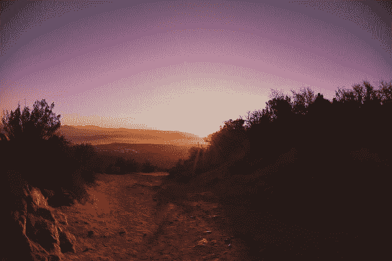
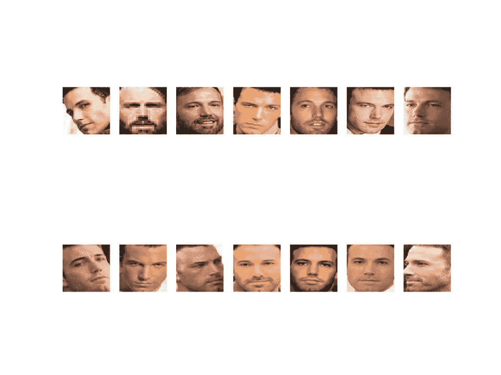
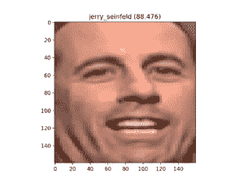

# 如何在 Keras 开发一个使用 FaceNet 的人脸识别系统

> 原文:[https://machinelearning master . com/如何开发人脸识别系统-使用-facenet-in-keras-and-an-SVM-分类器/](https://machinelearningmastery.com/how-to-develop-a-face-recognition-system-using-facenet-in-keras-and-an-svm-classifier/)

最后更新于 2020 年 8 月 24 日

[人脸识别](https://machinelearningmastery.com/introduction-to-deep-learning-for-face-recognition/)是一项基于人脸照片识别和验证人的计算机视觉任务。

FaceNet 是谷歌研究人员于 2015 年开发的人脸识别系统，在一系列人脸识别基准数据集上取得了当时最先进的结果。由于模型的多个第三方开源实现和预训练模型的可用性，FaceNet 系统可以被广泛使用。

FaceNet 系统可以用来从人脸中提取高质量的特征，称为人脸嵌入，然后可以用来训练人脸识别系统。

在本教程中，您将发现如何使用 FaceNet 和 SVM 分类器开发人脸检测系统，以从照片中识别人。

完成本教程后，您将知道:

*   关于由谷歌开发的 FaceNet 人脸识别系统以及开源实现和预训练模型。
*   如何准备人脸检测数据集包括首先通过人脸检测系统提取人脸，然后通过人脸嵌入提取人脸特征。
*   如何拟合，评估和演示一个 SVM 模型来预测人脸嵌入的身份。

**用我的新书[计算机视觉深度学习](https://machinelearningmastery.com/deep-learning-for-computer-vision/)启动你的项目**，包括*分步教程*和所有示例的 *Python 源代码*文件。

我们开始吧。

*   **2019 年 11 月更新:**针对 TensorFlow v2.0 和 MTCNN v0.1.0 进行了更新。



如何使用 Keras 中的 FaceNet 和 SVM 分类器开发人脸识别系统
图片由[彼得·瓦尔夫德](https://www.flickr.com/photos/petervalverde/45786176624/)提供，版权所有。

## 教程概述

本教程分为五个部分；它们是:

1.  人脸识别
2.  FaceNet 模型
3.  如何在 Keras 中加载 FaceNet 模型
4.  如何检测人脸进行人脸识别
5.  如何开发人脸分类系统

## 人脸识别

人脸识别是从人脸照片中识别和验证人的一般任务。

2011 年出版的名为《[人脸识别手册》](https://amzn.to/2EuR8Oo)的人脸识别书籍描述了人脸识别的两种主要模式，如下所示:

*   **人脸验证**。给定人脸与已知身份(例如*的一对一映射是这个人吗？*)。
*   **人脸识别**。给定人脸与已知人脸数据库的一对多映射(例如*这个人是谁？*)。

> 人脸识别系统有望自动识别图像和视频中的人脸。它可以在两种模式中的一种或两种模式下工作:(1)人脸验证(或认证)和(2)人脸识别(或识别)。

—第 1 页，[人脸识别手册](https://amzn.to/2EuR8Oo)。2011.

我们将在本教程中重点介绍人脸识别任务。

## FaceNet 模型

FaceNet 是一个人脸识别系统，由谷歌的 Florian schrovf 等人在他们 2015 年发表的题为“ [FaceNet:人脸识别和聚类的统一嵌入](https://arxiv.org/abs/1503.03832)的论文中描述

这是一个系统，给定一张人脸图片，将从人脸中提取高质量的特征，并预测这些特征的 128 元素向量表示，称为人脸嵌入。

> FaceNet，它直接学习从人脸图像到紧致欧氏空间的映射，其中距离直接对应于人脸相似性的度量。

——[Face net:人脸识别和聚类的统一嵌入](https://arxiv.org/abs/1503.03832)，2015。

该模型是通过三元组损失函数训练的深度卷积神经网络，鼓励相同身份的向量变得更相似(更小的距离)，而不同身份的向量预期变得不太相似(更大的距离)。专注于训练模型来直接创建嵌入(而不是从模型的中间层提取它们)是这项工作的一个重要创新。

> 我们的方法使用深度卷积网络来直接优化嵌入本身，而不是像以前的深度学习方法那样使用中间瓶颈层。

——[Face net:人脸识别和聚类的统一嵌入](https://arxiv.org/abs/1503.03832)，2015。

这些人脸嵌入随后被用作在标准人脸识别基准数据集上训练分类器系统的基础，获得当时最先进的结果。

> 与最佳公布结果相比，我们的系统将错误率降低了 30% …

——[Face net:人脸识别和聚类的统一嵌入](https://arxiv.org/abs/1503.03832)，2015。

论文还探索了嵌入的其他用途，例如根据提取的特征对相似人脸进行聚类。

这是一个健壮和有效的人脸识别系统，提取的人脸嵌入的一般性质使该方法具有广泛的应用。

## 如何在 Keras 中加载 FaceNet 模型

有许多项目提供工具来训练基于 FaceNet 的模型，并利用预先训练的模型。

也许最突出的是名为[的 OpenFace](https://cmusatyalab.github.io/openface/) ，它提供了使用 PyTorch 深度学习框架构建和训练的 FaceNet 模型。Keras 有一个 OpenFace 的端口，叫做 [Keras OpenFace](https://github.com/iwantooxxoox/Keras-OpenFace) ，但是在撰写本文的时候，模型似乎需要 Python 2，这是相当有局限性的。

另一个著名的项目是由大卫·桑德伯格开发的 [FaceNet，它提供了使用 TensorFlow 构建和训练的 FaceNet 模型。该项目看起来很成熟，尽管在撰写本文时并未提供基于库的安装，也没有干净的 API。有用的是，大卫的项目提供了许多高性能的预先训练的 FaceNet 模型，并且有许多项目移植或转换这些模型用于 Keras。](https://github.com/davidsandberg/facenet)

一个显著的例子是谷井弘的 Keras[face net](https://github.com/nyoki-mtl/keras-facenet)。他的项目提供了一个脚本，用于将盗梦空间 ResNet v1 模型从 TensorFlow 转换为 Keras。他还提供了一个预先训练好的 Keras 模型以备使用。

我们将在本教程中使用[谷井博树](https://github.com/nyoki-mtl)提供的预先训练好的 Keras FaceNet 模型。它在 [MS-Celeb-1M 数据集](https://www.microsoft.com/en-us/research/project/ms-celeb-1m-challenge-recognizing-one-million-celebrities-real-world/)上训练，期望输入图像是彩色的，像素值变白(在所有三个通道上标准化)，并且具有 160×160 像素的正方形形状。

模型可从这里下载:

*   [Keras FaceNet 预训练模型(88 兆字节)](https://drive.google.com/open?id=1pwQ3H4aJ8a6yyJHZkTwtjcL4wYWQb7bn)

下载模型文件，并将其放入当前工作目录中，文件名为“ *facenet_keras.h5* ”。

我们可以使用 *load_model()* 函数直接在 Keras 中加载模型；例如:

```py
# example of loading the keras facenet model
from keras.models import load_model
# load the model
model = load_model('facenet_keras.h5')
# summarize input and output shape
print(model.inputs)
print(model.outputs)
```

运行该示例加载模型并打印输入和输出张量的形状。

我们可以看到，该模型确实期望以形状为 160×160 的正方形彩色图像作为输入，并且将输出作为 128 元素向量的面部嵌入。

```py
# [<tf.Tensor 'input_1:0' shape=(?, 160, 160, 3) dtype=float32>]
# [<tf.Tensor 'Bottleneck_BatchNorm/cond/Merge:0' shape=(?, 128) dtype=float32>]
```

现在我们有了一个 FaceNet 模型，我们可以探索使用它。

## 如何检测人脸进行人脸识别

在我们能够进行人脸识别之前，我们需要检测人脸。

[人脸检测](https://machinelearningmastery.com/how-to-perform-face-detection-with-classical-and-deep-learning-methods-in-python-with-keras/)是在照片中自动定位人脸，并通过在人脸范围周围画一个边界框来定位人脸的过程。

在本教程中，我们还将使用多任务级联卷积神经网络(MTCNN)进行人脸检测，例如从照片中查找和提取人脸。这是一个最先进的人脸检测深度学习模型，在 2016 年发表的题为“使用多任务级联卷积网络的联合人脸检测和对齐”的论文中有所描述

我们将在 [ipazc/mtcnn 项目](https://github.com/ipazc/mtcnn)中使用 [Iván de Paz Centeno](https://www.linkedin.com/in/ivandepazcenteno/) 提供的实现。这也可以通过 pip 安装，如下所示:

```py
sudo pip install mtcnn
```

我们可以通过导入库并打印版本来确认库安装正确；例如:

```py
# confirm mtcnn was installed correctly
import mtcnn
# print version
print(mtcnn.__version__)
```

运行该示例将打印库的当前版本。

```py
0.1.0
```

我们可以使用 mtcnn 库来创建一个人脸检测器，并提取人脸，以便在后续部分中与 FaceNet 人脸检测器模型一起使用。

第一步是将图像加载为 NumPy 数组，我们可以使用 PIL 库和 *open()* 函数来实现。我们还会将图像转换为 RGB，以防图像有 alpha 通道或者是黑白的。

```py
# load image from file
image = Image.open(filename)
# convert to RGB, if needed
image = image.convert('RGB')
# convert to array
pixels = asarray(image)
```

接下来，我们可以创建一个 MTCNN 人脸检测器类，并使用它来检测加载照片中的所有人脸。

```py
# create the detector, using default weights
detector = MTCNN()
# detect faces in the image
results = detector.detect_faces(pixels)
```

结果是一个边界框列表，其中每个边界框定义了边界框的左下角，以及宽度和高度。

如果我们假设照片中只有一张脸用于实验，我们可以如下确定边界框的像素坐标。有时候库会返回负像素索引，我觉得这是一个 bug。我们可以通过取坐标的绝对值来解决这个问题。

```py
# extract the bounding box from the first face
x1, y1, width, height = results[0]['box']
# bug fix
x1, y1 = abs(x1), abs(y1)
x2, y2 = x1 + width, y1 + height
```

我们可以用这些坐标提取人脸。

```py
# extract the face
face = pixels[y1:y2, x1:x2]
```

然后，我们可以使用 PIL 图书馆来调整这个小图像的脸所需的大小；具体来说，该模型期望形状为 160×160 的正方形输入面。

```py
# resize pixels to the model size
image = Image.fromarray(face)
image = image.resize((160, 160))
face_array = asarray(image)
```

将所有这些结合在一起，函数 *extract_face()* 将从加载的文件名中加载一张照片，并返回提取的人脸。它假设照片包含一张脸，并将返回检测到的第一张脸。

```py
# function for face detection with mtcnn
from PIL import Image
from numpy import asarray
from mtcnn.mtcnn import MTCNN

# extract a single face from a given photograph
def extract_face(filename, required_size=(160, 160)):
	# load image from file
	image = Image.open(filename)
	# convert to RGB, if needed
	image = image.convert('RGB')
	# convert to array
	pixels = asarray(image)
	# create the detector, using default weights
	detector = MTCNN()
	# detect faces in the image
	results = detector.detect_faces(pixels)
	# extract the bounding box from the first face
	x1, y1, width, height = results[0]['box']
	# bug fix
	x1, y1 = abs(x1), abs(y1)
	x2, y2 = x1 + width, y1 + height
	# extract the face
	face = pixels[y1:y2, x1:x2]
	# resize pixels to the model size
	image = Image.fromarray(face)
	image = image.resize(required_size)
	face_array = asarray(image)
	return face_array

# load the photo and extract the face
pixels = extract_face('...')
```

我们可以在下一节中根据需要使用这个函数来提取人脸，这些人脸可以作为输入提供给 FaceNet 模型。

## 如何开发人脸分类系统

在本节中，我们将开发一个人脸检测系统来预测给定人脸的身份。

该模型将使用“ *5 名人脸数据集*”进行训练和测试，该数据集包含五位不同名人的许多照片。

我们将使用 MTCNN 模型进行人脸检测，FaceNet 模型将用于为每个检测到的人脸创建人脸嵌入，然后我们将开发[线性支持向量机(SVM)](https://machinelearningmastery.com/support-vector-machines-for-machine-learning/) 分类器模型来预测给定人脸的身份。

### 5 个名人面孔数据集

5 名人脸数据集是一个包含名人照片的小数据集。

其中包括本·阿弗莱克[埃尔顿·约翰](https://en.wikipedia.org/wiki/Elton_John)[杰瑞·宋飞](https://en.wikipedia.org/wiki/Jerry_Seinfeld)[麦当娜](https://en.wikipedia.org/wiki/Madonna_(entertainer))和[敏迪·卡灵](https://en.wikipedia.org/wiki/Mindy_Kaling)的照片。

数据集由[丹·贝克尔](https://www.linkedin.com/in/dansbecker/)准备并提供给[在卡格尔](https://www.kaggle.com/dansbecker/5-celebrity-faces-dataset)上免费下载。注意，下载数据集需要一个 Kaggle 帐户。

*   [5 名人脸数据集，卡格尔](https://www.kaggle.com/dansbecker/5-celebrity-faces-dataset)。

下载数据集(这可能需要 Kaggle 登录)、data.zip (2.5 兆字节)，并将其解压缩到本地目录中，文件夹名称为“*5-名人脸-数据集*”。

现在，您应该有一个具有以下结构的目录(注意，有些目录名存在拼写错误，在本例中它们保持原样):

```py
5-celebrity-faces-dataset
├── train
│   ├── ben_afflek
│   ├── elton_john
│   ├── jerry_seinfeld
│   ├── madonna
│   └── mindy_kaling
└── val
    ├── ben_afflek
    ├── elton_john
    ├── jerry_seinfeld
    ├── madonna
    └── mindy_kaling
```

我们可以看到有一个训练数据集和一个验证或测试数据集。

查看目录中的一些照片，我们可以看到这些照片提供了各种方向、照明和各种大小的人脸。重要的是，每张照片都包含了这个人的一张脸。

我们将使用这个数据集作为我们的分类器的基础，只在“ *train* ”数据集上进行训练，并在“ *val* 数据集上对人脸进行分类。你可以用同样的结构用你自己的照片开发一个分类器。

### 检测人脸

第一步是检测每张照片中的人脸，并将数据集简化为一系列人脸。

让我们测试一下上一节定义的人脸检测器功能，具体是 *extract_face()* 。

在“*5-名人脸-数据集/train/Ben _ a fleek/*”目录中查看，可以看到训练数据集中有 14 张 Ben Affleck 的照片。我们可以检测每张照片中的人脸，并创建一个包含 14 张人脸的图，每行有两行 7 张图像。

下面列出了完整的示例。

```py
# demonstrate face detection on 5 Celebrity Faces Dataset
from os import listdir
from PIL import Image
from numpy import asarray
from matplotlib import pyplot
from mtcnn.mtcnn import MTCNN

# extract a single face from a given photograph
def extract_face(filename, required_size=(160, 160)):
	# load image from file
	image = Image.open(filename)
	# convert to RGB, if needed
	image = image.convert('RGB')
	# convert to array
	pixels = asarray(image)
	# create the detector, using default weights
	detector = MTCNN()
	# detect faces in the image
	results = detector.detect_faces(pixels)
	# extract the bounding box from the first face
	x1, y1, width, height = results[0]['box']
	# bug fix
	x1, y1 = abs(x1), abs(y1)
	x2, y2 = x1 + width, y1 + height
	# extract the face
	face = pixels[y1:y2, x1:x2]
	# resize pixels to the model size
	image = Image.fromarray(face)
	image = image.resize(required_size)
	face_array = asarray(image)
	return face_array

# specify folder to plot
folder = '5-celebrity-faces-dataset/train/ben_afflek/'
i = 1
# enumerate files
for filename in listdir(folder):
	# path
	path = folder + filename
	# get face
	face = extract_face(path)
	print(i, face.shape)
	# plot
	pyplot.subplot(2, 7, i)
	pyplot.axis('off')
	pyplot.imshow(face)
	i += 1
pyplot.show()
```

运行该示例需要一点时间，并报告一路上每个加载照片的进度以及包含面部像素数据的 NumPy 数组的形状。

```py
1 (160, 160, 3)
2 (160, 160, 3)
3 (160, 160, 3)
4 (160, 160, 3)
5 (160, 160, 3)
6 (160, 160, 3)
7 (160, 160, 3)
8 (160, 160, 3)
9 (160, 160, 3)
10 (160, 160, 3)
11 (160, 160, 3)
12 (160, 160, 3)
13 (160, 160, 3)
14 (160, 160, 3)
```

将创建一个包含在本·阿弗莱克目录中检测到的人脸的图形。

我们可以看到，每个面部都被正确检测到，并且在检测到的面部中，我们有一系列的照明、肤色和方向。



从 5 张名人脸数据集的训练数据集中检测到的本·阿弗莱克的 14 张脸的图

目前为止，一切顺利。

接下来，我们可以扩展这个示例，为给定的数据集遍历每个子目录(例如“ *train* ”或“ *val* ”)，提取人脸，并为每个检测到的人脸准备一个名称作为输出标签的数据集。

下面的 *load_faces()* 函数会将所有的人脸加载到给定目录的列表中，例如“*5-名人脸-数据集/火车/Ben _ a fleek/*”。

```py
# load images and extract faces for all images in a directory
def load_faces(directory):
	faces = list()
	# enumerate files
	for filename in listdir(directory):
		# path
		path = directory + filename
		# get face
		face = extract_face(path)
		# store
		faces.append(face)
	return faces
```

我们可以为“*列车*或“ *val* 文件夹中的每个子目录调用 *load_faces()* 函数。每张脸都有一个标签，名人的名字，我们可以从目录名中取。

下面的 *load_dataset()* 函数取一个目录名，如“*5-名人脸-数据集/火车/* ”，为每个子目录(名人)检测人脸，为每个检测到的人脸分配标签。

它将数据集的 *X* 和 *y* 元素作为 NumPy 数组返回。

```py
# load a dataset that contains one subdir for each class that in turn contains images
def load_dataset(directory):
	X, y = list(), list()
	# enumerate folders, on per class
	for subdir in listdir(directory):
		# path
		path = directory + subdir + '/'
		# skip any files that might be in the dir
		if not isdir(path):
			continue
		# load all faces in the subdirectory
		faces = load_faces(path)
		# create labels
		labels = [subdir for _ in range(len(faces))]
		# summarize progress
		print('>loaded %d examples for class: %s' % (len(faces), subdir))
		# store
		X.extend(faces)
		y.extend(labels)
	return asarray(X), asarray(y)
```

然后，我们可以为“train”和“val”文件夹调用该函数来加载所有数据，然后通过 [savez_compressed()函数](https://docs.scipy.org/doc/numpy/reference/generated/numpy.savez_compressed.html)将结果保存在一个压缩的 NumPy 数组文件中。

```py
# load train dataset
trainX, trainy = load_dataset('5-celebrity-faces-dataset/train/')
print(trainX.shape, trainy.shape)
# load test dataset
testX, testy = load_dataset('5-celebrity-faces-dataset/val/')
print(testX.shape, testy.shape)
# save arrays to one file in compressed format
savez_compressed('5-celebrity-faces-dataset.npz', trainX, trainy, testX, testy)
```

将所有这些结合起来，下面列出了检测 5 张名人脸数据集中所有人脸的完整示例。

```py
# face detection for the 5 Celebrity Faces Dataset
from os import listdir
from os.path import isdir
from PIL import Image
from matplotlib import pyplot
from numpy import savez_compressed
from numpy import asarray
from mtcnn.mtcnn import MTCNN

# extract a single face from a given photograph
def extract_face(filename, required_size=(160, 160)):
	# load image from file
	image = Image.open(filename)
	# convert to RGB, if needed
	image = image.convert('RGB')
	# convert to array
	pixels = asarray(image)
	# create the detector, using default weights
	detector = MTCNN()
	# detect faces in the image
	results = detector.detect_faces(pixels)
	# extract the bounding box from the first face
	x1, y1, width, height = results[0]['box']
	# bug fix
	x1, y1 = abs(x1), abs(y1)
	x2, y2 = x1 + width, y1 + height
	# extract the face
	face = pixels[y1:y2, x1:x2]
	# resize pixels to the model size
	image = Image.fromarray(face)
	image = image.resize(required_size)
	face_array = asarray(image)
	return face_array

# load images and extract faces for all images in a directory
def load_faces(directory):
	faces = list()
	# enumerate files
	for filename in listdir(directory):
		# path
		path = directory + filename
		# get face
		face = extract_face(path)
		# store
		faces.append(face)
	return faces

# load a dataset that contains one subdir for each class that in turn contains images
def load_dataset(directory):
	X, y = list(), list()
	# enumerate folders, on per class
	for subdir in listdir(directory):
		# path
		path = directory + subdir + '/'
		# skip any files that might be in the dir
		if not isdir(path):
			continue
		# load all faces in the subdirectory
		faces = load_faces(path)
		# create labels
		labels = [subdir for _ in range(len(faces))]
		# summarize progress
		print('>loaded %d examples for class: %s' % (len(faces), subdir))
		# store
		X.extend(faces)
		y.extend(labels)
	return asarray(X), asarray(y)

# load train dataset
trainX, trainy = load_dataset('5-celebrity-faces-dataset/train/')
print(trainX.shape, trainy.shape)
# load test dataset
testX, testy = load_dataset('5-celebrity-faces-dataset/val/')
# save arrays to one file in compressed format
savez_compressed('5-celebrity-faces-dataset.npz', trainX, trainy, testX, testy)
```

运行该示例可能需要一些时间。

首先加载“*训练*”数据集中的所有照片，然后提取人脸，得到 93 个输入为正方形人脸、输出为类别标签串的样本。然后加载“ *val* 数据集，提供 25 个样本作为测试数据集。

然后，这两个数据集都被保存到一个名为“*5-名人脸-数据集. npz* ”的压缩 NumPy 数组文件中，该文件约为 3 兆字节，存储在当前工作目录中。

```py
>loaded 14 examples for class: ben_afflek
>loaded 19 examples for class: madonna
>loaded 17 examples for class: elton_john
>loaded 22 examples for class: mindy_kaling
>loaded 21 examples for class: jerry_seinfeld
(93, 160, 160, 3) (93,)
>loaded 5 examples for class: ben_afflek
>loaded 5 examples for class: madonna
>loaded 5 examples for class: elton_john
>loaded 5 examples for class: mindy_kaling
>loaded 5 examples for class: jerry_seinfeld
(25, 160, 160, 3) (25,)
```

该数据集已准备好提供给人脸检测模型。

### 创建面嵌入

下一步是创建人脸嵌入。

人脸嵌入是表示从人脸中提取的特征的向量。然后可以将其与为其他面生成的矢量进行比较。例如，另一个靠近的向量(以某种度量)可能是同一个人，而另一个远的向量(以某种度量)可能是不同的人。

我们要开发的分类器模型将人脸嵌入作为输入，并预测人脸的身份。FaceNet 模型将为给定的人脸图像生成这种嵌入。

FaceNet 模型可以用作分类器本身的一部分，或者我们可以使用 FaceNet 模型对人脸进行预处理，以创建人脸嵌入，该嵌入可以被存储并用作我们的分类器模型的输入。后一种方法是首选的，因为 FaceNet 模型既大又慢，无法创建人脸嵌入。

因此，我们可以预先计算列车中所有人脸的人脸嵌入，并在我们的 5 个名人人脸数据集中测试(形式上为' *val* '集合)。

首先，我们可以使用 [load() NumPy 函数](https://docs.scipy.org/doc/numpy/reference/generated/numpy.load.html)加载我们检测到的人脸数据集。

```py
# load the face dataset
data = load('5-celebrity-faces-dataset.npz')
trainX, trainy, testX, testy = data['arr_0'], data['arr_1'], data['arr_2'], data['arr_3']
print('Loaded: ', trainX.shape, trainy.shape, testX.shape, testy.shape)
```

接下来，我们可以加载我们的 FaceNet 模型，准备将面转换为面嵌入。

```py
# load the facenet model
model = load_model('facenet_keras.h5')
print('Loaded Model')
```

然后，我们可以枚举训练和测试数据集中的每个人脸来预测嵌入。

为了预测嵌入，首先需要适当地准备图像的像素值，以满足 FaceNet 模型的期望。FaceNet 模型的这个具体实现期望像素值是标准化的。

```py
# scale pixel values
face_pixels = face_pixels.astype('float32')
# standardize pixel values across channels (global)
mean, std = face_pixels.mean(), face_pixels.std()
face_pixels = (face_pixels - mean) / std
```

为了对 Keras 中的一个示例进行预测，我们必须扩展维度，以便人脸数组是一个样本。

```py
# transform face into one sample
samples = expand_dims(face_pixels, axis=0)
```

然后，我们可以使用该模型进行预测并提取嵌入向量。

```py
# make prediction to get embedding
yhat = model.predict(samples)
# get embedding
embedding = yhat[0]
```

下面定义的 *get_embedding()* 函数实现了这些行为，并将返回给定一张人脸图像和加载的 FaceNet 模型的人脸嵌入。

```py
# get the face embedding for one face
def get_embedding(model, face_pixels):
	# scale pixel values
	face_pixels = face_pixels.astype('float32')
	# standardize pixel values across channels (global)
	mean, std = face_pixels.mean(), face_pixels.std()
	face_pixels = (face_pixels - mean) / std
	# transform face into one sample
	samples = expand_dims(face_pixels, axis=0)
	# make prediction to get embedding
	yhat = model.predict(samples)
	return yhat[0]
```

将所有这些结合在一起，下面列出了将每个人脸转换为嵌入在训练和测试数据集中的人脸的完整示例。

```py
# calculate a face embedding for each face in the dataset using facenet
from numpy import load
from numpy import expand_dims
from numpy import asarray
from numpy import savez_compressed
from keras.models import load_model

# get the face embedding for one face
def get_embedding(model, face_pixels):
	# scale pixel values
	face_pixels = face_pixels.astype('float32')
	# standardize pixel values across channels (global)
	mean, std = face_pixels.mean(), face_pixels.std()
	face_pixels = (face_pixels - mean) / std
	# transform face into one sample
	samples = expand_dims(face_pixels, axis=0)
	# make prediction to get embedding
	yhat = model.predict(samples)
	return yhat[0]

# load the face dataset
data = load('5-celebrity-faces-dataset.npz')
trainX, trainy, testX, testy = data['arr_0'], data['arr_1'], data['arr_2'], data['arr_3']
print('Loaded: ', trainX.shape, trainy.shape, testX.shape, testy.shape)
# load the facenet model
model = load_model('facenet_keras.h5')
print('Loaded Model')
# convert each face in the train set to an embedding
newTrainX = list()
for face_pixels in trainX:
	embedding = get_embedding(model, face_pixels)
	newTrainX.append(embedding)
newTrainX = asarray(newTrainX)
print(newTrainX.shape)
# convert each face in the test set to an embedding
newTestX = list()
for face_pixels in testX:
	embedding = get_embedding(model, face_pixels)
	newTestX.append(embedding)
newTestX = asarray(newTestX)
print(newTestX.shape)
# save arrays to one file in compressed format
savez_compressed('5-celebrity-faces-embeddings.npz', newTrainX, trainy, newTestX, testy)
```

运行该示例会报告一路上的进度。

我们可以看到，人脸数据集加载正确，模型也是如此。然后将训练数据集转换成 93 个人脸嵌入，每个嵌入由 128 个元素向量组成。测试数据集中的 25 个示例也被适当地转换为面嵌入。

然后将结果数据集保存到一个压缩的 NumPy 数组中，该数组约为 50 千字节，在当前工作目录中的名称为“*5-名人脸-嵌入. npz* ”。

```py
Loaded:  (93, 160, 160, 3) (93,) (25, 160, 160, 3) (25,)
Loaded Model
(93, 128)
(25, 128)
```

我们现在准备开发我们的人脸分类系统。

### 执行人脸分类

在本节中，我们将开发一个模型，将人脸嵌入分类为 5 个名人人脸数据集中已知的名人之一。

首先，我们必须加载人脸嵌入数据集。

```py
# load dataset
data = load('5-celebrity-faces-embeddings.npz')
trainX, trainy, testX, testy = data['arr_0'], data['arr_1'], data['arr_2'], data['arr_3']
print('Dataset: train=%d, test=%d' % (trainX.shape[0], testX.shape[0]))
```

接下来，数据需要在建模之前做一些小的准备。

首先，对人脸嵌入向量进行归一化是一种很好的做法。这是一个很好的实践，因为向量经常使用距离度量来相互比较。

在本文中，[向量归一化](https://machinelearningmastery.com/vector-norms-machine-learning/)意味着缩放值，直到向量的长度或大小为 1 或单位长度。这可以使用 scikit-learn 中的[规格化器类来实现。在前一步中创建面嵌入时，执行这一步可能会更方便。](https://scikit-learn.org/stable/modules/generated/sklearn.preprocessing.Normalizer.html)

```py
# normalize input vectors
in_encoder = Normalizer(norm='l2')
trainX = in_encoder.transform(trainX)
testX = in_encoder.transform(testX)
```

接下来，每个名人名字的字符串目标变量需要转换成整数。

这可以通过 scikit-learn 中的[标签编码器类来实现。](https://scikit-learn.org/stable/modules/generated/sklearn.preprocessing.LabelEncoder.html)

```py
# label encode targets
out_encoder = LabelEncoder()
out_encoder.fit(trainy)
trainy = out_encoder.transform(trainy)
testy = out_encoder.transform(testy)
```

接下来，我们可以拟合一个模型。

在处理标准化人脸嵌入输入时，通常使用[线性支持向量机(SVM)](https://machinelearningmastery.com/support-vector-machines-for-machine-learning/) 。这是因为该方法在分离人脸嵌入向量方面非常有效。我们可以使用 scikit-learn 中的 [SVC 类](https://scikit-learn.org/stable/modules/generated/sklearn.svm.SVC.html)将线性 SVM 拟合到训练数据，并将“*内核*属性设置为“*线性*”。我们以后做预测的时候可能也要概率，可以通过设置“*概率*”为“*真*”来配置。

```py
# fit model
model = SVC(kernel='linear')
model.fit(trainX, trainy)
```

接下来，我们可以对模型进行评估。

这可以通过使用拟合模型对训练和测试数据集中的每个示例进行预测，然后计算分类精度来实现。

```py
# predict
yhat_train = model.predict(trainX)
yhat_test = model.predict(testX)
# score
score_train = accuracy_score(trainy, yhat_train)
score_test = accuracy_score(testy, yhat_test)
# summarize
print('Accuracy: train=%.3f, test=%.3f' % (score_train*100, score_test*100))
```

将所有这些结合在一起，下面列出了在 5 个名人脸数据集的脸嵌入上拟合线性 SVM 的完整示例。

```py
# develop a classifier for the 5 Celebrity Faces Dataset
from numpy import load
from sklearn.metrics import accuracy_score
from sklearn.preprocessing import LabelEncoder
from sklearn.preprocessing import Normalizer
from sklearn.svm import SVC
# load dataset
data = load('5-celebrity-faces-embeddings.npz')
trainX, trainy, testX, testy = data['arr_0'], data['arr_1'], data['arr_2'], data['arr_3']
print('Dataset: train=%d, test=%d' % (trainX.shape[0], testX.shape[0]))
# normalize input vectors
in_encoder = Normalizer(norm='l2')
trainX = in_encoder.transform(trainX)
testX = in_encoder.transform(testX)
# label encode targets
out_encoder = LabelEncoder()
out_encoder.fit(trainy)
trainy = out_encoder.transform(trainy)
testy = out_encoder.transform(testy)
# fit model
model = SVC(kernel='linear', probability=True)
model.fit(trainX, trainy)
# predict
yhat_train = model.predict(trainX)
yhat_test = model.predict(testX)
# score
score_train = accuracy_score(trainy, yhat_train)
score_test = accuracy_score(testy, yhat_test)
# summarize
print('Accuracy: train=%.3f, test=%.3f' % (score_train*100, score_test*100))
```

运行该示例首先确认训练和测试数据集中的样本数量与我们预期的一样

接下来，在训练和测试数据集上对模型进行评估，显示出完美的分类精度。考虑到数据集的大小以及所使用的人脸检测和人脸识别模型的能力，这并不奇怪。

```py
Dataset: train=93, test=25
Accuracy: train=100.000, test=100.000
```

我们可以通过绘制原始人脸和预测来使它更有趣。

首先，我们需要加载人脸数据集，特别是测试数据集中的人脸。我们还可以加载原始照片，使其更加有趣。

```py
# load faces
data = load('5-celebrity-faces-dataset.npz')
testX_faces = data['arr_2']
```

在我们适应模型之前，示例的其余部分都是一样的。

首先，我们需要从测试集中选择一个随机的例子，然后得到嵌入、人脸像素、期望的类预测以及类的对应名称。

```py
# test model on a random example from the test dataset
selection = choice([i for i in range(testX.shape[0])])
random_face_pixels = testX_faces[selection]
random_face_emb = testX[selection]
random_face_class = testy[selection]
random_face_name = out_encoder.inverse_transform([random_face_class])
```

接下来，我们可以使用人脸嵌入作为输入，用拟合模型进行单次预测。

我们可以预测类整数和预测的概率。

```py
# prediction for the face
samples = expand_dims(random_face_emb, axis=0)
yhat_class = model.predict(samples)
yhat_prob = model.predict_proba(samples)
```

然后我们可以得到预测的类整数的名称，以及这个预测的概率。

```py
# get name
class_index = yhat_class[0]
class_probability = yhat_prob[0,class_index] * 100
predict_names = out_encoder.inverse_transform(yhat_class)
```

然后我们可以打印这些信息。

```py
print('Predicted: %s (%.3f)' % (predict_names[0], class_probability))
print('Expected: %s' % random_face_name[0])
```

我们还可以绘制人脸像素以及预测的名称和概率。

```py
# plot for fun
pyplot.imshow(random_face_pixels)
title = '%s (%.3f)' % (predict_names[0], class_probability)
pyplot.title(title)
pyplot.show()
```

将所有这些联系在一起，下面列出了预测测试数据集中给定未见过照片的身份的完整示例。

```py
# develop a classifier for the 5 Celebrity Faces Dataset
from random import choice
from numpy import load
from numpy import expand_dims
from sklearn.preprocessing import LabelEncoder
from sklearn.preprocessing import Normalizer
from sklearn.svm import SVC
from matplotlib import pyplot
# load faces
data = load('5-celebrity-faces-dataset.npz')
testX_faces = data['arr_2']
# load face embeddings
data = load('5-celebrity-faces-embeddings.npz')
trainX, trainy, testX, testy = data['arr_0'], data['arr_1'], data['arr_2'], data['arr_3']
# normalize input vectors
in_encoder = Normalizer(norm='l2')
trainX = in_encoder.transform(trainX)
testX = in_encoder.transform(testX)
# label encode targets
out_encoder = LabelEncoder()
out_encoder.fit(trainy)
trainy = out_encoder.transform(trainy)
testy = out_encoder.transform(testy)
# fit model
model = SVC(kernel='linear', probability=True)
model.fit(trainX, trainy)
# test model on a random example from the test dataset
selection = choice([i for i in range(testX.shape[0])])
random_face_pixels = testX_faces[selection]
random_face_emb = testX[selection]
random_face_class = testy[selection]
random_face_name = out_encoder.inverse_transform([random_face_class])
# prediction for the face
samples = expand_dims(random_face_emb, axis=0)
yhat_class = model.predict(samples)
yhat_prob = model.predict_proba(samples)
# get name
class_index = yhat_class[0]
class_probability = yhat_prob[0,class_index] * 100
predict_names = out_encoder.inverse_transform(yhat_class)
print('Predicted: %s (%.3f)' % (predict_names[0], class_probability))
print('Expected: %s' % random_face_name[0])
# plot for fun
pyplot.imshow(random_face_pixels)
title = '%s (%.3f)' % (predict_names[0], class_probability)
pyplot.title(title)
pyplot.show()
```

每次运行代码时，都会从测试数据集中选择一个不同的随机示例。

**注**:考虑到算法或评估程序的随机性，或数值精度的差异，您的[结果可能会有所不同](https://machinelearningmastery.com/different-results-each-time-in-machine-learning/)。考虑运行该示例几次，并比较平均结果。

在这种情况下，选择并正确预测了杰瑞·宋飞的照片。

```py
Predicted: jerry_seinfeld (88.476)
Expected: jerry_seinfeld
```

还会创建所选面部的绘图，在图像标题中显示预测的名称和概率。



SVM 分类器正确识别的杰瑞·宋飞人脸

## 进一步阅读

如果您想更深入地了解这个主题，本节将提供更多资源。

### 报纸

*   [FaceNet:人脸识别和聚类的统一嵌入](https://arxiv.org/abs/1503.03832)，2015。

### 书

*   [人脸识别手册，](https://amzn.to/2EuR8Oo) 2011。

### 项目

*   [开放空间 PyTorch 项目](https://cmusatyalab.github.io/openface/)。
*   [开放式角质工程，GitHub](https://github.com/iwantooxxoox/Keras-OpenFace) 。
*   [喀拉拉面网项目，GitHub](https://github.com/nyoki-mtl/keras-facenet) 。
*   [MS-celebe 1M 数据集](https://www.microsoft.com/en-us/research/project/ms-celeb-1m-challenge-recognizing-one-million-celebrities-real-world/)。

### 蜜蜂

*   [sklearn . preference . normalizer API](https://scikit-learn.org/stable/modules/generated/sklearn.preprocessing.Normalizer.html)
*   [硬化。预处理。标签编码 API](https://scikit-learn.org/stable/modules/generated/sklearn.preprocessing.LabelEncoder.html)
*   [硬化. svm.SVC API](https://scikit-learn.org/stable/modules/generated/sklearn.svm.SVC.html)

## 摘要

在本教程中，您发现了如何使用 FaceNet 和 SVM 分类器开发人脸检测系统，以从照片中识别人。

具体来说，您了解到:

*   关于由谷歌开发的 FaceNet 人脸识别系统以及开源实现和预训练模型。
*   如何准备人脸检测数据集包括首先通过人脸检测系统提取人脸，然后通过人脸嵌入提取人脸特征。
*   如何拟合，评估和演示一个 SVM 模型来预测人脸嵌入的身份。

你有什么问题吗？
在下面的评论中提问，我会尽力回答。