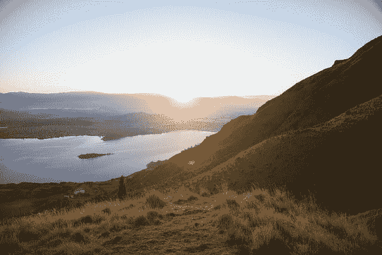

# 如何开始计算机视觉深度学习(7 天迷你课程)

> 原文:[https://machinelearning master . com/计算机视觉深度学习入门 7 天小课程/](https://machinelearningmastery.com/how-to-get-started-with-deep-learning-for-computer-vision-7-day-mini-course/)

最后更新于 2020 年 4 月 2 日

#### 计算机视觉速成课程深度学习。
7 天内为你的计算机视觉项目带来深度学习方法。

我们充斥着来自照片、视频、Instagram、YouTube 的数字图像，以及越来越多的实时视频流。

处理图像数据很难，因为它需要从不同的领域汲取知识，如数字信号处理、机器学习、统计方法，以及当今的深度学习。

在一些具有奇异性和简单模型的具有挑战性的计算机视觉问题上，深度学习方法正在超越经典方法和统计方法。

在本速成课程中，您将发现如何在七天内使用 Python 开始并自信地开发针对计算机视觉问题的深度学习。

**注:** *这是一个很大很重要的岗位。你可能想把它做成书签。*

我们开始吧。

*   **2019 年 11 月更新:**针对 TensorFlow v2.0 和 MTCNN v0.1.0 进行了更新。



如何开始计算机视觉深度学习(7 天迷你课程)
图片由 [oliver.dodd](https://www.flickr.com/photos/oliverdodd/46603951932/) 提供，保留部分权利。

## 这个速成班是给谁的？

在我们开始之前，让我们确保你在正确的地方。

下面的列表提供了一些关于本课程是为谁设计的一般指南。

如果这些点不完全匹配，不要惊慌；你可能只需要在一个或另一个领域进行复习就能跟上。

**你需要知道:**

*   为了深入学习，您需要了解基本的 Python、NumPy 和 Keras。

**你不需要成为:**

*   你不需要成为数学天才！
*   你不需要成为深度学习专家！
*   你不需要成为计算机视觉研究员！

这门速成课程将把你从一个懂得一点机器学习的开发人员带到一个能给你自己的计算机视觉项目带来深度学习方法的开发人员。

**注**:本速成课程假设您有一个正在运行的 Python 2 或 3 SciPy 环境，其中至少安装了 NumPy、Pandas、scikit-learn 和 Keras 2。如果您需要环境方面的帮助，可以遵循这里的逐步教程:

*   [如何设置机器学习和深度学习的 Python 环境](https://machinelearningmastery.com/setup-python-environment-machine-learning-deep-learning-anaconda/)

## 速成班概述

这门速成课分为七节课。

您可以每天完成一节课(推荐)或一天内完成所有课程(硬核)。这真的取决于你有多少时间和你的热情程度。

以下七节课将帮助您开始深入学习 Python 中的计算机视觉，并提高工作效率:

*   **第 01 课**:深度学习与计算机视觉
*   **第 02 课**:准备图像数据
*   **第 03 课**:卷积神经网络
*   **第 04 课**:图像分类
*   **第 05 课**:列车图像分类模型
*   **第 06 课**:图片增加
*   **第 07 课**:人脸检测

每节课可能花费你 60 秒到 30 分钟。慢慢来，按照自己的节奏完成课程。提问，甚至在下面的评论中发布结果。

这些课程可能期望你去发现如何做事。我会给你提示，但每节课的一部分要点是强迫你学习去哪里寻找关于深度学习、计算机视觉和 Python 中同类最佳工具的帮助(*提示*:我在这个博客上有所有的答案，只需使用搜索框)。

在评论中发布您的结果；我会为你加油的！

坚持住。不要放弃。

注:这只是一个速成班。关于更多的细节和充实的教程，请参见我的书，题目是“计算机视觉的深度学习”

## 第一课:深度学习和计算机视觉

在本课中，您将发现计算机视觉深度学习方法的前景。

### 计算机视觉

计算机视觉，简称 CV，被广泛定义为帮助计算机“看到”*或从照片和视频等数字图像中提取意义。*

50 多年来，研究人员一直致力于帮助计算机视觉的问题，并取得了一些巨大的成功，例如现代相机和智能手机中可用的人脸检测。

理解图像的问题没有解决，而且可能永远不会解决。这主要是因为这个世界既复杂又混乱。规则很少。然而，我们可以轻松地识别物体、人和环境。

### 深度学习

深度学习(Deep Learning)是机器学习的一个分支，它关注的是受大脑结构和功能启发的算法，称为人工神经网络。

深度学习的一个特性是，这种类型的模型的性能通过用更多的例子训练它以及通过增加它的深度或表示能力来提高。

除了可扩展性之外，深度学习模型的另一个经常被引用的好处是它们能够从原始数据中执行自动特征提取，也称为特征学习。

### 计算机视觉深度学习的前景

深度学习方法在计算机视觉领域很受欢迎，主要是因为它们兑现了自己的承诺。

深度学习的力量最初的一些大型演示是在计算机视觉中，特别是图像分类。最近在物体检测和人脸识别。

计算机视觉深度学习的三个关键承诺如下:

*   **特征学习的承诺**。也就是说，深度学习方法可以从模型所需的图像数据中自动学习特征，而不是要求特征检测器由专家手工制作和指定。
*   **持续改进的承诺**。也就是说，计算机视觉中深度学习的表现是基于真实的结果，并且这些改进似乎在继续，也许还在加快。
*   **端到端模型的承诺**。也就是说，大型端到端深度学习模型可以适用于大型图像或视频数据集，从而提供更通用、性能更好的方法。

计算机视觉不是*解决的*，而是需要深度学习才能让你在该领域的许多挑战性问题上达到最先进的水平。

### 你的任务

这节课，你必须研究并列出深度学习方法在计算机视觉领域的五个令人印象深刻的应用。如果你能链接到一篇演示这个例子的研究论文，你将获得加分。

在下面的评论中发表你的答案。我很想看看你的发现。

在下一课中，您将了解如何为建模准备图像数据。

## 第 02 课:准备图像数据

在本课中，您将了解如何为建模准备图像数据。

图像由像素值矩阵组成。

像素值通常是 0 到 255 之间的无符号整数。尽管这些像素值可以以原始格式直接呈现给神经网络模型，但这可能会导致建模过程中的挑战，例如模型的训练比预期的慢。

相反，在建模之前准备图像像素值可能会有很大的好处，例如简单地将像素值缩放到 0-1 的范围，以居中甚至标准化这些值。

这称为规范化，可以直接在加载的图像上执行。下面的示例使用 PIL 库(Python 中的标准图像处理库)来加载图像并规范化其像素值。

首先，确认您已经安装了枕头库；它安装在大多数 SciPy 环境中，但您可以在这里了解更多信息:

*   [PIL/枕头安装说明](https://pillow.readthedocs.io/en/stable/installation.html)

接下来，下载一张澳大利亚悉尼邦迪海滩的照片，由伊莎贝尔·舒尔茨拍摄，并根据许可许可发布。将图像保存在当前工作目录中，文件名为“ *bondi_beach.jpg* ”。

*   [下载邦迪海滩照片(bondi_beach.jpg)](https://machinelearningmastery.com/wp-content/uploads/2019/01/bondi_beach.jpg)

接下来，我们可以使用枕头库加载照片，确认最小和最大像素值，对这些值进行归一化，并确认进行了归一化。

```
# example of pixel normalization
from numpy import asarray
from PIL import Image
# load image
image = Image.open('bondi_beach.jpg')
pixels = asarray(image)
# confirm pixel range is 0-255
print('Data Type: %s' % pixels.dtype)
print('Min: %.3f, Max: %.3f' % (pixels.min(), pixels.max()))
# convert from integers to floats
pixels = pixels.astype('float32')
# normalize to the range 0-1
pixels /= 255.0
# confirm the normalization
print('Min: %.3f, Max: %.3f' % (pixels.min(), pixels.max()))
```

### 你的任务

本课的任务是在提供的照片上运行示例代码，并报告归一化前后的最小和最大像素值。

对于加分，您可以更新示例以标准化像素值。

在下面的评论中发表你的发现。我很想看看你的发现。

在下一课中，您将发现关于卷积神经网络模型的信息。

## 第三课:卷积神经网络

在本课中，您将发现如何使用卷积层、池层和完全连接的输出层来构建卷积神经网络。

### 卷积层

卷积是将滤波器简单地应用于导致激活的输入。对输入重复应用相同的过滤器会产生一个称为特征图的激活图，指示输入(如图像)中检测到的特征的位置和强度。

通过指定要学习的滤波器数量和每个滤波器的固定大小(通常称为内核形状)，可以创建一个[卷积层](https://machinelearningmastery.com/convolutional-layers-for-deep-learning-neural-networks/)。

### 汇集层

[汇集图层](https://machinelearningmastery.com/pooling-layers-for-convolutional-neural-networks/)通过总结要素图的面片中存在的要素，提供了一种对要素图进行下采样的方法。

最大池化或最大池化是一种池化操作，用于计算每个要素地图的每个面片中的最大值。

### 分类器层

一旦特征被提取出来，它们就可以被解释并用于进行预测，例如对照片中的对象类型进行分类。

这可以通过首先展平二维要素图，然后添加完全连接的输出图层来实现。对于二进制分类问题，输出层将有一个节点来预测两个类的值在 0 和 1 之间。

### 卷积神经网络

下面的例子创建了一个卷积神经网络，它期望灰度图像的平方大小为 256×256 像素，一个卷积层有 32 个滤波器，每个滤波器的大小为 3×3 像素，一个最大池层和一个二进制分类输出层。

```
# cnn with single convolutional, pooling and output layer
from keras.models import Sequential
from keras.layers import Conv2D
from keras.layers import MaxPooling2D
from keras.layers import Flatten
from keras.layers import Dense
# create model
model = Sequential()
# add convolutional layer
model.add(Conv2D(32, (3,3), input_shape=(256, 256, 1)))
model.add(MaxPooling2D())
model.add(Flatten())
model.add(Dense(1, activation='sigmoid'))
model.summary()
```

### 你的任务

在本课中，您的任务是运行该示例，并描述卷积层和池层如何改变输入图像的形状。

对于额外的点，您可以尝试添加更多的卷积层或池层，并描述它在流经模型时对图像的影响。

在下面的评论中发表你的发现。我很想看看你的发现。

在下一课中，您将学习如何使用深度卷积神经网络对对象的照片进行分类。

## 第 04 课:图像分类

在本课中，您将发现如何使用预先训练好的模型对对象的照片进行分类。

深度卷积神经网络模型在非常大的数据集上训练可能需要几天甚至几周的时间。

简化这一过程的一种方法是重用为标准计算机视觉基准数据集(如 ImageNet 图像识别任务)开发的预训练模型的模型权重。

下面的例子使用 VGG-16 预训练模型将物体的照片分类到 1000 个已知类别中的一个。

下载这张由[贾斯汀·摩根](https://www.flickr.com/photos/jmorgan/5164287/)拍摄并在许可许可下发布的狗的照片。用文件名“*dog.jpg*将其保存在您当前的工作目录中。

*   [下载狗的照片(dog.jpg)](https://machinelearningmastery.com/wp-content/uploads/2019/02/dog.jpg)

以下示例将加载照片并输出预测，对照片中的对象进行分类。

**注意**:第一次运行这个例子，需要下载预训练好的模型，几百兆，根据你上网的速度做几分钟。

```
# example of using a pre-trained model as a classifier
from keras.preprocessing.image import load_img
from keras.preprocessing.image import img_to_array
from keras.applications.vgg16 import preprocess_input
from keras.applications.vgg16 import decode_predictions
from keras.applications.vgg16 import VGG16
# load an image from file
image = load_img('dog.jpg', target_size=(224, 224))
# convert the image pixels to a numpy array
image = img_to_array(image)
# reshape data for the model
image = image.reshape((1, image.shape[0], image.shape[1], image.shape[2]))
# prepare the image for the VGG model
image = preprocess_input(image)
# load the model
model = VGG16()
# predict the probability across all output classes
yhat = model.predict(image)
# convert the probabilities to class labels
label = decode_predictions(yhat)
# retrieve the most likely result, e.g. highest probability
label = label[0][0]
# print the classification
print('%s (%.2f%%)' % (label[1], label[2]*100))
```

### 你的任务

本课的任务是运行示例并报告结果。

要获得加分，请尝试在另一张普通物体的照片上运行该示例。

在下面的评论中发表你的发现。我很想看看你的发现。

在下一课中，您将发现如何拟合和评估图像分类模型。

## 第五课:列车图像分类模型

在本课中，您将发现如何训练和评估用于图像分类的卷积神经网络。

[Fashion-MNIST](https://machinelearningmastery.com/how-to-develop-a-cnn-from-scratch-for-fashion-mnist-clothing-classification/) 服装分类问题是一个用于计算机视觉和深度学习的新标准数据集。

它是一个数据集，由 60，000 个 28×28 像素的小正方形灰度图像组成，包括 10 种服装，如鞋子、t 恤、连衣裙等。

下面的示例加载数据集，缩放像素值，然后在训练数据集上拟合卷积神经网络，并在测试数据集上评估网络的性能。

这个例子将在现代的中央处理器上运行几分钟；不需要 GPU。

```
# fit a cnn on the fashion mnist dataset
from keras.datasets import fashion_mnist
from keras.utils import to_categorical
from keras.models import Sequential
from keras.layers import Conv2D
from keras.layers import MaxPooling2D
from keras.layers import Dense
from keras.layers import Flatten
# load dataset
(trainX, trainY), (testX, testY) = fashion_mnist.load_data()
# reshape dataset to have a single channel
trainX = trainX.reshape((trainX.shape[0], 28, 28, 1))
testX = testX.reshape((testX.shape[0], 28, 28, 1))
# convert from integers to floats
trainX, testX = trainX.astype('float32'), testX.astype('float32')
# normalize to range 0-1
trainX,testX  = trainX / 255.0, testX / 255.0
# one hot encode target values
trainY, testY = to_categorical(trainY), to_categorical(testY)
# define model
model = Sequential()
model.add(Conv2D(32, (3, 3), activation='relu', kernel_initializer='he_uniform', input_shape=(28, 28, 1)))
model.add(MaxPooling2D())
model.add(Flatten())
model.add(Dense(100, activation='relu', kernel_initializer='he_uniform'))
model.add(Dense(10, activation='softmax'))
model.compile(optimizer='adam', loss='categorical_crossentropy', metrics=['accuracy'])
# fit model
model.fit(trainX, trainY, epochs=10, batch_size=32, verbose=2)
# evaluate model
loss, acc = model.evaluate(testX, testY, verbose=0)
print(loss, acc)
```

### 你的任务

在本课中，您的任务是运行示例并报告模型在测试数据集上的性能。

对于奖励点，尝试改变模型的配置，或者尝试保存模型，然后加载它，并使用它对服装的新灰度照片进行预测。

在下面的评论中发表你的发现。我很想看看你的发现。

在下一课中，您将发现如何在训练数据上使用图像增强。

## 第 6 课:图像放大

在本课中，您将发现如何使用图像增强。

[图像数据增强](https://machinelearningmastery.com/how-to-configure-image-data-augmentation-when-training-deep-learning-neural-networks/)是一种可以通过在数据集中创建图像的修改版本来人工扩展训练数据集大小的技术。

在更多的数据上训练深度学习神经网络模型可以产生更熟练的模型，并且增强技术可以创建图像的变化，这可以提高拟合模型将他们所学知识推广到新图像的能力。

Keras 深度学习神经网络库通过 [ImageDataGenerator 类](https://keras.io/preprocessing/image/)提供了使用图像数据增强来拟合模型的能力。

下载一张由[和 YaDontStop](https://www.flickr.com/photos/thenovys/3854468621/) 拍摄的鸟的照片，在许可的许可下发布。将其保存到您当前的工作目录中，名称为“*bird.jpg*”。

*   [下载一只鸟的照片(bird.jpg)](https://machinelearningmastery.com/wp-content/uploads/2019/01/bird.jpg)

下面的示例将照片加载为数据集，并使用图像增强来创建图像的翻转和旋转版本，该版本可用于训练卷积神经网络模型。

```
# example using image augmentation
from numpy import expand_dims
from keras.preprocessing.image import load_img
from keras.preprocessing.image import img_to_array
from keras.preprocessing.image import ImageDataGenerator
from matplotlib import pyplot
# load the image
img = load_img('bird.jpg')
# convert to numpy array
data = img_to_array(img)
# expand dimension to one sample
samples = expand_dims(data, 0)
# create image data augmentation generator
datagen = ImageDataGenerator(horizontal_flip=True, vertical_flip=True, rotation_range=90)
# prepare iterator
it = datagen.flow(samples, batch_size=1)
# generate samples and plot
for i in range(9):
     # define subplot
     pyplot.subplot(330 + 1 + i)
     # generate batch of images
     batch = it.next()
     # convert to unsigned integers for viewing
     image = batch[0].astype('uint32')
     # plot raw pixel data
     pyplot.imshow(image)
# show the figure
pyplot.show()
```

### 你的任务

在本课中，您的任务是运行示例并报告图像增强对原始图像的影响。

要获得加分，请尝试 ImageDataGenerator 类支持的其他类型的图像增强。

在下面的评论中发表你的发现。我很想看看你发现了什么。

在下一课中，您将发现如何使用深度卷积网络来检测照片中的人脸。

## 第 07 课:人脸检测

在本课中，您将发现如何使用卷积神经网络进行人脸检测。

人脸检测是人类需要解决的一个小问题，经典的基于特征的技术，如级联分类器，已经很好地解决了这个问题。

最近，深度学习方法在标准人脸检测数据集上取得了最先进的结果。一个例子是[多任务级联卷积神经网络](https://arxiv.org/abs/1604.02878)，简称 MTCNN。

[ipazc/MTCNN 项目](https://github.com/ipazc/mtcnn)提供了一个 MTCNN 的开源实现，可以轻松安装如下:

```
sudo pip install mtcnn
```

下载一张由[荷兰](https://www.flickr.com/photos/holland375/42465852732/)拍摄并在许可许可下发布的人在街上的照片。将其保存到您当前的工作目录中，名称为“*street.jpg*”。

*   [下载一张人在街上的照片(street.jpg)](https://machinelearningmastery.com/wp-content/uploads/2019/03/street.jpg)

下面的示例将加载照片并使用 MTCNN 模型来检测人脸，并将绘制照片并在第一个检测到的人脸周围画一个框。

```
# face detection with mtcnn on a photograph
from matplotlib import pyplot
from matplotlib.patches import Rectangle
from mtcnn.mtcnn import MTCNN
# load image from file
pixels = pyplot.imread('street.jpg')
# create the detector, using default weights
detector = MTCNN()
# detect faces in the image
faces = detector.detect_faces(pixels)
# plot the image
pyplot.imshow(pixels)
# get the context for drawing boxes
ax = pyplot.gca()
# get coordinates from the first face
x, y, width, height = faces[0]['box']
# create the shape
rect = Rectangle((x, y), width, height, fill=False, color='red')
# draw the box
ax.add_patch(rect)
# show the plot
pyplot.show()
```

### 你的任务

本课的任务是运行示例并描述结果。

要获得加分，请在另一张有多张脸的照片上尝试该模型，并更新代码示例，在每个检测到的脸周围画一个方框。

在下面的评论中发表你的发现。我很想看看你的发现。

## 末日！
(看你走了多远)

你成功了。干得好！

花一点时间，回头看看你已经走了多远。

你发现了:

*   计算机视觉是什么，深度学习对这个领域的前景和影响。
*   如何缩放图像数据的像素值，以便为建模做好准备。
*   如何从头开发一个卷积神经网络模型？
*   如何使用预先训练好的模型对物体的照片进行分类。
*   如何从零开始训练模特对服装照片进行分类？
*   如何使用图像增强在训练数据集中创建照片的修改副本。
*   如何使用预先训练的深度学习模型来检测照片中的人脸。

这只是你深入学习计算机视觉旅程的开始。不断练习和发展你的技能。

下一步，看看我写的关于[计算机视觉深度学习](https://machinelearningmastery.com/deep-learning-for-computer-vision/)的书。

## 摘要

**你觉得迷你课程怎么样？**
你喜欢这个速成班吗？

你有什么问题吗？有什么症结吗？
让我知道。请在下面留言。