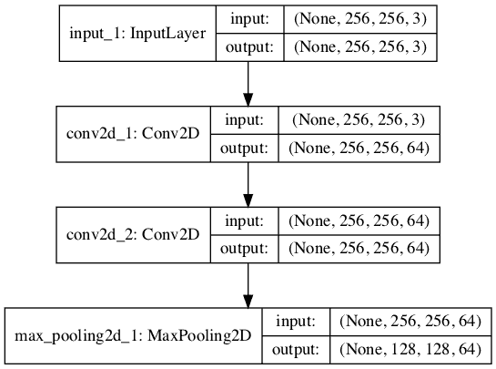
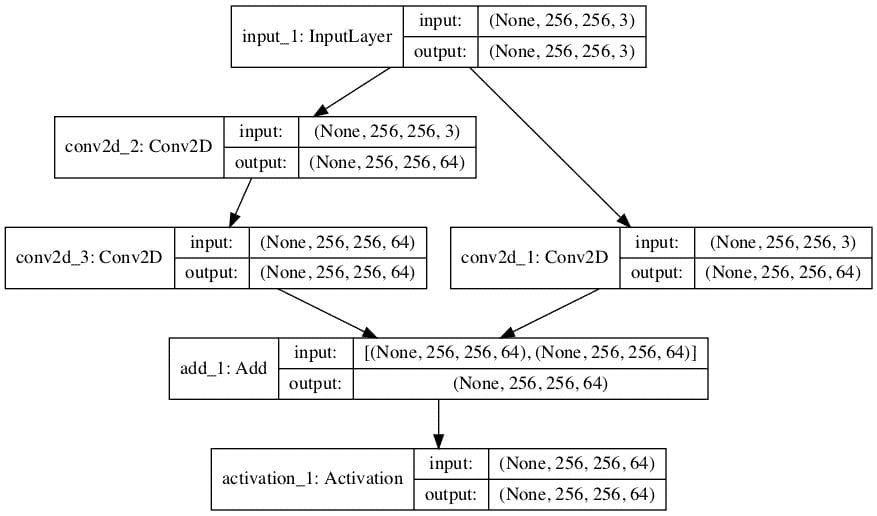

# 如何在 Keras 从头开发 VGG、Inception和 ResNet 模块

> 原文：<https://machinelearningmastery.com/how-to-implement-major-architecture-innovations-for-convolutional-neural-networks/>

最后更新于 2019 年 7 月 5 日

里程碑模型中有一些离散的架构元素，您可以在自己的卷积神经网络设计中使用。

具体来说，在图像分类等任务上取得最先进成果的模型使用重复多次的离散架构元素，例如 VGG 模型中的 VGG 区块、谷歌网络中的初始模块和 ResNet 中的剩余模块。

一旦您能够实现这些架构元素的参数化版本，您就可以在为计算机视觉和其他应用程序设计自己的模型时使用它们。

在本教程中，您将发现如何从零开始实现里程碑卷积神经网络模型的关键架构元素。

完成本教程后，您将知道:

*   如何实现 VGG-16 和 VGG-19 卷积神经网络模型中使用的 VGG 模块。
*   如何实现 GoogLeNet 模型中使用的幼稚且优化的初始模块。
*   如何实现 ResNet 模型中的身份残差模块？

**用我的新书[计算机视觉深度学习](https://machinelearningmastery.com/deep-learning-for-computer-vision/)启动你的项目**，包括*分步教程*和所有示例的 *Python 源代码*文件。

我们开始吧。


如何实现卷积神经网络的主要架构创新
图片由[达维宁](https://www.flickr.com/photos/daveynin/7206430966/)提供，保留部分权利。

## 教程概述

本教程分为三个部分；它们是:

1.  如何实施 VGG 街区
2.  如何实现初始模块
3.  如何实现剩余模块

## 如何实施 VGG 街区

以牛津视觉几何组命名的 VGG 卷积神经网络体系结构是在计算机视觉中使用深度学习方法的重要里程碑。

卡伦·西蒙扬和安德鲁·齐泽曼在 2014 年发表的题为“用于大规模图像识别的非常深卷积网络”的论文中描述了该架构，并在 LSVRC-2014 计算机视觉竞赛中取得了最高成绩。

这个建筑的关键创新是定义和重复了我们称之为 VGG 街区的东西。这些是使用小滤波器(例如 3×3 像素)的卷积层组，后面是最大池化层。

> 图像通过一堆卷积码(conv。)层，其中我们使用具有非常小的感受野的过滤器:3×3(这是捕捉左/右、上/下、中心的概念的最小尺寸)。[……]最大池化在 2×2 像素窗口上执行，步长为 2。

——[用于大规模图像识别的超深度卷积网络](https://arxiv.org/abs/1409.1556)，2014。

当从头开始开发新模型时，具有 VGG 块的卷积神经网络是一个明智的起点，因为它易于理解，易于实现，并且在从图像中提取特征方面非常有效。

我们可以将 VGG 块的规格概括为一个或多个卷积层，具有相同数量的滤波器和 3×3 的滤波器大小，1×1 的[步长](https://machinelearningmastery.com/padding-and-stride-for-convolutional-neural-networks/)，相同的填充，因此输出大小与每个滤波器的输入大小相同，并且使用整流的线性激活函数。这些层之后是最大池层，大小为 2×2，跨度相同。

我们可以使用 Keras 函数 API 定义一个函数来创建一个 VGG 块，该函数具有给定数量的卷积层和每层给定数量的滤波器。

```py
# function for creating a vgg block
def vgg_block(layer_in, n_filters, n_conv):
	# add convolutional layers
	for _ in range(n_conv):
		layer_in = Conv2D(n_filters, (3,3), padding='same', activation='relu')(layer_in)
	# add max pooling layer
	layer_in = MaxPooling2D((2,2), strides=(2,2))(layer_in)
	return layer_in
```

要使用该函数，可以在块之前传入该层，并接收可用于集成到模型中的块末端的层。

例如，第一层可能是输入层，可以作为参数传递到函数中。然后，该函数返回对块中最后一层(池层)的引用，该层可以连接到平坦层和后续密集层，以进行分类预测。

我们可以通过定义一个小模型来演示如何使用这个函数，该模型期望正方形彩色图像作为输入，并向模型中添加一个具有两个卷积层的 VGG 块，每个卷积层具有 64 个滤波器。

```py
# Example of creating a CNN model with a VGG block
from keras.models import Model
from keras.layers import Input
from keras.layers import Conv2D
from keras.layers import MaxPooling2D
from keras.utils import plot_model

# function for creating a vgg block
def vgg_block(layer_in, n_filters, n_conv):
	# add convolutional layers
	for _ in range(n_conv):
		layer_in = Conv2D(n_filters, (3,3), padding='same', activation='relu')(layer_in)
	# add max pooling layer
	layer_in = MaxPooling2D((2,2), strides=(2,2))(layer_in)
	return layer_in

# define model input
visible = Input(shape=(256, 256, 3))
# add vgg module
layer = vgg_block(visible, 64, 2)
# create model
model = Model(inputs=visible, outputs=layer)
# summarize model
model.summary()
# plot model architecture
plot_model(model, show_shapes=True, to_file='vgg_block.png')
```

运行该示例会创建模型并总结结构。

我们可以看到，正如预期的那样，该模型添加了一个带有两个卷积层的 VGG 块，每个卷积层有 64 个滤波器，然后是一个最大池层。

```py
_________________________________________________________________
Layer (type)                 Output Shape              Param #
=================================================================
input_1 (InputLayer)         (None, 256, 256, 3)       0
_________________________________________________________________
conv2d_1 (Conv2D)            (None, 256, 256, 64)      1792
_________________________________________________________________
conv2d_2 (Conv2D)            (None, 256, 256, 64)      36928
_________________________________________________________________
max_pooling2d_1 (MaxPooling2 (None, 128, 128, 64)      0
=================================================================
Total params: 38,720
Trainable params: 38,720
Non-trainable params: 0
_________________________________________________________________
```

还会创建一个模型架构图，这可能有助于使模型布局更加具体。

注意，创建绘图假设您已经安装了 [pydot 和 pygraphviz](https://machinelearningmastery.com/visualize-deep-learning-neural-network-model-keras/) 。如果不是这样，您可以注释掉导入语句，并调用示例中的 *plot_model()* 函数。



带有 VGG 块的卷积神经网络结构图

在你自己的模型中使用 VGG 积木应该很常见，因为它们非常简单有效。

我们可以扩展该示例并演示一个具有三个 VGG 块的单个模型，前两个块具有两个卷积层，分别具有 64 个和 128 个滤波器，第三个块具有四个卷积层，具有 256 个滤波器。这是 VGG 块的常见用法，其中过滤器的数量随着模型的深度而增加。

完整的代码列表如下。

```py
# Example of creating a CNN model with many VGG blocks
from keras.models import Model
from keras.layers import Input
from keras.layers import Conv2D
from keras.layers import MaxPooling2D
from keras.utils import plot_model

# function for creating a vgg block
def vgg_block(layer_in, n_filters, n_conv):
	# add convolutional layers
	for _ in range(n_conv):
		layer_in = Conv2D(n_filters, (3,3), padding='same', activation='relu')(layer_in)
	# add max pooling layer
	layer_in = MaxPooling2D((2,2), strides=(2,2))(layer_in)
	return layer_in

# define model input
visible = Input(shape=(256, 256, 3))
# add vgg module
layer = vgg_block(visible, 64, 2)
# add vgg module
layer = vgg_block(layer, 128, 2)
# add vgg module
layer = vgg_block(layer, 256, 4)
# create model
model = Model(inputs=visible, outputs=layer)
# summarize model
model.summary()
# plot model architecture
plot_model(model, show_shapes=True, to_file='multiple_vgg_blocks.png')
```

再次，运行示例总结了模型架构，我们可以清楚地看到 VGG 区块的模式。

```py
_________________________________________________________________
Layer (type)                 Output Shape              Param #
=================================================================
input_1 (InputLayer)         (None, 256, 256, 3)       0
_________________________________________________________________
conv2d_1 (Conv2D)            (None, 256, 256, 64)      1792
_________________________________________________________________
conv2d_2 (Conv2D)            (None, 256, 256, 64)      36928
_________________________________________________________________
max_pooling2d_1 (MaxPooling2 (None, 128, 128, 64)      0
_________________________________________________________________
conv2d_3 (Conv2D)            (None, 128, 128, 128)     73856
_________________________________________________________________
conv2d_4 (Conv2D)            (None, 128, 128, 128)     147584
_________________________________________________________________
max_pooling2d_2 (MaxPooling2 (None, 64, 64, 128)       0
_________________________________________________________________
conv2d_5 (Conv2D)            (None, 64, 64, 256)       295168
_________________________________________________________________
conv2d_6 (Conv2D)            (None, 64, 64, 256)       590080
_________________________________________________________________
conv2d_7 (Conv2D)            (None, 64, 64, 256)       590080
_________________________________________________________________
conv2d_8 (Conv2D)            (None, 64, 64, 256)       590080
_________________________________________________________________
max_pooling2d_3 (MaxPooling2 (None, 32, 32, 256)       0
=================================================================
Total params: 2,325,568
Trainable params: 2,325,568
Non-trainable params: 0
_________________________________________________________________
```

创建了模型架构的图，提供了对相同线性层进展的不同视角。


多 VGG 块卷积神经网络结构图

## 如何实现初始模块

克里斯蒂安·塞格迪(Christian Szegedy)等人在 2015 年的论文中描述了初始模块，并将其用于谷歌网络模型，该论文题为“用卷积更深入。”

与 VGG 模式一样，谷歌网模式在 2014 年版本的 ILSVRC 挑战赛中取得了顶级成绩。

初始模型的关键创新被称为初始模块。这是一组并行卷积层，具有不同大小的滤波器(例如 [1×1](https://machinelearningmastery.com/introduction-to-1x1-convolutions-to-reduce-the-complexity-of-convolutional-neural-networks/) 、3×3、5×5)以及一个和 3×3 最大池化层，然后将它们的结果连接起来。

> 为了避免补丁对齐问题，初始架构的当前体现被限制为滤波器大小为 1×1、3×3 和 5×5；这个决定更多的是基于方便而不是必要。[……]此外，由于池化操作对于当前卷积网络的成功至关重要，因此建议在每个这样的阶段增加一个替代的并行池化路径也应该具有额外的有益效果

——[用回旋更深入](https://www.cv-foundation.org/openaccess/content_cvpr_2015/html/Szegedy_Going_Deeper_With_2015_CVPR_paper.html)，2015。

这是一个非常简单和强大的架构单元，它不仅允许模型学习相同大小的并行过滤器，还允许学习不同大小的并行过滤器，从而允许在多个尺度上学习。

我们可以直接使用 Keras 函数式 API 实现一个初始模块。下面的函数将为每个并行卷积层创建一个带有固定数量滤波器的初始模块。从论文中描述的 GoogLeNet 架构来看，由于模型经过高度优化，似乎没有对并行卷积层使用系统的滤波器规模。因此，我们可以对模块定义进行参数化，以便指定在 1×1、3×3 和 5×5 滤波器中使用的滤波器数量。

```py
# function for creating a naive inception block
def inception_module(layer_in, f1, f2, f3):
	# 1x1 conv
	conv1 = Conv2D(f1, (1,1), padding='same', activation='relu')(layer_in)
	# 3x3 conv
	conv3 = Conv2D(f2, (3,3), padding='same', activation='relu')(layer_in)
	# 5x5 conv
	conv5 = Conv2D(f3, (5,5), padding='same', activation='relu')(layer_in)
	# 3x3 max pooling
	pool = MaxPooling2D((3,3), strides=(1,1), padding='same')(layer_in)
	# concatenate filters, assumes filters/channels last
	layer_out = concatenate([conv1, conv3, conv5, pool], axis=-1)
	return layer_out
```

要使用该函数，请提供对前一层的引用作为输入、过滤器的数量，它将返回对串联过滤器层的引用，然后您可以连接到更多初始模块或子模型来进行预测。

我们可以通过创建一个具有单个初始模块的模型来演示如何使用这个函数。在这种情况下，过滤器的数量基于论文表 1 中的“*初始(3a)* ”。

下面列出了完整的示例。

```py
# example of creating a CNN with an inception module
from keras.models import Model
from keras.layers import Input
from keras.layers import Conv2D
from keras.layers import MaxPooling2D
from keras.layers.merge import concatenate
from keras.utils import plot_model

# function for creating a naive inception block
def naive_inception_module(layer_in, f1, f2, f3):
	# 1x1 conv
	conv1 = Conv2D(f1, (1,1), padding='same', activation='relu')(layer_in)
	# 3x3 conv
	conv3 = Conv2D(f2, (3,3), padding='same', activation='relu')(layer_in)
	# 5x5 conv
	conv5 = Conv2D(f3, (5,5), padding='same', activation='relu')(layer_in)
	# 3x3 max pooling
	pool = MaxPooling2D((3,3), strides=(1,1), padding='same')(layer_in)
	# concatenate filters, assumes filters/channels last
	layer_out = concatenate([conv1, conv3, conv5, pool], axis=-1)
	return layer_out

# define model input
visible = Input(shape=(256, 256, 3))
# add inception module
layer = naive_inception_module(visible, 64, 128, 32)
# create model
model = Model(inputs=visible, outputs=layer)
# summarize model
model.summary()
# plot model architecture
plot_model(model, show_shapes=True, to_file='naive_inception_module.png')
```

运行该示例会创建模型并总结图层。

我们知道卷积层和池层是并行的，但是这个总结并不容易捕捉结构。

```py
__________________________________________________________________________________________________
Layer (type)                    Output Shape         Param #     Connected to
==================================================================================================
input_1 (InputLayer)            (None, 256, 256, 3)  0
__________________________________________________________________________________________________
conv2d_1 (Conv2D)               (None, 256, 256, 64) 256         input_1[0][0]
__________________________________________________________________________________________________
conv2d_2 (Conv2D)               (None, 256, 256, 128 3584        input_1[0][0]
__________________________________________________________________________________________________
conv2d_3 (Conv2D)               (None, 256, 256, 32) 2432        input_1[0][0]
__________________________________________________________________________________________________
max_pooling2d_1 (MaxPooling2D)  (None, 256, 256, 3)  0           input_1[0][0]
__________________________________________________________________________________________________
concatenate_1 (Concatenate)     (None, 256, 256, 227 0           conv2d_1[0][0]
                                                                 conv2d_2[0][0]
                                                                 conv2d_3[0][0]
                                                                 max_pooling2d_1[0][0]
==================================================================================================
Total params: 6,272
Trainable params: 6,272
Non-trainable params: 0
__________________________________________________________________________________________________
```

还创建了模型架构的图，这有助于清楚地看到模块的并行结构以及模块的每个元素的输出的匹配形状，这允许它们通过第三维(滤波器或通道)直接连接。


带有初始模块的卷积神经网络结构图

我们已经实现的初始模块的版本被称为初始模块。

为了减少所需的计算量，对模块进行了修改。具体来说，增加 [1×1 卷积层](https://machinelearningmastery.com/introduction-to-1x1-convolutions-to-reduce-the-complexity-of-convolutional-neural-networks/)是为了减少 3×3 和 5×5 卷积层之前的滤波器数量，增加汇聚层之后的滤波器数量。

> 这导致了初始架构的第二个想法:在计算需求增加过多的地方明智地减少维度。[……]也就是说，在昂贵的 3×3 和 5×5 卷积之前，使用 1×1 卷积来计算约简。除了用作还原剂，它们还包括整流线性激活的使用，使它们具有双重用途

——[用回旋更深入](https://www.cv-foundation.org/openaccess/content_cvpr_2015/html/Szegedy_Going_Deeper_With_2015_CVPR_paper.html)，2015。

如果您打算在模型中使用许多初始模块，您可能需要这种基于计算表现的修改。

下面的函数通过参数化实现了这种优化改进，因此您可以控制 3×3 和 5×5 卷积层之前滤波器数量的减少量，以及最大池化之后增加的滤波器数量。

```py
# function for creating a projected inception module
def inception_module(layer_in, f1, f2_in, f2_out, f3_in, f3_out, f4_out):
	# 1x1 conv
	conv1 = Conv2D(f1, (1,1), padding='same', activation='relu')(layer_in)
	# 3x3 conv
	conv3 = Conv2D(f2_in, (1,1), padding='same', activation='relu')(layer_in)
	conv3 = Conv2D(f2_out, (3,3), padding='same', activation='relu')(conv3)
	# 5x5 conv
	conv5 = Conv2D(f3_in, (1,1), padding='same', activation='relu')(layer_in)
	conv5 = Conv2D(f3_out, (5,5), padding='same', activation='relu')(conv5)
	# 3x3 max pooling
	pool = MaxPooling2D((3,3), strides=(1,1), padding='same')(layer_in)
	pool = Conv2D(f4_out, (1,1), padding='same', activation='relu')(pool)
	# concatenate filters, assumes filters/channels last
	layer_out = concatenate([conv1, conv3, conv5, pool], axis=-1)
	return layer_out
```

我们可以创建一个模型，其中包含两个优化的初始模块，以具体了解架构在实践中的样子。

在这种情况下，过滤器配置的数量基于本文表 1 中的“*初始(3a)* ”和“*初始(3b)* ”。

下面列出了完整的示例。

```py
# example of creating a CNN with an efficient inception module
from keras.models import Model
from keras.layers import Input
from keras.layers import Conv2D
from keras.layers import MaxPooling2D
from keras.layers.merge import concatenate
from keras.utils import plot_model

# function for creating a projected inception module
def inception_module(layer_in, f1, f2_in, f2_out, f3_in, f3_out, f4_out):
	# 1x1 conv
	conv1 = Conv2D(f1, (1,1), padding='same', activation='relu')(layer_in)
	# 3x3 conv
	conv3 = Conv2D(f2_in, (1,1), padding='same', activation='relu')(layer_in)
	conv3 = Conv2D(f2_out, (3,3), padding='same', activation='relu')(conv3)
	# 5x5 conv
	conv5 = Conv2D(f3_in, (1,1), padding='same', activation='relu')(layer_in)
	conv5 = Conv2D(f3_out, (5,5), padding='same', activation='relu')(conv5)
	# 3x3 max pooling
	pool = MaxPooling2D((3,3), strides=(1,1), padding='same')(layer_in)
	pool = Conv2D(f4_out, (1,1), padding='same', activation='relu')(pool)
	# concatenate filters, assumes filters/channels last
	layer_out = concatenate([conv1, conv3, conv5, pool], axis=-1)
	return layer_out

# define model input
visible = Input(shape=(256, 256, 3))
# add inception block 1
layer = inception_module(visible, 64, 96, 128, 16, 32, 32)
# add inception block 1
layer = inception_module(layer, 128, 128, 192, 32, 96, 64)
# create model
model = Model(inputs=visible, outputs=layer)
# summarize model
model.summary()
# plot model architecture
plot_model(model, show_shapes=True, to_file='inception_module.png')
```

运行该示例会创建图层的线性摘要，这对理解正在发生的事情并没有真正的帮助。

```py
__________________________________________________________________________________________________
Layer (type)                    Output Shape         Param #     Connected to
==================================================================================================
input_1 (InputLayer)            (None, 256, 256, 3)  0
__________________________________________________________________________________________________
conv2d_2 (Conv2D)               (None, 256, 256, 96) 384         input_1[0][0]
__________________________________________________________________________________________________
conv2d_4 (Conv2D)               (None, 256, 256, 16) 64          input_1[0][0]
__________________________________________________________________________________________________
max_pooling2d_1 (MaxPooling2D)  (None, 256, 256, 3)  0           input_1[0][0]
__________________________________________________________________________________________________
conv2d_1 (Conv2D)               (None, 256, 256, 64) 256         input_1[0][0]
__________________________________________________________________________________________________
conv2d_3 (Conv2D)               (None, 256, 256, 128 110720      conv2d_2[0][0]
__________________________________________________________________________________________________
conv2d_5 (Conv2D)               (None, 256, 256, 32) 12832       conv2d_4[0][0]
__________________________________________________________________________________________________
conv2d_6 (Conv2D)               (None, 256, 256, 32) 128         max_pooling2d_1[0][0]
__________________________________________________________________________________________________
concatenate_1 (Concatenate)     (None, 256, 256, 256 0           conv2d_1[0][0]
                                                                 conv2d_3[0][0]
                                                                 conv2d_5[0][0]
                                                                 conv2d_6[0][0]
__________________________________________________________________________________________________
conv2d_8 (Conv2D)               (None, 256, 256, 128 32896       concatenate_1[0][0]
__________________________________________________________________________________________________
conv2d_10 (Conv2D)              (None, 256, 256, 32) 8224        concatenate_1[0][0]
__________________________________________________________________________________________________
max_pooling2d_2 (MaxPooling2D)  (None, 256, 256, 256 0           concatenate_1[0][0]
__________________________________________________________________________________________________
conv2d_7 (Conv2D)               (None, 256, 256, 128 32896       concatenate_1[0][0]
__________________________________________________________________________________________________
conv2d_9 (Conv2D)               (None, 256, 256, 192 221376      conv2d_8[0][0]
__________________________________________________________________________________________________
conv2d_11 (Conv2D)              (None, 256, 256, 96) 76896       conv2d_10[0][0]
__________________________________________________________________________________________________
conv2d_12 (Conv2D)              (None, 256, 256, 64) 16448       max_pooling2d_2[0][0]
__________________________________________________________________________________________________
concatenate_2 (Concatenate)     (None, 256, 256, 480 0           conv2d_7[0][0]
                                                                 conv2d_9[0][0]
                                                                 conv2d_11[0][0]
                                                                 conv2d_12[0][0]
==================================================================================================
Total params: 513,120
Trainable params: 513,120
Non-trainable params: 0
__________________________________________________________________________________________________
```

创建了模型架构的图，该图明确了每个模块的布局以及第一个模型如何为第二个模块提供信息。

请注意，由于空间原因，每个初始模块中的第一个 1×1 卷积位于最右侧，但除此之外，其他层在每个模块中从左到右组织。


具有有效初始模块的卷积神经网络结构图

## 如何实现剩余模块

何等人在 2016 年的论文《图像识别的深度残差学习》中提出了卷积神经网络的残差网络(ResNet)架构，该架构在 2015 年版本的 ILSVRC 挑战中取得了成功。

ResNet 的一个关键创新是剩余模块。残差模块，特别是单位残差模型，是具有相同数量的滤波器和小滤波器大小的两个卷积层的块，其中第二层的输出与第一卷积层的输入相加。绘制成图形后，模块的输入被添加到模块的输出中，称为快捷连接。

我们可以在 Keras 中使用函数式 API 和 *add()* 合并函数直接实现这一点。

```py
# function for creating an identity residual module
def residual_module(layer_in, n_filters):
	# conv1
	conv1 = Conv2D(n_filters, (3,3), padding='same', activation='relu', kernel_initializer='he_normal')(layer_in)
	# conv2
	conv2 = Conv2D(n_filters, (3,3), padding='same', activation='linear', kernel_initializer='he_normal')(conv1)
	# add filters, assumes filters/channels last
	layer_out = add([conv2, layer_in])
	# activation function
	layer_out = Activation('relu')(layer_out)
	return layer_out
```

这种直接实现的一个限制是，如果输入层的滤波器数量与模块最后一个卷积层的滤波器数量不匹配(由 *n_filters* 定义)，那么我们将得到一个错误。

一种解决方案是[使用 1×1 卷积层](https://machinelearningmastery.com/introduction-to-1x1-convolutions-to-reduce-the-complexity-of-convolutional-neural-networks/)，通常称为投影层，以增加输入层的滤波器数量或减少模块中最后一个卷积层的滤波器数量。前一种解决方案更有意义，是论文中提出的方法，称为投影捷径。

> 当维度增加[…]时，我们考虑两个选项:(A)快捷方式仍然执行身份映射，为增加维度填充额外的零条目。该选项不引入额外参数；(B)投影快捷方式[…]用于匹配尺寸(由 1×1 卷积完成)。

——[图像识别的深度残差学习](https://www.cv-foundation.org/openaccess/content_cvpr_2016/html/He_Deep_Residual_Learning_CVPR_2016_paper.html)，2015。

下面是函数的更新版本，如果可能的话，将使用标识，否则输入中过滤器数量的投影与 *n_filters* 参数不匹配。

```py
# function for creating an identity or projection residual module
def residual_module(layer_in, n_filters):
	merge_input = layer_in
	# check if the number of filters needs to be increase, assumes channels last format
	if layer_in.shape[-1] != n_filters:
		merge_input = Conv2D(n_filters, (1,1), padding='same', activation='relu', kernel_initializer='he_normal')(layer_in)
	# conv1
	conv1 = Conv2D(n_filters, (3,3), padding='same', activation='relu', kernel_initializer='he_normal')(layer_in)
	# conv2
	conv2 = Conv2D(n_filters, (3,3), padding='same', activation='linear', kernel_initializer='he_normal')(conv1)
	# add filters, assumes filters/channels last
	layer_out = add([conv2, merge_input])
	# activation function
	layer_out = Activation('relu')(layer_out)
	return layer_out
```

我们可以用一个简单的模型演示这个模块的用法。

下面列出了完整的示例。

```py
# example of a CNN model with an identity or projection residual module
from keras.models import Model
from keras.layers import Input
from keras.layers import Activation
from keras.layers import Conv2D
from keras.layers import MaxPooling2D
from keras.layers import add
from keras.utils import plot_model

# function for creating an identity or projection residual module
def residual_module(layer_in, n_filters):
	merge_input = layer_in
	# check if the number of filters needs to be increase, assumes channels last format
	if layer_in.shape[-1] != n_filters:
		merge_input = Conv2D(n_filters, (1,1), padding='same', activation='relu', kernel_initializer='he_normal')(layer_in)
	# conv1
	conv1 = Conv2D(n_filters, (3,3), padding='same', activation='relu', kernel_initializer='he_normal')(layer_in)
	# conv2
	conv2 = Conv2D(n_filters, (3,3), padding='same', activation='linear', kernel_initializer='he_normal')(conv1)
	# add filters, assumes filters/channels last
	layer_out = add([conv2, merge_input])
	# activation function
	layer_out = Activation('relu')(layer_out)
	return layer_out

# define model input
visible = Input(shape=(256, 256, 3))
# add vgg module
layer = residual_module(visible, 64)
# create model
model = Model(inputs=visible, outputs=layer)
# summarize model
model.summary()
# plot model architecture
plot_model(model, show_shapes=True, to_file='residual_module.png')
```

运行该示例首先创建模型，然后打印图层摘要。

因为模块是线性的，所以这个总结有助于了解发生了什么。

```py
__________________________________________________________________________________________________
Layer (type)                    Output Shape         Param #     Connected to
==================================================================================================
input_1 (InputLayer)            (None, 256, 256, 3)  0
__________________________________________________________________________________________________
conv2d_2 (Conv2D)               (None, 256, 256, 64) 1792        input_1[0][0]
__________________________________________________________________________________________________
conv2d_3 (Conv2D)               (None, 256, 256, 64) 36928       conv2d_2[0][0]
__________________________________________________________________________________________________
conv2d_1 (Conv2D)               (None, 256, 256, 64) 256         input_1[0][0]
__________________________________________________________________________________________________
add_1 (Add)                     (None, 256, 256, 64) 0           conv2d_3[0][0]
                                                                 conv2d_1[0][0]
__________________________________________________________________________________________________
activation_1 (Activation)       (None, 256, 256, 64) 0           add_1[0][0]
==================================================================================================
Total params: 38,976
Trainable params: 38,976
Non-trainable params: 0
__________________________________________________________________________________________________
```

还创建了模型架构的图。

我们可以看到输入中过滤器数量膨胀的模块，以及模块末尾两个元素的添加。



带有残差模块的卷积神经网络结构图

本文描述了其他类型的剩余连接，如瓶颈。这些都是留给读者的练习，可以通过更新 *residual_module()* 函数轻松实现。

## 进一步阅读

如果您想更深入地了解这个主题，本节将提供更多资源。

### 邮件

*   [如何使用 Keras 函数 API 进行深度学习](https://machinelearningmastery.com/keras-functional-api-deep-learning/)

### 报纸

*   [基于梯度的学习应用于文档识别](https://ieeexplore.ieee.org/abstract/document/726791)，( [PDF](http://yann.lecun.com/exdb/publis/pdf/lecun-01a.pdf) ) 1998。
*   [深度卷积神经网络的 ImageNet 分类](http://papers.nips.cc/paper/4824-imagenet-classification-with-deep-convolutional-neural-networks)，2012。
*   [用于大规模图像识别的超深度卷积网络](https://arxiv.org/abs/1409.1556)，2014。
*   [用回旋更深入](https://www.cv-foundation.org/openaccess/content_cvpr_2015/html/Szegedy_Going_Deeper_With_2015_CVPR_paper.html)，2015。
*   [图像识别的深度残差学习](https://www.cv-foundation.org/openaccess/content_cvpr_2016/html/He_Deep_Residual_Learning_CVPR_2016_paper.html)，2016

### 应用程序接口

*   [凯拉斯功能性原料药](https://keras.io/models/model/)
*   [Keras 应用程序接口](https://keras.io/applications/)
*   [Keras 应用源代码](https://github.com/keras-team/keras-applications)

## 摘要

在本教程中，您发现了如何从零开始实现里程碑卷积神经网络模型中的关键架构元素。

具体来说，您了解到:

*   如何实现 VGG-16 和 VGG-19 卷积神经网络模型中使用的 VGG 模块。
*   如何实现 GoogLeNet 模型中使用的幼稚且优化的初始模块。
*   如何实现 ResNet 模型中的身份残差模块？

你有什么问题吗？
在下面的评论中提问，我会尽力回答。