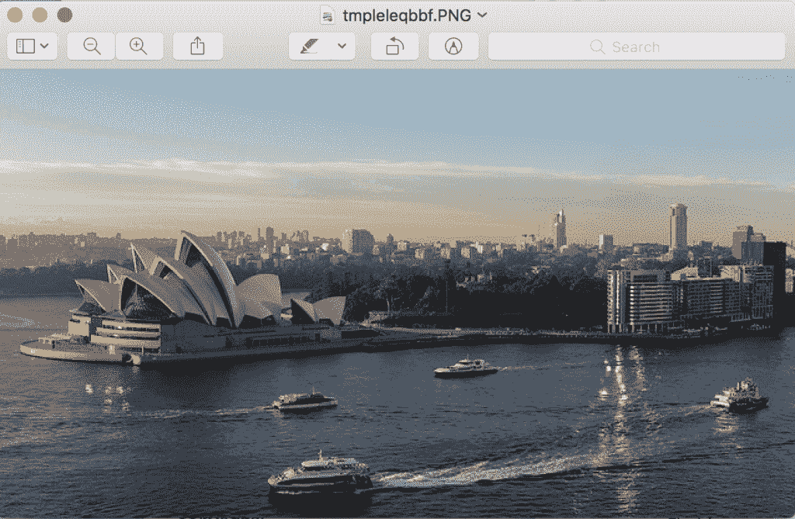
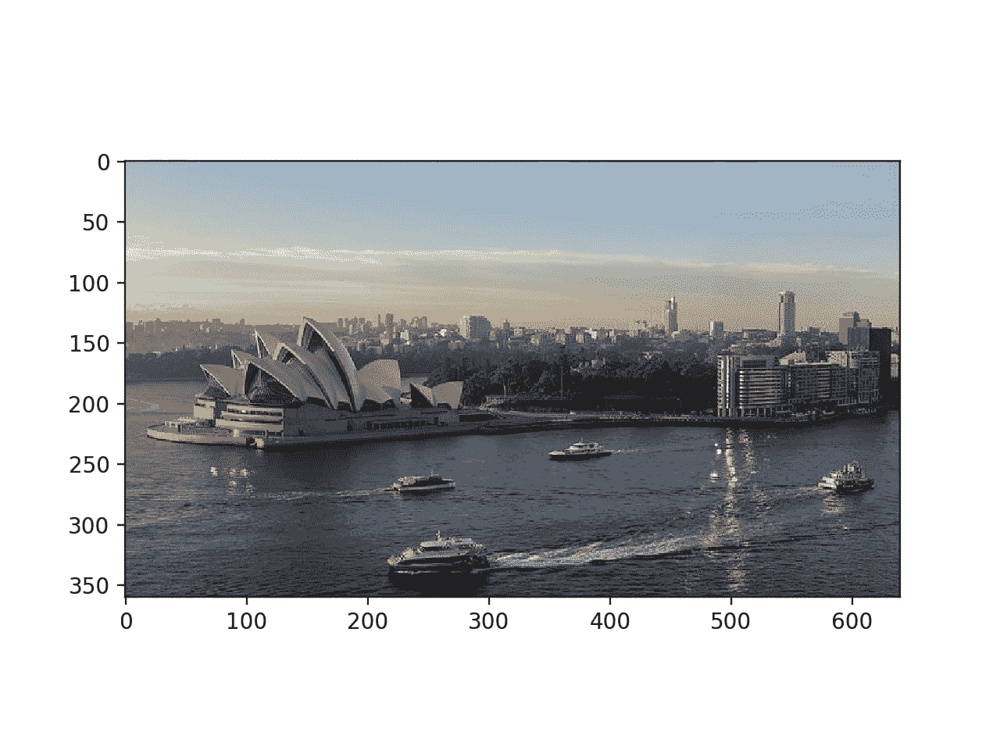
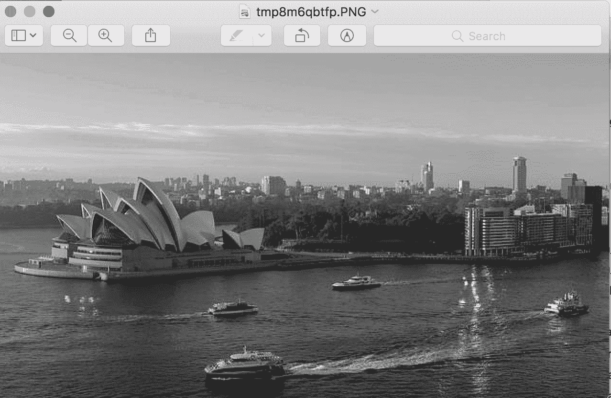
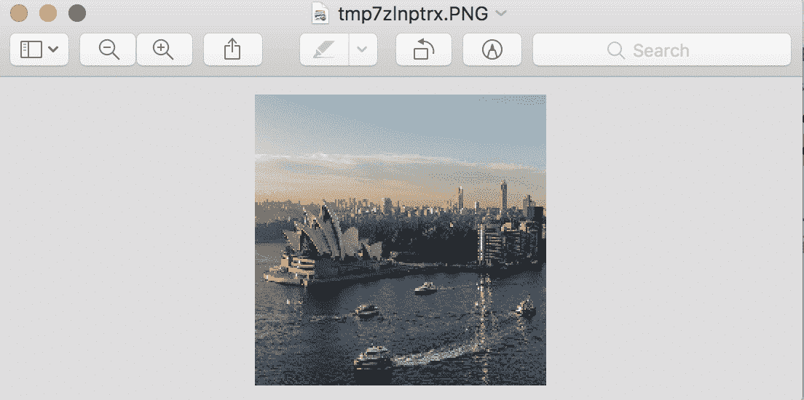
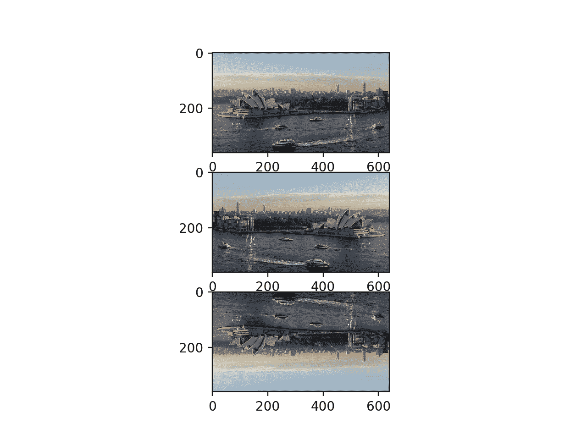
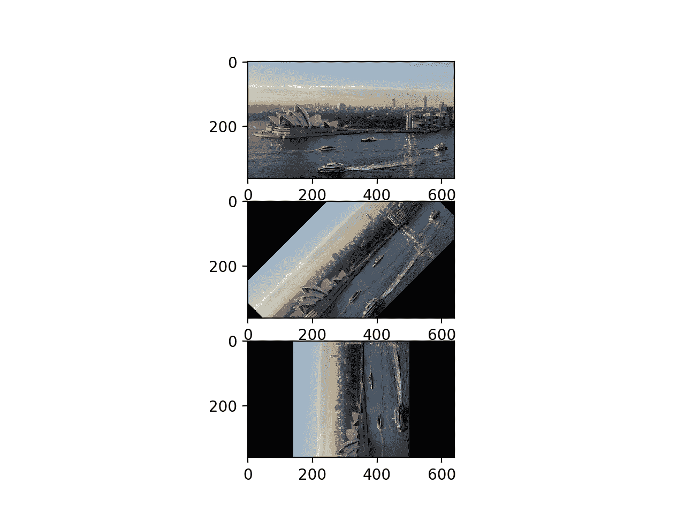
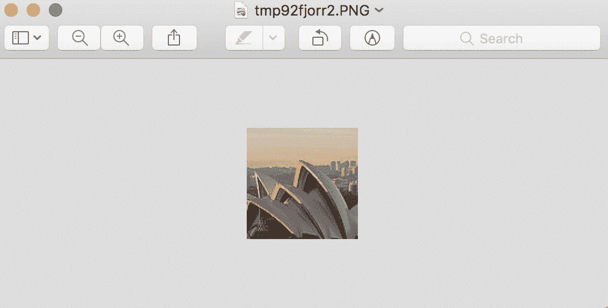

# 如何使用 PIL/枕头

加载和操作 Python 深度学习的图像

> 原文：<https://machinelearningmastery.com/how-to-load-and-manipulate-images-for-deep-learning-in-python-with-pil-pillow/>

最后更新于 2019 年 9 月 12 日

在开发图像数据的预测模型之前，您必须学习如何加载和操作图像和照片。

Python 中用于加载和处理图像数据的最流行和事实上的标准库是枕头。枕头是 Python 图像库或 PIL 的更新版本，支持一系列简单而复杂的图像处理功能。它也是其他 Python 库(如 SciPy 和 Matplotlib)中简单图像支持的基础。

在本教程中，您将了解如何使用枕头 Python 库加载和操作图像数据。

完成本教程后，您将知道:

*   如何安装枕头库并确认其工作正常。
*   如何从文件中加载图像，将加载的图像转换为 NumPy 数组，以及以新格式保存图像。
*   如何对图像数据执行基本转换，如调整大小、翻转、旋转和裁剪。

**用我的新书[计算机视觉深度学习](https://machinelearningmastery.com/deep-learning-for-computer-vision/)启动你的项目**，包括*分步教程*和所有示例的 *Python 源代码*文件。

我们开始吧。

*   **2019 年 9 月更新**:更新以反映枕头 API 的微小变化。

## 教程概述

本教程分为六个部分；它们是:

1.  如何安装枕头
2.  如何加载和显示图像
3.  如何将图像转换为数字阵列并返回
4.  如何将图像保存到文件
5.  如何调整图像大小
6.  如何翻转、旋转和裁剪图像

## 如何安装枕头

[Python 图像库](http://www.pythonware.com/products/pil/)，简称 PIL，是一个用于加载和操作图像的开源库。

它是在 25 年前开发并提供的，已经成为使用 Python 处理图像的事实上的标准应用编程接口。该库现已失效，不再更新，不支持 Python 3。

[枕头](https://python-pillow.org/)是一个支持 Python 3 的 PIL 库，是 Python 中图像操作的首选现代库。它甚至是其他 Python 科学库(如 SciPy 和 Matplotlib)中简单的图像加载和保存所必需的。

枕头库是作为大多数 SciPy 安装的一部分安装的；例如，如果您正在使用 Anaconda。

有关设置 SciPy 环境的帮助，请参见分步教程:

*   [如何用 Anaconda](https://machinelearningmastery.com/setup-python-environment-machine-learning-deep-learning-anaconda/) 建立机器学习和深度学习的 Python 环境

如果自己为工作站管理 Python 软件包的安装，可以使用 pip 轻松安装 pipe；例如:

```py
sudo pip install Pillow
```

有关手动安装枕头的更多帮助，请参见:

*   [枕头安装说明](https://pillow.readthedocs.io/en/stable/installation.html)

枕头是建立在旧的 PIL 之上的，你可以通过打印版本号来确认图书馆安装正确；例如:

```py
# check Pillow version number
import PIL
print('Pillow Version:', PIL.__version__)
```

运行该示例将打印枕头的版本号；您的版本号应该相同或更高。

```py
Pillow Version: 6.1.0
```

现在您的环境已经设置好了，让我们看看如何加载图像。

## 如何加载和显示图像

我们需要一个测试图像来演示使用枕头库的一些重要功能。

在本教程中，我们将使用一张悉尼歌剧院的照片，该照片由埃德·邓恩斯拍摄，并根据知识共享许可在 Flickr 上提供，保留部分权利。


悉尼歌剧院

*   [下载照片(opera_house.jpg)](https://machinelearningmastery.com/wp-content/uploads/2019/01/Sydney-Opera-House.jpg)

下载照片，保存在当前工作目录下，文件名为“ *opera_house.jpg* ”。

图像通常为 PNG 或 JPEG 格式，可以使用 Image 类上的 [open()函数](https://pillow.readthedocs.io/en/stable/reference/Image.html#PIL.Image.Image)直接加载。这将返回一个 Image 对象，该对象包含图像的像素数据以及图像的详细信息。图像类是枕头库的主要工具，它提供了大量关于图像的属性以及允许您操作图像的像素和格式的函数。

图像上的“*格式*”属性将报告图像格式(例如 JPEG)，“*模式*将报告像素通道格式(例如 RGB 或 CMYK)，“*尺寸*将以像素为单位报告图像尺寸(例如 640×480)。

*show()* 功能将使用您的操作系统默认应用程序显示图像。

下面的示例演示了如何使用枕头库中的 image 类加载和显示图像。

```py
# load and show an image with Pillow
from PIL import Image
# load the image
image = Image.open('opera_house.jpg')
# summarize some details about the image
print(image.format)
print(image.mode)
print(image.size)
# show the image
image.show()
```

运行该示例将首先加载图像，报告格式、模式和大小，然后在桌面上显示图像。

```py
JPEG
RGB
(640, 360)
```

该图像是使用操作系统的默认图像预览应用程序显示的，例如 MacOS 上的预览。



使用默认图像预览应用程序显示悉尼歌剧院

现在您已经知道如何加载图像，让我们看看如何访问图像的像素数据。

## 如何将图像转换为数字阵列并返回

通常在机器学习中，我们希望将图像作为像素数据的 [NumPy 数组](https://machinelearningmastery.com/index-slice-reshape-numpy-arrays-machine-learning-python/)来处理。

安装枕头后，您还可以使用 Matplotlib 库加载图像，并在 Matplotlib 框架内显示它。

这可以通过使用 [imread()函数](https://matplotlib.org/api/_as_gen/matplotlib.pyplot.imread.html)和 [imshow()函数](https://matplotlib.org/api/_as_gen/matplotlib.pyplot.imshow.html)来实现，前者直接将图像加载为像素阵列，后者将像素阵列显示为图像。

下面的示例使用 Matplotlib 加载和显示相同的图像，而 Matplotlib 又会在封面下使用枕头。

```py
# load and display an image with Matplotlib
from matplotlib import image
from matplotlib import pyplot
# load image as pixel array
data = image.imread('opera_house.jpg')
# summarize shape of the pixel array
print(data.dtype)
print(data.shape)
# display the array of pixels as an image
pyplot.imshow(data)
pyplot.show()
```

运行该示例首先加载图像，然后报告数组的数据类型，在本例中为 8 位无符号整数，然后报告数组的形状，在本例中为 360 像素宽乘 640 像素高，红色、绿色和蓝色有三个通道。

```py
uint8
(360, 640, 3)
```

最后，使用 Matplotlib 显示图像。



用 Matplotlib 展示悉尼歌剧院

Matplotlib 包装函数可以比直接使用枕头更有效。

不过，您可以从枕头图像中访问像素数据。也许最简单的方法是构造一个 NumPy 数组并传入 Image 对象。使用 *Image.fromarray()* 函数将给定的像素数据数组转换为枕形图像对象的过程可以颠倒过来。如果将图像数据作为 NumPy 数组进行处理，然后希望以后将其保存为 PNG 或 JPEG 文件，这将非常有用。

下面的示例将照片加载为枕形图像对象，并将其转换为 NumPy 数组，然后再次将其转换回图像对象。

```py
# load image and convert to and from NumPy array
from PIL import Image
from numpy import asarray
# load the image
image = Image.open('opera_house.jpg')
# convert image to numpy array
data = asarray(image)
# summarize shape
print(data.shape)
# create Pillow image
image2 = Image.fromarray(data)
# summarize image details
print(image2.format)
print(image2.mode)
print(image2.size)
```

运行该示例首先将照片加载为枕头图像，然后将其转换为 NumPy 数组并报告数组的形状。最后，阵列被转换回枕头图像，并报告细节。

```py
(360, 640, 3)
JPEG
RGB
(640, 360)
```

这两种方法对于将图像数据加载到 NumPy 数组中都是有效的，尽管 Matplotlib *imread()* 函数使用的代码行比加载和转换枕头图像对象少，并且可能是首选的。

例如，您可以轻松地将目录中的所有图像加载为列表，如下所示:

```py
# load all images in a directory
from os import listdir
from matplotlib import image
# load all images in a directory
loaded_images = list()
for filename in listdir('images'):
	# load image
	img_data = image.imread('images/' + filename)
	# store loaded image
	loaded_images.append(img_data)
	print('> loaded %s %s' % (filename, img_data.shape))
```

现在我们知道了如何将图像加载为 NumPy 数组，让我们看看如何将图像保存到文件中。

## 如何将图像保存到文件

调用 *save()* 函数可以保存图像对象。

如果您想要以不同的格式保存图像，这将非常有用，在这种情况下，可以指定“*格式*参数，例如 PNG、GIF 或 PEG。

例如，下面列出的代码以 JPEG 格式加载照片，并以 PNG 格式保存。

```py
# example of saving an image in another format
from PIL import Image
# load the image
image = Image.open('opera_house.jpg')
# save as PNG format
image.save('opera_house.png', format='PNG')
# load the image again and inspect the format
image2 = Image.open('opera_house.png')
print(image2.format)
```

运行示例加载 JPEG 图像，将其保存为 PNG 格式，然后再次加载新保存的图像，并确认该格式确实是 PNG。

```py
PNG
```

如果在建模之前对图像进行一些数据准备，保存图像会很有用。一个例子是将彩色图像(RGB 通道)转换为灰度(1 通道)。

将图像转换为灰度有多种方法，但 Pillow 提供了 *convert()* 功能，模式“ *L* 将图像转换为灰度。

```py
# example of saving a grayscale version of a loaded image
from PIL import Image
# load the image
image = Image.open('opera_house.jpg')
# convert the image to grayscale
gs_image = image.convert(mode='L')
# save in jpeg format
gs_image.save('opera_house_grayscale.jpg')
# load the image again and show it
image2 = Image.open('opera_house_grayscale.jpg')
# show the image
image2.show()
```

运行该示例加载照片，将其转换为灰度，将图像保存在新文件中，然后再次加载并显示照片，以确认照片现在是灰度而不是颜色。



照片的灰度版本示例

## 如何调整图像大小

能够在建模之前调整图像大小非常重要。

有时希望缩略图所有图像具有相同的宽度或高度。这可以通过枕头使用*缩略图()*功能来实现。该函数采用一个具有宽度和高度的元组，并且将调整图像的大小，以使图像的宽度和高度等于或小于指定的形状。

例如，我们正在处理的测试照片的宽度和高度为(640，360)。我们可以将它的大小调整为(100，100)，在这种情况下，最大的尺寸，在这种情况下，宽度，将减少到 100，高度将被缩放，以保持图像的纵横比。

下面的示例将加载照片，并创建一个宽度和高度为 100 像素的较小缩略图。

```py
# create a thumbnail of an image
from PIL import Image
# load the image
image = Image.open('opera_house.jpg')
# report the size of the image
print(image.size)
# create a thumbnail and preserve aspect ratio
image.thumbnail((100,100))
# report the size of the thumbnail
print(image.size)
```

运行该示例首先加载照片并报告宽度和高度。然后调整图像的大小，在这种情况下，宽度减少到 100 像素，高度减少到 56 像素，保持原始图像的纵横比。

```py
(640, 360)
(100, 56)
```

我们可能不想保留纵横比，相反，我们可能想强制像素成为新的形状。

这可以使用 *resize()* 功能来实现，该功能允许您以像素为单位指定宽度和高度，并且图像将被缩小或拉伸以适应新的形状。

下面的示例演示了如何调整新图像的大小并忽略原始纵横比。

```py
# resize image and force a new shape
from PIL import Image
# load the image
image = Image.open('opera_house.jpg')
# report the size of the image
print(image.size)
# resize image and ignore original aspect ratio
img_resized = image.resize((200,200))
# report the size of the thumbnail
print(img_resized.size)
```

运行该示例加载图像，报告图像的形状，然后调整其大小，使其具有 200 像素的宽度和高度。

```py
(640, 360)
(200, 200)
```

显示了图像的大小，我们可以看到宽照片已经被压缩成一个正方形，尽管所有的特征仍然非常明显。

标准重采样算法用于在调整大小时发明或移除像素，您可以指定一种技术，尽管默认是适合大多数一般应用的双三次重采样算法。



不保持原始纵横比的调整大小照片

## 如何翻转、旋转和裁剪图像

简单的图像操作可用于创建新版本的图像，进而在建模时提供更丰富的训练数据集。

通常，这被称为[数据扩充](https://machinelearningmastery.com/how-to-configure-image-data-augmentation-when-training-deep-learning-neural-networks/)，并且可能涉及创建原始图像的翻转、旋转、裁剪或其他修改版本，希望算法将学会从图像数据中提取相同的特征，而不管它们可能出现在哪里。

您可能想要实现自己的数据扩充方案，在这种情况下，您需要知道如何执行图像数据的基本操作。

### 翻转图像

可以通过调用 *flip()* 函数并传入一种方法来翻转图像，如水平翻转的 *FLIP_LEFT_RIGHT* 或垂直翻转的 *FLIP_TOP_BOTTOM* 。其他翻转也是可用的

下面的示例创建了图像的水平和垂直翻转版本。

```py
# create flipped versions of an image
from PIL import Image
from matplotlib import pyplot
# load image
image = Image.open('opera_house.jpg')
# horizontal flip
hoz_flip = image.transpose(Image.FLIP_LEFT_RIGHT)
# vertical flip
ver_flip = image.transpose(Image.FLIP_TOP_BOTTOM)
# plot all three images using matplotlib
pyplot.subplot(311)
pyplot.imshow(image)
pyplot.subplot(312)
pyplot.imshow(hoz_flip)
pyplot.subplot(313)
pyplot.imshow(ver_flip)
pyplot.show()
```

运行该示例加载照片并创建照片的水平和垂直翻转版本，然后使用 Matplotlib 将所有三个版本绘制为子情节。

您会注意到 *imshow()* 函数可以直接绘制图像对象，而不必将其转换为 NumPy 数组。



照片的原始、水平和垂直翻转版本图

### 旋转图像

可以使用*旋转()*功能旋转图像，并输入旋转的角度。

该功能提供了额外的控制，例如是否扩展图像的尺寸以适合旋转的像素值(默认为裁剪成相同的大小)、图像旋转的中心位置(默认为中心)以及图像外部像素的填充颜色(默认为黑色)。

下面的示例创建了图像的几个旋转版本。

```py
# create rotated versions of an image
from PIL import Image
from matplotlib import pyplot
# load image
image = Image.open('opera_house.jpg')
# plot original image
pyplot.subplot(311)
pyplot.imshow(image)
# rotate 45 degrees
pyplot.subplot(312)
pyplot.imshow(image.rotate(45))
# rotate 90 degrees
pyplot.subplot(313)
pyplot.imshow(image.rotate(90))
pyplot.show()
```

运行该示例绘制原始照片，然后照片的一个版本旋转 45 度，另一个版本旋转 90 度。

您可以看到，在这两次旋转中，像素都被裁剪为图像的原始尺寸，空像素被填充为黑色。



照片的原始和旋转版本图

### 裁剪图像

可以裁剪图像:也就是说，可以使用*裁剪()*功能裁剪出一块来创建新图像。

裁剪函数接受一个元组参数，该参数定义了要从图像中裁剪出的框的两个 x/y 坐标。例如，如果图像是 2，000 乘 2，000 像素，我们可以通过定义一个具有(950，950，1050，1050)的左上角和右下角的元组，在图像中间裁剪出一个 100 乘 100 的框。

下面的示例演示了如何从加载的图像创建一个新的裁剪图像。

```py
# example of cropping an image
from PIL import Image
# load image
image = Image.open('opera_house.jpg')
# create a cropped image
cropped = image.crop((100, 100, 200, 200))
# show cropped image
cropped.show()
```

运行该示例会创建一个从 100，100 开始，向左下方延伸到 200，200 的 100 像素的方形裁剪图像。然后显示裁剪后的正方形。



照片的裁剪版本示例

## 扩展ˌ扩张

本节列出了一些您可能希望探索的扩展教程的想法。

*   **自己的影像**。尝试枕头功能，用自己的图像数据读取和处理图像。
*   **更多变换**。查看枕头应用编程接口文档，并尝试其他图像处理功能。
*   **图像预处理**。编写一个函数来创建图像的增强版本，以便与深度学习神经网络一起使用。

如果你探索这些扩展，我很想知道。

## 进一步阅读

如果您想更深入地了解这个主题，本节将提供更多资源。

*   [枕头主页](https://python-pillow.org/)
*   [枕头安装说明](https://pillow.readthedocs.io/en/stable/installation.html)
*   [枕头(PIL 叉)原料药文件](https://pillow.readthedocs.io/en/stable/)
*   [枕头手册教程](https://pillow.readthedocs.io/en/stable/handbook/tutorial.html)
*   [枕头 GitHub 项目](https://github.com/python-pillow/Pillow)
*   [Python 影像库(PIL)主页](http://www.pythonware.com/products/pil/)
*   [Python 影像库，维基百科。](https://en.wikipedia.org/wiki/Python_Imaging_Library)
*   [Matplotlib:影像教学](https://matplotlib.org/users/image_tutorial.html)

## 摘要

在本教程中，您发现了如何使用枕头 Python 库加载和操作图像数据。

具体来说，您了解到:

*   如何安装枕头库并确认其工作正常。
*   如何从文件中加载图像，将加载的图像转换为 NumPy 数组，以及以新格式保存图像。
*   如何对图像数据执行基本转换，如调整大小、翻转、旋转和裁剪。

你有什么问题吗？
在下面的评论中提问，我会尽力回答。