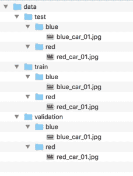

# 如何从目录加载大数据集用于 Keras 的深度学习

> 原文:[https://machinelearning master . com/如何从目录中加载大数据集以便通过 keras 进行深度学习/](https://machinelearningmastery.com/how-to-load-large-datasets-from-directories-for-deep-learning-with-keras/)

最后更新于 2019 年 7 月 5 日

在磁盘上存储和构造图像数据集有一些约定，以便在训练和评估深度学习模型时快速有效地加载。

一旦结构化，您就可以使用像 Keras 深度学习库中的 *ImageDataGenerator* 类这样的工具来自动加载您的训练、测试和验证数据集。此外，生成器将逐步加载数据集中的图像，允许您处理包含数千或数百万个可能不适合系统内存的图像的小型和超大型数据集。

在本教程中，您将发现如何构建图像数据集，以及如何在拟合和评估深度学习模型时逐步加载它。

完成本教程后，您将知道:

*   如何将训练、测试和验证图像数据集组织成一致的目录结构。
*   如何使用 *ImageDataGenerator* 类逐步加载给定数据集的图像。
*   如何使用准备好的数据生成器，通过深度学习模型进行训练、评估和预测。

**用我的新书[计算机视觉深度学习](https://machinelearningmastery.com/deep-learning-for-computer-vision/)启动你的项目**，包括*分步教程*和所有示例的 *Python 源代码*文件。

我们开始吧。

## 教程概述

本教程分为三个部分；它们是:

1.  数据集目录结构
2.  示例数据集结构
3.  如何逐步加载图像

## 数据集目录结构

有一种标准的方法来布局您的图像数据进行建模。

收集完图像后，必须首先按数据集(如训练、测试和验证)对它们进行排序，其次按它们的类别进行排序。

例如，想象一个图像分类问题，其中我们希望根据汽车的颜色对汽车照片进行分类，例如红色汽车、蓝色汽车等。

首先，我们有一个*数据/* 目录，我们将存储所有的图像数据。

接下来，我们将有一个用于训练数据集的*数据/训练/* 目录和一个用于保持测试数据集的*数据/测试/* 。在训练期间，我们可能还会有一个用于验证数据集的*数据/验证/* 。

到目前为止，我们已经:

```py
data/
data/train/
data/test/
data/validation/
```

在每个数据集目录下，我们将有子目录，每个类别一个子目录，实际的图像文件将放在那里。

例如，如果我们有一个用于将汽车照片分类为红色汽车或蓝色汽车的二进制分类任务，我们将有两个类别，'*红色*'和'*蓝色*'，因此每个数据集目录下有两个类别目录。

例如:

```py
data/
data/train/
data/train/red/
data/train/blue/
data/test/
data/test/red/
data/test/blue/
data/validation/
data/validation/red/
data/validation/blue/
```

红色汽车的图像将被放在适当的类别目录中。

例如:

```py
data/train/red/car01.jpg
data/train/red/car02.jpg
data/train/red/car03.jpg
...
data/train/blue/car01.jpg
data/train/blue/car02.jpg
data/train/blue/car03.jpg
...
```

请记住，我们不会将相同的文件放在*红色/* 和*蓝色/* 目录下；取而代之的是红色汽车和蓝色汽车的不同照片。

还记得我们在*列车*、*测试*和*验证*数据集上需要不同的照片。

用于实际图像的文件名通常并不重要，因为我们将用给定的文件扩展名加载所有图像。

如果您能够一致地重命名文件，一个好的命名约定是使用一些名称后跟一个零填充的数字，例如*image0001.jpg*如果您有一个类的数千个图像。

## 示例数据集结构

我们可以用一个例子来具体说明图像数据集的结构。

假设我们正在对汽车照片进行分类，正如我们在上一节中讨论的那样。具体来说，红色汽车和蓝色汽车的二元分类问题。

我们必须创建上一节中概述的目录结构，特别是:

```py
data/
data/train/
data/train/red/
data/train/blue/
data/test/
data/test/red/
data/test/blue/
data/validation/
data/validation/red/
data/validation/blue/
```

让我们实际创建这些目录。

我们也可以把一些照片放在目录里。

您可以使用[创作共用图像搜索](https://search.creativecommons.org/)来查找一些许可的图像，您可以下载并用于本例。

我将使用两个图像:

*   [红色汽车，作者丹尼斯·贾维斯](https://www.flickr.com/photos/archer10/7296236992/)。
*   [蓝色汽车，由比尔·史密斯](https://www.flickr.com/photos/byzantiumbooks/25158850275/)。


丹尼斯·贾维斯的《红色汽车》


蓝色汽车，比尔·史密斯出品

将照片下载到当前工作目录，将红色车照片保存为“ *red_car_01.jpg* ”，蓝色车照片保存为“ *blue_car_01.jpg* ”。

我们必须为每个训练、测试和验证数据集准备不同的照片。

为了保持本教程的重点，我们将在三个数据集的每一个中重用相同的图像文件，但假设它们是不同的照片。

将“ *red_car_01.jpg* ”文件的副本放置在*数据/列车/红色/* 、*数据/测试/红色/* 和*数据/验证/红色/* 目录中。

现在在*数据/火车/蓝色/* 、*数据/测试/蓝色/* 和*数据/验证/蓝色/* 目录中放置“ *blue_car_01.jpg* 文件的副本。

我们现在有了一个非常基本的数据集布局，如下所示(来自*树*命令的输出):

```py
data
├── test
│   ├── blue
│   │   └── blue_car_01.jpg
│   └── red
│       └── red_car_01.jpg
├── train
│   ├── blue
│   │   └── blue_car_01.jpg
│   └── red
│       └── red_car_01.jpg
└── validation
    ├── blue
    │   └── blue_car_01.jpg
    └── red
        └── red_car_01.jpg
```

下面是目录结构的截图，取自 macOS 上的 Finder 窗口。



图像数据集目录和文件结构截图

现在我们有了一个基本的目录结构，让我们练习从文件中加载图像数据用于建模。

## 如何逐步加载图像

可以编写代码来手动加载图像数据，并返回准备建模的数据。

这将包括遍历数据集的目录结构，加载图像数据，并返回输入(像素数组)和输出(类整数)。

谢天谢地，我们不需要写这段代码。相反，我们可以使用 Keras 提供的 [ImageDataGenerator 类](https://keras.io/preprocessing/image/)。

使用此类加载数据的主要好处是，可以批量加载单个数据集的图像，这意味着它既可以用于加载小型数据集，也可以用于加载包含数千或数百万个图像的超大型图像数据集。

在训练和评估深度学习模型时，它不会将所有图像加载到内存中，而是将刚好足够的图像加载到内存中，用于当前以及可能的下几个小批量。我称之为渐进加载，因为数据集是从文件中渐进加载的，只检索足够的数据来满足即时需求。

使用 *ImageDataGenerator* 类的另外两个好处是，它还可以自动缩放图像的像素值，并且可以自动生成图像的增强版本。我们将在另一个教程中讨论这些主题，而是关注如何使用*图像数据生成器*类从文件中加载图像数据。

使用 ImageDataGenerator 类的模式如下:

1.  构造并配置 *ImageDataGenerator* 类的一个实例。
2.  通过调用 *flow_from_directory()* 函数检索迭代器。
3.  在模型的训练或评估中使用迭代器。

让我们仔细看看每一步。

*图像数据生成器*的构造函数包含许多参数来指定如何在加载图像数据后对其进行操作，包括像素缩放和[数据增强](https://machinelearningmastery.com/how-to-configure-image-data-augmentation-when-training-deep-learning-neural-networks/)。我们在这个阶段不需要这些特性，所以配置*图像数据生成器*很容易。

```py
...
# create a data generator
datagen = ImageDataGenerator()
```

接下来，需要一个迭代器来逐步加载单个数据集的图像。

这需要调用 *flow_from_directory()* 函数并指定数据集目录，如*列车*、*测试*或*验证*目录。

该功能还允许您配置与图像加载相关的更多细节。值得注意的是“ *target_size* ”参数，它允许您将所有图像加载到特定的大小，这是建模时经常需要的。该功能默认为尺寸为 *(256，256)* 的方形图像。

该功能还允许您通过“ *class_mode* ”参数指定分类任务的类型，特别是它是“*二进制*还是多类分类”*分类*。

默认的“ *batch_size* ”为 32，这意味着在训练时，每一批将返回数据集内跨类随机选择的 32 幅图像。可能需要更大或更小的批次。在评估模型时，您可能还希望以确定的顺序返回批次，这可以通过将“ *shuffle* ”设置为“ *False* ”来实现

还有很多其他的选择，我鼓励大家查看 [API 文档](https://keras.io/preprocessing/image/)。

我们可以使用相同的 *ImageDataGenerator* 为单独的数据集目录准备单独的迭代器。如果我们希望将相同的像素缩放应用于多个数据集(例如 trian、test 等)，这将非常有用。).

```py
...
# load and iterate training dataset
train_it = datagen.flow_from_directory('data/train/', class_mode='binary', batch_size=64)
# load and iterate validation dataset
val_it = datagen.flow_from_directory('data/validation/', class_mode='binary', batch_size=64)
# load and iterate test dataset
test_it = datagen.flow_from_directory('data/test/', class_mode='binary', batch_size=64)
```

一旦迭代器准备好了，我们就可以在拟合和评估深度学习模型时使用它们。

例如，用数据生成器拟合模型可以通过调用模型上的 *fit_generator()* 函数并传递训练迭代器( *train_it* )来实现。当通过“ *validation_data* 参数调用该函数时，可以指定验证迭代器( *val_it* )。

必须为训练迭代器指定“*steps _ per _ epoch”*参数，以便定义一个 epoch 定义多少批图像。

例如，如果在训练数据集中有 1，000 个图像(跨越所有类)，并且批次大小为 64，那么 *steps_per_epoch* 大约为 16，或者 1000/64。

同样，如果应用了验证迭代器，则还必须指定“*验证 _ 步骤*”参数，以指示定义一个时期的验证数据集中的批次数量。

```py
...
# define model
model = ...
# fit model
model.fit_generator(train_it, steps_per_epoch=16, validation_data=val_it, validation_steps=8)
```

一旦模型合适，就可以使用 *evaluate_generator()* 函数在测试数据集上对其进行评估，并通过测试迭代器( *test_it* )。“*步数*参数定义了在停止前评估模型时要通过的样本批次数。

```py
...
# evaluate model
loss = model.evaluate_generator(test_it, steps=24)
```

最后，如果您想使用您的拟合模型对非常大的数据集进行预测，您也可以为该数据集创建一个迭代器(例如 *predict_it* )并调用模型上的 *predict_generator()* 函数。

```py
...
# make a prediction
yhat = model.predict_generator(predict_it, steps=24)
```

让我们使用上一节中定义的小数据集来演示如何定义 *ImageDataGenerator* 实例并准备数据集迭代器。

下面列出了一个完整的示例。

```py
# example of progressively loading images from file
from keras.preprocessing.image import ImageDataGenerator
# create generator
datagen = ImageDataGenerator()
# prepare an iterators for each dataset
train_it = datagen.flow_from_directory('data/train/', class_mode='binary')
val_it = datagen.flow_from_directory('data/validation/', class_mode='binary')
test_it = datagen.flow_from_directory('data/test/', class_mode='binary')
# confirm the iterator works
batchX, batchy = train_it.next()
print('Batch shape=%s, min=%.3f, max=%.3f' % (batchX.shape, batchX.min(), batchX.max()))
```

运行该示例首先创建一个带有所有默认配置的*图像数据生成器*的实例。

接下来，创建三个迭代器，分别用于训练、验证和测试二进制分类数据集。在创建每个迭代器时，我们可以看到调试消息，报告发现和准备的图像和类的数量。

最后，我们测试了用于拟合模型的火车迭代器。检索第一批图像，我们可以确认该批包含两个图像，因为只有两个图像可用。我们还可以确认图像被加载并强制为 256 行和 256 列像素的正方形尺寸，并且像素数据没有被缩放并保持在范围[0，255]内。

```py
Found 2 images belonging to 2 classes.
Found 2 images belonging to 2 classes.
Found 2 images belonging to 2 classes.
Batch shape=(2, 256, 256, 3), min=0.000, max=255.000
```

## 进一步阅读

如果您想更深入地了解这个主题，本节将提供更多资源。

### 应用程序接口

*   [图像预处理 Keras API](https://keras.io/preprocessing/image/)
*   [顺序模型应用编程接口](https://keras.io/models/sequential/)

### 文章

*   [用很少的数据构建强大的图像分类模型，Keras Blog](https://blog.keras.io/building-powerful-image-classification-models-using-very-little-data.html) 。

## 摘要

在本教程中，您发现了如何构建图像数据集，以及如何在拟合和评估深度学习模型时逐步加载它。

具体来说，您了解到:

*   如何将训练、测试和验证图像数据集组织成一致的目录结构。
*   如何使用 ImageDataGenerator 类逐步加载给定数据集的图像。
*   如何使用准备好的数据生成器，通过深度学习模型进行训练、评估和预测。

你有什么问题吗？
在下面的评论中提问，我会尽力回答。