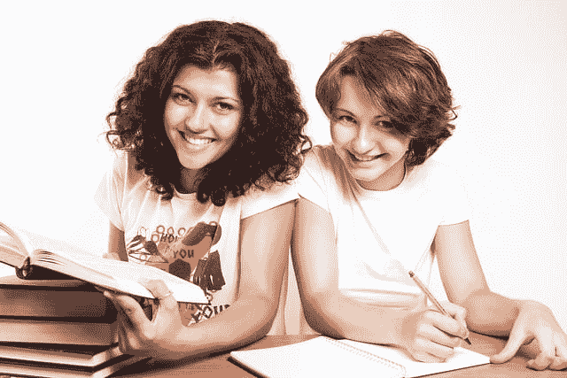
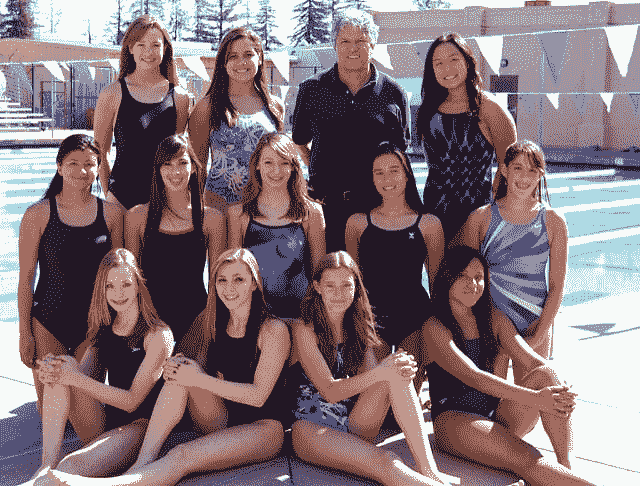
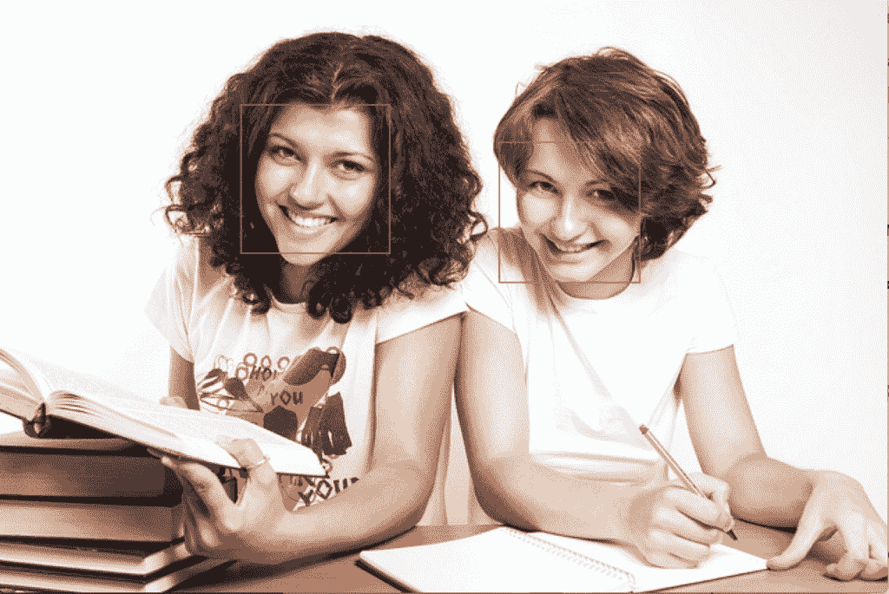
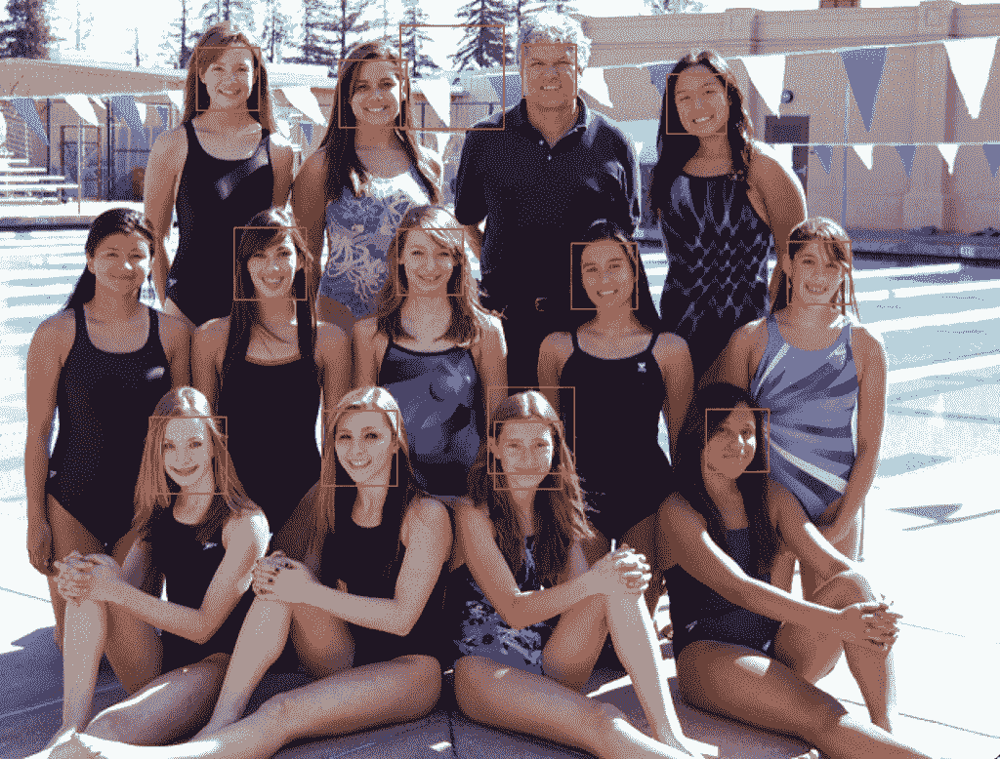
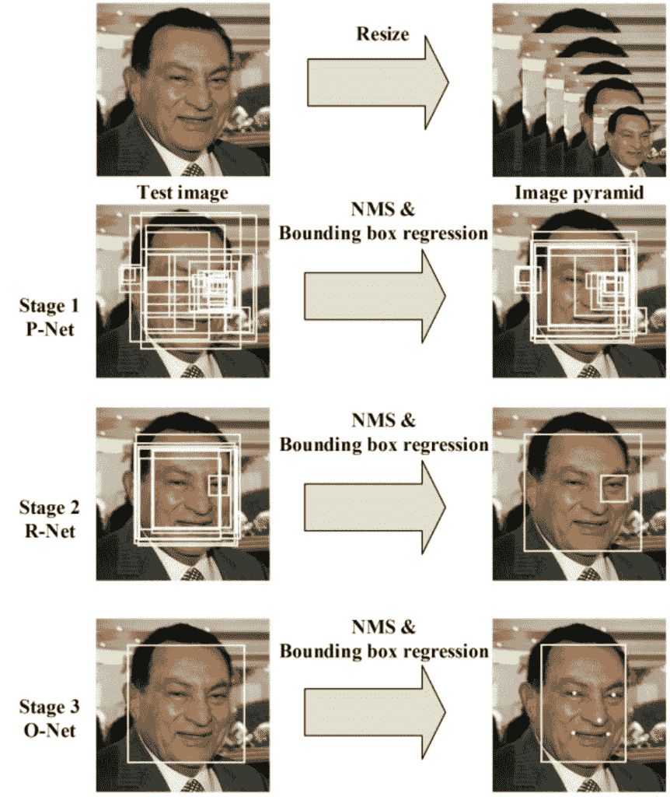
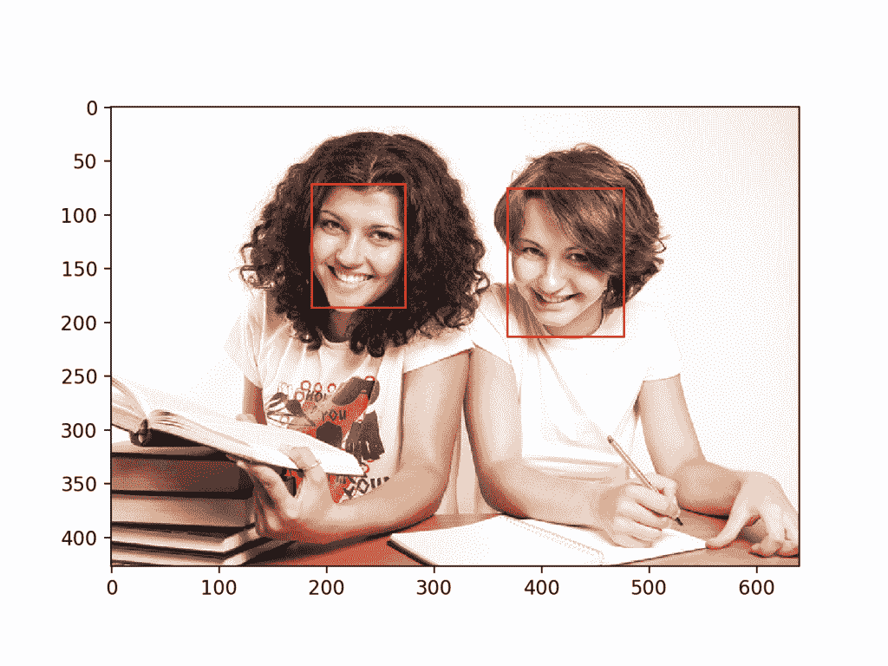

# 如何利用深度学习进行人脸检测

> 原文:[https://machinelearning master . com/如何使用经典和深度学习方法进行人脸检测-python-with-keras/](https://machinelearningmastery.com/how-to-perform-face-detection-with-classical-and-deep-learning-methods-in-python-with-keras/)

最后更新于 2020 年 8 月 24 日

人脸检测是一个计算机视觉问题，涉及到在照片中寻找人脸。

对于人类来说，这是一个微不足道的问题，并且已经通过经典的基于特征的技术(例如级联分类器)得到了相当好的解决。最近，深度学习方法在标准基准人脸检测数据集上取得了最先进的结果。一个例子是多任务级联卷积神经网络，简称 MTCNN。

在本教程中，您将发现如何使用经典和深度学习模型在 Python 中执行人脸检测。

完成本教程后，您将知道:

*   人脸检测是一个非常重要的计算机视觉问题，用于识别和定位图像中的人脸。
*   人脸检测可以使用经典的基于特征的级联分类器使用 OpenCV 库来执行。
*   最先进的人脸检测可以通过有线电视新闻网库使用多任务级联有线电视新闻网实现。

**用我的新书[计算机视觉深度学习](https://machinelearningmastery.com/deep-learning-for-computer-vision/)启动你的项目**，包括*分步教程*和所有示例的 *Python 源代码*文件。

我们开始吧。

*   **2019 年 11 月更新:**针对 TensorFlow v2.0 和 MTCNN v0.1.0 进行了更新。


如何用经典和深度学习方法进行人脸检测
图片由[米盖尔·迪斯卡特](https://www.flickr.com/photos/miguel_discart_vrac_3/46300410915/)提供，版权所有。

## 教程概述

本教程分为四个部分；它们是:

1.  人脸检测
2.  测试照片
3.  基于 OpenCV 的人脸检测
4.  深度学习的人脸检测

## 人脸检测

人脸检测是计算机视觉中定位和定位照片中一个或多个人脸的问题。

在照片中定位人脸是指在图像中找到人脸的坐标，而定位是指通常通过人脸周围的边界框来标定人脸的范围。

> 这个问题的一般描述可以定义如下:给定一个静止或视频图像，检测并定位未知数量(如果有的话)的人脸

——[人脸检测:一项调查](https://www.sciencedirect.com/science/article/pii/S107731420190921X)，2001。

检测照片中的人脸很容易被人类解决，尽管考虑到人脸的动态特性，这对计算机来说一直是一个挑战。例如，无论人脸面对的方向或角度、光线水平、服装、配饰、头发颜色、面部毛发、妆容、年龄等，都必须检测人脸。

> 人脸是一个动态的物体，其外观具有高度的可变性，这使得人脸检测成为计算机视觉中的一个难题。

——[人脸检测:一项调查](https://www.sciencedirect.com/science/article/pii/S107731420190921X)，2001。

给定一张照片，人脸检测系统将输出零个或多个包含人脸的边界框。然后，检测到的面部可以作为输入提供给后续系统，例如[面部识别系统](https://machinelearningmastery.com/introduction-to-deep-learning-for-face-recognition/)。

> 人脸检测是人脸识别系统中必不可少的第一步，目的是从背景中定位和提取人脸区域。

——[人脸检测:一项调查](https://www.sciencedirect.com/science/article/pii/S107731420190921X)，2001。

人脸识别可能有两种主要方法:基于特征的方法，使用手工制作的过滤器来搜索和检测人脸，以及基于图像的方法，整体学习如何从整个图像中提取人脸。

## 测试照片

在本教程中，我们需要用于人脸检测的测试图像。

为了简单起见，我们将使用两个测试图像:一个有两张脸，另一个有多张脸。我们并不是试图突破人脸检测的极限，只是演示如何用正常的正面人脸照片进行人脸检测。

第一张图片是两个大学生的照片，由[colleged grees 360](https://www.flickr.com/photos/83633410@N07/7658261288/)拍摄，并在许可许可下提供。

下载图像，并将其放入当前工作目录，文件名为“*test1.jpg*”。



大学生(test1.jpg)
图片由大学生提供 360，保留部分权利。

*   [大学生(test1.jpg)](https://machinelearningmastery.com/wp-content/uploads/2019/03/test1.jpg)

第二张照片是一个游泳队的一些人的照片，由鲍勃·n·雷尼拍摄，并在许可的情况下发布。

下载图像，并将其放入当前工作目录，文件名为“*test2.jpg*”。



游泳队(test2.jpg)
鲍勃·n·雷尼摄，版权所有。

*   [游泳队(test2.jpg)](https://machinelearningmastery.com/wp-content/uploads/2019/03/test2.jpg)

## 基于 OpenCV 的人脸检测

基于特征的人脸检测算法快速有效，已经成功应用了几十年。

也许最成功的例子是一种称为级联分类器的技术，首先由保罗·维奥拉和迈克尔·琼斯描述，他们在 2001 年发表了题为“使用简单特征的增强级联快速目标检测”的论文

在本文中，使用 [AdaBoost 算法](https://machinelearningmastery.com/boosting-and-adaboost-for-machine-learning/)来学习有效的特征，尽管重要的是，多个模型被组织成层次结构或*级联*

在本文中，AdaBoost 模型用于学习每个人脸中的一系列非常简单或弱的特征，这些特征共同提供了一个健壮的分类器。

> ……特征选择是通过对 AdaBoost 过程的简单修改来实现的:弱学习器受到约束，因此返回的每个弱分类器只能依赖于单个特征。结果，选择新的弱分类器的增强过程的每个阶段可以被视为特征选择过程。

——[使用简单特征的增强级联快速物体检测](https://ieeexplore.ieee.org/document/990517)，2001 年。

然后，这些模型被组织成一个越来越复杂的层次结构，称为“*级联*”。

简单的分类器直接对候选人脸区域进行操作，就像一个粗过滤器，而复杂的分类器只对那些最有希望作为人脸的候选区域进行操作。

> …一种在级联结构中连续组合更复杂的分类器的方法，通过将注意力集中在图像中有希望的区域，显著提高了检测器的速度。

——[使用简单特征的增强级联快速物体检测](https://ieeexplore.ieee.org/document/990517)，2001 年。

其结果是非常快速和有效的人脸检测算法，该算法已经成为消费产品(如相机)中人脸检测的基础。

> 他们的检测器被称为检测器级联，由一系列简单到复杂的人脸分类器组成，吸引了广泛的研究。此外，探测器级联已被部署在许多商业产品中，如智能手机和数码相机。

——[使用深度卷积神经网络的多视角人脸检测](https://arxiv.org/abs/1502.02766)，2015。

这是一个稍微复杂的分类器，在过去近 20 年里也进行了调整和完善。

[OpenCV 库](https://opencv.org/)中提供了[分类器级联](https://en.wikipedia.org/wiki/Cascading_classifiers)人脸检测算法的现代实现。这是一个提供 python 接口的 C++计算机视觉库。这种实现的好处是它提供了预先训练好的人脸检测模型，并提供了一个在自己的数据集上训练模型的接口。

OpenCV 可以由你的平台上的包管理器系统安装，或者通过 pip 例如:

```py
sudo pip install opencv-python
```

安装过程完成后，确认库安装正确非常重要。

这可以通过导入库并检查版本号来实现；例如:

```py
# check opencv version
import cv2
# print version number
print(cv2.__version__)
```

运行该示例将导入库并打印版本。在这种情况下，我们使用的是库的版本 4。

```py
4.1.1
```

OpenCV 提供了[级联分类器类](https://docs.opencv.org/3.4.3/d1/de5/classcv_1_1CascadeClassifier.html)，可以用来创建人脸检测的级联分类器。构造函数可以将文件名作为参数，为预先训练的模型指定 XML 文件。

作为安装的一部分，OpenCV 提供了许多预先训练好的模型。这些都可以在你的系统上获得，也可以在 [OpenCV GitHub 项目](https://github.com/opencv/opencv/tree/master/data/haarcascades)上获得。

从 OpenCV GitHub 项目中下载一个用于正面人脸检测的预训练模型，并将其放入当前工作目录中，文件名为“*haarcscade _ frontal face _ default . XML*”。

*   [下载开放正面人脸检测模型(haarcscade _ Frontal Face _ default . XML)](https://raw.githubusercontent.com/opencv/opencv/master/data/haarcascades/haarcascade_frontalface_default.xml)

下载后，我们可以按如下方式加载模型:

```py
# load the pre-trained model
classifier = CascadeClassifier('haarcascade_frontalface_default.xml')
```

加载后，通过调用[detectmulticale()函数](https://docs.opencv.org/3.4.3/d1/de5/classcv_1_1CascadeClassifier.html#aaf8181cb63968136476ec4204ffca498)，该模型可用于对照片进行人脸检测。

该功能将返回照片中检测到的所有人脸的边界框列表。

```py
# perform face detection
bboxes = classifier.detectMultiScale(pixels)
# print bounding box for each detected face
for box in bboxes:
	print(box)
```

我们可以用大学生照片(*test.jpg*)来举例说明。

可以通过 *imread()* 功能使用 OpenCV 加载照片。

```py
# load the photograph
pixels = imread('test1.jpg')
```

下面列出了在 OpenCV 中用预先训练好的级联分类器对大学生照片进行人脸检测的完整例子。

```py
# example of face detection with opencv cascade classifier
from cv2 import imread
from cv2 import CascadeClassifier
# load the photograph
pixels = imread('test1.jpg')
# load the pre-trained model
classifier = CascadeClassifier('haarcascade_frontalface_default.xml')
# perform face detection
bboxes = classifier.detectMultiScale(pixels)
# print bounding box for each detected face
for box in bboxes:
	print(box)
```

运行该示例首先加载照片，然后加载和配置级联分类器；检测面并打印每个边界框。

每个框列出了边界框左下角的 *x* 和 *y* 坐标，以及宽度和高度。结果表明检测到两个边界框。

```py
[174  75 107 107]
[360 102 101 101]
```

我们可以更新示例来绘制照片并绘制每个边界框。

这可以通过使用取两点的*矩形()*函数在加载图像的像素正上方为每个框绘制一个矩形来实现。

```py
# extract
x, y, width, height = box
x2, y2 = x + width, y + height
# draw a rectangle over the pixels
rectangle(pixels, (x, y), (x2, y2), (0,0,255), 1)
```

然后，我们可以绘制照片，并保持窗口打开，直到我们按下一个键关闭它。

```py
# show the image
imshow('face detection', pixels)
# keep the window open until we press a key
waitKey(0)
# close the window
destroyAllWindows()
```

下面列出了完整的示例。

```py
# plot photo with detected faces using opencv cascade classifier
from cv2 import imread
from cv2 import imshow
from cv2 import waitKey
from cv2 import destroyAllWindows
from cv2 import CascadeClassifier
from cv2 import rectangle
# load the photograph
pixels = imread('test1.jpg')
# load the pre-trained model
classifier = CascadeClassifier('haarcascade_frontalface_default.xml')
# perform face detection
bboxes = classifier.detectMultiScale(pixels)
# print bounding box for each detected face
for box in bboxes:
	# extract
	x, y, width, height = box
	x2, y2 = x + width, y + height
	# draw a rectangle over the pixels
	rectangle(pixels, (x, y), (x2, y2), (0,0,255), 1)
# show the image
imshow('face detection', pixels)
# keep the window open until we press a key
waitKey(0)
# close the window
destroyAllWindows()
```

运行该示例，我们可以看到照片绘制正确，并且每个面部都被正确检测到。



利用 OpenCV 级联分类器检测人脸的大学生照片

我们可以在游泳队的第二张照片上尝试相同的代码，特别是“*test2.jpg*”。

```py
# load the photograph
pixels = imread('test2.jpg')
```

运行该示例，我们可以看到许多人脸被正确检测到，但结果并不完美。

**注**:考虑到算法或评估程序的随机性，或数值精度的差异，您的[结果可能会有所不同](https://machinelearningmastery.com/different-results-each-time-in-machine-learning/)。考虑运行该示例几次，并比较平均结果。

我们可以看到，第一排或最下面一排人的一张脸被检测了两次，中间一排人的一张脸没有被检测到，第三排或最上面一排的背景被检测为人脸。



使用 OpenCV 级联分类器检测人脸的游泳队照片

*检测多尺度()*函数提供了一些参数来帮助调整分类器的使用。值得注意的两个参数是*比例因子*和*明尼阿波利斯*；例如:

```py
# perform face detection
bboxes = classifier.detectMultiScale(pixels, 1.1, 3)
```

*缩放因子*控制检测前如何缩放输入图像，例如是放大还是缩小，这有助于更好地找到图像中的人脸。默认值为 1.1(增加 10%)，但也可以降低到 1.05(增加 5%)或提高到 1.4(增加 40%)等值。

*minNeighbors* 确定每个检测必须有多稳健才能被报告，例如找到面部的候选矩形的数量。默认值为 3，但可以降低到 1，以检测更多的人脸，这可能会增加误报，或者增加到 6 或更多，以在检测到人脸之前需要更多的信心。

*比例因子*和 *minNeighbors* 通常需要针对给定的图像或数据集进行调整，以便最好地检测人脸。在一个数值网格上进行灵敏度分析，看看在一张或多张照片上什么效果好或最好，可能会有所帮助。

快速策略可能是降低(或提高小照片的比例因子)直到检测到所有人脸，然后增加 *minNeighbors* 直到所有假阳性消失，或接近它。

经过一些调优，我发现 1.05 的 *scaleFactor* 成功检测到了所有的人脸，但是检测为人脸的背景直到 8 的 *minNeighbors* 才消失，之后中间一排的三张人脸不再被检测到。

```py
# perform face detection
bboxes = classifier.detectMultiScale(pixels, 1.05, 8)
```

结果并不完美，也许可以通过进一步的调整和边界框的后处理来获得更好的结果。


经过一些调整后，使用 OpenCV 级联分类器检测人脸的游泳队照片

## 深度学习的人脸检测

已经开发并演示了许多深度学习方法用于人脸检测。

也许其中一种更流行的方法被称为“*多任务级联卷积神经网络*，简称 MTCNN，由张等人在 2016 年发表的论文《使用多任务级联卷积网络的联合人脸检测和对齐》中描述

MTCNN 之所以受欢迎，是因为它在一系列基准数据集上取得了当时最先进的结果，还因为它能够识别眼睛和嘴巴等其他面部特征，称为地标检测。

该网络采用三个网络的级联结构；首先将图像重新缩放到不同大小的范围(称为图像金字塔)，然后第一个模型(proposition Network 或 P-Net)提出候选面部区域，第二个模型(Refine Network 或 R-Net)过滤边界框，第三个模型(Output Network 或 O-Net)提出面部界标。

> 拟议的氯化萘包括三个阶段。在第一阶段，它通过一个浅 CNN 快速产生候选窗口。然后，它通过更复杂的 CNN 对窗口进行细化，以拒绝大量非人脸窗口。最后，它使用更强大的 CNN 来细化结果并输出面部地标位置。

——[使用多任务级联卷积网络的联合人脸检测和对齐](https://arxiv.org/abs/1604.02878)，2016。

下图取自论文，对从上到下的三个阶段以及每个阶段从左到右的输出进行了有益的总结。



多任务级联卷积神经网络的流水线来自:使用多任务级联卷积网络的联合人脸检测和对准。

该模型被称为多任务网络，因为级联中的三个模型(P-Net、R-Net 和 O-Net)中的每一个都在三个任务上进行训练，例如进行三种类型的预测；它们是:人脸分类、包围盒回归和面部标志定位。

三个型号没有直接连接；相反，前一级的输出作为输入被馈送到下一级。这允许在阶段之间执行额外的处理；例如，在将第一阶段 P-Net 提出的候选包围盒提供给第二阶段 R-Net 模型之前，使用非最大抑制(NMS)来过滤它们。

MTCNN 架构实现起来相当复杂。令人欣慰的是，该架构有开源的实现，可以在新的数据集上进行训练，还有预训练的模型，可以直接用于人脸检测。值得注意的是[正式发布](https://github.com/kpzhang93/MTCNN_face_detection_alignment)，其中包含本文使用的代码和模型，实现在 [Caffe 深度学习框架](http://caffe.berkeleyvision.org/)中提供。

也许最好的基于 Python 的第三方 MTCNN 项目被称为“T0”MTCNN，由[ivn de Paz Centeno](https://www.linkedin.com/in/ivandepazcenteno/)或 ipazc 提供，在一个许可的麻省理工学院开源许可下提供。作为一个第三方开源项目，是会有变化的，所以我在写[的时候有一个项目的岔口，这里](https://github.com/jbrownlee/mtcnn)有。

MTCNN 项目，我们将称之为 *ipazc/MTCNN* 以区别于网络名称，提供了一个使用 TensorFlow 和 OpenCV 的 MTCNN 架构的实现。这个项目主要有两个好处；首先，它提供了一个性能最佳的预训练模型，其次，它可以作为一个库安装，准备在您自己的代码中使用。

可以通过 pip 安装库；例如:

```py
sudo pip install mtcnn
```

成功安装后，您应该会看到如下消息:

```py
Successfully installed mtcnn-0.1.0
```

然后，您可以通过 pip 确认库安装正确；例如:

```py
sudo pip show mtcnn
```

您应该会看到如下所示的输出。在这种情况下，您可以看到我们使用的是 0.0.8 版本的库。

```py
Name: mtcnn
Version: 0.1.0
Summary: Multi-task Cascaded Convolutional Neural Networks for Face Detection, based on TensorFlow
Home-page: http://github.com/ipazc/mtcnn
Author: Iván de Paz Centeno
Author-email: ipazc@unileon.es
License: MIT
Location: ...
Requires: opencv-python, keras
Required-by:
```

您还可以通过 Python 确认库安装正确，如下所示:

```py
# confirm mtcnn was installed correctly
import mtcnn
# print version
print(mtcnn.__version__)
```

运行该示例将加载库，确认它安装正确；并打印版本。

```py
0.1.0
```

现在我们有信心库安装正确，我们可以使用它进行人脸检测。

通过调用 *MTCNN()* 构造函数，可以创建网络的一个实例。

默认情况下，库将使用预训练的模型，尽管您可以通过“*权重 _ 文件*”参数指定自己的模型，并指定路径或网址，例如:

```py
model = MTCNN(weights_file='filename.npy')
```

检测人脸的最小框大小可以通过“ *min_face_size* 参数指定，默认为 20 像素。构造函数还提供了一个“*比例因子*参数来指定输入图像的比例因子，默认为 0.709。

模型配置加载后，通过调用 *detect_faces()* 功能，可以直接用于检测照片中的人脸。

这将返回一个 dict 对象列表，每个对象为检测到的每个人脸的详细信息提供多个键，包括:

*   *框*:提供边框左下方的 *x* 、 *y* ，以及框的*宽*和*高*。
*   *置信度*':预测的概率置信度。
*   *要点*:为“*左眼*”、“*右眼*”、“*鼻子*”、“*嘴 _ 左*”和“*嘴 _ 右*”提供带点的字典。

例如，我们可以对大学生照片执行人脸检测，如下所示:

```py
# face detection with mtcnn on a photograph
from matplotlib import pyplot
from mtcnn.mtcnn import MTCNN
# load image from file
filename = 'test1.jpg'
pixels = pyplot.imread(filename)
# create the detector, using default weights
detector = MTCNN()
# detect faces in the image
faces = detector.detect_faces(pixels)
for face in faces:
	print(face)
```

运行该示例加载照片、加载模型、执行人脸检测，并打印检测到的每个人脸的列表。

```py
{'box': [186, 71, 87, 115], 'confidence': 0.9994562268257141, 'keypoints': {'left_eye': (207, 110), 'right_eye': (252, 119), 'nose': (220, 143), 'mouth_left': (200, 148), 'mouth_right': (244, 159)}}
{'box': [368, 75, 108, 138], 'confidence': 0.998593270778656, 'keypoints': {'left_eye': (392, 133), 'right_eye': (441, 140), 'nose': (407, 170), 'mouth_left': (388, 180), 'mouth_right': (438, 185)}}
```

我们可以先用 matplotlib 绘制图像，然后使用给定边界框的 *x* 、 *y* 和*宽度*和*高度*创建[矩形对象](https://matplotlib.org/api/_as_gen/matplotlib.patches.Rectangle.html)来绘制图像上的框；例如:

```py
# get coordinates
x, y, width, height = result['box']
# create the shape
rect = Rectangle((x, y), width, height, fill=False, color='red')
```

下面是一个名为*draw _ image _ with _ box()*的函数，它显示照片，然后为每个检测到的边界框绘制一个框。

```py
# draw an image with detected objects
def draw_image_with_boxes(filename, result_list):
	# load the image
	data = pyplot.imread(filename)
	# plot the image
	pyplot.imshow(data)
	# get the context for drawing boxes
	ax = pyplot.gca()
	# plot each box
	for result in result_list:
		# get coordinates
		x, y, width, height = result['box']
		# create the shape
		rect = Rectangle((x, y), width, height, fill=False, color='red')
		# draw the box
		ax.add_patch(rect)
	# show the plot
	pyplot.show()
```

下面列出了使用该函数的完整示例。

```py
# face detection with mtcnn on a photograph
from matplotlib import pyplot
from matplotlib.patches import Rectangle
from mtcnn.mtcnn import MTCNN

# draw an image with detected objects
def draw_image_with_boxes(filename, result_list):
	# load the image
	data = pyplot.imread(filename)
	# plot the image
	pyplot.imshow(data)
	# get the context for drawing boxes
	ax = pyplot.gca()
	# plot each box
	for result in result_list:
		# get coordinates
		x, y, width, height = result['box']
		# create the shape
		rect = Rectangle((x, y), width, height, fill=False, color='red')
		# draw the box
		ax.add_patch(rect)
	# show the plot
	pyplot.show()

filename = 'test1.jpg'
# load image from file
pixels = pyplot.imread(filename)
# create the detector, using default weights
detector = MTCNN()
# detect faces in the image
faces = detector.detect_faces(pixels)
# display faces on the original image
draw_image_with_boxes(filename, faces)
```

运行示例绘制照片，然后为每个检测到的面部绘制一个边界框。

我们可以看到两张脸都被正确检测到了。



大学生用移动电视新闻网为每个检测到的人脸绘制边界框

我们可以通过[圆类](https://matplotlib.org/api/_as_gen/matplotlib.patches.Circle.html)为眼睛、鼻子和嘴巴画一个圆；例如

```py
# draw the dots
for key, value in result['keypoints'].items():
	# create and draw dot
	dot = Circle(value, radius=2, color='red')
	ax.add_patch(dot)
```

下面列出了添加到*draw _ image _ with _ box()*功能的完整示例。

```py
# face detection with mtcnn on a photograph
from matplotlib import pyplot
from matplotlib.patches import Rectangle
from matplotlib.patches import Circle
from mtcnn.mtcnn import MTCNN

# draw an image with detected objects
def draw_image_with_boxes(filename, result_list):
	# load the image
	data = pyplot.imread(filename)
	# plot the image
	pyplot.imshow(data)
	# get the context for drawing boxes
	ax = pyplot.gca()
	# plot each box
	for result in result_list:
		# get coordinates
		x, y, width, height = result['box']
		# create the shape
		rect = Rectangle((x, y), width, height, fill=False, color='red')
		# draw the box
		ax.add_patch(rect)
		# draw the dots
		for key, value in result['keypoints'].items():
			# create and draw dot
			dot = Circle(value, radius=2, color='red')
			ax.add_patch(dot)
	# show the plot
	pyplot.show()

filename = 'test1.jpg'
# load image from file
pixels = pyplot.imread(filename)
# create the detector, using default weights
detector = MTCNN()
# detect faces in the image
faces = detector.detect_faces(pixels)
# display faces on the original image
draw_image_with_boxes(filename, faces)
```

该示例使用边界框和面部关键点再次绘制照片。

我们可以看到，眼睛、鼻子和嘴巴在每张脸上都能很好地被检测到，尽管右脸上的嘴巴可能更好地被检测到，这些点看起来比嘴角低一点。


大学生用边界框和为每个检测到的面部绘制的面部关键点拍摄

我们现在可以在游泳队的照片上尝试人脸检测，例如 test2.jpg 的照片。

运行该示例，我们可以看到所有 13 个面部都被正确检测到，并且看起来大致上所有面部关键点也都是正确的。


游泳队照片与边界框和面部关键点绘制每个检测到的脸使用 MTCNN

我们可能希望提取检测到的人脸，并将它们作为输入传递给另一个系统。

这可以通过直接从照片中提取像素数据来实现；例如:

```py
# get coordinates
x1, y1, width, height = result['box']
x2, y2 = x1 + width, y1 + height
# extract face
face = data[y1:y2, x1:x2]
```

我们可以通过提取每个人脸并将其绘制为单独的子情节来演示这一点。你可以很容易地将它们保存到文件中。下面的*draw _ face()*提取并绘制照片中每个检测到的人脸。

```py
# draw each face separately
def draw_faces(filename, result_list):
	# load the image
	data = pyplot.imread(filename)
	# plot each face as a subplot
	for i in range(len(result_list)):
		# get coordinates
		x1, y1, width, height = result_list[i]['box']
		x2, y2 = x1 + width, y1 + height
		# define subplot
		pyplot.subplot(1, len(result_list), i+1)
		pyplot.axis('off')
		# plot face
		pyplot.imshow(data[y1:y2, x1:x2])
	# show the plot
	pyplot.show()
```

下面列出了为游泳队照片演示该功能的完整示例。

```py
# extract and plot each detected face in a photograph
from matplotlib import pyplot
from matplotlib.patches import Rectangle
from matplotlib.patches import Circle
from mtcnn.mtcnn import MTCNN

# draw each face separately
def draw_faces(filename, result_list):
	# load the image
	data = pyplot.imread(filename)
	# plot each face as a subplot
	for i in range(len(result_list)):
		# get coordinates
		x1, y1, width, height = result_list[i]['box']
		x2, y2 = x1 + width, y1 + height
		# define subplot
		pyplot.subplot(1, len(result_list), i+1)
		pyplot.axis('off')
		# plot face
		pyplot.imshow(data[y1:y2, x1:x2])
	# show the plot
	pyplot.show()

filename = 'test2.jpg'
# load image from file
pixels = pyplot.imread(filename)
# create the detector, using default weights
detector = MTCNN()
# detect faces in the image
faces = detector.detect_faces(pixels)
# display faces on the original image
draw_faces(filename, faces)
```

运行该示例会创建一个图表，显示在游泳队照片中检测到的每个单独的面部。


游泳队照片中检测到的每个单独面部的图

## 进一步阅读

如果您想更深入地了解这个主题，本节将提供更多资源。

### 报纸

*   [人脸检测:一项调查](https://www.sciencedirect.com/science/article/pii/S107731420190921X)，2001。
*   [使用简单特征的增强级联的快速物体检测](https://ieeexplore.ieee.org/document/990517)，2001。
*   [使用深度卷积神经网络的多视角人脸检测](https://arxiv.org/abs/1502.02766)，2015。
*   [使用多任务级联卷积网络的联合人脸检测和对准](https://arxiv.org/abs/1604.02878)，2016。

### 书

*   第十一章人脸检测，[人脸识别手册](https://amzn.to/2EuR8Oo)，第二版，2011。

### 应用程序接口

*   [OpenCV 主页](https://opencv.org/)
*   [OpenCV GitHub 项目](https://github.com/opencv/opencv)
*   [使用哈尔级联的人脸检测，OpenCV](https://docs.opencv.org/3.4.3/d7/d8b/tutorial_py_face_detection.html) 。
*   [级联分类器训练，OpenCV](https://docs.opencv.org/3.4.3/dc/d88/tutorial_traincascade.html) 。
*   [级联分类器，OpenCV](https://docs.opencv.org/3.4.3/db/d28/tutorial_cascade_classifier.html) 。
*   【MTCNN 官方项目
*   [Python MTCNN 项目](https://github.com/ipazc/mtcnn)
*   [matplotlib . patches . rectangle API](https://matplotlib.org/api/_as_gen/matplotlib.patches.Rectangle.html)
*   [matplot lib . patches . circle API](https://matplotlib.org/api/_as_gen/matplotlib.patches.Circle.html)

### 文章

*   [人脸检测，维基百科](https://en.wikipedia.org/wiki/Face_detection)。
*   [层叠分类器，维基百科](https://en.wikipedia.org/wiki/Cascading_classifiers)。

### 摘要

在本教程中，您发现了如何使用经典和深度学习模型在 Python 中执行人脸检测。

具体来说，您了解到:

*   人脸检测是用于识别和定位图像中人脸的计算机视觉问题。
*   人脸检测可以使用经典的基于特征的级联分类器使用 OpenCV 库来执行。
*   最先进的人脸检测可以通过有线电视新闻网库使用多任务级联有线电视新闻网实现。

你有什么问题吗？
在下面的评论中提问，我会尽力回答。