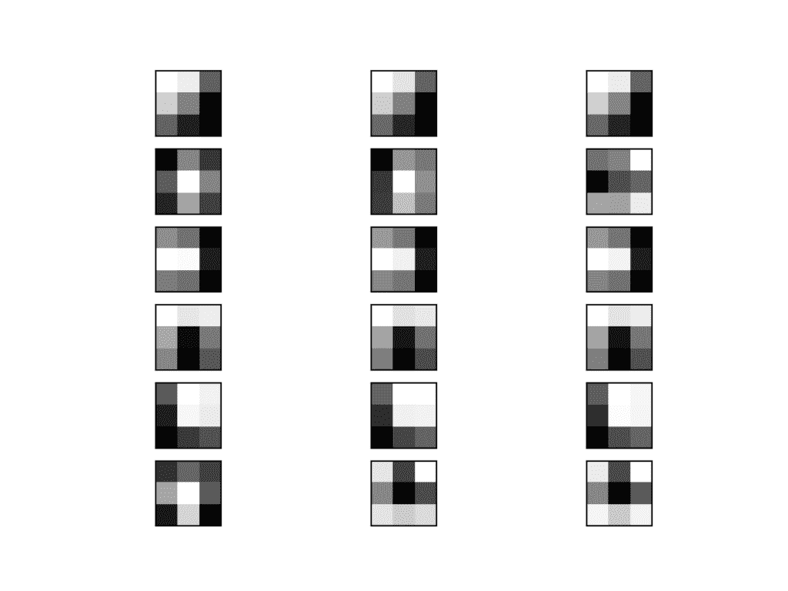
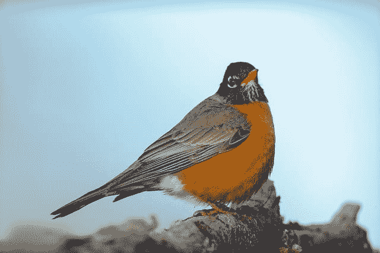
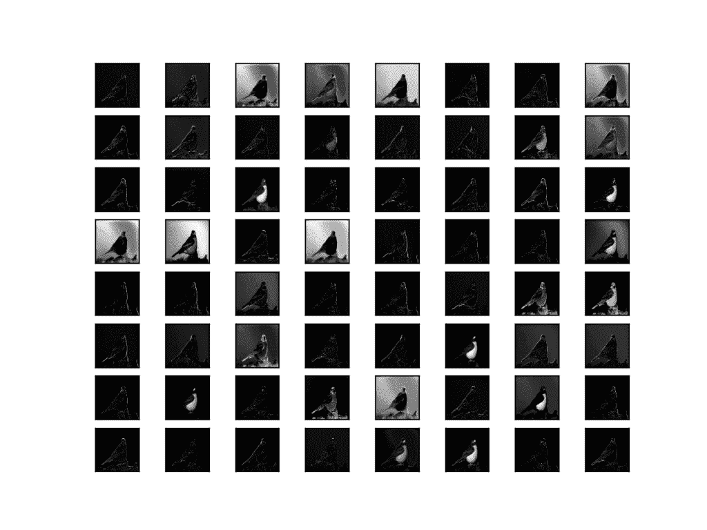
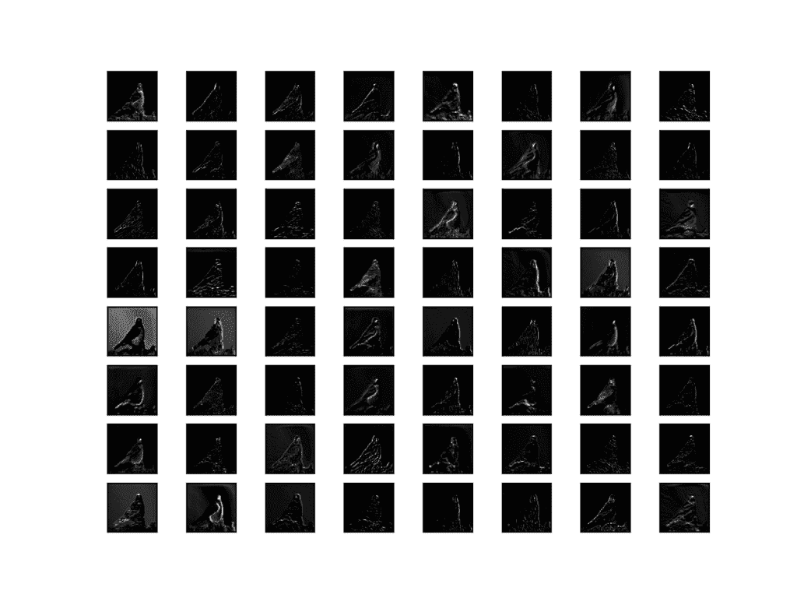
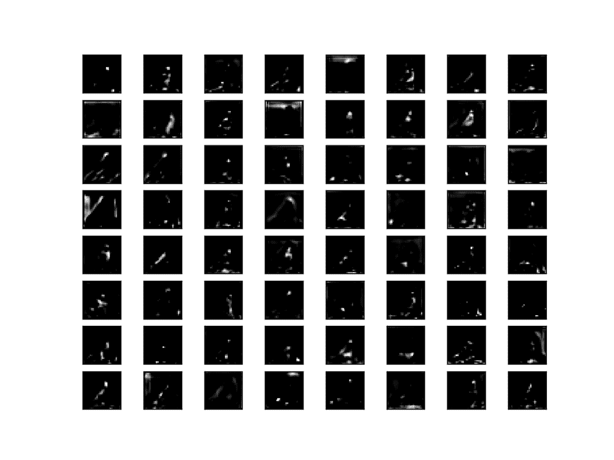

# 如何在卷积神经网络中可视化过滤器和特征图

> 原文：<https://machinelearningmastery.com/how-to-visualize-filters-and-feature-maps-in-convolutional-neural-networks/>

最后更新于 2019 年 7 月 5 日

深度学习神经网络通常是不透明的，这意味着尽管它们可以做出有用和熟练的预测，但不清楚如何或为什么做出给定的预测。

卷积神经网络具有内部结构，其被设计成对二维图像数据进行操作，并且因此保留了模型所学习的内容的空间关系。具体而言，可以检查和可视化模型学习的二维滤波器，以发现模型将检测到的特征类型，并且可以检查卷积层输出的激活图，以准确理解对于给定的输入图像检测到了什么特征。

在本教程中，您将发现如何为卷积神经网络中的过滤器和特征映射开发简单的可视化。

完成本教程后，您将知道:

*   如何开发卷积神经网络中特定滤波器的可视化？
*   如何开发卷积神经网络中特定特征图的可视化？
*   如何在深度卷积神经网络中系统地可视化每个块的特征图？

**用我的新书[计算机视觉深度学习](https://machinelearningmastery.com/deep-learning-for-computer-vision/)启动你的项目**，包括*分步教程*和所有示例的 *Python 源代码*文件。

我们开始吧。


如何在卷积神经网络中可视化过滤器和特征图
图片由[马克·肯特](https://www.flickr.com/photos/flamesworddragon/6953170207/)提供，保留部分权利。

## 教程概述

本教程分为四个部分；它们是:

1.  可视化卷积层
2.  预拟合 VGG 模型
3.  如何可视化过滤器
4.  如何可视化要素地图

## 可视化卷积层

神经网络模型通常被称为不透明的。这意味着他们不善于解释做出特定决定或预测的原因。

卷积神经网络是为处理图像数据而设计的，它们的结构和功能表明，应该比其他类型的神经网络不那么难以理解。

具体来说，模型由小的线性过滤器和应用过滤器的结果组成，这些过滤器被称为激活图，或者更一般地说，特征图。

过滤器和特征图都可以可视化。

例如，我们可以设计和理解小型滤波器，如线检测器。也许在一个学习过的卷积神经网络中可视化过滤器可以提供对模型如何工作的洞察。

通过将过滤器应用于输入图像和由先前层输出的特征图而产生的特征图可以提供对模型中给定点的特定输入的模型内部表示的洞察。

在本教程中，我们将探索这两种方法来可视化卷积神经网络。

## 预拟合 VGG 模型

我们需要一个模型来可视化。

我们可以使用预拟合的现有最先进的图像分类模型，而不是从头开始拟合模型。

Keras [提供了许多由不同研究小组为 ImageNet 大规模视觉识别挑战(ILSVRC)开发的表现良好的图像分类模型的例子](https://keras.io/applications/)。一个例子是在 2014 年竞赛中取得最高成绩的 VGG-16 型。

这是一个很好的可视化模型，因为它有一个简单统一的串行有序卷积和池化层结构，它有 16 个深度学习层，并且表现非常好，这意味着过滤器和生成的特征图将捕获有用的特征。有关该模型的更多信息，请参见 2015 年的论文“[用于大规模图像识别的超深度卷积网络](https://arxiv.org/abs/1409.1556)”

我们只需几行代码就可以加载并汇总 [VGG16 模型](https://keras.io/applications/#vgg16)；例如:

```py
# load vgg model
from keras.applications.vgg16 import VGG16
# load the model
model = VGG16()
# summarize the model
model.summary()
```

运行该示例会将模型权重加载到内存中，并打印加载模型的摘要。

如果这是您第一次加载模型，重量将从互联网下载并存储在您的主目录中。这些权重大约为 500 兆字节，根据您的互联网连接速度，下载可能需要一些时间。

我们可以看到，这些层命名良好，组织成块，并在每个块中用整数索引命名。

```py
_________________________________________________________________
Layer (type)                 Output Shape              Param #
=================================================================
input_1 (InputLayer)         (None, 224, 224, 3)       0
_________________________________________________________________
block1_conv1 (Conv2D)        (None, 224, 224, 64)      1792
_________________________________________________________________
block1_conv2 (Conv2D)        (None, 224, 224, 64)      36928
_________________________________________________________________
block1_pool (MaxPooling2D)   (None, 112, 112, 64)      0
_________________________________________________________________
block2_conv1 (Conv2D)        (None, 112, 112, 128)     73856
_________________________________________________________________
block2_conv2 (Conv2D)        (None, 112, 112, 128)     147584
_________________________________________________________________
block2_pool (MaxPooling2D)   (None, 56, 56, 128)       0
_________________________________________________________________
block3_conv1 (Conv2D)        (None, 56, 56, 256)       295168
_________________________________________________________________
block3_conv2 (Conv2D)        (None, 56, 56, 256)       590080
_________________________________________________________________
block3_conv3 (Conv2D)        (None, 56, 56, 256)       590080
_________________________________________________________________
block3_pool (MaxPooling2D)   (None, 28, 28, 256)       0
_________________________________________________________________
block4_conv1 (Conv2D)        (None, 28, 28, 512)       1180160
_________________________________________________________________
block4_conv2 (Conv2D)        (None, 28, 28, 512)       2359808
_________________________________________________________________
block4_conv3 (Conv2D)        (None, 28, 28, 512)       2359808
_________________________________________________________________
block4_pool (MaxPooling2D)   (None, 14, 14, 512)       0
_________________________________________________________________
block5_conv1 (Conv2D)        (None, 14, 14, 512)       2359808
_________________________________________________________________
block5_conv2 (Conv2D)        (None, 14, 14, 512)       2359808
_________________________________________________________________
block5_conv3 (Conv2D)        (None, 14, 14, 512)       2359808
_________________________________________________________________
block5_pool (MaxPooling2D)   (None, 7, 7, 512)         0
_________________________________________________________________
flatten (Flatten)            (None, 25088)             0
_________________________________________________________________
fc1 (Dense)                  (None, 4096)              102764544
_________________________________________________________________
fc2 (Dense)                  (None, 4096)              16781312
_________________________________________________________________
predictions (Dense)          (None, 1000)              4097000
=================================================================
Total params: 138,357,544
Trainable params: 138,357,544
Non-trainable params: 0
_________________________________________________________________
```

现在我们有了一个预拟合模型，我们可以将其用作可视化的基础。

## 如何可视化过滤器

也许最简单的可视化是直接绘制学习过的过滤器。

在神经网络术语中，所学习的滤波器仅仅是权重，然而由于滤波器的专用二维结构，权重值彼此具有空间关系，并且将每个滤波器绘制为二维图像是有意义的(或者可能是)。

第一步是查看模型中的过滤器，看看我们需要处理什么。

上一节中打印的模型摘要总结了每个图层的输出形状，例如生成的要素图的形状。它没有给出网络中过滤器的形状(权重)的任何概念，只有每层权重的总数。

我们可以通过 *model.layers* 属性访问模型的所有层。

每一层都有一个*层. name* 属性，其中卷积层有一个命名卷积，如*块#_conv#* ，其中“ *#* ”是一个整数。因此，我们可以检查每个层的名称，跳过任何不包含字符串“ *conv* ”的层。

```py
# summarize filter shapes
for layer in model.layers:
	# check for convolutional layer
	if 'conv' not in layer.name:
		continue
```

每个卷积层有两组权重。

一个是滤波器块，另一个是偏差值块。这些可通过*图层. get_weights()* 功能访问。我们可以检索这些权重，然后总结它们的形状。

```py
# get filter weights
filters, biases = layer.get_weights()
print(layer.name, filters.shape)
```

将这些联系在一起，下面列出了总结模型过滤器的完整示例。

```py
# summarize filters in each convolutional layer
from keras.applications.vgg16 import VGG16
from matplotlib import pyplot
# load the model
model = VGG16()
# summarize filter shapes
for layer in model.layers:
	# check for convolutional layer
	if 'conv' not in layer.name:
		continue
	# get filter weights
	filters, biases = layer.get_weights()
	print(layer.name, filters.shape)
```

运行该示例会打印图层详细信息列表，包括图层名称和图层中过滤器的形状。

```py
block1_conv1 (3, 3, 3, 64)
block1_conv2 (3, 3, 64, 64)
block2_conv1 (3, 3, 64, 128)
block2_conv2 (3, 3, 128, 128)
block3_conv1 (3, 3, 128, 256)
block3_conv2 (3, 3, 256, 256)
block3_conv3 (3, 3, 256, 256)
block4_conv1 (3, 3, 256, 512)
block4_conv2 (3, 3, 512, 512)
block4_conv3 (3, 3, 512, 512)
block5_conv1 (3, 3, 512, 512)
block5_conv2 (3, 3, 512, 512)
block5_conv3 (3, 3, 512, 512)
```

我们可以看到，所有卷积层都使用 3×3 滤波器，这些滤波器很小，可能很容易解释。

卷积神经网络的一个结构问题是滤波器的深度必须与滤波器的输入深度(例如通道数)相匹配。

我们可以看到，对于具有红色、绿色和蓝色三个通道的输入图像，每个过滤器都有三个深度(这里我们使用的是通道在后格式)。我们可以把一个滤镜想象成一个有三个图像的图，每个通道一个，或者把三个都压缩成一个彩色图像，或者只看第一个通道，假设其他通道看起来都一样。问题是，我们还有另外 63 个我们可能想要可视化的过滤器。

我们可以从第一层检索过滤器，如下所示:

```py
# retrieve weights from the second hidden layer
filters, biases = model.layers[1].get_weights()
```

权重值可能是以 0.0 为中心的小正值和负值。

我们可以将它们的值标准化到 0-1 的范围内，以便于可视化。

```py
# normalize filter values to 0-1 so we can visualize them
f_min, f_max = filters.min(), filters.max()
filters = (filters - f_min) / (f_max - f_min)
```

现在，我们可以列举块中 64 个滤波器中的前 6 个，并绘制每个滤波器的三个通道。

我们使用 matplotlib 库，将每个滤镜绘制为一行新的子情节，将每个滤镜通道或深度绘制为一列新的内容。

```py
# plot first few filters
n_filters, ix = 6, 1
for i in range(n_filters):
	# get the filter
	f = filters[:, :, :, i]
	# plot each channel separately
	for j in range(3):
		# specify subplot and turn of axis
		ax = pyplot.subplot(n_filters, 3, ix)
		ax.set_xticks([])
		ax.set_yticks([])
		# plot filter channel in grayscale
		pyplot.imshow(f[:, :, j], cmap='gray')
		ix += 1
# show the figure
pyplot.show()
```

将这些联系在一起，下面列出了从 VGG16 模型的第一个隐藏卷积层绘制前六个滤波器的完整示例。

```py
# cannot easily visualize filters lower down
from keras.applications.vgg16 import VGG16
from matplotlib import pyplot
# load the model
model = VGG16()
# retrieve weights from the second hidden layer
filters, biases = model.layers[1].get_weights()
# normalize filter values to 0-1 so we can visualize them
f_min, f_max = filters.min(), filters.max()
filters = (filters - f_min) / (f_max - f_min)
# plot first few filters
n_filters, ix = 6, 1
for i in range(n_filters):
	# get the filter
	f = filters[:, :, :, i]
	# plot each channel separately
	for j in range(3):
		# specify subplot and turn of axis
		ax = pyplot.subplot(n_filters, 3, ix)
		ax.set_xticks([])
		ax.set_yticks([])
		# plot filter channel in grayscale
		pyplot.imshow(f[:, :, j], cmap='gray')
		ix += 1
# show the figure
pyplot.show()
```

运行该示例会创建一个具有六行三个图像或 18 个图像的图形，每个过滤器一行，每个通道一列

我们可以看到，在某些情况下，通道之间的过滤器是相同的(第一行)，而在其他情况下，过滤器是不同的(最后一行)。

深色方块表示小的或抑制性的权重，浅色方块表示大的或兴奋性的权重。利用这种直觉，我们可以看到第一行的过滤器检测到从左上角的亮到右下角的暗的渐变。



VGG16 的前 6 个滤波器图，每个通道一个子图

虽然我们有一个可视化，但我们只看到第一个卷积层中 64 个滤波器的前 6 个。在一张图像中可视化所有 64 个过滤器是可行的。

可悲的是，这无法扩展；如果我们希望开始查看第二卷积层中的滤波器，我们可以再次看到，我们有 64 个滤波器，但是每个滤波器都有 64 个通道来匹配输入特征映射。要查看所有 64 个过滤器的所有 64 个通道，需要(64×64) 4，096 个子情节，其中可能很难看到任何细节。

## 如何可视化要素地图

激活图(称为特征图)捕获将过滤器应用于输入的结果，例如输入图像或另一个特征图。

可视化特定输入图像的特征图的想法是理解在特征图中检测或保留了输入的哪些特征。期望靠近输入的特征映射检测小的或细粒度的细节，而靠近模型输出的特征映射捕获更一般的特征。

为了探索特征图的可视化，我们需要输入可用于创建激活的 VGG16 模型。我们将使用一张简单的鸟的照片。具体来说，是一只知更鸟，由克里斯·希尔德拍摄，在许可许可下发行。

下载照片，并将其放入当前工作目录，文件名为“*bird.jpg*”。



罗宾，克里斯·希尔德

*   [点击下载(bird.jpg)](https://machinelearningmastery.com/wp-content/uploads/2019/02/bird.jpg)

接下来，我们需要对每个卷积层输出的特征图的形状和层索引号有一个更清楚的了解，以便我们可以检索适当的层输出。

以下示例将枚举模型中的所有图层，并打印每个卷积图层的输出大小或要素图大小以及模型中的图层索引。

```py
# summarize feature map size for each conv layer
from keras.applications.vgg16 import VGG16
from matplotlib import pyplot
# load the model
model = VGG16()
# summarize feature map shapes
for i in range(len(model.layers)):
	layer = model.layers[i]
	# check for convolutional layer
	if 'conv' not in layer.name:
		continue
	# summarize output shape
	print(i, layer.name, layer.output.shape)
```

运行该示例，我们看到了与我们在模型摘要中看到的相同的输出形状，但在这种情况下，仅针对卷积层。

```py
1 block1_conv1 (?, 224, 224, 64)
2 block1_conv2 (?, 224, 224, 64)
4 block2_conv1 (?, 112, 112, 128)
5 block2_conv2 (?, 112, 112, 128)
7 block3_conv1 (?, 56, 56, 256)
8 block3_conv2 (?, 56, 56, 256)
9 block3_conv3 (?, 56, 56, 256)
11 block4_conv1 (?, 28, 28, 512)
12 block4_conv2 (?, 28, 28, 512)
13 block4_conv3 (?, 28, 28, 512)
15 block5_conv1 (?, 14, 14, 512)
16 block5_conv2 (?, 14, 14, 512)
17 block5_conv3 (?, 14, 14, 512)
```

我们可以使用这些信息设计一个新模型，它是完整 VGG16 模型中图层的子集。该模型将具有与原始模型相同的输入层，但是输出将是给定卷积层的输出，我们知道这将是层或特征图的激活。

例如，在加载 VGG 模型之后，我们可以定义一个新模型，它从第一个卷积层(索引 1)输出一个特征图，如下所示。

```py
# redefine model to output right after the first hidden layer
model = Model(inputs=model.inputs, outputs=model.layers[1].output)
```

利用该模型进行预测将给出给定输入图像的第一卷积层的特征图。让我们实现它。

定义模型后，我们需要加载模型预期大小的鸟图像，在本例中为 224×224。

```py
# load the image with the required shape
img = load_img('bird.jpg', target_size=(224, 224))
```

接下来，需要将图像 PIL 对象转换为像素数据的 NumPy 数组，并从 3D 数组扩展为具有[ *个样本、行、列、通道* ]个维度的 4D 数组，其中我们只有一个样本。

```py
# convert the image to an array
img = img_to_array(img)
# expand dimensions so that it represents a single 'sample'
img = expand_dims(img, axis=0)
```

然后，需要为 VGG 模型适当地缩放像素值。

```py
# prepare the image (e.g. scale pixel values for the vgg)
img = preprocess_input(img)
```

我们现在准备获取要素地图。我们可以通过调用 *model.predict()* 函数并传入准备好的单个图像来轻松做到这一点。

```py
# get feature map for first hidden layer
feature_maps = model.predict(img)
```

我们知道结果将是 224x224x64 的要素地图。我们可以将所有 64 幅二维图像绘制成 8×8 的正方形图像。

```py
# plot all 64 maps in an 8x8 squares
square = 8
ix = 1
for _ in range(square):
	for _ in range(square):
		# specify subplot and turn of axis
		ax = pyplot.subplot(square, square, ix)
		ax.set_xticks([])
		ax.set_yticks([])
		# plot filter channel in grayscale
		pyplot.imshow(feature_maps[0, :, :, ix-1], cmap='gray')
		ix += 1
# show the figure
pyplot.show()
```

将所有这些结合在一起，下面列出了在鸟类输入图像的 VGG16 模型中可视化第一个卷积层的特征图的完整代码示例。

```py
# plot feature map of first conv layer for given image
from keras.applications.vgg16 import VGG16
from keras.applications.vgg16 import preprocess_input
from keras.preprocessing.image import load_img
from keras.preprocessing.image import img_to_array
from keras.models import Model
from matplotlib import pyplot
from numpy import expand_dims
# load the model
model = VGG16()
# redefine model to output right after the first hidden layer
model = Model(inputs=model.inputs, outputs=model.layers[1].output)
model.summary()
# load the image with the required shape
img = load_img('bird.jpg', target_size=(224, 224))
# convert the image to an array
img = img_to_array(img)
# expand dimensions so that it represents a single 'sample'
img = expand_dims(img, axis=0)
# prepare the image (e.g. scale pixel values for the vgg)
img = preprocess_input(img)
# get feature map for first hidden layer
feature_maps = model.predict(img)
# plot all 64 maps in an 8x8 squares
square = 8
ix = 1
for _ in range(square):
	for _ in range(square):
		# specify subplot and turn of axis
		ax = pyplot.subplot(square, square, ix)
		ax.set_xticks([])
		ax.set_yticks([])
		# plot filter channel in grayscale
		pyplot.imshow(feature_maps[0, :, :, ix-1], cmap='gray')
		ix += 1
# show the figure
pyplot.show()
```

运行示例首先总结了新的较小模型，该模型获取图像并输出要素图。

请记住:该模型比 VGG16 模型小得多，但在第一个卷积层中仍然使用与 VGG16 模型相同的权重(滤波器)。

```py
_________________________________________________________________
Layer (type)                 Output Shape              Param #
=================================================================
input_1 (InputLayer)         (None, 224, 224, 3)       0
_________________________________________________________________
block1_conv1 (Conv2D)        (None, 224, 224, 64)      1792
=================================================================
Total params: 1,792
Trainable params: 1,792
Non-trainable params: 0
_________________________________________________________________
```

接下来，创建一个图形，将所有 64 个特征图显示为子情节。

我们可以看到，在第一个卷积层中应用过滤器的结果是突出显示了许多不同特征的鸟图像版本。

例如，一些高光线，另一些聚焦在背景或前景上。


VGG16 模型中第一卷积层特征图的可视化

这是一个有趣的结果，总体上符合我们的预期。我们可以更新示例，根据其他特定卷积层的输出绘制特征图。

另一种方法是一次性从模型的每个块中收集要素图输出，然后创建每个要素图的图像。

图像中有五个主要块(例如块 1、块 2 等)。)在池化层结束。每个块中最后一个卷积层的层索引是[2，5，9，13，17]。

我们可以定义一个具有多个输出的新模型，每个块中最后一个卷积层的每个输出一个特征图；例如:

```py
# redefine model to output right after the first hidden layer
ixs = [2, 5, 9, 13, 17]
outputs = [model.layers[i+1].output for i in ixs]
model = Model(inputs=model.inputs, outputs=outputs)
model.summary()
```

用这种新模型进行预测将产生一个特征地图列表。

我们知道，更深层中的特征图数量(例如深度或通道数量)远远超过 64，例如 256 或 512。然而，为了保持一致性，我们可以将可视化的特征图的数量限制在 64 个。

```py
# plot the output from each block
square = 8
for fmap in feature_maps:
	# plot all 64 maps in an 8x8 squares
	ix = 1
	for _ in range(square):
		for _ in range(square):
			# specify subplot and turn of axis
			ax = pyplot.subplot(square, square, ix)
			ax.set_xticks([])
			ax.set_yticks([])
			# plot filter channel in grayscale
			pyplot.imshow(fmap[0, :, :, ix-1], cmap='gray')
			ix += 1
	# show the figure
	pyplot.show()
```

将这些变化联系在一起，我们现在可以为 VGG16 模型中的五个区块中的每一个区块创建五个单独的地块，用于我们的鸟类照片。完整列表如下。

```py
# visualize feature maps output from each block in the vgg model
from keras.applications.vgg16 import VGG16
from keras.applications.vgg16 import preprocess_input
from keras.preprocessing.image import load_img
from keras.preprocessing.image import img_to_array
from keras.models import Model
from matplotlib import pyplot
from numpy import expand_dims
# load the model
model = VGG16()
# redefine model to output right after the first hidden layer
ixs = [2, 5, 9, 13, 17]
outputs = [model.layers[i].output for i in ixs]
model = Model(inputs=model.inputs, outputs=outputs)
# load the image with the required shape
img = load_img('bird.jpg', target_size=(224, 224))
# convert the image to an array
img = img_to_array(img)
# expand dimensions so that it represents a single 'sample'
img = expand_dims(img, axis=0)
# prepare the image (e.g. scale pixel values for the vgg)
img = preprocess_input(img)
# get feature map for first hidden layer
feature_maps = model.predict(img)
# plot the output from each block
square = 8
for fmap in feature_maps:
	# plot all 64 maps in an 8x8 squares
	ix = 1
	for _ in range(square):
		for _ in range(square):
			# specify subplot and turn of axis
			ax = pyplot.subplot(square, square, ix)
			ax.set_xticks([])
			ax.set_yticks([])
			# plot filter channel in grayscale
			pyplot.imshow(fmap[0, :, :, ix-1], cmap='gray')
			ix += 1
	# show the figure
	pyplot.show()
```

运行该示例会产生五个图，显示 VGG16 模型的五个主要块的要素图。

我们可以看到，更接近模型输入的特征图捕捉到了图像中的许多细节，随着我们深入模型，特征图显示的细节越来越少。

这种模式是意料之中的，因为模型将图像中的特征抽象成更一般的概念，可以用来进行分类。虽然从最终的图像中不清楚模型是否看到了鸟，但我们通常会失去解释这些更深层次的特征图的能力。



VGG16 模型中从区块 1 提取的特征图的可视化



VGG16 模型中从区块 2 提取的特征图的可视化


VGG16 模型中从区块 3 提取的特征图的可视化



VGG16 模型中从区块 4 提取的特征图的可视化


VGG16 模型中从第 5 区块提取的特征图可视化

## 进一步阅读

如果您想更深入地了解这个主题，本节将提供更多资源。

### 书

*   第九章:卷积网络，[深度学习](https://amzn.to/2Dl124s)，2016。
*   第五章:计算机视觉深度学习，[Python 深度学习](https://amzn.to/2Dnshvc)，2017。

### 应用程序接口

*   [Keras 应用程序接口](https://keras.io/applications/)
*   [可视化 VGG16 的滤镜，Keras 示例](https://github.com/keras-team/keras/blob/master/examples/conv_filter_visualization.py)。

### 文章

*   [第 12 讲|可视化与理解，CS231n:用于视觉识别的卷积神经网络](https://www.youtube.com/watch?v=6wcs6szJWMY)，([幻灯片](http://cs231n.stanford.edu/slides/2017/cs231n_2017_lecture12.pdf) ) 2017。
*   [可视化 ConvNets 学习的内容，CS231n:用于视觉识别的卷积神经网络](https://cs231n.github.io/understanding-cnn/)。
*   [卷积神经网络如何看世界](https://blog.keras.io/how-convolutional-neural-networks-see-the-world.html)，2016。

## 摘要

在本教程中，您发现了如何为卷积神经网络中的过滤器和特征映射开发简单的可视化。

具体来说，您了解到:

*   如何开发卷积神经网络中特定滤波器的可视化？
*   如何开发卷积神经网络中特定特征图的可视化？
*   如何在深度卷积神经网络中系统地可视化每个块的特征图？

你有什么问题吗？
在下面的评论中提问，我会尽力回答。