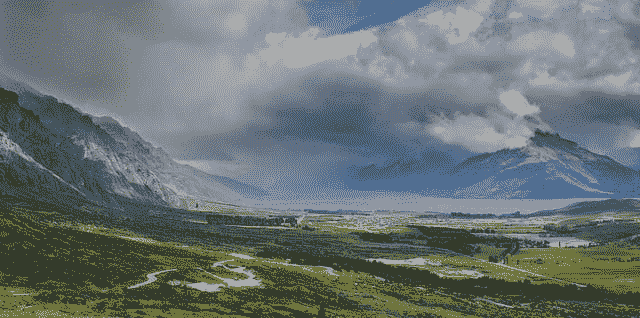

# 轻松介绍 ImageNet 挑战赛(ILSVRC)

> 原文：<https://machinelearningmastery.com/introduction-to-the-imagenet-large-scale-visual-recognition-challenge-ilsvrc/>

最后更新于 2019 年 7 月 5 日

深度学习神经网络技术的普及和使用可以追溯到卷积神经网络应用于图像分类任务的创新。

一些最重要的创新来自学者和行业领袖提交给 *ImageNet 大规模视觉识别挑战赛*或 *ILSVRC* 的参赛作品。ILSVRC 是一年一度的计算机视觉竞赛，是基于一个名为 ImageNet 的公开计算机视觉数据集的子集开发的。因此，任务甚至挑战本身通常被称为 ImageNet 竞赛。

在这篇文章中，您将发现 ImageNet 数据集、ILSVRC 以及由竞赛产生的图像分类中的关键里程碑。

看完这篇文章，你会知道:

*   ImageNet 数据集是一个非常大的人类注释照片集合，由学者设计用于开发计算机视觉算法。
*   ImageNet 大规模视觉识别挑战赛(ILSVRC)是一项年度竞赛，使用 ImageNet 数据集的子集，旨在促进最先进算法的开发和基准测试。
*   ILSVRC 任务已经导致了计算机视觉和深度学习交叉领域的里程碑模型架构和技术。

**用我的新书[计算机视觉深度学习](https://machinelearningmastery.com/deep-learning-for-computer-vision/)启动你的项目**，包括*分步教程*和所有示例的 *Python 源代码*文件。

我们开始吧。

对 ImageNet 和大规模视觉识别挑战的温和介绍
图片由[汤姆·霍尔](https://www.flickr.com/photos/tom_hall_nz/15158418383/)提供，保留部分权利。

## 概观

本教程分为三个部分；它们是:

1.  imagenes 数据集
2.  imageset 大规模视觉识别挑战
3.  来自 ILSVRC 的深度学习里程碑

## imagenes 数据集

[ImageNet](http://www.image-net.org/) 是一个旨在用于计算机视觉研究的带注释照片的大数据集。

开发数据集的目的是提供一种资源，促进计算机视觉改进方法的研究和开发。

> 我们认为，大规模的图像本体是开发先进的、大规模的基于内容的图像搜索和图像理解算法，以及为这些算法提供关键的训练和基准数据的关键资源。

——[ImageNet:大规模分层图像数据库](https://ieeexplore.ieee.org/document/5206848)，2009。

基于[对 ImageNet 主页](http://www.image-net.org/about-stats)上记录的数据集的统计，数据集中有 1400 多万张图像，2.1 万多组或类(*synset*)以及 100 多万张带有边界框注释的图像(例如图像中已识别对象周围的框)。

这些照片由人类使用众包平台(如亚马逊的机械土耳其人)进行注释。

开发和维护数据集的项目是通过普林斯顿、斯坦福和其他美国大学的学者之间的搭配来组织和执行的。

该项目不拥有构成图像的照片；相反，它们属于版权所有者。因此，数据集不是直接分布的；[向数据集](http://www.image-net.org/download-imageurls)中包含的图像提供网址。

## ImageNet 大规模视觉识别挑战

[ImageNet 大规模视觉识别挑战赛](http://www.image-net.org/challenges/LSVRC/)简称 ILSVRC，是一项在 2010 年至 2017 年间举办的年度竞赛，挑战任务使用 ImageNet 数据集的子集。

挑战的目标是既促进更好的计算机视觉技术的发展，又对最先进的技术进行基准测试。

一年一度的挑战集中在“*图像分类*”的多项任务上，包括基于照片中的主要对象为图像分配类别标签，以及涉及定位照片中的对象的“*对象检测*”。

> ILSVRC 注释分为两类之一:(1)二进制标签的图像级注释，用于指示图像中是否存在对象类，[…]以及(2)图像中对象实例周围的紧密边界框和类标签的对象级注释

——[ImageNet 大规模视觉识别挑战赛](https://link.springer.com/article/10.1007/s11263-015-0816-y)，2015 年。

大多数年份的一般挑战任务如下:

*   **图像分类**:预测图像中存在的对象的类别。
*   **单对象定位**:图像分类+围绕每个呈现对象的一个示例绘制一个边界框。
*   **对象检测**:图像分类+在每个出现的对象周围画一个包围盒。

最近，鉴于静态照片技术的发展取得了巨大成功，挑战任务正在转变为更困难的任务，如给视频贴标签。

数据集包括大约 100 万幅图像和 1，000 个对象类。挑战任务中使用的数据集有时是不同的(取决于任务)，并公开发布，以促进学术界和工业界的广泛参与。

对于每个年度挑战，都会发布一个带注释的训练数据集，以及一个未经注释的测试数据集，必须对其进行注释并提交给服务器进行评估。通常，训练数据集由 100 万幅图像组成，其中 50，000 幅用于验证数据集，150，000 幅用于测试集。

> 公开发布的数据集包含一组手动注释的训练图像。还发布了一组测试图像，保留了手动注释。参与者使用训练图像训练他们的算法，然后自动注释测试图像。这些预测的注释被提交给评估服务器。评估结果将在比赛结束时公布

——[ImageNet 大规模视觉识别挑战赛](https://link.springer.com/article/10.1007/s11263-015-0816-y)，2015 年。

在计算机视觉会议的年度研讨会上介绍了结果，以促进成功技术的共享和传播。

尽管您必须注册，但每个年度挑战赛的数据集[仍然可用。](http://www.image-net.org/download-images)

## 来自 ILSVRC 的深度学习里程碑

从事 ILSVRC 任务的研究人员已经将计算机视觉研究的前沿推了回来，描述它们的方法和论文是计算机视觉、深度学习以及更广泛的人工智能领域的里程碑。

ILSVRC 头五年的改进速度是惊人的，甚至可能令计算机视觉领域感到震惊。成功主要是通过图形处理单元(GPU)硬件上的大型(深度)卷积神经网络(CNNs)实现的，这引发了对深度学习的兴趣，深度学习超越了领域，进入了主流。

> 从 ILSVRC2010 到 ILSVRC2014，最先进的精确度有了显著提高，展示了过去五年在大规模对象识别方面取得的巨大进步

——[ImageNet 大规模视觉识别挑战赛](https://link.springer.com/article/10.1007/s11263-015-0816-y)，2015 年。

竞赛前五年 ILSVRC 任务改进总结。
摘自 ImageNet 大规模视觉识别挑战赛，2015。

多年来，该委员会得到了广泛参与，取得了许多重要进展，出版了大量学术出版物。从如此多的工作中挑选里程碑本身就是一个挑战。

尽管如此，仍有一些技术，通常以其母大学、研究小组或公司的名字命名，脱颖而出，成为深度学习和计算机视觉交叉领域的主要内容。描述方法的论文已经成为必读，模型使用的技术已经成为在实践中使用一般技术的启发。

在本节中，我们将重点介绍作为 ILSVRC 的一部分而提出的一些里程碑式的技术，以及介绍这些技术的论文。重点将是图像分类任务。

### ILSVRC-2012 年欧洲足球锦标赛

#### AlexNet(监理)

多伦多大学的 Alex Krizhevsky 等人在 2012 年发表的题为“使用深度卷积神经网络进行图像网络分类”的论文中开发了一种卷积神经网络，该网络在 ILSVRC-2010 和 ILSVRC-2012 图像分类任务中取得了最佳结果。

这些结果激发了人们对计算机视觉深度学习的兴趣。

> ……我们在 ILSVRC-2010 和 ILSVRC-2012 竞赛中使用的 ImageNet 子集上训练了迄今为止最大的卷积神经网络之一，并在这些数据集上取得了迄今为止报告的最佳结果。

——[深度卷积神经网络的 ImageNet 分类](https://papers.nips.cc/paper/4824-imagenet-classification-with-deep-convolutional-neural-networks)，2012。

### ILSVRC-2013 年欧洲足球锦标赛

#### ZFNet(克拉辉)

马修·泽勒和罗布·弗格斯在他们 2013 年的论文《可视化和理解卷积网络》中提出了一种变体 AlexNet，通常被称为 ZFNet，该变体赢得了 ILSVRC-2013 图像分类任务。

### ILSVRC-2014 年欧洲足球锦标赛

#### 《Inception》

来自谷歌的 Christian Szegedy 等人利用其利用初始模块和架构的谷歌网络模型在对象检测方面取得了最佳结果。这种方法在他们 2014 年发表的题为“用盘旋走得更深”的论文中有所描述

> 我们提出了一种深度卷积神经网络架构，代号为Inception，负责在 ImageNet 大规模视觉识别挑战赛 2014 (ILSVRC14)中设置分类和检测的新技术。

——[用回旋更深入](https://arxiv.org/abs/1409.4842)，2014。

#### VGG

牛津视觉几何集团(VGG)的卡伦·西蒙扬和安德鲁·齐塞曼用他们的 VGG 模型在图像分类和定位方面取得了最好的结果。他们的方法在他们 2015 年发表的题为“用于大规模图像识别的非常深的卷积网络”的论文中有所描述

> ……我们提出了明显更精确的 ConvNet 架构，不仅在 ILSVRC 分类和定位任务上实现了最先进的精度，而且还适用于其他图像识别数据集，即使作为相对简单的管道的一部分，它们也能实现出色的性能

——[用于大规模图像识别的超深度卷积网络](https://arxiv.org/abs/1409.1556)，2015。

### ILSVRC-2015 年欧洲足球锦标赛

#### ResNet (MSRA)

来自微软研究院的何等人在他们 2015 年发表的论文《用于图像识别的深度残差学习》中描述了他们的残差网络或 ResNet，在目标检测和带有定位任务的目标检测方面取得了顶级成果

> 这些剩余网的集合在 ImageNet 测试集上实现了 3.57%的误差。这一结果获得了 ILSVRC 2015 分类任务的第一名。

——[图像识别的深度残差学习](https://arxiv.org/abs/1512.03385)，2015。

我错过了一个重要的里程碑吗？
在下面的评论里告诉我。

## 进一步阅读

如果您想更深入地了解这个主题，本节将提供更多资源。

### 报纸

*   [ImageNet:大规模分层图像数据库](https://ieeexplore.ieee.org/document/5206848)，2009。
*   [ImageNet 大规模视觉识别挑战赛](https://link.springer.com/article/10.1007/s11263-015-0816-y)，2015 年。
*   [深度卷积神经网络的 ImageNet 分类](https://papers.nips.cc/paper/4824-imagenet-classification-with-deep-convolutional-neural-networks)，2012。
*   [可视化和理解卷积网络](https://arxiv.org/abs/1311.2901)，2013。
*   [用回旋更深入](https://arxiv.org/abs/1409.4842)，2014。
*   [用于大规模图像识别的超深度卷积网络](https://arxiv.org/abs/1409.1556)，2015。
*   [图像识别的深度残差学习](https://arxiv.org/abs/1512.03385)，2015。

### 文章

*   [ImageNet，维基百科](https://en.wikipedia.org/wiki/ImageNet)。
*   [ImageNet 主页](http://www.image-net.org/)
*   [大规模视觉识别挑战(ILSVRC)主页](http://www.image-net.org/challenges/LSVRC/)
*   [斯坦福视觉实验室](http://vision.stanford.edu/)

## 摘要

在这篇文章中，您发现了 ImageNet 数据集、ILSVRC 竞赛以及由竞赛产生的图像分类中的关键里程碑。

具体来说，您了解到:

*   ImageNet 数据集是一个非常大的人类注释照片集合，由学者设计用于开发计算机视觉算法。
*   ImageNet 大规模视觉识别挑战赛(ILSVRC)是一项年度竞赛，使用 ImageNet 数据集的子集，旨在促进最先进算法的开发和基准测试。
*   ILSVRC 任务已经导致了计算机视觉和深度学习交叉领域的里程碑模型架构和技术。

你有什么问题吗？
在下面的评论中提问，我会尽力回答。