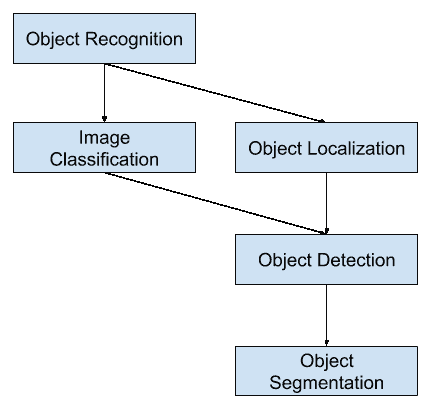
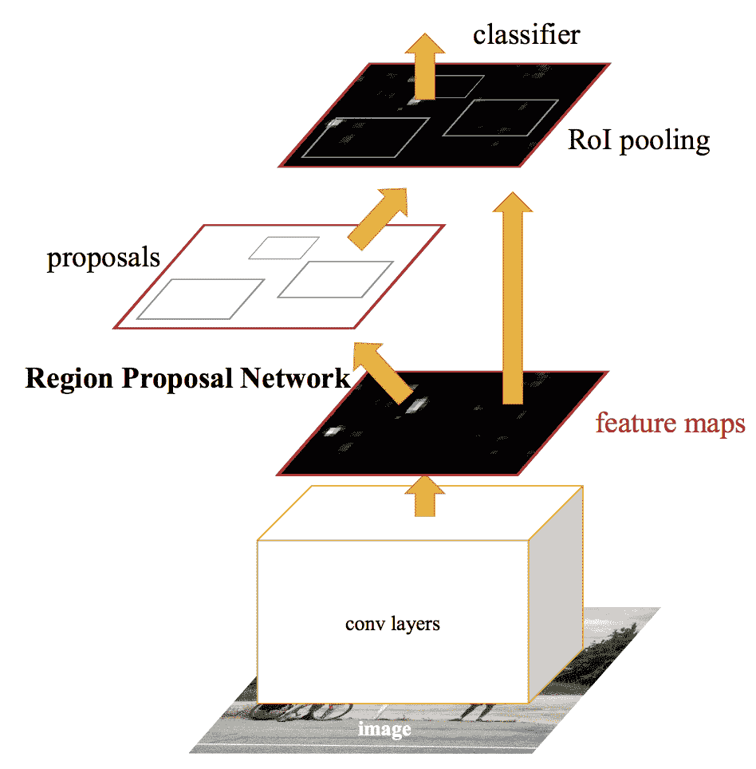
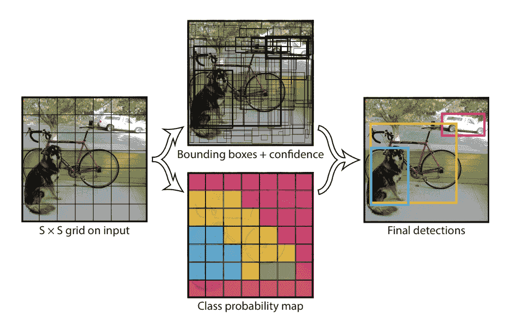
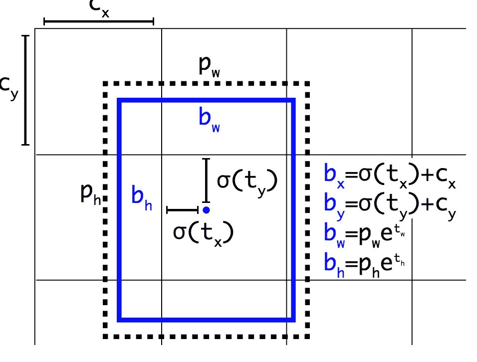

# 深度学习物体识别入门

> 原文：<https://machinelearningmastery.com/object-recognition-with-deep-learning/>

最后更新于 2021 年 1 月 27 日

对于初学者来说，区分不同的相关计算机视觉任务可能很有挑战性。

例如，图像分类是直截了当的，但对象定位和对象检测之间的差异可能会令人困惑，尤其是当这三项任务都可能等同于对象识别时。

图像分类涉及为图像分配类别标签，而对象定位涉及在图像中的一个或多个对象周围绘制边界框。对象检测更具挑战性，它将这两项任务结合起来，在图像中的每个感兴趣的对象周围绘制一个边界框，并为它们分配一个类别标签。所有这些问题统称为目标识别。

在这篇文章中，你会发现一个关于对象识别问题的温和介绍，以及为解决这个问题而设计的最先进的深度学习模型。

看完这篇文章，你会知道:

*   物体识别是指在数码照片中识别物体的相关任务的集合。
*   基于区域的卷积神经网络是一系列解决目标定位和识别任务的技术，是为模型性能而设计的。
*   你只看一次，或 YOLO，是为速度和实时使用而设计的第二类物体识别技术。

**用我的新书[计算机视觉深度学习](https://machinelearningmastery.com/deep-learning-for-computer-vision/)启动你的项目**，包括*分步教程*和所有示例的 *Python 源代码*文件。

我们开始吧。

深度学习物体识别入门
图片由[巴特·艾弗森](https://www.flickr.com/photos/editor/135953989/)提供，版权所有。

## 概观

本教程分为三个部分；它们是:

1.  什么是物体识别？
2.  美国有线电视新闻网模范家庭
3.  YOLO 模范家庭

## 什么是物体识别？

物体识别是一个通用术语，用来描述一系列相关的计算机视觉任务，包括识别数码照片中的物体。

*图像分类*涉及预测图像中一个对象的类别。*物体定位*指的是识别图像中一个或多个物体的位置，并围绕它们的范围绘制丰富的方框。*目标检测*结合这两项任务，对图像中的一个或多个目标进行定位和分类。

当用户或从业者提到“*物体识别*”时，他们通常指的是“*物体检测*”。

> ……我们将广泛使用对象识别这一术语来涵盖图像分类(需要算法来确定图像中存在哪些对象类别的任务)和对象检测(需要算法来定位图像中存在的所有对象的任务

——[ImageNet 大规模视觉识别挑战赛](https://arxiv.org/abs/1409.0575)，2015 年。

因此，我们可以区分这三种计算机视觉任务:

*   **图像分类**:预测图像中物体的类型或类别。
    *   *输入*:单个物体的图像，如照片。
    *   *输出*:一个类标签(例如一个或多个映射到类标签的整数)。
*   **物体定位**:定位图像中物体的存在，并用边框指示其位置。
    *   *输入*:带有一个或多个物体的图像，如照片。
    *   *输出*:一个或多个边界框(例如，由点、宽度和高度定义)。
*   **物体检测**:用边界框定位物体的存在以及图像中被定位物体的类型或类别。
    *   *输入*:带有一个或多个物体的图像，如照片。
    *   *输出*:一个或多个边界框(例如，由点、宽度和高度定义)，以及每个边界框的类别标签。

计算机视觉任务细分的另一个扩展是*对象分割*，也称为“对象实例分割”或“语义分割”，其中通过突出显示对象的特定像素而不是粗略的边界框来指示识别对象的实例。

从这个细分中，我们可以看到对象识别指的是一套具有挑战性的计算机视觉任务。

目标识别计算机视觉任务综述

最近在图像识别问题上的大多数创新都是作为参与 ILSVRC 任务的一部分而出现的。

这是一年一度的学术竞赛，对这三种问题类型中的每一种都有单独的挑战，目的是在每一个层次上培养独立和单独的改进，以便更广泛地利用。例如，见以下摘自 [2015 ILSVRC 综述论文](https://arxiv.org/abs/1409.0575)的三种对应任务类型列表:

*   **图像分类**:算法生成图像中存在的对象类别列表。
*   **单对象定位**:算法生成图像中存在的对象类别列表，以及指示每个对象类别的一个实例的位置和比例的轴对齐边界框。
*   **对象检测**:算法生成图像中存在的对象类别列表，以及指示每个对象类别的每个实例的位置和比例的轴对齐边界框。

我们可以看到“*单目标定位*”是更广泛定义的“*目标定位*”的更简单版本，“将定位任务约束到图像内的一种类型的目标，我们可以假设这是更容易的任务。

下面是一个比较单目标定位和目标检测的例子，摘自 ILSVRC 论文。注意在每种情况下地面真实期望的差异。

单目标定位和目标检测的比较。摘自:ImageNet 大规模视觉识别挑战。

使用预测类别标签上的平均分类误差来评估图像分类模型的性能。使用预期类的预期边界框和预测边界框之间的距离来评估单对象定位模型的性能。而使用图像中已知对象的每个最佳匹配边界框的精度和召回率来评估对象识别模型的性能。

现在我们已经熟悉了对象定位和检测的问题，让我们来看看最近一些表现最好的深度学习模型。

## 美国有线电视新闻网模范家庭

R-CNN 方法家族指的是 R-CNN，它可能代表“*具有 CNN 特征的区域*”或“*基于区域的卷积神经网络*”，由[罗斯·吉尔希克](http://www.rossgirshick.info/)等人开发。

这包括为目标定位和目标识别而设计和演示的技术。

让我们依次仔细看看这些技术的亮点。

### 美国有线电视新闻网

加州大学伯克利分校的罗斯·吉尔西克等人在 2014 年发表的题为“丰富的特征层次结构，用于精确的对象检测和语义分割”的论文中描述了 R-CNN

这可能是卷积神经网络在目标定位、检测和分割问题上的第一次大规模成功应用。该方法在基准数据集上进行了演示，在 VOC-2012 数据集和 200 级 ILSVRC-2013 对象检测数据集上取得了当时最先进的结果。

他们提出的有线电视新闻网模型由三个模块组成；它们是:

*   **模块 1:地区提案**。生成和提取类别无关的区域建议，例如候选边界框。
*   **模块 2:特征提取器**。从每个候选区域提取特征，例如使用深度卷积神经网络。
*   **模块 3:分类器**。将特征分类为已知类别之一，例如线性 SVM 分类器模型。

该模型的架构总结如下图，取自该论文。

美国有线电视新闻网模型体系结构概述从丰富的特征层次中提取，用于精确的对象检测和语义分割。

使用计算机视觉技术来提出图像中潜在对象的候选区域或边界框，称为“*选择性搜索*”，尽管设计的灵活性允许使用其他区域建议算法。

该模型使用的特征提取器是赢得 ILSVRC-2012 图像分类竞赛的 [AlexNet deep CNN](https://en.wikipedia.org/wiki/AlexNet) 。美国有线电视新闻网的输出是一个 4，096 元素的向量，它描述了输入到线性 SVM 分类器的图像内容，具体来说，为每个已知类别训练一个 SVM。

将神经网络应用于目标定位和识别是一种相对简单和直接的方法。这种方法的缺点是速度慢，需要对区域建议算法生成的每个候选区域进行基于 CNN 的特征提取。这是一个问题，因为本文描述的模型在测试时对每个图像大约 2000 个建议区域进行操作。

论文中描述的 Python ( [Caffe](http://caffe.berkeleyvision.org/) )和 MatLab 源代码可在 [R-CNN GitHub 资源库](https://github.com/rbgirshick/rcnn)中获得。

### 美国有线电视新闻网

鉴于 R-CNN 的巨大成功，时任微软研究院的罗斯·吉尔西克(Ross Girshick)在 2015 年发表的一篇题为《[快速 R-CNN](https://arxiv.org/abs/1504.08083) 》的论文中，提出了一个扩展，以解决 R-CNN 的速度问题

本文首先回顾了美国有线电视新闻网的局限性，总结如下:

*   **训练是多阶段流水线**。涉及三个独立模型的准备和操作。
*   **训练在空间和时间上都很昂贵**。在每个图像上训练一个深度 CNN 关于如此多的区域提议是非常慢的。
*   **物体检测缓慢**。利用美国有线电视新闻网对如此多的地区提案进行预测是非常缓慢的。

在 2014 年的论文“[深度卷积网络中用于视觉识别的空间金字塔汇集](https://arxiv.org/abs/1406.4729)”中，提出了一项先前的工作来加速称为空间金字塔汇集网络(SPPnets)的技术这确实加快了特征提取的速度，但本质上使用了一种前向传递缓存算法。

快速 R-CNN 是作为单一模型而不是直接学习和输出区域和分类的管道提出的。

该模型的架构将一组区域建议作为输入拍摄照片，这些建议通过深度卷积神经网络传递。预先训练的美国有线电视新闻网，如 VGG-16，用于特征提取。深度有线电视新闻网的末端是一个称为兴趣区域池层(Pooling Layer)的自定义层，它提取特定于给定输入候选区域的特征。

有线电视新闻网的输出由一个完全连接的层解释，然后模型分成两个输出，一个用于通过 softmax 层的类别预测，另一个具有边界框的线性输出。然后对给定图像中的每个感兴趣区域重复该过程多次。

该模型的架构总结如下图，取自该论文。

快速有线电视新闻网模型架构概述。
摘自:快 R-CNN。

该模型的训练和预测速度要快得多，但仍然需要与每个输入图像一起提出一组候选区域。

论文中描述的用于 Fast R-CNN 的 Python 和 C++ (Caffe)源代码可以在 [GitHub 资源库](https://github.com/rbgirshick/fast-rcnn)中获得。

### 更快

微软研究院的任等人在 2016 年发表的题为《[更快的 R-CNN:利用区域提议网络实现实时目标检测》](https://arxiv.org/abs/1506.01497)的论文中，针对训练和检测的速度进一步改进了模型架构

该架构是在 ILSVRC-2015 和 MS COCO-2015 目标识别和检测竞赛任务中取得第一名成绩的基础。

该架构旨在作为培训过程的一部分提出和完善地区提案，称为地区提案网络(RPN)。然后，这些区域在单个模型设计中与快速反应-有线电视新闻网模型一起使用。这些改进既减少了区域提议的数量，又将模型的测试时间操作加速到接近实时，具有当时最先进的性能。

> ……我们的检测系统在 GPU 上的帧速率为 5fps(包括所有步骤)，同时在 PASCAL VOC 2007、2012 和 MS COCO 数据集上实现了最先进的对象检测精度，每幅图像只有 300 个建议。在 ILSVRC 和 COCO 2015 的比赛中，fast R-CNN 和 RPN 是几个赛道第一名获奖作品的基础

——[更快的 R-CNN:借助区域建议网络实现实时目标检测](https://arxiv.org/abs/1506.01497)，2016 年。

尽管它是一个单一的统一模型，但该体系结构由两个模块组成:

*   **模块 1:区域提案网络**。卷积神经网络，用于提出区域和区域中要考虑的对象类型。
*   **模块 2:快速 R-CNN** 。卷积神经网络，用于从建议区域提取特征，并输出边界框和类别标签。

这两个模块都运行在深度有线电视新闻网的相同输出上。区域建议网络充当快速反应-美国有线电视新闻网网络的关注机制，通知第二个网络在哪里寻找或关注。

该模型的架构总结如下图，取自该论文。

更快的有线电视新闻网模型架构概述。摘自:更快的 R-CNN:使用区域提议网络实现实时目标检测。

RPN 的工作原理是获取预先训练好的深度 CNN(如 VGG-16)的输出，并在特征地图上传递一个小网络，输出多个区域建议和每个区域的类别预测。区域建议是边界框，基于所谓的锚框或预定义的形状，旨在加速和改进区域的建议。类别预测是二进制的，指示对象的存在与否，即所提议区域的所谓“T0”对象。

使用交替训练的过程，其中两个子网络被同时训练，尽管是交错的。这使得特征检测器深度 CNN 中的参数可以同时为这两项任务进行定制或微调。

在撰写本文时，这种 fast R-CNN 架构是该系列模型的巅峰之作，并继续在对象识别任务上取得接近最先进的成果。进一步的扩展增加了对图像分割的支持，如论文 2017 论文“ [Mask R-CNN](https://arxiv.org/abs/1703.06870) ”中所述

论文中描述的用于 Fast R-CNN 的 Python 和 C++ (Caffe)源代码可以在 [GitHub 资源库](https://github.com/rbgirshick/py-faster-rcnn)中获得。

## YOLO 模范家庭

另一个流行的物体识别模型家族被统称为 YOLO 或“你只看一次”，由[约瑟夫·雷德蒙](https://pjreddie.com/)等人开发。

美国有线电视新闻网的模型可能通常更准确，但 YOLO 系列的模型更快，比美国有线电视新闻网快得多，实现了实时目标检测。

### YOLO

约瑟夫·雷德蒙(Joseph Redmon)等人在 2015 年发表的论文《你只看一次: [》中首次描述了 YOLO 模型，该论文名为《统一实时物体检测》](https://arxiv.org/abs/1506.02640)请注意，美国有线电视新闻网的开发者罗斯·吉尔西克也是这部作品的作者和贡献者，当时在[脸书人工智能研究](https://research.fb.com/category/facebook-ai-research/)。

这种方法包括一个单独的神经网络，它被训练成首尾相连，以一张照片作为输入，并直接为每个边界框预测边界框和类标签。该技术提供了较低的预测精度(例如，更多的定位误差)，尽管对于速度优化版本的模型，该技术以每秒 45 帧和高达每秒 155 帧的速度运行。

> 我们的统一架构速度极快。我们的基本 YOLO 模型以每秒 45 帧的速度实时处理图像。一个较小版本的网络，快速 YOLO，每秒处理惊人的 155 帧…

——[你只看一次:统一实时物体检测](https://arxiv.org/abs/1506.02640)，2015。

该模型的工作原理是首先将输入图像分割成单元网格，如果边界框的中心位于单元内，则每个单元负责预测边界框。每个网格单元预测一个包含 x、y 坐标、宽度、高度和置信度的边界框。类别预测也基于每个单元格。

例如，图像可以被分成 7×7 的网格，并且网格中的每个单元可以预测 2 个边界框，从而产生 94 个建议的边界框预测。类别概率图和具有置信度的边界框然后被组合成边界框和类别标签的最终集合。下图总结了模型的两个输出。

YOLO 模型所做预测的摘要。摘自:你只看一次:统一、实时的物体检测

### YOLOv2 (YOLO9000)和 YOLOv3

约瑟夫·雷德蒙(Joseph Redmon)和阿里·法尔哈迪(Ali)在 2016 年发表的论文《YOLO9000:更好、更快、更强》中对该模型进行了更新，以进一步提高模型性能

尽管该模型的这种变体被称为 YOLO v2，但是描述了该模型的一个实例，该实例在两个对象识别数据集上并行训练，能够预测 9000 个对象类别，因此被命名为“ *YOLO9000*

对模型进行了大量的训练和架构更改，例如使用批处理规范化和高分辨率输入图像。

像 fast R-CNN 一样，YOLOv2 模型利用了锚框，这是预定义的边界框，具有在训练过程中定制的有用形状和大小。使用训练数据集上的 k-均值分析对图像的边界框的选择进行预处理。

重要的是，边界框的预测表示被改变，以允许小的改变对预测具有较小的影响，从而产生更稳定的模型。不是直接预测位置和大小，而是预测偏移，用于相对于网格单元移动和整形预定义的锚盒，并由逻辑函数衰减。

预测边界框位置和形状时选择的表示示例摘自:YOLO9000:更好、更快、更强

约瑟夫·雷德蒙和阿里·法尔哈迪在他们 2018 年发表的题为“YOLOv3:增量改进”的论文中提出了对该模型的进一步改进这些改进相当小，包括更深的特征检测器网络和微小的代表性变化。

## 进一步阅读

如果您想更深入地了解这个主题，本节将提供更多资源。

### 报纸

*   [ImageNet 大规模视觉识别挑战赛](https://arxiv.org/abs/1409.0575)，2015 年。

### 美国有线电视新闻网家庭报纸

*   [丰富的特征层次，用于精确的对象检测和语义分割](https://arxiv.org/abs/1311.2524)，2013。
*   [用于视觉识别的深度卷积网络中的空间金字塔池](https://arxiv.org/abs/1406.4729)，2014。
*   [快 R-CNN](https://arxiv.org/abs/1504.08083) ，2015 年。
*   [更快的 R-CNN:使用区域提议网络实现实时目标检测](https://arxiv.org/abs/1506.01497)，2016 年。
*   [口罩 R-CNN](https://arxiv.org/abs/1703.06870) ，2017 年。

### YOLO 家庭文件

*   [你只看一次:统一实时物体检测](https://arxiv.org/abs/1506.02640)，2015。
*   [YOLO9000:更好更快更强](https://arxiv.org/abs/1612.08242)，2016。
*   [YOLOv3:一个增量改进](https://arxiv.org/abs/1804.02767)，2018。

### 代码项目

*   [R-CNN:具有卷积神经网络特征的区域，GitHub](https://github.com/rbgirshick/rcnn) 。
*   [快速 R-CNN，GitHub](https://github.com/rbgirshick/fast-rcnn) 。
*   [更快的 R-CNN Python 代码，GitHub](https://github.com/rbgirshick/py-faster-rcnn) 。
*   yolo，GitHub 。

### 资源

*   [罗斯·吉拉斯克，主页。](http://www.rossgirshick.info/)
*   [Joseph Redmon，主页](https://pjreddie.com/)。
*   [YOLO:实时物体检测，首页](https://pjreddie.com/darknet/yolo/)。

### 文章

*   [图像分割中的 CNN 简史:从 R-CNN 到 Mask R-CNN](https://blog.athelas.com/a-brief-history-of-cnns-in-image-segmentation-from-r-cnn-to-mask-r-cnn-34ea83205de4) ，2017。
*   [假人的物体检测第 3 部分:R-CNN 家族](https://lilianweng.github.io/lil-log/2017/12/31/object-recognition-for-dummies-part-3.html)，2017。
*   [物体检测第 4 部分:快速检测模型](https://lilianweng.github.io/lil-log/2018/12/27/object-detection-part-4.html)，2018。

## 摘要

在这篇文章中，你发现了对对象识别问题的温和介绍，以及为解决这个问题而设计的最先进的深度学习模型。

具体来说，您了解到:

*   物体识别是指在数码照片中识别物体的相关任务的集合。
*   基于区域的卷积神经网络是一系列解决目标定位和识别任务的技术，是为模型性能而设计的。
*   你只看一次，或 YOLO，是为速度和实时使用而设计的第二类物体识别技术。

你有什么问题吗？
在下面的评论中提问，我会尽力回答。