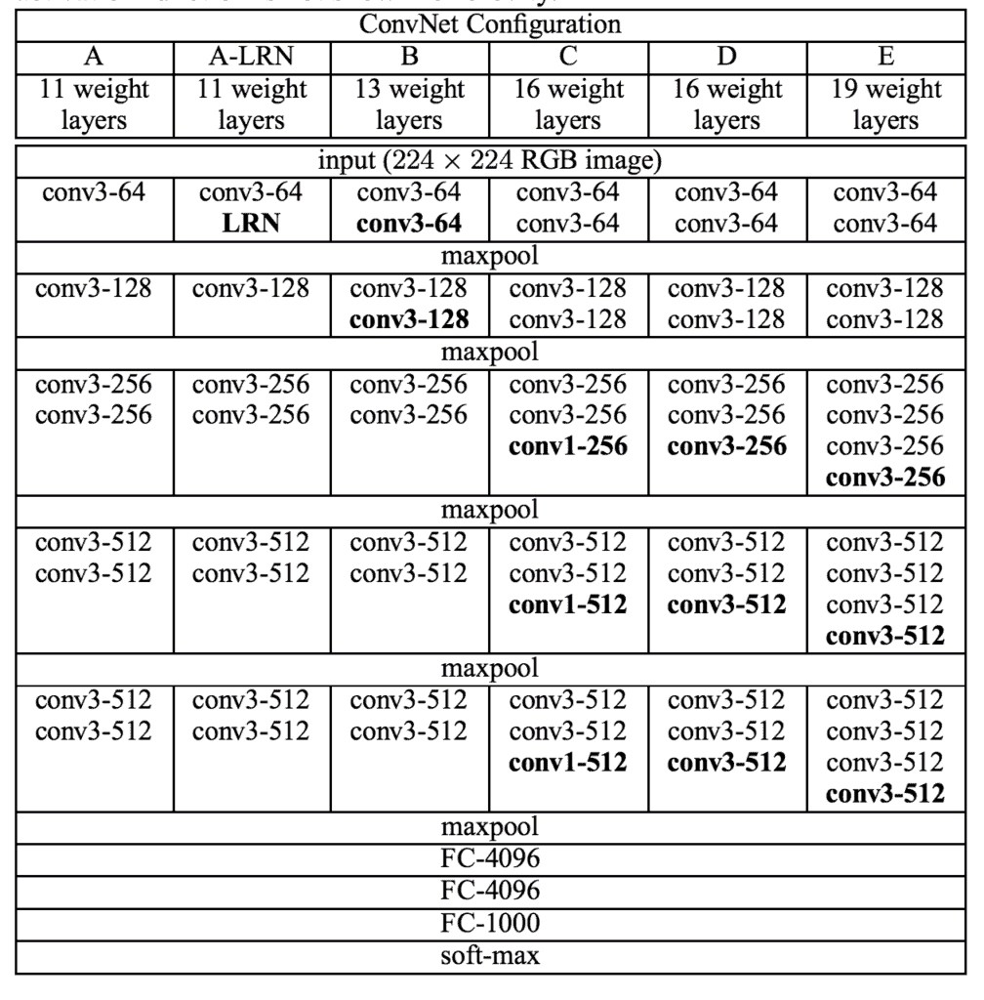
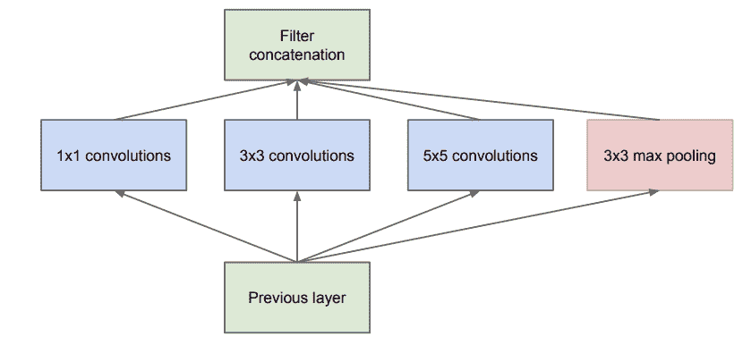
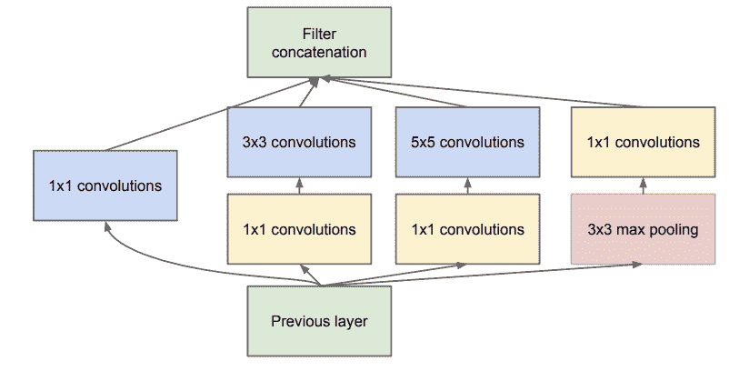

# 用于图像分类的卷积神经网络模型创新

> 原文：<https://machinelearningmastery.com/review-of-architectural-innovations-for-convolutional-neural-networks-for-image-classification/>

最后更新于 2019 年 7 月 5 日

#### 温和地介绍了 LeNet，AlexNet，VGG，盗梦空间和 ResNet 卷积神经网络的创新。

卷积神经网络由两个非常简单的元素组成，即[卷积层](https://machinelearningmastery.com/convolutional-layers-for-deep-learning-neural-networks/)和[汇聚层](https://machinelearningmastery.com/pooling-layers-for-convolutional-neural-networks/)。

尽管很简单，但对于给定的计算机视觉问题，有几乎无限种方法来排列这些层。

幸运的是，既有配置这些层的通用模式，也有可以用来开发深度卷积神经网络的架构创新。研究这些为最先进的图像分类任务开发的架构设计决策，可以为设计自己的深度卷积神经网络模型时如何使用这些设计提供理论基础和直觉。

在本教程中，您将发现卷积神经网络用于挑战图像分类问题的关键架构里程碑。

完成本教程后，您将知道:

*   在实现卷积神经网络时如何对滤波器数量和滤波器大小进行模式化？
*   如何以统一的模式排列卷积层和汇集层，以开发性能良好的模型。
*   如何利用初始模块和剩余模块开发更深层次的卷积网络？

**用我的新书[计算机视觉深度学习](https://machinelearningmastery.com/deep-learning-for-computer-vision/)启动你的项目**，包括*分步教程*和所有示例的 *Python 源代码*文件。

我们开始吧。

*   **2019 年 4 月更新**:修正了 LeNet 的过滤器尺寸说明(感谢黄)。

## 教程概述

本教程分为六个部分；它们是:

1.  CNN的建筑设计
2.  莱内-5
3.  阿勒克斯网
4.  VGG
5.  盗梦空间和谷歌网
6.  剩余网络或资源网

## CNN的建筑设计

卷积神经网络的元素，如卷积层和汇集层，理解起来相对简单。

在实践中使用卷积神经网络的挑战部分是如何设计最好地使用这些简单元素的模型架构。

学习如何设计有效的卷积神经网络体系结构的一个有用方法是研究成功的应用。这一点特别容易做到，因为在 2012 年至 2016 年期间，针对 ImageNet 大规模视觉识别挑战(ILSVRC)对CNN进行了大量研究和应用。这一挑战导致了非常困难的计算机视觉任务在技术水平上的快速进步，以及卷积神经网络模型体系结构的一般创新的发展。

我们将从 LeNet-5 开始，它通常被描述为在 ILSVRC 之前 CNNs 的第一个成功和重要的应用，然后看看为 ILSVRC 开发的卷积神经网络的四个不同的获奖架构创新，即 AlexNet、VGG、盗梦空间和 ResNet。

通过从高层次理解这些里程碑模型及其架构或架构创新，您将对这些架构元素在 CNN 在计算机视觉中的现代应用中的使用形成欣赏，并能够识别和选择可能对您自己的模型设计有用的架构元素。

## 莱内-5

也许卷积神经网络的第一个广为人知的成功应用是 LeNet-5，由 Yann LeCun 等人在 1998 年发表的题为“基于梯度的学习在文档识别中的应用”([获得 PDF](http://yann.lecun.com/exdb/publis/pdf/lecun-01a.pdf) )的论文中进行了描述。

该系统是为手写字符识别问题而开发的，并在 MNIST 标准数据集上进行了演示，实现了大约 99.2%的分类精度(或 0.8%的错误率)。该网络随后被描述为被称为图形转换器网络的更广泛系统中的核心技术。

这是一篇很长的论文，也许最值得关注的部分是第二部分。b .描述 LeNet-5 架构。在本节中，论文将网络描述为七层，输入灰度图像的形状为 32×32，即 MNIST 数据集中图像的大小。

该模型提出了一种卷积层模式，后面是平均汇集层，称为子采样层。在输出要素图被展平并馈送到多个完全连接的图层进行解释和最终预测之前，此模式会重复两次半。论文中提供了网络架构的图片，转载如下。

用于手写字符识别的 LeNet-5 卷积神经网络的结构(取自 1998 年的论文)。

二十多年后的今天，卷积层和汇集层分组在一起并重复的块模式仍然是设计和使用卷积神经网络的常见模式。

有趣的是，该架构使用少量滤镜作为第一隐藏层，具体来说是六个滤镜，每个滤镜的大小为 5×5 像素。在合并(称为子采样层)之后，另一个卷积层具有更多的滤波器，同样具有更小的尺寸，但是比先前的卷积层更小，具体地说，具有 5×5 像素尺寸的 16 个滤波器，再次跟随合并。在这两个卷积和汇集层块的重复中，趋势是过滤器的数量增加。

与现代应用相比，过滤器的数量也很少，但是随着网络的深度增加过滤器数量的趋势也仍然是该技术的现代使用中的常见模式。

特征地图的展平以及通过完全连接的图层对提取的特征进行解释和分类也仍然是当今的常见模式。在现代术语中，体系结构的最后一部分通常被称为分类器，而模型中前面的卷积层和汇集层被称为特征提取器。

我们可以将与现代模型相关的架构的关键方面总结如下:

*   固定大小的输入图像。
*   将卷积层和池层分组为块。
*   体系结构中卷积池块的重复。
*   随着网络的深度增加过滤器的数量。
*   架构中不同的特征提取和分类器部分。

## 阿勒克斯网

这项工作也许可以被认为激发了人们对神经网络的新兴趣，并开始了深度学习在许多计算机视觉应用中的主导地位，这是亚历克斯·克里哲夫斯基等人在 2012 年发表的题为“用深度卷积神经网络进行图像网络分类”的论文

该论文描述了一个后来被称为“阿列克谢网”的模型，旨在解决“T2”图像网大规模视觉识别挑战“T3”或“T4”ILSVRC-2010“T5”竞赛，将物体照片分类为 1000 个不同类别之一。

ILSVRC 是 2011 年至 2016 年举办的竞赛，旨在激励计算机视觉领域的创新。在 AlexNet 开发之前，这项任务被认为非常困难，远远超出了现代计算机视觉方法的能力。AlexNet 成功地展示了卷积神经网络模型在该领域的能力，并点燃了一把火，带来了更多的改进和创新，在随后的几年中，许多人在同一个 ILSVRC 任务上进行了演示。更广泛地说，该论文表明，在不使用当时流行的无监督预处理技术的情况下，为一个具有挑战性的问题开发深度和有效的端到端模型是可能的。

在 AlexNet 的设计中，重要的是一套新的或成功的方法，但在当时没有被广泛采用。现在，它们已经成为使用 CNNs 进行图像分类时的要求。

AlexNet 使用[校正线性激活函数](https://machinelearningmastery.com/rectified-linear-activation-function-for-deep-learning-neural-networks/)，或 ReLU，作为每个卷积层之后的非线性函数，而不是在此之前常见的 S 形函数，如 logistic 或 tanh。此外，在输出层使用了 softmax 激活函数，现在是神经网络多类分类的主要工具。

LeNet-5 中使用的平均池化被最大池化方法取代，尽管在这种情况下，重叠池化被发现优于目前常用的非重叠池化(例如，池化操作的步长与池化操作的步长相同，例如 2 乘 2 像素)。为了解决过拟合问题，在模型的分类器部分的完全连接层之间使用了新提出的[脱落方法](https://machinelearningmastery.com/how-to-reduce-overfitting-with-dropout-regularization-in-keras/)来改善泛化误差。

AlexNet 的体系结构是深入的，并且扩展了 LeNet-5 建立的一些模式。下图，取自论文，总结了模型架构，在这种情况下，分为两个管道，在当时的 GPU 硬件上进行训练。

用于对象照片分类的 AlexNet 卷积神经网络的体系结构(取自 2012 年论文)。

该模型在模型的特征提取部分有五个卷积层，在模型的分类器部分有三个完全连接的层。

输入图像大小固定为 224×224，有三个颜色通道。就每个卷积层中使用的滤波器数量而言，在 LeNet 中看到的随着深度增加滤波器数量的模式基本上得到遵守，在这种情况下，大小为 96、256、384、384 和 256。类似地，使用了随深度减小滤波器(核)大小的模式，从较小的 11×11 开始，减小到 5×5，然后在更深的层中减小到 3×3。现在，使用 5×5 和 3×3 等小型滤波器已成为常态。

在模型的特征检测部分的开始和结束使用了卷积层后跟汇集层的模式。有趣的是，使用了紧接着第二卷积层的卷积层模式。这种模式也成为了现代标准。

该模型通过数据扩充进行训练，人工增加了训练数据集的大小，并使模型有更多的机会在不同方向学习相同的特征。

我们可以将与现代模型相关的架构的关键方面总结如下:

*   卷积层之后使用 ReLU 激活函数，输出层使用 softmax。
*   使用最大池而不是平均池。
*   在完全连接的层之间使用 Dropout 正则化。
*   卷积层的模式直接馈送到另一个卷积层。
*   数据扩充的使用。

## VGG

用于计算机视觉任务的深度卷积神经网络的发展似乎是 AlexNet 之后的一种黑暗艺术。

一项旨在实现深度卷积网络架构设计标准化并在此过程中开发更深入、性能更好的模型的重要工作是卡伦·西蒙扬和安德鲁·齐泽曼在 2014 年发表的题为“用于大规模图像识别的非常深卷积网络”的论文。

他们的建筑通常被称为 VGG，以他们的实验室牛津视觉几何小组的名字命名。他们的模型是在 sameILSVRC 竞赛上开发和演示的，在本例中，是 [ILSVRC-2014](http://www.robots.ox.ac.uk/~vgg/) 版本的挑战赛。

成为事实标准的第一个重要区别是使用了大量小型过滤器。具体来说，3×3 和 1×1 的滤波器，步长为 1，不同于 LeNet-5 中的大尺寸滤波器和 AlexNet 中较小但仍然相对较大的滤波器以及 4 的[大步长](https://machinelearningmastery.com/padding-and-stride-for-convolutional-neural-networks/)。

借鉴 AlexNet 中的示例，最大池层在卷积层之后使用，但不是全部，然而所有池都以 2×2 的大小和相同的步长执行，这也已经成为事实上的标准。具体来说，在使用最大池层之前，VGG 网络使用堆叠在一起的两个、三个甚至四个卷积层的例子。其原理是，具有较小滤波器的堆叠卷积层近似于具有较大尺寸滤波器的一个卷积层的效果，例如，具有 3×3 滤波器的三个堆叠卷积层近似于具有 7×7 滤波器的一个卷积层。

另一个重要的区别是使用了大量的过滤器。过滤器的数量随着模型的深度而增加，尽管从相对较多的 64 个过滤器开始，并在模型的特征提取部分结束时增加到 128 个、256 个和 512 个过滤器。

开发和评估了该体系结构的多种变体，尽管考虑到它们的性能和深度，最常提到的是两种。它们是根据层数命名的:VGG 16 层和 VGG 19 层分别代表 16 层和 19 层。

下面是一张取自报纸的表格；请注意，最右边的两列显示了 VGG-16 和 VGG-19 架构版本中使用的配置(过滤器数量)。

用于对象照片分类的 VGG 卷积神经网络的体系结构(取自 2014 年论文)。

一般来说，VGG 模型中的设计决策已经成为简单直接使用卷积神经网络的起点。

最后，VGG 的工作是第一批在许可许可下发布有价值的模型权重的工作之一，这导致了深度学习计算机视觉研究人员的趋势。这反过来又导致像 VGG 这样的预训练模型在转移学习中被大量使用，作为新的计算机视觉任务的起点。

我们可以将与现代模型相关的架构的关键方面总结如下:

*   使用非常小的卷积滤波器，例如 3×3 和 1×1，步长为 1。
*   使用最大池，大小为 2×2，步长相同。
*   在使用汇集层定义块之前，将卷积层堆叠在一起的重要性。
*   卷积池块模式的戏剧性重复。
*   开发非常深的(16 层和 19 层)模型。

## 盗梦空间和谷歌网

克里斯蒂安·塞格迪(Christian Szegedy)等人在 2015 年的论文中提出了卷积层使用方面的重要创新，该论文的标题为“利用卷积进行更深入的研究”

在这篇论文中，作者提出了一个被称为初始(或称初始 v1，以区别于扩展)的架构，以及一个被称为 GoogLeNet 的特定模型，该模型在 2014 年版本的 ILSVRC 挑战赛中取得了最好的结果。

初始模型的关键创新被称为初始模块。这是一组并行卷积层，具有不同大小的滤波器(例如 1×1、3×3、5×5)和一个 3×3 最大汇集层，然后将它们的结果连接起来。以下是摘自论文的初始模块示例。

天真初始模块的例子(摘自 2015 年的论文)。

初始模型的天真实现的一个问题是过滤器(深度或通道)的数量开始快速增加，尤其是当初始模块被堆叠时。

在大量滤波器上执行具有较大滤波器尺寸(例如 3 和 5)的卷积在计算上可能是昂贵的。为了解决这个问题，使用 1×1 卷积层来减少初始模型中的滤波器数量。特别是在 3×3 和 5×5 卷积层之前和汇集层之后。下面这张来自论文的图片展示了对初始模块的这一改变。

降维初始模块示例(摘自 2015 年的论文)。

初始模型中第二个重要的设计决策是连接模型中不同点的输出。这是通过从主网络创建小的离拍输出网络来实现的，这些网络被训练来进行预测。目的是在深度模型的不同点提供来自分类任务的额外误差信号，以便解决消失梯度问题。这些小的输出网络在训练后被移除。

下图显示了 GoogLeNet 模型架构的旋转版本(从左到右为输入到输出)，该模型取自论文，使用了从左侧输入到右侧输出分类的盗梦空间模块以及仅在培训期间使用的两个额外的输出网络。

在对象照片分类训练期间使用的谷歌网络模型的架构(取自 2015 年的论文)。

有趣的是，在模型的特征提取部分的末尾，在模型的分类器部分之前，使用了重叠最大池化，并且使用了大平均池化操作。

我们可以将与现代模型相关的架构的关键方面总结如下:

*   初始模块的开发和重复。
*   大量使用 1×1 卷积来减少通道数量。
*   在网络中的多个点使用错误反馈。
*   非常深(22 层)模型的开发。
*   模型输出使用全球平均池。

## 剩余网络或资源网

我们将回顾的卷积神经网络的最后一个重要创新是何等人在 2016 年发表的题为“用于图像识别的深度残差学习”的论文中提出的

在这篇论文中，作者提出了一个非常深入的模型，称为残差网络，简称 ResNet，它的一个例子在 2015 年版本的 ILSVRC 挑战中取得了成功。

他们的模型有令人印象深刻的 152 层。模型设计的关键是利用快捷连接的剩余块的思想。这些只是网络架构中的连接，其中输入保持原样(不加权)并传递到更深的层，例如跳过下一层。

残余块是具有 ReLU 激活的两个卷积层的模式，其中块的输出与块的输入相结合，例如快捷方式连接。如果块的输入形状不同于块的输出，则通过 1×1 使用输入的投影版本，即所谓的 1×1 卷积。与未加权或相同的快捷方式连接相比，这些被称为投影快捷方式连接。

作者从他们所谓的简单网络开始，这是一个受 VGG 启发的深度卷积神经网络，具有小滤波器(3×3)，分组卷积层之后没有池化，以及在模型的特征检测器部分末端的平均池化，在具有 softmax 激活函数的完全连接输出层之前。

通过添加快捷连接来定义剩余块，将普通网络修改为剩余网络。通常，快捷方式连接的输入形状与剩余块的输出大小相同。

下图取自论文，从左到右比较了 VGG 模型、普通卷积模型和带有残差模块的普通卷积版本(称为残差网络)的体系结构。

物体照片分类剩余网络的结构(取自 2016 年论文)。

我们可以将与现代模型相关的架构的关键方面总结如下:

*   快捷连接的使用。
*   残余区块的开发和重复。
*   非常深(152 层)模型的开发。

## 进一步阅读

如果您想更深入地了解这个主题，本节将提供更多资源。

### 报纸

*   [基于梯度的学习应用于文档识别](https://ieeexplore.ieee.org/abstract/document/726791)，( [PDF](http://yann.lecun.com/exdb/publis/pdf/lecun-01a.pdf) ) 1998。
*   [深度卷积神经网络的 ImageNet 分类](http://papers.nips.cc/paper/4824-imagenet-classification-with-deep-convolutional-neural-networks)，2012。
*   [用于大规模图像识别的超深度卷积网络](https://arxiv.org/abs/1409.1556)，2014。
*   [用回旋更深入](https://www.cv-foundation.org/openaccess/content_cvpr_2015/html/Szegedy_Going_Deeper_With_2015_CVPR_paper.html)，2015。
*   [图像识别的深度残差学习](https://www.cv-foundation.org/openaccess/content_cvpr_2016/html/He_Deep_Residual_Learning_CVPR_2016_paper.html)，2016

### 应用程序接口

*   [Keras 应用程序接口](https://keras.io/applications/)

### 文章

*   [你需要了解的 9 篇深度学习论文](https://adeshpande3.github.io/The-9-Deep-Learning-Papers-You-Need-To-Know-About.html)
*   [盗梦空间网络版本简单指南](https://towardsdatascience.com/a-simple-guide-to-the-versions-of-the-inception-network-7fc52b863202)，2018 年。
*   [CNN 架构:LeNet、AlexNet、VGG、GoogLeNet、ResNet 等。](https://medium.com/@sidereal/cnns-architectures-lenet-alexnet-vgg-googlenet-resnet-and-more-666091488df5)，2017 年。

### 摘要

在本教程中，您发现了使用卷积神经网络挑战图像分类的关键架构里程碑。

具体来说，您了解到:

*   在实现卷积神经网络时如何对滤波器数量和滤波器大小进行模式化？
*   如何以统一的模式排列卷积层和汇集层，以开发性能良好的模型。
*   如何利用初始模块和剩余模块开发更深层次的卷积网络？

你有什么问题吗？
在下面的评论中提问，我会尽力回答。