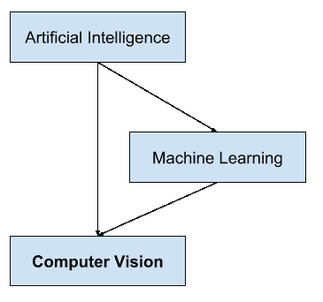

# 计算机视觉入门

> 原文:[https://machinelearningmastery.com/what-is-computer-vision/](https://machinelearningmastery.com/what-is-computer-vision/)

最后更新于 2019 年 7 月 5 日

计算机视觉，通常缩写为 CV，被定义为寻求开发技术来帮助计算机“看到”和理解照片和视频等数字图像内容的研究领域。

计算机视觉的问题看起来很简单，因为它很容易被人们解决，即使是很小的孩子。然而，这在很大程度上仍然是一个未解决的问题，既因为对生物视觉的有限理解，也因为在动态和几乎无限变化的物理世界中视觉感知的复杂性。

在这篇文章中，你会发现对计算机视觉领域的温和介绍。

看完这篇文章，你会知道:

*   计算机视觉领域的目标及其与图像处理的区别。
*   是什么让计算机视觉的问题具有挑战性。
*   计算机视觉中的典型问题或任务。

**用我的新书[计算机视觉深度学习](https://machinelearningmastery.com/deep-learning-for-computer-vision/)启动你的项目**，包括*分步教程*和所有示例的 *Python 源代码*文件。

我们开始吧。

《计算机视觉入门》摄影:阿克塞尔·克里斯汀森，版权所有。

## 概观

本教程分为四个部分；它们是:

1.  对电脑的渴望
2.  什么是计算机视觉
3.  计算机视觉的挑战
4.  计算机视觉中的任务

## 对电脑的渴望

我们被图像淹没了。

智能手机有摄像头，拍摄照片或视频并分享从未像现在这样容易，这导致了像 Instagram 这样的现代社交网络令人难以置信的增长。

YouTube 可能是第二大搜索引擎，每分钟上传数百个小时的视频，每天观看数十亿个视频。

互联网由文本和图像组成。索引和搜索文本相对简单，但是为了索引和搜索图像，算法需要知道图像包含什么。很长一段时间以来，图像和视频的内容一直是不透明的，最好用上传者提供的元描述来描述。

为了最大限度地利用图像数据，我们需要计算机“T0”看到一幅图像并理解其内容。

这对于一个人类，甚至是年幼的孩子来说，都是一个微不足道的问题。

*   一个人可以描述自己曾经看过的照片的内容。
*   一个人可以总结自己只看过一次的视频。
*   一个人可以认出一张他们以前只见过一次的脸。

为了解锁我们的图像和视频，我们至少需要计算机具有相同的功能。

## 什么是计算机视觉？

计算机视觉是一个专注于帮助计算机视觉的研究领域。

> 在抽象的层面上，计算机视觉问题的目标是使用观察到的图像数据来推断世界的一些事情。

—第 83 页，[计算机视觉:模型、学习和推理](https://amzn.to/2rxrdOF)，2012 年。

这是一个多学科领域，可以广泛地称为人工智能和机器学习的一个子领域，它可能涉及使用专门的方法和使用一般的学习算法。

人工智能与计算机视觉关系综述

作为一个多学科的研究领域，它可能看起来很混乱，技术是从一系列不同的工程和计算机科学领域借用和重用的。

视觉中的一个特定问题可以通过手工统计方法轻松解决，而另一个问题可能需要大量复杂的通用机器学习算法。

> 计算机视觉作为一个领域是一个智力前沿。像任何前沿领域一样，它令人兴奋且无组织，通常没有可靠的权威可以求助。很多有用的想法没有理论基础，有些理论在实践中毫无用处；发达地区分布很广，往往一个看起来完全无法从另一个到达。

—第十七页，[计算机视觉:现代方法](https://amzn.to/2rv7AqJ)，2002 年。

计算机视觉的目标是理解数字图像的内容。典型地，这包括开发尝试再现人类视觉能力的方法。

理解数字图像的内容可能涉及从图像中提取描述，该描述可以是对象、文本描述、三维模型等等。

> 计算机视觉是从图像中自动提取信息。信息可以是任何东西，从三维模型、相机位置、物体检测和识别到图像内容的分组和搜索。

—第九页，[用 Python 编程计算机视觉](https://amzn.to/2QKTaAL)，2012。

### 计算机视觉和图像处理

计算机视觉不同于图像处理。

[图像处理](https://en.wikipedia.org/wiki/Digital_image_processing)是从现有图像创建新图像的过程，通常以某种方式简化或增强内容。它是一种数字信号处理，与理解图像内容无关。

给定的计算机视觉系统可能需要将图像处理应用于原始输入，例如预处理图像。

图像处理的例子包括:

*   规范化图像的光度特性，如亮度或颜色。
*   裁剪图像的边界，例如将照片中的对象居中。
*   从图像中去除数字噪声，例如来自低亮度的数字伪像。

## 计算机视觉的挑战

事实证明，帮助计算机看东西是非常困难的。

> 计算机视觉的目标是从图像中提取有用的信息。事实证明，这是一项令人惊讶的挑战性任务；在过去的四十年里，它占据了成千上万的智慧和创造性的头脑，尽管如此，我们仍然远远不能建造一台通用的“视觉机器”。

—第 16 页，[计算机视觉:模型、学习和推理](https://amzn.to/2rxrdOF)，2012 年。

计算机视觉似乎很容易，也许是因为它对人类来说太容易了。

最初，人们认为这是一个简单的问题，学生可以通过将相机连接到计算机来解决。经过几十年的研究，“计算机视觉”仍未解决，至少在满足人类视觉能力方面。

> 人工智能领域的顶尖专家认为，让计算机看起来像 60 年代一个暑期学生项目的难度。40 年过去了，这个任务仍然没有解决，而且似乎很艰巨。

—Xi 页，[计算机视觉中的多视图几何](https://amzn.to/2LfHLE8)，2004。

一个原因是我们对人类视觉是如何工作的没有很强的把握。

研究生物视觉需要理解像眼睛这样的感知器官，以及对大脑内感知的解释。在绘制过程图表和发现系统使用的技巧和捷径方面都取得了很大进展，尽管像任何涉及大脑的研究一样，还有很长的路要走。

> 感知心理学家花了几十年时间试图理解视觉系统是如何工作的，尽管他们可以设计出视错觉来梳理其一些原理，但这个难题的完整解决方案仍然难以捉摸

—第 3 页，[计算机视觉:算法与应用](https://amzn.to/2LcIt4J)，2010。

这是一个如此具有挑战性的问题的另一个原因是视觉世界固有的复杂性。

给定的对象可以从任何方向、任何照明条件、任何类型的与其他对象的遮挡等被看到。一个真正的视觉系统必须能够在无限多的场景中的任何一个场景中“看到”*，并且仍然提取有意义的东西。*

 *计算机能很好地解决严格约束的问题，而不是像视觉那样开放无界的问题。

## 计算机视觉中的任务

然而，该领域已经取得了进展，特别是近年来在照相机和智能手机中用于光学字符识别和人脸检测的商品系统方面。

> 计算机视觉正处于发展的非常时期。这门学科自 20 世纪 60 年代就已经存在，但直到最近才有可能利用计算机视觉的思想来构建有用的计算机系统。

—第十八页，[计算机视觉:现代方法](https://amzn.to/2rv7AqJ)，2002 年。

2010 年的计算机视觉教科书名为“[计算机视觉:算法和应用”](https://amzn.to/2LcIt4J)”列出了一些我们已经看到计算机视觉成功的高级问题。

*   光学字符识别
*   机器检查
*   零售(如自动结账)
*   三维建模(摄影测量)
*   医学成像
*   汽车安全
*   匹配移动(例如，将 CGI 与电影中的现场演员合并)
*   动作捕捉(mocap)
*   监督
*   指纹识别和生物识别

这是一个广泛的研究领域，有许多专门的任务和技术，以及针对应用领域的专门化。

> 计算机视觉有各种各样的应用，既有旧的(例如，移动机器人导航、工业检测和军事智能)，也有新的(例如，人机交互、数字图书馆中的图像检索、医学图像分析以及计算机图形学中合成场景的逼真渲染)。

—第十七页，[计算机视觉:现代方法](https://amzn.to/2rv7AqJ)，2002 年。

鉴于有大量公开的数码照片和视频，放大一些你可能会遇到或感兴趣解决的更简单的计算机视觉任务可能会有所帮助。

许多流行的计算机视觉应用包括试图识别照片中的事物；例如:

*   **物体分类**:这张照片中物体的大类是什么？
*   **物体识别**:这张照片中给定的物体是哪种类型的？
*   **物体验证**:是照片中的物体吗？
*   **物体检测**:照片中的物体在哪里？
*   **物体地标检测**:照片中物体的关键点是什么？
*   **物体分割**:图像中物体属于什么像素？
*   **物体识别**:这张照片里有什么物体，在哪里？

其他常见的例子与信息检索有关；例如:查找像图像这样的图像或包含对象的图像。

## 进一步阅读

如果您想更深入地了解这个主题，本节将提供更多资源。

### 书

*   [计算机视觉:模型、学习和推理](https://amzn.to/2rxrdOF)，2012 年。
*   [用 Python 编程计算机视觉](https://amzn.to/2QKTaAL)，2012。
*   [计算机视觉中的多视图几何](https://amzn.to/2LfHLE8)，2004。
*   [计算机视觉:算法与应用](https://amzn.to/2LcIt4J)，2010。
*   [计算机视觉:现代方法](https://amzn.to/2rv7AqJ)，2002。

### 文章

*   [计算机视觉，维基百科](https://en.wikipedia.org/wiki/Computer_vision)。
*   [机器视觉，维基百科](https://en.wikipedia.org/wiki/Machine_vision)。
*   [数字图像处理，维基百科](https://en.wikipedia.org/wiki/Digital_image_processing)。

## 摘要

在这篇文章中，你发现了对计算机视觉领域的温和介绍。

具体来说，您了解到:

*   计算机视觉领域的目标及其与图像处理的区别。
*   是什么让计算机视觉的问题具有挑战性。
*   计算机视觉中的典型问题或任务。

你有什么问题吗？
在下面的评论中提问，我会尽力回答。*