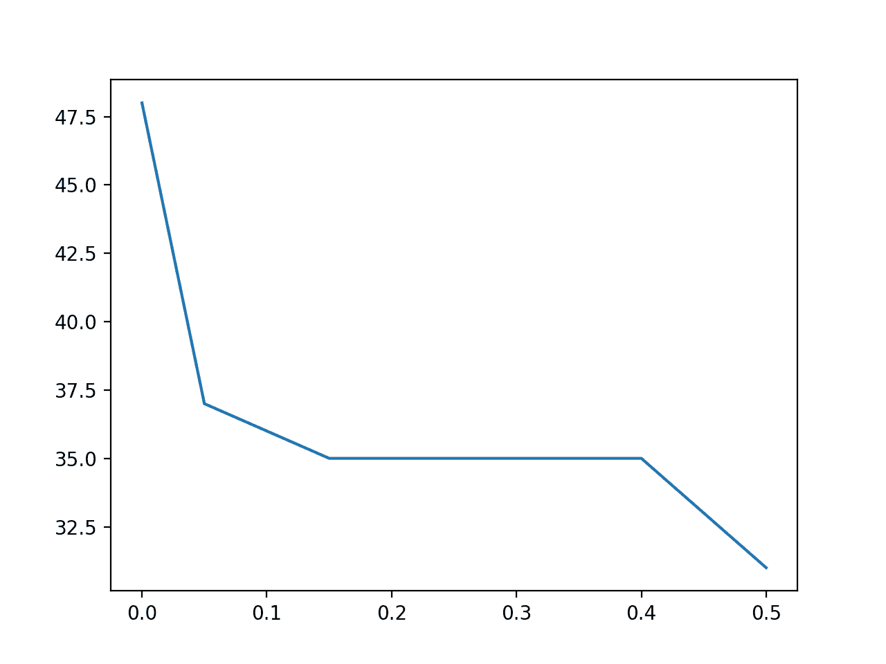

# 如何用 Python 进行机器学习的数据清洗

> 原文：<https://machinelearningmastery.com/basic-data-cleaning-for-machine-learning/>

最后更新于 2020 年 6 月 30 日

**数据清理**是任何机器学习项目中至关重要的一步。

在表格数据中，有许多不同的统计分析和数据可视化技术可用于浏览数据，以确定您可能想要执行的数据清理操作。

在跳到复杂的方法之前，您可能应该在每个机器学习项目中执行一些非常基本的数据清理操作。这些是如此基本，以至于它们经常被经验丰富的机器学习从业者所忽视，但又是如此关键，以至于如果跳过，模型可能会崩溃或报告过于乐观的表现结果。

在本教程中，您将发现应该始终对数据集执行的基本数据清理。

完成本教程后，您将知道:

*   如何识别和移除只有一个值的列变量？
*   如何识别和考虑唯一值很少的列变量？
*   如何识别和删除包含重复观察的行？

**用我的新书[机器学习的数据准备](https://machinelearningmastery.com/data-preparation-for-machine-learning/)启动你的项目**，包括*分步教程*和所有示例的 *Python 源代码*文件。

我们开始吧。

*   **2020 年 4 月更新**:增加了数据集和变量阈值部分。
*   **2020 年 5 月更新**:增加了引用和书籍参考。


机器学习中必须执行的基本数据清理
图片由[艾伦·麦格雷戈](https://flickr.com/photos/allenmcgregor/5322599282/)提供，保留部分权利。

## 教程概述

本教程分为七个部分；它们是:

1.  杂乱的数据集
2.  标识包含单个值的列
3.  删除包含单个值的列
4.  考虑值很少的列
5.  删除差异较小的列
6.  识别包含重复数据的行
7.  删除包含重复数据的行

## 杂乱的数据集

数据清理是指识别和纠正数据集中可能对预测模型产生负面影响的错误。

> 数据清理是指检测和修复数据中错误的各种任务和活动。

—第十三页，[数据清理](https://amzn.to/2SARxFG)，2019。

尽管数据清理至关重要，但它并不令人兴奋，也不涉及花哨的技术。只是对数据集有很好的了解。

> 清理数据并不是最有魅力的任务，但却是数据争论的重要部分。[……]知道如何正确地清理和组合数据将使您与您所在领域的其他人相距甚远。

—第 149 页，[与 Python 的数据角力](https://amzn.to/35DoLcU)，2016。

数据集中存在多种类型的错误，尽管一些最简单的错误包括不包含太多信息的列和重复的行。

在我们深入识别和纠正混乱的数据之前，让我们定义一些混乱的数据集。

我们将使用两个数据集作为本教程的基础，**溢油数据集**和**鸢尾花数据集**。

### 溢油数据集

所谓的“[溢油](https://machinelearningmastery.com/imbalanced-classification-model-to-detect-oil-spills/)”数据集是标准的机器学习数据集。

该任务包括预测该区块是否含有石油泄漏，例如，非法或意外倾倒在海洋中的石油，给出一个矢量，描述一个卫星图像区块的内容。

有 937 例。每个案例由 48 个数字计算机视觉衍生特征、一个补丁编号和一个类别标签组成。

正常情况下，没有溢油被指定为 0 级标签，而溢油被指定为 1 级标签。无溢油 896 例，溢油 41 例。

您可以在这里访问整个数据集:

*   [溢油数据集(溢油 csv)](https://raw.githubusercontent.com/jbrownlee/Datasets/master/oil-spill.csv)
*   [溢油数据集描述(溢油名称)](https://raw.githubusercontent.com/jbrownlee/Datasets/master/oil-spill.names)

查看文件的内容。

文件的前几行应该如下所示:

```py
1,2558,1506.09,456.63,90,6395000,40.88,7.89,29780,0.19,214.7,0.21,0.26,0.49,0.1,0.4,99.59,32.19,1.84,0.16,0.2,87.65,0,0.47,132.78,-0.01,3.78,0.22,3.2,-3.71,-0.18,2.19,0,2.19,310,16110,0,138.68,89,69,2850,1000,763.16,135.46,3.73,0,33243.19,65.74,7.95,1
2,22325,79.11,841.03,180,55812500,51.11,1.21,61900,0.02,901.7,0.02,0.03,0.11,0.01,0.11,6058.23,4061.15,2.3,0.02,0.02,87.65,0,0.58,132.78,-0.01,3.78,0.84,7.09,-2.21,0,0,0,0,704,40140,0,68.65,89,69,5750,11500,9593.48,1648.8,0.6,0,51572.04,65.73,6.26,0
3,115,1449.85,608.43,88,287500,40.42,7.34,3340,0.18,86.1,0.21,0.32,0.5,0.17,0.34,71.2,16.73,1.82,0.19,0.29,87.65,0,0.46,132.78,-0.01,3.78,0.7,4.79,-3.36,-0.23,1.95,0,1.95,29,1530,0.01,38.8,89,69,1400,250,150,45.13,9.33,1,31692.84,65.81,7.84,1
4,1201,1562.53,295.65,66,3002500,42.4,7.97,18030,0.19,166.5,0.21,0.26,0.48,0.1,0.38,120.22,33.47,1.91,0.16,0.21,87.65,0,0.48,132.78,-0.01,3.78,0.84,6.78,-3.54,-0.33,2.2,0,2.2,183,10080,0,108.27,89,69,6041.52,761.58,453.21,144.97,13.33,1,37696.21,65.67,8.07,1
5,312,950.27,440.86,37,780000,41.43,7.03,3350,0.17,232.8,0.15,0.19,0.35,0.09,0.26,289.19,48.68,1.86,0.13,0.16,87.65,0,0.47,132.78,-0.01,3.78,0.02,2.28,-3.44,-0.44,2.19,0,2.19,45,2340,0,14.39,89,69,1320.04,710.63,512.54,109.16,2.58,0,29038.17,65.66,7.35,0
...
```

我们可以看到第一列包含补丁号的整数。我们还可以看到，计算机视觉导出的特征是实值的，具有不同的比例，例如第二列中的千分之一和其他列中的分数。

此数据集包含的列具有非常少的唯一值，这为数据清理提供了良好的基础。

### 鸢尾花数据集

所谓的“鸢尾花”数据集是另一个标准的机器学习数据集。

该数据集包括预测花的种类，给出鸢尾花的厘米测量值。

这是一个多类分类问题。每个班级的观察人数是平衡的。有 150 个观测值，4 个输入变量和 1 个输出变量。

您可以在这里访问整个数据集:

*   [鸢尾花数据集(iris.csv)](https://raw.githubusercontent.com/jbrownlee/Datasets/master/iris.csv)
*   [鸢尾花数据集描述(鸢尾.名称)](https://raw.githubusercontent.com/jbrownlee/Datasets/master/iris.names)

查看文件的内容。

文件的前几行应该如下所示:

```py
5.1,3.5,1.4,0.2,Iris-setosa
4.9,3.0,1.4,0.2,Iris-setosa
4.7,3.2,1.3,0.2,Iris-setosa
4.6,3.1,1.5,0.2,Iris-setosa
5.0,3.6,1.4,0.2,Iris-setosa
...
```

我们可以看到，所有四个输入变量都是数字，目标类变量是代表鸢尾花种类的字符串。

此数据集包含重复的行，这为数据清理提供了良好的基础。

## 标识包含单个值的列

只有一个观察值或值的列可能对建模没有用。

这些列或预测因子被称为零方差预测因子，就好像我们测量了方差(均值的平均值)，它将为零。

> 当一个预测值包含单个值时，我们称之为零方差预测值，因为预测值确实没有变化。

—第 96 页，[特征工程与选择](https://amzn.to/2Yvcupn)，2019。

这里，单个值意味着该列的每一行都有相同的值。例如，列 *X1* 对于数据集中的所有行都具有值 1.0:

```py
X1
1.0
1.0
1.0
1.0
1.0
...
```

所有行只有一个值的列不包含任何建模信息。

根据数据准备和建模算法的选择，具有单一值的变量也会导致错误或意外结果。

您可以使用 [unique() NumPy 函数](https://docs.scipy.org/doc/numpy/reference/generated/numpy.unique.html)检测具有此属性的行，该函数将报告每列中唯一值的数量。

以下示例加载了包含 50 个变量的溢油类别数据集，并总结了每列的唯一值的数量。

```py
# summarize the number of unique values for each column using numpy
from urllib.request import urlopen
from numpy import loadtxt
from numpy import unique
# define the location of the dataset
path = 'https://raw.githubusercontent.com/jbrownlee/Datasets/master/oil-spill.csv'
# load the dataset
data = loadtxt(urlopen(path), delimiter=',')
# summarize the number of unique values in each column
for i in range(data.shape[1]):
	print(i, len(unique(data[:, i])))
```

运行该示例直接从 URL 加载数据集，并为每列打印唯一值的数量。

我们可以看到，列索引 22 只有一个值，应该删除。

```py
0 238
1 297
2 927
3 933
4 179
5 375
6 820
7 618
8 561
9 57
10 577
11 59
12 73
13 107
14 53
15 91
16 893
17 810
18 170
19 53
20 68
21 9
22 1
23 92
24 9
25 8
26 9
27 308
28 447
29 392
30 107
31 42
32 4
33 45
34 141
35 110
36 3
37 758
38 9
39 9
40 388
41 220
42 644
43 649
44 499
45 2
46 937
47 169
48 286
49 2
```

一个更简单的方法是使用 [nunique() Pandas 函数](https://pandas.pydata.org/pandas-docs/stable/reference/api/pandas.DataFrame.nunique.html)，它为你做艰苦的工作。

下面是使用熊猫函数的同一个例子。

```py
# summarize the number of unique values for each column using numpy
from pandas import read_csv
# define the location of the dataset
path = 'https://raw.githubusercontent.com/jbrownlee/Datasets/master/oil-spill.csv'
# load the dataset
df = read_csv(path, header=None)
# summarize the number of unique values in each column
print(df.nunique())
```

运行该示例，我们得到相同的结果，列索引，以及每列的唯一值的数量。

```py
0     238
1     297
2     927
3     933
4     179
5     375
6     820
7     618
8     561
9      57
10    577
11     59
12     73
13    107
14     53
15     91
16    893
17    810
18    170
19     53
20     68
21      9
22      1
23     92
24      9
25      8
26      9
27    308
28    447
29    392
30    107
31     42
32      4
33     45
34    141
35    110
36      3
37    758
38      9
39      9
40    388
41    220
42    644
43    649
44    499
45      2
46    937
47    169
48    286
49      2
dtype: int64
```

## 删除包含单个值的列

可能应该从数据集中删除具有单个值的变量或列。

> …简单地去掉零方差预测因子。

—第 96 页，[特征工程与选择](https://amzn.to/2Yvcupn)，2019。

从 NumPy 数组或 Pandas 数据框中移除列相对容易。

一种方法是记录所有具有单一唯一值的列，然后通过调用 [drop()函数](https://pandas.pydata.org/pandas-docs/stable/reference/api/pandas.DataFrame.drop.html)从 Pandas DataFrame 中删除它们。

下面列出了完整的示例。

```py
# delete columns with a single unique value
from pandas import read_csv
# define the location of the dataset
path = 'https://raw.githubusercontent.com/jbrownlee/Datasets/master/oil-spill.csv'
# load the dataset
df = read_csv(path, header=None)
print(df.shape)
# get number of unique values for each column
counts = df.nunique()
# record columns to delete
to_del = [i for i,v in enumerate(counts) if v == 1]
print(to_del)
# drop useless columns
df.drop(to_del, axis=1, inplace=True)
print(df.shape)
```

运行该示例首先加载数据集，并报告行数和列数。

计算每一列的唯一值的数量，并且识别具有单个唯一值的那些列。在这种情况下，列索引为 22。

然后从数据框中删除已识别的列，并报告数据框中的行数和列数以确认更改。

```py
(937, 50)
[22]
(937, 49)
```

## 考虑值很少的列

在前一节中，我们看到示例数据集中的一些列几乎没有唯一值。

例如，有些列只有 2、4 和 9 个唯一值。这可能对序数或分类变量有意义。在这种情况下，数据集只包含数字变量。因此，一列中只有 2、4 或 9 个唯一的数值可能会令人惊讶。

我们可以将这些列或预测器称为接近零的方差预测器，因为它们的方差不是零，而是非常小的接近零的数字。

> …在重采样过程中接近零的方差预测值或有可能接近零的方差。这些预测值几乎没有唯一值(例如二进制伪变量的两个值)，并且在数据中很少出现。

—第 96-97 页，[特征工程与选择](https://amzn.to/2Yvcupn)，2019。

这些列可能有助于也可能没有助于模型的技巧。我们不能假设它们对建模没有用。

> 虽然接近零方差的预测因子可能包含很少有价值的预测信息，但我们可能不希望过滤掉这些信息。

—第 97 页，[特征工程与选择](https://amzn.to/2Yvcupn)，2019 年。

根据数据准备和建模算法的选择，数值很少的变量也会导致错误或意外结果。例如，我看到它们在使用幂变换进行数据准备时，以及在拟合假设“*合理的*”数据概率分布的线性模型时，会导致错误。

为了帮助突出显示这种类型的列，可以计算每个变量的唯一值的数量占数据集中总行数的百分比。

让我们使用 NumPy 手动完成这项工作。下面列出了完整的示例。

```py
# summarize the percentage of unique values for each column using numpy
from urllib.request import urlopen
from numpy import loadtxt
from numpy import unique
# define the location of the dataset
path = 'https://raw.githubusercontent.com/jbrownlee/Datasets/master/oil-spill.csv'
# load the dataset
data = loadtxt(urlopen(path), delimiter=',')
# summarize the number of unique values in each column
for i in range(data.shape[1]):
	num = len(unique(data[:, i]))
	percentage = float(num) / data.shape[0] * 100
	print('%d, %d, %.1f%%' % (i, num, percentage))
```

运行该示例会报告列索引和每列的唯一值的数量，然后是数据集中所有行的唯一值的百分比。

在这里，我们可以看到一些列的唯一值百分比非常低，例如低于 1%。

```py
0, 238, 25.4%
1, 297, 31.7%
2, 927, 98.9%
3, 933, 99.6%
4, 179, 19.1%
5, 375, 40.0%
6, 820, 87.5%
7, 618, 66.0%
8, 561, 59.9%
9, 57, 6.1%
10, 577, 61.6%
11, 59, 6.3%
12, 73, 7.8%
13, 107, 11.4%
14, 53, 5.7%
15, 91, 9.7%
16, 893, 95.3%
17, 810, 86.4%
18, 170, 18.1%
19, 53, 5.7%
20, 68, 7.3%
21, 9, 1.0%
22, 1, 0.1%
23, 92, 9.8%
24, 9, 1.0%
25, 8, 0.9%
26, 9, 1.0%
27, 308, 32.9%
28, 447, 47.7%
29, 392, 41.8%
30, 107, 11.4%
31, 42, 4.5%
32, 4, 0.4%
33, 45, 4.8%
34, 141, 15.0%
35, 110, 11.7%
36, 3, 0.3%
37, 758, 80.9%
38, 9, 1.0%
39, 9, 1.0%
40, 388, 41.4%
41, 220, 23.5%
42, 644, 68.7%
43, 649, 69.3%
44, 499, 53.3%
45, 2, 0.2%
46, 937, 100.0%
47, 169, 18.0%
48, 286, 30.5%
49, 2, 0.2%
```

我们可以更新示例，只汇总那些唯一值小于行数 1%的变量。

```py
# summarize the percentage of unique values for each column using numpy
from urllib.request import urlopen
from numpy import loadtxt
from numpy import unique
# define the location of the dataset
path = 'https://raw.githubusercontent.com/jbrownlee/Datasets/master/oil-spill.csv'
# load the dataset
data = loadtxt(urlopen(path), delimiter=',')
# summarize the number of unique values in each column
for i in range(data.shape[1]):
	num = len(unique(data[:, i]))
	percentage = float(num) / data.shape[0] * 100
	if percentage < 1:
		print('%d, %d, %.1f%%' % (i, num, percentage))
```

运行该示例，我们可以看到 50 个变量中有 11 个变量的唯一值小于行数的 1%。

这并不意味着应该删除这些行和列，但它们需要进一步关注。

例如:

*   也许唯一的值可以被编码为序数？
*   也许唯一的值可以被编码为分类值？
*   也许将模型技能与从数据集中移除的每个变量进行比较？

```py
21, 9, 1.0%
22, 1, 0.1%
24, 9, 1.0%
25, 8, 0.9%
26, 9, 1.0%
32, 4, 0.4%
36, 3, 0.3%
38, 9, 1.0%
39, 9, 1.0%
45, 2, 0.2%
49, 2, 0.2%
```

例如，如果我们想删除唯一值小于 1%行的所有 11 列；下面的例子演示了这一点。

```py
# delete columns where number of unique values is less than 1% of the rows
from pandas import read_csv
# define the location of the dataset
path = 'https://raw.githubusercontent.com/jbrownlee/Datasets/master/oil-spill.csv'
# load the dataset
df = read_csv(path, header=None)
print(df.shape)
# get number of unique values for each column
counts = df.nunique()
# record columns to delete
to_del = [i for i,v in enumerate(counts) if (float(v)/df.shape[0]*100) < 1]
print(to_del)
# drop useless columns
df.drop(to_del, axis=1, inplace=True)
print(df.shape)
```

运行该示例首先加载数据集，并报告行数和列数。

计算每列的唯一值的数量，并且识别那些唯一值的数量少于行的 1%的列。在这种情况下，11 列。

然后从数据框中删除已识别的列，并报告数据框中的行数和列数以确认更改。

```py
(937, 50)
[21, 22, 24, 25, 26, 32, 36, 38, 39, 45, 49]
(937, 39)
```

## 删除差异较小的列

移除几乎没有唯一值的列的另一种方法是考虑列的方差。

回想一下[方差](https://en.wikipedia.org/wiki/Variance)是对一个变量计算的统计量，作为样本值与平均值的平均平方差。

方差可以用作识别要从数据集中移除的列的过滤器。单个值的列的方差为 0.0，唯一值很少的列的方差值很小。

Sklearn 库中的 [VarianceThreshold](https://Sklearn.org/stable/modules/generated/sklearn.feature_selection.VarianceThreshold.html) 类支持这种类型的特征选择。可以创建类的一个实例，指定“*阈值*”参数，该参数默认为 0.0 以删除具有单个值的列。

然后，可以通过调用 *fit_transform()* 函数来拟合数据集并将其应用于数据集，以创建数据集的转换版本，其中方差低于阈值的列已被自动移除。

```py
...
# define the transform
transform = VarianceThreshold()
# transform the input data
X_sel = transform.fit_transform(X)
```

我们可以在溢油数据集上对此进行如下演示:

```py
# example of apply the variance threshold
from pandas import read_csv
from sklearn.feature_selection import VarianceThreshold
# define the location of the dataset
path = 'https://raw.githubusercontent.com/jbrownlee/Datasets/master/oil-spill.csv'
# load the dataset
df = read_csv(path, header=None)
# split data into inputs and outputs
data = df.values
X = data[:, :-1]
y = data[:, -1]
print(X.shape, y.shape)
# define the transform
transform = VarianceThreshold()
# transform the input data
X_sel = transform.fit_transform(X)
print(X_sel.shape)
```

运行该示例首先加载数据集，然后应用转换来移除方差为 0.0 的所有列。

数据集的形状是在转换前后报告的，我们可以看到所有值都相同的单个列已经被移除。

```py
(937, 49) (937,)
(937, 48)
```

我们可以扩展这个例子，看看当我们使用不同的阈值时会发生什么。

我们可以定义从 0.0 到 0.5 的阈值序列，步长为 0.05，例如 0.0、0.05、0.1 等。

```py
...
# define thresholds to check
thresholds = arange(0.0, 0.55, 0.05)
```

然后，我们可以报告每个给定阈值的转换数据集中的要素数量。

```py
...
# apply transform with each threshold
results = list()
for t in thresholds:
	# define the transform
	transform = VarianceThreshold(threshold=t)
	# transform the input data
	X_sel = transform.fit_transform(X)
	# determine the number of input features
	n_features = X_sel.shape[1]
	print('>Threshold=%.2f, Features=%d' % (t, n_features))
	# store the result
	results.append(n_features)
```

最后，我们可以绘制结果。

将这些联系在一起，下面列出了将方差阈值与所选特征的数量进行比较的完整示例。

```py
# explore the effect of the variance thresholds on the number of selected features
from numpy import arange
from pandas import read_csv
from sklearn.feature_selection import VarianceThreshold
from matplotlib import pyplot
# define the location of the dataset
path = 'https://raw.githubusercontent.com/jbrownlee/Datasets/master/oil-spill.csv'
# load the dataset
df = read_csv(path, header=None)
# split data into inputs and outputs
data = df.values
X = data[:, :-1]
y = data[:, -1]
print(X.shape, y.shape)
# define thresholds to check
thresholds = arange(0.0, 0.55, 0.05)
# apply transform with each threshold
results = list()
for t in thresholds:
	# define the transform
	transform = VarianceThreshold(threshold=t)
	# transform the input data
	X_sel = transform.fit_transform(X)
	# determine the number of input features
	n_features = X_sel.shape[1]
	print('>Threshold=%.2f, Features=%d' % (t, n_features))
	# store the result
	results.append(n_features)
# plot the threshold vs the number of selected features
pyplot.plot(thresholds, results)
pyplot.show()
```

运行该示例首先加载数据，并确认原始数据集有 49 列。

接下来，将*变量阈值*应用于值从 0.0 到 0.5 的原始数据集，并报告应用变换后剩余的特征数量。

我们可以看到，数据集中的要素数量从未更改数据中的 49 个快速下降到阈值为 0.15 的 35 个。后来下降到 31 个(删除了 18 列)，阈值为 0.5。

```py
(937, 49) (937,)
>Threshold=0.00, Features=48
>Threshold=0.05, Features=37
>Threshold=0.10, Features=36
>Threshold=0.15, Features=35
>Threshold=0.20, Features=35
>Threshold=0.25, Features=35
>Threshold=0.30, Features=35
>Threshold=0.35, Features=35
>Threshold=0.40, Features=35
>Threshold=0.45, Features=33
>Threshold=0.50, Features=31
```

然后创建一个折线图，显示阈值和变换数据集中要素数量之间的关系。

我们可以看到，即使使用 0.15 到 0.4 之间的小阈值，大量特征(14)也会立即被移除。



方差阈值(X)与所选要素数量(Y)的线图

## 识别包含重复数据的行

具有相同数据的行即使在模型评估期间没有危险的误导，也可能是无用的。

这里，重复行是一行，其中该行的每一列中的每个值在另一行中以相同的顺序(相同的列值)出现。

> …如果您使用了可能有重复条目的原始数据，删除重复数据将是确保您的数据能够被准确使用的重要一步。

—第 173 页，[与 Python 的数据角力](https://amzn.to/35DoLcU)，2016。

从概率的角度来看，您可以将重复数据视为调整类标签或数据分布的优先级。如果你希望有目的地偏向先验，这可能有助于像[朴素贝叶斯](https://machinelearningmastery.com/naive-bayes-classifier-scratch-python/)这样的算法。通常情况下，情况并非如此，机器学习算法将通过识别和移除具有重复数据的行而表现得更好。

从算法评估的角度来看，重复的行将导致误导性的表现。例如，如果您正在使用训练/测试分割或 [k-fold 交叉验证](https://machinelearningmastery.com/k-fold-cross-validation/)，那么在训练和测试数据集中可能会出现一个或多个重复行，并且在这些行上对模型的任何评估都将是(或者应该是)正确的。这将导致对未知数据的表现的乐观估计。

> 重复数据消除，也称为重复检测、记录链接、记录匹配或实体解析，是指在引用同一现实实体的一个或多个关系中识别元组的过程。

—第 47 页，[数据清理](https://amzn.to/2SARxFG)，2019 年。

如果您认为您的数据集或所选模型并非如此，请设计一个受控实验来测试它。这可以通过使用原始数据集和删除重复数据的数据集评估模型技能并比较表现来实现。另一个实验可能涉及用不同数量的随机选择的重复示例来扩充数据集。

熊猫函数[复制()](https://pandas.pydata.org/pandas-docs/stable/reference/api/pandas.DataFrame.duplicated.html)将报告给定行是否重复。所有行都标记为“假”表示不是重复行，或者标记为“真”表示是重复行。如我们所料，如果有重复项，第一次出现的行将被标记为 False(默认情况下)。

以下示例检查重复项。

```py
# locate rows of duplicate data
from pandas import read_csv
# define the location of the dataset
path = 'https://raw.githubusercontent.com/jbrownlee/Datasets/master/iris.csv'
# load the dataset
df = read_csv(path, header=None)
# calculate duplicates
dups = df.duplicated()
# report if there are any duplicates
print(dups.any())
# list all duplicate rows
print(df[dups])
```

运行该示例首先加载数据集，然后计算重复行。

首先，报告任何重复行的存在，在这种情况下，我们可以看到存在重复(真)。

然后报告所有重复的行。在这种情况下，我们可以看到打印了三个重复的行。

```py
True
       0    1    2    3               4
34   4.9  3.1  1.5  0.1     Iris-setosa
37   4.9  3.1  1.5  0.1     Iris-setosa
142  5.8  2.7  5.1  1.9  Iris-virginica
```

## 删除包含重复数据的行

在建模之前，可能应该从数据集中删除重复数据行。

> 如果数据集只是有重复的行，就不需要担心保存数据；它已经是已完成数据集的一部分，您只需从已清理的数据中移除或删除这些行。

—第 186 页，[与 Python 的数据角力](https://amzn.to/35DoLcU)，2016。

实现这一点的方法有很多，虽然 Pandas 提供了 [drop_duplicates()函数](https://pandas.pydata.org/pandas-docs/stable/reference/api/pandas.DataFrame.drop_duplicates.html)正是实现了这一点。

下面的示例演示了如何从数据集中删除重复的行。

```py
# delete rows of duplicate data from the dataset
from pandas import read_csv
# define the location of the dataset
path = 'https://raw.githubusercontent.com/jbrownlee/Datasets/master/iris.csv'
# load the dataset
df = read_csv(path, header=None)
print(df.shape)
# delete duplicate rows
df.drop_duplicates(inplace=True)
print(df.shape)
```

运行该示例首先加载数据集，并报告行数和列数。

接下来，识别重复数据行，并将其从数据框中删除。然后报告数据框的形状以确认更改。

```py
(150, 5)
(147, 5)
```

## 进一步阅读

如果您想更深入地了解这个主题，本节将提供更多资源。

### 教程

*   [如何在 Python 中加载机器学习数据](https://machinelearningmastery.com/load-machine-learning-data-python/)
*   [数据清理:将杂乱的数据变成整齐的数据](https://machinelearningmastery.com/data-cleaning-turn-messy-data-into-tidy-data/)

### 书

*   [数据清理](https://amzn.to/2SARxFG)，2019 年。
*   [与 Python 的数据角力](https://amzn.to/35DoLcU)，2016 年。
*   [特征工程与选择](https://amzn.to/2Yvcupn)，2019。

### 蜜蜂

*   num py . unique API。
*   [熊猫。data frame . never API](https://pandas.pydata.org/pandas-docs/stable/reference/api/pandas.DataFrame.nunique.html)。
*   [sklearn.feature_selection。变量阈值](https://Sklearn.org/stable/modules/generated/sklearn.feature_selection.VarianceThreshold.html) API。
*   [熊猫。DataFrame.drop API](https://pandas.pydata.org/pandas-docs/stable/reference/api/pandas.DataFrame.drop.html) 。
*   [熊猫。重复的应用编程接口](https://pandas.pydata.org/pandas-docs/stable/reference/api/pandas.DataFrame.duplicated.html)。
*   [熊猫。data frame . drop _ duplicates API](https://pandas.pydata.org/pandas-docs/stable/reference/api/pandas.DataFrame.drop_duplicates.html)。

## 摘要

在本教程中，您发现了应该始终对数据集执行的基本数据清理。

具体来说，您了解到:

*   如何识别和移除只有一个值的列变量？
*   如何识别和考虑唯一值很少的列变量？
*   如何识别和删除包含重复观察的行？

**你有什么问题吗？**
在下面的评论中提问，我会尽力回答。