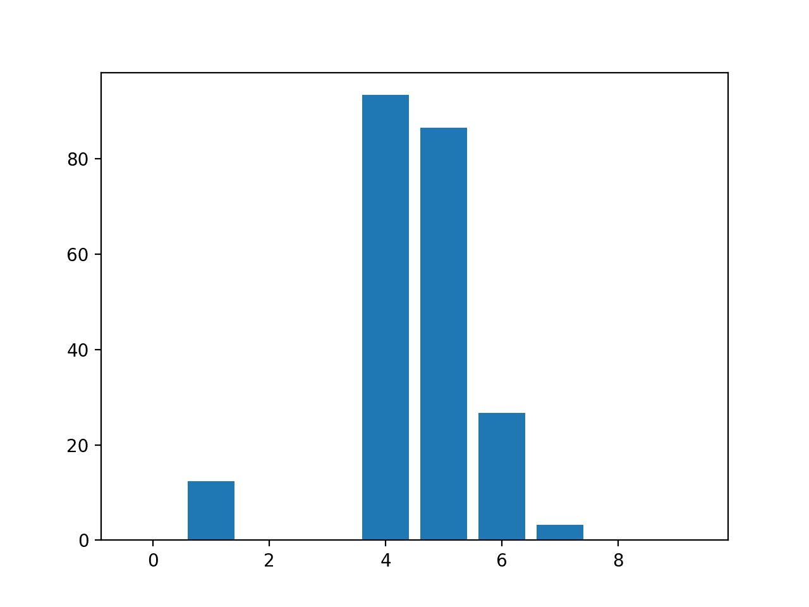
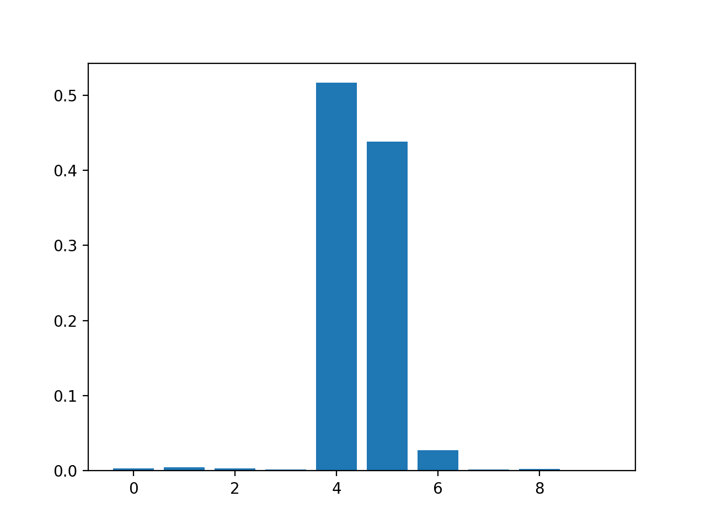
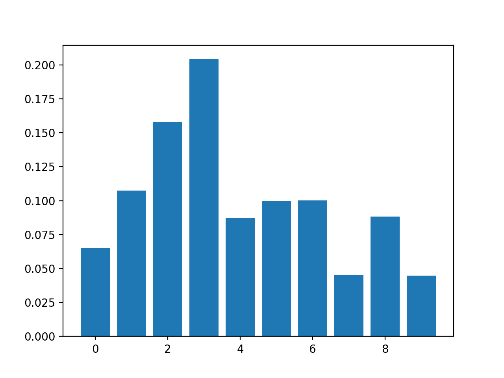
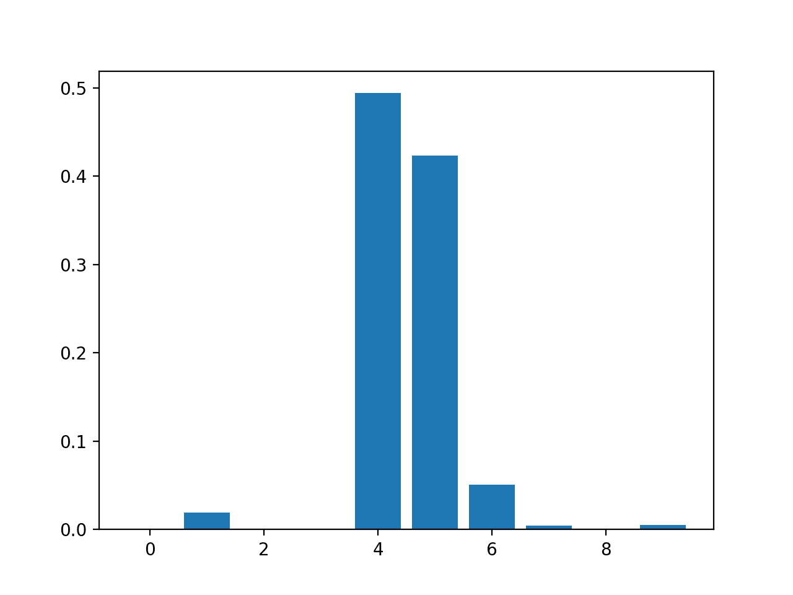
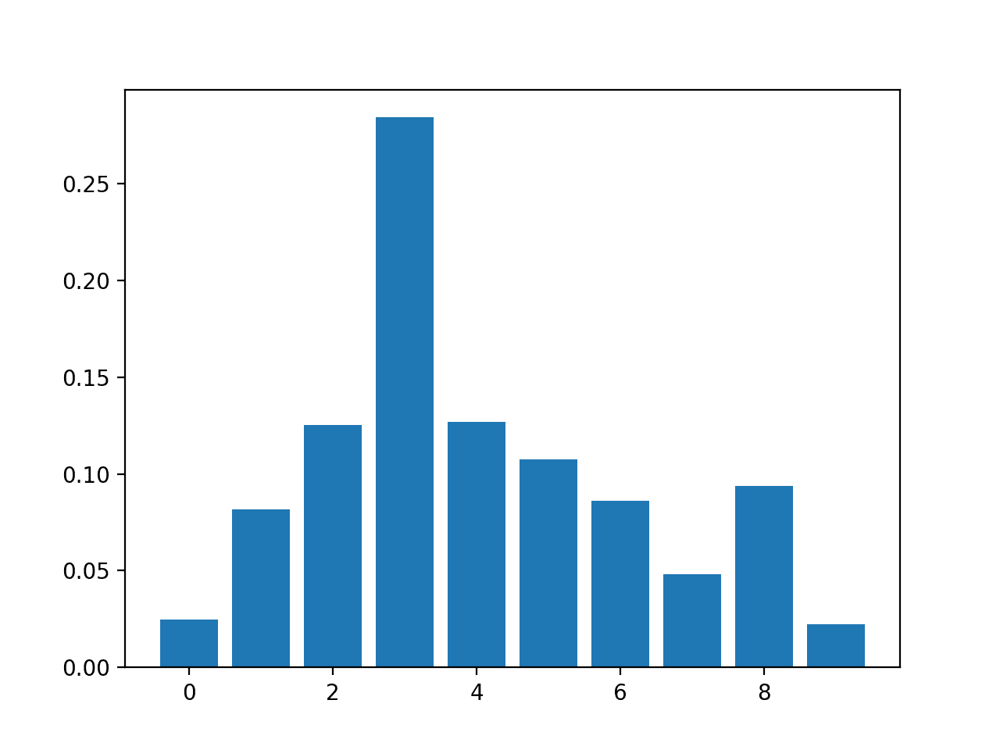
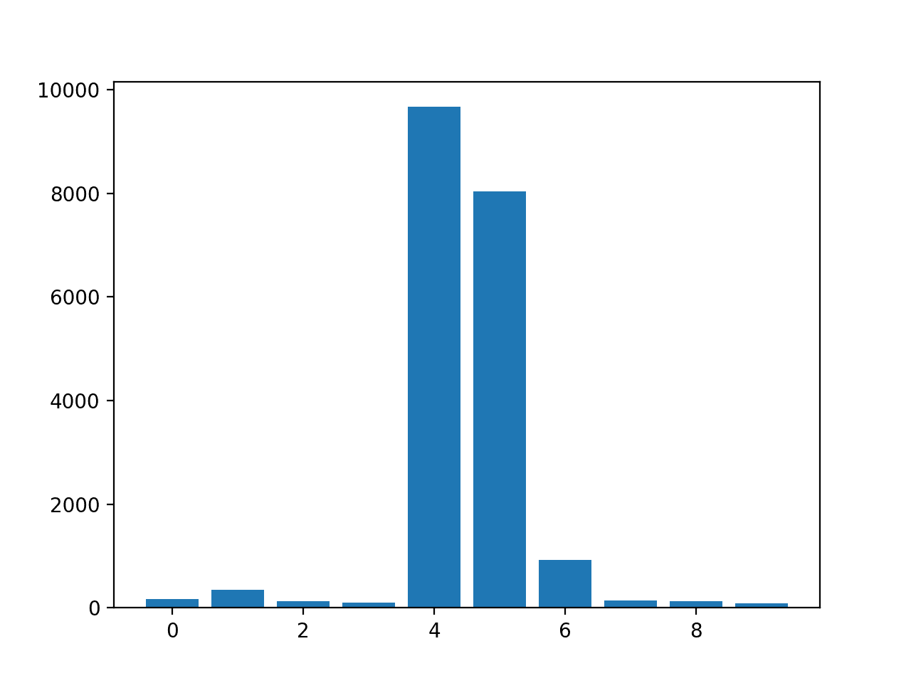
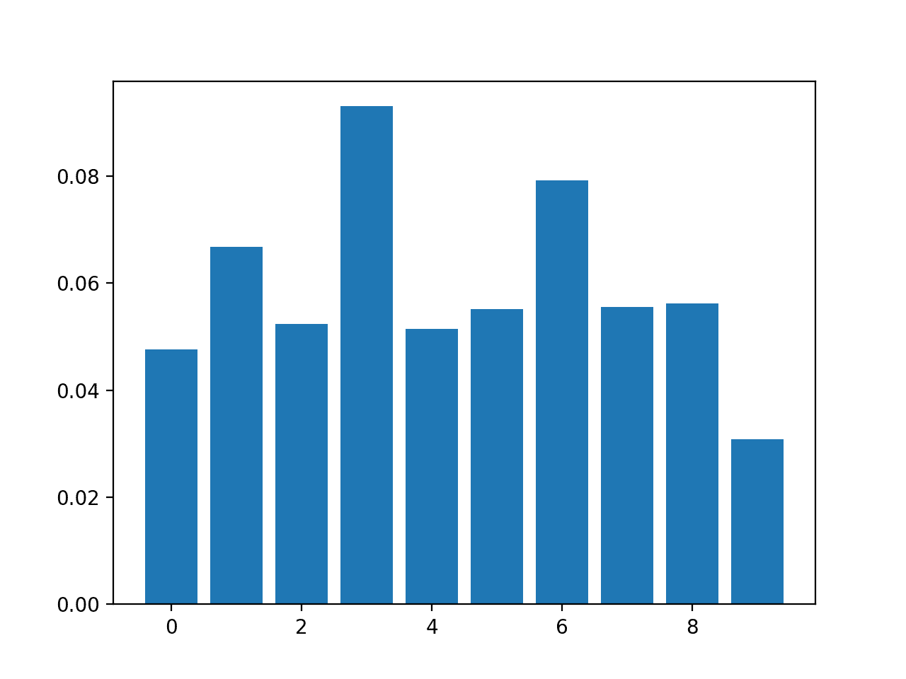

# 如何用 Python 计算特征重要性

> 原文：<https://machinelearningmastery.com/calculate-feature-importance-with-python/>

最后更新于 2020 年 8 月 20 日

**特征重要性**指的是根据输入特征在预测目标变量时的有用程度为输入特征打分的技术。

特征重要性分数有许多类型和来源，尽管流行的例子包括统计相关分数、作为线性模型一部分计算的系数、决策树和排列重要性分数。

特征重要性分数在预测建模项目中起着重要的作用，包括提供对数据的洞察、对模型的洞察，以及[降维](https://machinelearningmastery.com/dimensionality-reduction-for-machine-learning/)和[特征选择](https://machinelearningmastery.com/rfe-feature-selection-in-python/)的基础，它们可以提高预测模型对问题的效率和有效性。

在本教程中，您将发现 python 中机器学习的特征重要性分数

完成本教程后，您将知道:

*   特征重要性在预测建模问题中的作用。
*   如何从线性模型和决策树计算和检查特征重要性？
*   如何计算和复习排列特征重要性分数？

**用我的新书[机器学习的数据准备](https://machinelearningmastery.com/data-preparation-for-machine-learning/)启动你的项目**，包括*分步教程*和所有示例的 *Python 源代码*文件。

我们开始吧。

*   **2020 年 5 月更新**:增加了利用重要性进行特征选择的例子。


如何用 Python 计算特征重要性
图片由[邦妮·莫兰](https://flickr.com/photos/icetsarina/44777133331/)提供，保留部分权利。

## 教程概述

本教程分为六个部分；它们是:

1.  特征重要性
2.  准备
    1.  检查套件-学习版本
    2.  测试数据集
3.  作为特征重要性的系数
    1.  线性回归特征重要性
    2.  逻辑回归特征重要性
4.  决策树特征重要性
    1.  购物车功能重要性
    2.  随机森林特征重要性
    3.  扩展功能重要性
5.  排列特征重要性
    1.  回归的置换特征重要性
    2.  排列特征对分类的重要性
6.  具有重要性的特征选择

## 特征重要性

特征重要性是指一类技术，用于将输入特征的得分分配给预测模型，该预测模型指示每个特征在进行预测时的相对重要性。

可以为涉及预测数值的问题(称为回归)和涉及预测类别标签的问题(称为分类)计算特征重要性分数。

分数很有用，可以用于预测建模问题中的一系列情况，例如:

*   更好地理解数据。
*   更好地理解模型。
*   减少输入特征的数量。

**特征重要性分数可以提供对数据集的洞察**。相对分数可以突出显示哪些特征可能与目标最相关，反之，哪些特征最不相关。这可以由领域专家进行解释，并可以用作收集更多或不同数据的基础。

**特征重要性分数可以提供对模型的洞察**。大多数重要度分数都是通过适合数据集的预测模型来计算的。检查重要性分数可以深入了解特定的模型，以及在进行预测时哪些特征对模型最重要，哪些最不重要。这是一种可以为支持它的模型执行的模型解释类型。

**特征重要性可用于改进预测模型**。这可以通过使用重要性分数来选择要删除的特征(最低分数)或要保留的特征(最高分数)来实现。这是一种特征选择，可以简化正在建模的问题，加快建模过程(删除特征称为降维)，在某些情况下，可以提高模型的表现。

> 通常，我们希望量化预测因子和结果之间关系的强度。[……]在筛选大量数据时，以这种方式对预测值进行排名非常有用。

—第 463 页，[应用预测建模](https://amzn.to/3b2LHTL)，2013 年。

特征重要性分数可以被馈送到包装器模型，例如[selectfrommel](https://Sklearn.org/stable/modules/generated/sklearn.feature_selection.SelectFromModel.html)类，以执行特征选择。

有许多方法可以计算特征重要性分数，也有许多模型可以用于此目的。

也许最简单的方法是计算每个特征和目标变量之间的简单系数统计。有关这种方法的更多信息，请参见教程:

*   [如何选择机器学习的特征选择方法](https://machinelearningmastery.com/feature-selection-with-real-and-categorical-data/)

在本教程中，我们将研究三种更高级的重要特性；它们是:

*   模型系数的特征重要性。
*   决策树的特征重要性。
*   置换测试的特征重要性。

让我们仔细看看每一个。

## 准备

在我们深入研究之前，让我们确认我们的环境并准备一些测试数据集。

### 检查 Scikit-学习版本

首先，确认您安装了 Sklearn 库的现代版本。

这很重要，因为我们将在本教程中探索的一些模型需要一个现代版本的库。

您可以使用下面的代码示例检查已安装的库的版本:

```py
# check Sklearn version
import sklearn
print(sklearn.__version__)
```

运行该示例将打印库的版本。在撰写本文时，这大约是 0.22 版本。

您需要使用 Sklearn 或更高版本。

```py
0.22.1
```

### 测试数据集

接下来，让我们定义一些测试数据集，我们可以将其用作演示和探索特征重要性分数的基础。

每个测试问题有五个重要的和五个不重要的特征，看看哪些方法在根据特征的重要性找到或区分特征方面是一致的可能会很有趣。

### 类别数据集

我们将使用 [make_classification()函数](https://Sklearn.org/stable/modules/generated/sklearn.datasets.make_classification.html)创建一个测试二进制类别数据集。

数据集将有 1，000 个示例，有 10 个输入要素，其中 5 个是信息性的，其余 5 个是冗余的。我们将修复随机数种子，以确保每次运行代码时得到相同的例子。

下面列出了创建和汇总数据集的示例。

```py
# test classification dataset
from sklearn.datasets import make_classification
# define dataset
X, y = make_classification(n_samples=1000, n_features=10, n_informative=5, n_redundant=5, random_state=1)
# summarize the dataset
print(X.shape, y.shape)
```

运行该示例将创建数据集，并确认样本和要素的预期数量。

```py
(1000, 10) (1000,)
```

### 回归数据集

我们将使用[make _ revolution()函数](https://Sklearn.org/stable/modules/generated/sklearn.datasets.make_regression.html)创建一个测试回归数据集。

与类别数据集一样，回归数据集将有 1，000 个示例，有 10 个输入要素，其中 5 个是信息性的，其余 5 个是冗余的。

```py
# test regression dataset
from sklearn.datasets import make_regression
# define dataset
X, y = make_regression(n_samples=1000, n_features=10, n_informative=5, random_state=1)
# summarize the dataset
print(X.shape, y.shape)
```

运行该示例将创建数据集，并确认样本和要素的预期数量。

```py
(1000, 10) (1000,)
```

接下来，让我们仔细看看作为重要性分数的系数。

## 作为特征重要性的系数

线性机器学习算法适合一个模型，其中预测是输入值的加权和。

示例包括线性回归、逻辑回归和添加正则化的扩展，如岭回归和弹性网。

所有这些算法都会找到一组用于加权和的系数，以便进行预测。这些系数可以直接用作特征重要性得分的粗略类型。

让我们仔细看看使用系数作为分类和回归的特征重要性。我们将在数据集上拟合一个模型来找到系数，然后总结每个输入特征的重要性分数，最后创建一个条形图来了解特征的相对重要性。

### 线性回归特征重要性

我们可以在回归数据集上拟合[线性回归](https://Sklearn.org/stable/modules/generated/sklearn.linear_model.LinearRegression.html)模型，并检索包含为每个输入变量找到的系数的*系数 _* 属性。

这些系数可以为粗略的特征重要性评分提供基础。这假设输入变量具有相同的比例或者在拟合模型之前已经被缩放。

下面列出了特征重要性的线性回归系数的完整示例。

```py
# linear regression feature importance
from sklearn.datasets import make_regression
from sklearn.linear_model import LinearRegression
from matplotlib import pyplot
# define dataset
X, y = make_regression(n_samples=1000, n_features=10, n_informative=5, random_state=1)
# define the model
model = LinearRegression()
# fit the model
model.fit(X, y)
# get importance
importance = model.coef_
# summarize feature importance
for i,v in enumerate(importance):
	print('Feature: %0d, Score: %.5f' % (i,v))
# plot feature importance
pyplot.bar([x for x in range(len(importance))], importance)
pyplot.show()
```

运行该示例来拟合模型，然后报告每个特征的系数值。

**注**:考虑到算法或评估程序的随机性，或数值精度的差异，您的[结果可能会有所不同](https://machinelearningmastery.com/different-results-each-time-in-machine-learning/)。考虑运行该示例几次，并比较平均结果。

这些分数表明，该模型找到了五个重要的特征，并用零系数标记了所有其他特征，基本上将它们从模型中移除。

```py
Feature: 0, Score: 0.00000
Feature: 1, Score: 12.44483
Feature: 2, Score: -0.00000
Feature: 3, Score: -0.00000
Feature: 4, Score: 93.32225
Feature: 5, Score: 86.50811
Feature: 6, Score: 26.74607
Feature: 7, Score: 3.28535
Feature: 8, Score: -0.00000
Feature: 9, Score: 0.00000
```

然后为特征重要性分数创建条形图。



作为特征重要性得分的线性回归系数条形图

这种方法也可以用于[岭](https://Sklearn.org/stable/modules/generated/sklearn.linear_model.Ridge.html)和[弹性线](https://Sklearn.org/stable/modules/generated/sklearn.linear_model.ElasticNet.html)模型。

### 逻辑回归特征重要性

我们可以在回归数据集上拟合一个[逻辑回归](https://Sklearn.org/stable/modules/generated/sklearn.linear_model.LogisticRegression.html)模型，并检索包含为每个输入变量找到的系数的*系数 _* 属性。

这些系数可以为粗略的特征重要性评分提供基础。这假设输入变量具有相同的比例或者在拟合模型之前已经被缩放。

下面列出了特征重要性的逻辑回归系数的完整示例。

```py
# logistic regression for feature importance
from sklearn.datasets import make_classification
from sklearn.linear_model import LogisticRegression
from matplotlib import pyplot
# define dataset
X, y = make_classification(n_samples=1000, n_features=10, n_informative=5, n_redundant=5, random_state=1)
# define the model
model = LogisticRegression()
# fit the model
model.fit(X, y)
# get importance
importance = model.coef_[0]
# summarize feature importance
for i,v in enumerate(importance):
	print('Feature: %0d, Score: %.5f' % (i,v))
# plot feature importance
pyplot.bar([x for x in range(len(importance))], importance)
pyplot.show()
```

运行该示例来拟合模型，然后报告每个特征的系数值。

**注**:考虑到算法或评估程序的随机性，或数值精度的差异，您的[结果可能会有所不同](https://machinelearningmastery.com/different-results-each-time-in-machine-learning/)。考虑运行该示例几次，并比较平均结果。

回想一下，这是 0 类和 1 类的分类问题。请注意，系数既是正的，也是负的。正分数表示预测类别 1 的特征，而负分数表示预测类别 0 的特征。

从这些结果中，没有明确的重要和不重要的特征模式可以被识别，至少从我所能告诉的来看。

```py
Feature: 0, Score: 0.16320
Feature: 1, Score: -0.64301
Feature: 2, Score: 0.48497
Feature: 3, Score: -0.46190
Feature: 4, Score: 0.18432
Feature: 5, Score: -0.11978
Feature: 6, Score: -0.40602
Feature: 7, Score: 0.03772
Feature: 8, Score: -0.51785
Feature: 9, Score: 0.26540
```

然后为特征重要性分数创建条形图。


作为特征重要性得分的逻辑回归系数条形图

现在我们已经看到了使用系数作为重要性分数，让我们来看看基于决策树的重要性分数的更常见的例子。

## 决策树特征重要性

像[分类和回归树](https://machinelearningmastery.com/implement-decision-tree-algorithm-scratch-python/) (CART)这样的决策树算法基于用于选择分割点的标准的减少来提供重要性分数，像基尼或熵。

同样的方法可以用于决策树的集成，例如随机森林和随机梯度提升算法。

让我们来看一个成功的例子。

### 购物车功能重要性

我们可以使用 Sklearn 中实现的特征重要性的 CART 算法作为*决策树回归器*和*决策树分类器*类。

拟合后，模型提供了一个*特征重要度 _* 属性，可以访问该属性来检索每个输入特征的相对重要度得分。

让我们看一个回归和分类的例子。

#### CART 回归特征重要性

下面列出了拟合[决策树回归器](https://Sklearn.org/stable/modules/generated/sklearn.tree.DecisionTreeRegressor.html)并汇总计算出的特征重要性分数的完整示例。

```py
# decision tree for feature importance on a regression problem
from sklearn.datasets import make_regression
from sklearn.tree import DecisionTreeRegressor
from matplotlib import pyplot
# define dataset
X, y = make_regression(n_samples=1000, n_features=10, n_informative=5, random_state=1)
# define the model
model = DecisionTreeRegressor()
# fit the model
model.fit(X, y)
# get importance
importance = model.feature_importances_
# summarize feature importance
for i,v in enumerate(importance):
	print('Feature: %0d, Score: %.5f' % (i,v))
# plot feature importance
pyplot.bar([x for x in range(len(importance))], importance)
pyplot.show()
```

运行该示例来拟合模型，然后报告每个特征的系数值。

**注**:考虑到算法或评估程序的随机性，或数值精度的差异，您的[结果可能会有所不同](https://machinelearningmastery.com/different-results-each-time-in-machine-learning/)。考虑运行该示例几次，并比较平均结果。

结果表明，10 个特征中可能有 3 个对预测很重要。

```py
Feature: 0, Score: 0.00294
Feature: 1, Score: 0.00502
Feature: 2, Score: 0.00318
Feature: 3, Score: 0.00151
Feature: 4, Score: 0.51648
Feature: 5, Score: 0.43814
Feature: 6, Score: 0.02723
Feature: 7, Score: 0.00200
Feature: 8, Score: 0.00244
Feature: 9, Score: 0.00106
```

然后为特征重要性分数创建条形图。



决策树柱状图回归器特征重要性得分

#### CART 分类特征重要性

下面列出了拟合[决策树分类器](https://Sklearn.org/stable/modules/generated/sklearn.tree.DecisionTreeClassifier.html)并汇总计算出的特征重要性分数的完整示例。

```py
# decision tree for feature importance on a classification problem
from sklearn.datasets import make_classification
from sklearn.tree import DecisionTreeClassifier
from matplotlib import pyplot
# define dataset
X, y = make_classification(n_samples=1000, n_features=10, n_informative=5, n_redundant=5, random_state=1)
# define the model
model = DecisionTreeClassifier()
# fit the model
model.fit(X, y)
# get importance
importance = model.feature_importances_
# summarize feature importance
for i,v in enumerate(importance):
	print('Feature: %0d, Score: %.5f' % (i,v))
# plot feature importance
pyplot.bar([x for x in range(len(importance))], importance)
pyplot.show()
```

运行该示例来拟合模型，然后报告每个特征的系数值。

**注**:考虑到算法或评估程序的随机性，或数值精度的差异，您的[结果可能会有所不同](https://machinelearningmastery.com/different-results-each-time-in-machine-learning/)。考虑运行该示例几次，并比较平均结果。

结果表明，10 个特征中可能有 4 个对预测很重要。

```py
Feature: 0, Score: 0.01486
Feature: 1, Score: 0.01029
Feature: 2, Score: 0.18347
Feature: 3, Score: 0.30295
Feature: 4, Score: 0.08124
Feature: 5, Score: 0.00600
Feature: 6, Score: 0.19646
Feature: 7, Score: 0.02908
Feature: 8, Score: 0.12820
Feature: 9, Score: 0.04745
```

然后为特征重要性分数创建条形图。


决策树分类器特征重要性得分条形图

### 随机森林特征重要性

我们可以使用 Sklearn 中实现的[随机森林](https://machinelearningmastery.com/implement-random-forest-scratch-python/)算法作为*随机森林回归器*和*随机森林分类器*类。

拟合后，模型提供了一个*特征重要度 _* 属性，可以访问该属性来检索每个输入特征的相对重要度得分。

这种方法也可以与装袋和额外树算法一起使用。

让我们看一个回归和分类的例子。

#### 随机森林回归特征重要性

下面列出了拟合一个[随机森林回归器](https://Sklearn.org/stable/modules/generated/sklearn.ensemble.RandomForestRegressor.html)并总结计算出的特征重要性分数的完整示例。

```py
# random forest for feature importance on a regression problem
from sklearn.datasets import make_regression
from sklearn.ensemble import RandomForestRegressor
from matplotlib import pyplot
# define dataset
X, y = make_regression(n_samples=1000, n_features=10, n_informative=5, random_state=1)
# define the model
model = RandomForestRegressor()
# fit the model
model.fit(X, y)
# get importance
importance = model.feature_importances_
# summarize feature importance
for i,v in enumerate(importance):
	print('Feature: %0d, Score: %.5f' % (i,v))
# plot feature importance
pyplot.bar([x for x in range(len(importance))], importance)
pyplot.show()
```

运行该示例来拟合模型，然后报告每个特征的系数值。

**注**:考虑到算法或评估程序的随机性，或数值精度的差异，您的[结果可能会有所不同](https://machinelearningmastery.com/different-results-each-time-in-machine-learning/)。考虑运行该示例几次，并比较平均结果。

结果表明，10 个特征中可能有两三个对预测很重要。

```py
Feature: 0, Score: 0.00280
Feature: 1, Score: 0.00545
Feature: 2, Score: 0.00294
Feature: 3, Score: 0.00289
Feature: 4, Score: 0.52992
Feature: 5, Score: 0.42046
Feature: 6, Score: 0.02663
Feature: 7, Score: 0.00304
Feature: 8, Score: 0.00304
Feature: 9, Score: 0.00283
```

然后为特征重要性分数创建条形图。


随机森林回归器特征重要性得分条形图

#### 随机森林分类特征重要性

下面列出了拟合一个[随机森林分类器](https://Sklearn.org/stable/modules/generated/sklearn.ensemble.RandomForestClassifier.html)并总结计算出的特征重要性分数的完整例子。

```py
# random forest for feature importance on a classification problem
from sklearn.datasets import make_classification
from sklearn.ensemble import RandomForestClassifier
from matplotlib import pyplot
# define dataset
X, y = make_classification(n_samples=1000, n_features=10, n_informative=5, n_redundant=5, random_state=1)
# define the model
model = RandomForestClassifier()
# fit the model
model.fit(X, y)
# get importance
importance = model.feature_importances_
# summarize feature importance
for i,v in enumerate(importance):
	print('Feature: %0d, Score: %.5f' % (i,v))
# plot feature importance
pyplot.bar([x for x in range(len(importance))], importance)
pyplot.show()
```

运行该示例来拟合模型，然后报告每个特征的系数值。

**注**:考虑到算法或评估程序的随机性，或数值精度的差异，您的[结果可能会有所不同](https://machinelearningmastery.com/different-results-each-time-in-machine-learning/)。考虑运行该示例几次，并比较平均结果。

结果表明，10 个特征中可能有两三个对预测很重要。

```py
Feature: 0, Score: 0.06523
Feature: 1, Score: 0.10737
Feature: 2, Score: 0.15779
Feature: 3, Score: 0.20422
Feature: 4, Score: 0.08709
Feature: 5, Score: 0.09948
Feature: 6, Score: 0.10009
Feature: 7, Score: 0.04551
Feature: 8, Score: 0.08830
Feature: 9, Score: 0.04493
```

然后为特征重要性分数创建条形图。



随机森林分类器特征重要性得分条形图

### 扩展功能重要性

XGBoost 是一个库，它提供了随机梯度提升算法的高效和有效的实现。

该算法可以通过*xgbreversor*和 *XGBClassifier* 类与 Sklearn 一起使用。

拟合后，模型提供了一个*特征重要度 _* 属性，可以访问该属性来检索每个输入特征的相对重要度得分。

该算法也通过 Sklearn 通过*梯度提升分类器*和*梯度提升回归器*类提供，并且可以使用相同的特征选择方法。

首先，安装 XGBoost 库，比如用 pip:

```py
sudo pip install xgboost
```

然后，通过检查版本号来确认库安装正确并且工作正常。

```py
# check xgboost version
import xgboost
print(xgboost.__version__)
```

运行该示例时，您应该会看到以下版本号或更高版本号。

```py
0.90
```

有关 XGBoost 库的更多信息，请从这里开始:

*   [带 Python 的 xboost](https://machinelearningmastery.com/start-here/#xgboost)

让我们看一个关于回归和分类问题的特征重要性的 XGBoost 例子。

#### XGBoost 回归特征重要性

下面列出了拟合一个[xgbrevoller](https://xgboost.readthedocs.io/en/latest/python/python_api.html#xgboost.XGBRegressor)并汇总计算出的特征重要性分数的完整示例。

```py
# xgboost for feature importance on a regression problem
from sklearn.datasets import make_regression
from xgboost import XGBRegressor
from matplotlib import pyplot
# define dataset
X, y = make_regression(n_samples=1000, n_features=10, n_informative=5, random_state=1)
# define the model
model = XGBRegressor()
# fit the model
model.fit(X, y)
# get importance
importance = model.feature_importances_
# summarize feature importance
for i,v in enumerate(importance):
	print('Feature: %0d, Score: %.5f' % (i,v))
# plot feature importance
pyplot.bar([x for x in range(len(importance))], importance)
pyplot.show()
```

运行该示例来拟合模型，然后报告每个特征的系数值。

**注**:考虑到算法或评估程序的随机性，或数值精度的差异，您的[结果可能会有所不同](https://machinelearningmastery.com/different-results-each-time-in-machine-learning/)。考虑运行该示例几次，并比较平均结果。

结果表明，10 个特征中可能有两三个对预测很重要。

```py
Feature: 0, Score: 0.00060
Feature: 1, Score: 0.01917
Feature: 2, Score: 0.00091
Feature: 3, Score: 0.00118
Feature: 4, Score: 0.49380
Feature: 5, Score: 0.42342
Feature: 6, Score: 0.05057
Feature: 7, Score: 0.00419
Feature: 8, Score: 0.00124
Feature: 9, Score: 0.00491
```

然后为特征重要性分数创建条形图。



XGBRegressor 特征重要性分数条形图

#### 扩展分类特征重要性

下面列出了拟合一个 [XGBClassifier](https://xgboost.readthedocs.io/en/latest/python/python_api.html#xgboost.XGBRFClassifier) 并汇总计算出的特征重要性分数的完整示例。

```py
# xgboost for feature importance on a classification problem
from sklearn.datasets import make_classification
from xgboost import XGBClassifier
from matplotlib import pyplot
# define dataset
X, y = make_classification(n_samples=1000, n_features=10, n_informative=5, n_redundant=5, random_state=1)
# define the model
model = XGBClassifier()
# fit the model
model.fit(X, y)
# get importance
importance = model.feature_importances_
# summarize feature importance
for i,v in enumerate(importance):
	print('Feature: %0d, Score: %.5f' % (i,v))
# plot feature importance
pyplot.bar([x for x in range(len(importance))], importance)
pyplot.show()
```

运行该示例拟合模型，然后报告每个特征的系数值。

**注**:考虑到算法或评估程序的随机性，或数值精度的差异，您的[结果可能会有所不同](https://machinelearningmastery.com/different-results-each-time-in-machine-learning/)。考虑运行该示例几次，并比较平均结果。

结果表明，10 个特征中可能有 7 个对预测很重要。

```py
Feature: 0, Score: 0.02464
Feature: 1, Score: 0.08153
Feature: 2, Score: 0.12516
Feature: 3, Score: 0.28400
Feature: 4, Score: 0.12694
Feature: 5, Score: 0.10752
Feature: 6, Score: 0.08624
Feature: 7, Score: 0.04820
Feature: 8, Score: 0.09357
Feature: 9, Score: 0.02220
```

然后为特征重要性分数创建条形图。



分类器特征重要性得分柱状图

## 排列特征重要性

[排列特征重要性](https://Sklearn.org/stable/modules/permutation_importance.html)是一种独立于所用模型计算相对重要性分数的技术。

首先，模型适合数据集，例如不支持原生特征重要性分数的模型。然后使用该模型对数据集进行预测，尽管数据集中某个要素(列)的值会被打乱。对数据集中的每个要素重复这一过程。然后整个过程重复 3、5、10 次或更多次。结果是每个输入特征的平均重要性分数(以及给定重复的分数分布)。

这种方法可用于回归或分类，并要求选择表现指标作为重要性得分的基础，例如回归的均方误差和分类的准确性。

排列特征选择可以通过[排列重要性()函数](https://Sklearn.org/stable/modules/generated/sklearn.inspection.permutation_importance.html)使用，该函数采用拟合模型、数据集(训练或测试数据集都可以)和评分函数。

让我们看一下这种特征选择方法，其算法本身不支持特征选择，特别是 [k 近邻](https://machinelearningmastery.com/tutorial-to-implement-k-nearest-neighbors-in-python-from-scratch/)。

### 回归的置换特征重要性

下面列出了拟合一个[kneighborsrgressor](https://Sklearn.org/stable/modules/generated/sklearn.neighbors.KNeighborsRegressor.html)并总结计算出的排列特征重要性分数的完整示例。

```py
# permutation feature importance with knn for regression
from sklearn.datasets import make_regression
from sklearn.neighbors import KNeighborsRegressor
from sklearn.inspection import permutation_importance
from matplotlib import pyplot
# define dataset
X, y = make_regression(n_samples=1000, n_features=10, n_informative=5, random_state=1)
# define the model
model = KNeighborsRegressor()
# fit the model
model.fit(X, y)
# perform permutation importance
results = permutation_importance(model, X, y, scoring='neg_mean_squared_error')
# get importance
importance = results.importances_mean
# summarize feature importance
for i,v in enumerate(importance):
	print('Feature: %0d, Score: %.5f' % (i,v))
# plot feature importance
pyplot.bar([x for x in range(len(importance))], importance)
pyplot.show()
```

运行该示例来拟合模型，然后报告每个特征的系数值。

**注**:考虑到算法或评估程序的随机性，或数值精度的差异，您的[结果可能会有所不同](https://machinelearningmastery.com/different-results-each-time-in-machine-learning/)。考虑运行该示例几次，并比较平均结果。

结果表明，10 个特征中可能有两三个对预测很重要。

```py
Feature: 0, Score: 175.52007
Feature: 1, Score: 345.80170
Feature: 2, Score: 126.60578
Feature: 3, Score: 95.90081
Feature: 4, Score: 9666.16446
Feature: 5, Score: 8036.79033
Feature: 6, Score: 929.58517
Feature: 7, Score: 139.67416
Feature: 8, Score: 132.06246
Feature: 9, Score: 84.94768
```

然后为特征重要性分数创建条形图。



具有排列特征重要性分数的 kneighbors 回归条形图

### 排列特征对分类的重要性

下面列出了拟合一个[kneighborscclassifier](https://Sklearn.org/stable/modules/generated/sklearn.neighbors.KNeighborsClassifier.html)并汇总计算出的排列特征重要性分数的完整示例。

```py
# permutation feature importance with knn for classification
from sklearn.datasets import make_classification
from sklearn.neighbors import KNeighborsClassifier
from sklearn.inspection import permutation_importance
from matplotlib import pyplot
# define dataset
X, y = make_classification(n_samples=1000, n_features=10, n_informative=5, n_redundant=5, random_state=1)
# define the model
model = KNeighborsClassifier()
# fit the model
model.fit(X, y)
# perform permutation importance
results = permutation_importance(model, X, y, scoring='accuracy')
# get importance
importance = results.importances_mean
# summarize feature importance
for i,v in enumerate(importance):
	print('Feature: %0d, Score: %.5f' % (i,v))
# plot feature importance
pyplot.bar([x for x in range(len(importance))], importance)
pyplot.show()
```

运行该示例来拟合模型，然后报告每个特征的系数值。

**注**:考虑到算法或评估程序的随机性，或数值精度的差异，您的[结果可能会有所不同](https://machinelearningmastery.com/different-results-each-time-in-machine-learning/)。考虑运行该示例几次，并比较平均结果。

结果表明，10 个特征中可能有两三个对预测很重要。

```py
Feature: 0, Score: 0.04760
Feature: 1, Score: 0.06680
Feature: 2, Score: 0.05240
Feature: 3, Score: 0.09300
Feature: 4, Score: 0.05140
Feature: 5, Score: 0.05520
Feature: 6, Score: 0.07920
Feature: 7, Score: 0.05560
Feature: 8, Score: 0.05620
Feature: 9, Score: 0.03080
```

然后为特征重要性分数创建条形图。



具有排列特征重要性分数的 KNeighborsClassifier 条形图

## 具有重要性的特征选择

特征重要性分数可用于帮助解释数据，但也可直接用于帮助排列和选择对预测模型最有用的特征。

我们可以用一个小例子来证明这一点。

回想一下，我们的合成数据集有 1000 个例子，每个例子有 10 个输入变量，其中 5 个是冗余的，5 个对结果很重要。我们可以使用特征重要性分数来帮助选择相关的五个变量，并且只将它们用作预测模型的输入。

首先，我们可以将训练数据集分成训练集和测试集，并在训练数据集上训练模型，在测试集上进行预测，并使用分类精度评估结果。我们将使用逻辑回归模型作为预测模型。

当我们使用特征重要性分数移除一些特征时，这为比较提供了基线。

下面列出了使用所有特征作为合成数据集输入来评估逻辑回归模型的完整示例。

```py
# evaluation of a model using all features
from sklearn.datasets import make_classification
from sklearn.model_selection import train_test_split
from sklearn.linear_model import LogisticRegression
from sklearn.metrics import accuracy_score
# define the dataset
X, y = make_classification(n_samples=1000, n_features=10, n_informative=5, n_redundant=5, random_state=1)
# split into train and test sets
X_train, X_test, y_train, y_test = train_test_split(X, y, test_size=0.33, random_state=1)
# fit the model
model = LogisticRegression(solver='liblinear')
model.fit(X_train, y_train)
# evaluate the model
yhat = model.predict(X_test)
# evaluate predictions
accuracy = accuracy_score(y_test, yhat)
print('Accuracy: %.2f' % (accuracy*100))
```

运行示例首先在训练数据集上运行逻辑回归模型，并在测试集上对其进行评估。

**注**:考虑到算法或评估程序的随机性，或数值精度的差异，您的[结果可能会有所不同](https://machinelearningmastery.com/different-results-each-time-in-machine-learning/)。考虑运行该示例几次，并比较平均结果。

在这种情况下，我们可以看到模型使用数据集中的所有特征实现了大约 84.55%的分类准确率。

```py
Accuracy: 84.55
```

假设我们创建了数据集，我们会期望用一半数量的输入变量得到更好或相同的结果。

我们可以使用上面探讨的任何特征重要性分数，但是在这种情况下，我们将使用随机森林提供的特征重要性分数。

我们可以使用 [SelectFromModel](https://Sklearn.org/stable/modules/generated/sklearn.feature_selection.SelectFromModel.html) 类来定义我们希望计算重要性分数的模型，在这种情况下是[随机森林分类器](https://Sklearn.org/stable/modules/generated/sklearn.ensemble.RandomForestClassifier.html)，以及要选择的特征数量，在这种情况下是 5。

```py
...
# configure to select a subset of features
fs = SelectFromModel(RandomForestClassifier(n_estimators=200), max_features=5)
```

我们可以在训练数据集上拟合特征选择方法。

这将计算可用于对所有输入要素进行排名的重要性分数。然后，我们可以将该方法应用为转换，从数据集中选择 5 个最重要特征的子集。该转换将应用于训练数据集和测试集。

```py
...
# learn relationship from training data
fs.fit(X_train, y_train)
# transform train input data
X_train_fs = fs.transform(X_train)
# transform test input data
X_test_fs = fs.transform(X_test)
```

将所有这些结合起来，下面列出了使用随机森林特征重要性进行特征选择的完整示例。

```py
# evaluation of a model using 5 features chosen with random forest importance
from sklearn.datasets import make_classification
from sklearn.model_selection import train_test_split
from sklearn.feature_selection import SelectFromModel
from sklearn.ensemble import RandomForestClassifier
from sklearn.linear_model import LogisticRegression
from sklearn.metrics import accuracy_score

# feature selection
def select_features(X_train, y_train, X_test):
	# configure to select a subset of features
	fs = SelectFromModel(RandomForestClassifier(n_estimators=1000), max_features=5)
	# learn relationship from training data
	fs.fit(X_train, y_train)
	# transform train input data
	X_train_fs = fs.transform(X_train)
	# transform test input data
	X_test_fs = fs.transform(X_test)
	return X_train_fs, X_test_fs, fs

# define the dataset
X, y = make_classification(n_samples=1000, n_features=10, n_informative=5, n_redundant=5, random_state=1)
# split into train and test sets
X_train, X_test, y_train, y_test = train_test_split(X, y, test_size=0.33, random_state=1)
# feature selection
X_train_fs, X_test_fs, fs = select_features(X_train, y_train, X_test)
# fit the model
model = LogisticRegression(solver='liblinear')
model.fit(X_train_fs, y_train)
# evaluate the model
yhat = model.predict(X_test_fs)
# evaluate predictions
accuracy = accuracy_score(y_test, yhat)
print('Accuracy: %.2f' % (accuracy*100))
```

运行该示例首先对数据集执行特征选择，然后像以前一样拟合和评估逻辑回归模型。

**注**:考虑到算法或评估程序的随机性，或数值精度的差异，您的[结果可能会有所不同](https://machinelearningmastery.com/different-results-each-time-in-machine-learning/)。考虑运行该示例几次，并比较平均结果。

在这种情况下，我们可以看到模型在数据集上实现了相同的表现，尽管输入要素的数量只有一半。不出所料，由随机森林计算的特征重要性分数使我们能够准确地对输入特征进行排名，并删除那些与目标变量无关的特征。

```py
Accuracy: 84.55
```

## 进一步阅读

如果您想更深入地了解这个主题，本节将提供更多资源。

### 相关教程

*   [如何选择机器学习的特征选择方法](https://machinelearningmastery.com/feature-selection-with-real-and-categorical-data/)
*   [如何用类别数据进行特征选择](https://machinelearningmastery.com/feature-selection-with-categorical-data/)
*   [利用 Python 中的 XGBoost 进行特征重要性和特征选择](https://machinelearningmastery.com/feature-importance-and-feature-selection-with-xgboost-in-python/)
*   [Python 中机器学习的特征选择](https://machinelearningmastery.com/feature-selection-machine-learning-python/)
*   [特征选择介绍](https://machinelearningmastery.com/an-introduction-to-feature-selection/)

### 书

*   [应用预测建模](https://amzn.to/3b2LHTL)，2013。

### 蜜蜂

*   [功能选择，Sklearn API](https://Sklearn.org/stable/modules/feature_selection.html) 。
*   [排列特征重要性，Sklearn API](https://Sklearn.org/stable/modules/permutation_importance.html) 。
*   [sklearn . datasets . make _ classification API](https://Sklearn.org/stable/modules/generated/sklearn.datasets.make_classification.html)。
*   [sklearn . datasets . make _ revolution API](https://Sklearn.org/stable/modules/generated/sklearn.datasets.make_regression.html)。
*   [xboost Python API 引用](https://xgboost.readthedocs.io/en/latest/python/python_api.html)。
*   [硬化.检验.交换 _ 重要性 API](https://Sklearn.org/stable/modules/generated/sklearn.inspection.permutation_importance.html) 。

## 摘要

在本教程中，您发现了 python 中机器学习的特性重要性分数

具体来说，您了解到:

*   特征重要性在预测建模问题中的作用。
*   如何从线性模型和决策树计算和检查特征重要性？
*   如何计算和复习排列特征重要性分数？

**你有什么问题吗？**
在下面的评论中提问，我会尽力回答。