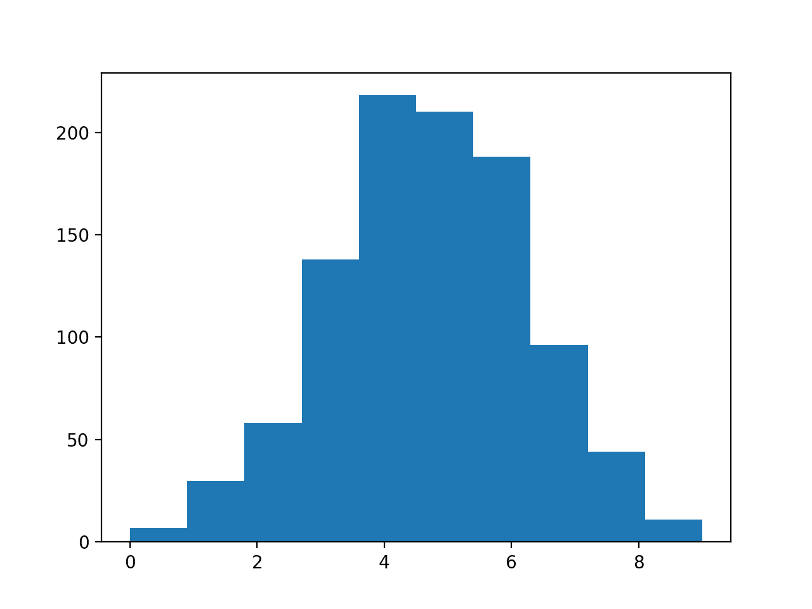
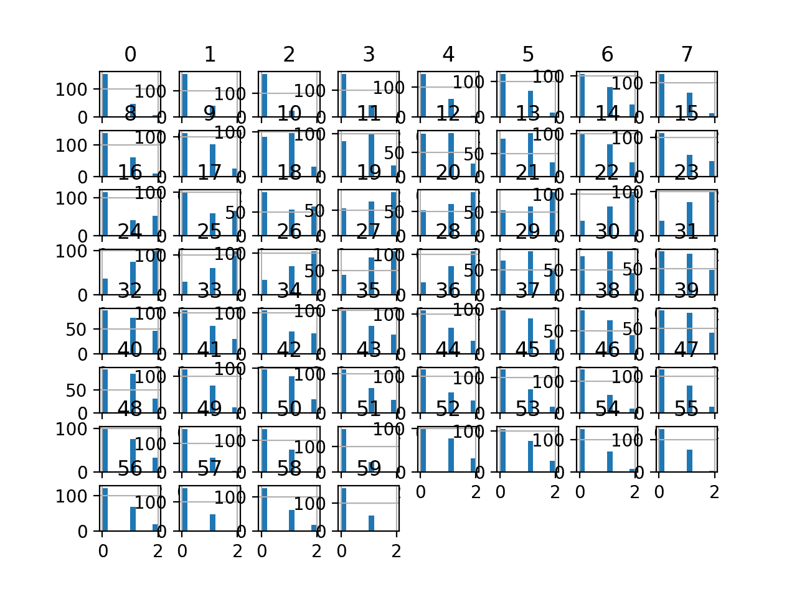
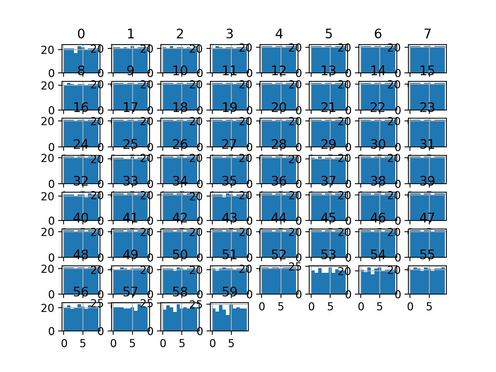
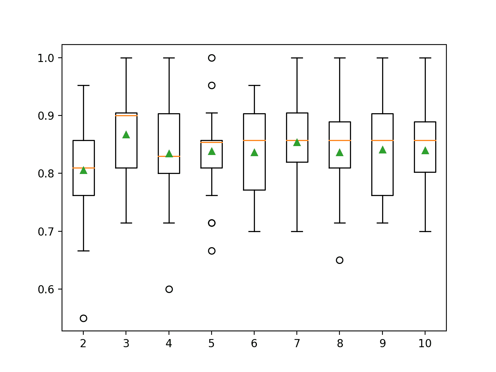

# 如何使用离散化变换进行机器学习

> 原文:[https://machinelearning master . com/离散化-机器学习转换/](https://machinelearningmastery.com/discretization-transforms-for-machine-learning/)

最后更新于 2020 年 8 月 28 日

数值输入变量可能具有高度偏斜或非标准分布。

这可能是由数据中的异常值、多模态分布、高度指数分布等引起的。

当数值输入变量具有标准概率分布时，许多机器学习算法更喜欢或表现得更好。

离散化转换提供了一种自动方式来更改数字输入变量，使其具有不同的数据分布，进而可以将其用作预测模型的输入。

在本教程中，您将发现如何使用离散化变换将数值映射到机器学习的离散类别

完成本教程后，您将知道:

*   当非标准概率分布的数值被离散化时，许多机器学习算法更喜欢或表现得更好。
*   离散化转换是一种将数字输入或输出变量转换为具有离散序数标签的技术。
*   如何使用 kbins 离散化器改变数值变量的结构和分布来提高预测模型的性能。

**用我的新书[机器学习的数据准备](https://machinelearningmastery.com/data-preparation-for-machine-learning/)启动你的项目**，包括*分步教程*和所有示例的 *Python 源代码*文件。

我们开始吧。


如何使用离散化变换进行机器学习
图片由[凯特·拉塞尔](https://flickr.com/photos/kateed/37017732716/)提供，版权所有。

## 教程概述

本教程分为六个部分；它们是:

1.  更改数据分布
2.  离散化变换
3.  声纳数据集
4.  均匀离散化变换
5.  k-均值离散化变换
6.  分位数离散化变换

## 更改数据分布

一些机器学习算法可能更喜欢或需要分类或顺序输入变量，例如一些决策树和基于规则的算法。

> 一些分类和聚类算法只处理名义属性，而不能处理数字尺度上测量的属性。

—第 296 页，[数据挖掘:实用机器学习工具与技术](https://amzn.to/2tzBoXF)，2016 年第 4 版。

此外，对于具有非标准概率分布的变量，许多机器学习算法的性能会降低。

这既适用于分类和回归任务中的实值输入变量，也适用于回归任务中的实值目标变量。

一些输入变量可能具有高度偏斜的分布，例如指数分布，其中最常见的观测值聚集在一起。一些输入变量可能有异常值，导致分布高度分散。

这些问题和其他问题，如非标准分布和多模态分布，会使数据集难以用一系列机器学习模型建模。

因此，通常希望将每个输入变量转换为具有标准概率分布。

一种方法是使用数值变量的变换来具有离散的概率分布，其中每个数值被分配一个标签，并且标签具有有序(序数)关系。

这被称为**宁滨**或**离散化变换**，并且可以通过使数值输入变量的概率分布离散化来提高一些机器学习模型对于数据集的性能。

## 离散化变换

一个[离散化变换](https://en.wikipedia.org/wiki/Discretization_of_continuous_features)将数值变量映射到离散值上。

> 宁滨，也称为分类或离散化，是将一个定量变量转化为一组两个或多个定性桶(即类别)的过程。

—第 129 页，[特征工程与选择](https://amzn.to/2Yvcupn)，2019 年。

变量的值被分组到离散的容器中，并且每个容器被分配一个唯一的整数，使得容器之间的序数关系被保留。

箱的使用通常被称为宁滨或*k*-箱，其中 *k* 是指一个数值变量映射到的组的数量。

该映射提供了值的高阶排序，可以平滑观察值之间的关系。该变换可以应用于训练数据集中的每个数字输入变量，然后作为输入提供给机器学习模型，以学习预测建模任务。

> 箱的确定必须包含在重采样过程中。

—第 132 页，[特征工程与选择](https://amzn.to/2Yvcupn)，2019。

可以使用不同的方法将这些值分组到 k 个离散仓中；常见的技术包括:

*   **统一**:每个仓在变量可能值的跨度内具有相同的宽度。
*   **分位数**:每个仓都有相同数量的值，根据百分位数进行拆分。
*   **聚类**:识别聚类，并为每个组分配示例。

离散化转换可通过[KBinsDistrictzer 类](https://scikit-learn.org/stable/modules/generated/sklearn.preprocessing.KBinsDiscretizer.html)在 scikit-learn Python 机器学习库中获得。

“*策略*”参数控制输入变量的划分方式，如“*统一*”、“*分位数*”或“*kman*”

“*n _ bin*”参数控制将要创建的 bin 的数量，并且必须基于策略的选择进行设置，例如“*统一*”是灵活的，“*分位数*”必须有一个小于观测值或可感知百分位数的“*n _ bin*”，以及“ *kmeans* ”必须使用一个可以合理找到的聚类数量值。

“*编码*”参数通过设置“*序数*或单热编码”*单热*来控制转换是否将每个值映射为整数值序数编码几乎总是优选的，尽管单热编码可以允许模型学习组之间的非序数关系，例如在 *k* 的情况下-意味着聚类策略。

我们可以用一个小的工作示例来演示*kbins 离散化器*。我们可以生成一个[随机高斯数](https://machinelearningmastery.com/how-to-generate-random-numbers-in-python/)的样本。然后，可以使用 kbins 离散化器将浮动值转换为固定数量的离散类别，这些类别具有有序的顺序关系。

下面列出了完整的示例。

```py
# demonstration of the discretization transform
from numpy.random import randn
from sklearn.preprocessing import KBinsDiscretizer
from matplotlib import pyplot
# generate gaussian data sample
data = randn(1000)
# histogram of the raw data
pyplot.hist(data, bins=25)
pyplot.show()
# reshape data to have rows and columns
data = data.reshape((len(data),1))
# discretization transform the raw data
kbins = KBinsDiscretizer(n_bins=10, encode='ordinal', strategy='uniform')
data_trans = kbins.fit_transform(data)
# summarize first few rows
print(data_trans[:10, :])
# histogram of the transformed data
pyplot.hist(data_trans, bins=10)
pyplot.show()
```

运行该示例首先创建 1，000 个随机高斯浮点值的样本，并将数据绘制为直方图。


高斯分布的数据直方图

接下来，使用 kbins 离散化器将数值映射到分类值。我们将转换配置为创建 10 个类别(0 到 9)，以序数格式(整数)输出结果，并统一划分输入数据的范围。

打印转换数据的样本，清楚地显示数据的整数格式。

```py
[[5.]
 [3.]
 [2.]
 [6.]
 [7.]
 [5.]
 [3.]
 [4.]
 [4.]
 [2.]]
```

最后，创建一个直方图，显示 10 个离散类别以及观察值如何分布在这些组中，遵循与原始数据相同的高斯形状模式。



具有离散类别的转换数据直方图

在接下来的几节中，我们将详细了解如何在真实数据集上使用离散化转换。

接下来，让我们介绍数据集。

## 声纳数据集

声纳数据集是用于二进制分类的标准机器学习数据集。

它涉及 60 个实值输入和一个两类目标变量。数据集中有 208 个示例，类别相当均衡。

使用重复的分层 10 倍交叉验证，基线分类算法可以达到大约 53.4%的分类精度。[使用重复的分层 10 倍交叉验证，该数据集的最高性能](https://machinelearningmastery.com/results-for-standard-classification-and-regression-machine-learning-datasets/)约为 88%。

该数据集描述了岩石或模拟地雷的雷达回波。

您可以从这里了解有关数据集的更多信息:

*   [声纳数据集](https://raw.githubusercontent.com/jbrownlee/Datasets/master/sonar.csv)
*   [声纳数据集描述](https://raw.githubusercontent.com/jbrownlee/Datasets/master/sonar.names)

不需要下载数据集；我们将从我们的工作示例中自动下载它。

首先，让我们加载并总结数据集。下面列出了完整的示例。

```py
# load and summarize the sonar dataset
from pandas import read_csv
from pandas.plotting import scatter_matrix
from matplotlib import pyplot
# Load dataset
url = "https://raw.githubusercontent.com/jbrownlee/Datasets/master/sonar.csv"
dataset = read_csv(url, header=None)
# summarize the shape of the dataset
print(dataset.shape)
# summarize each variable
print(dataset.describe())
# histograms of the variables
dataset.hist()
pyplot.show()
```

运行该示例首先总结加载数据集的形状。

这确认了 60 个输入变量、一个输出变量和 208 行数据。

提供了输入变量的统计摘要，显示值是数值，范围大约从 0 到 1。

```py
(208, 61)
               0           1           2   ...          57          58          59
count  208.000000  208.000000  208.000000  ...  208.000000  208.000000  208.000000
mean     0.029164    0.038437    0.043832  ...    0.007949    0.007941    0.006507
std      0.022991    0.032960    0.038428  ...    0.006470    0.006181    0.005031
min      0.001500    0.000600    0.001500  ...    0.000300    0.000100    0.000600
25%      0.013350    0.016450    0.018950  ...    0.003600    0.003675    0.003100
50%      0.022800    0.030800    0.034300  ...    0.005800    0.006400    0.005300
75%      0.035550    0.047950    0.057950  ...    0.010350    0.010325    0.008525
max      0.137100    0.233900    0.305900  ...    0.044000    0.036400    0.043900

[8 rows x 60 columns]
```

最后，为每个输入变量创建一个直方图。

如果我们忽略图中杂乱的东西，专注于直方图本身，我们可以看到许多变量都有一个偏斜的分布。


声纳二进制分类数据集输入变量的直方图

接下来，让我们在原始数据集上拟合和评估一个机器学习模型。

我们将使用带有默认超参数的 [k 最近邻算法](https://machinelearningmastery.com/tutorial-to-implement-k-nearest-neighbors-in-python-from-scratch/)，并使用[重复分层 k 重交叉验证](https://machinelearningmastery.com/k-fold-cross-validation/)对其进行评估。

下面列出了完整的示例。

```py
# evaluate knn on the raw sonar dataset
from numpy import mean
from numpy import std
from pandas import read_csv
from sklearn.model_selection import cross_val_score
from sklearn.model_selection import RepeatedStratifiedKFold
from sklearn.neighbors import KNeighborsClassifier
from sklearn.preprocessing import LabelEncoder
from matplotlib import pyplot
# load dataset
url = "https://raw.githubusercontent.com/jbrownlee/Datasets/master/sonar.csv"
dataset = read_csv(url, header=None)
data = dataset.values
# separate into input and output columns
X, y = data[:, :-1], data[:, -1]
# ensure inputs are floats and output is an integer label
X = X.astype('float32')
y = LabelEncoder().fit_transform(y.astype('str'))
# define and configure the model
model = KNeighborsClassifier()
# evaluate the model
cv = RepeatedStratifiedKFold(n_splits=10, n_repeats=3, random_state=1)
n_scores = cross_val_score(model, X, y, scoring='accuracy', cv=cv, n_jobs=-1, error_score='raise')
# report model performance
print('Accuracy: %.3f (%.3f)' % (mean(n_scores), std(n_scores)))
```

运行该示例会评估原始声纳数据集上的 KNN 模型。

**注**:考虑到算法或评估程序的随机性，或数值精度的差异，您的[结果可能会有所不同](https://machinelearningmastery.com/different-results-each-time-in-machine-learning/)。考虑运行该示例几次，并比较平均结果。

我们可以看到，该模型实现了大约 79.7%的平均分类准确率，表明它具有技巧性(优于 53.4%)，并且处于良好表现的球园区(88%)。

```py
Accuracy: 0.797 (0.073)
```

接下来，让我们探索数据集的统一离散化转换。

## 均匀离散化变换

一个统一的离散化变换将保留每个输入变量的概率分布，但是将使用指定数量的序数组或标签使其离散。

我们可以使用[kbins 离散化器](https://scikit-learn.org/stable/modules/generated/sklearn.preprocessing.KBinsDiscretizer.html)类应用统一离散化变换，并将“*策略*参数设置为“*统一*”我们还必须通过“*n _ bin*参数设置所需的箱数；在这种情况下，我们将使用 10。

一旦定义，我们就可以调用 *fit_transform()* 函数，并将其传递给我们的数据集，以创建数据集的分位数转换版本。

```py
...
# perform a uniform discretization transform of the dataset
trans = KBinsDiscretizer(n_bins=10, encode='ordinal', strategy='uniform')
data = trans.fit_transform(data)
```

让我们在声纳数据集上试试。

下面列出了创建声纳数据集的统一离散化变换并绘制结果直方图的完整示例。

```py
# visualize a uniform ordinal discretization transform of the sonar dataset
from pandas import read_csv
from pandas import DataFrame
from pandas.plotting import scatter_matrix
from sklearn.preprocessing import KBinsDiscretizer
from matplotlib import pyplot
# load dataset
url = "https://raw.githubusercontent.com/jbrownlee/Datasets/master/sonar.csv"
dataset = read_csv(url, header=None)
# retrieve just the numeric input values
data = dataset.values[:, :-1]
# perform a uniform discretization transform of the dataset
trans = KBinsDiscretizer(n_bins=10, encode='ordinal', strategy='uniform')
data = trans.fit_transform(data)
# convert the array back to a dataframe
dataset = DataFrame(data)
# histograms of the variables
dataset.hist()
pyplot.show()
```

运行该示例会转换数据集并绘制每个输入变量的直方图。

我们可以看到直方图的形状通常与原始数据集的形状相匹配，尽管在这种情况下，每个变量都有固定数量的 10 个值或序数组。


声纳数据集均匀离散化变换输入变量的直方图

接下来，让我们评估与上一节相同的 KNN 模型，但在这种情况下是基于数据集的统一离散化变换。

下面列出了完整的示例。

```py
# evaluate knn on the sonar dataset with uniform ordinal discretization transform
from numpy import mean
from numpy import std
from pandas import read_csv
from sklearn.model_selection import cross_val_score
from sklearn.model_selection import RepeatedStratifiedKFold
from sklearn.neighbors import KNeighborsClassifier
from sklearn.preprocessing import LabelEncoder
from sklearn.preprocessing import KBinsDiscretizer
from sklearn.pipeline import Pipeline
from matplotlib import pyplot
# load dataset
url = "https://raw.githubusercontent.com/jbrownlee/Datasets/master/sonar.csv"
dataset = read_csv(url, header=None)
data = dataset.values
# separate into input and output columns
X, y = data[:, :-1], data[:, -1]
# ensure inputs are floats and output is an integer label
X = X.astype('float32')
y = LabelEncoder().fit_transform(y.astype('str'))
# define the pipeline
trans = KBinsDiscretizer(n_bins=10, encode='ordinal', strategy='uniform')
model = KNeighborsClassifier()
pipeline = Pipeline(steps=[('t', trans), ('m', model)])
# evaluate the pipeline
cv = RepeatedStratifiedKFold(n_splits=10, n_repeats=3, random_state=1)
n_scores = cross_val_score(pipeline, X, y, scoring='accuracy', cv=cv, n_jobs=-1, error_score='raise')
# report pipeline performance
print('Accuracy: %.3f (%.3f)' % (mean(n_scores), std(n_scores)))
```

**注**:考虑到算法或评估程序的随机性，或数值精度的差异，您的[结果可能会有所不同](https://machinelearningmastery.com/different-results-each-time-in-machine-learning/)。考虑运行该示例几次，并比较平均结果。

运行该示例，我们可以看到均匀离散化变换将性能从没有变换时的 79.7%提升到有变换时的 82.7%。

```py
Accuracy: 0.827 (0.082)
```

接下来，让我们仔细看看 k-means 离散化变换。

## k-均值离散化变换

K 均值离散化变换将尝试为每个输入变量拟合 K 个聚类，然后将每个观察值分配给一个聚类。

除非变量的经验分布比较复杂，否则集群的数量很可能很少，比如 3 到 5 个。

我们可以使用*kbins 离散化器*类应用 K-means 离散化变换，并将“*策略*参数设置为“*kmean*我们还必须通过“*n _ bin*参数设置所需的箱数；在这种情况下，我们将使用三个。

一旦定义，我们就可以调用 *fit_transform()* 函数，并将其传递给我们的数据集，以创建数据集的分位数转换版本。

```py
...
# perform a k-means discretization transform of the dataset
trans = KBinsDiscretizer(n_bins=3, encode='ordinal', strategy='kmeans')
data = trans.fit_transform(data)
```

让我们在声纳数据集上试试。

下面列出了创建声纳数据集的 K 均值离散化变换并绘制结果直方图的完整示例。

```py
# visualize a k-means ordinal discretization transform of the sonar dataset
from pandas import read_csv
from pandas import DataFrame
from pandas.plotting import scatter_matrix
from sklearn.preprocessing import KBinsDiscretizer
from matplotlib import pyplot
# load dataset
url = "https://raw.githubusercontent.com/jbrownlee/Datasets/master/sonar.csv"
dataset = read_csv(url, header=None)
# retrieve just the numeric input values
data = dataset.values[:, :-1]
# perform a k-means discretization transform of the dataset
trans = KBinsDiscretizer(n_bins=3, encode='ordinal', strategy='kmeans')
data = trans.fit_transform(data)
# convert the array back to a dataframe
dataset = DataFrame(data)
# histograms of the variables
dataset.hist()
pyplot.show()
```

运行该示例会转换数据集并绘制每个输入变量的直方图。

我们可以看到，每个输入变量的观测值被组织成三组中的一组，其中一些在观测值方面看起来相当均匀，而另一些则不太均匀。



声纳数据集 K 均值离散化变换输入变量的直方图

接下来，让我们评估与上一节相同的 KNN 模型，但在这种情况下是基于数据集的 K 均值离散化变换。

下面列出了完整的示例。

```py
# evaluate knn on the sonar dataset with k-means ordinal discretization transform
from numpy import mean
from numpy import std
from pandas import read_csv
from sklearn.model_selection import cross_val_score
from sklearn.model_selection import RepeatedStratifiedKFold
from sklearn.neighbors import KNeighborsClassifier
from sklearn.preprocessing import LabelEncoder
from sklearn.preprocessing import KBinsDiscretizer
from sklearn.pipeline import Pipeline
from matplotlib import pyplot
# load dataset
url = "https://raw.githubusercontent.com/jbrownlee/Datasets/master/sonar.csv"
dataset = read_csv(url, header=None)
data = dataset.values
# separate into input and output columns
X, y = data[:, :-1], data[:, -1]
# ensure inputs are floats and output is an integer label
X = X.astype('float32')
y = LabelEncoder().fit_transform(y.astype('str'))
# define the pipeline
trans = KBinsDiscretizer(n_bins=3, encode='ordinal', strategy='kmeans')
model = KNeighborsClassifier()
pipeline = Pipeline(steps=[('t', trans), ('m', model)])
# evaluate the pipeline
cv = RepeatedStratifiedKFold(n_splits=10, n_repeats=3, random_state=1)
n_scores = cross_val_score(pipeline, X, y, scoring='accuracy', cv=cv, n_jobs=-1, error_score='raise')
# report pipeline performance
print('Accuracy: %.3f (%.3f)' % (mean(n_scores), std(n_scores)))
```

**注**:考虑到算法或评估程序的随机性，或数值精度的差异，您的[结果可能会有所不同](https://machinelearningmastery.com/different-results-each-time-in-machine-learning/)。考虑运行该示例几次，并比较平均结果。

运行该示例，我们可以看到 K-means 离散化变换将性能从没有变换时的 79.7%提升到有变换时的 81.4%，尽管略低于上一节中的均匀分布。

```py
Accuracy: 0.814 (0.088)
```

接下来，让我们仔细看看分位数离散化变换。

## 分位数离散化变换

分位数离散化变换将尝试将每个输入变量的观测值分成 k 个组，其中分配给每个组的观测值数量大致相等。

除非有大量的观测值或复杂的经验分布，否则必须保持小的箱数，例如 5-10 个。

我们可以使用*kbins 离散化器*类应用分位数离散化变换，并将“*策略*参数设置为“*分位数*”我们还必须通过“*n _ bin*参数设置所需的箱数；在这种情况下，我们将使用 10。

```py
...
# perform a quantile discretization transform of the dataset
trans = KBinsDiscretizer(n_bins=10, encode='ordinal', strategy='quantile')
data = trans.fit_transform(data)
```

下面的示例应用分位数离散化变换，并创建每个变换变量的直方图。

```py
# visualize a quantile ordinal discretization transform of the sonar dataset
from pandas import read_csv
from pandas import DataFrame
from pandas.plotting import scatter_matrix
from sklearn.preprocessing import KBinsDiscretizer
from matplotlib import pyplot
# load dataset
url = "https://raw.githubusercontent.com/jbrownlee/Datasets/master/sonar.csv"
dataset = read_csv(url, header=None)
# retrieve just the numeric input values
data = dataset.values[:, :-1]
# perform a quantile discretization transform of the dataset
trans = KBinsDiscretizer(n_bins=10, encode='ordinal', strategy='quantile')
data = trans.fit_transform(data)
# convert the array back to a dataframe
dataset = DataFrame(data)
# histograms of the variables
dataset.hist()
pyplot.show()
```

运行该示例会转换数据集并绘制每个输入变量的直方图。

我们可以看到，直方图都显示了每个输入变量的均匀概率分布，其中 10 组中的每一组都有相同数量的观察值。



声纳数据集分位数离散化变换输入变量的直方图

接下来，让我们评估与上一节相同的 KNN 模型，但在这种情况下，基于原始数据集的分位数离散化变换。

下面列出了完整的示例。

```py
# evaluate knn on the sonar dataset with quantile ordinal discretization transform
from numpy import mean
from numpy import std
from pandas import read_csv
from sklearn.model_selection import cross_val_score
from sklearn.model_selection import RepeatedStratifiedKFold
from sklearn.neighbors import KNeighborsClassifier
from sklearn.preprocessing import LabelEncoder
from sklearn.preprocessing import KBinsDiscretizer
from sklearn.pipeline import Pipeline
from matplotlib import pyplot
# load dataset
url = "https://raw.githubusercontent.com/jbrownlee/Datasets/master/sonar.csv"
dataset = read_csv(url, header=None)
data = dataset.values
# separate into input and output columns
X, y = data[:, :-1], data[:, -1]
# ensure inputs are floats and output is an integer label
X = X.astype('float32')
y = LabelEncoder().fit_transform(y.astype('str'))
# define the pipeline
trans = KBinsDiscretizer(n_bins=10, encode='ordinal', strategy='quantile')
model = KNeighborsClassifier()
pipeline = Pipeline(steps=[('t', trans), ('m', model)])
# evaluate the pipeline
cv = RepeatedStratifiedKFold(n_splits=10, n_repeats=3, random_state=1)
n_scores = cross_val_score(pipeline, X, y, scoring='accuracy', cv=cv, n_jobs=-1, error_score='raise')
# report pipeline performance
print('Accuracy: %.3f (%.3f)' % (mean(n_scores), std(n_scores)))
```

**注**:考虑到算法或评估程序的随机性，或数值精度的差异，您的[结果可能会有所不同](https://machinelearningmastery.com/different-results-each-time-in-machine-learning/)。考虑运行该示例几次，并比较平均结果。

运行该示例，我们可以看到均匀变换将性能从没有变换时的 79.7%提升到有变换时的 84.0%，优于前面部分的均匀和 K-means 方法。

```py
Accuracy: 0.840 (0.072)
```

我们选择箱的数量作为任意数量；在这种情况下，是 10。

这个超参数可以被调整来探索变换的分辨率对模型的最终技能的影响。

下面的示例执行了该实验，并绘制了从 2 到 10 的不同“*n _ bin*”值的平均精度。

```py
# explore number of discrete bins on classification accuracy
from numpy import mean
from numpy import std
from pandas import read_csv
from sklearn.model_selection import cross_val_score
from sklearn.model_selection import RepeatedStratifiedKFold
from sklearn.neighbors import KNeighborsClassifier
from sklearn.preprocessing import KBinsDiscretizer
from sklearn.preprocessing import LabelEncoder
from sklearn.pipeline import Pipeline
from matplotlib import pyplot

# get the dataset
def get_dataset():
	# load dataset
	url = "https://raw.githubusercontent.com/jbrownlee/Datasets/master/sonar.csv"
	dataset = read_csv(url, header=None)
	data = dataset.values
	# separate into input and output columns
	X, y = data[:, :-1], data[:, -1]
	# ensure inputs are floats and output is an integer label
	X = X.astype('float32')
	y = LabelEncoder().fit_transform(y.astype('str'))
	return X, y

# get a list of models to evaluate
def get_models():
	models = dict()
	for i in range(2,11):
		# define the pipeline
		trans = KBinsDiscretizer(n_bins=i, encode='ordinal', strategy='quantile')
		model = KNeighborsClassifier()
		models[str(i)] = Pipeline(steps=[('t', trans), ('m', model)])
	return models

# evaluate a give model using cross-validation
def evaluate_model(model, X, y):
	cv = RepeatedStratifiedKFold(n_splits=10, n_repeats=3, random_state=1)
	scores = cross_val_score(model, X, y, scoring='accuracy', cv=cv, n_jobs=-1, error_score='raise')
	return scores

# get the dataset
X, y = get_dataset()
# get the models to evaluate
models = get_models()
# evaluate the models and store results
results, names = list(), list()
for name, model in models.items():
	scores = evaluate_model(model, X, y)
	results.append(scores)
	names.append(name)
	print('>%s %.3f (%.3f)' % (name, mean(scores), std(scores)))
# plot model performance for comparison
pyplot.boxplot(results, labels=names, showmeans=True)
pyplot.show()
```

运行该示例会报告“*n _ bin*”参数的每个值的平均分类精度。

**注**:考虑到算法或评估程序的随机性，或数值精度的差异，您的[结果可能会有所不同](https://machinelearningmastery.com/different-results-each-time-in-machine-learning/)。考虑运行该示例几次，并比较平均结果。

我们可以看到，令人惊讶的是，较小的值导致了更好的准确性，例如三个值达到了大约 86.7%的准确性。

```py
>2 0.806 (0.080)
>3 0.867 (0.070)
>4 0.835 (0.083)
>5 0.838 (0.070)
>6 0.836 (0.071)
>7 0.854 (0.071)
>8 0.837 (0.077)
>9 0.841 (0.069)
>10 0.840 (0.072)
```

创建方框图和触须图来总结数据集上每个离散面元数的分类精度分数。

我们可以在三个面元处看到精度的小幅提升，对于更大的值，分数会下降并保持不变。

结果强调，对于所选择的方法，探索不同数量的离散箱可能会有一些好处，以查看是否可以实现更好的性能。



声纳数据集中离散面元数量与 KNN 分类精度的箱线图

## 进一步阅读

如果您想更深入地了解这个主题，本节将提供更多资源。

### 教程

*   [机器学习的连续概率分布](https://machinelearningmastery.com/continuous-probability-distributions-for-machine-learning/)
*   [如何用 Scikit 转换回归的目标变量-学习](https://machinelearningmastery.com/how-to-transform-target-variables-for-regression-with-scikit-learn/)

### 书

*   [数据挖掘:实用机器学习工具与技术](https://amzn.to/2tzBoXF)，第 4 版，2016。
*   [特征工程与选择](https://amzn.to/2Yvcupn)，2019。

### 资料组

*   [声纳数据集](https://raw.githubusercontent.com/jbrownlee/Datasets/master/sonar.csv)
*   [声纳数据集描述](https://raw.githubusercontent.com/jbrownlee/Datasets/master/sonar.names)

### 蜜蜂

*   [非线性变换，sci kit-学习指南](https://scikit-learn.org/stable/modules/preprocessing.html#preprocessing-transformer)。
*   [硬化。预处理。kbinsdiscretize API](https://scikit-learn.org/stable/modules/generated/sklearn.preprocessing.KBinsDiscretizer.html)。

### 文章

*   [连续特征的离散化，维基百科](https://en.wikipedia.org/wiki/Discretization_of_continuous_features)。

## 摘要

在本教程中，您发现了如何使用离散化转换将数值映射到机器学习的离散类别。

具体来说，您了解到:

*   当非标准概率分布的数值被离散化时，许多机器学习算法更喜欢或表现得更好。
*   离散化转换是一种将数字输入或输出变量转换为具有离散序数标签的技术。
*   如何使用 kbins 离散化器改变数值变量的结构和分布来提高预测模型的性能。

**你有什么问题吗？**
在下面的评论中提问，我会尽力回答。