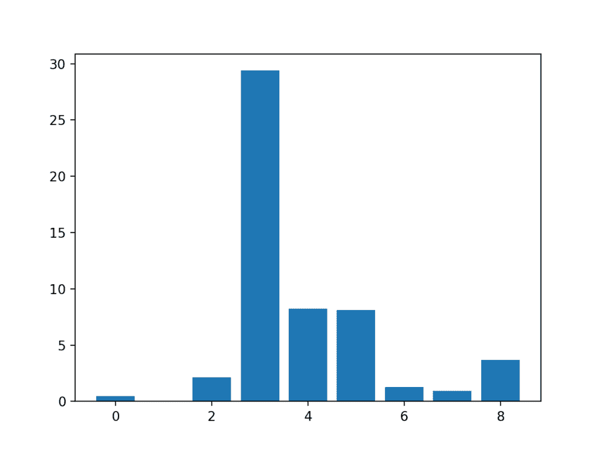
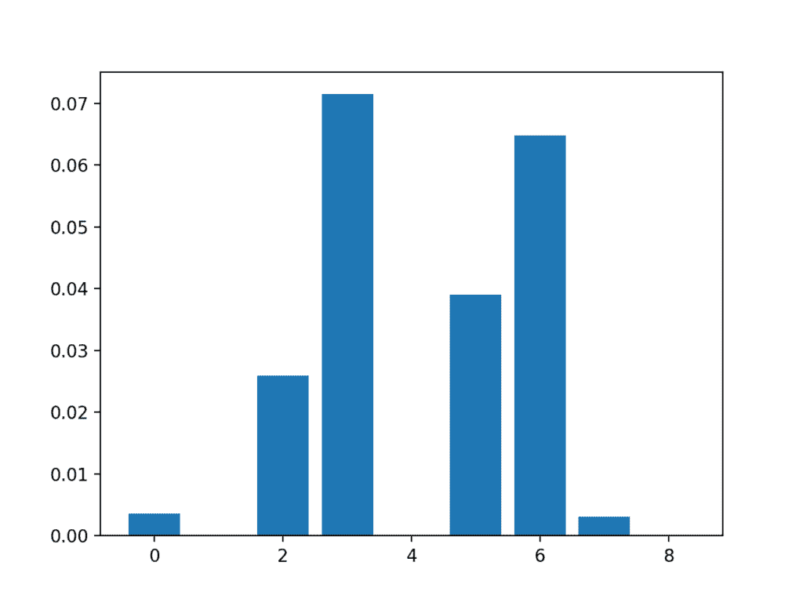

# 如何用分类数据进行特征选择

> 原文:[https://machinelearning master . com/特征选择-带分类数据/](https://machinelearningmastery.com/feature-selection-with-categorical-data/)

最后更新于 2020 年 8 月 18 日

[特征选择](https://machinelearningmastery.com/an-introduction-to-feature-selection/)是识别和选择与目标变量最相关的输入特征子集的过程。

在处理实值数据时，特征选择通常很简单，例如使用皮尔逊相关系数，但在处理分类数据时可能很有挑战性。

当目标变量也是分类的时，分类输入数据最常用的两种特征选择方法是[卡方统计](https://machinelearningmastery.com/chi-squared-test-for-machine-learning/)和[互信息统计](https://machinelearningmastery.com/information-gain-and-mutual-information)。

在本教程中，您将了解如何使用分类输入数据执行要素选择。

完成本教程后，您将知道:

*   具有分类输入和二元分类目标变量的乳腺癌预测建模问题。
*   如何利用卡方统计和互信息统计评估分类特征的重要性。
*   在拟合和评估分类模型时，如何对分类数据进行特征选择。

**用我的新书[机器学习的数据准备](https://machinelearningmastery.com/data-preparation-for-machine-learning/)启动你的项目**，包括*分步教程*和所有示例的 *Python 源代码*文件。

我们开始吧。


如何使用分类数据进行特征选择
图片由[菲尔杜比](https://flickr.com/photos/126654539@N08/16021168888/)提供，保留部分权利。

## 教程概述

本教程分为三个部分；它们是:

1.  乳腺癌分类数据集
2.  分类特征选择
    1.  卡方特征选择
    2.  互信息特征选择
3.  使用选定特征建模
    1.  使用所有功能构建的模型
    2.  使用卡方特征建立的模型
    3.  利用互信息特征建立的模型

## 乳腺癌分类数据集

作为本教程的基础，我们将使用自 20 世纪 80 年代以来作为机器学习数据集被广泛研究的所谓的“[乳腺癌](https://archive.ics.uci.edu/ml/datasets/Breast+Cancer)”数据集。

数据集将乳腺癌患者数据分类为癌症复发或不复发。有 286 个例子和 9 个输入变量。这是一个二元分类问题。

一个简单的模型在这个数据集上可以达到 70%的准确率。好的分数大约是 76% +/- 3%。我们将针对该地区，但请注意，本教程中的模型没有优化；它们旨在演示编码方案。

您可以下载数据集，并将文件保存为当前工作目录中的“*乳腺癌. csv* ”。

*   [乳腺癌数据集(乳腺癌. csv)](https://raw.githubusercontent.com/jbrownlee/Datasets/master/breast-cancer.csv)

查看数据，我们可以看到所有九个输入变量都是绝对的。

具体来说，所有变量都是带引号的字符串；有些是序数，有些不是。

```py
'40-49','premeno','15-19','0-2','yes','3','right','left_up','no','recurrence-events'
'50-59','ge40','15-19','0-2','no','1','right','central','no','no-recurrence-events'
'50-59','ge40','35-39','0-2','no','2','left','left_low','no','recurrence-events'
'40-49','premeno','35-39','0-2','yes','3','right','left_low','yes','no-recurrence-events'
'40-49','premeno','30-34','3-5','yes','2','left','right_up','no','recurrence-events'
...
```

我们可以使用熊猫库将这个数据集加载到内存中。

```py
...
# load the dataset as a pandas DataFrame
data = read_csv(filename, header=None)
# retrieve numpy array
dataset = data.values
```

加载后，我们可以将列拆分为输入( *X* )和输出进行建模。

```py
...
# split into input (X) and output (y) variables
X = dataset[:, :-1]
y = dataset[:,-1]
```

最后，我们可以强制输入数据中的所有字段都是字符串，以防 Pandas 尝试自动将一些字段映射到数字(它确实尝试了)。

```py
...
# format all fields as string
X = X.astype(str)
```

我们可以将所有这些结合到一个有用的函数中，以便以后重用。

```py
# load the dataset
def load_dataset(filename):
	# load the dataset as a pandas DataFrame
	data = read_csv(filename, header=None)
	# retrieve numpy array
	dataset = data.values
	# split into input (X) and output (y) variables
	X = dataset[:, :-1]
	y = dataset[:,-1]
	# format all fields as string
	X = X.astype(str)
	return X, y
```

加载后，我们可以将数据分成训练集和测试集，这样我们就可以拟合和评估学习模型。

我们将使用 [train_test_split()函数](https://scikit-learn.org/stable/modules/generated/sklearn.model_selection.train_test_split.html)形成 scikit-learn，使用 67%的数据进行训练，33%的数据进行测试。

```py
...
# load the dataset
X, y = load_dataset('breast-cancer.csv')
# split into train and test sets
X_train, X_test, y_train, y_test = train_test_split(X, y, test_size=0.33, random_state=1)
```

将所有这些元素结合在一起，下面列出了加载、拆分和汇总原始分类数据集的完整示例。

```py
# load and summarize the dataset
from pandas import read_csv
from sklearn.model_selection import train_test_split

# load the dataset
def load_dataset(filename):
	# load the dataset as a pandas DataFrame
	data = read_csv(filename, header=None)
	# retrieve numpy array
	dataset = data.values
	# split into input (X) and output (y) variables
	X = dataset[:, :-1]
	y = dataset[:,-1]
	# format all fields as string
	X = X.astype(str)
	return X, y

# load the dataset
X, y = load_dataset('breast-cancer.csv')
# split into train and test sets
X_train, X_test, y_train, y_test = train_test_split(X, y, test_size=0.33, random_state=1)
# summarize
print('Train', X_train.shape, y_train.shape)
print('Test', X_test.shape, y_test.shape)
```

运行该示例会报告训练集和测试集的输入和输出元素的大小。

我们可以看到，我们有 191 个示例用于培训，95 个示例用于测试。

```py
Train (191, 9) (191, 1)
Test (95, 9) (95, 1)
```

现在我们已经熟悉了数据集，让我们看看如何对它进行编码以进行建模。

我们可以使用 scikit-learn 中的[序数编码器()将每个变量编码为整数。这是一个灵活的类，如果已知任何这样的顺序，它确实允许将类别的顺序指定为参数。](https://scikit-learn.org/stable/modules/generated/sklearn.preprocessing.OrdinalEncoder.html)

**注**:我将把它作为一个练习留给你来更新下面的例子，尝试为那些具有自然顺序的变量指定顺序，看看它是否对模型性能有影响。

对变量进行编码的最佳实践是在训练数据集上进行编码，然后将其应用于训练和测试数据集。

下面名为 *prepare_inputs()* 的函数获取列车和测试集的输入数据，并使用顺序编码对其进行编码。

```py
# prepare input data
def prepare_inputs(X_train, X_test):
	oe = OrdinalEncoder()
	oe.fit(X_train)
	X_train_enc = oe.transform(X_train)
	X_test_enc = oe.transform(X_test)
	return X_train_enc, X_test_enc
```

我们还需要准备目标变量。

这是一个二元分类问题，所以我们需要将两个类标签映射为 0 和 1。这是一种序数编码，scikit-learn 提供了专门为此目的设计的 [LabelEncoder](https://scikit-learn.org/stable/modules/generated/sklearn.preprocessing.LabelEncoder.html) 类。虽然*标签编码器*是为编码单个变量而设计的，但是我们也可以很容易地使用*普通编码器*来获得同样的结果。

*prepare_targets()* 函数对列车和测试集的输出数据进行整数编码。

```py
# prepare target
def prepare_targets(y_train, y_test):
	le = LabelEncoder()
	le.fit(y_train)
	y_train_enc = le.transform(y_train)
	y_test_enc = le.transform(y_test)
	return y_train_enc, y_test_enc
```

我们可以调用这些函数来准备我们的数据。

```py
...
# prepare input data
X_train_enc, X_test_enc = prepare_inputs(X_train, X_test)
# prepare output data
y_train_enc, y_test_enc = prepare_targets(y_train, y_test)
```

将所有这些结合起来，下面列出了为乳腺癌分类数据集加载和编码输入和输出变量的完整示例。

```py
# example of loading and preparing the breast cancer dataset
from pandas import read_csv
from sklearn.model_selection import train_test_split
from sklearn.preprocessing import LabelEncoder
from sklearn.preprocessing import OrdinalEncoder

# load the dataset
def load_dataset(filename):
	# load the dataset as a pandas DataFrame
	data = read_csv(filename, header=None)
	# retrieve numpy array
	dataset = data.values
	# split into input (X) and output (y) variables
	X = dataset[:, :-1]
	y = dataset[:,-1]
	# format all fields as string
	X = X.astype(str)
	return X, y

# prepare input data
def prepare_inputs(X_train, X_test):
	oe = OrdinalEncoder()
	oe.fit(X_train)
	X_train_enc = oe.transform(X_train)
	X_test_enc = oe.transform(X_test)
	return X_train_enc, X_test_enc

# prepare target
def prepare_targets(y_train, y_test):
	le = LabelEncoder()
	le.fit(y_train)
	y_train_enc = le.transform(y_train)
	y_test_enc = le.transform(y_test)
	return y_train_enc, y_test_enc

# load the dataset
X, y = load_dataset('breast-cancer.csv')
# split into train and test sets
X_train, X_test, y_train, y_test = train_test_split(X, y, test_size=0.33, random_state=1)
# prepare input data
X_train_enc, X_test_enc = prepare_inputs(X_train, X_test)
# prepare output data
y_train_enc, y_test_enc = prepare_targets(y_train, y_test)
```

现在我们已经加载并准备了乳腺癌数据集，我们可以探索特征选择。

## 分类特征选择

有两种流行的特征选择技术可用于分类输入数据和分类(类)目标变量。

它们是:

*   卡方统计量。
*   互信息统计。

让我们依次仔细看看每一个。

### 卡方特征选择

皮尔逊的卡方统计假设检验是分类变量之间独立性检验的一个例子。

您可以在教程中了解有关此统计测试的更多信息:

*   [机器学习卡方检验的温和介绍](https://machinelearningmastery.com/chi-squared-test-for-machine-learning/)

该测试的结果可用于特征选择，其中那些独立于目标变量的特征可从数据集中移除。

> 当预测因子有三个或三个以上的水平时，预测因子和结果之间的关联程度可以用统计学方法来衡量，如 X2(卡方)检验…

—第 242 页，[特征工程与选择](https://amzn.to/2Yvcupn)，2019。

scikit-learn 机器库提供了 [chi2()函数](https://scikit-learn.org/stable/modules/generated/sklearn.feature_selection.chi2.html)中卡方测试的实现。该功能可用于特征选择策略，例如通过[选择最相关的特征(最大值)选择最相关的 *k* 类](https://scikit-learn.org/stable/modules/generated/sklearn.feature_selection.SelectKBest.html)。

例如，我们可以定义 *SelectKBest* 类来使用 *chi2()* 功能并选择所有特征，然后转换列车和测试集。

```py
...
fs = SelectKBest(score_func=chi2, k='all')
fs.fit(X_train, y_train)
X_train_fs = fs.transform(X_train)
X_test_fs = fs.transform(X_test)
```

然后，我们可以打印每个变量的分数(越大越好)，并将每个变量的分数绘制成条形图，以了解我们应该选择多少个特征。

```py
...
# what are scores for the features
for i in range(len(fs.scores_)):
	print('Feature %d: %f' % (i, fs.scores_[i]))
# plot the scores
pyplot.bar([i for i in range(len(fs.scores_))], fs.scores_)
pyplot.show()
```

将此与上一节中乳腺癌数据集的数据准备结合起来，下面列出了完整的示例。

```py
# example of chi squared feature selection for categorical data
from pandas import read_csv
from sklearn.model_selection import train_test_split
from sklearn.preprocessing import LabelEncoder
from sklearn.preprocessing import OrdinalEncoder
from sklearn.feature_selection import SelectKBest
from sklearn.feature_selection import chi2
from matplotlib import pyplot

# load the dataset
def load_dataset(filename):
	# load the dataset as a pandas DataFrame
	data = read_csv(filename, header=None)
	# retrieve numpy array
	dataset = data.values
	# split into input (X) and output (y) variables
	X = dataset[:, :-1]
	y = dataset[:,-1]
	# format all fields as string
	X = X.astype(str)
	return X, y

# prepare input data
def prepare_inputs(X_train, X_test):
	oe = OrdinalEncoder()
	oe.fit(X_train)
	X_train_enc = oe.transform(X_train)
	X_test_enc = oe.transform(X_test)
	return X_train_enc, X_test_enc

# prepare target
def prepare_targets(y_train, y_test):
	le = LabelEncoder()
	le.fit(y_train)
	y_train_enc = le.transform(y_train)
	y_test_enc = le.transform(y_test)
	return y_train_enc, y_test_enc

# feature selection
def select_features(X_train, y_train, X_test):
	fs = SelectKBest(score_func=chi2, k='all')
	fs.fit(X_train, y_train)
	X_train_fs = fs.transform(X_train)
	X_test_fs = fs.transform(X_test)
	return X_train_fs, X_test_fs, fs

# load the dataset
X, y = load_dataset('breast-cancer.csv')
# split into train and test sets
X_train, X_test, y_train, y_test = train_test_split(X, y, test_size=0.33, random_state=1)
# prepare input data
X_train_enc, X_test_enc = prepare_inputs(X_train, X_test)
# prepare output data
y_train_enc, y_test_enc = prepare_targets(y_train, y_test)
# feature selection
X_train_fs, X_test_fs, fs = select_features(X_train_enc, y_train_enc, X_test_enc)
# what are scores for the features
for i in range(len(fs.scores_)):
	print('Feature %d: %f' % (i, fs.scores_[i]))
# plot the scores
pyplot.bar([i for i in range(len(fs.scores_))], fs.scores_)
pyplot.show()
```

运行该示例首先打印为每个输入要素和目标变量计算的分数。

**注**:考虑到算法或评估程序的随机性，或数值精度的差异，您的[结果可能会有所不同](https://machinelearningmastery.com/different-results-each-time-in-machine-learning/)。考虑运行该示例几次，并比较平均结果。

在这种情况下，我们可以看到分数很小，很难仅从数字中得出哪个特征更相关的想法。

也许特性 3、4、5 和 8 最相关。

```py
Feature 0: 0.472553
Feature 1: 0.029193
Feature 2: 2.137658
Feature 3: 29.381059
Feature 4: 8.222601
Feature 5: 8.100183
Feature 6: 1.273822
Feature 7: 0.950682
Feature 8: 3.699989
```

创建每个输入要素的要素重要性得分的条形图。

这清楚地表明特征 3 可能是最相关的(根据卡方)，并且九个输入特征中可能有四个是最相关的。

我们可以在配置*选择测试*时设置 k=4，以选择前四个特征。



输入要素条形图(x)与卡方要素重要性条形图(y)

### 互信息特征选择

信息论领域的互信息是信息增益(通常用于构造决策树)在特征选择中的应用。

计算两个变量之间的互信息，并在已知另一个变量的值的情况下，测量一个变量不确定性的减少。

您可以在下面的教程中了解更多关于相互信息的信息。

*   [什么是机器学习的信息增益和互信息](https://machinelearningmastery.com/information-gain-and-mutual-information)

scikit-learn 机器学习库通过 [mutual_info_classif()函数](https://scikit-learn.org/stable/modules/generated/sklearn.feature_selection.mutual_info_classif.html)为特征选择提供了一个互信息的实现。

和 *chi2()* 一样，可以在 *SelectKBest* 特征选择策略(和其他策略)中使用。

```py
# feature selection
def select_features(X_train, y_train, X_test):
	fs = SelectKBest(score_func=mutual_info_classif, k='all')
	fs.fit(X_train, y_train)
	X_train_fs = fs.transform(X_train)
	X_test_fs = fs.transform(X_test)
	return X_train_fs, X_test_fs, fs
```

我们可以使用乳腺癌集的互信息来执行特征选择，并打印和绘制分数(越大越好)，就像我们在上一节中所做的那样。

下面列出了使用互信息进行分类特征选择的完整示例。

```py
# example of mutual information feature selection for categorical data
from pandas import read_csv
from sklearn.model_selection import train_test_split
from sklearn.preprocessing import LabelEncoder
from sklearn.preprocessing import OrdinalEncoder
from sklearn.feature_selection import SelectKBest
from sklearn.feature_selection import mutual_info_classif
from matplotlib import pyplot

# load the dataset
def load_dataset(filename):
	# load the dataset as a pandas DataFrame
	data = read_csv(filename, header=None)
	# retrieve numpy array
	dataset = data.values
	# split into input (X) and output (y) variables
	X = dataset[:, :-1]
	y = dataset[:,-1]
	# format all fields as string
	X = X.astype(str)
	return X, y

# prepare input data
def prepare_inputs(X_train, X_test):
	oe = OrdinalEncoder()
	oe.fit(X_train)
	X_train_enc = oe.transform(X_train)
	X_test_enc = oe.transform(X_test)
	return X_train_enc, X_test_enc

# prepare target
def prepare_targets(y_train, y_test):
	le = LabelEncoder()
	le.fit(y_train)
	y_train_enc = le.transform(y_train)
	y_test_enc = le.transform(y_test)
	return y_train_enc, y_test_enc

# feature selection
def select_features(X_train, y_train, X_test):
	fs = SelectKBest(score_func=mutual_info_classif, k='all')
	fs.fit(X_train, y_train)
	X_train_fs = fs.transform(X_train)
	X_test_fs = fs.transform(X_test)
	return X_train_fs, X_test_fs, fs

# load the dataset
X, y = load_dataset('breast-cancer.csv')
# split into train and test sets
X_train, X_test, y_train, y_test = train_test_split(X, y, test_size=0.33, random_state=1)
# prepare input data
X_train_enc, X_test_enc = prepare_inputs(X_train, X_test)
# prepare output data
y_train_enc, y_test_enc = prepare_targets(y_train, y_test)
# feature selection
X_train_fs, X_test_fs, fs = select_features(X_train_enc, y_train_enc, X_test_enc)
# what are scores for the features
for i in range(len(fs.scores_)):
	print('Feature %d: %f' % (i, fs.scores_[i]))
# plot the scores
pyplot.bar([i for i in range(len(fs.scores_))], fs.scores_)
pyplot.show()
```

运行该示例首先打印为每个输入要素和目标变量计算的分数。

**注**:考虑到算法或评估程序的随机性，或数值精度的差异，您的[结果可能会有所不同](https://machinelearningmastery.com/different-results-each-time-in-machine-learning/)。考虑运行该示例几次，并比较平均结果。

在这种情况下，我们可以看到一些特征的得分非常低，这表明它们可能可以被移除。

也许特性 3、6、2 和 5 最相关。

```py
Feature 0: 0.003588
Feature 1: 0.000000
Feature 2: 0.025934
Feature 3: 0.071461
Feature 4: 0.000000
Feature 5: 0.038973
Feature 6: 0.064759
Feature 7: 0.003068
Feature 8: 0.000000
```

创建每个输入要素的要素重要性得分的条形图。

重要的是，促进了不同功能的混合。



输入特征条形图(x)与互信息特征重要性条形图(y)

既然我们知道了如何对分类预测建模问题的分类数据执行特征选择，我们可以尝试使用所选特征开发模型并比较结果。

## 使用选定特征建模

有许多不同的技术用于对特征进行评分和基于评分选择特征；你怎么知道用哪个？

一种稳健的方法是使用不同的特征选择方法(和特征数量)来评估模型，并选择产生具有最佳性能的模型的方法。

在本节中，我们将评估一个逻辑回归模型，将所有特征与通过卡方选择的特征和通过互信息选择的特征构建的模型进行比较。

逻辑回归是测试特征选择方法的一个很好的模型，因为如果从模型中去除不相关的特征，它可以表现得更好。

### 使用所有功能构建的模型

作为第一步，我们将使用所有可用的特性来评估一个[物流配送](https://scikit-learn.org/stable/modules/generated/sklearn.linear_model.LogisticRegression.html)模型。

该模型适合训练数据集，并在测试数据集上进行评估。

下面列出了完整的示例。

```py
# evaluation of a model using all input features
from pandas import read_csv
from sklearn.preprocessing import LabelEncoder
from sklearn.preprocessing import OrdinalEncoder
from sklearn.model_selection import train_test_split
from sklearn.linear_model import LogisticRegression
from sklearn.metrics import accuracy_score

# load the dataset
def load_dataset(filename):
	# load the dataset as a pandas DataFrame
	data = read_csv(filename, header=None)
	# retrieve numpy array
	dataset = data.values
	# split into input (X) and output (y) variables
	X = dataset[:, :-1]
	y = dataset[:,-1]
	# format all fields as string
	X = X.astype(str)
	return X, y

# prepare input data
def prepare_inputs(X_train, X_test):
	oe = OrdinalEncoder()
	oe.fit(X_train)
	X_train_enc = oe.transform(X_train)
	X_test_enc = oe.transform(X_test)
	return X_train_enc, X_test_enc

# prepare target
def prepare_targets(y_train, y_test):
	le = LabelEncoder()
	le.fit(y_train)
	y_train_enc = le.transform(y_train)
	y_test_enc = le.transform(y_test)
	return y_train_enc, y_test_enc

# load the dataset
X, y = load_dataset('breast-cancer.csv')
# split into train and test sets
X_train, X_test, y_train, y_test = train_test_split(X, y, test_size=0.33, random_state=1)
# prepare input data
X_train_enc, X_test_enc = prepare_inputs(X_train, X_test)
# prepare output data
y_train_enc, y_test_enc = prepare_targets(y_train, y_test)
# fit the model
model = LogisticRegression(solver='lbfgs')
model.fit(X_train_enc, y_train_enc)
# evaluate the model
yhat = model.predict(X_test_enc)
# evaluate predictions
accuracy = accuracy_score(y_test_enc, yhat)
print('Accuracy: %.2f' % (accuracy*100))
```

运行该示例将打印训练数据集中模型的准确性。

**注**:考虑到算法或评估程序的随机性，或数值精度的差异，您的[结果可能会有所不同](https://machinelearningmastery.com/different-results-each-time-in-machine-learning/)。考虑运行该示例几次，并比较平均结果。

在这种情况下，我们可以看到该模型实现了大约 75%的分类准确率。

我们更喜欢使用达到与此相同或更好的分类精度的特征子集。

```py
Accuracy: 75.79
```

### 使用卡方特征建立的模型

我们可以使用卡方检验对特征进行评分，并选择四个最相关的特征。

下面的 *select_features()* 功能被更新以实现这一点。

```py
# feature selection
def select_features(X_train, y_train, X_test):
	fs = SelectKBest(score_func=chi2, k=4)
	fs.fit(X_train, y_train)
	X_train_fs = fs.transform(X_train)
	X_test_fs = fs.transform(X_test)
	return X_train_fs, X_test_fs
```

下面列出了使用此特征选择方法评估逻辑回归模型拟合和评估数据的完整示例。

```py
# evaluation of a model fit using chi squared input features
from pandas import read_csv
from sklearn.preprocessing import LabelEncoder
from sklearn.preprocessing import OrdinalEncoder
from sklearn.feature_selection import SelectKBest
from sklearn.feature_selection import chi2
from sklearn.model_selection import train_test_split
from sklearn.linear_model import LogisticRegression
from sklearn.metrics import accuracy_score

# load the dataset
def load_dataset(filename):
	# load the dataset as a pandas DataFrame
	data = read_csv(filename, header=None)
	# retrieve numpy array
	dataset = data.values
	# split into input (X) and output (y) variables
	X = dataset[:, :-1]
	y = dataset[:,-1]
	# format all fields as string
	X = X.astype(str)
	return X, y

# prepare input data
def prepare_inputs(X_train, X_test):
	oe = OrdinalEncoder()
	oe.fit(X_train)
	X_train_enc = oe.transform(X_train)
	X_test_enc = oe.transform(X_test)
	return X_train_enc, X_test_enc

# prepare target
def prepare_targets(y_train, y_test):
	le = LabelEncoder()
	le.fit(y_train)
	y_train_enc = le.transform(y_train)
	y_test_enc = le.transform(y_test)
	return y_train_enc, y_test_enc

# feature selection
def select_features(X_train, y_train, X_test):
	fs = SelectKBest(score_func=chi2, k=4)
	fs.fit(X_train, y_train)
	X_train_fs = fs.transform(X_train)
	X_test_fs = fs.transform(X_test)
	return X_train_fs, X_test_fs

# load the dataset
X, y = load_dataset('breast-cancer.csv')
# split into train and test sets
X_train, X_test, y_train, y_test = train_test_split(X, y, test_size=0.33, random_state=1)
# prepare input data
X_train_enc, X_test_enc = prepare_inputs(X_train, X_test)
# prepare output data
y_train_enc, y_test_enc = prepare_targets(y_train, y_test)
# feature selection
X_train_fs, X_test_fs = select_features(X_train_enc, y_train_enc, X_test_enc)
# fit the model
model = LogisticRegression(solver='lbfgs')
model.fit(X_train_fs, y_train_enc)
# evaluate the model
yhat = model.predict(X_test_fs)
# evaluate predictions
accuracy = accuracy_score(y_test_enc, yhat)
print('Accuracy: %.2f' % (accuracy*100))
```

运行该示例报告了模型在使用卡方统计选择的九个输入要素中的四个要素上的性能。

**注**:考虑到算法或评估程序的随机性，或数值精度的差异，您的[结果可能会有所不同](https://machinelearningmastery.com/different-results-each-time-in-machine-learning/)。考虑运行该示例几次，并比较平均结果。

在这种情况下，我们看到模型达到了大约 74%的准确率，性能略有下降。

事实上，删除的一些功能可能会直接或与所选功能一起增加价值。

在这个阶段，我们可能更喜欢使用所有的输入特性。

```py
Accuracy: 74.74
```

### 利用互信息特征建立的模型

我们可以重复实验，并使用互信息统计选择前四个特征。

下面列出了实现此功能的 *select_features()* 功能的更新版本。

```py
# feature selection
def select_features(X_train, y_train, X_test):
	fs = SelectKBest(score_func=mutual_info_classif, k=4)
	fs.fit(X_train, y_train)
	X_train_fs = fs.transform(X_train)
	X_test_fs = fs.transform(X_test)
	return X_train_fs, X_test_fs
```

下面列出了使用互信息进行特征选择以拟合逻辑回归模型的完整示例。

```py
# evaluation of a model fit using mutual information input features
from pandas import read_csv
from sklearn.preprocessing import LabelEncoder
from sklearn.preprocessing import OrdinalEncoder
from sklearn.feature_selection import SelectKBest
from sklearn.feature_selection import mutual_info_classif
from sklearn.model_selection import train_test_split
from sklearn.linear_model import LogisticRegression
from sklearn.metrics import accuracy_score

# load the dataset
def load_dataset(filename):
	# load the dataset as a pandas DataFrame
	data = read_csv(filename, header=None)
	# retrieve numpy array
	dataset = data.values
	# split into input (X) and output (y) variables
	X = dataset[:, :-1]
	y = dataset[:,-1]
	# format all fields as string
	X = X.astype(str)
	return X, y

# prepare input data
def prepare_inputs(X_train, X_test):
	oe = OrdinalEncoder()
	oe.fit(X_train)
	X_train_enc = oe.transform(X_train)
	X_test_enc = oe.transform(X_test)
	return X_train_enc, X_test_enc

# prepare target
def prepare_targets(y_train, y_test):
	le = LabelEncoder()
	le.fit(y_train)
	y_train_enc = le.transform(y_train)
	y_test_enc = le.transform(y_test)
	return y_train_enc, y_test_enc

# feature selection
def select_features(X_train, y_train, X_test):
	fs = SelectKBest(score_func=mutual_info_classif, k=4)
	fs.fit(X_train, y_train)
	X_train_fs = fs.transform(X_train)
	X_test_fs = fs.transform(X_test)
	return X_train_fs, X_test_fs

# load the dataset
X, y = load_dataset('breast-cancer.csv')
# split into train and test sets
X_train, X_test, y_train, y_test = train_test_split(X, y, test_size=0.33, random_state=1)
# prepare input data
X_train_enc, X_test_enc = prepare_inputs(X_train, X_test)
# prepare output data
y_train_enc, y_test_enc = prepare_targets(y_train, y_test)
# feature selection
X_train_fs, X_test_fs = select_features(X_train_enc, y_train_enc, X_test_enc)
# fit the model
model = LogisticRegression(solver='lbfgs')
model.fit(X_train_fs, y_train_enc)
# evaluate the model
yhat = model.predict(X_test_fs)
# evaluate predictions
accuracy = accuracy_score(y_test_enc, yhat)
print('Accuracy: %.2f' % (accuracy*100))
```

运行该示例使模型适合使用互信息选择的四个顶级选定要素。

**注**:考虑到算法或评估程序的随机性，或数值精度的差异，您的[结果可能会有所不同](https://machinelearningmastery.com/different-results-each-time-in-machine-learning/)。考虑运行该示例几次，并比较平均结果。

在这种情况下，我们可以看到分类准确率小幅提升至 76%。

为了确保效果是真实的，将每个实验重复多次并比较平均性能将是一个好主意。探索使用 k-fold 交叉验证而不是简单的训练/测试分割可能也是一个好主意。

```py
Accuracy: 76.84
```

## 进一步阅读

如果您想更深入地了解这个主题，本节将提供更多资源。

### 邮件

*   [机器学习卡方检验的温和介绍](https://machinelearningmastery.com/chi-squared-test-for-machine-learning/)
*   [特征选择介绍](https://machinelearningmastery.com/an-introduction-to-feature-selection/)
*   [Python 中机器学习的特征选择](https://machinelearningmastery.com/feature-selection-machine-learning-python/)
*   [什么是机器学习的信息增益和互信息](https://machinelearningmastery.com/information-gain-and-mutual-information)

### 书

*   [特征工程与选择](https://amzn.to/2Yvcupn)，2019。

### 应用程序接口

*   [sklearn . model _ selection . train _ test _ split API](https://scikit-learn.org/stable/modules/generated/sklearn.model_selection.train_test_split.html)。
*   [硬化。预处理。序编码器 API](https://scikit-learn.org/stable/modules/generated/sklearn.preprocessing.OrdinalEncoder.html) 。
*   硬化。预处理。标签编码 API 。
*   [sklearn . feature _ selection . chi2 API](https://scikit-learn.org/stable/modules/generated/sklearn.feature_selection.chi2.html)
*   [硬化. feature_selection。SelectKBest API](https://scikit-learn.org/stable/modules/generated/sklearn.feature_selection.SelectKBest.html)
*   [sklearn . feature _ selection . mutual _ info _ class if API](https://scikit-learn.org/stable/modules/generated/sklearn.feature_selection.mutual_info_classif.html)。
*   [sklearn.linear_model。物流配送应用编程接口](https://scikit-learn.org/stable/modules/generated/sklearn.linear_model.LogisticRegression.html)。

### 文章

*   [乳腺癌数据集，UCI 机器学习资源库](https://archive.ics.uci.edu/ml/datasets/Breast+Cancer)。
*   [乳腺癌原始数据集](https://raw.githubusercontent.com/jbrownlee/Datasets/master/breast-cancer.csv)
*   [乳腺癌描述](https://github.com/jbrownlee/Datasets/blob/master/breast-cancer.names)

## 摘要

在本教程中，您发现了如何使用分类输入数据执行要素选择。

具体来说，您了解到:

*   具有分类输入和二元分类目标变量的乳腺癌预测建模问题。
*   如何利用卡方统计和互信息统计评估分类特征的重要性。
*   在拟合和评估分类模型时，如何对分类数据进行特征选择。

你有什么问题吗？
在下面的评论中提问，我会尽力回答。