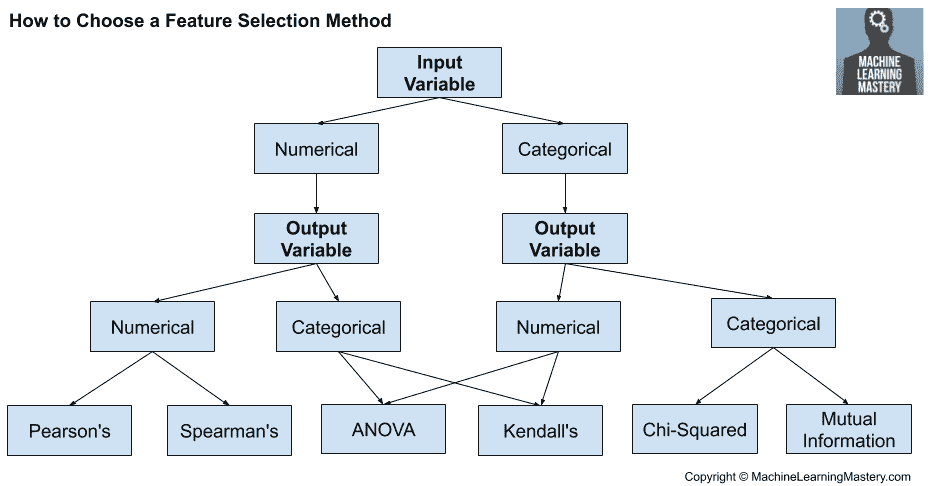

# 如何选择机器学习的特征选择方法

> 原文:[https://machinelearning master . com/特征选择-带有真实和分类数据/](https://machinelearningmastery.com/feature-selection-with-real-and-categorical-data/)

最后更新于 2020 年 8 月 20 日

**特征选择**是开发预测模型时减少输入变量数量的过程。

希望减少输入变量的数量，以降低建模的计算成本，并在某些情况下提高模型的性能。

基于统计的特征选择方法包括使用统计评估每个输入变量和目标变量之间的关系，并选择那些与目标变量具有最强关系的输入变量。这些方法可以快速有效，尽管统计方法的选择取决于输入和输出变量的数据类型。

因此，对于机器学习从业者来说，在执行基于过滤器的特征选择时，为数据集选择适当的统计度量是具有挑战性的。

在这篇文章中，您将发现如何使用数字和分类数据为基于过滤器的特征选择选择统计度量。

看完这篇文章，你会知道:

*   特征选择技术主要有两种类型:有监督和无监督，有监督的方法可以分为包装器、过滤器和内在的。
*   基于过滤器的特征选择方法使用统计测量来对输入变量之间的相关性或依赖性进行评分，这些输入变量可以被过滤以选择最相关的特征。
*   必须根据输入变量和输出或响应变量的数据类型仔细选择特征选择的统计度量。

**用我的新书[机器学习的数据准备](https://machinelearningmastery.com/data-preparation-for-machine-learning/)启动你的项目**，包括*分步教程*和所有示例的 *Python 源代码*文件。

我们开始吧。

*   **2019 年 11 月更新**:增加了一些分类回归的工作示例。
*   **2020 年 5 月更新**:扩展增加参考文献。添加了图片。


如何开发乳腺癌患者生存概率模型
图片由 Tanja-Milfoil 提供，保留部分权利。

## 概观

本教程分为 4 个部分；它们是:

1.  特征选择方法
2.  过滤器特征选择方法的统计信息
    1.  数字输入，数字输出
    2.  数字输入，分类输出
    3.  分类输入，数字输出
    4.  分类输入，分类输出
3.  功能选择的提示和技巧
    1.  相关统计
    2.  选择方法
    3.  转换变量
    4.  什么是最好的方法？
4.  工作示例
    1.  回归特征选择
    2.  分类特征选择

## 1.特征选择方法

**特征选择**方法旨在将输入变量的数量减少到被认为对模型最有用的数量，以便预测目标变量。

> 特征选择主要集中于从模型中去除无信息或冗余的预测因子。

—第 488 页，[应用预测建模](https://amzn.to/3b2LHTL)，2013 年。

一些预测建模问题具有大量的变量，这会减慢模型的开发和训练，并且需要大量的系统内存。此外，当包含与目标变量无关的输入变量时，某些模型的性能可能会下降。

> 许多模型，尤其是那些基于回归斜率和截距的模型，将为模型中的每个项估计参数。因此，非信息变量的存在会增加预测的不确定性，降低模型的整体有效性。

—第 488 页，[应用预测建模](https://amzn.to/3b2LHTL)，2013 年。

思考特征选择方法的一种方式是根据**有监督的**和**无监督的**方法。

> 特征选择的一个重要区别是有监督和无监督的方法。当在排除预测因子的过程中忽略结果时，该技术是无监督的。

—第 488 页，[应用预测建模](https://amzn.to/3b2LHTL)，2013 年。

区别在于是否基于目标变量选择特征。无监督特征选择技术忽略目标变量，例如使用相关性去除冗余变量的方法。监督特征选择技术使用目标变量，例如去除无关变量的方法..

考虑用于选择特征的机制的另一种方式可以分为**包装**和**过滤**方法。这些方法几乎总是受监督的，并且是基于结果模型在等待数据集上的性能来评估的。

包装器特征选择方法创建许多具有不同输入特征子集的模型，并根据性能度量选择那些导致最佳性能模型的特征。这些方法与变量类型无关，尽管它们在计算上很昂贵。 [RFE](https://scikit-learn.org/stable/modules/generated/sklearn.feature_selection.RFE.html) 是包装器特征选择方法的一个很好的例子。

> 包装器方法使用添加和/或移除预测器的过程来评估多个模型，以找到最大化模型性能的最佳组合。

—第 490 页，[应用预测建模](https://amzn.to/2Q1EONw)，2013 年。

过滤器特征选择方法使用统计技术来评估每个输入变量和目标变量之间的关系，并且这些分数被用作选择(过滤)将在模型中使用的那些输入变量的基础。

> 过滤方法评估预测模型之外的预测因子的相关性，随后只对通过某些标准的预测因子建模。

—第 490 页，[应用预测建模](https://amzn.to/2Q1EONw)，2013 年。

最后，有一些机器学习算法自动执行特征选择，作为学习模型的一部分。我们可以将这些技术称为**内在**特征选择方法。

> ……有些模型包含内置的特征选择，这意味着模型将只包含有助于最大限度提高精度的预测器。在这些情况下，模型可以挑选数据的最佳表示。

—第 28 页，[应用预测建模](https://amzn.to/3b2LHTL)，2013 年。

这包括像套索和决策树这样的惩罚回归模型的算法，包括像随机森林这样的决策树的集合。

> 一些模型对非信息预测因子有天然的抵抗力。基于树和规则的模型，例如 MARS 和套索，本质上进行特征选择。

—第 487 页，[应用预测建模](https://amzn.to/3b2LHTL)，2013 年。

特征选择也与[降维](https://machinelearningmastery.com/dimensionality-reduction-for-machine-learning/)技术相关，因为这两种方法都为预测模型寻找较少的输入变量。不同之处在于，特征选择选择要保留或从数据集中移除的特征，而降维创建数据的投影，从而产生全新的输入特征。因此，降维是特征选择的替代，而不是一种特征选择。

我们可以将特征选择总结如下。

*   **特征选择**:从数据集中选择输入特征的子集。
    *   **无监督**:不要使用目标变量(如去掉冗余变量)。
        *   相互关系
    *   **有监督的**:使用目标变量(如去掉无关变量)。
        *   **包装器**:搜索表现良好的特征子集。
            *   RFE
        *   **过滤**:根据特征与目标的关系选择特征子集。
            *   统计方法
            *   特征重要性方法
        *   **内在**:在训练过程中执行自动特征选择的算法。
            *   决策树
*   **降维**:将输入数据投影到低维特征空间。

下图提供了这种层次特征选择技术的概要。


特征选择技术综述

在下一节中，我们将回顾一些统计度量，这些度量可用于不同输入和输出变量数据类型的基于过滤器的特征选择。

## 2.基于过滤器的特征选择方法的统计

通常使用输入和输出变量之间的相关性类型统计度量作为过滤器特征选择的基础。

因此，统计测量的选择高度依赖于可变数据类型。

常见的数据类型包括数值型(如高度)和分类型(如标签)，尽管每种类型都可以进一步细分，如数值变量的整数和浮点型，分类变量的布尔型、序数型或标称型。

常见的输入变量数据类型:

*   **数值变量**
    *   整数变量。
    *   浮点变量。
*   **分类变量**。
    *   布尔变量(二分)。
    *   序数变量。
    *   名义变量。


数据变量类型概述

对变量的数据类型了解越多，就越容易为基于过滤器的特征选择方法选择合适的统计度量。

在本节中，我们将考虑两大类变量类型:数值型和分类型；还有，要考虑的两组主要变量:投入和产出。

输入变量是作为模型输入提供的变量。在特征选择中，我们希望减少的是这组变量。输出变量是模型要预测的变量，通常称为响应变量。

响应变量的类型通常指示正在执行的预测建模问题的类型。例如，数字输出变量表示回归预测建模问题，分类输出变量表示分类预测建模问题。

*   **数值输出**:回归预测建模问题。
*   **分类输出**:分类预测建模问题。

基于过滤器的特征选择中使用的统计度量通常是一次用目标变量计算一个输入变量。因此，它们被称为单变量统计测量。这可能意味着在过滤过程中不考虑输入变量之间的任何交互。

> 这些技术中的大多数都是单变量的，这意味着它们单独评估每个预测因子。在这种情况下，相关预测因子的存在使得选择重要但冗余的预测因子成为可能。这个问题的明显后果是选择了太多的预测因子，结果出现了共线性问题。

—第 499 页，[应用预测建模](https://amzn.to/2Q1EONw)，2013 年。

有了这个框架，让我们回顾一些可以用于基于过滤器的特征选择的单变量统计度量。



如何选择机器学习的特征选择方法

### 数字输入，数字输出

这是一个带有数值输入变量的回归预测建模问题。

最常见的技术是使用相关系数，例如线性相关使用皮尔逊系数，非线性相关使用基于秩的方法。

*   皮尔逊相关系数(线性)。
*   斯皮尔曼秩系数(非线性)

### 数字输入，分类输出

这是一个带有数值输入变量的分类预测建模问题。

这可能是分类问题最常见的例子，

同样，最常见的技术是基于相关性的，尽管在这种情况下，它们必须考虑分类目标。

*   方差分析相关系数(线性)。
*   肯德尔秩系数(非线性)。

肯德尔确实假设分类变量是序数。

### 分类输入，数字输出

这是一个带有分类输入变量的回归预测建模问题。

这是一个回归问题的奇怪例子(例如，你不会经常遇到它)。

尽管如此，您可以使用相同的“*数值输入，分类输出*”方法(如上所述)，但方向相反。

### 分类输入，分类输出

这是一个带有分类输入变量的分类预测建模问题。

分类数据最常见的相关测量是[卡方检验](https://machinelearningmastery.com/chi-squared-test-for-machine-learning/)。也可以用信息论领域的互信息(信息增益)。

*   卡方检验(列联表)。
*   相互信息。

事实上，互信息是一种强大的方法，可能对分类和数字数据都有用，例如，它对数据类型是不可知的。

## 3.功能选择的提示和技巧

本节提供了使用基于过滤器的功能选择时的一些附加注意事项。

### 相关统计

scikit-learn 库提供了大多数有用的统计方法的实现。

例如:

*   皮尔逊相关系数:[f _ 回归()](https://scikit-learn.org/stable/modules/generated/sklearn.feature_selection.f_regression.html)
*   注释:[f _ classic()](https://scikit-learn.org/stable/modules/generated/sklearn.feature_selection.f_classif.html)
*   卡方: [chi2()](https://scikit-learn.org/stable/modules/generated/sklearn.feature_selection.chi2.html)
*   相互信息:[相互信息类()](https://scikit-learn.org/stable/modules/generated/sklearn.feature_selection.mutual_info_classif.html)和[相互信息回归()](https://scikit-learn.org/stable/modules/generated/sklearn.feature_selection.mutual_info_regression.html)

此外，SciPy 库还提供了更多统计信息的实现，例如肯德尔τ([肯德尔τ](https://docs.scipy.org/doc/scipy/reference/generated/scipy.stats.kendalltau.html))和斯皮尔曼等级相关性([斯皮尔曼](https://docs.scipy.org/doc/scipy/reference/generated/scipy.stats.spearmanr.html))。

### 选择方法

一旦为目标的每个输入变量计算了统计数据，scikit-learn 库还提供了许多不同的过滤方法。

两种比较流行的方法包括:

*   选择前 k 个变量:[选择测试](https://scikit-learn.org/stable/modules/generated/sklearn.feature_selection.SelectKBest.html)
*   选择最高百分位变量:[选择百分位](https://scikit-learn.org/stable/modules/generated/sklearn.feature_selection.SelectPercentile.html)

我自己经常使用 *SelectKBest* 。

### 转换变量

考虑转换变量，以便访问不同的统计方法。

例如，您可以将一个分类变量转换为序数，即使它不是，并看看是否有任何有趣的结果出来。

您也可以将数值变量离散化(例如，箱)；尝试基于分类的测量。

一些统计测量假设变量的属性，例如皮尔逊假设观测值的高斯概率分布和线性关系。您可以转换数据以满足测试的期望，并尝试测试而不考虑期望并比较结果。

### 什么是最好的方法？

没有最佳的特征选择方法。

就像没有最好的输入变量集或最好的机器学习算法一样。至少不是普遍的。

相反，你必须通过仔细系统的实验来发现什么最适合你的具体问题。

尝试一系列不同的模型，适合通过不同的统计方法选择的不同特征子集，并发现什么最适合您的特定问题。

## 4.功能选择的工作示例

有一些可以复制粘贴并适合自己项目的工作示例可能会很有帮助。

本节提供了可用作起点的功能选择案例的工作示例。

### 回归特征选择:
( *数值输入，数值输出*

本节演示了作为数字输入和数字输出的回归问题的特征选择。

使用[make _ revolution()函数](https://scikit-learn.org/stable/modules/generated/sklearn.datasets.make_regression.html)准备一个测试回归问题。

通过[f _ 回归()](https://scikit-learn.org/stable/modules/generated/sklearn.feature_selection.f_regression.html)函数使用[皮尔逊相关系数](https://en.wikipedia.org/wiki/Pearson_correlation_coefficient)进行特征选择。

```
# pearson's correlation feature selection for numeric input and numeric output
from sklearn.datasets import make_regression
from sklearn.feature_selection import SelectKBest
from sklearn.feature_selection import f_regression
# generate dataset
X, y = make_regression(n_samples=100, n_features=100, n_informative=10)
# define feature selection
fs = SelectKBest(score_func=f_regression, k=10)
# apply feature selection
X_selected = fs.fit_transform(X, y)
print(X_selected.shape)
```

运行该示例首先创建回归数据集，然后定义要素选择并将要素选择过程应用于数据集，返回所选输入要素的子集。

```
(100, 10)
```

### 分类特征选择:
( *数值输入，分类输出*

本节演示了作为数字输入和分类输出的分类问题的特征选择。

使用 [make_classification()](https://scikit-learn.org/stable/modules/generated/sklearn.datasets.make_classification.html) 函数准备一个测试回归问题。

通过 [f_classif()](https://scikit-learn.org/stable/modules/generated/sklearn.feature_selection.f_classif.html) 功能，使用[方差分析 F 测量](https://en.wikipedia.org/wiki/F-test)进行特征选择。

```
# ANOVA feature selection for numeric input and categorical output
from sklearn.datasets import make_classification
from sklearn.feature_selection import SelectKBest
from sklearn.feature_selection import f_classif
# generate dataset
X, y = make_classification(n_samples=100, n_features=20, n_informative=2)
# define feature selection
fs = SelectKBest(score_func=f_classif, k=2)
# apply feature selection
X_selected = fs.fit_transform(X, y)
print(X_selected.shape)
```

运行该示例首先创建分类数据集，然后定义要素选择并将要素选择过程应用于数据集，返回所选输入要素的子集。

```
(100, 2)
```

### 分类特征选择:
( *分类输入，分类输出*

有关分类输入和分类输出的特征选择示例，请参见教程:

*   [如何用分类数据进行特征选择](https://machinelearningmastery.com/feature-selection-with-categorical-data/)

## 进一步阅读

如果您想更深入地了解这个主题，本节将提供更多资源。

### 教程

*   [如何在 Python 中计算非参数秩相关](https://machinelearningmastery.com/how-to-calculate-nonparametric-rank-correlation-in-python/)
*   [如何在 Python 中计算变量之间的相关性](https://machinelearningmastery.com/how-to-use-correlation-to-understand-the-relationship-between-variables/)
*   [Python 中机器学习的特征选择](https://machinelearningmastery.com/feature-selection-machine-learning-python/)
*   [特征选择介绍](https://machinelearningmastery.com/an-introduction-to-feature-selection/)

### 书

*   [应用预测建模](https://amzn.to/3b2LHTL)，2013。
*   [特征工程与选择](https://amzn.to/2Yvcupn)，2019。
*   [机器学习的特征工程](https://amzn.to/2zZOQXN)，2018。

### 文章

*   [功能选择，scikit-learn API](https://scikit-learn.org/stable/modules/feature_selection.html) 。
*   [分类数据有哪些特征选择选项？Quora](https://www.quora.com/What-are-the-feature-selection-options-for-categorical-data) 。

## 摘要

在这篇文章中，您发现了如何使用数字和分类数据为基于过滤器的特征选择选择统计度量。

具体来说，您了解到:

*   特征选择技术主要有两种类型:有监督和无监督，有监督的方法可以分为包装器、过滤器和内在的。
*   基于过滤器的特征选择方法使用统计测量来对输入变量之间的相关性或依赖性进行评分，这些输入变量可以被过滤以选择最相关的特征。
*   必须根据输入变量和输出或响应变量的数据类型仔细选择特征选择的统计度量。

**你有什么问题吗？**
在下面的评论中提问，我会尽力回答。