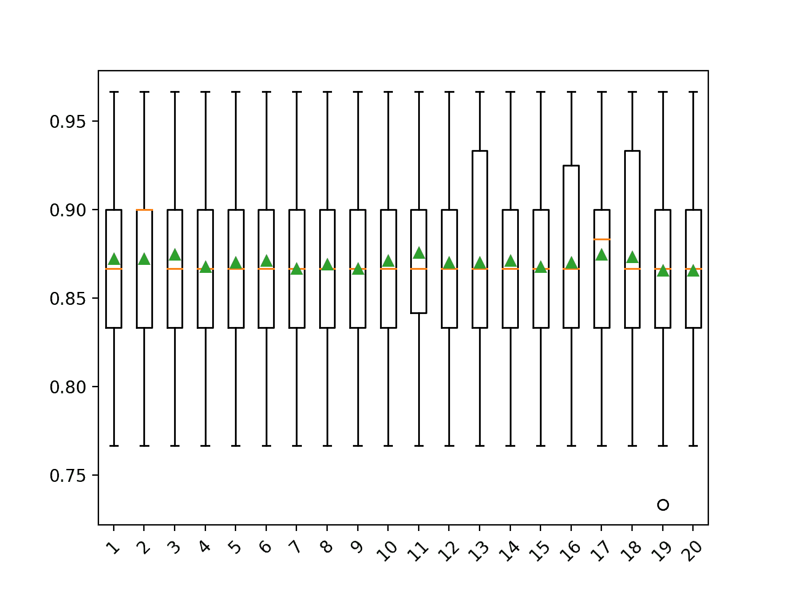

# 机器学习中缺失值的迭代插补

> 原文:[https://machinelearning master . com/机器学习中缺失值的迭代插补/](https://machinelearningmastery.com/iterative-imputation-for-missing-values-in-machine-learning/)

最后更新于 2020 年 8 月 18 日

数据集可能会有缺失值，这可能会给许多机器学习算法带来问题。

因此，在对预测任务建模之前，识别并替换输入数据中每一列的缺失值是一种很好的做法。这被称为缺失数据插补，简称为插补。

一种复杂的方法包括定义一个模型来预测每个缺失的特征，作为所有其他特征的函数，并多次重复这个估计特征值的过程。该重复允许在预测缺失值的后续迭代中使用其他特征的精确估计值作为输入。这通常被称为迭代插补。

在本教程中，您将发现如何在机器学习中对缺失数据使用迭代插补策略。

完成本教程后，您将知道:

*   缺少的值必须用 NaN 值标记，并且可以用迭代估计值替换。
*   如何加载缺失值的 CSV 值并用 NaN 值标记缺失值，并报告每列缺失值的数量和百分比。
*   在评估模型和拟合最终模型以对新数据进行预测时，如何使用迭代模型作为数据准备方法来估算缺失值。

**用我的新书[机器学习的数据准备](https://machinelearningmastery.com/data-preparation-for-machine-learning/)启动你的项目**，包括*分步教程*和所有示例的 *Python 源代码*文件。

我们开始吧。

*   **更新 6 月/2020** :更改了示例中用于预测的列。


机器学习中缺失值的迭代插补
图片由 [Gergely Csatari](https://flickr.com/photos/macskapocs/44808123531/) 提供，保留部分权利。

## 教程概述

本教程分为三个部分；它们是:

1.  迭代插补
2.  马结肠数据集
3.  用迭代插补器进行迭代插补
    1.  迭代输入数据转换
    2.  迭代估算器和模型评估
    3.  迭代插补器和不同的插补顺序
    4.  迭代估算器和不同的迭代次数
    5.  进行预测时的迭代估算变换

## 迭代插补

数据集可能缺少值。

这些数据行中的一个或多个值或列不存在。这些值可能完全丢失，或者用特殊字符或值标记，如问号“？”。

由于许多原因，这些值可能会丢失，通常是特定于问题域的，并且可能包括损坏的测量或不可用等原因。

大多数机器学习算法需要数字输入值，并且数据集中的每一行和每一列都需要一个值。因此，缺失值会给机器学习算法带来问题。

因此，识别数据集中缺失的值并用数值替换它们是很常见的。这被称为数据插补，或缺失数据插补。

一种估算缺失值的方法是使用**迭代估算模型**。

迭代插补是指将每个特征建模为其他特征的函数的过程，例如预测缺失值的回归问题。每个特征都是按顺序估算的，一个接一个，允许先前的估算值在预测后续特征时用作模型的一部分。

它是迭代的，因为这个过程被重复多次，允许随着所有特征的缺失值被估计，缺失值的改进估计被计算。

这种方法通常被称为完全条件规范(FCS)或链式方程多元插补(MICE)。

> 如果多元分布是对数据的合理描述，这种方法是有吸引力的。FCS 通过一组条件密度在逐个变量的基础上指定多元插补模型，每个不完全变量一个条件密度。从初始插补开始，FCS 通过迭代条件密度绘制插补。少量的迭代(比如 10-20 次)通常就足够了。

——[小鼠:R](https://www.jstatsoft.org/article/view/v045i03) 中链式方程的多元插补，2009。

可以使用不同的回归算法来估计每个特征的缺失值，尽管为了简单起见，通常使用线性方法。过程的迭代次数通常保持很少，例如 10 次。最后，可以考虑按顺序处理特征的顺序，例如从缺失值最少的特征到缺失值最多的特征。

现在我们已经熟悉了缺失值插补的迭代方法，让我们来看看一个缺失值的数据集。

## 马结肠数据集

马绞痛数据集描述了患有绞痛的马的医学特征以及它们是活的还是死的。

有 300 行 26 个输入变量和一个输出变量。这是一个二元分类预测任务，包括预测 1 如果马活了，2 如果马死了。

在这个数据集中，我们可以选择许多字段进行预测。在这种情况下，我们将预测问题是否是外科手术(列索引 23)，使其成为二元分类问题。

数据集的许多列都有许多缺失值，其中每个缺失值都用问号字符(“？”).

下面提供了数据集中带有标记缺失值的行的示例。

```
2,1,530101,38.50,66,28,3,3,?,2,5,4,4,?,?,?,3,5,45.00,8.40,?,?,2,2,11300,00000,00000,2
1,1,534817,39.2,88,20,?,?,4,1,3,4,2,?,?,?,4,2,50,85,2,2,3,2,02208,00000,00000,2
2,1,530334,38.30,40,24,1,1,3,1,3,3,1,?,?,?,1,1,33.00,6.70,?,?,1,2,00000,00000,00000,1
1,9,5290409,39.10,164,84,4,1,6,2,2,4,4,1,2,5.00,3,?,48.00,7.20,3,5.30,2,1,02208,00000,00000,1
...
```

您可以在此了解有关数据集的更多信息:

*   [马绞痛数据集](https://raw.githubusercontent.com/jbrownlee/Datasets/master/horse-colic.csv)
*   [马绞痛数据集描述](https://raw.githubusercontent.com/jbrownlee/Datasets/master/horse-colic.names)

不需要下载数据集，因为我们将在工作示例中自动下载它。

使用 Python 在加载的数据集中用 NaN(而不是数字)值标记缺失值是最佳实践。

我们可以使用 read_csv() Pandas 函数加载数据集，并指定“na_values”来加载“？”的值作为缺失，用 NaN 值标记。

```
...
# load dataset
url = 'https://raw.githubusercontent.com/jbrownlee/Datasets/master/horse-colic.csv'
dataframe = read_csv(url, header=None, na_values='?')
```

加载后，我们可以查看加载的数据以确认“？”值被标记为 NaN。

```
...
# summarize the first few rows
print(dataframe.head())
```

然后，我们可以枚举每一列，并报告该列缺少值的行数。

```
...
# summarize the number of rows with missing values for each column
for i in range(dataframe.shape[1]):
	# count number of rows with missing values
	n_miss = dataframe[[i]].isnull().sum()
	perc = n_miss / dataframe.shape[0] * 100
	print('> %d, Missing: %d (%.1f%%)' % (i, n_miss, perc))
```

将这些联系在一起，下面列出了加载和汇总数据集的完整示例。

```
# summarize the horse colic dataset
from pandas import read_csv
# load dataset
url = 'https://raw.githubusercontent.com/jbrownlee/Datasets/master/horse-colic.csv'
dataframe = read_csv(url, header=None, na_values='?')
# summarize the first few rows
print(dataframe.head())
# summarize the number of rows with missing values for each column
for i in range(dataframe.shape[1]):
	# count number of rows with missing values
	n_miss = dataframe[[i]].isnull().sum()
	perc = n_miss / dataframe.shape[0] * 100
	print('> %d, Missing: %d (%.1f%%)' % (i, n_miss, perc))
```

运行该示例首先加载数据集并汇总前五行。

我们可以看到，被标记为“？”的缺失值字符已被 NaN 值替换。

```
    0   1        2     3      4     5    6   ...   21   22  23     24  25  26  27
0  2.0   1   530101  38.5   66.0  28.0  3.0  ...  NaN  2.0   2  11300   0   0   2
1  1.0   1   534817  39.2   88.0  20.0  NaN  ...  2.0  3.0   2   2208   0   0   2
2  2.0   1   530334  38.3   40.0  24.0  1.0  ...  NaN  1.0   2      0   0   0   1
3  1.0   9  5290409  39.1  164.0  84.0  4.0  ...  5.3  2.0   1   2208   0   0   1
4  2.0   1   530255  37.3  104.0  35.0  NaN  ...  NaN  2.0   2   4300   0   0   2

[5 rows x 28 columns]
```

接下来，我们可以看到数据集中所有列的列表以及缺失值的数量和百分比。

我们可以看到，一些列(例如列索引 1 和 2)没有缺失值，而其他列(例如列索引 15 和 21)有许多甚至大部分缺失值。

```
> 0, Missing: 1 (0.3%)
> 1, Missing: 0 (0.0%)
> 2, Missing: 0 (0.0%)
> 3, Missing: 60 (20.0%)
> 4, Missing: 24 (8.0%)
> 5, Missing: 58 (19.3%)
> 6, Missing: 56 (18.7%)
> 7, Missing: 69 (23.0%)
> 8, Missing: 47 (15.7%)
> 9, Missing: 32 (10.7%)
> 10, Missing: 55 (18.3%)
> 11, Missing: 44 (14.7%)
> 12, Missing: 56 (18.7%)
> 13, Missing: 104 (34.7%)
> 14, Missing: 106 (35.3%)
> 15, Missing: 247 (82.3%)
> 16, Missing: 102 (34.0%)
> 17, Missing: 118 (39.3%)
> 18, Missing: 29 (9.7%)
> 19, Missing: 33 (11.0%)
> 20, Missing: 165 (55.0%)
> 21, Missing: 198 (66.0%)
> 22, Missing: 1 (0.3%)
> 23, Missing: 0 (0.0%)
> 24, Missing: 0 (0.0%)
> 25, Missing: 0 (0.0%)
> 26, Missing: 0 (0.0%)
> 27, Missing: 0 (0.0%)
```

现在我们已经熟悉了丢失值的马绞痛数据集，让我们看看如何使用迭代插补。

## 用迭代插补器进行迭代插补

scikit-learn 机器学习库提供了支持迭代插补的[迭代插补器类](https://scikit-learn.org/stable/modules/generated/sklearn.impute.IterativeImputer.html)。

在本节中，我们将探讨如何有效地使用*迭代器*类。

### 迭代输入数据转换

这是一种数据转换，首先根据用于估计缺失值的方法进行配置。默认情况下，使用贝叶斯岭模型，该模型使用所有其他输入特征的函数。要素以升序填充，从缺失值最少的要素到缺失值最多的要素。

```
...
# define imputer
imputer = IterativeImputer(estimator=BayesianRidge(), n_nearest_features=None, imputation_order='ascending')
```

然后将估算值拟合到数据集上。

```
...
# fit on the dataset
imputer.fit(X)
```

然后将拟合估算值应用于数据集，以创建数据集的副本，用估计值替换每列的所有缺失值。

```
...
# transform the dataset
Xtrans = imputer.transform(X)
```

*迭代器*类不能直接使用，因为它是实验性的。

如果您尝试直接使用它，您将获得如下错误:

```
ImportError: cannot import name 'IterativeImputer'
```

相反，您必须添加额外的导入语句来添加对迭代器类的支持，如下所示:

```
...
from sklearn.experimental import enable_iterative_imputer
```

我们可以在 horse colic 数据集上演示它的用法，并通过总结转换前后数据集中缺失值的总数来确认它的工作。

下面列出了完整的示例。

```
# iterative imputation transform for the horse colic dataset
from numpy import isnan
from pandas import read_csv
from sklearn.experimental import enable_iterative_imputer
from sklearn.impute import IterativeImputer
# load dataset
url = 'https://raw.githubusercontent.com/jbrownlee/Datasets/master/horse-colic.csv'
dataframe = read_csv(url, header=None, na_values='?')
# split into input and output elements
data = dataframe.values
ix = [i for i in range(data.shape[1]) if i != 23]
X, y = data[:, ix], data[:, 23]
# print total missing
print('Missing: %d' % sum(isnan(X).flatten()))
# define imputer
imputer = IterativeImputer()
# fit on the dataset
imputer.fit(X)
# transform the dataset
Xtrans = imputer.transform(X)
# print total missing
print('Missing: %d' % sum(isnan(Xtrans).flatten()))
```

运行该示例首先加载数据集，并报告数据集中缺失值的总数为 1，605。

转换被配置、调整和执行，生成的新数据集没有缺失值，这证实了它是按照我们的预期执行的。

每个缺失的值都被替换为模型估计的值。

```
Missing: 1605
Missing: 0
```

### 迭代估算器和模型评估

使用 [k 倍交叉验证](https://machinelearningmastery.com/k-fold-cross-validation/)在数据集上评估机器学习模型是一个很好的实践。

为了正确应用迭代缺失数据插补并避免数据泄漏，需要仅在训练数据集上计算每一列的模型，然后应用于数据集中每个折叠的训练集和测试集。

这可以通过创建建模管道来实现，其中第一步是迭代插补，然后第二步是模型。这可以使用[管道类](https://scikit-learn.org/stable/modules/generated/sklearn.pipeline.Pipeline.html)来实现。

例如，下面的*管道*使用带有默认策略的*迭代估算器*，后跟随机森林模型。

```
...
# define modeling pipeline
model = RandomForestClassifier()
imputer = IterativeImputer()
pipeline = Pipeline(steps=[('i', imputer), ('m', model)])
```

我们可以使用重复的 10 倍交叉验证来评估马结肠数据集的估算数据集和随机森林建模管道。

下面列出了完整的示例。

```
# evaluate iterative imputation and random forest for the horse colic dataset
from numpy import mean
from numpy import std
from pandas import read_csv
from sklearn.ensemble import RandomForestClassifier
from sklearn.experimental import enable_iterative_imputer
from sklearn.impute import IterativeImputer
from sklearn.model_selection import cross_val_score
from sklearn.model_selection import RepeatedStratifiedKFold
from sklearn.pipeline import Pipeline
# load dataset
url = 'https://raw.githubusercontent.com/jbrownlee/Datasets/master/horse-colic.csv'
dataframe = read_csv(url, header=None, na_values='?')
# split into input and output elements
data = dataframe.values
ix = [i for i in range(data.shape[1]) if i != 23]
X, y = data[:, ix], data[:, 23]
# define modeling pipeline
model = RandomForestClassifier()
imputer = IterativeImputer()
pipeline = Pipeline(steps=[('i', imputer), ('m', model)])
# define model evaluation
cv = RepeatedStratifiedKFold(n_splits=10, n_repeats=3, random_state=1)
# evaluate model
scores = cross_val_score(pipeline, X, y, scoring='accuracy', cv=cv, n_jobs=-1, error_score='raise')
print('Mean Accuracy: %.3f (%.3f)' % (mean(scores), std(scores)))
```

正确运行该示例将数据插补应用于交叉验证程序的每个折叠。

**注**:考虑到算法或评估程序的随机性，或数值精度的差异，您的[结果可能会有所不同](https://machinelearningmastery.com/different-results-each-time-in-machine-learning/)。考虑运行该示例几次，并比较平均结果。

使用三次重复的 10 倍交叉验证对管道进行评估，并报告数据集上的平均分类精度约为 86.3%，这是一个不错的分数。

```
Mean Accuracy: 0.863 (0.057)
```

我们如何知道使用默认的迭代策略对这个数据集是好的还是最好的？

答案是我们没有。

### 迭代插补器和不同的插补顺序

默认情况下，插补按照从缺失值最少的特征到缺失值最多的特征的升序进行。

这是有意义的，因为我们希望在估计大多数值缺失的列的缺失值时有更完整的数据。

然而，我们可以尝试不同的插补顺序策略，如降序、从右向左(阿拉伯语)、从左向右(罗马语)和随机。

以下示例评估和比较了每个可用的插补顺序配置。

```
# compare iterative imputation strategies for the horse colic dataset
from numpy import mean
from numpy import std
from pandas import read_csv
from sklearn.ensemble import RandomForestClassifier
from sklearn.experimental import enable_iterative_imputer
from sklearn.impute import IterativeImputer
from sklearn.model_selection import cross_val_score
from sklearn.model_selection import RepeatedStratifiedKFold
from sklearn.pipeline import Pipeline
from matplotlib import pyplot
# load dataset
url = 'https://raw.githubusercontent.com/jbrownlee/Datasets/master/horse-colic.csv'
dataframe = read_csv(url, header=None, na_values='?')
# split into input and output elements
data = dataframe.values
ix = [i for i in range(data.shape[1]) if i != 23]
X, y = data[:, ix], data[:, 23]
# evaluate each strategy on the dataset
results = list()
strategies = ['ascending', 'descending', 'roman', 'arabic', 'random']
for s in strategies:
	# create the modeling pipeline
	pipeline = Pipeline(steps=[('i', IterativeImputer(imputation_order=s)), ('m', RandomForestClassifier())])
	# evaluate the model
	cv = RepeatedStratifiedKFold(n_splits=10, n_repeats=3, random_state=1)
	scores = cross_val_score(pipeline, X, y, scoring='accuracy', cv=cv, n_jobs=-1)
	# store results
	results.append(scores)
	print('>%s %.3f (%.3f)' % (s, mean(scores), std(scores)))
# plot model performance for comparison
pyplot.boxplot(results, labels=strategies, showmeans=True)
pyplot.xticks(rotation=45)
pyplot.show()
```

运行该示例使用重复的交叉验证来评估马结肠数据集上的每个插补顺序。

**注**:考虑到算法或评估程序的随机性，或数值精度的差异，您的[结果可能会有所不同](https://machinelearningmastery.com/different-results-each-time-in-machine-learning/)。考虑运行该示例几次，并比较平均结果。

每种策略的平均精确度都是一路上报告的。结果表明，大多数方法之间差别不大，降序(与默认值相反)表现最好。结果表明，阿拉伯语(从右到左)或罗马顺序可能更适合此数据集，准确率约为 87.2%。

```
>ascending 0.867 (0.049)
>descending 0.871 (0.052)
>roman 0.872 (0.052)
>arabic 0.872 (0.052)
>random 0.870 (0.060)
```

在运行结束时，为每组结果创建一个方框图和须图，以便比较结果的分布。


应用于马结肠数据集的插补顺序策略的盒须图

### 迭代估算器和不同的迭代次数

默认情况下，迭代估算器将重复迭代 10 次。

大量的迭代可能会开始偏离或扭曲估计值，而较少的迭代可能是优选的。过程的迭代次数可以通过“ *max_iter* ”参数指定。

评估不同的迭代次数可能会很有趣。以下示例比较了从 1 到 20 的“ *max_iter* ”的不同值。

```
# compare iterative imputation number of iterations for the horse colic dataset
from numpy import mean
from numpy import std
from pandas import read_csv
from sklearn.ensemble import RandomForestClassifier
from sklearn.experimental import enable_iterative_imputer
from sklearn.impute import IterativeImputer
from sklearn.model_selection import cross_val_score
from sklearn.model_selection import RepeatedStratifiedKFold
from sklearn.pipeline import Pipeline
from matplotlib import pyplot
# load dataset
url = 'https://raw.githubusercontent.com/jbrownlee/Datasets/master/horse-colic.csv'
dataframe = read_csv(url, header=None, na_values='?')
# split into input and output elements
data = dataframe.values
ix = [i for i in range(data.shape[1]) if i != 23]
X, y = data[:, ix], data[:, 23]
# evaluate each strategy on the dataset
results = list()
strategies = [str(i) for i in range(1, 21)]
for s in strategies:
	# create the modeling pipeline
	pipeline = Pipeline(steps=[('i', IterativeImputer(max_iter=int(s))), ('m', RandomForestClassifier())])
	# evaluate the model
	cv = RepeatedStratifiedKFold(n_splits=10, n_repeats=3, random_state=1)
	scores = cross_val_score(pipeline, X, y, scoring='accuracy', cv=cv, n_jobs=-1)
	# store results
	results.append(scores)
	print('>%s %.3f (%.3f)' % (s, mean(scores), std(scores)))
# plot model performance for comparison
pyplot.boxplot(results, labels=strategies, showmeans=True)
pyplot.xticks(rotation=45)
pyplot.show()
```

运行该示例使用重复的交叉验证来评估马结肠数据集上的每次迭代次数。

**注**:考虑到算法或评估程序的随机性，或数值精度的差异，您的[结果可能会有所不同](https://machinelearningmastery.com/different-results-each-time-in-machine-learning/)。考虑运行该示例几次，并比较平均结果。

结果表明，在这个数据集上，很少的迭代，如 3 次迭代，可能与 9-12 次迭代一样有效或更有效。

```
>1 0.872 (0.053)
>2 0.872 (0.052)
>3 0.874 (0.051)
>4 0.868 (0.050)
>5 0.870 (0.050)
>6 0.871 (0.051)
>7 0.867 (0.055)
>8 0.869 (0.054)
>9 0.867 (0.054)
>10 0.871 (0.051)
>11 0.876 (0.047)
>12 0.870 (0.053)
>13 0.870 (0.056)
>14 0.871 (0.053)
>15 0.868 (0.057)
>16 0.870 (0.053)
>17 0.874 (0.051)
>18 0.873 (0.054)
>19 0.866 (0.054)
>20 0.866 (0.051)
```

在运行结束时，为每组结果创建一个方框图和须图，以便比较结果的分布。



马结肠数据集上插补迭代次数的方框图和触须图

### 进行预测时的迭代估算变换

我们可能希望使用迭代插补和随机森林算法创建最终的建模管道，然后对新数据进行预测。

这可以通过定义管道并将其拟合到所有可用数据上来实现，然后调用 *predict()* 函数，将新数据作为参数传入。

重要的是，新数据行必须使用 NaN 值标记任何缺失的值。

```
...
# define new data
row = [2, 1, 530101, 38.50, 66, 28, 3, 3, nan, 2, 5, 4, 4, nan, nan, nan, 3, 5, 45.00, 8.40, nan, nan, 2, 11300, 00000, 00000, 2]
```

下面列出了完整的示例。

```
# iterative imputation strategy and prediction for the hose colic dataset
from numpy import nan
from pandas import read_csv
from sklearn.ensemble import RandomForestClassifier
from sklearn.experimental import enable_iterative_imputer
from sklearn.impute import IterativeImputer
from sklearn.pipeline import Pipeline
# load dataset
url = 'https://raw.githubusercontent.com/jbrownlee/Datasets/master/horse-colic.csv'
dataframe = read_csv(url, header=None, na_values='?')
# split into input and output elements
data = dataframe.values
X, y = data[:, :-1], data[:, -1]
# create the modeling pipeline
pipeline = Pipeline(steps=[('i', IterativeImputer()), ('m', RandomForestClassifier())])
# fit the model
pipeline.fit(X, y)
# define new data
row = [2, 1, 530101, 38.50, 66, 28, 3, 3, nan, 2, 5, 4, 4, nan, nan, nan, 3, 5, 45.00, 8.40, nan, nan, 2, 11300, 00000, 00000, 2]
# make a prediction
yhat = pipeline.predict([row])
# summarize prediction
print('Predicted Class: %d' % yhat[0])
```

运行该示例适合所有可用数据的建模管道。

定义一个新的数据行，其缺失值用 NaNs 标记，并进行分类预测。

```
Predicted Class: 2
```

## 进一步阅读

如果您想更深入地了解这个主题，本节将提供更多资源。

### 相关教程

*   [标准分类和回归机器学习数据集的结果](https://machinelearningmastery.com/results-for-standard-classification-and-regression-machine-learning-datasets/)
*   [如何用 Python 处理缺失数据](https://machinelearningmastery.com/handle-missing-data-python/)

### 报纸

*   [小鼠:R](https://www.jstatsoft.org/article/view/v045i03) 中链式方程的多元插补，2009。
*   [适用于电子计算机的多元数据中缺失值的估计方法](https://www.jstor.org/stable/2984099?seq=1)，1960。

### 蜜蜂

*   [缺失值的插补，sci kit-学习文档](https://scikit-learn.org/stable/modules/impute.html)。
*   [硬化。计费。迭代式 API](https://scikit-learn.org/stable/modules/generated/sklearn.impute.IterativeImputer.html) 。

### 资料组

*   [马绞痛数据集](https://raw.githubusercontent.com/jbrownlee/Datasets/master/horse-colic.csv)
*   [马绞痛数据集描述](https://raw.githubusercontent.com/jbrownlee/Datasets/master/horse-colic.names)

## 摘要

在本教程中，您发现了如何在机器学习中对缺失数据使用迭代插补策略。

具体来说，您了解到:

*   缺少的值必须用 NaN 值标记，并且可以用迭代估计值替换。
*   如何加载缺失值的 CSV 值并用 NaN 值标记缺失值，并报告每列缺失值的数量和百分比。
*   在评估模型和拟合最终模型以对新数据进行预测时，如何使用迭代模型作为数据准备方法来估算缺失值。

**你有什么问题吗？**
在下面的评论中提问，我会尽力回答。