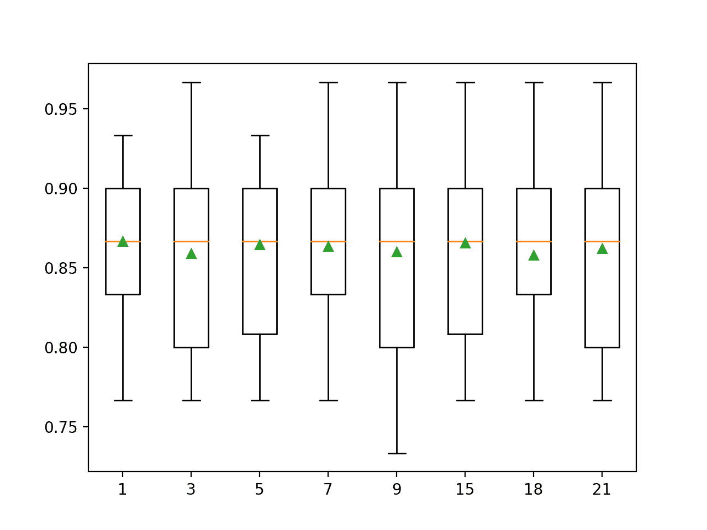

# 机器学习中缺失值的 KNN 插补

> 原文：<https://machinelearningmastery.com/knn-imputation-for-missing-values-in-machine-learning/>

最后更新于 2020 年 8 月 17 日

数据集可能会有缺失值，这可能会给许多机器学习算法带来问题。

因此，在对预测任务建模之前，识别并替换输入数据中每一列的缺失值是一种很好的做法。这被称为缺失数据插补，简称为插补。

缺失数据插补的一种流行方法是使用模型来预测缺失值。这需要为每个缺少值的输入变量创建一个模型。尽管一系列不同模型中的任何一个都可以用来预测缺失值，但 k-最近邻(KNN)算法已被证明通常是有效的，通常被称为“*最近邻插补*”

在本教程中，您将发现如何在机器学习中对缺失数据使用最近邻插补策略。

完成本教程后，您将知道:

*   缺少的值必须用 NaN 值标记，并且可以用最近邻估计值替换。
*   如何加载缺失值的 CSV 文件并用 NaN 值标记缺失值，并报告每列缺失值的数量和百分比。
*   在评估模型和拟合最终模型以对新数据进行预测时，如何使用最近邻模型估计缺失值作为数据准备方法。

**用我的新书[机器学习的数据准备](https://machinelearningmastery.com/data-preparation-for-machine-learning/)启动你的项目**，包括*分步教程*和所有示例的 *Python 源代码*文件。

我们开始吧。

*   **更新 6 月/2020** :更改了示例中用于预测的列。


机器学习中缺失值的 kNN 插补
图片由[预告](https://flickr.com/photos/portengaround/8318502104/)，保留部分权利。

## 教程概述

本教程分为三个部分；它们是:

1.  k-最近邻插补
2.  马结肠数据集
3.  用 KNNImputer 进行最近邻插补
    1.  KNN 计算机数据转换
    2.  KNN 计算机和模型评估
    3.  KNN 计算机和不同数量的邻居
    4.  进行预测时的计算机变换

## k-最近邻插补

数据集可能缺少值。

这些数据行中的一个或多个值或列不存在。这些值可能完全丢失，或者可能用特殊字符或值标记，如问号“*？*”。

由于许多原因，这些值可能会丢失，通常是特定于问题域的，并且可能包括损坏的测量或不可用等原因。

大多数机器学习算法需要数字输入值，并且数据集中的每一行和每一列都需要一个值。因此，缺失值会给机器学习算法带来问题。

识别数据集中缺失的值并用数值替换它们是很常见的。这被称为数据插补，或缺失数据插补。

> …缺失的数据是可以估计的。在这种情况下，我们可以使用训练集预测器中的信息来本质上估计其他预测器的值。

—第 42 页，[应用预测建模](https://amzn.to/3b2LHTL)，2013 年。

一种有效的数据输入方法是使用模型来预测缺失值。为每个缺少值的要素创建一个模型，将可能所有其他输入要素的输入值作为输入值。

> 一种流行的插补技术是 K 近邻模型。通过在训练集中找到“最接近”的样本并对这些附近的点进行平均来填充该值，从而估计出一个新的样本。

—第 42 页，[应用预测建模](https://amzn.to/3b2LHTL)，2013 年。

如果输入变量是数字，那么回归模型可以用于预测，这种情况很常见。可以使用一系列不同的模型，尽管简单的 k 近邻(KNN)模型在实验中被证明是有效的。使用 KNN 模型预测或填充缺失值被称为“最近邻插补”或“T2 KNN 插补”

> 我们表明 KNNimpute 似乎为缺失值估计提供了一种更稳健和更敏感的方法[…]，并且 KNNimpute 超过了常用的行平均方法(以及用零填充缺失值)。

——[DNA 微阵列缺失值估计方法](https://academic.oup.com/bioinformatics/article/17/6/520/272365)，2001。

KNN 插补的配置通常涉及为每个预测选择距离度量(例如欧几里德)和贡献邻居的数量，即 KNN 算法的 k 超参数。

现在我们已经熟悉了缺失值插补的最近邻方法，让我们来看看一个缺失值的数据集。

## 马结肠数据集

马绞痛数据集描述了患有绞痛的马的医学特征以及它们是活的还是死的。

有 300 行 26 个输入变量和一个输出变量。这是一个二分类预测任务，包括预测 1 如果马活了，2 如果马死了。

在这个数据集中，我们可以选择许多字段进行预测。在这种情况下，我们将预测问题是否是外科手术(列索引 23)，使其成为二分类问题。

数据集的许多列都有许多缺失值，其中每个缺失值都用问号字符(“？”).

下面提供了数据集中带有标记缺失值的行的示例。

```py
2,1,530101,38.50,66,28,3,3,?,2,5,4,4,?,?,?,3,5,45.00,8.40,?,?,2,2,11300,00000,00000,2
1,1,534817,39.2,88,20,?,?,4,1,3,4,2,?,?,?,4,2,50,85,2,2,3,2,02208,00000,00000,2
2,1,530334,38.30,40,24,1,1,3,1,3,3,1,?,?,?,1,1,33.00,6.70,?,?,1,2,00000,00000,00000,1
1,9,5290409,39.10,164,84,4,1,6,2,2,4,4,1,2,5.00,3,?,48.00,7.20,3,5.30,2,1,02208,00000,00000,1
...
```

您可以在此了解有关数据集的更多信息:

*   [马绞痛数据集](https://raw.githubusercontent.com/jbrownlee/Datasets/master/horse-colic.csv)
*   [马绞痛数据集描述](https://raw.githubusercontent.com/jbrownlee/Datasets/master/horse-colic.names)

不需要下载数据集，因为我们将在工作示例中自动下载它。

使用 Python 在加载的数据集中用 NaN(而不是数字)值标记缺失值是最佳实践。

我们可以使用 read_csv() Pandas 函数加载数据集，并指定“na_values”来加载“？”的值作为缺失，用 NaN 值标记。

```py
...
# load dataset
url = 'https://raw.githubusercontent.com/jbrownlee/Datasets/master/horse-colic.csv'
dataframe = read_csv(url, header=None, na_values='?')
```

加载后，我们可以查看加载的数据以确认“？”值被标记为 NaN。

```py
...
# summarize the first few rows
print(dataframe.head())
```

然后，我们可以枚举每一列，并报告该列缺少值的行数。

```py
...
# summarize the number of rows with missing values for each column
for i in range(dataframe.shape[1]):
	# count number of rows with missing values
	n_miss = dataframe[[i]].isnull().sum()
	perc = n_miss / dataframe.shape[0] * 100
	print('> %d, Missing: %d (%.1f%%)' % (i, n_miss, perc))
```

将这些联系在一起，下面列出了加载和汇总数据集的完整示例。

```py
# summarize the horse colic dataset
from pandas import read_csv
# load dataset
url = 'https://raw.githubusercontent.com/jbrownlee/Datasets/master/horse-colic.csv'
dataframe = read_csv(url, header=None, na_values='?')
# summarize the first few rows
print(dataframe.head())
# summarize the number of rows with missing values for each column
for i in range(dataframe.shape[1]):
	# count number of rows with missing values
	n_miss = dataframe[[i]].isnull().sum()
	perc = n_miss / dataframe.shape[0] * 100
	print('> %d, Missing: %d (%.1f%%)' % (i, n_miss, perc))
```

运行该示例首先加载数据集并汇总前五行。

我们可以看到，被标记为“？”的缺失值字符已被 NaN 值替换。

```py
    0   1        2     3      4     5    6   ...   21   22  23     24  25  26  27
0  2.0   1   530101  38.5   66.0  28.0  3.0  ...  NaN  2.0   2  11300   0   0   2
1  1.0   1   534817  39.2   88.0  20.0  NaN  ...  2.0  3.0   2   2208   0   0   2
2  2.0   1   530334  38.3   40.0  24.0  1.0  ...  NaN  1.0   2      0   0   0   1
3  1.0   9  5290409  39.1  164.0  84.0  4.0  ...  5.3  2.0   1   2208   0   0   1
4  2.0   1   530255  37.3  104.0  35.0  NaN  ...  NaN  2.0   2   4300   0   0   2

[5 rows x 28 columns]
```

接下来，我们可以看到数据集中所有列的列表以及缺失值的数量和百分比。

我们可以看到，一些列(例如列索引 1 和 2)没有缺失值，而其他列(例如列索引 15 和 21)有许多甚至大部分缺失值。

```py
> 0, Missing: 1 (0.3%)
> 1, Missing: 0 (0.0%)
> 2, Missing: 0 (0.0%)
> 3, Missing: 60 (20.0%)
> 4, Missing: 24 (8.0%)
> 5, Missing: 58 (19.3%)
> 6, Missing: 56 (18.7%)
> 7, Missing: 69 (23.0%)
> 8, Missing: 47 (15.7%)
> 9, Missing: 32 (10.7%)
> 10, Missing: 55 (18.3%)
> 11, Missing: 44 (14.7%)
> 12, Missing: 56 (18.7%)
> 13, Missing: 104 (34.7%)
> 14, Missing: 106 (35.3%)
> 15, Missing: 247 (82.3%)
> 16, Missing: 102 (34.0%)
> 17, Missing: 118 (39.3%)
> 18, Missing: 29 (9.7%)
> 19, Missing: 33 (11.0%)
> 20, Missing: 165 (55.0%)
> 21, Missing: 198 (66.0%)
> 22, Missing: 1 (0.3%)
> 23, Missing: 0 (0.0%)
> 24, Missing: 0 (0.0%)
> 25, Missing: 0 (0.0%)
> 26, Missing: 0 (0.0%)
> 27, Missing: 0 (0.0%)
```

现在我们已经熟悉了丢失值的马绞痛数据集，让我们看看如何使用最近邻插补。

## 用 KNNImputer 进行最近邻插补

Sklearn 机器学习库提供了支持最近邻插补的 [KNNImputer 类](https://Sklearn.org/stable/modules/generated/sklearn.impute.KNNImputer.html)。

在本节中，我们将探讨如何有效地使用 *KNNImputer* 类。

### KNN 计算机数据转换

*KNNImputer* 是一种数据转换，首先根据用于估计缺失值的方法进行配置。

默认距离度量是 NaN 感知的欧几里德距离度量，例如，在计算训练数据集成员之间的距离时不包括 NaN 值。这是通过“*度量*参数设置的。

邻居数量默认设置为 5，可以通过“ *n_neighbors* ”参数进行配置。

最后，距离度量可以与实例(行)之间的距离成比例地加权，尽管默认情况下这被设置为统一的加权，通过“*权重*”参数来控制。

```py
...
# define imputer
imputer = KNNImputer(n_neighbors=5, weights='uniform', metric='nan_euclidean')
```

然后，在数据集上拟合估计值。

```py
...
# fit on the dataset
imputer.fit(X)
```

然后，将拟合估计器应用于数据集，以创建数据集的副本，用估计值替换每列的所有缺失值。

```py
...
# transform the dataset
Xtrans = imputer.transform(X)
```

我们可以在 horse colic 数据集上演示它的用法，并通过总结转换前后数据集中缺失值的总数来确认它的工作。

下面列出了完整的示例。

```py
# knn imputation transform for the horse colic dataset
from numpy import isnan
from pandas import read_csv
from sklearn.impute import KNNImputer
# load dataset
url = 'https://raw.githubusercontent.com/jbrownlee/Datasets/master/horse-colic.csv'
dataframe = read_csv(url, header=None, na_values='?')
# split into input and output elements
data = dataframe.values
ix = [i for i in range(data.shape[1]) if i != 23]
X, y = data[:, ix], data[:, 23]
# print total missing
print('Missing: %d' % sum(isnan(X).flatten()))
# define imputer
imputer = KNNImputer()
# fit on the dataset
imputer.fit(X)
# transform the dataset
Xtrans = imputer.transform(X)
# print total missing
print('Missing: %d' % sum(isnan(Xtrans).flatten()))
```

运行该示例首先加载数据集，并报告数据集中缺失值的总数为 1，605。

转换被配置、调整和执行，生成的新数据集没有缺失值，这证实了它是按照我们的预期执行的。

每个缺失的值都被替换为模型估计的值。

```py
Missing: 1605
Missing: 0
```

### KNN 计算机和模型评估

使用 [k 倍交叉验证](https://machinelearningmastery.com/k-fold-cross-validation/)在数据集上评估机器学习模型是一个很好的实践。

为了正确应用最近邻缺失数据插补并避免数据泄漏，要求为每一列计算的模型仅在训练数据集上计算，然后应用于数据集中每个折叠的训练集和测试集。

这可以通过创建建模管道来实现，其中第一步是最近邻插补，然后第二步是模型。这可以使用[管道类](https://Sklearn.org/stable/modules/generated/sklearn.pipeline.Pipeline.html)来实现。

例如，下面的管道使用带有默认策略的 *KNNImputer* ，后跟随机森林模型。

```py
...
# define modeling pipeline
model = RandomForestClassifier()
imputer = KNNImputer()
pipeline = Pipeline(steps=[('i', imputer), ('m', model)])
```

我们可以使用重复的 10 倍交叉验证来评估马结肠数据集的估计数据集和随机森林建模管道。

下面列出了完整的示例。

```py
# evaluate knn imputation and random forest for the horse colic dataset
from numpy import mean
from numpy import std
from pandas import read_csv
from sklearn.ensemble import RandomForestClassifier
from sklearn.impute import KNNImputer
from sklearn.model_selection import cross_val_score
from sklearn.model_selection import RepeatedStratifiedKFold
from sklearn.pipeline import Pipeline
# load dataset
url = 'https://raw.githubusercontent.com/jbrownlee/Datasets/master/horse-colic.csv'
dataframe = read_csv(url, header=None, na_values='?')
# split into input and output elements
data = dataframe.values
ix = [i for i in range(data.shape[1]) if i != 23]
X, y = data[:, ix], data[:, 23]
# define modeling pipeline
model = RandomForestClassifier()
imputer = KNNImputer()
pipeline = Pipeline(steps=[('i', imputer), ('m', model)])
# define model evaluation
cv = RepeatedStratifiedKFold(n_splits=10, n_repeats=3, random_state=1)
# evaluate model
scores = cross_val_score(pipeline, X, y, scoring='accuracy', cv=cv, n_jobs=-1, error_score='raise')
print('Mean Accuracy: %.3f (%.3f)' % (mean(scores), std(scores)))
```

正确运行该示例将数据插补应用于交叉验证程序的每个折叠。

**注**:考虑到算法或评估程序的随机性，或数值准确率的差异，您的[结果可能会有所不同](https://machinelearningmastery.com/different-results-each-time-in-machine-learning/)。考虑运行该示例几次，并比较平均结果。

使用 10 倍交叉验证的三次重复对管道进行评估，并报告数据集上的平均分类准确率约为 86.2%，这是一个合理的分数。

```py
Mean Accuracy: 0.862 (0.059)
```

我们如何知道使用默认的 5 个邻居对这个数据集是好的还是最好的？

答案是我们没有。

### KNN 计算机和不同数量的邻居

KNN 算法的关键超参数是*k*；它控制用于预测的最近邻居的数量。

为 *k* 测试一组不同的值是一个很好的做法。

下面的示例评估模型管道，并比较从 1 到 21 的 *k* 的奇数。

```py
# compare knn imputation strategies for the horse colic dataset
from numpy import mean
from numpy import std
from pandas import read_csv
from sklearn.ensemble import RandomForestClassifier
from sklearn.impute import KNNImputer
from sklearn.model_selection import cross_val_score
from sklearn.model_selection import RepeatedStratifiedKFold
from sklearn.pipeline import Pipeline
from matplotlib import pyplot
# load dataset
url = 'https://raw.githubusercontent.com/jbrownlee/Datasets/master/horse-colic.csv'
dataframe = read_csv(url, header=None, na_values='?')
# split into input and output elements
data = dataframe.values
ix = [i for i in range(data.shape[1]) if i != 23]
X, y = data[:, ix], data[:, 23]
# evaluate each strategy on the dataset
results = list()
strategies = [str(i) for i in [1,3,5,7,9,15,18,21]]
for s in strategies:
	# create the modeling pipeline
	pipeline = Pipeline(steps=[('i', KNNImputer(n_neighbors=int(s))), ('m', RandomForestClassifier())])
	# evaluate the model
	cv = RepeatedStratifiedKFold(n_splits=10, n_repeats=3, random_state=1)
	scores = cross_val_score(pipeline, X, y, scoring='accuracy', cv=cv, n_jobs=-1)
	# store results
	results.append(scores)
	print('>%s %.3f (%.3f)' % (s, mean(scores), std(scores)))
# plot model performance for comparison
pyplot.boxplot(results, labels=strategies, showmeans=True)
pyplot.show()
```

运行该示例使用重复的交叉验证来评估马绞痛数据集中的每个 *k* 值。

**注**:考虑到算法或评估程序的随机性，或数值准确率的差异，您的[结果可能会有所不同](https://machinelearningmastery.com/different-results-each-time-in-machine-learning/)。考虑运行该示例几次，并比较平均结果。

报告管道的平均分类准确率，每个 *k* 值用于插补。

在这种情况下，我们可以看到，较大的 k 值会产生表现更好的模型，其中 *k=1* 会产生约 86.7%准确率的最佳表现。

```py
>1 0.867 (0.049)
>3 0.859 (0.056)
>5 0.864 (0.054)
>7 0.863 (0.053)
>9 0.860 (0.062)
>15 0.866 (0.054)
>18 0.858 (0.052)
>21 0.862 (0.056)
```

在运行结束时，为每组结果创建一个方框图和须图，以便比较结果的分布。

该图表明，当输入缺失值时，k 值没有太大差异，在平均表现(绿色三角形)附近略有波动。



马绞痛数据集近邻插补数的方框图和须图

### 进行预测时的计算机变换

我们可能希望使用最近邻插补和随机森林算法创建最终的建模管道，然后对新数据进行预测。

这可以通过定义管道并将其拟合到所有可用数据上来实现，然后调用 *predict()* 函数，将新数据作为参数传入。

重要的是，新数据行必须使用 NaN 值标记任何缺失的值。

```py
...
# define new data
row = [2, 1, 530101, 38.50, 66, 28, 3, 3, nan, 2, 5, 4, 4, nan, nan, nan, 3, 5, 45.00, 8.40, nan, nan, 2, 11300, 00000, 00000, 2]
```

下面列出了完整的示例。

```py
# knn imputation strategy and prediction for the hose colic dataset
from numpy import nan
from pandas import read_csv
from sklearn.ensemble import RandomForestClassifier
from sklearn.impute import KNNImputer
from sklearn.pipeline import Pipeline
# load dataset
url = 'https://raw.githubusercontent.com/jbrownlee/Datasets/master/horse-colic.csv'
dataframe = read_csv(url, header=None, na_values='?')
# split into input and output elements
data = dataframe.values
ix = [i for i in range(data.shape[1]) if i != 23]
X, y = data[:, ix], data[:, 23]
# create the modeling pipeline
pipeline = Pipeline(steps=[('i', KNNImputer(n_neighbors=21)), ('m', RandomForestClassifier())])
# fit the model
pipeline.fit(X, y)
# define new data
row = [2, 1, 530101, 38.50, 66, 28, 3, 3, nan, 2, 5, 4, 4, nan, nan, nan, 3, 5, 45.00, 8.40, nan, nan, 2, 11300, 00000, 00000, 2]
# make a prediction
yhat = pipeline.predict([row])
# summarize prediction
print('Predicted Class: %d' % yhat[0])
```

运行该示例适合所有可用数据的建模管道。

定义一个新的数据行，其缺失值用 NaNs 标记，并进行分类预测。

```py
Predicted Class: 2
```

## 进一步阅读

如果您想更深入地了解这个主题，本节将提供更多资源。

### 相关教程

*   [标准分类和回归机器学习数据集的结果](https://machinelearningmastery.com/results-for-standard-classification-and-regression-machine-learning-datasets/)
*   [如何用 Python 处理缺失数据](https://machinelearningmastery.com/handle-missing-data-python/)

### 报纸

*   [DNA 微阵列缺失值估计方法](https://academic.oup.com/bioinformatics/article/17/6/520/272365)，2001。

### 书

*   [应用预测建模](https://amzn.to/3b2LHTL)，2013。

### 蜜蜂

*   [缺失值的插补，sci kit-学习文档](https://Sklearn.org/stable/modules/impute.html)。
*   [巩理。计费。KNNImputer API](https://Sklearn.org/stable/modules/generated/sklearn.impute.KNNImputer.html) 。

### 资料组

*   [马绞痛数据集](https://raw.githubusercontent.com/jbrownlee/Datasets/master/horse-colic.csv)
*   [马绞痛数据集描述](https://raw.githubusercontent.com/jbrownlee/Datasets/master/horse-colic.names)

## 摘要

在本教程中，您发现了如何在机器学习中对缺失数据使用最近邻插补策略。

具体来说，您了解到:

*   缺少的值必须用 NaN 值标记，并且可以用最近邻估计值替换。
*   如何加载缺失值的 CSV 文件并用 NaN 值标记缺失值，并报告每列缺失值的数量和百分比。
*   在评估模型和拟合最终模型以对新数据进行预测时，如何使用最近邻模型估计缺失值作为数据准备方法。

**你有什么问题吗？**
在下面的评论中提问，我会尽力回答。