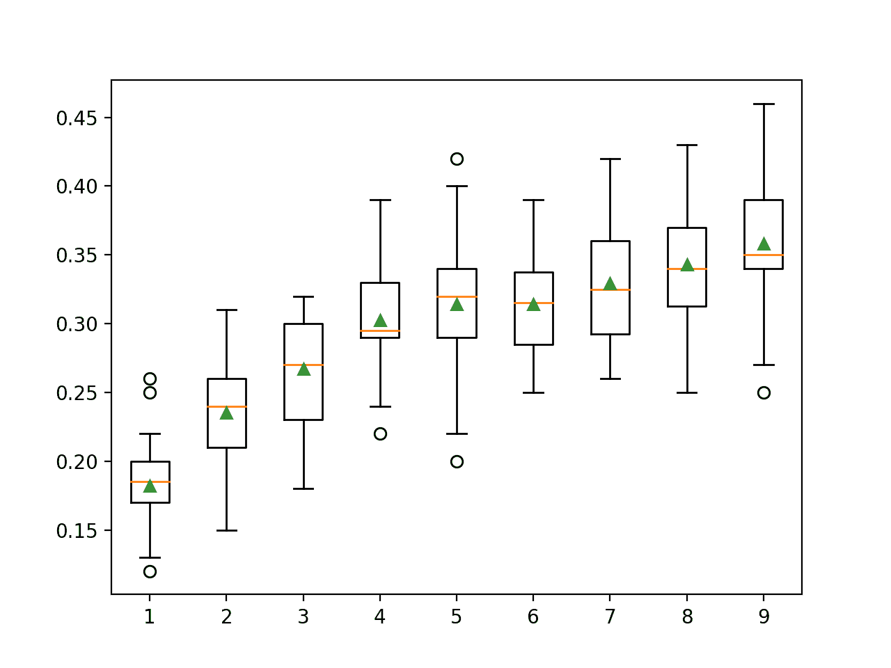

# Python 中降维的线性判别分析

> 原文:[https://machinelearning master . com/python 中的线性判别分析降维/](https://machinelearningmastery.com/linear-discriminant-analysis-for-dimensionality-reduction-in-python/)

最后更新于 2020 年 8 月 18 日

减少预测模型的输入变量的数量被称为降维。

较少的输入变量可以导致更简单的预测模型，该模型在对新数据进行预测时可能具有更好的性能。

[线性判别分析](https://machinelearningmastery.com/linear-discriminant-analysis-for-machine-learning/)，简称 LDA，是一种多类分类的预测建模算法。它还可以用作降维技术，提供一个训练数据集的投影，通过给定的类最好地分离示例。

使用线性判别分析进行降维的能力经常让大多数从业者感到惊讶。

在本教程中，您将发现在开发预测模型时如何使用 LDA 进行降维。

完成本教程后，您将知道:

*   降维包括减少建模数据中输入变量或列的数量。
*   LDA 是一种多类分类技术，可用于自动执行降维。
*   如何评估使用线性判别分析投影作为输入的预测模型，并使用新的原始数据进行预测。

**用我的新书[机器学习的数据准备](https://machinelearningmastery.com/data-preparation-for-machine-learning/)启动你的项目**，包括*分步教程*和所有示例的 *Python 源代码*文件。

我们开始吧。

*   **2020 年 5 月更新**:改进代码注释


Python 中降维的线性判别分析
图片由[金伯利·瓦德曼](https://flickr.com/photos/kimberlykv/4939826241/)提供，保留部分权利。

## 教程概述

本教程分为四个部分；它们是:

1.  降维
2.  线性判别分析
3.  LDA Scikit-Learn API
4.  维度的线性判别分析工作示例

## 降维

[降维](https://en.wikipedia.org/wiki/Dimensionality_reduction)是指减少数据集的输入变量数量。

如果您的数据是用行和列来表示的，例如在电子表格中，那么输入变量就是作为输入提供给模型以预测目标变量的列。输入变量也称为特征。

我们可以将 n 维特征空间上表示维度的数据列和数据行视为该空间中的点。这是数据集的一种有用的几何解释。

> 在具有 k 个数字属性的数据集中，您可以将数据可视化为 k 维空间中的点云…

—第 305 页，[数据挖掘:实用机器学习工具与技术](https://amzn.to/2tlRP9V)，2016 年第 4 版。

特征空间中有大量的维度可能意味着该空间的体积非常大，反过来，我们在该空间中的点(数据行)通常代表一个小的且不具有代表性的样本。

这可能会极大地影响机器学习算法在具有许多输入特征的数据上的性能，通常被称为“维度诅咒””

因此，通常希望减少输入特征的数量。这减少了特征空间的维数，因此得名“*降维*”

降维的一种流行方法是使用线性代数领域的技术。这通常被称为“T0”特征投影，所使用的算法被称为“T2”投影方法

投影方法寻求减少特征空间中的维数，同时保留数据中观察到的变量之间最重要的结构或关系。

> 当处理高维数据时，通过将数据投影到捕捉数据“本质”的低维子空间来降低维数通常是有用的。这叫做降维。

—第 11 页，[机器学习:概率视角](https://amzn.to/2ucStHi)，2012。

得到的数据集，即投影，可以用作训练机器学习模型的输入。

本质上，原始特征不再存在，而新特征是从与原始数据不直接可比的可用数据构建的，例如没有列名。

未来在进行预测时，任何新数据(如测试数据集和新数据集)都必须使用相同的技术进行投影。

## 线性判别分析

[线性判别分析](https://en.wikipedia.org/wiki/Linear_discriminant_analysis)，简称 LDA，是一种用于多类分类的线性机器学习算法。

不应与“[潜在狄利克雷分配](https://en.wikipedia.org/wiki/Latent_Dirichlet_allocation)”(LDA)混淆，后者也是一种针对文本文档的降维技术。

线性判别分析试图通过类别值来最好地分离(或区分)训练数据集中的样本。具体而言，该模型寻求找到输入变量的线性组合，实现类间样本的最大分离(类质心或平均值)和每个类内样本的最小分离。

> …找出预测因子的线性组合，使组间方差相对于组内方差最大化。[……]找到预测因子的组合，使数据中心之间的间隔最大化，同时使每组数据中的变化最小化。

—第 289 页，[应用预测建模](https://amzn.to/2GTdiKI)，2013 年。

LDA 的框架和求解方法有很多；例如，通常用[贝叶斯定理](https://machinelearningmastery.com/bayes-theorem-for-machine-learning/)和条件概率来描述 LDA 算法。

在实践中，用于多类分类的 LDA 通常使用来自[线性代数](https://machinelearningmastery.com/linear-algebra-machine-learning-7-day-mini-course/)的工具来实现，并且像 PCA 一样，使用作为技术核心的[矩阵分解](https://machinelearningmastery.com/introduction-to-matrix-decompositions-for-machine-learning/)。因此，在拟合线性判别分析模型之前，最好先对数据进行标准化。

有关如何详细计算 LDA 的更多信息，请参见教程:

*   [机器学习的线性判别分析](https://machinelearningmastery.com/linear-discriminant-analysis-for-machine-learning/)

现在我们已经熟悉了降维和 LDA，让我们看看如何将这种方法用于 scikit-learn 库。

## LDA Scikit-Learn API

我们可以使用线性判别分析来计算数据集的投影，并选择投影的多个维度或分量作为模型的输入。

scikit-learn 库提供了[linear discriminator analysis 类](https://scikit-learn.org/stable/modules/generated/sklearn.discriminant_analysis.LinearDiscriminantAnalysis.html)，该类可适用于数据集，并用于转换训练数据集和未来的任何附加数据集。

例如:

```
...
# prepare dataset
data = ...
# define transform
lda = LinearDiscriminantAnalysis()
# prepare transform on dataset
lda.fit(data)
# apply transform to dataset
transformed = lda.transform(data)
```

线性判别分析的输出可以用作训练模型的输入。

也许最好的方法是使用[管道](https://scikit-learn.org/stable/modules/generated/sklearn.pipeline.Pipeline.html)，其中第一步是 LDA 变换，下一步是将变换后的数据作为输入的学习算法。

```
...
# define the pipeline
steps = [('lda', LinearDiscriminantAnalysis()), ('m', GaussianNB())]
model = Pipeline(steps=steps)
```

如果输入变量具有不同的单位或比例，在执行线性判别分析变换之前标准化数据也是一个好主意；例如:

```
...
# define the pipeline
steps = [('s', StandardScaler()), ('lda', LinearDiscriminantAnalysis()), ('m', GaussianNB())]
model = Pipeline(steps=steps)
```

现在我们已经熟悉了 LDA 应用编程接口，让我们来看看一个成功的例子。

## 维度的线性判别分析工作示例

首先，我们可以使用 [make_classification()函数](https://scikit-learn.org/stable/modules/generated/sklearn.datasets.make_classification.html)创建一个包含 1000 个示例和 20 个输入特征的合成 10 类分类问题，其中 15 个输入是有意义的。

下面列出了完整的示例。

```
# test classification dataset
from sklearn.datasets import make_classification
# define dataset
X, y = make_classification(n_samples=1000, n_features=20, n_informative=15, n_redundant=5, random_state=7, n_classes=10)
# summarize the dataset
print(X.shape, y.shape)
```

运行该示例将创建数据集并总结输入和输出组件的形状。

```
(1000, 20) (1000,)
```

接下来，我们可以在拟合朴素贝叶斯模型的同时对该数据集进行降维。

我们将使用管道，其中第一步执行线性判别分析变换并选择五个最重要的维度或组件，然后在这些特征上拟合[朴素贝叶斯](https://machinelearningmastery.com/classification-as-conditional-probability-and-the-naive-bayes-algorithm/)模型。我们不需要标准化这个数据集中的变量，因为所有的变量都有相同的设计比例。

管道将使用[重复分层交叉验证](https://machinelearningmastery.com/k-fold-cross-validation/)进行评估，重复三次，每次重复 10 次。性能表示为平均分类精度。

下面列出了完整的示例。

```
# evaluate lda with naive bayes algorithm for classification
from numpy import mean
from numpy import std
from sklearn.datasets import make_classification
from sklearn.model_selection import cross_val_score
from sklearn.model_selection import RepeatedStratifiedKFold
from sklearn.pipeline import Pipeline
from sklearn.discriminant_analysis import LinearDiscriminantAnalysis
from sklearn.naive_bayes import GaussianNB
# define dataset
X, y = make_classification(n_samples=1000, n_features=20, n_informative=15, n_redundant=5, random_state=7, n_classes=10)
# define the pipeline
steps = [('lda', LinearDiscriminantAnalysis(n_components=5)), ('m', GaussianNB())]
model = Pipeline(steps=steps)
# evaluate model
cv = RepeatedStratifiedKFold(n_splits=10, n_repeats=3, random_state=1)
n_scores = cross_val_score(model, X, y, scoring='accuracy', cv=cv, n_jobs=-1, error_score='raise')
# report performance
print('Accuracy: %.3f (%.3f)' % (mean(n_scores), std(n_scores)))
```

运行示例评估模型并报告分类精度。

**注**:考虑到算法或评估程序的随机性，或数值精度的差异，您的[结果可能会有所不同](https://machinelearningmastery.com/different-results-each-time-in-machine-learning/)。考虑运行该示例几次，并比较平均结果。

在这种情况下，我们可以看到带有朴素贝叶斯的 LDA 变换获得了大约 31.4%的性能。

```
Accuracy: 0.314 (0.049)
```

我们如何知道把 20 个维度的投入减少到 5 个是好的还是我们能做的最好的？

我们没有；五是一个任意的选择。

更好的方法是用不同数量的输入特征评估相同的变换和模型，并选择导致最佳平均性能的特征数量(降维量)。

LDA 在降维中使用的组件数量被限制在类的数量减一之间，在这种情况下是(10–1)或 9

下面的示例执行了该实验，并总结了每种配置的平均分类精度。

```
# compare lda number of components with naive bayes algorithm for classification
from numpy import mean
from numpy import std
from sklearn.datasets import make_classification
from sklearn.model_selection import cross_val_score
from sklearn.model_selection import RepeatedStratifiedKFold
from sklearn.pipeline import Pipeline
from sklearn.discriminant_analysis import LinearDiscriminantAnalysis
from sklearn.naive_bayes import GaussianNB
from matplotlib import pyplot

# get the dataset
def get_dataset():
	X, y = make_classification(n_samples=1000, n_features=20, n_informative=15, n_redundant=5, random_state=7, n_classes=10)
	return X, y

# get a list of models to evaluate
def get_models():
	models = dict()
	for i in range(1,10):
		steps = [('lda', LinearDiscriminantAnalysis(n_components=i)), ('m', GaussianNB())]
		models[str(i)] = Pipeline(steps=steps)
	return models

# evaluate a give model using cross-validation
def evaluate_model(model, X, y):
	cv = RepeatedStratifiedKFold(n_splits=10, n_repeats=3, random_state=1)
	scores = cross_val_score(model, X, y, scoring='accuracy', cv=cv, n_jobs=-1, error_score='raise')
	return scores

# define dataset
X, y = get_dataset()
# get the models to evaluate
models = get_models()
# evaluate the models and store results
results, names = list(), list()
for name, model in models.items():
	scores = evaluate_model(model, X, y)
	results.append(scores)
	names.append(name)
	print('>%s %.3f (%.3f)' % (name, mean(scores), std(scores)))
# plot model performance for comparison
pyplot.boxplot(results, labels=names, showmeans=True)
pyplot.show()
```

运行该示例首先报告所选组件或特征的每个数量的分类精度。

**注**:考虑到算法或评估程序的随机性，或数值精度的差异，您的[结果可能会有所不同](https://machinelearningmastery.com/different-results-each-time-in-machine-learning/)。考虑运行该示例几次，并比较平均结果。

随着维度数量的增加，我们可以看到性能提高的总体趋势。在这个数据集上，结果显示了维度数量和模型分类精度之间的权衡。

结果表明，使用默认的九个组件可以在这个数据集上获得最佳性能，尽管会有一个温和的折衷，因为使用的维度更少。

```
>1 0.182 (0.032)
>2 0.235 (0.036)
>3 0.267 (0.038)
>4 0.303 (0.037)
>5 0.314 (0.049)
>6 0.314 (0.040)
>7 0.329 (0.042)
>8 0.343 (0.045)
>9 0.358 (0.056)
```

为每个配置的尺寸数量的精度分数的分布创建一个方框和触须图。

我们可以看到分类精度随着组件数量的增加而增加的趋势，限制在 9 个。



线性判别分析组件数与分类精度的箱线图

我们可以选择使用线性判别分析变换和朴素贝叶斯模型组合作为最终模型。

这包括在所有可用数据上拟合管道，并使用管道对新数据进行预测。重要的是，必须对这个新数据执行相同的转换，这是通过管道自动处理的。

下面的代码提供了一个在新数据上使用线性判别分析变换拟合和使用最终模型的例子。

```
# make predictions using lda with naive bayes
from sklearn.datasets import make_classification
from sklearn.pipeline import Pipeline
from sklearn.discriminant_analysis import LinearDiscriminantAnalysis
from sklearn.naive_bayes import GaussianNB
# define dataset
X, y = make_classification(n_samples=1000, n_features=20, n_informative=15, n_redundant=5, random_state=7, n_classes=10)
# define the model
steps = [('lda', LinearDiscriminantAnalysis(n_components=9)), ('m', GaussianNB())]
model = Pipeline(steps=steps)
# fit the model on the whole dataset
model.fit(X, y)
# make a single prediction
row = [[2.3548775,-1.69674567,1.6193882,-1.19668862,-2.85422348,-2.00998376,16.56128782,2.57257575,9.93779782,0.43415008,6.08274911,2.12689336,1.70100279,3.32160983,13.02048541,-3.05034488,2.06346747,-3.33390362,2.45147541,-1.23455205]]
yhat = model.predict(row)
print('Predicted Class: %d' % yhat[0])
```

运行该示例使管道适用于所有可用数据，并对新数据进行预测。

这里，变换使用了我们在上面的测试中发现的 LDA 变换的九个最重要的组成部分。

提供了一个包含 20 列的新数据行，它被自动转换为 15 个分量，并被馈送到朴素贝叶斯模型，以便预测类标签。

```
Predicted Class: 6
```

## 进一步阅读

如果您想更深入地了解这个主题，本节将提供更多资源。

### 教程

*   [机器学习的线性判别分析](https://machinelearningmastery.com/linear-discriminant-analysis-for-machine-learning/)

### 书

*   [机器学习:概率视角](https://amzn.to/2ucStHi)，2012。
*   [数据挖掘:实用机器学习工具与技术](https://amzn.to/2tlRP9V)，第 4 版，2016。
*   [模式识别与机器学习](https://amzn.to/2GPOl2w)，2006。
*   [应用预测建模](https://amzn.to/2GTdiKI)，2013。

### 蜜蜂

*   [分解分量中的信号(矩阵分解问题)，scikit-learn](https://scikit-learn.org/stable/modules/decomposition.html) 。
*   [sklearn . discriminal _ analysis。线性判别分析应用编程接口](https://scikit-learn.org/stable/modules/generated/sklearn.discriminant_analysis.LinearDiscriminantAnalysis.html)。
*   [sklearn . pipeline . pipeline API](https://scikit-learn.org/stable/modules/generated/sklearn.pipeline.Pipeline.html)。

### 文章

*   [降维，维基百科](https://en.wikipedia.org/wiki/Dimensionality_reduction)。
*   [维度的诅咒，维基百科](https://en.wikipedia.org/wiki/Curse_of_dimensionality)。
*   [线性判别分析，维基百科](https://en.wikipedia.org/wiki/Linear_discriminant_analysis)。

## 摘要

在本教程中，您发现了在开发预测模型时如何使用 LDA 进行降维。

具体来说，您了解到:

*   降维包括减少建模数据中输入变量或列的数量。
*   LDA 是一种多类分类技术，可用于自动执行降维。
*   如何评估使用线性判别分析投影作为输入的预测模型，并使用新的原始数据进行预测。

**你有什么问题吗？**
在下面的评论中提问，我会尽力回答。