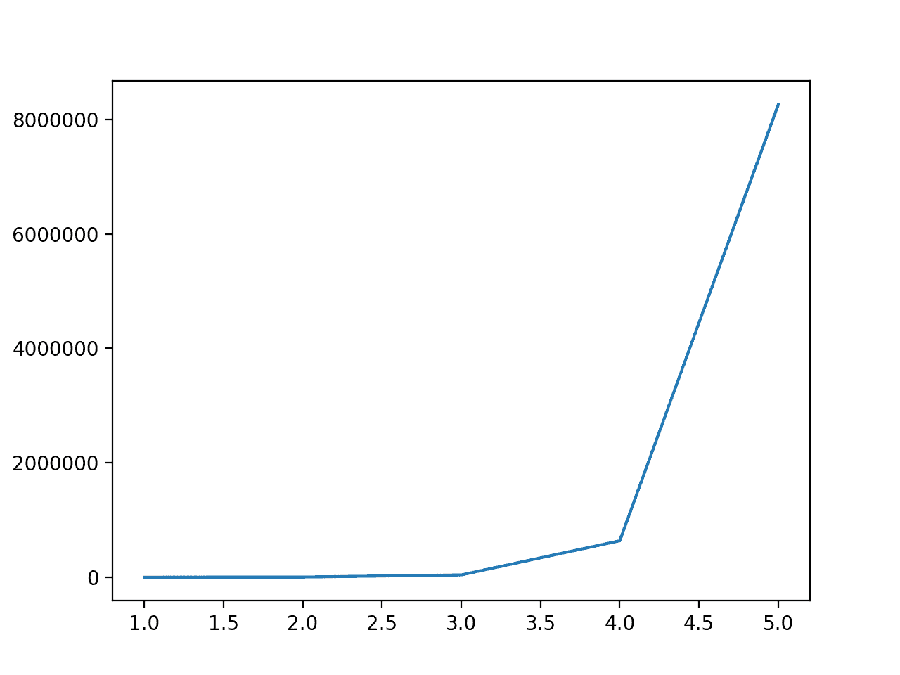
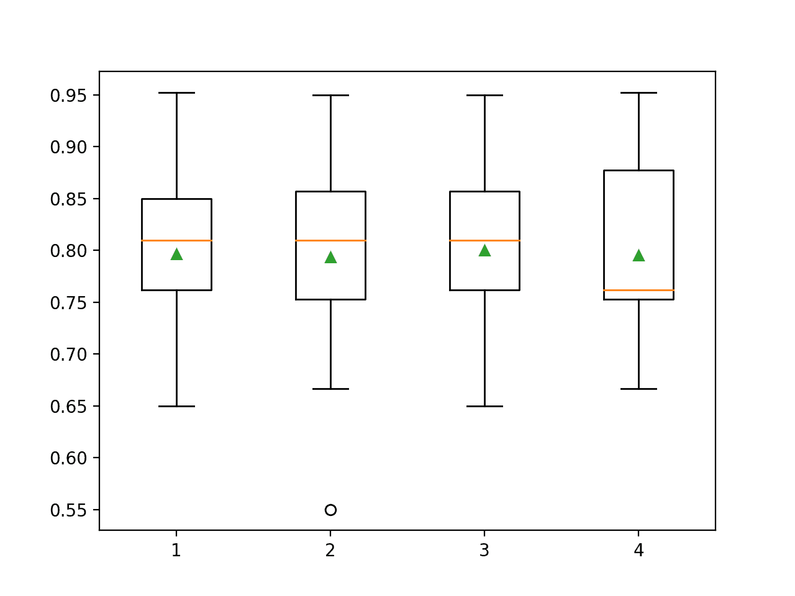

# 如何使用多项式特征变换进行机器学习

> 原文:[https://machinelearning master . com/多项式-特征-变换-机器学习/](https://machinelearningmastery.com/polynomial-features-transforms-for-machine-learning/)

最后更新于 2020 年 8 月 28 日

通常，预测建模任务的输入特征以意想不到且通常非线性的方式相互作用。

这些交互可以通过学习算法来识别和建模。另一种方法是设计暴露这些交互的新特性，看看它们是否能提高模型性能。此外，像将输入变量提升到幂这样的转换有助于更好地揭示输入变量和目标变量之间的重要关系。

这些特征被称为交互和多项式特征，并且允许使用更简单的建模算法，因为解释输入变量及其关系的一些复杂性被推回到数据准备阶段。有时，这些特性可以提高建模性能，尽管代价是增加数千甚至数百万个额外的输入变量。

在本教程中，您将发现如何将多项式特征变换用于带有数字输入变量的特征工程。

完成本教程后，您将知道:

*   一些机器学习算法更喜欢多项式输入特征或在多项式输入特征下表现更好。
*   如何使用多项式特征变换为预测建模创建新版本的输入变量。
*   多项式的次数如何影响由变换创建的输入要素的数量。

**用我的新书[机器学习的数据准备](https://machinelearningmastery.com/data-preparation-for-machine-learning/)启动你的项目**，包括*分步教程*和所有示例的 *Python 源代码*文件。

我们开始吧。


如何使用多项式特征变换进行机器学习
图片由 [D 库切](https://flickr.com/photos/dcoetzee/3573755676/)提供，版权所有。

## 教程概述

本教程分为五个部分；它们是:

1.  多项式特征
2.  多项式特征变换
3.  声纳数据集
4.  多项式特征变换示例
5.  多项式次数的影响

## 多项式特征

[多项式](https://en.wikipedia.org/wiki/Polynomial)特征是通过将现有特征提升到指数而创建的特征。

例如，如果数据集有一个输入要素 x，那么多项式要素将是一个新要素(列)的加法，其中值是通过对 x 中的值求平方来计算的，例如 X^2.可以对数据集中的每个输入变量重复这个过程，创建每个变量的转换版本。

因此，多项式特征是一种特征工程，例如基于现有特征创建新的输入特征。

多项式的“*次*”用于控制添加的特征数量，例如，3 次将为每个输入变量添加两个新变量。通常使用小度数，如 2 度或 3 度。

> 一般来说，使用大于 3 或 4 的 d 是不寻常的，因为对于大的 d 值，多项式曲线会变得过于灵活，并且会呈现出一些非常奇怪的形状。

—第 266 页，[R](https://amzn.to/2SfkCXh)中应用的统计学习介绍，2014。

添加表示特征之间交互的新变量也很常见，例如，表示一个变量乘以另一个变量的新列。这也可以对每个输入变量重复，为每对输入变量创建一个新的“*交互*”变量。

输入变量的平方或立方版本将改变概率分布，分离小值和大值，这种分离随着指数的大小而增加。

这种分离可以帮助一些机器学习算法做出更好的预测，并且对于回归预测建模任务和通常具有数字输入变量的任务是常见的。

典型的线性算法，如线性回归和逻辑回归，对多项式输入变量的使用反应良好。

> 线性回归在模型参数中是线性的，并且向模型添加多项式项可以是允许模型识别非线性模式的有效方式。

—第 11 页，[特征工程与选择](https://amzn.to/2Yvcupn)，2019 年。

例如，当用作线性回归算法的输入时，该方法被更广泛地称为[多项式回归](https://en.wikipedia.org/wiki/Polynomial_regression)。

> 多项式回归通过添加额外的预测因子来扩展线性模型，这些预测因子是通过将每个原始预测因子的幂提高而获得的。例如，三次回归使用三个变量 X、X2 和 X3 作为预测因子。这种方法提供了一种简单的方法来提供数据的非线性拟合。

—第 265 页，[R](https://amzn.to/2SfkCXh)中应用的统计学习介绍，2014。

## 多项式特征变换

多项式特征变换可通过[多项式特征类](https://scikit-learn.org/stable/modules/generated/sklearn.preprocessing.PolynomialFeatures.html)在 scikit-learn Python 机器学习库中获得。

创建的功能包括:

*   偏差(值为 1.0)
*   每升一级的数值(如 x^1、x^2、x^3 等)
*   所有特征对之间的相互作用(例如 x1 * x2，x1 * x3，…)

例如，如果两个输入变量的值分别为 2 和 3，度数为 2，则创建的特征将是:

*   1(偏差)
*   2^1 = 2
*   3^1 = 3
*   2^2 = 4
*   3^2 = 9
*   2 * 3 = 6

我们可以用一个例子来证明这一点:

```
# demonstrate the types of features created
from numpy import asarray
from sklearn.preprocessing import PolynomialFeatures
# define the dataset
data = asarray([[2,3],[2,3],[2,3]])
print(data)
# perform a polynomial features transform of the dataset
trans = PolynomialFeatures(degree=2)
data = trans.fit_transform(data)
print(data)
```

运行该示例首先报告包含两个要素(列)的原始数据，每个要素都有相同的值，即 2 或 3。

然后创建多项式特征，得到六个特征，与上面描述的相匹配。

```
[[2 3]
 [2 3]
 [2 3]]

[[1\. 2\. 3\. 4\. 6\. 9.]
 [1\. 2\. 3\. 4\. 6\. 9.]
 [1\. 2\. 3\. 4\. 6\. 9.]]
```

“*度*”参数控制创建的特征数量，默认为 2。

“ *interaction_only* ”参数意味着只包括原始值(1 度)和交互(相互相乘的值对)，默认为 *False* 。

“ *include_bias* ”参数默认为 *True* 以包含偏置特征。

我们将仔细研究如何在真实数据集上使用多项式特征变换。

首先，让我们介绍一个真实的数据集。

## 声纳数据集

声纳数据集是用于二进制分类的标准机器学习数据集。

它涉及 60 个实值输入和一个两类目标变量。数据集中有 208 个示例，类别相当均衡。

使用重复的分层 10 倍交叉验证，基线分类算法可以达到大约 53.4%的分类精度。[使用重复的分层 10 倍交叉验证，该数据集的最高性能](https://machinelearningmastery.com/results-for-standard-classification-and-regression-machine-learning-datasets/)约为 88%。

该数据集描述了岩石或模拟地雷的雷达回波。

您可以从这里了解有关数据集的更多信息:

*   [声纳数据集](https://raw.githubusercontent.com/jbrownlee/Datasets/master/sonar.csv)
*   [声纳数据集描述](https://raw.githubusercontent.com/jbrownlee/Datasets/master/sonar.names)

不需要下载数据集；我们将从我们的工作示例中自动下载它。

首先，让我们加载并总结数据集。下面列出了完整的示例。

```
# load and summarize the sonar dataset
from pandas import read_csv
from pandas.plotting import scatter_matrix
from matplotlib import pyplot
# Load dataset
url = "https://raw.githubusercontent.com/jbrownlee/Datasets/master/sonar.csv"
dataset = read_csv(url, header=None)
# summarize the shape of the dataset
print(dataset.shape)
# summarize each variable
print(dataset.describe())
# histograms of the variables
dataset.hist()
pyplot.show()
```

运行该示例首先总结加载数据集的形状。

这确认了 60 个输入变量、一个输出变量和 208 行数据。

提供了输入变量的统计摘要，显示值是数值，范围大约从 0 到 1。

```
(208, 61)
               0           1           2   ...          57          58          59
count  208.000000  208.000000  208.000000  ...  208.000000  208.000000  208.000000
mean     0.029164    0.038437    0.043832  ...    0.007949    0.007941    0.006507
std      0.022991    0.032960    0.038428  ...    0.006470    0.006181    0.005031
min      0.001500    0.000600    0.001500  ...    0.000300    0.000100    0.000600
25%      0.013350    0.016450    0.018950  ...    0.003600    0.003675    0.003100
50%      0.022800    0.030800    0.034300  ...    0.005800    0.006400    0.005300
75%      0.035550    0.047950    0.057950  ...    0.010350    0.010325    0.008525
max      0.137100    0.233900    0.305900  ...    0.044000    0.036400    0.043900

[8 rows x 60 columns]
```

最后，为每个输入变量创建一个直方图。

如果我们忽略图中杂乱的东西，专注于直方图本身，我们可以看到许多变量都有一个偏斜的分布。


声纳二进制分类数据集输入变量的直方图

接下来，让我们在原始数据集上拟合和评估一个机器学习模型。

我们将使用带有默认超参数的 k 近邻算法，并使用重复的分层 k 重交叉验证对其进行评估。下面列出了完整的示例。

```
# evaluate knn on the raw sonar dataset
from numpy import mean
from numpy import std
from pandas import read_csv
from sklearn.model_selection import cross_val_score
from sklearn.model_selection import RepeatedStratifiedKFold
from sklearn.neighbors import KNeighborsClassifier
from sklearn.preprocessing import LabelEncoder
from matplotlib import pyplot
# load dataset
url = "https://raw.githubusercontent.com/jbrownlee/Datasets/master/sonar.csv"
dataset = read_csv(url, header=None)
data = dataset.values
# separate into input and output columns
X, y = data[:, :-1], data[:, -1]
# ensure inputs are floats and output is an integer label
X = X.astype('float32')
y = LabelEncoder().fit_transform(y.astype('str'))
# define and configure the model
model = KNeighborsClassifier()
# evaluate the model
cv = RepeatedStratifiedKFold(n_splits=10, n_repeats=3, random_state=1)
n_scores = cross_val_score(model, X, y, scoring='accuracy', cv=cv, n_jobs=-1, error_score='raise')
# report model performance
print('Accuracy: %.3f (%.3f)' % (mean(n_scores), std(n_scores)))
```

运行该示例会评估原始声纳数据集上的 KNN 模型。

**注**:考虑到算法或评估程序的随机性，或数值精度的差异，您的[结果可能会有所不同](https://machinelearningmastery.com/different-results-each-time-in-machine-learning/)。考虑运行该示例几次，并比较平均结果。

我们可以看到，该模型实现了大约 79.7%的平均分类准确率，表明它具有技巧性(优于 53.4%)，并且处于良好表现的球园区(88%)。

```
Accuracy: 0.797 (0.073)
```

接下来，让我们探索数据集的多项式特征变换。

## 多项式特征变换示例

我们可以将多项式特征变换直接应用于声纳数据集。

在这种情况下，我们将使用 3 度。

```
...
# perform a polynomial features transform of the dataset
trans = PolynomialFeatures(degree=3)
data = trans.fit_transform(data)
```

让我们在声纳数据集上试试。

下面是创建声纳数据集的多项式特征变换并总结创建的特征的完整示例。

```
# visualize a polynomial features transform of the sonar dataset
from pandas import read_csv
from pandas import DataFrame
from pandas.plotting import scatter_matrix
from sklearn.preprocessing import PolynomialFeatures
from matplotlib import pyplot
# load dataset
url = "https://raw.githubusercontent.com/jbrownlee/Datasets/master/sonar.csv"
dataset = read_csv(url, header=None)
# retrieve just the numeric input values
data = dataset.values[:, :-1]
# perform a polynomial features transform of the dataset
trans = PolynomialFeatures(degree=3)
data = trans.fit_transform(data)
# convert the array back to a dataframe
dataset = DataFrame(data)
# summarize
print(dataset.shape)
```

运行该示例会对声纳数据集执行多项式特征变换。

我们可以看到，我们的要素从原始数据集的 61 个(60 个输入要素)增加到 39，711 个(39，710 个输入要素)。

```
(208, 39711)
```

接下来，让我们评估与上一节相同的 KNN 模型，但在这种情况下是数据集的多项式特征变换。

下面列出了完整的示例。

```
# evaluate knn on the sonar dataset with polynomial features transform
from numpy import mean
from numpy import std
from pandas import read_csv
from sklearn.model_selection import cross_val_score
from sklearn.model_selection import RepeatedStratifiedKFold
from sklearn.neighbors import KNeighborsClassifier
from sklearn.preprocessing import LabelEncoder
from sklearn.preprocessing import PolynomialFeatures
from sklearn.pipeline import Pipeline
from matplotlib import pyplot
# load dataset
url = "https://raw.githubusercontent.com/jbrownlee/Datasets/master/sonar.csv"
dataset = read_csv(url, header=None)
data = dataset.values
# separate into input and output columns
X, y = data[:, :-1], data[:, -1]
# ensure inputs are floats and output is an integer label
X = X.astype('float32')
y = LabelEncoder().fit_transform(y.astype('str'))
# define the pipeline
trans = PolynomialFeatures(degree=3)
model = KNeighborsClassifier()
pipeline = Pipeline(steps=[('t', trans), ('m', model)])
# evaluate the pipeline
cv = RepeatedStratifiedKFold(n_splits=10, n_repeats=3, random_state=1)
n_scores = cross_val_score(pipeline, X, y, scoring='accuracy', cv=cv, n_jobs=-1, error_score='raise')
# report pipeline performance
print('Accuracy: %.3f (%.3f)' % (mean(n_scores), std(n_scores)))
```

**注**:考虑到算法或评估程序的随机性，或数值精度的差异，您的[结果可能会有所不同](https://machinelearningmastery.com/different-results-each-time-in-machine-learning/)。考虑运行该示例几次，并比较平均结果。

运行该示例，我们可以看到多项式特征变换将性能从没有变换时的 79.7%提升到有变换时的 80.0%。

```
Accuracy: 0.800 (0.077)
```

接下来，让我们探索不同缩放范围的效果。

## 多项式次数的影响

多项式的次数极大地增加了输入特征的数量。

为了了解这对要素数量的影响，我们可以在不同程度上执行转换，并比较数据集中的要素数量。

下面列出了完整的示例。

```
# compare the effect of the degree on the number of created features
from pandas import read_csv
from sklearn.preprocessing import LabelEncoder
from sklearn.preprocessing import PolynomialFeatures
from matplotlib import pyplot

# get the dataset
def get_dataset():
	# load dataset
	url = "https://raw.githubusercontent.com/jbrownlee/Datasets/master/sonar.csv"
	dataset = read_csv(url, header=None)
	data = dataset.values
	# separate into input and output columns
	X, y = data[:, :-1], data[:, -1]
	# ensure inputs are floats and output is an integer label
	X = X.astype('float32')
	y = LabelEncoder().fit_transform(y.astype('str'))
	return X, y

# define dataset
X, y = get_dataset()
# calculate change in number of features
num_features = list()
degress = [i for i in range(1, 6)]
for d in degress:
	# create transform
	trans = PolynomialFeatures(degree=d)
	# fit and transform
	data = trans.fit_transform(X)
	# record number of features
	num_features.append(data.shape[1])
	# summarize
	print('Degree: %d, Features: %d' % (d, data.shape[1]))
# plot degree vs number of features
pyplot.plot(degress, num_features)
pyplot.show()
```

运行该示例首先报告从 1 到 5 的度数以及数据集中的要素数量。

我们可以看到，1 度没有影响，特征的数量从 2 到 5 急剧增加。

这强调了对于除了非常小的数据集之外的任何数据集，应该使用 2 或 3 度来避免输入变量的急剧增加。

```
Degree: 1, Features: 61
Degree: 2, Features: 1891
Degree: 3, Features: 39711
Degree: 4, Features: 635376
Degree: 5, Features: 8259888
```



多项式特征变换的度与输入特征数的线图

更多的特征可能会导致更多的过拟合，进而导致更差的结果。

将多项式特征变换的次数视为超参数并测试数据集的不同值可能是一个好主意。

下面的示例探索了从 1 到 4 的度值，并评估了它们对所选模型的分类精度的影响。

```
# explore the effect of degree on accuracy for the polynomial features transform
from numpy import mean
from numpy import std
from pandas import read_csv
from sklearn.model_selection import cross_val_score
from sklearn.model_selection import RepeatedStratifiedKFold
from sklearn.neighbors import KNeighborsClassifier
from sklearn.preprocessing import PolynomialFeatures
from sklearn.preprocessing import LabelEncoder
from sklearn.pipeline import Pipeline
from matplotlib import pyplot

# get the dataset
def get_dataset():
	# load dataset
	url = "https://raw.githubusercontent.com/jbrownlee/Datasets/master/sonar.csv"
	dataset = read_csv(url, header=None)
	data = dataset.values
	# separate into input and output columns
	X, y = data[:, :-1], data[:, -1]
	# ensure inputs are floats and output is an integer label
	X = X.astype('float32')
	y = LabelEncoder().fit_transform(y.astype('str'))
	return X, y

# get a list of models to evaluate
def get_models():
	models = dict()
	for d in range(1,5):
		# define the pipeline
		trans = PolynomialFeatures(degree=d)
		model = KNeighborsClassifier()
		models[str(d)] = Pipeline(steps=[('t', trans), ('m', model)])
	return models

# evaluate a give model using cross-validation
def evaluate_model(model, X, y):
	cv = RepeatedStratifiedKFold(n_splits=10, n_repeats=3, random_state=1)
	scores = cross_val_score(model, X, y, scoring='accuracy', cv=cv, n_jobs=-1, error_score='raise')
	return scores

# define dataset
X, y = get_dataset()
# get the models to evaluate
models = get_models()
# evaluate the models and store results
results, names = list(), list()
for name, model in models.items():
	scores = evaluate_model(model, X, y)
	results.append(scores)
	names.append(name)
	print('>%s %.3f (%.3f)' % (name, mean(scores), std(scores)))
# plot model performance for comparison
pyplot.boxplot(results, labels=names, showmeans=True)
pyplot.show()
```

运行该示例会报告每个多项式次数的平均分类精度。

**注**:考虑到算法或评估程序的随机性，或数值精度的差异，您的[结果可能会有所不同](https://machinelearningmastery.com/different-results-each-time-in-machine-learning/)。考虑运行该示例几次，并比较平均结果。

在这种情况下，我们可以看到，除了 3 级之外，性能通常比没有转换(1 级)差。

探索在执行转换之前或之后扩展数据，看看它如何影响模型性能，可能会很有趣。

```
>1 0.797 (0.073)
>2 0.793 (0.085)
>3 0.800 (0.077)
>4 0.795 (0.079)
```

创建方框图和触须图来总结每个多项式次数的分类准确度分数。

我们可以看到，性能保持平稳，也许有过拟合度为 4 的初步迹象。



声纳数据集上多项式特征变换的次数与 KNN 分类精度的箱线图

## 进一步阅读

如果您想更深入地了解这个主题，本节将提供更多资源。

### 书

*   [R](https://amzn.to/2SfkCXh)中应用的统计学习导论，2014。
*   [特征工程与选择](https://amzn.to/2Yvcupn)，2019。

### 蜜蜂

*   [硬化。预处理。多项式特征 API](https://scikit-learn.org/stable/modules/generated/sklearn.preprocessing.PolynomialFeatures.html) 。

### 文章

*   [多项式，维基百科](https://en.wikipedia.org/wiki/Polynomial)。
*   [多项式回归，维基百科](https://en.wikipedia.org/wiki/Polynomial_regression)。

## 摘要

在本教程中，您发现了如何将多项式特征变换用于带有数字输入变量的特征工程。

具体来说，您了解到:

*   一些机器学习算法更喜欢多项式输入特征或在多项式输入特征下表现更好。
*   如何使用多项式特征变换为预测建模创建新版本的输入变量。
*   多项式的次数如何影响由变换创建的输入要素的数量。

**你有什么问题吗？**
在下面的评论中提问，我会尽力回答。