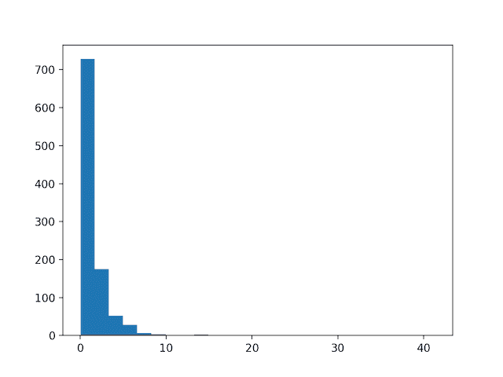
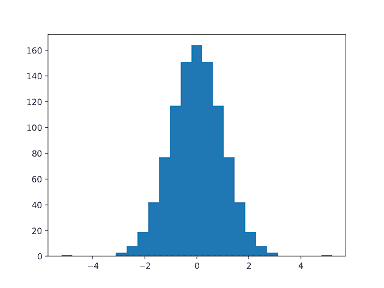
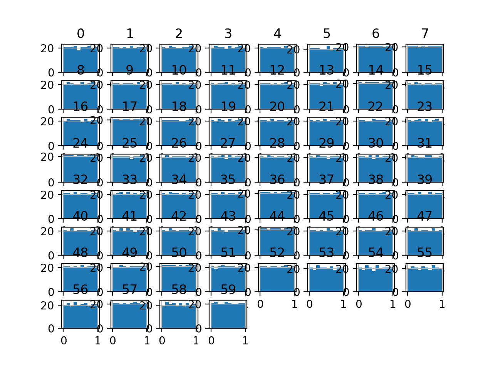
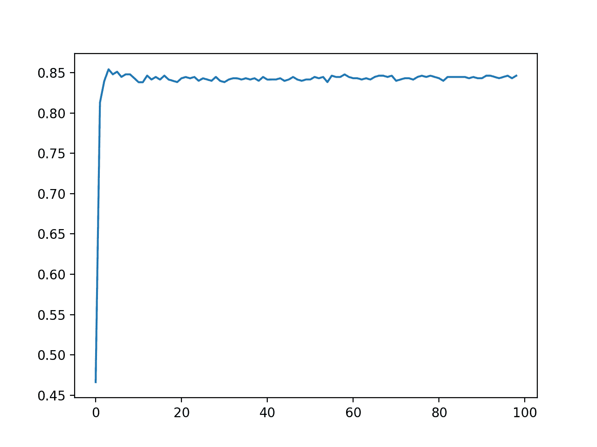

# 如何为机器学习使用分位数变换

> 原文：<https://machinelearningmastery.com/quantile-transforms-for-machine-learning/>

最后更新于 2020 年 8 月 28 日

数值输入变量可能具有高度偏斜或非标准分布。

这可能是由数据中的异常值、多模态分布、高度指数分布等引起的。

在回归的情况下，当数值输入变量甚至输出变量具有标准概率分布，例如高斯(正态)或均匀分布时，许多机器学习算法更喜欢或表现得更好。

分位数转换提供了一种自动方式来转换数字输入变量，使其具有不同的数据分布，进而可以用作预测模型的输入。

在本教程中，您将发现如何使用分位数转换来改变机器学习中数值变量的分布。

完成本教程后，您将知道:

*   当数值变量具有高斯或标准概率分布时，许多机器学习算法更喜欢或表现得更好。
*   分位数转换是一种将数值输入或输出变量转换为高斯或均匀概率分布的技术。
*   如何利用 QuantileTransformer 改变数值变量的概率分布，提高预测模型的表现。

**用我的新书[机器学习的数据准备](https://machinelearningmastery.com/data-preparation-for-machine-learning/)启动你的项目**，包括*分步教程*和所有示例的 *Python 源代码*文件。

我们开始吧。


如何使用分位数变换进行机器学习。新西兰，保留部分权利。

## 教程概述

本教程分为五个部分；它们是:

1.  更改数据分布
2.  分位数变换
3.  声纳数据集
4.  正规分位数变换
5.  均匀分位数变换

## 更改数据分布

当变量分布为高斯分布时，许多机器学习算法的表现更好。

回想一下，每个变量的观测值可能被认为是从概率分布中得出的。高斯分布是常见的钟形分布。常见到经常被称为“*正态*分布。

有关高斯概率分布的更多信息，请参见教程:

*   [机器学习的连续概率分布](https://machinelearningmastery.com/continuous-probability-distributions-for-machine-learning/)

一些算法，如[线性回归](https://machinelearningmastery.com/implement-linear-regression-stochastic-gradient-descent-scratch-python/)和[逻辑回归](https://machinelearningmastery.com/logistic-regression-for-machine-learning/)，明确假设实值变量具有高斯分布。其他非线性算法可能没有这种假设，但当变量具有高斯分布时，往往表现更好。

这既适用于分类和回归任务中的实值输入变量，也适用于回归任务中的实值目标变量。

一些输入变量可能具有高度偏斜的分布，例如指数分布，其中最常见的观测值聚集在一起。一些输入变量可能有异常值，导致分布高度分散。

这些问题和其他问题，如非标准分布和多模态分布，会使数据集难以用一系列机器学习模型建模。

因此，通常希望将每个输入变量转换成标准概率分布，例如高斯(正态)分布或均匀分布。

## 分位数变换

分位数变换将变量的概率分布映射到另一个概率分布。

回想一下[分位数函数](https://en.wikipedia.org/wiki/Quantile_function)，也称为百分比点函数(PPF)，是累积概率分布(CDF)的倒数。CDF 是一个函数，它返回一个值达到或低于给定值的概率。PPF 是这个函数的逆函数，在给定的概率下返回这个值。

分位数函数对观测值之间的关系进行排序或平滑，并且可以映射到其他分布上，例如均匀分布或正态分布。

该变换可以应用于训练数据集中的每个数字输入变量，然后作为输入提供给机器学习模型，以学习预测建模任务。

这个分位数转换可以通过[quantilettransformer 类](https://Sklearn.org/stable/modules/generated/sklearn.preprocessing.QuantileTransformer.html)在 Sklearn Python 机器学习库中获得。

该类有一个“ *output_distribution* ”参数，可以设置为“*制服*”或“*普通*”，默认为“*制服*”。

它还提供了一个“*n _ 分位数*”，该分位数决定了数据集内观测值的映射或排序的分辨率。必须将该值设置为小于数据集中观测值数量的值，并默认为 1，000。

我们可以用一个小的工作示例来演示*quantilettransformer*。我们可以生成[随机高斯数](https://machinelearningmastery.com/how-to-generate-random-numbers-in-python/)的样本，并通过计算指数对分布施加偏斜。然后可以使用*量化转换器*将数据集转换为另一个分布，在这种情况下，转换回高斯分布。

下面列出了完整的示例。

```py
# demonstration of the quantile transform
from numpy import exp
from numpy.random import randn
from sklearn.preprocessing import QuantileTransformer
from matplotlib import pyplot
# generate gaussian data sample
data = randn(1000)
# add a skew to the data distribution
data = exp(data)
# histogram of the raw data with a skew
pyplot.hist(data, bins=25)
pyplot.show()
# reshape data to have rows and columns
data = data.reshape((len(data),1))
# quantile transform the raw data
quantile = QuantileTransformer(output_distribution='normal')
data_trans = quantile.fit_transform(data)
# histogram of the transformed data
pyplot.hist(data_trans, bins=25)
pyplot.show()
```

运行该示例首先创建一个 1，000 个随机高斯值的样本，并向数据集添加一个倾斜。

从倾斜的数据集中创建直方图，并清楚地显示被推到最左边的分布。



偏斜高斯分布直方图

然后使用*quantilettransformer*映射数据分布高斯并标准化结果，以平均值 0 和标准偏差 1.0 为中心。

创建变换数据的直方图，显示高斯形状的数据分布。



分位数变换后偏斜高斯数据的直方图

在接下来的几节中，我们将详细了解如何在真实数据集上使用分位数转换。

接下来，让我们介绍数据集。

## 声纳数据集

声纳数据集是用于二进制分类的标准机器学习数据集。

它涉及 60 个实值输入和一个两类目标变量。数据集中有 208 个示例，类别相当均衡。

使用重复的分层 10 倍交叉验证，基线分类算法可以达到大约 53.4%的分类精度。[使用重复的分层 10 倍交叉验证，该数据集的最高表现](https://machinelearningmastery.com/results-for-standard-classification-and-regression-machine-learning-datasets/)约为 88%。

该数据集描述了岩石或模拟地雷的声纳回波。

您可以从这里了解有关数据集的更多信息:

*   [声纳数据集](https://raw.githubusercontent.com/jbrownlee/Datasets/master/sonar.csv)
*   [声纳数据集描述](https://raw.githubusercontent.com/jbrownlee/Datasets/master/sonar.names)

不需要下载数据集；我们将从我们的工作示例中自动下载它。

首先，让我们加载并总结数据集。下面列出了完整的示例。

```py
# load and summarize the sonar dataset
from pandas import read_csv
from pandas.plotting import scatter_matrix
from matplotlib import pyplot
# Load dataset
url = "https://raw.githubusercontent.com/jbrownlee/Datasets/master/sonar.csv"
dataset = read_csv(url, header=None)
# summarize the shape of the dataset
print(dataset.shape)
# summarize each variable
print(dataset.describe())
# histograms of the variables
dataset.hist()
pyplot.show()
```

运行该示例首先总结加载数据集的形状。

这确认了 60 个输入变量、一个输出变量和 208 行数据。

提供了输入变量的统计摘要，显示值是数值，范围大约从 0 到 1。

```py
(208, 61)
               0           1           2   ...          57          58          59
count  208.000000  208.000000  208.000000  ...  208.000000  208.000000  208.000000
mean     0.029164    0.038437    0.043832  ...    0.007949    0.007941    0.006507
std      0.022991    0.032960    0.038428  ...    0.006470    0.006181    0.005031
min      0.001500    0.000600    0.001500  ...    0.000300    0.000100    0.000600
25%      0.013350    0.016450    0.018950  ...    0.003600    0.003675    0.003100
50%      0.022800    0.030800    0.034300  ...    0.005800    0.006400    0.005300
75%      0.035550    0.047950    0.057950  ...    0.010350    0.010325    0.008525
max      0.137100    0.233900    0.305900  ...    0.044000    0.036400    0.043900

[8 rows x 60 columns]
```

最后为每个输入变量创建一个直方图。

如果我们忽略图中杂乱的东西，专注于直方图本身，我们可以看到许多变量都有一个偏斜的分布。

数据集为使用分位数变换使变量更具高斯性提供了一个很好的候选对象。


声纳二进制类别数据集输入变量的直方图

接下来，让我们在原始数据集上拟合和评估一个机器学习模型。

我们将使用带有默认超参数的 k 近邻算法，并使用[重复分层 k 重交叉验证](https://machinelearningmastery.com/k-fold-cross-validation/)对其进行评估。下面列出了完整的示例。

```py
# evaluate knn on the raw sonar dataset
from numpy import mean
from numpy import std
from pandas import read_csv
from sklearn.model_selection import cross_val_score
from sklearn.model_selection import RepeatedStratifiedKFold
from sklearn.neighbors import KNeighborsClassifier
from sklearn.preprocessing import LabelEncoder
from matplotlib import pyplot
# load dataset
url = "https://raw.githubusercontent.com/jbrownlee/Datasets/master/sonar.csv"
dataset = read_csv(url, header=None)
data = dataset.values
# separate into input and output columns
X, y = data[:, :-1], data[:, -1]
# ensure inputs are floats and output is an integer label
X = X.astype('float32')
y = LabelEncoder().fit_transform(y.astype('str'))
# define and configure the model
model = KNeighborsClassifier()
# evaluate the model
cv = RepeatedStratifiedKFold(n_splits=10, n_repeats=3, random_state=1)
n_scores = cross_val_score(model, X, y, scoring='accuracy', cv=cv, n_jobs=-1, error_score='raise')
# report model performance
print('Accuracy: %.3f (%.3f)' % (mean(n_scores), std(n_scores)))
```

运行该示例会评估原始声纳数据集上的 KNN 模型。

**注**:考虑到算法或评估程序的随机性，或数值精度的差异，您的[结果可能会有所不同](https://machinelearningmastery.com/different-results-each-time-in-machine-learning/)。考虑运行该示例几次，并比较平均结果。

我们可以看到，该模型实现了大约 79.7%的平均分类准确率，表明它具有技巧性(优于 53.4%)，并且处于良好表现的球园区(88%)。

```py
Accuracy: 0.797 (0.073)
```

接下来，让我们探索数据集的正常分位数转换。

## 正规分位数变换

通常希望将输入变量转换为具有正态概率分布，以提高建模表现。

我们可以使用*quantilettransformer*类应用分位数转换，并将“*输出 _ 分布*参数设置为“*正常*”。我们还必须将“*n _ 分位数*”参数设置为小于训练数据集中观测值数量的值，在本例中为 100。

一旦定义，我们就可以调用 *fit_transform()* 函数，并将其传递给我们的数据集，以创建数据集的分位数转换版本。

```py
...
# perform a normal quantile transform of the dataset
trans = QuantileTransformer(n_quantiles=100, output_distribution='normal')
data = trans.fit_transform(data)
```

让我们在声纳数据集上试试。

下面列出了创建声纳数据集的正常分位数变换并绘制结果直方图的完整示例。

```py
# visualize a normal quantile transform of the sonar dataset
from pandas import read_csv
from pandas import DataFrame
from pandas.plotting import scatter_matrix
from sklearn.preprocessing import QuantileTransformer
from matplotlib import pyplot
# load dataset
url = "https://raw.githubusercontent.com/jbrownlee/Datasets/master/sonar.csv"
dataset = read_csv(url, header=None)
# retrieve just the numeric input values
data = dataset.values[:, :-1]
# perform a normal quantile transform of the dataset
trans = QuantileTransformer(n_quantiles=100, output_distribution='normal')
data = trans.fit_transform(data)
# convert the array back to a dataframe
dataset = DataFrame(data)
# histograms of the variables
dataset.hist()
pyplot.show()
```

运行该示例会转换数据集并绘制每个输入变量的直方图。

我们可以看到，与原始数据相比，每个变量的直方图形状看起来非常高斯。


声纳数据集正常分位数转换输入变量的直方图

接下来，让我们评估与上一节相同的 KNN 模型，但在这种情况下是基于数据集的正常分位数变换。

下面列出了完整的示例。

```py
# evaluate knn on the sonar dataset with normal quantile transform
from numpy import mean
from numpy import std
from pandas import read_csv
from sklearn.model_selection import cross_val_score
from sklearn.model_selection import RepeatedStratifiedKFold
from sklearn.neighbors import KNeighborsClassifier
from sklearn.preprocessing import LabelEncoder
from sklearn.preprocessing import QuantileTransformer
from sklearn.pipeline import Pipeline
from matplotlib import pyplot
# load dataset
url = "https://raw.githubusercontent.com/jbrownlee/Datasets/master/sonar.csv"
dataset = read_csv(url, header=None)
data = dataset.values
# separate into input and output columns
X, y = data[:, :-1], data[:, -1]
# ensure inputs are floats and output is an integer label
X = X.astype('float32')
y = LabelEncoder().fit_transform(y.astype('str'))
# define the pipeline
trans = QuantileTransformer(n_quantiles=100, output_distribution='normal')
model = KNeighborsClassifier()
pipeline = Pipeline(steps=[('t', trans), ('m', model)])
# evaluate the pipeline
cv = RepeatedStratifiedKFold(n_splits=10, n_repeats=3, random_state=1)
n_scores = cross_val_score(pipeline, X, y, scoring='accuracy', cv=cv, n_jobs=-1, error_score='raise')
# report pipeline performance
print('Accuracy: %.3f (%.3f)' % (mean(n_scores), std(n_scores)))
```

**注**:考虑到算法或评估程序的随机性，或数值精度的差异，您的[结果可能会有所不同](https://machinelearningmastery.com/different-results-each-time-in-machine-learning/)。考虑运行该示例几次，并比较平均结果。

运行该示例，我们可以看到正常的分位数变换将表现从没有变换时的 79.7%提升到有变换时的约 81.7%。

```py
Accuracy: 0.817 (0.087)
```

接下来，让我们仔细看看均匀分位数变换。

## 均匀分位数变换

有时，将高度指数或多模态分布转换为均匀分布可能是有益的。

这对于值范围大且稀疏的数据尤其有用，例如，异常值是常见的而不是罕见的。

我们可以通过定义一个*quantilettransformer*类并将“ *output_distribution* ”参数设置为“ *uniform* ”(默认值)来应用转换。

```py
...
# perform a uniform quantile transform of the dataset
trans = QuantileTransformer(n_quantiles=100, output_distribution='uniform')
data = trans.fit_transform(data)
```

以下示例应用统一分位数变换，并创建每个变换变量的直方图。

```py
# visualize a uniform quantile transform of the sonar dataset
from pandas import read_csv
from pandas import DataFrame
from pandas.plotting import scatter_matrix
from sklearn.preprocessing import QuantileTransformer
from matplotlib import pyplot
# load dataset
url = "https://raw.githubusercontent.com/jbrownlee/Datasets/master/sonar.csv"
dataset = read_csv(url, header=None)
# retrieve just the numeric input values
data = dataset.values[:, :-1]
# perform a uniform quantile transform of the dataset
trans = QuantileTransformer(n_quantiles=100, output_distribution='uniform')
data = trans.fit_transform(data)
# convert the array back to a dataframe
dataset = DataFrame(data)
# histograms of the variables
dataset.hist()
pyplot.show()
```

运行该示例会转换数据集并绘制每个输入变量的直方图。

我们可以看到，与原始数据相比，每个变量的直方图形状看起来非常一致。



声纳数据集的均匀分位数变换输入变量的直方图

接下来，让我们评估与上一节相同的 KNN 模型，但在这种情况下是对原始数据集的统一分位数变换。

下面列出了完整的示例。

```py
# evaluate knn on the sonar dataset with uniform quantile transform
from numpy import mean
from numpy import std
from pandas import read_csv
from sklearn.model_selection import cross_val_score
from sklearn.model_selection import RepeatedStratifiedKFold
from sklearn.neighbors import KNeighborsClassifier
from sklearn.preprocessing import LabelEncoder
from sklearn.preprocessing import QuantileTransformer
from sklearn.pipeline import Pipeline
from matplotlib import pyplot
# load dataset
url = "https://raw.githubusercontent.com/jbrownlee/Datasets/master/sonar.csv"
dataset = read_csv(url, header=None)
data = dataset.values
# separate into input and output columns
X, y = data[:, :-1], data[:, -1]
# ensure inputs are floats and output is an integer label
X = X.astype('float32')
y = LabelEncoder().fit_transform(y.astype('str'))
# define the pipeline
trans = QuantileTransformer(n_quantiles=100, output_distribution='uniform')
model = KNeighborsClassifier()
pipeline = Pipeline(steps=[('t', trans), ('m', model)])
# evaluate the pipeline
cv = RepeatedStratifiedKFold(n_splits=10, n_repeats=3, random_state=1)
n_scores = cross_val_score(pipeline, X, y, scoring='accuracy', cv=cv, n_jobs=-1, error_score='raise')
# report pipeline performance
print('Accuracy: %.3f (%.3f)' % (mean(n_scores), std(n_scores)))
```

**注**:考虑到算法或评估程序的随机性，或数值精度的差异，您的[结果可能会有所不同](https://machinelearningmastery.com/different-results-each-time-in-machine-learning/)。考虑运行该示例几次，并比较平均结果。

运行该示例，我们可以看到均匀变换将表现从没有变换时的 79.7%提升到有变换时的 84.5%，优于得分为 81.7%的正常变换。

```py
Accuracy: 0.845 (0.074)
```

我们选择分位数作为任意数，在本例中为 100。

这个超参数可以被调整来探索变换的分辨率对模型的最终技能的影响。

下面的示例执行了该实验，并绘制了从 1 到 99 的不同“*n _ 分位数*”值的平均精度。

```py
# explore number of quantiles on classification accuracy
from numpy import mean
from numpy import std
from pandas import read_csv
from sklearn.model_selection import cross_val_score
from sklearn.model_selection import RepeatedStratifiedKFold
from sklearn.neighbors import KNeighborsClassifier
from sklearn.preprocessing import QuantileTransformer
from sklearn.preprocessing import LabelEncoder
from sklearn.pipeline import Pipeline
from matplotlib import pyplot

# get the dataset
def get_dataset():
	# load dataset
	url = "https://raw.githubusercontent.com/jbrownlee/Datasets/master/sonar.csv"
	dataset = read_csv(url, header=None)
	data = dataset.values
	# separate into input and output columns
	X, y = data[:, :-1], data[:, -1]
	# ensure inputs are floats and output is an integer label
	X = X.astype('float32')
	y = LabelEncoder().fit_transform(y.astype('str'))
	return X, y

# get a list of models to evaluate
def get_models():
	models = dict()
	for i in range(1,100):
		# define the pipeline
		trans = QuantileTransformer(n_quantiles=i, output_distribution='uniform')
		model = KNeighborsClassifier()
		models[str(i)] = Pipeline(steps=[('t', trans), ('m', model)])
	return models

# evaluate a give model using cross-validation
def evaluate_model(model, X, y):
	cv = RepeatedStratifiedKFold(n_splits=10, n_repeats=3, random_state=1)
	scores = cross_val_score(model, X, y, scoring='accuracy', cv=cv, n_jobs=-1, error_score='raise')
	return scores

# define dataset
X, y = get_dataset()
# get the models to evaluate
models = get_models()
# evaluate the models and store results
results = list()
for name, model in models.items():
	scores = evaluate_model(model, X, y)
	results.append(mean(scores))
	print('>%s %.3f (%.3f)' % (name, mean(scores), std(scores)))
# plot model performance for comparison
pyplot.plot(results)
pyplot.show()
```

运行该示例会报告“*n _ 分位数*”参数的每个值的平均分类精度。

**注**:考虑到算法或评估程序的随机性，或数值精度的差异，您的[结果可能会有所不同](https://machinelearningmastery.com/different-results-each-time-in-machine-learning/)。考虑运行该示例几次，并比较平均结果。

我们可以看到，令人惊讶的是，较小的值导致更好的准确性，例如 4 的值达到了大约 85.4%的准确性。

```py
>1 0.466 (0.016)
>2 0.813 (0.085)
>3 0.840 (0.080)
>4 0.854 (0.075)
>5 0.848 (0.072)
>6 0.851 (0.071)
>7 0.845 (0.071)
>8 0.848 (0.066)
>9 0.848 (0.071)
>10 0.843 (0.074)
...
```

会创建一个折线图，显示转换中使用的分位数与所得模型的分类精度。

我们可以看到一个值小于 10 的凸起，之后表现下降并持平。

结果强调，探索不同的分布和分位数可能会有一些好处，看看是否可以实现更好的表现。



声纳数据集上分位数与 KNN 分类精度的线图

## 进一步阅读

如果您想更深入地了解这个主题，本节将提供更多资源。

### 教程

*   [机器学习的连续概率分布](https://machinelearningmastery.com/continuous-probability-distributions-for-machine-learning/)
*   [如何用 Scikit 转换回归的目标变量-学习](https://machinelearningmastery.com/how-to-transform-target-variables-for-regression-with-Sklearn/)

### 资料组

*   [声纳数据集](https://raw.githubusercontent.com/jbrownlee/Datasets/master/sonar.csv)
*   [声纳数据集描述](https://raw.githubusercontent.com/jbrownlee/Datasets/master/sonar.names)

### 蜜蜂

*   [非线性变换，sci kit-学习指南](https://Sklearn.org/stable/modules/preprocessing.html#preprocessing-transformer)。
*   [硬化。预处理。量子转换器 API](https://Sklearn.org/stable/modules/generated/sklearn.preprocessing.QuantileTransformer.html) 。

### 文章

*   [分位数函数，维基百科](https://en.wikipedia.org/wiki/Quantile_function)。

## 摘要

在本教程中，您发现了如何使用分位数转换来改变机器学习中数值变量的分布。

具体来说，您了解到:

*   当数值变量具有高斯或标准概率分布时，许多机器学习算法更喜欢或表现得更好。
*   分位数转换是一种将数值输入或输出变量转换为高斯或均匀概率分布的技术。
*   如何利用 QuantileTransformer 改变数值变量的概率分布，提高预测模型的表现。

**你有什么问题吗？**
在下面的评论中提问，我会尽力回答。