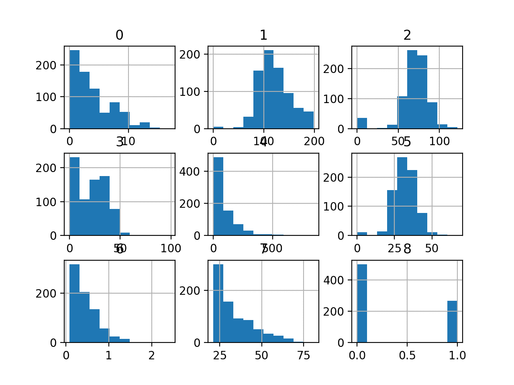

# 如何有选择地缩放机器学习的数值输入变量

> 原文：<https://machinelearningmastery.com/selectively-scale-numerical-input-variables-for-machine-learning/>

最后更新于 2020 年 8 月 17 日

许多机器学习模型在建模前仔细转换或缩放输入变量时表现更好。

将相同的数据转换(如标准化和规范化)同等地应用于所有输入变量是方便的，因此也是常见的。这样可以在很多问题上取得很好的效果。然而，通过在建模之前仔细选择要应用于每个输入变量的数据变换，可以获得更好的结果。

在本教程中，您将发现如何应用数字输入变量的选择性缩放。

完成本教程后，您将知道:

*   如何加载和计算糖尿病分类数据集的基线预测表现？
*   如何评估数据转换盲目应用于所有数值输入变量的建模管道。
*   如何用应用于输入变量子集的选择性规范化和标准化来评估建模管道？

**用我的新书[机器学习的数据准备](https://machinelearningmastery.com/data-preparation-for-machine-learning/)启动你的项目**，包括*分步教程*和所有示例的 *Python 源代码*文件。

我们开始吧。


如何有选择地缩放机器学习的数字输入变量
图片由[马可·韦奇](https://www.flickr.com/photos/160866001@N07/46824499581/)提供，版权所有。

## 教程概述

本教程分为三个部分；它们是:

1.  糖尿病数值数据集
2.  数字输入的非选择性缩放
    1.  标准化所有输入变量
    2.  标准化所有输入变量
3.  数字输入的选择性缩放
    1.  仅归一化非高斯输入变量
    2.  仅标准化类似高斯的输入变量
    3.  选择性地规范化和标准化输入变量

## 糖尿病数值数据集

作为本教程的基础，我们将使用自 20 世纪 90 年代以来作为机器学习数据集被广泛研究的所谓“糖尿病”数据集。

该数据集将患者数据分为五年内糖尿病发作和非糖尿病发作。共有 768 个例子和 8 个输入变量。这是一个二元分类问题。

您可以在此了解有关数据集的更多信息:

*   [糖尿病数据集(pima-印度人-diabetes.csv)](https://raw.githubusercontent.com/jbrownlee/Datasets/master/pima-indians-diabetes.csv)
*   [糖尿病数据集描述(pima-印度人-糖尿病.名称)](https://raw.githubusercontent.com/jbrownlee/Datasets/master/pima-indians-diabetes.names)

不需要下载数据集；我们将自动下载它，作为下面工作示例的一部分。

查看数据，我们可以看到所有九个输入变量都是数值。

```py
6,148,72,35,0,33.6,0.627,50,1
1,85,66,29,0,26.6,0.351,31,0
8,183,64,0,0,23.3,0.672,32,1
1,89,66,23,94,28.1,0.167,21,0
0,137,40,35,168,43.1,2.288,33,1
...
```

我们可以使用熊猫库将这个数据集加载到内存中。

以下示例下载并总结了糖尿病数据集。

```py
# load and summarize the diabetes dataset
from pandas import read_csv
from pandas.plotting import scatter_matrix
from matplotlib import pyplot
# Load dataset
url = "https://raw.githubusercontent.com/jbrownlee/Datasets/master/pima-indians-diabetes.csv"
dataset = read_csv(url, header=None)
# summarize the shape of the dataset
print(dataset.shape)
# histograms of the variables
dataset.hist()
pyplot.show()
```

运行该示例首先下载数据集，并将其作为数据帧加载。

打印数据集的形状，确认行数、九个变量、八个输入和一个目标。

```py
(768, 9)
```

最后，创建一个图，显示数据集中每个变量的直方图。

这很有用，因为我们可以看到一些变量具有高斯或类高斯分布(1，2，5)，而其他变量具有类指数分布(0，3，4，6，7)。这可能意味着不同类型的输入变量需要不同的数字数据转换。



糖尿病分类数据集中每个变量的直方图

现在我们对数据集有点熟悉了，让我们尝试在原始数据集上拟合和评估模型。

我们将使用逻辑回归模型，因为它们是用于二进制分类任务的健壮且有效的线性模型。我们将使用重复的分层 k 折叠交叉验证来评估模型，这是一种最佳实践，并使用 10 次折叠和 3 次重复。

下面列出了完整的示例。

```py
# evaluate a logistic regression model on the raw diabetes dataset
from numpy import mean
from numpy import std
from pandas import read_csv
from sklearn.preprocessing import LabelEncoder
from sklearn.model_selection import cross_val_score
from sklearn.model_selection import RepeatedStratifiedKFold
from sklearn.linear_model import LogisticRegression
# load dataset
url = 'https://raw.githubusercontent.com/jbrownlee/Datasets/master/pima-indians-diabetes.csv'
dataframe = read_csv(url, header=None)
data = dataframe.values
# separate into input and output elements
X, y = data[:, :-1], data[:, -1]
# minimally prepare dataset
X = X.astype('float')
y = LabelEncoder().fit_transform(y.astype('str'))
# define the model
model = LogisticRegression(solver='liblinear')
# define the evaluation procedure
cv = RepeatedStratifiedKFold(n_splits=10, n_repeats=3, random_state=1)
# evaluate the model
m_scores = cross_val_score(model, X, y, scoring='accuracy', cv=cv, n_jobs=-1)
# summarize the result
print('Accuracy: %.3f (%.3f)' % (mean(m_scores), std(m_scores)))
```

运行该示例评估模型，并报告在原始数据集上拟合逻辑回归模型的平均值和标准偏差精度。

**注**:考虑到算法或评估程序的随机性，或数值精度的差异，您的[结果可能会有所不同](https://machinelearningmastery.com/different-results-each-time-in-machine-learning/)。考虑运行该示例几次，并比较平均结果。

在这种情况下，我们可以看到模型达到了大约 76.8%的准确率。

```py
Accuracy: 0.768 (0.040)
```

现在，我们已经在数据集上建立了表现基线，让我们看看是否可以使用数据缩放来提高表现。

## 数字输入的非选择性缩放

许多算法喜欢或要求在拟合模型之前将输入变量缩放到一致的范围。

这包括假设输入变量具有高斯概率分布的逻辑回归模型。如果输入变量标准化，它还可以提供一个数值更稳定的模型。然而，即使当这些期望被违反时，逻辑回归对于给定的数据集可以表现良好或最好，糖尿病数据集可能就是这种情况。

缩放数字输入变量的两种常用技术是标准化和规范化。

标准化将每个输入变量缩放到 0-1 的范围，并且可以使用 scikit-learn 中的[最小最大缩放器](https://scikit-learn.org/stable/modules/generated/sklearn.preprocessing.MinMaxScaler.html)类来实现。标准化将每个输入变量的平均值和标准偏差分别调整为 0.0 和 1.0，可以使用 scikit-learn 中的[标准缩放器](https://scikit-learn.org/stable/modules/generated/sklearn.preprocessing.StandardScaler.html)类来实现。

要了解有关规范化、标准化以及如何在 scikit-learn 中使用这些方法的更多信息，请参见教程:

*   [如何在 Python 中使用标准缩放器和最小最大缩放器变换](https://machinelearningmastery.com/standardscaler-and-minmaxscaler-transforms-in-python/)

一种简单的数据缩放方法对所有输入变量应用单一的变换，而不管它们的规模或概率分布如何。这通常是有效的。

让我们尝试直接规范化和标准化所有输入变量，并将表现与原始数据上的基线逻辑回归模型进行比较。

### 标准化所有输入变量

我们可以更新基线代码示例来使用建模管道，其中第一步是应用缩放器，最后一步是拟合模型。

这确保了缩放操作仅适用于或准备用于训练集，然后在交叉验证过程中应用于训练集和测试集，从而避免数据泄漏。数据泄露会导致对模型表现的乐观估计。

这可以使用 pipeline 类来实现，在 Pipeline 类中，管道中的每个步骤都被定义为一个元组，该元组具有要使用的转换或模型的名称和实例。

```py
...
# define the modeling pipeline
scaler = MinMaxScaler()
model = LogisticRegression(solver='liblinear')
pipeline = Pipeline([('s',scaler),('m',model)])
```

将这些联系在一起，下面列出了在糖尿病数据集上评估逻辑回归的完整示例，其中所有输入变量都进行了标准化。

```py
# evaluate a logistic regression model on the normalized diabetes dataset
from numpy import mean
from numpy import std
from pandas import read_csv
from sklearn.preprocessing import LabelEncoder
from sklearn.model_selection import cross_val_score
from sklearn.model_selection import RepeatedStratifiedKFold
from sklearn.pipeline import Pipeline
from sklearn.linear_model import LogisticRegression
from sklearn.preprocessing import MinMaxScaler
# load dataset
url = 'https://raw.githubusercontent.com/jbrownlee/Datasets/master/pima-indians-diabetes.csv'
dataframe = read_csv(url, header=None)
data = dataframe.values
# separate into input and output elements
X, y = data[:, :-1], data[:, -1]
# minimally prepare dataset
X = X.astype('float')
y = LabelEncoder().fit_transform(y.astype('str'))
# define the modeling pipeline
model = LogisticRegression(solver='liblinear')
scaler = MinMaxScaler()
pipeline = Pipeline([('s',scaler),('m',model)])
# define the evaluation procedure
cv = RepeatedStratifiedKFold(n_splits=10, n_repeats=3, random_state=1)
# evaluate the model
m_scores = cross_val_score(pipeline, X, y, scoring='accuracy', cv=cv, n_jobs=-1)
# summarize the result
print('Accuracy: %.3f (%.3f)' % (mean(m_scores), std(m_scores)))
```

运行该示例评估建模管道，并报告在标准化数据集上拟合逻辑回归模型的平均值和标准偏差精度。

**注**:考虑到算法或评估程序的随机性，或数值精度的差异，您的[结果可能会有所不同](https://machinelearningmastery.com/different-results-each-time-in-machine-learning/)。考虑运行该示例几次，并比较平均结果。

在这种情况下，我们可以看到，输入变量的标准化导致平均分类精度从原始数据模型拟合的 76.8%下降到标准化管道的 76.4%。

```py
Accuracy: 0.764 (0.045)
```

接下来，让我们尝试标准化所有输入变量。

### 标准化所有输入变量

在拟合和评估逻辑回归模型之前，我们可以更新建模管道，对所有输入变量使用标准化，而不是标准化。

这可能是对具有类似高斯分布的输入变量的适当转换，但可能不是对其他变量的转换。

```py
...
# define the modeling pipeline
scaler = StandardScaler()
model = LogisticRegression(solver='liblinear')
pipeline = Pipeline([('s',scaler),('m',model)])
```

将这些联系在一起，下面列出了在糖尿病数据集上评估逻辑回归模型的完整示例，其中所有输入变量都已标准化。

```py
# evaluate a logistic regression model on the standardized diabetes dataset
from numpy import mean
from numpy import std
from pandas import read_csv
from sklearn.preprocessing import LabelEncoder
from sklearn.model_selection import cross_val_score
from sklearn.model_selection import RepeatedStratifiedKFold
from sklearn.pipeline import Pipeline
from sklearn.linear_model import LogisticRegression
from sklearn.preprocessing import StandardScaler
# load dataset
url = 'https://raw.githubusercontent.com/jbrownlee/Datasets/master/pima-indians-diabetes.csv'
dataframe = read_csv(url, header=None)
data = dataframe.values
# separate into input and output elements
X, y = data[:, :-1], data[:, -1]
# minimally prepare dataset
X = X.astype('float')
y = LabelEncoder().fit_transform(y.astype('str'))
# define the modeling pipeline
scaler = StandardScaler()
model = LogisticRegression(solver='liblinear')
pipeline = Pipeline([('s',scaler),('m',model)])
# define the evaluation procedure
cv = RepeatedStratifiedKFold(n_splits=10, n_repeats=3, random_state=1)
# evaluate the model
m_scores = cross_val_score(pipeline, X, y, scoring='accuracy', cv=cv, n_jobs=-1)
# summarize the result
print('Accuracy: %.3f (%.3f)' % (mean(m_scores), std(m_scores)))
```

运行该示例评估建模管道，并报告在标准化数据集上拟合逻辑回归模型的均值和标准差精度。

**注**:考虑到算法或评估程序的随机性，或数值精度的差异，您的[结果可能会有所不同](https://machinelearningmastery.com/different-results-each-time-in-machine-learning/)。考虑运行该示例几次，并比较平均结果。

在这种情况下，我们可以看到，标准化所有数字输入变量已导致平均分类精度从原始数据集上评估的模型的 76.8%提升到标准化输入变量数据集上评估的模型的约 77.2%。

```py
Accuracy: 0.772 (0.043)
```

到目前为止，我们已经了解到标准化所有变量对表现没有帮助，但是标准化所有输入变量对表现有帮助。

接下来，让我们探讨一下选择性地对输入变量应用缩放是否能提供进一步的改进。

## 数字输入的选择性缩放

使用 scikit-learn 中的 [ColumnTransformer 类，可以有选择地将数据转换应用于输入变量。](https://scikit-learn.org/stable/modules/generated/sklearn.compose.ColumnTransformer.html)

它允许您指定要应用的转换(或转换管道)以及要应用它们的列索引。然后，这可以用作建模管道的一部分，并使用交叉验证进行评估。

您可以在教程中了解有关如何使用 ColumnTransformer 的更多信息:

*   [如何使用列转换器进行数据准备](https://machinelearningmastery.com/columntransformer-for-numerical-and-categorical-data/)

我们可以探索使用 ColumnTransformer 对糖尿病数据集的数字输入变量选择性地应用规范化和标准化，以查看我们是否能够实现进一步的表现改进。

### 仅归一化非高斯输入变量

首先，让我们试着规范化那些没有高斯概率分布的输入变量，让其余的输入变量单独处于原始状态。

我们可以使用列索引定义两组输入变量，一组用于高斯分布的变量，另一组用于指数分布的输入变量。

```py
...
# define column indexes for the variables with "normal" and "exponential" distributions
norm_ix = [1, 2, 5]
exp_ix = [0, 3, 4, 6, 7]
```

然后，我们可以有选择地规范化“ *exp_ix* ”组，让其他输入变量通过，而无需任何数据准备。

```py
...
# define the selective transforms
t = [('e', MinMaxScaler(), exp_ix)]
selective = ColumnTransformer(transformers=t, remainder='passthrough')
```

然后，选择性转换可以用作我们的建模管道的一部分。

```py
...
# define the modeling pipeline
model = LogisticRegression(solver='liblinear')
pipeline = Pipeline([('s',selective),('m',model)])
```

将这些联系在一起，下面列出了对一些输入变量进行选择性标准化的数据进行逻辑回归模型评估的完整示例。

```py
# evaluate a logistic regression model on the diabetes dataset with selective normalization
from numpy import mean
from numpy import std
from pandas import read_csv
from sklearn.preprocessing import LabelEncoder
from sklearn.model_selection import cross_val_score
from sklearn.model_selection import RepeatedStratifiedKFold
from sklearn.pipeline import Pipeline
from sklearn.linear_model import LogisticRegression
from sklearn.preprocessing import MinMaxScaler
from sklearn.compose import ColumnTransformer
# load dataset
url = 'https://raw.githubusercontent.com/jbrownlee/Datasets/master/pima-indians-diabetes.csv'
dataframe = read_csv(url, header=None)
data = dataframe.values
# separate into input and output elements
X, y = data[:, :-1], data[:, -1]
# minimally prepare dataset
X = X.astype('float')
y = LabelEncoder().fit_transform(y.astype('str'))
# define column indexes for the variables with "normal" and "exponential" distributions
norm_ix = [1, 2, 5]
exp_ix = [0, 3, 4, 6, 7]
# define the selective transforms
t = [('e', MinMaxScaler(), exp_ix)]
selective = ColumnTransformer(transformers=t, remainder='passthrough')
# define the modeling pipeline
model = LogisticRegression(solver='liblinear')
pipeline = Pipeline([('s',selective),('m',model)])
# define the evaluation procedure
cv = RepeatedStratifiedKFold(n_splits=10, n_repeats=3, random_state=1)
# evaluate the model
m_scores = cross_val_score(pipeline, X, y, scoring='accuracy', cv=cv, n_jobs=-1)
# summarize the result
print('Accuracy: %.3f (%.3f)' % (mean(m_scores), std(m_scores)))
```

运行该示例评估建模管道，并报告平均值和标准偏差精度。

**注**:考虑到算法或评估程序的随机性，或数值精度的差异，您的[结果可能会有所不同](https://machinelearningmastery.com/different-results-each-time-in-machine-learning/)。考虑运行该示例几次，并比较平均结果。

在这种情况下，我们可以看到稍好的表现，随着基线模型在原始数据集上的拟合度从 76.8%提高到约 76.9%，并对一些输入变量进行选择性归一化。

结果不如标准化所有的输入变量。

```py
Accuracy: 0.769 (0.043)
```

### 仅标准化类似高斯的输入变量

我们可以重复上一节的实验，尽管在这种情况下，有选择地标准化那些具有类似高斯分布的输入变量，而保持剩余的输入变量不变。

```py
...
# define the selective transforms
t = [('n', StandardScaler(), norm_ix)]
selective = ColumnTransformer(transformers=t, remainder='passthrough')
```

将这些联系在一起，下面列出了在对一些输入变量进行选择性标准化的数据上评估逻辑回归模型的完整示例。

```py
# evaluate a logistic regression model on the diabetes dataset with selective standardization
from numpy import mean
from numpy import std
from pandas import read_csv
from sklearn.preprocessing import LabelEncoder
from sklearn.model_selection import cross_val_score
from sklearn.model_selection import RepeatedStratifiedKFold
from sklearn.pipeline import Pipeline
from sklearn.linear_model import LogisticRegression
from sklearn.preprocessing import StandardScaler
from sklearn.compose import ColumnTransformer
# load dataset
url = 'https://raw.githubusercontent.com/jbrownlee/Datasets/master/pima-indians-diabetes.csv'
dataframe = read_csv(url, header=None)
data = dataframe.values
# separate into input and output elements
X, y = data[:, :-1], data[:, -1]
# minimally prepare dataset
X = X.astype('float')
y = LabelEncoder().fit_transform(y.astype('str'))
# define column indexes for the variables with "normal" and "exponential" distributions
norm_ix = [1, 2, 5]
exp_ix = [0, 3, 4, 6, 7]
# define the selective transforms
t = [('n', StandardScaler(), norm_ix)]
selective = ColumnTransformer(transformers=t, remainder='passthrough')
# define the modeling pipeline
model = LogisticRegression(solver='liblinear')
pipeline = Pipeline([('s',selective),('m',model)])
# define the evaluation procedure
cv = RepeatedStratifiedKFold(n_splits=10, n_repeats=3, random_state=1)
# evaluate the model
m_scores = cross_val_score(pipeline, X, y, scoring='accuracy', cv=cv, n_jobs=-1)
# summarize the result
print('Accuracy: %.3f (%.3f)' % (mean(m_scores), std(m_scores)))
```

运行该示例评估建模管道，并报告平均值和标准偏差精度。

**注**:考虑到算法或评估程序的随机性，或数值精度的差异，您的[结果可能会有所不同](https://machinelearningmastery.com/different-results-each-time-in-machine-learning/)。考虑运行该示例几次，并比较平均结果。

在这种情况下，我们可以看到，我们的表现提升了 76.8%，超过了原始数据集上基线模型拟合的 76.8%，也超过了所有输入变量标准化的 77.2%。通过选择性标准化，我们实现了大约 77.3%的平均准确率，这是一个适度但可测量的提升。

```py
Accuracy: 0.773 (0.041)
```

### 选择性地规范化和标准化输入变量

到目前为止的结果提出了一个问题，即我们是否可以通过在数据集上同时结合使用选择性规范化和标准化来获得进一步的提升。

这可以通过为 ColumnTransformer 类定义转换和它们各自的列索引来实现，并且不传递任何剩余的变量。

```py
...
# define the selective transforms
t = [('e', MinMaxScaler(), exp_ix), ('n', StandardScaler(), norm_ix)]
selective = ColumnTransformer(transformers=t)
```

将这些联系在一起，下面列出了对输入变量进行选择性规范化和标准化的数据进行逻辑回归模型评估的完整示例。

```py
# evaluate a logistic regression model on the diabetes dataset with selective scaling
from numpy import mean
from numpy import std
from pandas import read_csv
from sklearn.preprocessing import LabelEncoder
from sklearn.model_selection import cross_val_score
from sklearn.model_selection import RepeatedStratifiedKFold
from sklearn.pipeline import Pipeline
from sklearn.linear_model import LogisticRegression
from sklearn.preprocessing import MinMaxScaler
from sklearn.preprocessing import StandardScaler
from sklearn.compose import ColumnTransformer
# load dataset
url = 'https://raw.githubusercontent.com/jbrownlee/Datasets/master/pima-indians-diabetes.csv'
dataframe = read_csv(url, header=None)
data = dataframe.values
# separate into input and output elements
X, y = data[:, :-1], data[:, -1]
# minimally prepare dataset
X = X.astype('float')
y = LabelEncoder().fit_transform(y.astype('str'))
# define column indexes for the variables with "normal" and "exponential" distributions
norm_ix = [1, 2, 5]
exp_ix = [0, 3, 4, 6, 7]
# define the selective transforms
t = [('e', MinMaxScaler(), exp_ix), ('n', StandardScaler(), norm_ix)]
selective = ColumnTransformer(transformers=t)
# define the modeling pipeline
model = LogisticRegression(solver='liblinear')
pipeline = Pipeline([('s',selective),('m',model)])
# define the evaluation procedure
cv = RepeatedStratifiedKFold(n_splits=10, n_repeats=3, random_state=1)
# evaluate the model
m_scores = cross_val_score(pipeline, X, y, scoring='accuracy', cv=cv, n_jobs=-1)
# summarize the result
print('Accuracy: %.3f (%.3f)' % (mean(m_scores), std(m_scores)))
```

运行该示例评估建模管道，并报告平均值和标准偏差精度。

**注**:考虑到算法或评估程序的随机性，或数值精度的差异，您的[结果可能会有所不同](https://machinelearningmastery.com/different-results-each-time-in-machine-learning/)。考虑运行该示例几次，并比较平均结果。

有趣的是，在这种情况下，我们可以看到，我们实现了与标准化所有输入变量相同的表现，达到了 77.2%。

此外，结果表明，当非高斯型变量保持原样时，所选模型的表现优于标准化或规范化模型。

我不会猜到这个发现，它强调了仔细实验的重要性。

```py
Accuracy: 0.772 (0.040)
```

**你能做得更好吗？**

尝试其他变换或变换组合，看看是否能获得更好的结果。
在下面的评论中分享你的发现。

## 进一步阅读

如果您想更深入地了解这个主题，本节将提供更多资源。

### 教程

*   [标准机器学习数据集的最佳结果](https://machinelearningmastery.com/results-for-standard-classification-and-regression-machine-learning-datasets/)
*   [如何使用列转换器进行数据准备](https://machinelearningmastery.com/columntransformer-for-numerical-and-categorical-data/)
*   [如何在 Python 中使用标准缩放器和最小最大缩放器变换](https://machinelearningmastery.com/standardscaler-and-minmaxscaler-transforms-in-python/)

### 蜜蜂

*   [硬化。化合物。ColumnTransformer API](https://scikit-learn.org/stable/modules/generated/sklearn.compose.ColumnTransformer.html) 。

## 摘要

在本教程中，您发现了如何应用数字输入变量的选择性缩放。

具体来说，您了解到:

*   如何加载和计算糖尿病分类数据集的基线预测表现？
*   如何评估数据转换盲目应用于所有数值输入变量的建模管道。
*   如何用应用于输入变量子集的选择性规范化和标准化来评估建模管道？

**你有什么问题吗？**
在下面的评论中提问，我会尽力回答。