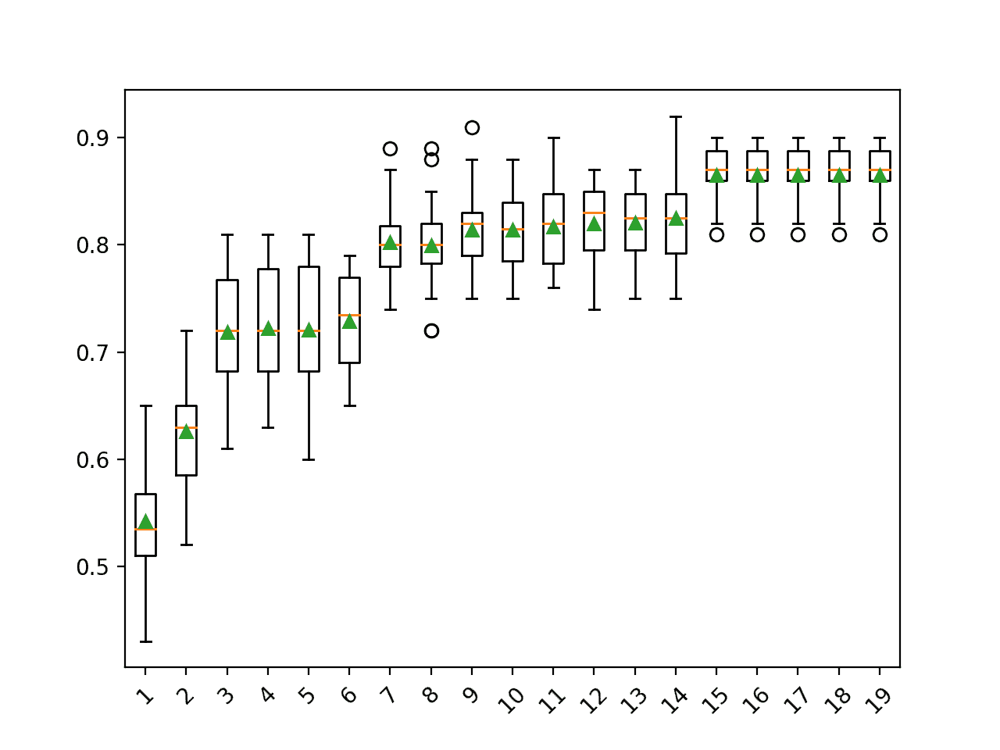

# Python 中用于降维的奇异值分解

> 原文：<https://machinelearningmastery.com/singular-value-decomposition-for-dimensionality-reduction-in-python/>

最后更新于 2020 年 8 月 18 日

减少预测模型的输入变量的数量被称为降维。

较少的输入变量可以导致更简单的预测模型，该模型在对新数据进行预测时可能具有更好的表现。

也许机器学习中更流行的降维技术是[奇异值分解](https://machinelearningmastery.com/singular-value-decomposition-for-machine-learning/)，简称 SVD。这是一种来自线性代数领域的技术，可以用作数据准备技术，在拟合模型之前创建稀疏数据集的投影。

在本教程中，您将发现在开发预测模型时如何使用奇异值分解进行降维。

完成本教程后，您将知道:

*   降维包括减少建模数据中输入变量或列的数量。
*   奇异值分解是一种来自线性代数的技术，可用于自动执行降维。
*   如何评估使用奇异值分解投影作为输入的预测模型，并使用新的原始数据进行预测。

**用我的新书[机器学习的数据准备](https://machinelearningmastery.com/data-preparation-for-machine-learning/)启动你的项目**，包括*分步教程*和所有示例的 *Python 源代码*文件。

我们开始吧。

*   **2020 年 5 月更新**:改进代码注释。


Python 中降维的奇异值分解
图片由[金伯利·瓦德曼](https://flickr.com/photos/kimberlykv/4943548247/)提供，保留部分权利。

## 教程概述

本教程分为三个部分；它们是:

1.  降维与奇异值分解
2.  学习应用编程接口
3.  面向维度的奇异值分解工作示例

## 降维与奇异值分解

[降维](https://en.wikipedia.org/wiki/Dimensionality_reduction)是指减少数据集的输入变量数量。

如果您的数据是用行和列来表示的，例如在电子表格中，那么输入变量就是作为输入提供给模型以预测目标变量的列。输入变量也称为特征。

我们可以将 n 维特征空间上表示维度的数据列和数据行视为该空间中的点。这是数据集的一种有用的几何解释。

> 在具有 k 个数字属性的数据集中，您可以将数据可视化为 k 维空间中的点云…

—第 305 页，[数据挖掘:实用机器学习工具与技术](https://amzn.to/2tlRP9V)，2016 年第 4 版。

特征空间中有大量的维度可能意味着该空间的体积非常大，反过来，我们在该空间中的点(数据行)通常代表一个小的且不具有代表性的样本。

这可能会极大地影响机器学习算法在具有许多输入特征的数据上的表现，通常被称为“维度诅咒””

因此，通常希望减少输入特征的数量。这减少了特征空间的维数，因此被称为“降维”

降维的一种流行方法是使用线性代数领域的技术。这通常被称为“T0”特征投影，所使用的算法被称为“T2”投影方法

投影方法寻求减少特征空间中的维数，同时保留数据中观察到的变量之间最重要的结构或关系。

> 当处理高维数据时，通过将数据投影到捕捉数据“本质”的低维子空间来降低维数通常是有用的。这叫做降维。

—第 11 页，[机器学习:概率视角](https://amzn.to/2ucStHi)，2012。

得到的数据集，即投影，可以用作训练机器学习模型的输入。

本质上，原始特征不再存在，而新特征是从与原始数据不直接可比的可用数据构建的，例如没有列名。

未来在进行预测时，任何新数据(如测试数据集和新数据集)都必须使用相同的技术进行投影。

当数据稀疏时，奇异值分解可能是最流行的降维技术。

稀疏数据是指许多值为零的数据行。这在一些问题领域中经常出现，例如推荐系统，其中用户对数据库中很少的电影或歌曲有评级，而对所有其他情况没有评级。另一个常见的例子是一个文本文档的[单词包](https://machinelearningmastery.com/gentle-introduction-bag-words-model/)模型，其中文档有一些单词的计数或频率，大多数单词的值为 0。

适用于应用奇异值分解进行降维的稀疏数据示例:

*   推荐系统
*   客户-产品购买
*   用户-歌曲收听次数
*   用户-电影分级
*   文本分类
*   一种热编码
*   单词包很重要
*   TF/以色列国防军

有关稀疏数据和稀疏矩阵的更多信息，请参见教程:

*   [机器学习稀疏矩阵的温和介绍](https://machinelearningmastery.com/sparse-matrices-for-machine-learning/)

奇异值分解可以被认为是一种投影方法，其中具有 m 列(特征)的数据被投影到具有 m 列或更少列的子空间中，同时保留原始数据的本质。

奇异值分解广泛应用于其他矩阵运算的计算，如矩阵求逆，也可作为机器学习中的一种数据约简方法。

有关如何详细计算奇异值分解的更多信息，请参见教程:

*   [如何用 Python 从头计算奇异值分解](https://machinelearningmastery.com/singular-value-decomposition-for-machine-learning/)

现在我们已经熟悉了用于降维的 SVD，让我们看看如何将这种方法用于 Sklearn 库。

## 学习应用编程接口

我们可以使用奇异值分解来计算数据集的投影，并选择投影的多个维度或主成分作为模型的输入。

Sklearn 库提供了[截断数据集](https://Sklearn.org/stable/modules/generated/sklearn.decomposition.TruncatedSVD.html)类，该类可以适合数据集，并用于转换训练数据集和未来的任何附加数据集。

例如:

```py
...
data = ...
# define transform
svd = TruncatedSVD()
# prepare transform on dataset
svd.fit(data)
# apply transform to dataset
transformed = svd.transform(data)
```

奇异值分解的输出可以用作训练模型的输入。

也许最好的方法是使用[管道](https://Sklearn.org/stable/modules/generated/sklearn.pipeline.Pipeline.html)，其中第一步是奇异值分解变换，下一步是将变换后的数据作为输入的学习算法。

```py
...
# define the pipeline
steps = [('svd', TruncatedSVD()), ('m', LogisticRegression())]
model = Pipeline(steps=steps)
```

现在我们已经熟悉了 SVD API，让我们来看一个工作示例。

## 面向维度的奇异值分解工作示例

奇异值分解通常用于稀疏数据。

这包括推荐系统的数据或文本的单词包模型。如果数据密集，那么最好使用 [PCA 方法](https://machinelearningmastery.com/calculate-principal-component-analysis-scratch-python/)。

然而，为了简单起见，我们将在本节中演示密集数据上的奇异值分解。您可以根据自己的稀疏数据集轻松调整它。

首先，我们可以使用 [make_classification()函数](https://Sklearn.org/stable/modules/generated/sklearn.datasets.make_classification.html)创建一个包含 1000 个示例和 20 个输入特征的合成二进制分类问题，其中 15 个输入是有意义的。

下面列出了完整的示例。

```py
# test classification dataset
from sklearn.datasets import make_classification
# define dataset
X, y = make_classification(n_samples=1000, n_features=20, n_informative=15, n_redundant=5, random_state=7)
# summarize the dataset
print(X.shape, y.shape)
```

运行该示例将创建数据集并总结输入和输出组件的形状。

```py
(1000, 20) (1000,)
```

接下来，我们可以在拟合逻辑回归模型时对该数据集使用降维。

我们将使用管道，其中第一步执行奇异值分解转换并选择 10 个最重要的维度或组件，然后在这些特征上拟合逻辑回归模型。我们不需要标准化这个数据集中的变量，因为所有的变量都有相同的设计比例。

管道将使用[重复分层交叉验证](https://machinelearningmastery.com/k-fold-cross-validation/)进行评估，重复三次，每次重复 10 次。表现表示为平均分类准确率。

下面列出了完整的示例。

```py
# evaluate svd with logistic regression algorithm for classification
from numpy import mean
from numpy import std
from sklearn.datasets import make_classification
from sklearn.model_selection import cross_val_score
from sklearn.model_selection import RepeatedStratifiedKFold
from sklearn.pipeline import Pipeline
from sklearn.decomposition import TruncatedSVD
from sklearn.linear_model import LogisticRegression
# define dataset
X, y = make_classification(n_samples=1000, n_features=20, n_informative=15, n_redundant=5, random_state=7)
# define the pipeline
steps = [('svd', TruncatedSVD(n_components=10)), ('m', LogisticRegression())]
model = Pipeline(steps=steps)
# evaluate model
cv = RepeatedStratifiedKFold(n_splits=10, n_repeats=3, random_state=1)
n_scores = cross_val_score(model, X, y, scoring='accuracy', cv=cv, n_jobs=-1, error_score='raise')
# report performance
print('Accuracy: %.3f (%.3f)' % (mean(n_scores), std(n_scores)))
```

运行该示例评估模型并报告分类准确率。

**注**:考虑到算法或评估程序的随机性，或数值准确率的差异，您的[结果可能会有所不同](https://machinelearningmastery.com/different-results-each-time-in-machine-learning/)。考虑运行该示例几次，并比较平均结果。

在这种情况下，我们可以看到带有逻辑回归的奇异值分解变换获得了大约 81.4%的表现。

```py
Accuracy: 0.814 (0.034)
```

我们如何知道将输入的 20 个维度减少到 10 个是好的还是我们能做的最好的？

我们没有；10 是一个任意的选择。

更好的方法是用不同数量的输入特征评估相同的变换和模型，并选择导致最佳平均表现的特征数量(降维量)。

下面的示例执行了该实验，并总结了每种配置的平均分类准确率。

```py
# compare svd number of components with logistic regression algorithm for classification
from numpy import mean
from numpy import std
from sklearn.datasets import make_classification
from sklearn.model_selection import cross_val_score
from sklearn.model_selection import RepeatedStratifiedKFold
from sklearn.pipeline import Pipeline
from sklearn.decomposition import TruncatedSVD
from sklearn.linear_model import LogisticRegression
from matplotlib import pyplot

# get the dataset
def get_dataset():
	X, y = make_classification(n_samples=1000, n_features=20, n_informative=15, n_redundant=5, random_state=7)
	return X, y

# get a list of models to evaluate
def get_models():
	models = dict()
	for i in range(1,20):
		steps = [('svd', TruncatedSVD(n_components=i)), ('m', LogisticRegression())]
		models[str(i)] = Pipeline(steps=steps)
	return models

# evaluate a give model using cross-validation
def evaluate_model(model, X, y):
	cv = RepeatedStratifiedKFold(n_splits=10, n_repeats=3, random_state=1)
	scores = cross_val_score(model, X, y, scoring='accuracy', cv=cv, n_jobs=-1, error_score='raise')
	return scores

# define dataset
X, y = get_dataset()
# get the models to evaluate
models = get_models()
# evaluate the models and store results
results, names = list(), list()
for name, model in models.items():
	scores = evaluate_model(model, X, y)
	results.append(scores)
	names.append(name)
	print('>%s %.3f (%.3f)' % (name, mean(scores), std(scores)))
# plot model performance for comparison
pyplot.boxplot(results, labels=names, showmeans=True)
pyplot.xticks(rotation=45)
pyplot.show()
```

运行该示例首先报告所选组件或特征的每个数量的分类准确率。

**注**:考虑到算法或评估程序的随机性，或数值准确率的差异，您的[结果可能会有所不同](https://machinelearningmastery.com/different-results-each-time-in-machine-learning/)。考虑运行该示例几次，并比较平均结果。

随着维度数量的增加，我们可以看到表现提高的总体趋势。在这个数据集上，结果显示了维度数量和模型分类准确率之间的权衡。

有趣的是，我们没有看到超过 15 个组件的任何改进。这与我们对问题的定义相匹配，其中只有前 15 个组件包含关于该类的信息，其余 5 个是冗余的。

```py
>1 0.542 (0.046)
>2 0.626 (0.050)
>3 0.719 (0.053)
>4 0.722 (0.052)
>5 0.721 (0.054)
>6 0.729 (0.045)
>7 0.802 (0.034)
>8 0.800 (0.040)
>9 0.814 (0.037)
>10 0.814 (0.034)
>11 0.817 (0.037)
>12 0.820 (0.038)
>13 0.820 (0.036)
>14 0.825 (0.036)
>15 0.865 (0.027)
>16 0.865 (0.027)
>17 0.865 (0.027)
>18 0.865 (0.027)
>19 0.865 (0.027)
```

为每个配置的尺寸数量的准确率分数的分布创建一个方框和触须图。

我们可以看到分类准确率随着组件数量的增加而增加的趋势，限制在 15。



奇异值分解组件数与分类准确率的箱线图

我们可以选择使用奇异值分解变换和逻辑回归模型组合作为最终模型。

这包括在所有可用数据上拟合管道，并使用管道对新数据进行预测。重要的是，必须对这个新数据执行相同的转换，这是通过管道自动处理的。

下面的代码提供了一个在新数据上拟合和使用带有奇异值分解变换的最终模型的例子。

```py
# make predictions using svd with logistic regression
from sklearn.datasets import make_classification
from sklearn.pipeline import Pipeline
from sklearn.decomposition import TruncatedSVD
from sklearn.linear_model import LogisticRegression
# define dataset
X, y = make_classification(n_samples=1000, n_features=20, n_informative=15, n_redundant=5, random_state=7)
# define the model
steps = [('svd', TruncatedSVD(n_components=15)), ('m', LogisticRegression())]
model = Pipeline(steps=steps)
# fit the model on the whole dataset
model.fit(X, y)
# make a single prediction
row = [[0.2929949,-4.21223056,-1.288332,-2.17849815,-0.64527665,2.58097719,0.28422388,-7.1827928,-1.91211104,2.73729512,0.81395695,3.96973717,-2.66939799,3.34692332,4.19791821,0.99990998,-0.30201875,-4.43170633,-2.82646737,0.44916808]]
yhat = model.predict(row)
print('Predicted Class: %d' % yhat[0])
```

运行该示例使管道适用于所有可用数据，并对新数据进行预测。

这里，转换使用了 SVD 转换中最重要的 15 个分量，正如我们在上面的测试中发现的那样。

提供具有 20 列的新数据行，并自动转换为 15 个分量，并馈送到逻辑回归模型，以便预测类别标签。

```py
Predicted Class: 1
```

## 进一步阅读

如果您想更深入地了解这个主题，本节将提供更多资源。

### 教程

*   [机器学习稀疏矩阵的温和介绍](https://machinelearningmastery.com/sparse-matrices-for-machine-learning/)
*   [如何用 Python 从头计算奇异值分解](https://machinelearningmastery.com/singular-value-decomposition-for-machine-learning/)

### 报纸

*   [寻找具有随机性的结构:构造近似矩阵分解的概率算法](https://arxiv.org/abs/0909.4061)，2009。

### 书

*   [机器学习:概率视角](https://amzn.to/2ucStHi)，2012。
*   [数据挖掘:实用机器学习工具与技术](https://amzn.to/2tlRP9V)，第 4 版，2016。
*   [模式识别与机器学习](https://amzn.to/2GPOl2w)，2006。

### 蜜蜂

*   [分解分量中的信号(矩阵分解问题)，Sklearn](https://Sklearn.org/stable/modules/decomposition.html) 。
*   [sklearn . declaration .截断的 VD API](https://Sklearn.org/stable/modules/generated/sklearn.decomposition.TruncatedSVD.html) 。
*   [sklearn . pipeline . pipeline API](https://Sklearn.org/stable/modules/generated/sklearn.pipeline.Pipeline.html)。

### 文章

*   [降维，维基百科](https://en.wikipedia.org/wiki/Dimensionality_reduction)。
*   [维度的诅咒，维基百科](https://en.wikipedia.org/wiki/Curse_of_dimensionality)。
*   [奇异值分解，维基百科](https://en.wikipedia.org/wiki/Singular_value_decomposition)。

## 摘要

在本教程中，您发现了如何在开发预测模型时使用奇异值分解进行降维。

具体来说，您了解到:

*   降维包括减少建模数据中输入变量或列的数量。
*   奇异值分解是一种来自线性代数的技术，可用于自动执行降维。
*   如何评估使用奇异值分解投影作为输入的预测模型，并使用新的原始数据进行预测。

**你有什么问题吗？**
在下面的评论中提问，我会尽力回答。