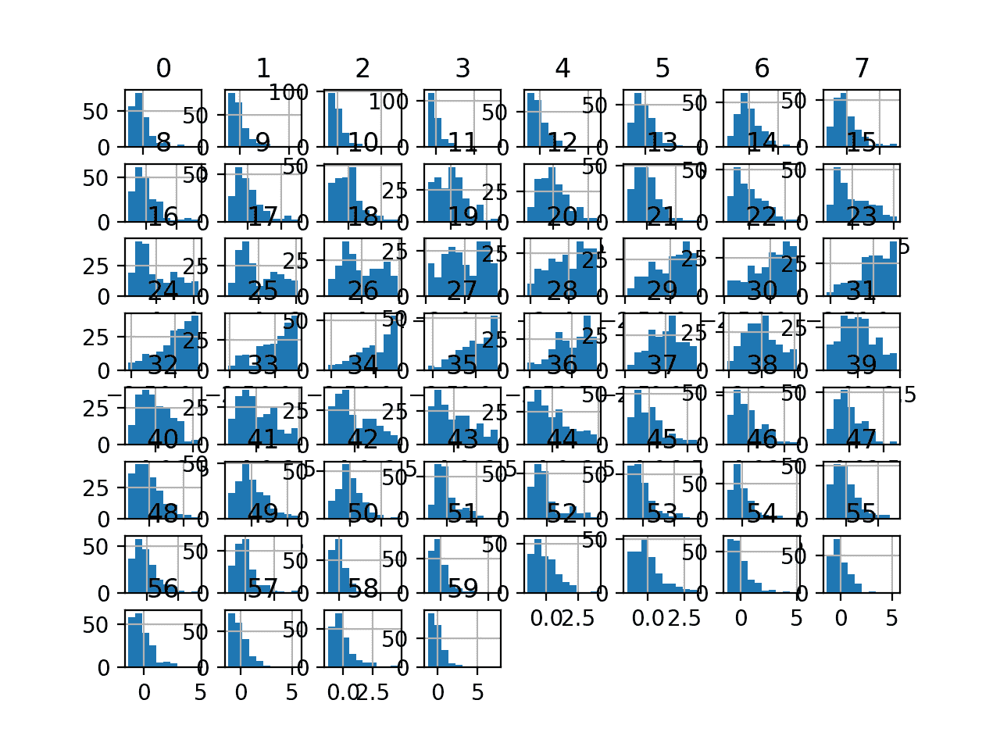

# 如何在 Python 中使用标准缩放器和最小最大缩放器变换

> 原文：<https://machinelearningmastery.com/standardscaler-and-minmaxscaler-transforms-in-python/>

最后更新于 2020 年 8 月 28 日

当数值输入变量被缩放到标准范围时，许多机器学习算法表现更好。

这包括使用输入加权和的算法，如线性回归，以及使用距离度量的算法，如 k 近邻。

建模前缩放数值数据的两种最流行的技术是标准化和规范化。**归一化**将每个输入变量分别缩放到 0-1 范围，这是我们精度最高的浮点值范围。**标准化**通过减去平均值(称为对中)并除以标准差来分别缩放每个输入变量，以使分布的平均值为零，标准差为 1。

在本教程中，您将发现如何使用 scaler 变换来标准化和规范化用于分类和回归的数字输入变量。

完成本教程后，您将知道:

*   当使用许多机器学习算法时，数据缩放是推荐的预处理步骤。
*   数据缩放可以通过规范化或标准化实值输入和输出变量来实现。
*   如何应用标准化和规范化提高预测建模算法的表现？

**用我的新书[机器学习的数据准备](https://machinelearningmastery.com/data-preparation-for-machine-learning/)启动你的项目**，包括*分步教程*和所有示例的 *Python 源代码*文件。

我们开始吧。


如何使用标准缩放器和最小最大缩放器变换
照片作者[马可·韦奇](https://flickr.com/photos/160866001@N07/31546911807/)，版权所有。

## 教程概述

本教程分为六个部分；它们是:

1.  您的数据规模很重要
2.  数值数据缩放方法
    1.  数据标准化
    2.  数据标准化
3.  声纳数据集
4.  最小最大缩放器变换
5.  标准缩放器变换
6.  常见问题

## 您的数据规模很重要

机器学习模型学习从输入变量到输出变量的映射。

因此，从域中提取的数据的规模和分布对于每个变量可能是不同的。

输入变量可能具有不同的单位(例如英尺、公里和小时)，这反过来意味着变量具有不同的标度。

输入变量之间的比例差异可能会增加建模问题的难度。这方面的一个例子是，大的输入值(例如数百或数千个单位的分布)会导致模型学习大的权重值。具有大权重值的模型通常是不稳定的，这意味着它可能在学习过程中表现不佳，并且对输入值敏感，从而导致较高的泛化误差。

> 预处理最常见的形式之一是对输入变量进行简单的线性重新缩放。

—第 298 页，[用于模式识别的神经网络](https://amzn.to/2YsDZ2C)，1995。

输入变量的比例差异不会影响所有的机器学习算法。

例如，适合使用输入变量加权和的模型的算法会受到影响，例如线性回归、逻辑回归和人工神经网络(深度学习)。

> 例如，当使用预测器之间的距离或点积(如 K 近邻或支持向量机)时，或者当为了应用惩罚而要求变量是共同的尺度时，标准化过程是必不可少的。

—第 124 页，[特征工程与选择](https://amzn.to/2Yvcupn)，2019。

此外，使用示例或样本之间距离度量的算法也会受到影响，例如 k 近邻和支持向量机。还有一些算法不受数字输入变量规模的影响，最显著的是决策树和树的集合，如随机森林。

> 不同的属性是在不同的尺度上测量的，所以如果直接使用欧几里德距离公式，一些属性的效果可能会与其他具有更大测量尺度的属性完全相形见绌。因此，通常会标准化所有属性值…

—第 145 页，[数据挖掘:实用机器学习工具与技术](https://amzn.to/3bbfIAP)，2016。

缩放回归预测建模问题的目标变量也是一个好主意，以使问题更容易学习，尤其是在神经网络模型的情况下。具有大范围值的目标变量反过来可能导致大的误差梯度值，导致权重值急剧变化，使得学习过程不稳定。

缩放输入和输出变量是使用神经网络模型的关键步骤。

> 在实践中，在将输入数据呈现给网络之前，对其应用预处理变换几乎总是有利的。类似地，网络的输出经常被后处理以给出所需的输出值。

—第 296 页，[用于模式识别的神经网络](https://amzn.to/2YsDZ2C)，1995。

## 数值数据缩放方法

使用 scikit-learn 库可以实现标准化和规范化。

让我们依次仔细看看每一个。

### 数据标准化

规范化是对原始范围内的数据进行重新缩放，以便所有值都在 0 和 1 的新范围内。

规范化要求您知道或能够准确估计最小和最大可观察值。您可能能够从您的可用数据中估计这些值。

> 通过将所有值除以遇到的最大值或减去最小值并除以最大值和最小值之间的范围，属性通常被规范化为位于固定范围内(通常从 0 到 1)。

—第 61 页，[数据挖掘:实用机器学习工具与技术](https://amzn.to/3bbfIAP)，2016。

值标准化如下:

*   y =(x–最小值)/(最大值–最小值)

其中最小值和最大值属于被归一化的值 x。

例如，对于一个数据集，我们可以猜测最小和最大可观察值为 30 和-10。然后，我们可以对任何值进行归一化，如 18.8，如下所示:

*   y =(x–最小值)/(最大值–最小值)
*   y =(18.8 –(-10))/(30 –(-10))
*   y = 28.8 / 40
*   y = 0.72

您可以看到，如果提供的 x 值超出了最小值和最大值的界限，则结果值将不会在 0 和 1 的范围内。您可以在进行预测之前检查这些观察值，并从数据集中删除它们，或者将它们限制在预定义的最大值或最小值。

您可以使用 scikit-learn 对象[最小最大缩放器](http://scikit-learn.org/stable/modules/generated/sklearn.preprocessing.MinMaxScaler.html)来规范化数据集。

最小最大缩放器和其他缩放技术的良好实践用法如下:

*   **使用可用的训练数据**安装定标器。对于归一化，这意味着训练数据将用于估计最小和最大可观察值。这是通过调用 *fit()* 函数来实现的。
*   **将量表应用于训练数据**。这意味着您可以使用规范化的数据来训练您的模型。这是通过调用*变换()*函数来完成的。
*   **将刻度应用于向前的数据**。这意味着你可以在未来准备新的数据来做预测。

*最小最大缩放器*的默认比例是将变量重新缩放到范围[0，1]，尽管可以通过“*特征 _ 范围*参数指定首选比例，并指定一个元组，包括所有变量的最小值和最大值。

我们可以通过将两个变量转换为 0 到 1 的范围来演示这个类的用法，0 到 1 是规范化的默认范围。第一个变量的值介于约 4 和 100 之间，第二个变量的值介于约 0.1 和 0.001 之间。

下面列出了完整的示例。

```py
# example of a normalization
from numpy import asarray
from sklearn.preprocessing import MinMaxScaler
# define data
data = asarray([[100, 0.001],
				[8, 0.05],
				[50, 0.005],
				[88, 0.07],
				[4, 0.1]])
print(data)
# define min max scaler
scaler = MinMaxScaler()
# transform data
scaled = scaler.fit_transform(data)
print(scaled)
```

运行该示例首先报告原始数据集，显示 2 列 4 行。这些值是用科学符号表示的，如果你不习惯，可能很难读懂。

接下来，定义定标器，使其适合整个数据集，然后用于创建数据集的转换版本，每个列独立地标准化。我们可以看到，每个列的最大原始值现在为值 1.0，每个列的最小值现在为值 0.0。

```py
[[1.0e+02 1.0e-03]
 [8.0e+00 5.0e-02]
 [5.0e+01 5.0e-03]
 [8.8e+01 7.0e-02]
 [4.0e+00 1.0e-01]]
[[1\.         0\.        ]
 [0.04166667 0.49494949]
 [0.47916667 0.04040404]
 [0.875      0.6969697 ]
 [0\.         1\.        ]]
```

现在我们已经熟悉了标准化，让我们更仔细地看看标准化。

### 数据标准化

数据集标准化涉及重新调整值的分布，以便观察值的平均值为 0，标准偏差为 1。

这可以被认为是减去平均值或使数据居中。

像标准化一样，标准化可能是有用的，甚至在某些机器学习算法中，当您的数据具有不同比例的输入值时，标准化是必需的。

标准化假设你的观测值符合一个具有良好均值和标准差的[高斯分布](https://machinelearningmastery.com/continuous-probability-distributions-for-machine-learning/)(钟形曲线)。如果没有达到这个期望，你仍然可以标准化你的数据，但是你可能得不到可靠的结果。

> 另一种[…]技术是计算属性值的统计平均值和标准偏差，从每个值中减去平均值，并将结果除以标准偏差。这个过程被称为标准化统计变量，产生一组平均值为零、标准差为一的值。

—第 61 页，[数据挖掘:实用机器学习工具与技术](https://amzn.to/3bbfIAP)，2016。

标准化要求你知道或能够准确估计可观察值的平均值和标准偏差。您可能能够从训练数据而不是整个数据集来估计这些值。

> 再次强调，变换所需的统计量(例如，平均值)是从训练集中估计的，并且被应用于所有数据集(例如，测试集或新样本)。

—第 124 页，[特征工程与选择](https://amzn.to/2Yvcupn)，2019。

从数据中减去平均值称为**居中**，而除以标准偏差称为**缩放**。因此，该方法有时被称为“**中心缩放**”。

> 最直接和常见的数据转换是对预测变量进行中心缩放。为了使预测变量居中，从所有值中减去平均预测值。居中的结果是，预测值的平均值为零。类似地，为了缩放数据，预测变量的每个值除以其标准偏差。缩放数据会强制这些值具有 1 的共同标准偏差。

—第 30 页，[应用预测建模](https://amzn.to/3b2LHTL)，2013 年。

值标准化如下:

*   y =(x–平均值)/标准偏差

其中*表示*计算如下:

*   平均值=总和(x) /计数(x)

*标准偏差*计算如下:

*   标准偏差= sqrt(总和((x–mean)^2)/计数(x))

我们可以推测平均值为 10.0，标准偏差约为 5.0。使用这些值，我们可以将第一个值 20.7 标准化如下:

*   y =(x–平均值)/标准偏差
*   y =(20.7–10)/5
*   y = (10.7) / 5
*   y = 2.14

数据集的均值和标准差估计值比最小值和最大值对新数据更稳健。

您可以使用 scikit-learn 对象[标准缩放器](http://scikit-learn.org/stable/modules/generated/sklearn.preprocessing.StandardScaler.html)来标准化数据集。

我们可以通过将两个变量转换为上一节中定义的 0 到 1 的范围来演示这个类的用法。我们将使用缺省配置，它将对每一列中的值进行居中和缩放，例如完全标准化。

下面列出了完整的示例。

```py
# example of a standardization
from numpy import asarray
from sklearn.preprocessing import StandardScaler
# define data
data = asarray([[100, 0.001],
				[8, 0.05],
				[50, 0.005],
				[88, 0.07],
				[4, 0.1]])
print(data)
# define standard scaler
scaler = StandardScaler()
# transform data
scaled = scaler.fit_transform(data)
print(scaled)
```

运行该示例首先报告原始数据集，像以前一样显示 2 列 4 行。

接下来，定义定标器，使其适合整个数据集，然后用于创建数据集的转换版本，每个列独立标准化。我们可以看到，如果存在，每一列的平均值被赋予 0.0 的值，并且这些值以 0.0 为中心，具有正值和负值。

```py
[[1.0e+02 1.0e-03]
 [8.0e+00 5.0e-02]
 [5.0e+01 5.0e-03]
 [8.8e+01 7.0e-02]
 [4.0e+00 1.0e-01]]
[[ 1.26398112 -1.16389967]
 [-1.06174414  0.12639634]
 [ 0\.         -1.05856939]
 [ 0.96062565  0.65304778]
 [-1.16286263  1.44302493]]
```

接下来，我们可以引入一个真实的数据集，作为建模的一部分，它为应用规范化和标准化转换提供了基础。

## 声纳数据集

声纳数据集是用于二进制分类的标准机器学习数据集。

它涉及 60 个实值输入和一个两类目标变量。数据集中有 208 个示例，类别相当均衡。

使用[重复分层 10 倍交叉验证](https://machinelearningmastery.com/k-fold-cross-validation/)，基线分类算法可以达到约 53.4%的分类准确率。使用重复的分层 10 倍交叉验证，该数据集的最高表现约为 88%。

该数据集描述了岩石或模拟地雷的雷达回波。

您可以从这里了解有关数据集的更多信息:

*   [声纳数据集](https://raw.githubusercontent.com/jbrownlee/Datasets/master/sonar.csv)
*   [声纳数据集描述](https://raw.githubusercontent.com/jbrownlee/Datasets/master/sonar.names)

不需要下载数据集；我们将从我们的工作示例中自动下载它。

首先，让我们加载并总结数据集。下面列出了完整的示例。

```py
# load and summarize the sonar dataset
from pandas import read_csv
from pandas.plotting import scatter_matrix
from matplotlib import pyplot
# Load dataset
url = "https://raw.githubusercontent.com/jbrownlee/Datasets/master/sonar.csv"
dataset = read_csv(url, header=None)
# summarize the shape of the dataset
print(dataset.shape)
# summarize each variable
print(dataset.describe())
# histograms of the variables
dataset.hist()
pyplot.show()
```

运行该示例首先总结加载数据集的形状。

这确认了 60 个输入变量、一个输出变量和 208 行数据。

提供了输入变量的统计摘要，显示值是数值，范围大约从 0 到 1。

```py
(208, 61)
               0           1           2   ...          57          58          59
count  208.000000  208.000000  208.000000  ...  208.000000  208.000000  208.000000
mean     0.029164    0.038437    0.043832  ...    0.007949    0.007941    0.006507
std      0.022991    0.032960    0.038428  ...    0.006470    0.006181    0.005031
min      0.001500    0.000600    0.001500  ...    0.000300    0.000100    0.000600
25%      0.013350    0.016450    0.018950  ...    0.003600    0.003675    0.003100
50%      0.022800    0.030800    0.034300  ...    0.005800    0.006400    0.005300
75%      0.035550    0.047950    0.057950  ...    0.010350    0.010325    0.008525
max      0.137100    0.233900    0.305900  ...    0.044000    0.036400    0.043900

[8 rows x 60 columns]
```

最后，为每个输入变量创建一个直方图。

如果我们忽略图中杂乱的东西，专注于直方图本身，我们可以看到许多变量都有一个偏斜的分布。

由于变量具有不同的最小值和最大值以及不同的数据分布，因此数据集为使用定标器变换提供了一个很好的候选对象。


声纳二进制分类数据集输入变量的直方图

接下来，让我们在原始数据集上拟合和评估一个机器学习模型。

我们将使用带有默认超参数的 k 近邻算法，并使用重复的分层 k 重交叉验证对其进行评估。下面列出了完整的示例。

```py
# evaluate knn on the raw sonar dataset
from numpy import mean
from numpy import std
from pandas import read_csv
from sklearn.model_selection import cross_val_score
from sklearn.model_selection import RepeatedStratifiedKFold
from sklearn.neighbors import KNeighborsClassifier
from sklearn.preprocessing import LabelEncoder
from matplotlib import pyplot
# load dataset
url = "https://raw.githubusercontent.com/jbrownlee/Datasets/master/sonar.csv"
dataset = read_csv(url, header=None)
data = dataset.values
# separate into input and output columns
X, y = data[:, :-1], data[:, -1]
# ensure inputs are floats and output is an integer label
X = X.astype('float32')
y = LabelEncoder().fit_transform(y.astype('str'))
# define and configure the model
model = KNeighborsClassifier()
# evaluate the model
cv = RepeatedStratifiedKFold(n_splits=10, n_repeats=3, random_state=1)
n_scores = cross_val_score(model, X, y, scoring='accuracy', cv=cv, n_jobs=-1, error_score='raise')
# report model performance
print('Accuracy: %.3f (%.3f)' % (mean(n_scores), std(n_scores)))
```

运行该示例会评估原始声纳数据集上的 KNN 模型。

**注**:考虑到算法或评估程序的随机性，或数值精度的差异，您的[结果可能会有所不同](https://machinelearningmastery.com/different-results-each-time-in-machine-learning/)。考虑运行该示例几次，并比较平均结果。

我们可以看到，该模型实现了大约 79.7%的平均分类准确率，表明它具有技巧性(优于 53.4%)，并且处于良好表现的球园区(88%)。

```py
Accuracy: 0.797 (0.073)
```

接下来，让我们探索数据集的缩放变换。

## 最小最大缩放器变换

我们可以将*最小最大缩放器*直接应用到声纳数据集，对输入变量进行归一化。

我们将使用默认配置并将值缩放到 0 到 1 的范围。首先，用默认超参数定义一个*最小最大缩放器*实例。一旦定义，我们可以调用 *fit_transform()* 函数，并将其传递给我们的数据集，以创建数据集的转换版本。

```py
...
# perform a robust scaler transform of the dataset
trans = MinMaxScaler()
data = trans.fit_transform(data)
```

让我们在声纳数据集上试试。

下面列出了创建声纳数据集的*最小最大缩放器*变换并绘制结果直方图的完整示例。

```py
# visualize a minmax scaler transform of the sonar dataset
from pandas import read_csv
from pandas import DataFrame
from pandas.plotting import scatter_matrix
from sklearn.preprocessing import MinMaxScaler
from matplotlib import pyplot
# load dataset
url = "https://raw.githubusercontent.com/jbrownlee/Datasets/master/sonar.csv"
dataset = read_csv(url, header=None)
# retrieve just the numeric input values
data = dataset.values[:, :-1]
# perform a robust scaler transform of the dataset
trans = MinMaxScaler()
data = trans.fit_transform(data)
# convert the array back to a dataframe
dataset = DataFrame(data)
# summarize
print(dataset.describe())
# histograms of the variables
dataset.hist()
pyplot.show()
```

运行该示例首先报告每个输入变量的摘要。

我们可以看到，分布已经调整，每个变量的最小值和最大值现在分别是清晰的 0.0 和 1.0。

```py
               0           1           2   ...          57          58          59
count  208.000000  208.000000  208.000000  ...  208.000000  208.000000  208.000000
mean     0.204011    0.162180    0.139068  ...    0.175035    0.216015    0.136425
std      0.169550    0.141277    0.126242  ...    0.148051    0.170286    0.116190
min      0.000000    0.000000    0.000000  ...    0.000000    0.000000    0.000000
25%      0.087389    0.067938    0.057326  ...    0.075515    0.098485    0.057737
50%      0.157080    0.129447    0.107753  ...    0.125858    0.173554    0.108545
75%      0.251106    0.202958    0.185447  ...    0.229977    0.281680    0.183025
max      1.000000    1.000000    1.000000  ...    1.000000    1.000000    1.000000

[8 rows x 60 columns]
```

创建了变量的直方图，尽管这些分布看起来与上一节中看到的原始分布没有太大不同。


声纳数据集最小最大缩放器变换输入变量的直方图

接下来，让我们评估与前面部分相同的 KNN 模型，但是在这种情况下，在数据集的*最小最大缩放器*变换上。

下面列出了完整的示例。

```py
# evaluate knn on the sonar dataset with minmax scaler transform
from numpy import mean
from numpy import std
from pandas import read_csv
from sklearn.model_selection import cross_val_score
from sklearn.model_selection import RepeatedStratifiedKFold
from sklearn.neighbors import KNeighborsClassifier
from sklearn.preprocessing import LabelEncoder
from sklearn.preprocessing import MinMaxScaler
from sklearn.pipeline import Pipeline
from matplotlib import pyplot
# load dataset
url = "https://raw.githubusercontent.com/jbrownlee/Datasets/master/sonar.csv"
dataset = read_csv(url, header=None)
data = dataset.values
# separate into input and output columns
X, y = data[:, :-1], data[:, -1]
# ensure inputs are floats and output is an integer label
X = X.astype('float32')
y = LabelEncoder().fit_transform(y.astype('str'))
# define the pipeline
trans = MinMaxScaler()
model = KNeighborsClassifier()
pipeline = Pipeline(steps=[('t', trans), ('m', model)])
# evaluate the pipeline
cv = RepeatedStratifiedKFold(n_splits=10, n_repeats=3, random_state=1)
n_scores = cross_val_score(pipeline, X, y, scoring='accuracy', cv=cv, n_jobs=-1, error_score='raise')
# report pipeline performance
print('Accuracy: %.3f (%.3f)' % (mean(n_scores), std(n_scores)))
```

**注**:考虑到算法或评估程序的随机性，或数值精度的差异，您的[结果可能会有所不同](https://machinelearningmastery.com/different-results-each-time-in-machine-learning/)。考虑运行该示例几次，并比较平均结果。

运行该示例，我们可以看到，最小最大缩放器变换将表现从没有变换时的 79.7%提升到有变换时的 81.3%。

```py
Accuracy: 0.813 (0.085)
```

接下来，让我们探索标准化输入变量的效果。

## 标准缩放器变换

我们可以将*标准缩放器*直接应用于声纳数据集，以标准化输入变量。

我们将使用默认配置和比例值减去平均值，使它们集中在 0.0，除以标准偏差，得到标准偏差 1.0。首先，用默认超参数定义一个*标准缩放器*实例。

一旦定义，我们就可以调用 *fit_transform()* 函数，并将其传递给我们的数据集，以创建数据集的转换版本。

```py
...
# perform a robust scaler transform of the dataset
trans = StandardScaler()
data = trans.fit_transform(data)
```

让我们在声纳数据集上试试。

下面列出了创建声纳数据集的*标准缩放器*变换并绘制结果直方图的完整示例。

```py
# visualize a standard scaler transform of the sonar dataset
from pandas import read_csv
from pandas import DataFrame
from pandas.plotting import scatter_matrix
from sklearn.preprocessing import StandardScaler
from matplotlib import pyplot
# load dataset
url = "https://raw.githubusercontent.com/jbrownlee/Datasets/master/sonar.csv"
dataset = read_csv(url, header=None)
# retrieve just the numeric input values
data = dataset.values[:, :-1]
# perform a robust scaler transform of the dataset
trans = StandardScaler()
data = trans.fit_transform(data)
# convert the array back to a dataframe
dataset = DataFrame(data)
# summarize
print(dataset.describe())
# histograms of the variables
dataset.hist()
pyplot.show()
```

运行该示例首先报告每个输入变量的摘要。

我们可以看到，分布已经被调整，平均值是一个非常小的接近零的数字，每个变量的标准偏差非常接近 1.0。

```py
                 0             1   ...            58            59
count  2.080000e+02  2.080000e+02  ...  2.080000e+02  2.080000e+02
mean  -4.190024e-17  1.663333e-16  ...  1.283695e-16  3.149190e-17
std    1.002413e+00  1.002413e+00  ...  1.002413e+00  1.002413e+00
min   -1.206158e+00 -1.150725e+00  ... -1.271603e+00 -1.176985e+00
25%   -6.894939e-01 -6.686781e-01  ... -6.918580e-01 -6.788714e-01
50%   -2.774703e-01 -2.322506e-01  ... -2.499546e-01 -2.405314e-01
75%    2.784345e-01  2.893335e-01  ...  3.865486e-01  4.020352e-01
max    4.706053e+00  5.944643e+00  ...  4.615037e+00  7.450343e+00

[8 rows x 60 columns]
```

创建了变量的直方图，尽管除了它们在 x 轴上的比例之外，分布看起来与上一节中看到的原始分布没有太大不同。



声纳数据集的标准标度变换输入变量的直方图

接下来，让我们评估与上一节相同的 KNN 模型，但在本例中，是基于数据集的标准缩放器变换。

下面列出了完整的示例。

```py
# evaluate knn on the sonar dataset with standard scaler transform
from numpy import mean
from numpy import std
from pandas import read_csv
from sklearn.model_selection import cross_val_score
from sklearn.model_selection import RepeatedStratifiedKFold
from sklearn.neighbors import KNeighborsClassifier
from sklearn.preprocessing import LabelEncoder
from sklearn.preprocessing import StandardScaler
from sklearn.pipeline import Pipeline
from matplotlib import pyplot
# load dataset
url = "https://raw.githubusercontent.com/jbrownlee/Datasets/master/sonar.csv"
dataset = read_csv(url, header=None)
data = dataset.values
# separate into input and output columns
X, y = data[:, :-1], data[:, -1]
# ensure inputs are floats and output is an integer label
X = X.astype('float32')
y = LabelEncoder().fit_transform(y.astype('str'))
# define the pipeline
trans = StandardScaler()
model = KNeighborsClassifier()
pipeline = Pipeline(steps=[('t', trans), ('m', model)])
# evaluate the pipeline
cv = RepeatedStratifiedKFold(n_splits=10, n_repeats=3, random_state=1)
n_scores = cross_val_score(pipeline, X, y, scoring='accuracy', cv=cv, n_jobs=-1, error_score='raise')
# report pipeline performance
print('Accuracy: %.3f (%.3f)' % (mean(n_scores), std(n_scores)))
```

**注**:考虑到算法或评估程序的随机性，或数值精度的差异，您的[结果可能会有所不同](https://machinelearningmastery.com/different-results-each-time-in-machine-learning/)。考虑运行该示例几次，并比较平均结果。

运行该示例，我们可以看到*标准缩放器*变换将表现从无变换时的 79.7%提升到有变换时的 81.0%，尽管比使用*最小最大缩放器*的结果略低。

```py
Accuracy: 0.810 (0.080)
```

## 常见问题

本节列出了缩放数字数据时的一些常见问题和答案。

#### 问:我应该规范化还是标准化？

输入变量是否需要缩放取决于您的问题和每个变量的具体情况。

您可能有一系列数量作为输入，例如价格或温度。

如果数量的分布是正态的，那么就应该标准化，否则，数据就应该标准化。如果数量值的范围很大(10s、100s 等)，则适用。)或小(0.01，0.0001)。

如果数量值很小(接近 0-1)并且分布是有限的(例如，标准偏差接近 1)，那么也许您可以不按比例缩放数据。

> 这些操作通常用于提高某些计算的数值稳定性。一些模型[…]受益于共同尺度上的预测器。

—第 30-31 页，[应用预测建模](https://amzn.to/3b2LHTL)，2013 年。

预测建模问题可能很复杂，并且可能不清楚如何最好地缩放输入数据。

如果有疑问，标准化输入序列。如果您有资源，探索使用原始数据、标准化数据和规范化数据建模，并查看结果模型的表现是否有有益的差异。

> 如果输入变量是线性组合的，如在 MLP[多层感知器]中，那么很少严格需要标准化输入，至少在理论上是这样。[……]然而，有各种各样的实际原因，为什么标准化输入可以使训练更快，并减少陷入局部最优的机会。

— [我应该对数据进行规范化/标准化/重新缩放吗？神经网络常见问题](ftp://ftp.sas.com/pub/neural/FAQ2.html#A_std)

#### 问:我应该先标准化然后再标准化吗？

标准化可以给出以零为中心的正值和负值。

可能需要在数据标准化后对其进行标准化。

这可能是一个好主意，因为您混合了标准化和规范化变量，并且希望所有输入变量都具有与给定算法(例如计算距离度量的算法)相同的最小值和最大值。

#### 问:但是哪一个最好？

这是不可知的。

根据每次转换准备的数据评估模型，并使用转换或转换组合，为模型上的数据集带来最佳表现。

#### 问:我如何处理越界值？

您可以通过计算训练数据的最小值和最大值来标准化数据。

稍后，您可能会有值分别小于或大于最小值或最大值的新数据。

处理这种情况的一种简单方法是检查这种超出界限的值，并在缩放之前将其值更改为已知的最小值或最大值。或者，您可能希望基于领域知识手动估计标准化中使用的最小值和最大值。

## 进一步阅读

如果您想更深入地了解这个主题，本节将提供更多资源。

### 教程

*   [如何使用数据缩放提高深度学习模型的稳定性和表现](https://machinelearningmastery.com/how-to-improve-neural-network-stability-and-modeling-performance-with-data-scaling/)
*   [使用 Scikit-Learn 重新缩放 Python 中的机器学习数据](https://machinelearningmastery.com/rescaling-data-for-machine-learning-in-python-with-scikit-learn/)
*   [4 时间序列预测的常用机器学习数据转换](https://machinelearningmastery.com/machine-learning-data-transforms-for-time-series-forecasting/)
*   [如何在 Python 中扩展长短期记忆网络的数据](https://machinelearningmastery.com/how-to-scale-data-for-long-short-term-memory-networks-in-python/)
*   [如何在 Python 中对时间序列数据进行规范化和标准化](https://machinelearningmastery.com/normalize-standardize-time-series-data-python/)

### 书

*   [用于模式识别的神经网络](https://amzn.to/2S8qdwt)，1995。
*   [特征工程与选择](https://amzn.to/2Yvcupn)，2019。
*   [数据挖掘:实用机器学习工具与技术](https://amzn.to/3bbfIAP)，2016。
*   [应用预测建模](https://amzn.to/3b2LHTL)，2013。

### 蜜蜂

*   [硬化。预处理。MinMaxScaler API](http://scikit-learn.org/stable/modules/generated/sklearn.preprocessing.MinMaxScaler.html) 。
*   [硬化。预处理。标准 cal API](http://scikit-learn.org/stable/modules/generated/sklearn.preprocessing.StandardScaler.html)。

### 文章

*   [我是否应该对数据进行规范化/标准化/重新缩放？神经网络常见问题](ftp://ftp.sas.com/pub/neural/FAQ2.html#A_std)

## 摘要

在本教程中，您发现了如何使用 scaler 变换来标准化和规范化用于分类和回归的数字输入变量。

具体来说，您了解到:

*   当使用许多机器学习算法时，数据缩放是推荐的预处理步骤。
*   数据缩放可以通过规范化或标准化实值输入和输出变量来实现。
*   如何应用标准化和规范化提高预测建模算法的表现？

**你有什么问题吗？**
在下面的评论中提问，我会尽力回答。