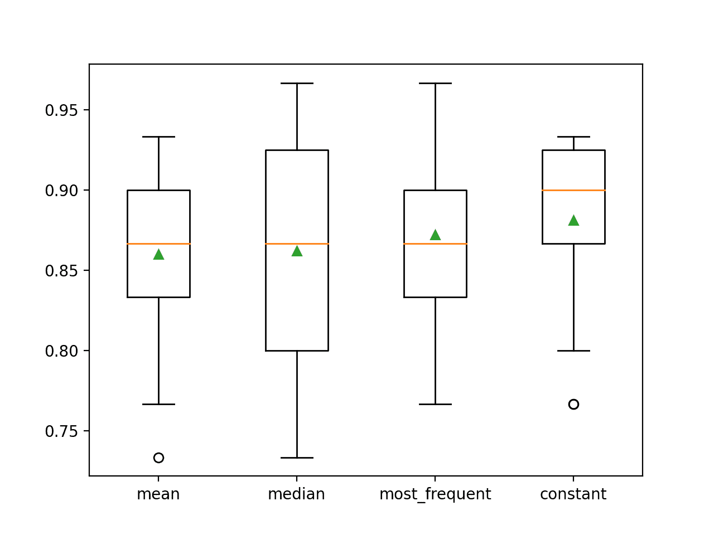

# 机器学习中缺失值的统计插补

> 原文：<https://machinelearningmastery.com/statistical-imputation-for-missing-values-in-machine-learning/>

最后更新于 2020 年 8 月 18 日

数据集可能会有缺失值，这可能会给许多机器学习算法带来问题。

因此，在对预测任务建模之前，识别并替换输入数据中每一列的缺失值是一种很好的做法。这被称为缺失数据插补，简称为插补。

数据插补的一种流行方法是计算每一列的统计值(如平均值)，并用统计值替换该列的所有缺失值。这是一种流行的方法，因为使用训练数据集很容易计算统计数据，并且通常会产生良好的性能。

在本教程中，您将发现如何在机器学习中对缺失数据使用统计插补策略。

完成本教程后，您将知道:

*   缺少的值必须用 NaN 值标记，并且可以用统计度量值替换以计算值列。
*   如何加载缺失值的 CSV 值并用 NaN 值标记缺失值，并报告每列缺失值的数量和百分比。
*   在评估模型和拟合最终模型以对新数据进行预测时，如何用统计学作为数据准备方法来估算缺失值。

**用我的新书[机器学习的数据准备](https://machinelearningmastery.com/data-preparation-for-machine-learning/)启动你的项目**，包括*分步教程*和所有示例的 *Python 源代码*文件。

我们开始吧。

*   **更新 6 月/2020** :更改了示例中用于预测的列。


机器学习中缺失值的统计插补
图片由[伯纳·萨沃里奥](https://flickr.com/photos/44073224@N04/39666799622/)提供，保留部分权利。

## 教程概述

本教程分为三个部分；它们是:

1.  统计插补
2.  马结肠数据集
3.  用简单估算器进行统计估算
    1.  simpleinputer 数据转换
    2.  简单输入器和模型评估
    3.  比较不同的估算统计
    4.  进行预测时的 simpleinputer 转换

## 统计插补

数据集可能缺少值。

这些数据行中的一个或多个值或列不存在。这些值可能完全丢失，或者用特殊字符或值标记，如问号“？”。

> 这些价值可以用许多方式来表达。我看到它们显示为完全没有[…]，一个空字符串[…]，显式字符串 NULL 或 undefined 或 N/A 或 NaN，以及数字 0 等等。无论它们如何出现在您的数据集中，当您开始使用这些数据时，知道期望什么并检查以确保数据与期望相匹配将会减少问题。

—第 10 页，[不良数据手册](https://amzn.to/3b5yutA)，2012 年。

值可能由于许多原因而丢失，通常是特定于问题域的，并且可能包括损坏的测量或数据不可用等原因。

> 它们的出现可能有多种原因，例如测量设备故障、数据收集过程中实验设计的变化以及几个相似但不完全相同的数据集的整理。

—第 63 页，[数据挖掘:实用机器学习工具与技术](https://amzn.to/3bbfIAP)，2016。

大多数机器学习算法需要数字输入值，并且数据集中的每一行和每一列都需要一个值。因此，缺失值会给机器学习算法带来问题。

因此，识别数据集中缺失的值并用数值替换它们是很常见的。这被称为数据插补，或缺失数据插补。

数据插补的一种简单而流行的方法是使用统计方法从现有的值中估计一个列的值，然后用计算出的统计值替换该列中所有缺失的值。

这很简单，因为统计数据计算速度快，而且它很受欢迎，因为它经常被证明非常有效。

计算出的常见统计数据包括:

*   列平均值。
*   列中值。
*   列模式值。
*   常数值。

现在我们已经熟悉了缺失值插补的统计方法，让我们来看看一个缺失值的数据集。

## 马结肠数据集

马绞痛数据集描述了患有绞痛的马的医学特征以及它们是活的还是死的。

有 300 行 26 个输入变量和一个输出变量。这是一个二元分类预测任务，包括预测 1 如果马活了，2 如果马死了。

在这个数据集中，我们可以选择许多字段进行预测。在这种情况下，我们将预测问题是否是外科手术(列索引 23)，使其成为二元分类问题。

数据集的许多列都有许多缺失值，每个缺失值都用问号字符(“？”).

下面提供了数据集中带有标记缺失值的行的示例。

```py
2,1,530101,38.50,66,28,3,3,?,2,5,4,4,?,?,?,3,5,45.00,8.40,?,?,2,2,11300,00000,00000,2
1,1,534817,39.2,88,20,?,?,4,1,3,4,2,?,?,?,4,2,50,85,2,2,3,2,02208,00000,00000,2
2,1,530334,38.30,40,24,1,1,3,1,3,3,1,?,?,?,1,1,33.00,6.70,?,?,1,2,00000,00000,00000,1
1,9,5290409,39.10,164,84,4,1,6,2,2,4,4,1,2,5.00,3,?,48.00,7.20,3,5.30,2,1,02208,00000,00000,1
...
```

您可以在此了解有关数据集的更多信息:

*   [马绞痛数据集](https://raw.githubusercontent.com/jbrownlee/Datasets/master/horse-colic.csv)
*   [马绞痛数据集描述](https://raw.githubusercontent.com/jbrownlee/Datasets/master/horse-colic.names)

不需要下载数据集，因为我们将在工作示例中自动下载它。

使用 Python 在加载的数据集中用 NaN(而不是数字)值标记缺失值是最佳实践。

我们可以使用 [read_csv() Pandas](https://pandas.pydata.org/pandas-docs/stable/reference/api/pandas.read_csv.html) 函数加载数据集，并指定“ *na_values* 来加载“*的值？*'为缺失，标有 NaN 值。

```py
...
# load dataset
url = 'https://raw.githubusercontent.com/jbrownlee/Datasets/master/horse-colic.csv'
dataframe = read_csv(url, header=None, na_values='?')
```

加载后，我们可以查看加载的数据以确认“？”值被标记为 NaN。

```py
...
# summarize the first few rows
print(dataframe.head())
```

然后，我们可以枚举每一列，并报告该列缺少值的行数。

```py
...
# summarize the number of rows with missing values for each column
for i in range(dataframe.shape[1]):
	# count number of rows with missing values
	n_miss = dataframe[[i]].isnull().sum()
	perc = n_miss / dataframe.shape[0] * 100
	print('> %d, Missing: %d (%.1f%%)' % (i, n_miss, perc))
```

将这些联系在一起，下面列出了加载和汇总数据集的完整示例。

```py
# summarize the horse colic dataset
from pandas import read_csv
# load dataset
url = 'https://raw.githubusercontent.com/jbrownlee/Datasets/master/horse-colic.csv'
dataframe = read_csv(url, header=None, na_values='?')
# summarize the first few rows
print(dataframe.head())
# summarize the number of rows with missing values for each column
for i in range(dataframe.shape[1]):
	# count number of rows with missing values
	n_miss = dataframe[[i]].isnull().sum()
	perc = n_miss / dataframe.shape[0] * 100
	print('> %d, Missing: %d (%.1f%%)' % (i, n_miss, perc))
```

运行该示例首先加载数据集并汇总前五行。

我们可以看到，被标记为“？”的缺失值字符已被 NaN 值替换。

```py
    0   1        2     3      4     5    6   ...   21   22  23     24  25  26  27
0  2.0   1   530101  38.5   66.0  28.0  3.0  ...  NaN  2.0   2  11300   0   0   2
1  1.0   1   534817  39.2   88.0  20.0  NaN  ...  2.0  3.0   2   2208   0   0   2
2  2.0   1   530334  38.3   40.0  24.0  1.0  ...  NaN  1.0   2      0   0   0   1
3  1.0   9  5290409  39.1  164.0  84.0  4.0  ...  5.3  2.0   1   2208   0   0   1
4  2.0   1   530255  37.3  104.0  35.0  NaN  ...  NaN  2.0   2   4300   0   0   2

[5 rows x 28 columns]
```

接下来，我们可以看到数据集中所有列的列表以及缺失值的数量和百分比。

我们可以看到，一些列(例如列索引 1 和 2)没有缺失值，而其他列(例如列索引 15 和 21)有许多甚至大部分缺失值。

```py
> 0, Missing: 1 (0.3%)
> 1, Missing: 0 (0.0%)
> 2, Missing: 0 (0.0%)
> 3, Missing: 60 (20.0%)
> 4, Missing: 24 (8.0%)
> 5, Missing: 58 (19.3%)
> 6, Missing: 56 (18.7%)
> 7, Missing: 69 (23.0%)
> 8, Missing: 47 (15.7%)
> 9, Missing: 32 (10.7%)
> 10, Missing: 55 (18.3%)
> 11, Missing: 44 (14.7%)
> 12, Missing: 56 (18.7%)
> 13, Missing: 104 (34.7%)
> 14, Missing: 106 (35.3%)
> 15, Missing: 247 (82.3%)
> 16, Missing: 102 (34.0%)
> 17, Missing: 118 (39.3%)
> 18, Missing: 29 (9.7%)
> 19, Missing: 33 (11.0%)
> 20, Missing: 165 (55.0%)
> 21, Missing: 198 (66.0%)
> 22, Missing: 1 (0.3%)
> 23, Missing: 0 (0.0%)
> 24, Missing: 0 (0.0%)
> 25, Missing: 0 (0.0%)
> 26, Missing: 0 (0.0%)
> 27, Missing: 0 (0.0%)
```

现在我们已经熟悉了丢失值的马绞痛数据集，让我们看看如何使用统计插补。

## 用简单估算器进行统计估算

scikit-learn 机器学习库提供了支持统计插补的[simple 插补器类](https://scikit-learn.org/stable/modules/generated/sklearn.impute.SimpleImputer.html)。

在本节中，我们将探索如何有效地使用 simple Current 类。

### simpleinputer 数据转换

简单估算器是一种数据转换，首先根据要为每列计算的统计类型进行配置，例如平均值。

```py
...
# define imputer
imputer = SimpleImputer(strategy='mean')
```

然后将估算值拟合到数据集上，以计算每一列的统计数据。

```py
...
# fit on the dataset
imputer.fit(X)
```

然后将拟合估算应用于数据集，以创建数据集的副本，用统计值替换每列的所有缺失值。

```py
...
# transform the dataset
Xtrans = imputer.transform(X)
```

我们可以在 horse colic 数据集上演示它的用法，并通过总结转换前后数据集中缺失值的总数来确认它的工作。

下面列出了完整的示例。

```py
# statistical imputation transform for the horse colic dataset
from numpy import isnan
from pandas import read_csv
from sklearn.impute import SimpleImputer
# load dataset
url = 'https://raw.githubusercontent.com/jbrownlee/Datasets/master/horse-colic.csv'
dataframe = read_csv(url, header=None, na_values='?')
# split into input and output elements
data = dataframe.values
ix = [i for i in range(data.shape[1]) if i != 23]
X, y = data[:, ix], data[:, 23]
# print total missing
print('Missing: %d' % sum(isnan(X).flatten()))
# define imputer
imputer = SimpleImputer(strategy='mean')
# fit on the dataset
imputer.fit(X)
# transform the dataset
Xtrans = imputer.transform(X)
# print total missing
print('Missing: %d' % sum(isnan(Xtrans).flatten()))
```

运行该示例首先加载数据集，并报告数据集中缺失值的总数为 1，605。

转换被配置、调整和执行，生成的新数据集没有缺失值，这证实了它是按照我们的预期执行的。

每个缺失的值都被替换为其列的平均值。

```py
Missing: 1605
Missing: 0
```

### 简单输入器和模型评估

使用 [k 倍交叉验证](https://machinelearningmastery.com/k-fold-cross-validation/)在数据集上评估机器学习模型是一个很好的实践。

为了正确应用统计缺失数据插补，避免[数据泄露](https://machinelearningmastery.com/data-leakage-machine-learning/)，要求只在训练数据集中计算每一列的统计量，然后应用于数据集中每个折叠的训练集和测试集。

> 如果我们使用重采样来选择调谐参数值或估计性能，插补应该包含在重采样中。

—第 42 页，[应用预测建模](https://amzn.to/3b2LHTL)，2013 年。

这可以通过创建建模管道来实现，其中第一步是统计插补，然后第二步是模型。这可以使用[管道类](https://scikit-learn.org/stable/modules/generated/sklearn.pipeline.Pipeline.html)来实现。

例如，下面的*管道*使用了一个*简单估算器*，带有一个“*的意思是*策略，后面是一个随机森林模型。

```py
...
# define modeling pipeline
model = RandomForestClassifier()
imputer = SimpleImputer(strategy='mean')
pipeline = Pipeline(steps=[('i', imputer), ('m', model)])
```

我们可以使用重复的 10 倍交叉验证来评估马结肠数据集的平均估算数据集和随机森林建模管道。

下面列出了完整的示例。

```py
# evaluate mean imputation and random forest for the horse colic dataset
from numpy import mean
from numpy import std
from pandas import read_csv
from sklearn.ensemble import RandomForestClassifier
from sklearn.impute import SimpleImputer
from sklearn.model_selection import cross_val_score
from sklearn.model_selection import RepeatedStratifiedKFold
from sklearn.pipeline import Pipeline
# load dataset
url = 'https://raw.githubusercontent.com/jbrownlee/Datasets/master/horse-colic.csv'
dataframe = read_csv(url, header=None, na_values='?')
# split into input and output elements
data = dataframe.values
ix = [i for i in range(data.shape[1]) if i != 23]
X, y = data[:, ix], data[:, 23]
# define modeling pipeline
model = RandomForestClassifier()
imputer = SimpleImputer(strategy='mean')
pipeline = Pipeline(steps=[('i', imputer), ('m', model)])
# define model evaluation
cv = RepeatedStratifiedKFold(n_splits=10, n_repeats=3, random_state=1)
# evaluate model
scores = cross_val_score(pipeline, X, y, scoring='accuracy', cv=cv, n_jobs=-1)
print('Mean Accuracy: %.3f (%.3f)' % (mean(scores), std(scores)))
```

正确运行该示例将数据插补应用于交叉验证程序的每个折叠。

**注**:考虑到算法或评估程序的随机性，或数值精度的差异，您的[结果可能会有所不同](https://machinelearningmastery.com/different-results-each-time-in-machine-learning/)。考虑运行该示例几次，并比较平均结果。

使用 10 倍交叉验证的三次重复对管道进行评估，并报告数据集上的平均分类精度约为 86.3%，这是一个不错的分数。

```py
Mean Accuracy: 0.863 (0.054)
```

### 比较不同的估算统计

我们如何知道使用“*表示*”统计策略对这个数据集是好的还是最好的？

答案是我们没有，它是被任意选择的。

我们可以设计一个实验来测试每个统计策略，并通过比较均值、中位数、模式(最频繁)和常数(0)策略来发现什么最适合这个数据集。然后可以比较每种方法的平均精度。

下面列出了完整的示例。

```py
# compare statistical imputation strategies for the horse colic dataset
from numpy import mean
from numpy import std
from pandas import read_csv
from sklearn.ensemble import RandomForestClassifier
from sklearn.impute import SimpleImputer
from sklearn.model_selection import cross_val_score
from sklearn.model_selection import RepeatedStratifiedKFold
from sklearn.pipeline import Pipeline
from matplotlib import pyplot
# load dataset
url = 'https://raw.githubusercontent.com/jbrownlee/Datasets/master/horse-colic.csv'
dataframe = read_csv(url, header=None, na_values='?')
# split into input and output elements
data = dataframe.values
ix = [i for i in range(data.shape[1]) if i != 23]
X, y = data[:, ix], data[:, 23]
# evaluate each strategy on the dataset
results = list()
strategies = ['mean', 'median', 'most_frequent', 'constant']
for s in strategies:
	# create the modeling pipeline
	pipeline = Pipeline(steps=[('i', SimpleImputer(strategy=s)), ('m', RandomForestClassifier())])
	# evaluate the model
	cv = RepeatedStratifiedKFold(n_splits=10, n_repeats=3, random_state=1)
	scores = cross_val_score(pipeline, X, y, scoring='accuracy', cv=cv, n_jobs=-1)
	# store results
	results.append(scores)
	print('>%s %.3f (%.3f)' % (s, mean(scores), std(scores)))
# plot model performance for comparison
pyplot.boxplot(results, labels=strategies, showmeans=True)
pyplot.show()
```

运行该示例使用重复交叉验证来评估马结肠数据集上的每个统计插补策略。

**注**:考虑到算法或评估程序的随机性，或数值精度的差异，您的[结果可能会有所不同](https://machinelearningmastery.com/different-results-each-time-in-machine-learning/)。考虑运行该示例几次，并比较平均结果。

每种策略的平均精确度都是一路上报告的。结果表明，使用一个恒定值，例如 0，会产生大约 88.1%的最佳性能，这是一个出色的结果。

```py
>mean 0.860 (0.054)
>median 0.862 (0.065)
>most_frequent 0.872 (0.052)
>constant 0.881 (0.047)
```

在运行结束时，为每组结果创建一个方框图和须图，以便比较结果的分布。

我们可以清楚地看到，恒定策略的准确性分数分布优于其他策略。



应用于马结肠数据集的统计插补策略的盒须图

### 进行预测时的 simpleinputer 转换

我们可能希望使用恒定插补策略和随机森林算法创建最终建模管道，然后对新数据进行预测。

这可以通过定义管道并将其拟合到所有可用数据上来实现，然后调用 *predict()* 函数，将新数据作为参数传入。

重要的是，新数据行必须使用 NaN 值标记任何缺失的值。

```py
...
# define new data
row = [2, 1, 530101, 38.50, 66, 28, 3, 3, nan, 2, 5, 4, 4, nan, nan, nan, 3, 5, 45.00, 8.40, nan, nan, 2, 11300, 00000, 00000, 2]
```

下面列出了完整的示例。

```py
# constant imputation strategy and prediction for the hose colic dataset
from numpy import nan
from pandas import read_csv
from sklearn.ensemble import RandomForestClassifier
from sklearn.impute import SimpleImputer
from sklearn.pipeline import Pipeline
# load dataset
url = 'https://raw.githubusercontent.com/jbrownlee/Datasets/master/horse-colic.csv'
dataframe = read_csv(url, header=None, na_values='?')
# split into input and output elements
data = dataframe.values
ix = [i for i in range(data.shape[1]) if i != 23]
X, y = data[:, ix], data[:, 23]
# create the modeling pipeline
pipeline = Pipeline(steps=[('i', SimpleImputer(strategy='constant')), ('m', RandomForestClassifier())])
# fit the model
pipeline.fit(X, y)
# define new data
row = [2, 1, 530101, 38.50, 66, 28, 3, 3, nan, 2, 5, 4, 4, nan, nan, nan, 3, 5, 45.00, 8.40, nan, nan, 2, 11300, 00000, 00000, 2]
# make a prediction
yhat = pipeline.predict([row])
# summarize prediction
print('Predicted Class: %d' % yhat[0])
```

运行该示例适合所有可用数据的建模管道。

定义一个新的数据行，其缺失值用 NaNs 标记，并进行分类预测。

```py
Predicted Class: 2
```

## 进一步阅读

如果您想更深入地了解这个主题，本节将提供更多资源。

### 相关教程

*   [标准分类和回归机器学习数据集的结果](https://machinelearningmastery.com/results-for-standard-classification-and-regression-machine-learning-datasets/)
*   [如何用 Python 处理缺失数据](https://machinelearningmastery.com/handle-missing-data-python/)

### 书

*   [不良数据手册](https://amzn.to/3b5yutA)，2012 年。
*   [数据挖掘:实用机器学习工具与技术](https://amzn.to/3bbfIAP)，2016。
*   [应用预测建模](https://amzn.to/3b2LHTL)，2013。

### 蜜蜂

*   [缺失值的插补，sci kit-学习文档](https://scikit-learn.org/stable/modules/impute.html)。
*   [巩理。计费。简单计费 API](https://scikit-learn.org/stable/modules/generated/sklearn.impute.SimpleImputer.html) 。

### 资料组

*   [马绞痛数据集](https://raw.githubusercontent.com/jbrownlee/Datasets/master/horse-colic.csv)
*   [马绞痛数据集描述](https://raw.githubusercontent.com/jbrownlee/Datasets/master/horse-colic.names)

## 摘要

在本教程中，您发现了如何在机器学习中对缺失数据使用统计插补策略。

具体来说，您了解到:

*   缺少的值必须用 NaN 值标记，并且可以用统计度量值替换以计算值列。
*   如何加载缺失值的 CSV 值并用 NaN 值标记缺失值，并报告每列缺失值的数量和百分比。
*   在评估模型和拟合最终模型以对新数据进行预测时，如何用统计学作为数据准备方法来估算缺失值。

**你有什么问题吗？**
在下面的评论中提问，我会尽力回答。