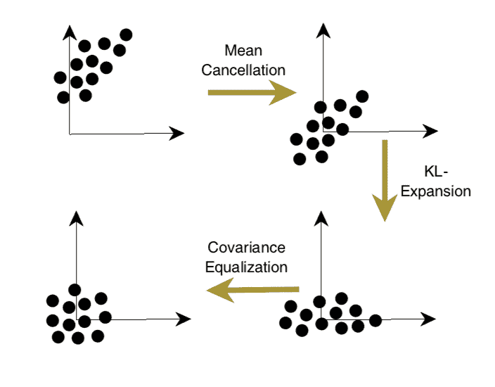

# 配置反向传播以训练更好的神经网络的 8 个技巧

> 原文:[https://machinelearning master . com/最佳配置建议-反向传播-深度学习-神经网络/](https://machinelearningmastery.com/best-advice-for-configuring-backpropagation-for-deep-learning-neural-networks/)

最后更新于 2019 年 8 月 6 日

使用随机梯度下降训练神经网络模型，并使用[反向传播算法](https://machinelearningmastery.com/implement-backpropagation-algorithm-scratch-python/)更新模型权重。

通过训练神经网络模型解决的优化非常具有挑战性，尽管这些算法被广泛使用，因为它们在实践中表现得非常好，但是不能保证它们会及时收敛到好的模型。

训练神经网络的挑战实际上归结为配置训练算法的挑战。

在这篇文章中，你将发现在训练神经网络模型时，如何最大限度地利用反向传播算法的技巧和诀窍。

看完这篇文章，你会知道:

*   训练神经网络的挑战实际上是学习训练数据集和推广到训练数据集之外的新例子之间的平衡。
*   八个具体的技巧，你可以用来训练更好的神经网络模型，更快。
*   二阶优化算法，在某些情况下也可以用来训练神经网络。

**用我的新书[更好的深度学习](https://machinelearningmastery.com/better-deep-learning/)启动你的项目**，包括*分步教程*和所有示例的 *Python 源代码*文件。

我们开始吧。

配置反向传播以训练更好的神经网络的 8 个技巧，更快
图片由[詹明斯 1](https://www.flickr.com/photos/jamesthefirst/6975410600/)提供，保留部分权利。

## 帖子概述

本教程分为五个部分；它们是:

1.  高效背板概述
2.  学习和概括
3.  反向传播的 8 个实用技巧
4.  二阶优化算法
5.  讨论和结论

## 高效背板概述

1998 年出版的名为《[神经网络:交易技巧》](https://amzn.to/2SRyBBa)的书提供了一系列由学者和神经网络从业者撰写的章节，描述了配置和使用神经网络模型的最佳实践。

该书在深度学习复兴的风口浪尖进行了更新，2012 年发布了包含 13 个新章节的[第二版](https://amzn.to/2zwUmNM)。

这两个版本的第一章的标题都是由[扬·勒昆](http://yann.lecun.com/)、[莱昂·博图](https://leon.bottou.org/)(都在脸书人工智能公司)[吉纳维芙·奥尔](http://willamette.edu/~gorr/)和[克劳斯-罗伯特·穆勒](https://www.ml.tu-berlin.de/menue/members/klaus-robert_mueller/)(也是本书的共同编辑)撰写的*高效反向传播*。

这一章也可以作为预印本在网上免费获得。

*   [高效背板](http://yann.lecun.com/exdb/publis/pdf/lecun-98b.pdf)，预印本，1998 年。

这一章也在两个版本的《速度学习》一书中的序言中进行了总结

这是一个重要的章节和文件，因为它提供了一个关于如何在 1998 年的随机梯度下降下最好地配置反向传播的几乎详尽的总结，并且许多建议在今天也是相关的。

在这篇文章中，我们将专注于这一章或论文，并试图提炼出与现代深度学习实践者最相关的建议。

作为参考，本章分为 10 节；它们是:

*   1.1:导言
*   1.2:学习和概括
*   1.3:标准反向传播
*   1.4:一些实用技巧
*   1.5:梯度下降的收敛
*   1.6:经典二阶优化方法
*   1.7:计算多层网络中黑森信息的技巧
*   1.8:多层网络中的黑森分析
*   1.9:将二阶方法应用于多层网络
*   1.10:讨论和结论

我们将重点介绍配置反向传播和随机梯度下降的技巧和诀窍。

## 学习和概括

本章首先描述了神经网络模型的学习和推广的双重挑战的一般问题。

作者通过强调反向传播算法是训练神经网络模型最广泛使用的算法来激励文章，因为它有效并且高效。

> 反向传播是一种非常流行的神经网络学习算法，因为它概念简单，计算效率高，并且经常有效。然而，让它很好地发挥作用，有时甚至完全发挥作用，与其说是一门科学，不如说是一门艺术。

作者还提醒我们，用反向传播训练神经网络真的很难。尽管该算法既有效又高效，但它需要仔细配置多个模型属性和模型超参数，其中每一个都需要对算法有深刻的了解和经验才能正确设置。

然而，没有规则可以遵循来“最好地”配置模型和训练过程。

> 使用 backprop 设计和训练网络需要做出许多看似任意的选择，例如节点的数量和类型、层次、学习速率、训练和测试集等等。这些选择可能至关重要，但没有万无一失的方法来决定它们，因为它们在很大程度上依赖于问题和数据。

训练神经网络模型的目标最具挑战性，因为它需要同时解决两个难题:

*   **学习**训练数据集，以便最好地最小化损失。
*   **概括**模型性能，以便对未知示例进行预测。

这些问题之间有一个权衡，因为一个学习得太好的模型会概括得很差，而一个概括得很好的模型可能会有所欠缺。很好地训练神经网络的目标是在这两个关注点之间找到一个愉快的平衡。

> 这一章的重点是改善最小化成本函数过程的策略。然而，这些策略必须与最大化网络泛化能力的方法结合使用，也就是说，为学习系统以前没有见过的模式预测正确的目标。

有趣的是，训练神经网络模型的问题是根据偏差-方差权衡来解决的，通常用于描述一般的机器学习算法。

当拟合神经网络模型时，这些术语可以定义为:

*   **偏差**:衡量所有数据集的网络输出平均值与期望函数的差异。
*   **方差**:衡量网络输出在不同数据集之间的差异程度。

这种框架模型将模型的容量定义为偏差的选择，控制可以学习的功能范围。它将方差作为训练过程的函数，并在过度拟合训练数据集和泛化误差之间取得平衡。

这个框架也有助于理解训练过程中模型性能的动态变化。即从训练开始时偏差大、方差小的模型，到训练结束时偏差较低、方差较大的模型。

> 在训练的早期，偏差很大，因为网络输出与期望的功能相差甚远。方差很小，因为数据还没有什么影响。在训练后期，偏差很小，因为网络已经学会了底层功能。

这些是模型的正常动态，尽管在训练时，我们必须防止训练模型太多和过度拟合训练数据集。这使得模型变得脆弱，降低了偏差，使模型专门用于训练例子，进而导致更大的差异。

> 然而，如果训练时间过长，网络也将学习到该数据集特有的噪声。这被称为过度训练。在这种情况下，方差会很大，因为数据集之间的噪声不同。

对反向传播算法的关注意味着以暂时忽略“*泛化”*为代价，专注于“*学习*”，这可以在后面通过引入正则化技术来解决。

专注于学习意味着专注于快速(快速学习)和有效(学好)减少损失。

> 因此，本章的思想是提出最小化策略(给定一个成本函数)以及与提高最小化速度和质量相关的技巧。

## 反向传播的 8 个实用技巧

本章的重点是反向传播的一系列实用技巧，以更好地训练神经网络模型。

有八招；它们是:

*   1.4.1:随机学习与批量学习
*   1.4.2:打乱示例
*   1.4.3:标准化输入
*   1.4.4:乙状结肠
*   1.4.5:选择目标值
*   1.4.6:初始化权重
*   1.4.7:选择学习率
*   1.4.8:径向基函数与 Sigmoid

这一部分首先评论说，我们试图用随机梯度下降和反向传播解决的优化问题是具有挑战性的。

反向传播可能非常慢，特别是对于多层网络，其中成本面通常是非二次的、非凸的和高维的，具有许多局部最小值和/或平坦区域。

作者继续强调，在选择随机梯度下降和反向传播算法来优化和更新权重时，我们没有性能保证。

没有公式可以保证(1)网络会收敛到一个好的解，(2)收敛很快，或者(3)收敛甚至会发生。

这些评论为这些技巧提供了背景，这些技巧也没有保证，反而增加了更快找到更好模型的可能性。

让我们依次仔细看看每个技巧。

许多技巧都集中在 sigmoid (s 形)激活函数上，这不再是用于隐藏层的最佳实践，而是被修正的线性激活函数所取代。因此，我们花在乙状结肠相关技巧上的时间会更少。

### 技巧 1:随机学习和批量学习

本技巧强调了在训练模型时使用随机梯度下降还是批量梯度下降的选择。

随机梯度下降，也称为在线梯度下降，是指一种算法版本，其中误差梯度是从训练数据集中随机选择的单个例子中估计的，然后更新模型参数(权重)。

它具有快速训练模型的效果，尽管它会导致模型权重的大的、有噪声的更新。

> 出于以下三个原因，随机学习通常是基本反向传播的首选方法:
> 
> 1.随机学习通常比批量学习快得多。
> 2。随机学习通常也会产生更好的解决方案。
> 3。随机学习可用于跟踪变化。

批量梯度下降涉及使用训练数据集中所有示例的平均值来估计误差梯度。执行起来更快，从理论角度更好理解，但导致学习速度更慢。

> 尽管随机学习有很多优点，但仍然有理由考虑使用批处理学习:
> 
> 1.收敛的条件是众所周知的。
> 2。许多加速技术(例如共轭梯度)仅在批处理学习中运行。
> 3。重量动态和收敛速度的理论分析更简单。

一般来说，作者建议尽可能使用随机梯度下降，因为它提供了更快的模型训练。

> 尽管有批量更新的优势，随机学习仍然经常是首选方法，特别是在处理非常大的数据集时，因为它简单得多。

他们建议利用[学习率](https://machinelearningmastery.com/learning-rate-for-deep-learning-neural-networks/)衰减时间表来抵消随机梯度下降期间权重更新的噪声影响。

> …噪声对于寻找更好的局部极小值至关重要，它也阻碍了完全收敛到最小值。[……]因此，为了减少波动，我们可以降低(退火)学习速率，或者采用自适应批量。

他们还建议使用小批量的样本来减少权重更新的噪音。在这种情况下，误差梯度是在训练数据集中的一小部分样本上估计的，而不是在随机梯度下降的情况下的一个样本，或者在分批梯度下降的情况下的所有样本。

这种变化后来被称为小批量梯度下降，是训练神经网络时的默认值。

> 另一种去除噪声的方法是使用“小批量”，即从小批量开始，并随着训练的进行增加批量。

### 技巧 2:打乱例子

本技巧强调了在培训过程中向模型显示的示例顺序对培训过程的重要性。

一般来说，作者强调，当用于更新模型的下一个示例不同于前一个示例时，学习算法的性能会更好。理想情况下，它是模型中最不同或最陌生的。

> 网络从最意想不到的样本中学习最快。因此，建议在每次迭代中选择一个系统最不熟悉的样本。

实现这个技巧的一个简单方法是确保用于更新模型参数的连续示例来自不同的类。

> ……粗略实现这一想法的一个非常简单的技巧是简单地选择来自不同类的连续示例，因为属于同一类的训练示例很可能包含相似的信息。

这个技巧也可以通过向模型展示和重新展示例子来实现，在进行预测时，模型会犯最大的错误。这种方法可能是有效的，但是如果在训练期间被过度表示的例子是异常值，也会导致灾难。

> 选择信息量最大的示例
> 
> 1.打乱训练集，以便连续的训练示例从不(很少)属于同一个类。
> 2。给出比产生小误差的例子更频繁地产生大误差的输入例子

### 技巧 3:标准化输入

本技巧强调了在训练神经网络模型之前数据准备的重要性。

作者指出，当训练数据集中的例子总和为零时，神经网络通常学习得更快。这可以通过从每个输入变量中减去平均值来实现，称为居中。

> 如果训练集中每个输入变量的平均值接近零，收敛通常会更快。

他们还评论说，当应用于来自先前层的隐藏层的输入时，输入的这种居中也改善了模型的收敛性。这令人着迷，因为它为近 15 年后开发并广泛流行的[批量标准化](https://arxiv.org/abs/1502.03167)技术奠定了基础。

> 因此，最好移动输入，使训练集的平均值接近零。这种启发式方法应该应用于所有层，这意味着我们希望节点输出的平均值接近于零，因为这些输出是下一层的输入

作者还评论了标准化输入变量分布的必要性。这可以通过用标准偏差除这些值来实现。对于具有高斯分布的变量，以这种方式对值进行居中和归一化意味着它们将被简化为平均值为零、标准偏差为 1 的标准高斯分布。

> 缩放加速学习，因为它有助于平衡连接到输入节点的权重的学习速度。

最后，他们建议将输入变量去相关。这意味着消除输入变量之间的任何线性相关性，并且可以使用主成分分析作为数据转换来实现。

> 主成分分析(也称为卡尔洪恩-洛夫展开)可用于消除输入中的线性相关性

关于数据准备的提示可以总结如下:

> 转换输入
> 
> 1.训练集中每个输入变量的平均值应该接近于零。
> 2。缩放输入变量，使它们的协方差大致相同。
> 3。如果可能，输入变量应该是不相关的。

这三个推荐的居中、归一化和去相关的数据准备步骤被很好地总结在一个图表中，从下面的书中复制:

输入转换
摘自第 18 页，“*神经网络:交易技巧*

当在网络的隐藏层中使用更现代的 ReLU 激活函数时，输入变量的居中可能是也可能不是最好的方法，所以我建议在为模型准备数据时评估标准化和规范化过程。

### 技巧 4:乙状结肠

本技巧建议在网络的隐藏层中使用 sigmoid 激活函数。

> 非线性激活函数赋予神经网络非线性能力。激活功能最常见的形式之一是 sigmoid …

具体来说，作者将 sigmoid 激活函数称为任何 S 形函数，例如 logistic(称为 sigmoid)或双曲正切函数(称为 tanh)。

> 像双曲正切这样的对称 sigmoids 通常比标准 logistic 函数收敛得更快。

作者建议修改默认函数(如果需要)，使函数的中点为零。

对隐藏层使用逻辑和 tanh 激活函数不再是明智的默认，因为使用 ReLU 的性能模型收敛得更快。

### 技巧 5:选择目标值

本技巧强调了对目标变量选择的更仔细的考虑。

在二元分类问题的情况下，当分别使用交叉熵或铰链损失函数时，目标变量可能在逻辑激活函数极限的集合{0，1}中，或者在双曲正切函数的集合{-1，1}中，甚至在现代神经网络中也是如此。

作者认为，在激活函数的极端使用值可能会使学习问题更具挑战性。

> 常识似乎表明，目标值应该设置在 sigmoid 渐近线的值。然而，这有几个缺点。

他们建议，在激活函数的饱和点(边缘)实现值可能需要越来越大的权重，这可能会使模型不稳定。

解决这个问题的一种方法是使用远离输出函数边缘的目标值。

> 选择 sigmoid 上最大二阶导数点的目标值，以避免输出单元饱和。

我记得在 20 世纪 90 年代，通常的建议是将{0.1 和 0.9}集合中的目标值与逻辑函数一起使用，而不是{0 和 1}。

### 技巧 6:初始化权重

本技巧强调了权重初始化方案选择的重要性，以及它如何与激活函数的选择紧密相关。

在 sigmoid 激活函数的情况下，他们建议选择网络的初始权重来激活线性区域中的函数(例如，S 形的直线部分而不是曲线部分)。

> 权重的起始值会对训练过程产生重大影响。权重应随机选择，但应使 sigmoid 主要在其线性区域激活。

该建议也适用于 ReLU 的权重激活，其中函数的线性部分为正。

这突出了初始权重对学习的重要影响，其中大权重使激活函数饱和，导致学习不稳定，小权重导致梯度非常小，进而导致学习缓慢。理想情况下，我们寻求激活函数的线性(非曲线)部分的模型权重。

> ……在 sigmoid 线性区域范围内的权重具有以下优势:( 1)梯度足够大，学习可以继续进行;( 2)网络将在更困难的非线性部分之前学习映射的线性部分。

作者提出了一种随机权重初始化方案，使用前一层的节点数，即所谓的扇入。这很有趣，因为它是后来被称为[泽维尔权重初始化方案](http://proceedings.mlr.press/v9/glorot10a/glorot10a.pdf)的前身。

### 技巧 7:选择学习速度

这个技巧强调了选择学习率的重要性。

学习率是算法每次迭代更新模型权重的数量。较小的学习速率会导致较慢的收敛，但可能会得到较好的结果，而较大的学习速率会导致较快的收敛，但可能会得到不太理想的结果。

作者建议当权重值开始前后变化时，例如振荡，降低学习速率。

> 这些方案大多在权重向量“振荡”时降低学习速率，而在权重向量遵循相对稳定的方向时提高学习速率。

他们评论说，当使用在线梯度下降时，这是一个硬策略，因为默认情况下，权重会波动很大。

作者还建议对模型中的每个参数使用一个学习速率。目标是帮助模型的每个部分以相同的速度收敛。

> ……很明显，为每个权重选择不同的学习速率(eta)可以提高收敛性。[……]主要理念是确保网络中的所有权重以大致相同的速度收敛。

他们将该属性称为每个模型参数的“均衡学习速度”。

> 均衡学习速度
> 
> –给每个权重赋予自己的学习速率
> –学习速率应与单元输入数量的平方根
> 成比例–较低层的权重通常应大于较高层的权重

除了使用每个参数的学习速率，作者还建议使用动量和自适应学习速率。

有趣的是，这些建议后来被载入了像 AdaGrad 和 [Adam](https://machinelearningmastery.com/adam-optimization-algorithm-for-deep-learning/) 这样的方法中，这些方法现在是流行的默认值。

### 技巧 8:径向基函数与 Sigmoid 单位

这最后的提示今天可能不太相关，我建议在某些情况下尝试径向基函数(RBF)而不是 sigmoid 激活函数。

作者建议，训练径向基函数单元可以比使用乙状结肠激活的训练单元更快。

> 与可以覆盖整个空间的乙状线单元不同，单个径向基函数单元只覆盖输入空间的一小部分局部区域。这可能是一个优势，因为学习可以更快。

### 理论基础

在这些提示之后，作者继续提供一个理论基础，说明为什么这些提示中的许多是一个好主意，并且期望在训练神经网络模型时导致更好或更快的收敛。

具体来说，该分析支持的提示是:

*   从输入变量中减去平均值
*   标准化输入变量的方差。
*   去相关输入变量。
*   对每个权重使用单独的学习率。

## 二阶优化算法

这一章的剩余部分集中于使用二阶优化算法来训练神经网络模型。

这可能不是每个人都喜欢的，需要有背景和对[矩阵演算](https://en.wikipedia.org/wiki/Matrix_calculus)的良好记忆。你可能想跳过它。

您可能还记得，一阶导数是函数的斜率(有多陡)，反向传播使用一阶导数按照模型输出误差的比例更新模型。这些方法被称为一阶优化算法，例如在模型输出中使用误差一阶导数的优化算法。

你可能还记得微积分中[二阶导数](https://en.wikipedia.org/wiki/Second_derivative)是一阶导数的变化率，或者在这种情况下是误差梯度本身的梯度。它给出了当前权重集的损失函数曲线的概念。使用二阶导数的算法被称为二阶优化算法。

作者接着介绍了五种二阶优化算法，具体如下:

*   牛顿
*   共轭梯度
*   高斯-牛顿
*   莱文伯格·马夸特
*   准牛顿(BFGS)

这些算法需要访问[黑森矩阵](https://en.wikipedia.org/wiki/Hessian_matrix)或黑森矩阵的近似。如果你介绍了反向传播算法的理论，你可能还记得黑森矩阵。在一个手波的方式，我们使用黑森来描述模型权重的二阶导数。

作者继续概述了一些方法，可以用来近似黑森矩阵(用于二阶优化算法)，如:有限差分，平方雅可比近似，黑森对角线，等等。

然后他们继续分析多层神经网络中的 Hessian 和二阶优化算法的有效性。

总之，他们强调，也许二阶方法更适合使用批量梯度下降训练的较小的神经网络模型。

> 经典的二阶方法在几乎所有有用的情况下都是不切实际的。

## 讨论和结论

这一章以一个非常有用的总结结束，总结了在训练神经网络模型时如何最大限度地利用反向传播的技巧。

该摘要转载如下:

> –打乱示例
> –通过减去平均值
> 将输入变量居中–将输入变量标准化为 1
> 的标准偏差–如果可能，将输入变量去相关。
> –选择具有图 1.4 所示 sigmoid 功能的网络
> –在 sigmoid 范围内设置目标值，通常为+1 和-1。
> –将权重初始化为随机值(如 1.16 所述)。

## 进一步阅读

如果您想更深入地了解这个主题，本节将提供更多资源。

*   [神经网络:交易技巧](https://amzn.to/2SRyBBa)，第一版，1998 年。
*   [神经网络:交易的诀窍](https://amzn.to/2zwUmNM)，第二版，2012 年。
*   [高效背板](http://yann.lecun.com/exdb/publis/pdf/lecun-98b.pdf)，预印本，1998 年。
*   [黑森矩阵，维基百科](https://en.wikipedia.org/wiki/Hessian_matrix)。

## 摘要

在这篇文章中，你发现了在训练神经网络模型时最大限度地利用反向传播算法的技巧和诀窍。

你在你的项目中尝试过这些技巧吗？
在下面的评论中让我知道你的结果。

你有什么问题吗？
在下面的评论中提问，我会尽力回答。