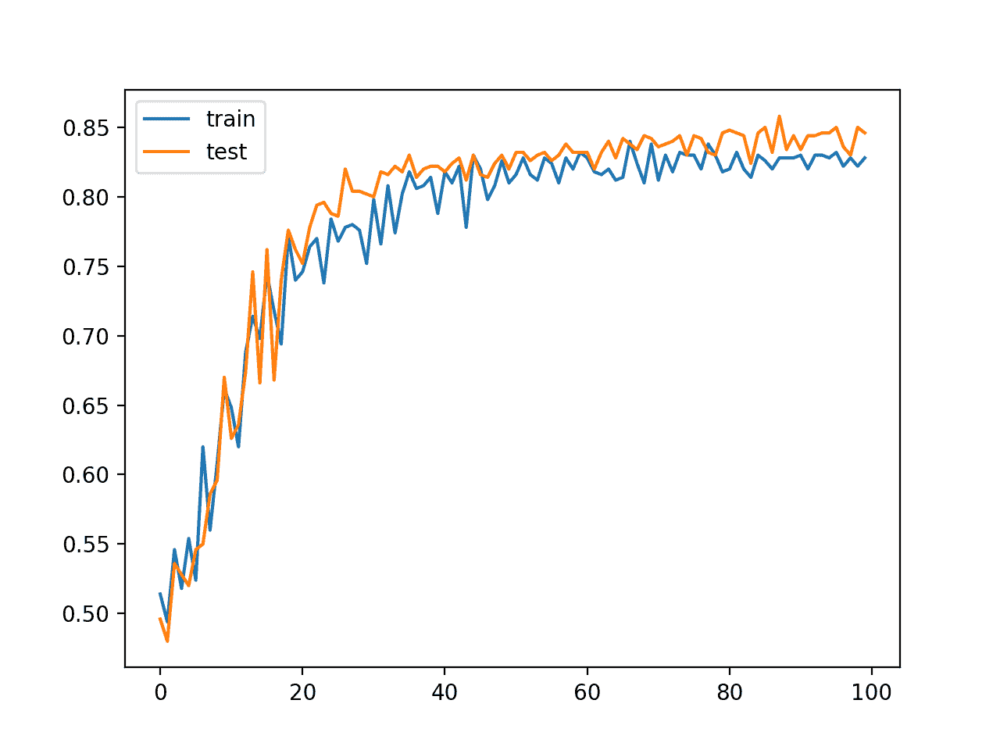

# 如何利用批量归一化加速深度神经网络的学习

> 原文：<https://machinelearningmastery.com/how-to-accelerate-learning-of-deep-neural-networks-with-batch-normalization/>

最后更新于 2020 年 8 月 25 日

批处理标准化是一种技术，旨在自动标准化深度学习神经网络中某一层的输入。

一旦实现，批处理规范化具有显著加速神经网络训练过程的效果，并且在某些情况下，通过适度的规范化效果提高了模型的性能。

在本教程中，您将发现如何使用批处理规范化来加速使用 Keras 在 Python 中训练深度学习神经网络。

完成本教程后，您将知道:

*   如何使用 Keras API 创建和配置 BatchNormalization 层。
*   如何在深度学习神经网络模型中加入 BatchNormalization 层？
*   如何更新 MLP 模型以使用批处理规范化来加速二元分类问题的训练。

**用我的新书[更好的深度学习](https://machinelearningmastery.com/better-deep-learning/)启动你的项目**，包括*分步教程*和所有示例的 *Python 源代码*文件。

我们开始吧。

*   **2019 年 10 月更新**:针对 Keras 2.3 和 TensorFlow 2.0 更新。


如何利用批处理归一化加速深度神经网络的学习
图片由[安吉拉和安德鲁](https://www.flickr.com/photos/150568953@N07/33743679584/in/photolist-TpPbk3-5G9sdW-22jaB3h-eDpu7f-UuLQaX-UBXo3K-ez18sY-4XZNoe-iK4Dcb-QhtB5y-2b9cJbJ-21uwe5a-7TRKo5-dRZUkF-55NmoW-g7KEUA-KnKkuy-igJZXh-4VpkoP-2aknhQ5-amec93-2apvqR3-nEt1TA-arT9ZL-qF4NCe-pvqkJQ-27RCmY5-9sVNKs-4XZNkp-UDnFvV-7vVcmn-5pRw4L-e6gvpz-JxyUUt-LHjxD4-9Y986P-igKn6G-29AHGJB-7vVfJ2-jUwzcR-N8P8A7-28AhQbY-iJBZmG-L19pGt-anDpWe-9debvF-ihzZtU-ih63LL-22HBL6u-YwhNrb)提供，版权所有。

## 教程概述

本教程分为三个部分；它们是:

1.  喀拉斯的 BatchNormalization
2.  模型中的批处理规范化
3.  批量化案例研究

## 喀拉斯的 BatchNormalization

Keras 通过 batch normalization 层提供对批处理规范化的支持。

例如:

```py
bn = BatchNormalization()
```

该层将转换输入，使其标准化，这意味着它们的平均值为零，标准偏差为 1。

在训练期间，该层将跟踪每个输入变量的统计数据，并使用它们来标准化数据。

此外，可以使用定义变换输出的新平均值和标准偏差的*β*和*γ*的学习参数来缩放标准化输出。该层可以配置为分别通过“*中心*”和“*比例*属性控制是否使用这些附加参数。默认情况下，它们是启用的。

用于执行标准化的统计数据，例如每个变量的平均值和标准偏差，针对每个小批量进行更新，并保持运行平均值。

一个“*动量*”参数允许你控制在计算更新时包含多少来自前一个小批量的统计数据。默认情况下，该值保持较高，为 0.99。这可以设置为 0.0，以便只使用当前小批量的统计数据，如原论文所述。

```py
bn = BatchNormalization(momentum=0.0)
```

在训练结束时，当使用模型进行预测时，将使用当时层中的均值和标准差统计来标准化输入。

所有小批次的默认配置估计平均值和标准偏差可能是合理的。

## 模型中的批处理规范化

批处理规范化可以用于模型中的大多数点，也可以用于大多数类型的深度学习神经网络。

### 输入和隐藏层输入

BatchNormalization 层可以添加到您的模型中，以标准化原始输入变量或隐藏层的输出。

不建议将批处理规范化作为模型适当数据准备的替代方法。

然而，当用于标准化原始输入变量时，图层必须指定 *input_shape* 参数；例如:

```py
...
model = Sequential
model.add(BatchNormalization(input_shape=(2,)))
...
```

当用于标准化隐藏层的输出时，该层可以像任何其他层一样添加到模型中。

```py
...
model = Sequential
...
model.add(BatchNormalization())
...
```

### 在激活功能之前或之后使用

BatchNormalization 规范化层可用于标准化前一层激活功能之前或之后的输入。

介绍该方法的[原纸](https://arxiv.org/abs/1502.03167)建议在前一层的激活函数之前加入批量归一化，例如:

```py
...
model = Sequential
model.add(Dense(32))
model.add(BatchNormalization())
model.add(Activation('relu'))
...
```

[有报道实验提示](https://github.com/ducha-aiki/caffenet-benchmark/blob/master/batchnorm.md)在前一层的激活功能后加入批量归一化层时性能更好；例如:

```py
...
model = Sequential
model.add(Dense(32, activation='relu'))
model.add(BatchNormalization())
...
```

如果时间和资源允许，可能值得在您的模型上测试这两种方法，并使用产生最佳性能的方法。

让我们来看看批处理规范化如何与一些常见的网络类型一起使用。

### MLP 批量标准化

下面的示例在密集隐藏层之间的激活函数之后添加批处理规范化。

```py
# example of batch normalization for an mlp
from keras.layers import Dense
from keras.layers import BatchNormalization
...
model.add(Dense(32, activation='relu'))
model.add(BatchNormalization())
model.add(Dense(1))
...
```

### 美国有线电视新闻网批量标准化

下面的示例在卷积层和最大池层之间的激活函数之后添加了批处理规范化。

```py
# example of batch normalization for an cnn
from keras.layers import Dense
from keras.layers import Conv2D
from keras.layers import MaxPooling2D
from keras.layers import BatchNormalization
...
model.add(Conv2D(32, (3,3), activation='relu'))
model.add(Conv2D(32, (3,3), activation='relu'))
model.add(BatchNormalization())
model.add(MaxPooling2D())
model.add(Dense(1))
...
```

### RNN 批量标准化

下面的示例在 LSTM 和密集隐藏层之间的激活函数之后添加批处理规范化。

```py
# example of batch normalization for a lstm
from keras.layers import Dense
from keras.layers import LSTM
from keras.layers import BatchNormalization
...
model.add(LSTM(32))
model.add(BatchNormalization())
model.add(Dense(1))
...
```

## 批量化案例研究

在本节中，我们将演示如何使用批处理规范化来加速 MLP 在简单二进制分类问题上的训练。

此示例提供了一个模板，用于将批处理规范化应用于您自己的神经网络，以解决分类和回归问题。

### 二元分类问题

我们将使用一个标准的二元分类问题，它定义了两个观察值的二维同心圆，每个类一个圆。

每个观察都有两个相同规模的输入变量和一个 0 或 1 的类输出值。该数据集被称为“圆”数据集，因为绘制时每个类中的观测值的形状不同。

我们可以使用 [make_circles()函数](http://scikit-learn.org/stable/modules/generated/sklearn.datasets.make_circles.html)从这个问题中生成观察值。我们将向数据中添加噪声，并为随机数生成器播种，这样每次运行代码时都会生成相同的样本。

```py
# generate 2d classification dataset
X, y = make_circles(n_samples=1000, noise=0.1, random_state=1)
```

我们可以绘制数据集，其中两个变量作为图形上的 *x* 和 *y* 坐标，类值作为观察的颜色。

下面列出了生成数据集并绘制它的完整示例。

```py
# scatter plot of the circles dataset with points colored by class
from sklearn.datasets import make_circles
from numpy import where
from matplotlib import pyplot
# generate circles
X, y = make_circles(n_samples=1000, noise=0.1, random_state=1)
# select indices of points with each class label
for i in range(2):
	samples_ix = where(y == i)
	pyplot.scatter(X[samples_ix, 0], X[samples_ix, 1], label=str(i))
pyplot.legend()
pyplot.show()
```

运行该示例会创建一个散点图，显示每个类中观察值的同心圆形状。

我们可以看到点扩散的噪音使得圆圈不那么明显。


带有显示每个样本类别值的颜色的圆形数据集散点图

这是一个很好的测试问题，因为类不能用一条线分开，例如不能线性分开，需要一个非线性的方法，如神经网络来解决。

### 多层感知器模型

我们可以开发一个多层感知器模型，或 MLP，作为这个问题的基线。

首先，我们将把 1000 个生成的样本分成一个训练和测试数据集，每个数据集有 500 个例子。这将为模型提供足够大的学习样本和同等规模的(公平的)性能评估。

```py
# split into train and test
n_train = 500
trainX, testX = X[:n_train, :], X[n_train:, :]
trainy, testy = y[:n_train], y[n_train:]
```

我们将定义一个简单的 MLP 模型。对于数据集中的两个变量，网络在可见图层中必须有两个输入。

该模型将有 50 个节点的单个隐藏层，任意选择，并使用[校正线性激活函数(ReLU)](https://machinelearningmastery.com/rectified-linear-activation-function-for-deep-learning-neural-networks/) 和 he 随机权重初始化方法。输出层将是具有 sigmoid 激活函数的单个节点，能够预测问题的外圈为 0，内圈为 1。

该模型将使用随机梯度下降进行训练，学习率为 0.01，动量为 0.9，优化将使用二元交叉熵损失函数进行。

```py
# define model
model = Sequential()
model.add(Dense(50, input_dim=2, activation='relu', kernel_initializer='he_uniform'))
model.add(Dense(1, activation='sigmoid'))
opt = SGD(lr=0.01, momentum=0.9)
model.compile(loss='binary_crossentropy', optimizer=opt, metrics=['accuracy'])
```

一旦定义，模型就可以适合训练数据集。

我们将使用保持测试数据集作为验证数据集，并在每个训练周期结束时评估其性能。该模型将适合 100 个时代，经过一点点尝试和错误选择。

```py
# fit model
history = model.fit(trainX, trainy, validation_data=(testX, testy), epochs=100, verbose=0)
```

在运行结束时，在列车和测试数据集上评估模型，并报告精度。

```py
# evaluate the model
_, train_acc = model.evaluate(trainX, trainy, verbose=0)
_, test_acc = model.evaluate(testX, testy, verbose=0)
print('Train: %.3f, Test: %.3f' % (train_acc, test_acc))
```

最后，创建线图，显示每个训练时期结束时列车和测试集的模型精度[，提供学习曲线](https://machinelearningmastery.com/how-to-control-neural-network-model-capacity-with-nodes-and-layers/)。

这个学习曲线图很有用，因为它给出了模型学习问题的速度和效果的概念。

```py
# plot history
pyplot.plot(history.history['accuracy'], label='train')
pyplot.plot(history.history['val_accuracy'], label='test')
pyplot.legend()
pyplot.show()
```

将这些元素结合在一起，下面列出了完整的示例。

```py
# mlp for the two circles problem
from sklearn.datasets import make_circles
from keras.models import Sequential
from keras.layers import Dense
from keras.optimizers import SGD
from matplotlib import pyplot
# generate 2d classification dataset
X, y = make_circles(n_samples=1000, noise=0.1, random_state=1)
# split into train and test
n_train = 500
trainX, testX = X[:n_train, :], X[n_train:, :]
trainy, testy = y[:n_train], y[n_train:]
# define model
model = Sequential()
model.add(Dense(50, input_dim=2, activation='relu', kernel_initializer='he_uniform'))
model.add(Dense(1, activation='sigmoid'))
opt = SGD(lr=0.01, momentum=0.9)
model.compile(loss='binary_crossentropy', optimizer=opt, metrics=['accuracy'])
# fit model
history = model.fit(trainX, trainy, validation_data=(testX, testy), epochs=100, verbose=0)
# evaluate the model
_, train_acc = model.evaluate(trainX, trainy, verbose=0)
_, test_acc = model.evaluate(testX, testy, verbose=0)
print('Train: %.3f, Test: %.3f' % (train_acc, test_acc))
# plot history
pyplot.plot(history.history['accuracy'], label='train')
pyplot.plot(history.history['val_accuracy'], label='test')
pyplot.legend()
pyplot.show()
```

运行该示例符合模型，并在列车和测试集上对其进行评估。

**注**:考虑到算法或评估程序的随机性，或数值精度的差异，您的[结果可能会有所不同](https://machinelearningmastery.com/different-results-each-time-in-machine-learning/)。考虑运行该示例几次，并比较平均结果。

在这种情况下，我们可以看到该模型在保持数据集上实现了大约 84%的准确率，并且在给定两个数据集的相同大小和相似组成的情况下，在训练集和测试集上都实现了相当的性能。

```py
Train: 0.838, Test: 0.846
```

创建一个图表，显示列车(蓝色)和测试(橙色)数据集上分类精度的线图。

该图显示了训练过程中模型在两个数据集上的可比性能。我们可以看到，在最初的 30 到 40 个时期，性能跃升至 80%以上，然后精度慢慢提高。



训练和测试数据集上训练时期的 MLP 分类精度线图

这个结果，特别是训练过程中模型的动态，提供了一个基线，可以与添加批处理规范化的相同模型进行比较。

## 批量标准化的 MLP

上一节中介绍的模型可以更新，以添加批处理规范化。

预期批量标准化的增加将加速训练过程，在更少的训练时期提供相似或更好的模型分类精度。据报道，批处理规范化还提供了一种适度的规范化形式，这意味着它还可以通过保持测试数据集上分类精度的小幅提高来提供泛化误差的小幅降低。

在输出层之前的隐藏层之后，可以向模型添加新的 BatchNormalization 层。具体来说，在前一隐藏层的激活功能之后。

```py
# define model
model = Sequential()
model.add(Dense(50, input_dim=2, activation='relu', kernel_initializer='he_uniform'))
model.add(BatchNormalization())
model.add(Dense(1, activation='sigmoid'))
opt = SGD(lr=0.01, momentum=0.9)
model.compile(loss='binary_crossentropy', optimizer=opt, metrics=['accuracy'])
```

下面列出了这种修改的完整示例。

```py
# mlp for the two circles problem with batchnorm after activation function
from sklearn.datasets import make_circles
from keras.models import Sequential
from keras.layers import Dense
from keras.layers import BatchNormalization
from keras.optimizers import SGD
from matplotlib import pyplot
# generate 2d classification dataset
X, y = make_circles(n_samples=1000, noise=0.1, random_state=1)
# split into train and test
n_train = 500
trainX, testX = X[:n_train, :], X[n_train:, :]
trainy, testy = y[:n_train], y[n_train:]
# define model
model = Sequential()
model.add(Dense(50, input_dim=2, activation='relu', kernel_initializer='he_uniform'))
model.add(BatchNormalization())
model.add(Dense(1, activation='sigmoid'))
opt = SGD(lr=0.01, momentum=0.9)
model.compile(loss='binary_crossentropy', optimizer=opt, metrics=['accuracy'])
# fit model
history = model.fit(trainX, trainy, validation_data=(testX, testy), epochs=100, verbose=0)
# evaluate the model
_, train_acc = model.evaluate(trainX, trainy, verbose=0)
_, test_acc = model.evaluate(testX, testy, verbose=0)
print('Train: %.3f, Test: %.3f' % (train_acc, test_acc))
# plot history
pyplot.plot(history.history['accuracy'], label='train')
pyplot.plot(history.history['val_accuracy'], label='test')
pyplot.legend()
pyplot.show()
```

运行该示例首先打印模型在训练和测试数据集上的分类精度。

**注**:考虑到算法或评估程序的随机性，或数值精度的差异，您的[结果可能会有所不同](https://machinelearningmastery.com/different-results-each-time-in-machine-learning/)。考虑运行该示例几次，并比较平均结果。

在这种情况下，我们可以看到模型在列车和测试集上的可比性能，准确率约为 84%，与我们在上一节中看到的非常相似，如果不是更好一点的话。

```py
Train: 0.846, Test: 0.848
```

还创建了学习曲线的图，示出了每个训练时期的训练集和测试集的分类精度。

在这种情况下，我们可以看到，在没有批处理规范化的情况下，模型比上一节中的模型学习问题的速度更快。具体来说，我们可以看到，在前 20 个时期内，训练和测试数据集上的分类准确率跃升至 80%以上，而在没有批量标准化的模型中，这一比例为 30-40 个时期。

该图还显示了训练期间批次标准化的效果。我们可以看到训练数据集的性能低于测试数据集:在训练运行结束时，训练数据集的得分低于模型的性能。这可能是每个小批量收集和更新的输入的效果。


训练和测试数据集上激活函数后批量归一化的 MLP 线路图分类精度

我们也可以尝试模型的一种变体，在隐藏层的激活函数之前应用批处理规范化，而不是在激活函数之后。

```py
# define model
model = Sequential()
model.add(Dense(50, input_dim=2, kernel_initializer='he_uniform'))
model.add(BatchNormalization())
model.add(Activation('relu'))
model.add(Dense(1, activation='sigmoid'))
opt = SGD(lr=0.01, momentum=0.9)
model.compile(loss='binary_crossentropy', optimizer=opt, metrics=['accuracy'])
```

下面列出了对模型进行此更改的完整代码列表。

```py
# mlp for the two circles problem with batchnorm before activation function
from sklearn.datasets import make_circles
from keras.models import Sequential
from keras.layers import Dense
from keras.layers import Activation
from keras.layers import BatchNormalization
from keras.optimizers import SGD
from matplotlib import pyplot
# generate 2d classification dataset
X, y = make_circles(n_samples=1000, noise=0.1, random_state=1)
# split into train and test
n_train = 500
trainX, testX = X[:n_train, :], X[n_train:, :]
trainy, testy = y[:n_train], y[n_train:]
# define model
model = Sequential()
model.add(Dense(50, input_dim=2, kernel_initializer='he_uniform'))
model.add(BatchNormalization())
model.add(Activation('relu'))
model.add(Dense(1, activation='sigmoid'))
opt = SGD(lr=0.01, momentum=0.9)
model.compile(loss='binary_crossentropy', optimizer=opt, metrics=['accuracy'])
# fit model
history = model.fit(trainX, trainy, validation_data=(testX, testy), epochs=100, verbose=0)
# evaluate the model
_, train_acc = model.evaluate(trainX, trainy, verbose=0)
_, test_acc = model.evaluate(testX, testy, verbose=0)
print('Train: %.3f, Test: %.3f' % (train_acc, test_acc))
# plot history
pyplot.plot(history.history['accuracy'], label='train')
pyplot.plot(history.history['val_accuracy'], label='test')
pyplot.legend()
pyplot.show()
```

运行该示例首先打印模型在训练和测试数据集上的分类精度。

**注**:考虑到算法或评估程序的随机性，或数值精度的差异，您的[结果可能会有所不同](https://machinelearningmastery.com/different-results-each-time-in-machine-learning/)。考虑运行该示例几次，并比较平均结果。

在这种情况下，我们可以看到该模型在训练和测试数据集上的性能相当，但比没有批处理归一化的模型稍差。

```py
Train: 0.826, Test: 0.830
```

火车和测试集上学习曲线的线图也讲述了一个不同的故事。

该图显示，模型学习的速度可能与没有批处理标准化的模型相同，但模型在训练数据集上的性能要差得多，精度徘徊在 70%到 75%左右，这很可能是收集和使用的统计数据对每个小批处理的影响。

至少对于这个特定数据集上的这个模型配置，在校正线性激活函数之后，批处理规范化似乎更有效。


训练和测试数据集上激活函数前批量归一化的 MLP 线路图分类精度

## 扩展ˌ扩张

本节列出了一些您可能希望探索的扩展教程的想法。

*   **无β和γ**。更新示例，使其不使用批处理标准化层中的 beta 和 gamma 参数，并比较结果。
*   **无动量**。更新示例，以便在训练和比较结果期间不在批处理规范化层中使用动量。
*   **输入图层**。更新示例，以便在模型输入后使用批处理规范化并比较结果。

如果你探索这些扩展，我很想知道。

## 进一步阅读

如果您想更深入地了解这个主题，本节将提供更多资源。

### 报纸

*   [批量归一化:通过减少内部协变量移位加速深度网络训练](https://arxiv.org/abs/1502.03167)，2015。

### 应用程序接口

*   [硬正则器 API](https://keras.io/regularizers/)
*   [硬核层 API](https://keras.io/layers/core/)
*   [喀拉斯卷积层应用编程接口](https://keras.io/layers/convolutional/)
*   [喀拉斯循环层原料药](https://keras.io/layers/recurrent/)
*   [批量精化硬质原料药](https://keras.io/layers/normalization/)
*   [sklearn . dataset . make _ circles](http://scikit-learn.org/stable/modules/generated/sklearn.datasets.make_circles.html)

### 文章

*   [Keras 批量归一化层断裂，Vasilis Vryniotis](http://blog.datumbox.com/the-batch-normalization-layer-of-keras-is-broken/) ，2018。
*   【ReLU 之前还是之后批量归一化？，Reddit 。
*   [激活功能前后批次标准化的研究](https://github.com/ducha-aiki/caffenet-benchmark/blob/master/batchnorm.md)。

## 摘要

在本教程中，您发现了如何使用批处理规范化来加速使用 Keras 在 Python 中训练深度学习神经网络。

具体来说，您了解到:

*   如何使用 Keras API 创建和配置 BatchNormalization 层。
*   如何在深度学习神经网络模型中加入 BatchNormalization 层？
*   如何更新 MLP 模型以使用批处理规范化来加速二元分类问题的训练。

你有什么问题吗？
在下面的评论中提问，我会尽力回答。