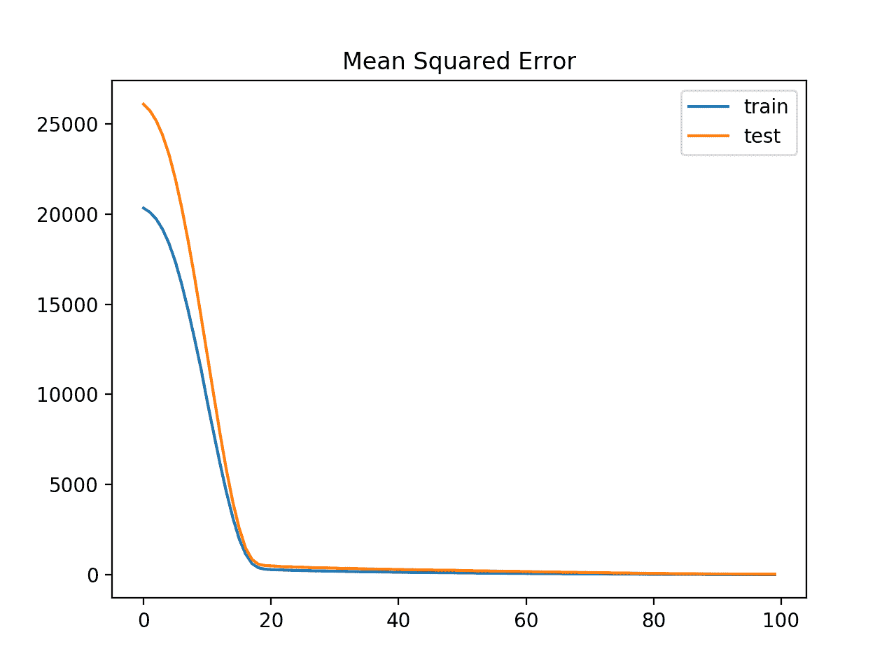
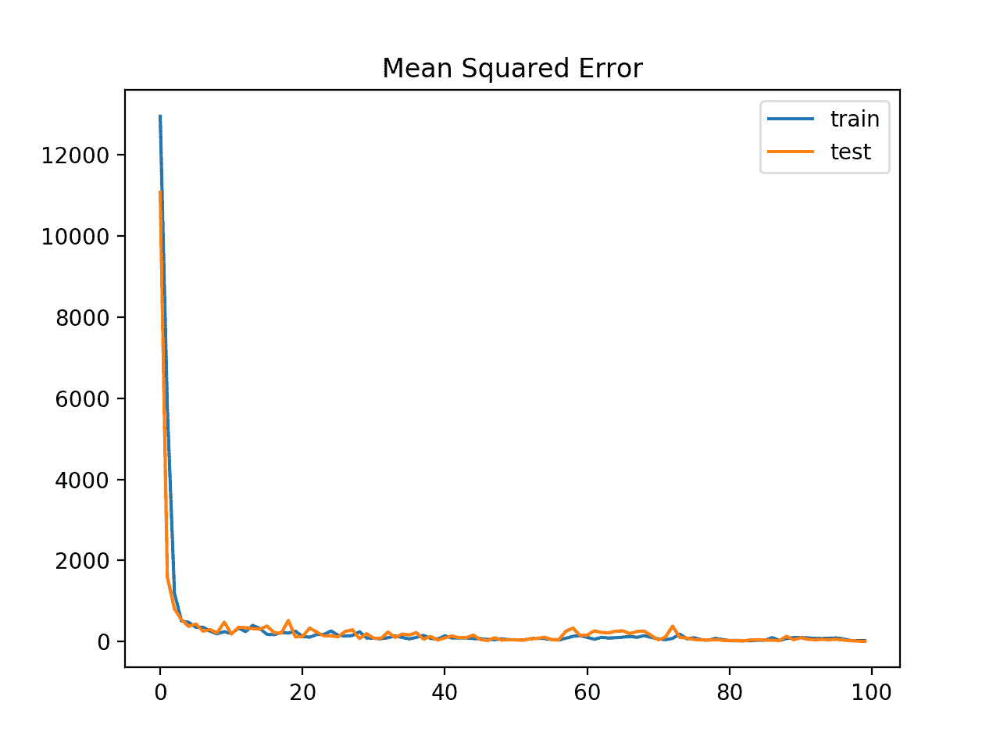

# 如何避免渐变裁剪带来的渐变爆炸

> 原文：<https://machinelearningmastery.com/how-to-avoid-exploding-gradients-in-neural-networks-with-gradient-clipping/>

最后更新于 2020 年 8 月 28 日

给定误差函数、学习速率甚至目标变量的规模的选择，训练神经网络会变得不稳定。

训练期间权重的大量更新会导致数值溢出或下溢，通常称为“*爆炸梯度*”

爆炸梯度的问题在递归神经网络中更常见，例如给定在数百个输入时间步长上展开的梯度累积的 LSTMs。

爆炸梯度问题的一个常见且相对简单的解决方案是，在通过网络反向传播误差并使用它来更新权重之前，改变误差的导数。两种方法包括给定选定的[向量范数](https://machinelearningmastery.com/vector-norms-machine-learning/)重新缩放梯度，以及剪切超过优选范围的梯度值。这些方法统称为“*渐变裁剪*”

在本教程中，您将发现爆炸梯度问题，以及如何使用梯度裁剪来提高神经网络训练的稳定性。

完成本教程后，您将知道:

*   训练神经网络会变得不稳定，导致被称为爆炸梯度的数值上溢或下溢。
*   通过缩放向量范数或者将梯度值裁剪到一定范围来改变误差梯度，可以使训练过程稳定。
*   如何使用梯度裁剪方法更新具有爆炸梯度的回归预测建模问题的 MLP 模型，以获得稳定的训练过程。

**用我的新书[更好的深度学习](https://machinelearningmastery.com/better-deep-learning/)启动你的项目**，包括*分步教程*和所有示例的 *Python 源代码*文件。

我们开始吧。


如何用梯度裁剪避免神经网络中的梯度爆炸
图片由[伊恩·利弗西](https://www.flickr.com/photos/ianlivesey/41207090214/)提供，版权所有。

## 教程概述

本教程分为六个部分；它们是:

1.  分解渐变和剪辑
2.  喀拉斯的梯度裁剪
3.  回归预测建模问题
4.  具有爆炸梯度的多层感知器
5.  具有梯度范数标度的 MLP
6.  具有梯度值削波的 MLP

## 分解渐变和剪辑

使用随机梯度下降优化算法训练神经网络。

这首先需要对一个或多个训练示例的损失进行估计，然后计算损失的导数，该导数通过网络向后传播，以便更新权重。使用由[学习速率](https://machinelearningmastery.com/learning-rate-for-deep-learning-neural-networks/)控制的反向传播误差的一部分来更新权重。

权重的更新可能太大，以至于权重要么溢出，要么下溢其数值精度。在实践中，当权重上溢或下溢时，权重可以采用“ *NaN* ”或“ *Inf* ”的值，并且出于实际目的，网络从该点开始将是无用的，当信号流过无效权重时，永远预测 NaN 值。

> 出现的困难是，当参数梯度非常大时，梯度下降参数更新可能会将参数抛得很远，进入目标函数更大的区域，从而撤销为达到当前解所做的大量工作。

—第 413 页，[深度学习](https://amzn.to/2NJW3gE)，2016。

权重的下溢或上溢通常被称为网络训练过程的不稳定性，并被称为“*爆炸梯度*”，因为不稳定的训练过程导致网络无法以模型基本无用的方式进行训练。

在给定的神经网络(如卷积神经网络或多层感知器)中，这可能是由于配置选择不当造成的。一些例子包括:

*   学习速率选择不当，导致权重更新过大。
*   数据准备选择不当，导致目标变量差异较大。
*   损失函数选择不当，允许计算较大的误差值。

考虑到在[展开的递归结构](https://machinelearningmastery.com/rnn-unrolling/)中误差梯度的累积，在诸如长短期记忆网络的递归神经网络中，爆炸梯度也是一个问题。

一般来说，通过仔细配置网络模型，例如选择小的学习速率、缩放的目标变量和[标准损失函数](https://machinelearningmastery.com/how-to-choose-loss-functions-when-training-deep-learning-neural-networks/)，可以避免爆炸梯度。然而，对于具有大量输入时间步长的递归网络，爆炸梯度可能仍然是一个问题。

> 用全梯度训练 LSTM 的一个困难是导数有时变得过大，导致数值问题。为了防止这种情况，[我们]将损耗相对于 LSTM 层网络输入的导数(在应用 sigmoid 和 tanh 函数之前)限制在预定范围内。

——[用递归神经网络生成序列](https://arxiv.org/abs/1308.0850)，2013。

分解梯度的一个常见解决方案是在通过网络反向传播误差导数并使用它更新权重之前改变它。通过重新调整误差导数，权重的更新也将被重新调整，显著降低上溢或下溢的可能性。

更新误差导数有两种主要方法；它们是:

*   渐变缩放。
*   渐变剪辑。

梯度缩放包括归一化误差梯度向量，使得向量范数(幅度)等于定义的值，例如 1.0。

> ……处理梯度范数突然增加的一个简单机制是，每当它们超过阈值时，重新调整它们的比例

——[关于递归神经网络](https://arxiv.org/abs/1211.5063)的训练难度，2013。

如果渐变超出了预期范围，渐变裁剪会强制渐变值(按元素)达到特定的最小值或最大值。

这些方法合在一起，通常简称为“*渐变裁剪*”

> 当传统的梯度下降算法提出进行非常大的步长时，梯度裁剪启发式介入以将步长减小到足够小，使得它不太可能超出梯度指示近似最陡下降方向的区域。

—第 289 页，[深度学习](https://amzn.to/2NJW3gE)，2016。

这种方法只解决了训练深度神经网络模型的数值稳定性问题，并没有提供任何性能上的全面改善。

梯度向量范数或优选范围的值可以通过反复试验、使用文献中使用的公共值或通过首先通过实验观察公共向量范数或范围，然后选择合理的值来配置。

> 在我们的实验中，我们注意到，对于给定的任务和模型大小，训练对这个[梯度范数]超参数不是很敏感，并且即使对于相当小的阈值，算法也表现良好。

——[关于递归神经网络](https://arxiv.org/abs/1211.5063)的训练难度，2013。

网络中的所有图层通常使用相同的渐变裁剪配置。然而，与隐藏层相比，输出层允许更大范围的误差梯度。

> 输出导数[…]被限幅在范围[-100，100]内，LSTM 导数被限幅在范围[-10，10]内。削波输出梯度被证明对数值稳定性至关重要；即便如此，在训练后期，当网络开始过度拟合训练数据后，有时也会出现数字问题。

——[用递归神经网络生成序列](https://arxiv.org/abs/1308.0850)，2013。

## 喀拉斯的梯度裁剪

Keras 支持对每个优化算法进行梯度裁剪，对模型中的所有层应用相同的方案

通过在配置优化算法时包含一个附加参数，梯度裁剪可以与优化算法一起使用，例如随机梯度下降。

可以使用两种类型的渐变裁剪:渐变范数缩放和渐变值裁剪。

### 梯度范数标度

梯度范数缩放涉及当梯度向量的 L2 向量范数(平方值的和)超过阈值时，改变损失函数的导数以具有给定的向量范数。

例如，我们可以指定一个 1.0 的范数，这意味着如果一个梯度的向量范数超过 1.0，那么向量中的值将被重新缩放，使得向量的范数等于 1.0。

这可以在 Keras 中通过在优化器上指定“ *clipnorm* ”参数来使用；例如:

```py
....
# configure sgd with gradient norm clipping
opt = SGD(lr=0.01, momentum=0.9, clipnorm=1.0)
```

### 梯度值削波

如果梯度值小于负阈值或大于正阈值，梯度值削波包括将损失函数的导数削波为给定值。

例如，我们可以指定 0.5 的范数，这意味着如果梯度值小于-0.5，它将被设置为-0.5，如果它大于 0.5，那么它将被设置为 0.5。

这可以在 Keras 中通过在优化器上指定“clipvalue”参数来使用，例如:

```py
...
# configure sgd with gradient value clipping
opt = SGD(lr=0.01, momentum=0.9, clipvalue=0.5)
```

## 回归预测建模问题

回归预测建模问题涉及预测实值量。

我们可以在[make _ revolution()函数](http://scikit-learn.org/stable/modules/generated/sklearn.datasets.make_regression.html)中使用 scikit-learn 库提供的标准回归问题生成器。该函数将从具有给定数量的输入变量、统计噪声和其他属性的简单回归问题中生成示例。

我们将使用这个函数来定义一个有 20 个输入特征的问题；其中 10 个功能将是有意义的，10 个将不相关。总共将随机生成 1000 个示例。[伪随机数发生器](https://machinelearningmastery.com/how-to-generate-random-numbers-in-python/)将被固定，以确保我们每次运行代码时都能得到相同的 1000 个例子。

```py
# generate regression dataset
X, y = make_regression(n_samples=1000, n_features=20, noise=0.1, random_state=1)
```

每个输入变量都具有高斯分布，目标变量也是如此。

我们可以创建显示分布和扩散的目标变量图。下面列出了完整的示例。

```py
# regression predictive modeling problem
from sklearn.datasets import make_regression
from matplotlib import pyplot
# generate regression dataset
X, y = make_regression(n_samples=1000, n_features=20, noise=0.1, random_state=1)
# histogram of target variable
pyplot.subplot(121)
pyplot.hist(y)
# boxplot of target variable
pyplot.subplot(122)
pyplot.boxplot(y)
pyplot.show()
```

运行该示例会创建一个图形，该图形有两个曲线图，分别显示目标变量的直方图和方框图。

直方图显示目标变量的高斯分布。方框图和晶须图显示样品的范围在约-400 至 400 之间变化，平均值约为 0.0。


回归问题目标变量的直方图和盒须图

## 具有爆炸梯度的多层感知器

我们可以为回归问题开发一个多层感知器(MLP)模型。

将在原始数据上演示一个模型，不需要对输入或输出变量进行任何缩放。这是一个很好的例子来演示爆炸梯度，因为被训练来预测未缩放目标变量的模型将导致误差梯度，其值在数百甚至数千，这取决于训练期间使用的批次大小。如此大的梯度值很可能导致学习不稳定或权重值溢出。

第一步是将数据分成训练集和测试集，这样我们就可以拟合和评估模型。我们将从域中生成 1，000 个示例，并将数据集分成两半，使用 500 个示例作为训练集和测试集。

```py
# split into train and test
n_train = 500
trainX, testX = X[:n_train, :], X[n_train:, :]
trainy, testy = y[:n_train], y[n_train:]
```

接下来，我们可以定义一个 MLP 模型。

该模型将在问题的 20 个输入变量中有 20 个输入。单个隐藏层将使用 25 个节点和一个校正的线性激活函数。输出层有一个单目标变量节点和一个线性激活函数来直接预测真实值。

```py
# define model
model = Sequential()
model.add(Dense(25, input_dim=20, activation='relu', kernel_initializer='he_uniform'))
model.add(Dense(1, activation='linear'))
```

均方误差损失函数将用于优化模型，随机梯度下降优化算法将用于学习率为 0.01、动量为 0.9 的合理默认配置。

```py
# compile model
model.compile(loss='mean_squared_error', optimizer=SGD(lr=0.01, momentum=0.9))
```

该模型将适用于 100 个训练时期，测试集将用作验证集，在每个训练时期结束时进行评估。

训练结束时，在训练和测试数据集上计算均方误差，以了解模型学习问题的程度。

```py
# evaluate the model
train_mse = model.evaluate(trainX, trainy, verbose=0)
test_mse = model.evaluate(testX, testy, verbose=0)
```

最后，在每个训练周期结束时，训练集和测试集的均方误差的学习曲线用线图表示，在学习问题的同时，提供学习曲线以获得模型的动力学概念。

```py
# plot loss during training
pyplot.title('Mean Squared Error')
pyplot.plot(history.history['loss'], label='train')
pyplot.plot(history.history['val_loss'], label='test')
pyplot.legend()
pyplot.show()
```

将这些元素结合在一起，下面列出了完整的示例。

```py
# mlp with unscaled data for the regression problem
from sklearn.datasets import make_regression
from keras.layers import Dense
from keras.models import Sequential
from keras.optimizers import SGD
from matplotlib import pyplot
# generate regression dataset
X, y = make_regression(n_samples=1000, n_features=20, noise=0.1, random_state=1)
# split into train and test
n_train = 500
trainX, testX = X[:n_train, :], X[n_train:, :]
trainy, testy = y[:n_train], y[n_train:]
# define model
model = Sequential()
model.add(Dense(25, input_dim=20, activation='relu', kernel_initializer='he_uniform'))
model.add(Dense(1, activation='linear'))
# compile model
model.compile(loss='mean_squared_error', optimizer=SGD(lr=0.01, momentum=0.9))
# fit model
history = model.fit(trainX, trainy, validation_data=(testX, testy), epochs=100, verbose=0)
# evaluate the model
train_mse = model.evaluate(trainX, trainy, verbose=0)
test_mse = model.evaluate(testX, testy, verbose=0)
print('Train: %.3f, Test: %.3f' % (train_mse, test_mse))
# plot loss during training
pyplot.title('Mean Squared Error')
pyplot.plot(history.history['loss'], label='train')
pyplot.plot(history.history['val_loss'], label='test')
pyplot.legend()
pyplot.show()
```

运行该示例符合模型，并计算列车和测试集的均方误差。

在这种情况下，模型无法学习问题，导致对 NaN 值的预测。给定非常大的误差，模型权重在训练期间爆炸，并且反过来为权重更新计算误差梯度。

```py
Train: nan, Test: nan
```

这表明需要对模型的目标变量进行一些干预来学习这个问题。

创建训练历史的线图，但不显示任何内容，因为模型几乎立即导致 NaN 均方误差。

一个传统的解决方案是使用标准化或规范化来重新调整目标变量，这种方法被推荐用于 MLP。然而，在这种情况下，我们将研究的另一种方法是使用渐变裁剪。

## 具有梯度范数标度的 MLP

我们可以更新上一节中模型的训练，添加梯度范数缩放。

这可以通过在优化器上设置“ *clipnorm* ”参数来实现。

例如，可以将梯度重新缩放为向量范数(大小或长度)为 1.0，如下所示:

```py
# compile model
opt = SGD(lr=0.01, momentum=0.9, clipnorm=1.0)
model.compile(loss='mean_squared_error', optimizer=opt)
```

下面列出了此更改的完整示例。

```py
# mlp with unscaled data for the regression problem with gradient norm scaling
from sklearn.datasets import make_regression
from keras.layers import Dense
from keras.models import Sequential
from keras.optimizers import SGD
from matplotlib import pyplot
# generate regression dataset
X, y = make_regression(n_samples=1000, n_features=20, noise=0.1, random_state=1)
# split into train and test
n_train = 500
trainX, testX = X[:n_train, :], X[n_train:, :]
trainy, testy = y[:n_train], y[n_train:]
# define model
model = Sequential()
model.add(Dense(25, input_dim=20, activation='relu', kernel_initializer='he_uniform'))
model.add(Dense(1, activation='linear'))
# compile model
opt = SGD(lr=0.01, momentum=0.9, clipnorm=1.0)
model.compile(loss='mean_squared_error', optimizer=opt)
# fit model
history = model.fit(trainX, trainy, validation_data=(testX, testy), epochs=100, verbose=0)
# evaluate the model
train_mse = model.evaluate(trainX, trainy, verbose=0)
test_mse = model.evaluate(testX, testy, verbose=0)
print('Train: %.3f, Test: %.3f' % (train_mse, test_mse))
# plot loss during training
pyplot.title('Mean Squared Error')
pyplot.plot(history.history['loss'], label='train')
pyplot.plot(history.history['val_loss'], label='test')
pyplot.legend()
pyplot.show()
```

运行该示例符合模型，并在列车和测试集上对其进行评估，打印均方误差。

**注**:考虑到算法或评估程序的随机性，或数值精度的差异，您的[结果可能会有所不同](https://machinelearningmastery.com/different-results-each-time-in-machine-learning/)。考虑运行该示例几次，并比较平均结果。

在这种情况下，我们可以看到，用 1.0 的向量范数缩放梯度已经产生了能够学习问题并收敛到解决方案的稳定模型。

```py
Train: 5.082, Test: 27.433
```

还创建了一个线图，显示训练和测试数据集在训练时期的均方误差损失。

该图显示了在 20 个时期内，损失是如何从 20，000 以上的大值迅速下降到 100 以下的小值的。



具有梯度范数缩放的训练时期内训练(蓝色)和测试(橙色)数据集的均方误差损失线图

向量范数值 1.0 没有什么特别之处，可以评估其他值，并比较所得模型的性能。

## 具有梯度值削波的 MLP

爆炸渐变问题的另一个解决方案是在渐变变得太大或太小时对其进行裁剪。

我们可以通过将“ *clipvalue* ”参数添加到优化算法配置中来更新 MLP 的训练以使用梯度裁剪。例如，下面的代码将渐变剪辑到[-5 到 5]的范围。

```py
# compile model
opt = SGD(lr=0.01, momentum=0.9, clipvalue=5.0)
model.compile(loss='mean_squared_error', optimizer=opt)
```

下面列出了使用渐变剪辑训练 MLP 的完整示例。

```py
# mlp with unscaled data for the regression problem with gradient clipping
from sklearn.datasets import make_regression
from keras.layers import Dense
from keras.models import Sequential
from keras.optimizers import SGD
from matplotlib import pyplot
# generate regression dataset
X, y = make_regression(n_samples=1000, n_features=20, noise=0.1, random_state=1)
# split into train and test
n_train = 500
trainX, testX = X[:n_train, :], X[n_train:, :]
trainy, testy = y[:n_train], y[n_train:]
# define model
model = Sequential()
model.add(Dense(25, input_dim=20, activation='relu', kernel_initializer='he_uniform'))
model.add(Dense(1, activation='linear'))
# compile model
opt = SGD(lr=0.01, momentum=0.9, clipvalue=5.0)
model.compile(loss='mean_squared_error', optimizer=opt)
# fit model
history = model.fit(trainX, trainy, validation_data=(testX, testy), epochs=100, verbose=0)
# evaluate the model
train_mse = model.evaluate(trainX, trainy, verbose=0)
test_mse = model.evaluate(testX, testy, verbose=0)
print('Train: %.3f, Test: %.3f' % (train_mse, test_mse))
# plot loss during training
pyplot.title('Mean Squared Error')
pyplot.plot(history.history['loss'], label='train')
pyplot.plot(history.history['val_loss'], label='test')
pyplot.legend()
pyplot.show()
```

运行此示例符合模型，并在列车和测试集上对其进行评估，打印均方误差。

**注**:考虑到算法或评估程序的随机性，或数值精度的差异，您的[结果可能会有所不同](https://machinelearningmastery.com/different-results-each-time-in-machine-learning/)。考虑运行该示例几次，并比较平均结果。

我们可以看到，在这种情况下，模型能够在不分解梯度的情况下学习问题，在训练集和测试集中均达到小于 10 的均方误差。

```py
Train: 9.487, Test: 9.985
```

还创建了一个线图，显示训练和测试数据集在训练时期的均方误差损失。

该图显示，该模型学习问题的速度很快，仅在几个训练时期内就实现了亚 100 毫秒的损失。



具有梯度值削波的训练时期内训练(蓝色)和测试(橙色)数据集的均方误差损失线图

任意选择了[-5，5]的剪裁范围；您可以尝试不同大小的范围，并比较学习速度和最终模型性能的表现。

## 扩展ˌ扩张

本节列出了一些您可能希望探索的扩展教程的想法。

*   **向量范数值**。更新示例以评估不同的梯度向量范数值并比较性能。
*   **矢量剪辑值**。更新示例以评估不同的梯度值范围并比较性能。
*   **向量范数和剪辑**。更新示例，在同一训练运行中使用向量范数缩放和向量值裁剪的组合，并比较性能。

如果你探索这些扩展，我很想知道。

## 进一步阅读

如果您想更深入地了解这个主题，本节将提供更多资源。

### 邮件

*   [神经网络中爆炸梯度的温和介绍](https://machinelearningmastery.com/exploding-gradients-in-neural-networks/)

### 书

*   第 8.2.4 节悬崖和爆炸梯度，[深度学习](https://amzn.to/2NJW3gE)，2016。
*   第 10.11.1 节削波渐变，[深度学习](https://amzn.to/2NJW3gE)，2016。

### 报纸

*   [关于递归神经网络的训练难度](https://arxiv.org/abs/1211.5063)，2013。
*   [用递归神经网络生成序列](https://arxiv.org/abs/1308.0850)，2013。

### 应用程序接口

*   [硬优化器 API](https://keras.io/optimizers/)
*   [Keras 优化器源代码](https://github.com/keras-team/keras/blob/master/keras/optimizers.py)

## 摘要

在本教程中，您发现了爆炸梯度问题，以及如何使用梯度裁剪来提高神经网络训练的稳定性。

具体来说，您了解到:

*   训练神经网络会变得不稳定，导致被称为爆炸梯度的数值上溢或下溢。
*   通过改变误差梯度，可以使训练过程稳定，或者通过缩放向量范数，或者将梯度值裁剪到一定范围。
*   如何使用梯度裁剪方法更新具有爆炸梯度的回归预测建模问题的 MLP 模型，以获得稳定的训练过程。

你有什么问题吗？
在下面的评论中提问，我会尽力回答。