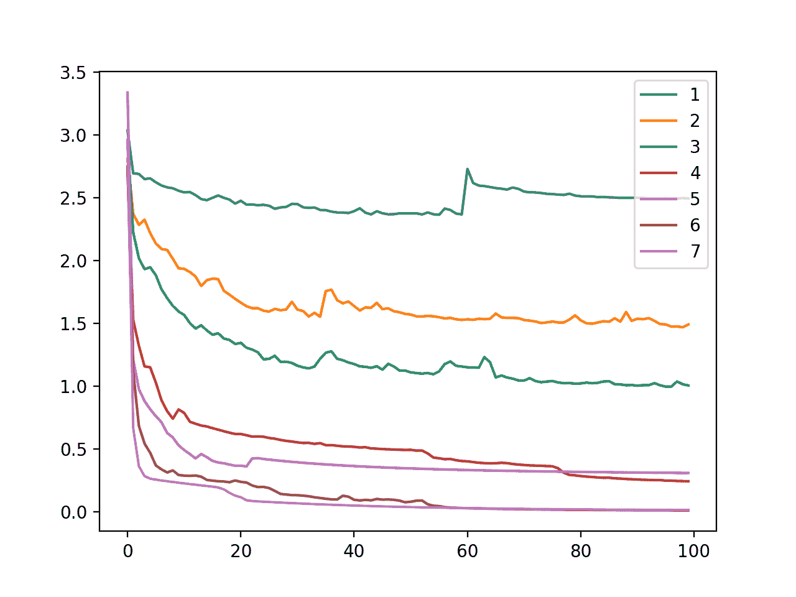
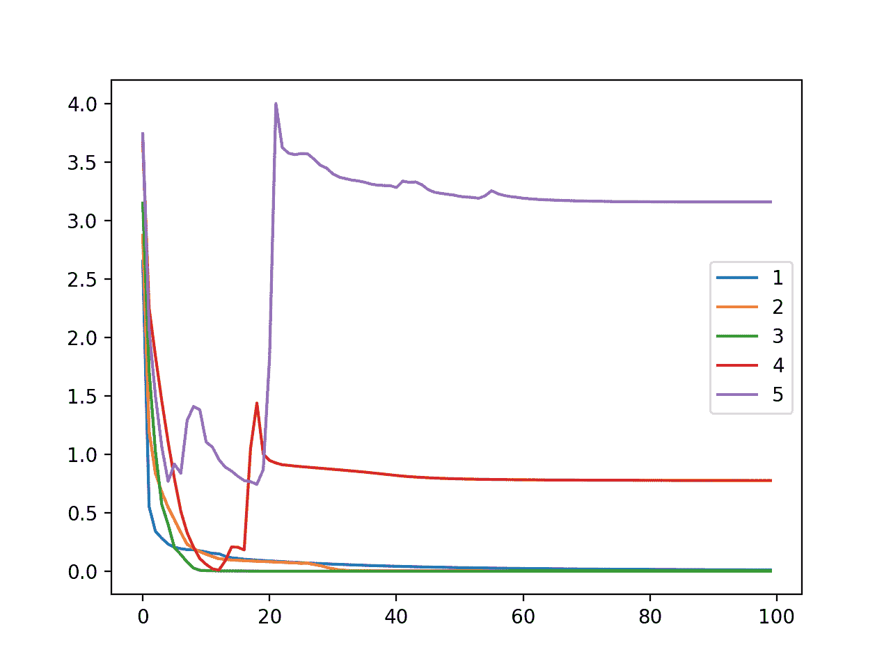

# 如何使用节点和层控制神经网络模型容量

> 原文：<https://machinelearningmastery.com/how-to-control-neural-network-model-capacity-with-nodes-and-layers/>

最后更新于 2020 年 8 月 25 日

深度学习神经网络模型的能力控制它能够学习的映射函数类型的范围。

容量太小的模型无法学习训练数据集，这意味着它会欠载，而容量太大的模型可能会记住训练数据集，这意味着它会过载，或者可能会在优化过程中卡住或丢失。

神经网络模型的容量是通过配置节点数和层数来定义的。

在本教程中，您将发现如何控制神经网络模型的容量，以及容量如何影响模型的学习能力。

完成本教程后，您将知道:

*   神经网络模型容量由模型中的节点数和层数控制。
*   具有单个隐藏层和足够数量的节点的模型具有学习任何映射函数的能力，但是所选择的学习算法可能能够或者不能够实现这种能力。
*   增加层数提供了用更少的资源增加模型容量的捷径，现代技术允许学习算法成功地训练深度模型。

**用我的新书[更好的深度学习](https://machinelearningmastery.com/better-deep-learning/)启动你的项目**，包括*分步教程*和所有示例的 *Python 源代码*文件。

我们开始吧。

*   **2020 年 1 月更新**:针对 Sklearn v0.22 API 的变化进行了更新。


如何用节点和层控制神经网络模型容量
图片由[伯纳德·斯拉格提供。新西兰](https://www.flickr.com/photos/volvob12b/9497132539/)，保留部分权利。

## 教程概述

本教程分为五个部分；它们是:

1.  控制神经网络模型容量
2.  在 Keras 中配置节点和层
3.  多类分类问题
4.  使用节点更改模型容量
5.  改变模型容量和层数

## 控制神经网络模型容量

神经网络的目标是学习如何将输入示例映射到输出示例。

神经网络学习映射函数。网络的容量是指模型可以近似的功能类型的范围或范围。

> 非正式地说，模型的能力是它适应各种功能的能力。

—第 111-112 页，[深度学习](https://amzn.to/2IXzUIY)，2016。

容量较小的模型可能无法充分学习训练数据集。容量更大的模型可以对更多不同类型的函数进行建模，并且可能能够学习一个函数来将输入充分映射到训练数据集中的输出。然而，容量太大的模型可能会记住训练数据集，并且不能概括或迷失或陷入对合适的映射函数的搜索中。

一般来说，我们可以将模型容量视为对模型是否可能对训练数据集进行欠填充或过填充的控制。

> 我们可以通过改变一个模型的容量来控制它是更有可能超载还是超载。

—第 111 页，[深度学习](https://amzn.to/2IXzUIY)，2016。

神经网络的容量可以通过模型的两个方面来控制:

*   节点数。
*   层数。

具有更多节点或更多层的模型具有更大的容量，进而有可能学习更大的映射函数集。

> 具有更多层和每层更多隐藏单元的模型具有更高的表示能力——它能够表示更复杂的功能。

—第 428 页，[深度学习](https://amzn.to/2IXzUIY)，2016。

一层中的节点数称为**宽度**。

开发一层多节点的广域网相对简单。理论上，在单个隐藏层中具有足够节点的网络可以学习逼近任何映射函数，尽管在实践中，我们不知道有多少节点是足够的，也不知道如何训练这样的模型。

模型中的层数被称为其**深度**。

增加深度会增加模型的容量。训练深层模型，例如具有许多隐藏层的模型，比训练具有大量节点的单层网络在计算上更有效率。

> 现代深度学习为监督学习提供了一个非常强大的框架。通过在一个层中添加更多的层和更多的单元，深度网络可以代表越来越复杂的功能。

—第 167 页，[深度学习](https://amzn.to/2IXzUIY)，2016。

传统上，由于梯度消失等问题，训练具有多个层的神经网络模型具有挑战性。最近，现代方法已经允许深度网络模型的训练，允许开发令人惊讶的深度的模型，其能够在广泛领域的挑战性问题上实现令人印象深刻的表现。

## 在 Keras 中配置节点和层

Keras 允许您轻松地将节点和图层添加到模型中。

### 配置模型节点

图层的第一个参数指定图层中使用的节点数。

多层感知器或 MLP 模型的完全连接层是通过密集层添加的。

例如，我们可以创建一个具有 32 个节点的全连接层，如下所示:

```py
...
layer = Dense(32)
```

类似地，可以以相同的方式为递归神经网络层指定节点的数量。

例如，我们可以创建一个具有 32 个节点(或单元)的 LSTM 图层，如下所示:

```py
...
layer = LSTM(32)
```

卷积神经网络，或 CNN，没有节点，而是指定过滤器映射的数量和它们的形状。过滤图的数量和大小决定了图层的容量。

我们可以用 32 个过滤图定义一个二维 CNN，每个过滤图的大小为 3 乘 3，如下所示:

```py
...
layer = Conv2D(32, (3,3))
```

### 配置模型层

通过调用 add()函数并传入层，层被添加到顺序模型中。

MLP 的全连接层可以通过重复调用来添加，以在已配置的密集层中添加通道；例如:

```py
...
model = Sequential()
model.add(Dense(32))
model.add(Dense(64))
```

类似地，循环网络的层数可以以相同的方式添加，以给出堆叠的循环模型。

一个重要的区别是递归层期望三维输入，因此先前的递归层必须返回完整的输出序列，而不是输入序列末尾每个节点的单个输出。

这可以通过将“*return _ sequence*”参数设置为“ *True* 来实现。例如:

```py
...
model = Sequential()
model.add(LSTM(32, return_sequences=True))
model.add(LSTM(32))
```

卷积层可以直接堆叠，通常是将一两个卷积层堆叠在一起，然后是一个池化层，然后重复这种层的模式；例如:

```py
...
model = Sequential()
model.add(Conv2D(16, (3,3)))
model.add(Conv2D(16, (3,3)))
model.add(MaxPooling2D((2,2)))
model.add(Conv2D(32, (3,3)))
model.add(Conv2D(32, (3,3)))
model.add(MaxPooling2D((2,2)))
```

现在我们知道了如何在 Keras 中为模型配置节点和层的数量，我们可以看看容量如何影响多类分类问题上的模型表现。

## 多类分类问题

我们将使用一个标准的多类分类问题作为基础来演示模型容量对模型表现的影响。

Sklearn 类提供了 [make_blobs()函数](http://Sklearn.org/stable/modules/generated/sklearn.datasets.make_blobs.html)，该函数可用于创建具有规定数量的样本、输入变量、类和类内样本方差的多类分类问题。

我们可以通过“ *n_features* ”参数将问题配置为具有特定数量的输入变量，并通过“ *centers* ”参数配置特定数量的类或中心。“ *random_state* ”可用于给伪随机数发生器播种，以确保每次调用函数时我们总是获得相同的样本。

例如，下面的调用为一个有两个输入变量的三类问题生成了 1000 个例子。

```py
...
# generate 2d classification dataset
X, y = make_blobs(n_samples=1000, centers=3, n_features=2, cluster_std=2, random_state=2)
```

结果是我们可以建模的数据集的输入和输出元素。

为了了解问题的复杂性，我们可以在二维散点图上绘制每个点，并按类值给每个点着色。

下面列出了完整的示例。

```py
# scatter plot of blobs dataset
from sklearn.datasets import make_blobs
from matplotlib import pyplot
from numpy import where
# generate 2d classification dataset
X, y = make_blobs(n_samples=1000, centers=3, n_features=2, cluster_std=2, random_state=2)
# scatter plot for each class value
for class_value in range(3):
	# select indices of points with the class label
	row_ix = where(y == class_value)
	# scatter plot for points with a different color
	pyplot.scatter(X[row_ix, 0], X[row_ix, 1])
# show plot
pyplot.show()
```

运行该示例会创建整个数据集的散点图。我们可以看到，选择的标准偏差为 2.0 意味着类不是线性可分的(用一条线可分)，导致很多不明确的点。

这是可取的，因为这意味着问题不是微不足道的，并将允许神经网络模型找到许多不同的“T0”足够好的“T1”候选解决方案。


具有三个类和按类值着色的点的斑点数据集的散点图

为了探索模型容量，我们需要比三个类和两个变量更复杂的问题。

为了以下实验的目的，我们将使用 100 个输入特征和 20 个类；例如:

```py
...
# generate 2d classification dataset
X, y = make_blobs(n_samples=1000, centers=20, n_features=100, cluster_std=2, random_state=2)
```

## 使用节点更改模型容量

在本节中，我们将开发一个多层感知器模型，或 MLP，用于 blobs 多类分类问题，并演示节点数量对模型学习能力的影响。

我们可以从开发一个函数来准备数据集开始。

数据集的输入和输出元素可以使用上一节中描述的 *make_blobs()* 函数来创建。

接下来，目标变量必须是一个热编码的。这是为了使模型能够学习预测输入示例属于 20 个类中的每一个的概率。

我们可以使用[to _ classic()Keras 效用函数](https://keras.io/utils/#to_categorical)来实现，例如:

```py
# one hot encode output variable
y = to_categorical(y)
```

接下来，我们可以将 1，000 个示例分成两半，使用 500 个示例作为训练数据集，使用 500 个示例来评估模型。

```py
# split into train and test
n_train = 500
trainX, testX = X[:n_train, :], X[n_train:, :]
trainy, testy = y[:n_train], y[n_train:]
return trainX, trainy, testX, testy
```

下面的 *create_dataset()* 函数将这些元素联系在一起，并根据输入和输出元素返回训练和测试集。

```py
# prepare multi-class classification dataset
def create_dataset():
	# generate 2d classification dataset
	X, y = make_blobs(n_samples=1000, centers=20, n_features=100, cluster_std=2, random_state=2)
	# one hot encode output variable
	y = to_categorical(y)
	# split into train and test
	n_train = 500
	trainX, testX = X[:n_train, :], X[n_train:, :]
	trainy, testy = y[:n_train], y[n_train:]
	return trainX, trainy, testX, testy
```

我们可以调用这个函数来准备数据集。

```py
# prepare dataset
trainX, trainy, testX, testy = create_dataset()
```

接下来，我们可以定义一个函数来创建模型，使其适合训练数据集，然后在测试数据集上对其进行评估。

模型需要知道输入变量的数量以便配置输入层，并且需要知道目标类的数量以便配置输出层。这些属性可以直接从训练数据集中提取。

```py
# configure the model based on the data
n_input, n_classes = trainX.shape[1], testy.shape[1]
```

我们将定义一个具有单个隐藏层的模型，该模型使用校正的线性激活函数和 he 随机权重初始化方法。

输出层将使用 softmax 激活函数来预测每个目标类的概率。隐藏层中的节点数量将通过名为“ *n_nodes* ”的参数提供。

```py
# define model
model = Sequential()
model.add(Dense(n_nodes, input_dim=n_input, activation='relu', kernel_initializer='he_uniform'))
model.add(Dense(n_classes, activation='softmax'))
```

该模型将使用随机梯度下降进行优化，学习率为 0.01，高动量为 0.9，并将使用分类交叉熵损失函数，适用于多类分类。

```py
# compile model
opt = SGD(lr=0.01, momentum=0.9)
model.compile(loss='categorical_crossentropy', optimizer=opt, metrics=['accuracy'])
```

该模型将适合 100 个训练时期，然后将在测试数据集上评估该模型。

```py
# fit model on train set
history = model.fit(trainX, trainy, epochs=100, verbose=0)
# evaluate model on test set
_, test_acc = model.evaluate(testX, testy, verbose=0)
```

将这些元素联系在一起，下面的 *evaluate_model()* 函数将节点数和数据集作为参数，并返回每个时期结束时的训练损失历史以及最终模型在测试数据集上的准确性。

```py
# fit model with given number of nodes, returns test set accuracy
def evaluate_model(n_nodes, trainX, trainy, testX, testy):
	# configure the model based on the data
	n_input, n_classes = trainX.shape[1], testy.shape[1]
	# define model
	model = Sequential()
	model.add(Dense(n_nodes, input_dim=n_input, activation='relu', kernel_initializer='he_uniform'))
	model.add(Dense(n_classes, activation='softmax'))
	# compile model
	opt = SGD(lr=0.01, momentum=0.9)
	model.compile(loss='categorical_crossentropy', optimizer=opt, metrics=['accuracy'])
	# fit model on train set
	history = model.fit(trainX, trainy, epochs=100, verbose=0)
	# evaluate model on test set
	_, test_acc = model.evaluate(testX, testy, verbose=0)
	return history, test_acc
```

我们可以用不同数量的节点来调用这个函数，以便在隐藏层中使用。

问题相对简单；因此，我们将回顾具有 1 到 7 个节点的模型的表现。

我们预计，随着节点数量的增加，这将增加模型的容量，并允许模型更好地学习训练数据集，至少在学习算法的所选配置(例如，学习率、批次大小和时期)所限制的点上。

将打印每个配置的测试精度，并绘制每个配置的训练精度的学习曲线。

```py
# evaluate model and plot learning curve with given number of nodes
num_nodes = [1, 2, 3, 4, 5, 6, 7]
for n_nodes in num_nodes:
	# evaluate model with a given number of nodes
	history, result = evaluate_model(n_nodes, trainX, trainy, testX, testy)
	# summarize final test set accuracy
	print('nodes=%d: %.3f' % (n_nodes, result))
	# plot learning curve
	pyplot.plot(history.history['loss'], label=str(n_nodes))
# show the plot
pyplot.legend()
pyplot.show()
```

为了完整起见，下面提供了完整的代码列表。

```py
# study of mlp learning curves given different number of nodes for multi-class classification
from sklearn.datasets import make_blobs
from keras.layers import Dense
from keras.models import Sequential
from keras.optimizers import SGD
from keras.utils import to_categorical
from matplotlib import pyplot

# prepare multi-class classification dataset
def create_dataset():
	# generate 2d classification dataset
	X, y = make_blobs(n_samples=1000, centers=20, n_features=100, cluster_std=2, random_state=2)
	# one hot encode output variable
	y = to_categorical(y)
	# split into train and test
	n_train = 500
	trainX, testX = X[:n_train, :], X[n_train:, :]
	trainy, testy = y[:n_train], y[n_train:]
	return trainX, trainy, testX, testy

# fit model with given number of nodes, returns test set accuracy
def evaluate_model(n_nodes, trainX, trainy, testX, testy):
	# configure the model based on the data
	n_input, n_classes = trainX.shape[1], testy.shape[1]
	# define model
	model = Sequential()
	model.add(Dense(n_nodes, input_dim=n_input, activation='relu', kernel_initializer='he_uniform'))
	model.add(Dense(n_classes, activation='softmax'))
	# compile model
	opt = SGD(lr=0.01, momentum=0.9)
	model.compile(loss='categorical_crossentropy', optimizer=opt, metrics=['accuracy'])
	# fit model on train set
	history = model.fit(trainX, trainy, epochs=100, verbose=0)
	# evaluate model on test set
	_, test_acc = model.evaluate(testX, testy, verbose=0)
	return history, test_acc

# prepare dataset
trainX, trainy, testX, testy = create_dataset()
# evaluate model and plot learning curve with given number of nodes
num_nodes = [1, 2, 3, 4, 5, 6, 7]
for n_nodes in num_nodes:
	# evaluate model with a given number of nodes
	history, result = evaluate_model(n_nodes, trainX, trainy, testX, testy)
	# summarize final test set accuracy
	print('nodes=%d: %.3f' % (n_nodes, result))
	# plot learning curve
	pyplot.plot(history.history['loss'], label=str(n_nodes))
# show the plot
pyplot.legend()
pyplot.show()
```

运行示例首先打印每个模型配置的测试精度。

**注**:考虑到算法或评估程序的随机性，或数值精度的差异，您的[结果可能会有所不同](https://machinelearningmastery.com/different-results-each-time-in-machine-learning/)。考虑运行该示例几次，并比较平均结果。

在这种情况下，我们可以看到，随着节点数量的增加，模型学习问题的能力也会增加。这导致模型在测试数据集上的泛化误差逐渐降低，直到模型完美地学习问题的 6 和 7 个节点。

```py
nodes=1: 0.138
nodes=2: 0.380
nodes=3: 0.582
nodes=4: 0.890
nodes=5: 0.844
nodes=6: 1.000
nodes=7: 1.000
```

还创建了一个线图，显示了 100 个训练时期内每个模型配置(隐藏层中的 1 到 7 个节点)的训练数据集中的交叉熵损失。

我们可以看到，随着节点数量的增加，模型能够更好地减少损失，例如更好地学习训练数据集。该图显示了模型容量与模型学习能力之间的直接关系，模型容量由隐藏层中的节点数量定义。



当改变模型节点时，斑点多类分类问题训练数据集中 MLP 在训练时期的交叉熵损失线图

节点的数量可以增加到学习算法不再能够充分学习映射函数的程度(例如 1000 个节点)。

## 改变模型容量和层数

我们可以执行类似的分析，并评估层数如何影响模型学习映射函数的能力。

增加层数通常可以大大增加模型的容量，就像建模问题的计算和学习捷径。例如，一个包含 10 个节点的隐藏层的模型不等同于两个包含 5 个节点的隐藏层的模型。后者的容量要大得多。

危险在于，容量超过要求的模型可能会过度训练训练数据，并且与具有太多节点的模型一样，具有太多层的模型可能无法学习训练数据集，从而在优化过程中迷失或停滞。

首先，我们可以更新 *evaluate_model()* 函数来拟合具有给定层数的 MLP 模型。

从上一节中我们知道，一个大约有七个或更多节点的 MLP 适合 100 个时代，它将完美地学习这个问题。因此，我们将在每一层中使用 10 个节点，以确保模型在一层中有足够的容量来学习问题。

下面列出了更新后的函数，以层数和数据集为参数，返回模型的训练历史和测试精度。

```py
# fit model with given number of layers, returns test set accuracy
def evaluate_model(n_layers, trainX, trainy, testX, testy):
	# configure the model based on the data
	n_input, n_classes = trainX.shape[1], testy.shape[1]
	# define model
	model = Sequential()
	model.add(Dense(10, input_dim=n_input, activation='relu', kernel_initializer='he_uniform'))
	for _ in range(1, n_layers):
		model.add(Dense(10, activation='relu', kernel_initializer='he_uniform'))
	model.add(Dense(n_classes, activation='softmax'))
	# compile model
	opt = SGD(lr=0.01, momentum=0.9)
	model.compile(loss='categorical_crossentropy', optimizer=opt, metrics=['accuracy'])
	# fit model
	history = model.fit(trainX, trainy, epochs=100, verbose=0)
	# evaluate model on test set
	_, test_acc = model.evaluate(testX, testy, verbose=0)
	return history, test_acc
```

假设单个隐藏层模型有足够的能力学习这个问题，我们将探索增加层数，使学习算法变得不稳定，无法再学习这个问题。

如果选择的建模问题更复杂，我们可以探索增加层次，并回顾模型表现的改进，直到收益递减。

在这种情况下，我们将评估具有 1 到 5 层的模型，期望在某一点上，层数将导致所选择的学习算法不能适应训练数据的模型。

```py
# evaluate model and plot learning curve of model with given number of layers
all_history = list()
num_layers = [1, 2, 3, 4, 5]
for n_layers in num_layers:
	# evaluate model with a given number of layers
	history, result = evaluate_model(n_layers, trainX, trainy, testX, testy)
	print('layers=%d: %.3f' % (n_layers, result))
	# plot learning curve
	pyplot.plot(history.history['loss'], label=str(n_layers))
pyplot.legend()
pyplot.show()
```

将这些元素结合在一起，下面列出了完整的示例。

```py
# study of mlp learning curves given different number of layers for multi-class classification
from sklearn.datasets import make_blobs
from keras.models import Sequential
from keras.layers import Dense
from keras.optimizers import SGD
from keras.utils import to_categorical
from matplotlib import pyplot

# prepare multi-class classification dataset
def create_dataset():
	# generate 2d classification dataset
	X, y = make_blobs(n_samples=1000, centers=20, n_features=100, cluster_std=2, random_state=2)
	# one hot encode output variable
	y = to_categorical(y)
	# split into train and test
	n_train = 500
	trainX, testX = X[:n_train, :], X[n_train:, :]
	trainy, testy = y[:n_train], y[n_train:]
	return trainX, trainy, testX, testy

# fit model with given number of layers, returns test set accuracy
def evaluate_model(n_layers, trainX, trainy, testX, testy):
	# configure the model based on the data
	n_input, n_classes = trainX.shape[1], testy.shape[1]
	# define model
	model = Sequential()
	model.add(Dense(10, input_dim=n_input, activation='relu', kernel_initializer='he_uniform'))
	for _ in range(1, n_layers):
		model.add(Dense(10, activation='relu', kernel_initializer='he_uniform'))
	model.add(Dense(n_classes, activation='softmax'))
	# compile model
	opt = SGD(lr=0.01, momentum=0.9)
	model.compile(loss='categorical_crossentropy', optimizer=opt, metrics=['accuracy'])
	# fit model
	history = model.fit(trainX, trainy, epochs=100, verbose=0)
	# evaluate model on test set
	_, test_acc = model.evaluate(testX, testy, verbose=0)
	return history, test_acc

# get dataset
trainX, trainy, testX, testy = create_dataset()
# evaluate model and plot learning curve of model with given number of layers
all_history = list()
num_layers = [1, 2, 3, 4, 5]
for n_layers in num_layers:
	# evaluate model with a given number of layers
	history, result = evaluate_model(n_layers, trainX, trainy, testX, testy)
	print('layers=%d: %.3f' % (n_layers, result))
	# plot learning curve
	pyplot.plot(history.history['loss'], label=str(n_layers))
pyplot.legend()
pyplot.show()
```

运行示例首先打印每个模型配置的测试精度。

**注**:考虑到算法或评估程序的随机性，或数值精度的差异，您的[结果可能会有所不同](https://machinelearningmastery.com/different-results-each-time-in-machine-learning/)。考虑运行该示例几次，并比较平均结果。

在这种情况下，我们可以看到模型能够很好地学习问题，最多有三层，然后开始动摇。我们可以看到，五层的表现确实下降了，如果层数进一步增加，预计还会继续下降。

```py
layers=1: 1.000
layers=2: 1.000
layers=3: 1.000
layers=4: 0.948
layers=5: 0.794
```

还创建了一个线图，显示了 100 个训练时期内每个模型配置(1 至 5 层)在训练数据集上的交叉熵损失。

我们可以看到，1、2 和 3 个模型(蓝色、橙色和绿色)的模型动力学非常相似，学习问题很快。

令人惊讶的是，四层和五层的训练损失显示出最初表现良好的迹象，然后跳跃上升，这表明模型可能停留在次优的权重集，而不是过拟合训练数据集。



当改变模型层时，斑点多类分类问题的训练数据集中 MLP 在训练时期的交叉熵损失的线图

分析表明，通过增加深度来增加模型的容量是一个非常有效的工具，必须谨慎使用，因为它可能会很快导致模型具有较大的容量，而这可能无法轻松学习训练数据集。

## 扩展ˌ扩张

本节列出了一些您可能希望探索的扩展教程的想法。

*   **节点太多**。更新增加节点的实验，找到学习算法不再能够学习问题的点。
*   **重复评估**。更新一个实验，使用每个配置的重复评估来对抗学习算法的随机性质。
*   **更难的问题**。对一个需要通过增加深度来增加容量的问题重复增加层数的实验，以获得良好的表现。

如果你探索这些扩展，我很想知道。

## 进一步阅读

如果您想更深入地了解这个主题，本节将提供更多资源。

### 邮件

*   [如何配置神经网络的层数和节点数](https://machinelearningmastery.com/how-to-configure-the-number-of-layers-and-nodes-in-a-neural-network/)

### 书

*   [神经锻造:前馈人工神经网络中的监督学习](https://amzn.to/2vhyW8j)，1999。
*   [深度学习](https://amzn.to/2IXzUIY)，2016 年。

### 应用程序接口

*   [硬核层 API](https://keras.io/layers/core/)
*   [喀拉斯卷积层应用编程接口](https://keras.io/layers/convolutional/)
*   [喀拉斯循环层原料药](https://keras.io/layers/recurrent/)
*   [Keras 实用功能](https://keras.io/utils/)
*   [sklearn . dataset . make _ blobs API](http://Sklearn.org/stable/modules/generated/sklearn.datasets.make_blobs.html)

### 文章

*   [我应该使用多少隐藏层？，comp . ai . neural-net 常见问题解答](http://www.faqs.org/faqs/ai-faq/neural-nets/part3/section-9.html)

## 摘要

在本教程中，您发现了如何控制神经网络模型的容量，以及容量如何影响模型的学习能力。

具体来说，您了解到:

*   神经网络模型容量由模型中的节点数和层数控制。
*   具有单个隐藏层和足够数量的节点的模型具有学习任何映射函数的能力，但是所选择的学习算法可能能够或者不能够实现这种能力。
*   增加层数提供了用更少的资源增加模型容量的捷径，现代技术允许学习算法成功地训练深度模型。

你有什么问题吗？
在下面的评论中提问，我会尽力回答。