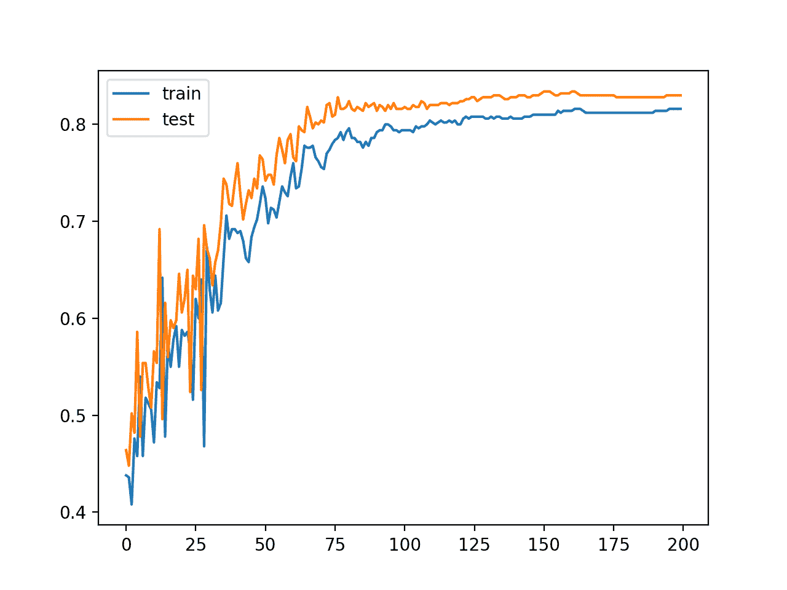
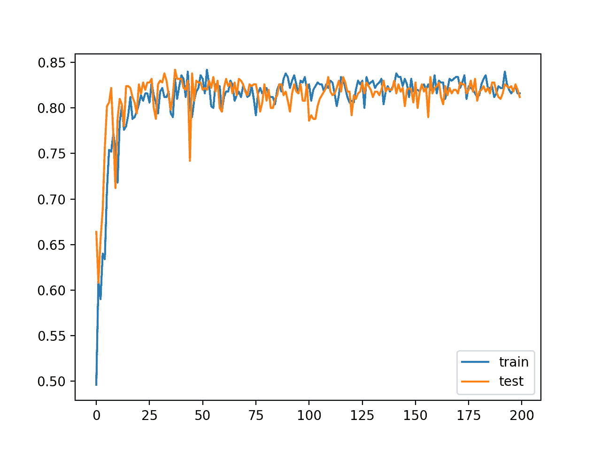
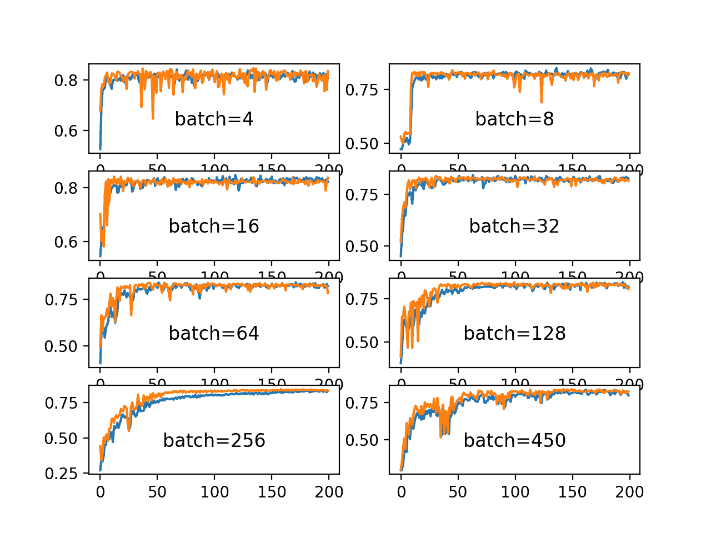

# 如何控制批量训练神经网络的稳定性

> 原文：<https://machinelearningmastery.com/how-to-control-the-speed-and-stability-of-training-neural-networks-with-gradient-descent-batch-size/>

最后更新于 2020 年 8 月 28 日

使用梯度下降来训练神经网络，其中基于训练数据集的子集来计算用于更新权重的误差估计。

误差梯度估计中使用的训练数据集中的样本数称为[批量](https://machinelearningmastery.com/difference-between-a-batch-and-an-epoch/)，是影响学习算法动态性的重要超参数。

探索模型的动态性是很重要的，以确保您能从中获得最大收益。

在本教程中，您将发现三种不同风格的梯度下降，以及如何探索和诊断批次大小对学习过程的影响。

完成本教程后，您将知道:

*   当训练神经网络时，批量控制误差梯度估计的精度。
*   批处理、随机和迷你批处理梯度下降是学习算法的三种主要风格。
*   批量大小与学习过程的速度和稳定性之间存在紧张关系。

**用我的新书[更好的深度学习](https://machinelearningmastery.com/better-deep-learning/)启动你的项目**，包括*分步教程*和所有示例的 *Python 源代码*文件。

我们开始吧。

*   **2019 年 10 月更新**:针对 Keras 2.3 和 TensorFlow 2.0 更新。
*   **2020 年 1 月更新**:针对 Sklearn v0.22 API 的变化进行了更新。


如何控制梯度下降批量训练神经网络的速度和稳定性[阿德里安·斯科托](https://www.flickr.com/photos/chodhound/34643497066/)摄，版权所有。

## 教程概述

本教程分为七个部分；它们是:

1.  批量和梯度下降
2.  喀拉斯的随机、批量和小批量梯度下降
3.  多类分类问题
4.  批量梯度下降的 MLP 拟合
5.  随机梯度下降的 MLP 拟合
6.  MLP 适合迷你批次梯度下降
7.  批量对模型行为的影响

## 批量和梯度下降

使用随机梯度下降优化算法训练神经网络。

这包括使用模型的当前状态进行预测，将预测与期望值进行比较，并将差值用作误差梯度的估计。该误差梯度然后被用于更新模型权重，并且该过程被重复。

误差梯度是一种统计估计。估计中使用的训练示例越多，该估计就越准确，网络的权重就越有可能以提高模型表现的方式进行调整。误差梯度的改进估计值的代价是，在计算估计值之前，必须使用模型进行更多的预测，进而更新权重。

> 使用整个训练集的优化算法被称为批量或确定性梯度方法，因为它们在大批量中同时处理所有训练示例。

—第 278 页，[深度学习](https://amzn.to/2NJW3gE)，2016。

或者，使用较少的示例会导致误差梯度的估计不太准确，这高度依赖于所使用的特定训练示例。

这导致了噪声估计，而噪声估计又导致模型权重的噪声更新，例如，许多更新可能具有非常不同的误差梯度估计。尽管如此，这些有噪声的更新可以导致更快的学习，有时会导致更健壮的模型。

> 一次只使用一个例子的优化算法有时被称为随机方法，有时被称为在线方法。“在线”一词通常用于从连续创建的示例流中提取示例的情况，而不是从固定大小的训练集中提取示例，在训练集中要进行多次遍历。

—第 278 页，[深度学习](https://amzn.to/2NJW3gE)，2016。

误差梯度估计中使用的训练示例的数量是学习算法的超参数，称为“*批次大小*，或简称为“*批次*

批量为 32 意味着在更新模型权重之前，将使用训练数据集中的 32 个样本来估计误差梯度。一个[训练时期](https://machinelearningmastery.com/difference-between-a-batch-and-an-epoch/)意味着学习算法已经一次通过训练数据集，其中示例被分成随机选择的“*批量*组。

历史上，将批量设置为训练示例总数的训练算法称为“*批量梯度下降*”，将批量设置为 1 个训练示例的训练算法称为“*随机梯度下降*或“*在线梯度下降*”

介于两者之间的批处理大小的配置(例如，多于 1 个示例且少于训练数据集中的示例数量)称为“*小批处理梯度下降*”

*   **批量梯度下降**。批处理大小设置为训练数据集中的示例总数。
*   **随机梯度下降**。批量设置为 1。
*   **迷你批次梯度下降**。批处理大小被设置为大于 1 且小于训练数据集中的示例总数。

简而言之，该算法通常被称为随机梯度下降，与批量大小无关。考虑到非常大的数据集通常用于训练深度学习神经网络，批量大小很少被设置为训练数据集的大小。

使用较小批量有两个主要原因:

*   较小的批次尺寸会产生噪声，从而提供正则化效果和较低的泛化误差。
*   较小的批处理大小使得在内存中容纳一批训练数据变得更容易(即使用图形处理器时)。

第三个原因是批量大小通常被设置为较小的值，例如 32 个例子，并且不是由从业者调整的。像 32 这样的小批量通常效果很好。

> …[批量大小]通常选择在 1 到几百之间，例如[批量大小] = 32 是一个很好的默认值

——[深度架构基于梯度训练的实用建议](https://arxiv.org/abs/1206.5533)，2012。

> 所呈现的结果证实，在广泛的实验中，对于给定的计算成本，使用小批量实现了最佳的训练稳定性和泛化表现。在所有情况下，批次大小 m = 32 或更小，通常小至 m = 2 或 m = 4，就能获得最佳结果。

——[重温深度神经网络小批量训练](https://arxiv.org/abs/1804.07612)，2018。

然而，批量大小影响模型学习的速度和学习过程的稳定性。这是一个重要的超参数，深度学习实践者应该很好地理解和调整它。

## 喀拉斯的随机、批量和小批量梯度下降

Keras 允许您使用随机、批量或小批量梯度下降来训练模型。

这可以通过在训练模型时调用 *fit()* 函数时设置 batch_size 参数来实现。

让我们依次看看每种方法。

### 喀拉斯随机梯度下降

下面的示例将随机梯度下降的 batch_size 参数设置为 1。

```py
...
model.fit(trainX, trainy, batch_size=1)
```

### 喀拉斯批量梯度下降

下面的示例将 batch_size 参数设置为批处理梯度下降训练数据集中的样本数。

```py
...
model.fit(trainX, trainy, batch_size=len(trainX))
```

### 喀拉斯的迷你批次梯度下降

以下示例对 *batch_size* 参数使用默认的批处理大小 32，对于随机梯度下降，该值大于 1，对于批处理梯度下降，该值小于训练数据集的大小。

```py
...
model.fit(trainX, trainy)
```

或者，可以将 batch_size 指定为 1 或训练数据集中的样本数之外的值，例如 64。

```py
...
model.fit(trainX, trainy, batch_size=64)
```

## 多类分类问题

我们将使用一个小的多类分类问题作为基础来演示批量大小对学习的影响。

Sklearn 类提供了 [make_blobs()函数](http://Sklearn.org/stable/modules/generated/sklearn.datasets.make_blobs.html)，该函数可用于创建具有规定数量的样本、输入变量、类和类内样本方差的多类分类问题。

该问题可以配置为具有两个输入变量(表示点的 *x* 和 *y* 坐标)和每组内点的标准偏差 2.0。我们将使用相同的随机状态(伪随机数发生器的种子)来确保我们总是获得相同的数据点。

```py
# generate 2d classification dataset
X, y = make_blobs(n_samples=1000, centers=3, n_features=2, cluster_std=2, random_state=2)
```

结果是我们可以建模的数据集的输入和输出元素。

为了了解问题的复杂性，我们可以在二维散点图上绘制每个点，并按类值给每个点着色。

下面列出了完整的示例。

```py
# scatter plot of blobs dataset
from sklearn.datasets import make_blobs
from matplotlib import pyplot
from numpy import where
# generate 2d classification dataset
X, y = make_blobs(n_samples=1000, centers=3, n_features=2, cluster_std=2, random_state=2)
# scatter plot for each class value
for class_value in range(3):
	# select indices of points with the class label
	row_ix = where(y == class_value)
	# scatter plot for points with a different color
	pyplot.scatter(X[row_ix, 0], X[row_ix, 1])
# show plot
pyplot.show()
```

运行该示例会创建整个数据集的散点图。我们可以看到，2.0 的标准偏差意味着类不是线性可分的(用一条线可分的)，导致了很多不明确的点。

这是可取的，因为这意味着问题不是微不足道的，并将允许神经网络模型找到许多不同的“T0”足够好的“T1”候选解决方案。


具有三个类和按类值着色的点的斑点数据集的散点图

## 批量梯度下降的 MLP 拟合

我们可以开发一个多层感知器模型(MLP)来解决前一节中描述的多类分类问题，并使用批处理梯度下降来训练它。

首先，我们需要对目标变量进行热编码，将整数类值转换为二进制向量。这将允许模型预测每个例子属于三个类别中的每一个的概率，在训练模型时在预测和上下文中提供更多的细微差别。

```py
# one hot encode output variable
y = to_categorical(y)
```

接下来，我们将把 1000 个例子的训练数据集分割成一个训练和测试数据集，每个数据集有 500 个例子。

这种均匀分割将允许我们评估和比较模型上不同批量配置的表现及其表现。

```py
# split into train and test
n_train = 500
trainX, testX = X[:n_train, :], X[n_train:, :]
trainy, testy = y[:n_train], y[n_train:]
```

对于数据集中的两个变量，我们将定义一个带有输入层的 MLP 模型，该模型需要两个输入变量。

该模型将有一个单一的 50 个节点的隐藏层和一个校正的线性激活函数和何随机权重初始化。最后，输出层有 3 个节点，以便对三个类和一个 softmax 激活函数进行预测。

```py
# define model
model = Sequential()
model.add(Dense(50, input_dim=2, activation='relu', kernel_initializer='he_uniform'))
model.add(Dense(3, activation='softmax'))
```

我们将使用随机梯度下降优化模型，并在训练过程中使用分类交叉熵来计算模型的误差。

在这个例子中，我们将使用“*批次梯度下降*，这意味着批次大小将被设置为训练数据集的大小。该模型将适用于 200 个训练时期，测试数据集将用作验证集，以便在训练期间监控模型在保持集上的表现。

效果将是权重更新之间的时间更长，并且我们期望比其他批量更快的训练，以及更稳定的梯度估计，这将导致模型在训练期间更稳定的表现。

```py
# compile model
opt = SGD(lr=0.01, momentum=0.9)
model.compile(loss='categorical_crossentropy', optimizer=opt, metrics=['accuracy'])
# fit model
history = model.fit(trainX, trainy, validation_data=(testX, testy), epochs=200, verbose=0, batch_size=len(trainX))
```

一旦模型合适，就在训练和测试数据集上评估和报告表现。

```py
# evaluate the model
_, train_acc = model.evaluate(trainX, trainy, verbose=0)
_, test_acc = model.evaluate(testX, testy, verbose=0)
print('Train: %.3f, Test: %.3f' % (train_acc, test_acc))
```

创建一个线图，显示每个训练时期模型的训练和测试集精度。

这些学习曲线提供了三个指标:模型学习问题的速度，学习问题的效果，以及在训练过程中模型更新的噪音。

```py
# plot training history
pyplot.plot(history.history['accuracy'], label='train')
pyplot.plot(history.history['val_accuracy'], label='test')
pyplot.legend()
pyplot.show()
```

将这些元素结合在一起，下面列出了完整的示例。

```py
# mlp for the blobs problem with batch gradient descent
from sklearn.datasets import make_blobs
from keras.layers import Dense
from keras.models import Sequential
from keras.optimizers import SGD
from keras.utils import to_categorical
from matplotlib import pyplot
# generate 2d classification dataset
X, y = make_blobs(n_samples=1000, centers=3, n_features=2, cluster_std=2, random_state=2)
# one hot encode output variable
y = to_categorical(y)
# split into train and test
n_train = 500
trainX, testX = X[:n_train, :], X[n_train:, :]
trainy, testy = y[:n_train], y[n_train:]
# define model
model = Sequential()
model.add(Dense(50, input_dim=2, activation='relu', kernel_initializer='he_uniform'))
model.add(Dense(3, activation='softmax'))
# compile model
opt = SGD(lr=0.01, momentum=0.9)
model.compile(loss='categorical_crossentropy', optimizer=opt, metrics=['accuracy'])
# fit model
history = model.fit(trainX, trainy, validation_data=(testX, testy), epochs=200, verbose=0, batch_size=len(trainX))
# evaluate the model
_, train_acc = model.evaluate(trainX, trainy, verbose=0)
_, test_acc = model.evaluate(testX, testy, verbose=0)
print('Train: %.3f, Test: %.3f' % (train_acc, test_acc))
# plot training history
pyplot.plot(history.history['accuracy'], label='train')
pyplot.plot(history.history['val_accuracy'], label='test')
pyplot.legend()
pyplot.show()
```

运行示例首先报告模型在列车和测试数据集上的表现。

**注**:考虑到算法或评估程序的随机性，或数值精度的差异，您的[结果可能会有所不同](https://machinelearningmastery.com/different-results-each-time-in-machine-learning/)。考虑运行该示例几次，并比较平均结果。

在这种情况下，我们可以看到训练集和测试集的表现相似，分别为 81%和 83%。

```py
Train: 0.816, Test: 0.830
```

创建列车(蓝色)和测试(橙色)数据集上模型分类精度的线图。我们可以看到，模型学习这个问题的速度相对较慢，大约 100 个时代后就收敛到一个解决方案上，之后模型表现的变化很小。



列车分类精度线图和批量梯度下降的 MLP 拟合检验集

## 随机梯度下降的 MLP 拟合

上一节中的批量梯度下降示例可以更新为使用随机梯度下降。

这需要将批处理大小从训练数据集的大小更改为 1。

```py
# fit model
history = model.fit(trainX, trainy, validation_data=(testX, testy), epochs=200, verbose=0, batch_size=1)
```

随机梯度下降要求模型进行预测，并为每个训练示例更新权重。与批量梯度下降相比，这具有显著减慢训练过程的效果。

这种变化的预期是模型学习得更快，并且模型的变化是有噪声的，这反过来导致训练时期的噪声表现。

下面列出了此更改的完整示例。

```py
# mlp for the blobs problem with stochastic gradient descent
from sklearn.datasets import make_blobs
from keras.layers import Dense
from keras.models import Sequential
from keras.optimizers import SGD
from keras.utils import to_categorical
from matplotlib import pyplot
# generate 2d classification dataset
X, y = make_blobs(n_samples=1000, centers=3, n_features=2, cluster_std=2, random_state=2)
# one hot encode output variable
y = to_categorical(y)
# split into train and test
n_train = 500
trainX, testX = X[:n_train, :], X[n_train:, :]
trainy, testy = y[:n_train], y[n_train:]
# define model
model = Sequential()
model.add(Dense(50, input_dim=2, activation='relu', kernel_initializer='he_uniform'))
model.add(Dense(3, activation='softmax'))
# compile model
opt = SGD(lr=0.01, momentum=0.9)
model.compile(loss='categorical_crossentropy', optimizer=opt, metrics=['accuracy'])
# fit model
history = model.fit(trainX, trainy, validation_data=(testX, testy), epochs=200, verbose=0, batch_size=1)
# evaluate the model
_, train_acc = model.evaluate(trainX, trainy, verbose=0)
_, test_acc = model.evaluate(testX, testy, verbose=0)
print('Train: %.3f, Test: %.3f' % (train_acc, test_acc))
# plot training history
pyplot.plot(history.history['accuracy'], label='train')
pyplot.plot(history.history['val_accuracy'], label='test')
pyplot.legend()
pyplot.show()
```

运行示例首先报告模型在列车和测试数据集上的表现。

**注**:考虑到算法或评估程序的随机性，或数值精度的差异，您的[结果可能会有所不同](https://machinelearningmastery.com/different-results-each-time-in-machine-learning/)。考虑运行该示例几次，并比较平均结果。

在这种情况下，我们可以看到训练集和测试集之间的表现是相似的，大约 60%的准确率，但是比使用批量梯度下降的表现差得多(大约 20 个百分点)。

至少对于这个问题和所选择的模型和模型配置，随机(在线)梯度下降是不合适的。

```py
Train: 0.612, Test: 0.606
```

创建列车(蓝色)和测试(橙色)数据集上模型分类精度的线图。

该图显示了所选配置的训练过程的不稳定性。表现不佳，模型变化剧烈，说明每次训练示例后用于更新权重的[学习速率](https://machinelearningmastery.com/learning-rate-for-deep-learning-neural-networks/)可能过大，较小的学习速率可能会使学习过程更加稳定。


列车分类精度线图及随机梯度下降 MLP 拟合检验集

我们可以通过用随机梯度下降和较小的学习率重新运行模型拟合来测试这一点。例如，我们可以将学习率降低一个数量级，从 0.01 到 0.001。

```py
# compile model
opt = SGD(lr=0.001, momentum=0.9)
model.compile(loss='categorical_crossentropy', optimizer=opt, metrics=['accuracy'])
```

为了完整起见，下面提供了包含此更改的完整代码列表。

```py
# mlp for the blobs problem with stochastic gradient descent
from sklearn.datasets import make_blobs
from keras.layers import Dense
from keras.models import Sequential
from keras.optimizers import SGD
from keras.utils import to_categorical
from matplotlib import pyplot
# generate 2d classification dataset
X, y = make_blobs(n_samples=1000, centers=3, n_features=2, cluster_std=2, random_state=2)
# one hot encode output variable
y = to_categorical(y)
# split into train and test
n_train = 500
trainX, testX = X[:n_train, :], X[n_train:, :]
trainy, testy = y[:n_train], y[n_train:]
# define model
model = Sequential()
model.add(Dense(50, input_dim=2, activation='relu', kernel_initializer='he_uniform'))
model.add(Dense(3, activation='softmax'))
# compile model
opt = SGD(lr=0.001, momentum=0.9)
model.compile(loss='categorical_crossentropy', optimizer=opt, metrics=['accuracy'])
# fit model
history = model.fit(trainX, trainy, validation_data=(testX, testy), epochs=200, verbose=0, batch_size=1)
# evaluate the model
_, train_acc = model.evaluate(trainX, trainy, verbose=0)
_, test_acc = model.evaluate(testX, testy, verbose=0)
print('Train: %.3f, Test: %.3f' % (train_acc, test_acc))
# plot training history
pyplot.plot(history.history['accuracy'], label='train')
pyplot.plot(history.history['val_accuracy'], label='test')
pyplot.legend()
pyplot.show()
```

运行这个例子讲述了一个非常不同的故事。

**注**:考虑到算法或评估程序的随机性，或数值精度的差异，您的[结果可能会有所不同](https://machinelearningmastery.com/different-results-each-time-in-machine-learning/)。考虑运行该示例几次，并比较平均结果。

报告的表现大大提高，在列车和测试集上实现了与使用批量梯度下降的拟合相当的分类精度。

```py
Train: 0.816, Test: 0.824
```

线形图显示了预期的行为。也就是说，与分批梯度下降相比，该模型快速学习问题，在大约 25 个时期内跳跃到大约 80%的精度，而不是使用分批梯度下降时看到的 100 个时期。由于训练速度更快，我们本可以在第 50 期而不是第 200 期停止训练。

这并不奇怪。使用批量梯度下降，100 个时期涉及 100 个误差估计和 100 个权重更新。在随机梯度下降中，涉及 25 个时期(500 * 25)或 12，500 个权重更新，为如何改进模型提供了超过 10 倍的反馈，尽管反馈噪声更大。

线图还显示，与批次梯度下降的动力学相比，训练和测试表现在训练期间保持相当，批次梯度下降的动力学在测试集上的表现稍好，并且在整个训练期间保持相当。

与批量梯度下降不同，我们可以看到，在整个训练期间，有噪声的更新会导致有噪声的表现。模型中的这种差异意味着，选择哪种模型作为最终模型可能具有挑战性，这与批量梯度下降相反，在批量梯度下降中，表现是稳定的，因为模型已经收敛。


列车上分类精度的线图和具有随机梯度下降和较小学习率的 MLP 拟合的测试集

这个例子强调了批量和学习率之间的重要关系。也就是说，对模型的噪声更大的更新需要更小的学习速率，而噪声更小的误差梯度的更精确的估计可以更自由地应用于模型。我们可以总结如下:

*   **批量梯度下降**:使用相对较大的学习速率和较多的训练时期。
*   **随机梯度下降**:使用相对较小的学习速率和较少的训练时期。

小批量梯度下降提供了一种替代方法。

## MLP 适合迷你批次梯度下降

使用随机梯度下降和调整学习速率的另一种方法是保持学习速率不变并改变批量大小。

实际上，这意味着我们指定每次估计误差梯度时应用于权重的学习速率或变化量，但根据用于估计的样本数量来改变梯度的精度。

将学习率保持在 0.01，就像我们使用批处理梯度下降一样，我们可以将批处理大小设置为 32，这是一个广泛采用的默认批处理大小。

```py
# fit model
history = model.fit(trainX, trainy, validation_data=(testX, testy), epochs=200, verbose=0, batch_size=32)
```

我们期望以更大的学习率获得随机梯度下降的一些好处。

下面列出了这种修改的完整示例。

```py
# mlp for the blobs problem with minibatch gradient descent
from sklearn.datasets import make_blobs
from keras.layers import Dense
from keras.models import Sequential
from keras.optimizers import SGD
from keras.utils import to_categorical
from matplotlib import pyplot
# generate 2d classification dataset
X, y = make_blobs(n_samples=1000, centers=3, n_features=2, cluster_std=2, random_state=2)
# one hot encode output variable
y = to_categorical(y)
# split into train and test
n_train = 500
trainX, testX = X[:n_train, :], X[n_train:, :]
trainy, testy = y[:n_train], y[n_train:]
# define model
model = Sequential()
model.add(Dense(50, input_dim=2, activation='relu', kernel_initializer='he_uniform'))
model.add(Dense(3, activation='softmax'))
# compile model
opt = SGD(lr=0.01, momentum=0.9)
model.compile(loss='categorical_crossentropy', optimizer=opt, metrics=['accuracy'])
# fit model
history = model.fit(trainX, trainy, validation_data=(testX, testy), epochs=200, verbose=0, batch_size=32)
# evaluate the model
_, train_acc = model.evaluate(trainX, trainy, verbose=0)
_, test_acc = model.evaluate(testX, testy, verbose=0)
print('Train: %.3f, Test: %.3f' % (train_acc, test_acc))
# plot training history
pyplot.plot(history.history['accuracy'], label='train')
pyplot.plot(history.history['val_accuracy'], label='test')
pyplot.legend()
pyplot.show()
```

**注**:考虑到算法或评估程序的随机性，或数值精度的差异，您的[结果可能会有所不同](https://machinelearningmastery.com/different-results-each-time-in-machine-learning/)。考虑运行该示例几次，并比较平均结果。

运行该示例在训练集和测试集上都报告了相似的表现，在我们降低学习率之后，可以与批处理梯度下降和随机梯度下降相媲美。

```py
Train: 0.832, Test: 0.812
```

线形图显示了随机和分批梯度下降的动力学。具体来说，该模型学习速度快，有噪声更新，但在接近运行结束时更稳定，比随机梯度下降更稳定。

保持学习速率不变并改变批量大小，可以让您在两种方法中选择最佳方法。



列车分类精度线图和具有小批量梯度下降的 MLP 拟合测试集

## 批量对模型行为的影响

我们可以用不同的批次大小重新调整模型，并回顾批次大小的变化对学习速度、学习过程中的稳定性以及最终结果的影响。

首先，我们可以清理代码并创建一个函数来准备数据集。

```py
# prepare train and test dataset
def prepare_data():
	# generate 2d classification dataset
	X, y = make_blobs(n_samples=1000, centers=3, n_features=2, cluster_std=2, random_state=2)
	# one hot encode output variable
	y = to_categorical(y)
	# split into train and test
	n_train = 500
	trainX, testX = X[:n_train, :], X[n_train:, :]
	trainy, testy = y[:n_train], y[n_train:]
	return trainX, trainy, testX, testy
```

接下来，我们可以创建一个函数来拟合给定批量的问题模型，并在训练和测试数据集上绘制分类精度的学习曲线。

```py
# fit a model and plot learning curve
def fit_model(trainX, trainy, testX, testy, n_batch):
	# define model
	model = Sequential()
	model.add(Dense(50, input_dim=2, activation='relu', kernel_initializer='he_uniform'))
	model.add(Dense(3, activation='softmax'))
	# compile model
	opt = SGD(lr=0.01, momentum=0.9)
	model.compile(loss='categorical_crossentropy', optimizer=opt, metrics=['accuracy'])
	# fit model
	history = model.fit(trainX, trainy, validation_data=(testX, testy), epochs=200, verbose=0, batch_size=n_batch)
	# plot learning curves
	pyplot.plot(history.history['accuracy'], label='train')
	pyplot.plot(history.history['val_accuracy'], label='test')
	pyplot.title('batch='+str(n_batch), pad=-40)
```

最后，我们可以用一组不同的批处理大小来评估模型行为，同时保持模型的其他一切不变，包括学习速率。

```py
# prepare dataset
trainX, trainy, testX, testy = prepare_data()
# create learning curves for different batch sizes
batch_sizes = [4, 8, 16, 32, 64, 128, 256, 450]
for i in range(len(batch_sizes)):
	# determine the plot number
	plot_no = 420 + (i+1)
	pyplot.subplot(plot_no)
	# fit model and plot learning curves for a batch size
	fit_model(trainX, trainy, testX, testy, batch_sizes[i])
# show learning curves
pyplot.show()
```

结果将是一个具有八个不同批次大小的八个模型行为图的图形。

将这些联系在一起，完整的示例如下所示。

```py
# mlp for the blobs problem with minibatch gradient descent with varied batch size
from sklearn.datasets import make_blobs
from keras.layers import Dense
from keras.models import Sequential
from keras.optimizers import SGD
from keras.utils import to_categorical
from matplotlib import pyplot

# prepare train and test dataset
def prepare_data():
	# generate 2d classification dataset
	X, y = make_blobs(n_samples=1000, centers=3, n_features=2, cluster_std=2, random_state=2)
	# one hot encode output variable
	y = to_categorical(y)
	# split into train and test
	n_train = 500
	trainX, testX = X[:n_train, :], X[n_train:, :]
	trainy, testy = y[:n_train], y[n_train:]
	return trainX, trainy, testX, testy

# fit a model and plot learning curve
def fit_model(trainX, trainy, testX, testy, n_batch):
	# define model
	model = Sequential()
	model.add(Dense(50, input_dim=2, activation='relu', kernel_initializer='he_uniform'))
	model.add(Dense(3, activation='softmax'))
	# compile model
	opt = SGD(lr=0.01, momentum=0.9)
	model.compile(loss='categorical_crossentropy', optimizer=opt, metrics=['accuracy'])
	# fit model
	history = model.fit(trainX, trainy, validation_data=(testX, testy), epochs=200, verbose=0, batch_size=n_batch)
	# plot learning curves
	pyplot.plot(history.history['accuracy'], label='train')
	pyplot.plot(history.history['val_accuracy'], label='test')
	pyplot.title('batch='+str(n_batch), pad=-40)

# prepare dataset
trainX, trainy, testX, testy = prepare_data()
# create learning curves for different batch sizes
batch_sizes = [4, 8, 16, 32, 64, 128, 256, 450]
for i in range(len(batch_sizes)):
	# determine the plot number
	plot_no = 420 + (i+1)
	pyplot.subplot(plot_no)
	# fit model and plot learning curves for a batch size
	fit_model(trainX, trainy, testX, testy, batch_sizes[i])
# show learning curves
pyplot.show()
```

运行该示例创建了一个带有八条线图的图形，显示了使用小批量梯度下降时列车和不同批量模型测试集的分类精度。

**注**:考虑到算法或评估程序的随机性，或数值精度的差异，您的[结果可能会有所不同](https://machinelearningmastery.com/different-results-each-time-in-machine-learning/)。考虑运行该示例几次，并比较平均结果。

这些图显示，小批量通常导致快速学习，但学习过程不稳定，分类精度差异较大。较大的批量会减慢学习过程，但最终阶段会收敛到更稳定的模型，例如分类精度的较低方差。



不同批量的训练和测试数据集上分类精度的线图

## 进一步阅读

如果您想更深入地了解这个主题，本节将提供更多资源。

### 邮件

*   [小批量梯度下降和如何配置批量](https://machinelearningmastery.com/gentle-introduction-mini-batch-gradient-descent-configure-batch-size/)的温和介绍

### 报纸

*   [重温深度神经网络小批量训练](https://arxiv.org/abs/1804.07612)，2018。
*   [深度架构基于梯度训练的实用建议](https://arxiv.org/abs/1206.5533)，2012。

### 书

*   8.1.3 批量和小批量算法，[深度学习](https://amzn.to/2NJW3gE)，2016。

### 文章

*   [随机梯度下降，维基百科](https://en.wikipedia.org/wiki/Stochastic_gradient_descent)。

## 摘要

在本教程中，您发现了三种不同风格的梯度下降，以及如何探索和诊断批次大小对学习过程的影响。

具体来说，您了解到:

*   当训练神经网络时，批量控制误差梯度估计的精度。
*   批处理、随机和迷你批处理梯度下降是学习算法的三种主要风格。
*   批量大小与学习过程的速度和稳定性之间存在紧张关系。

你有什么问题吗？
在下面的评论中提问，我会尽力回答。