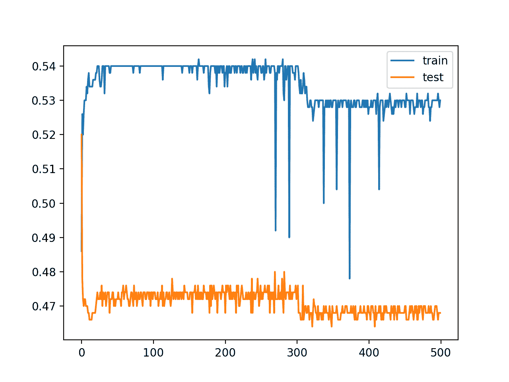
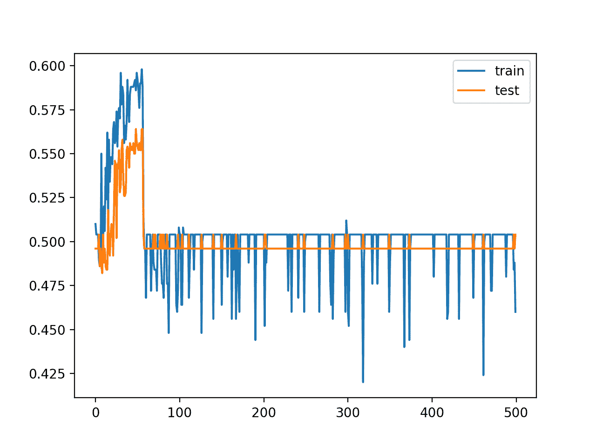
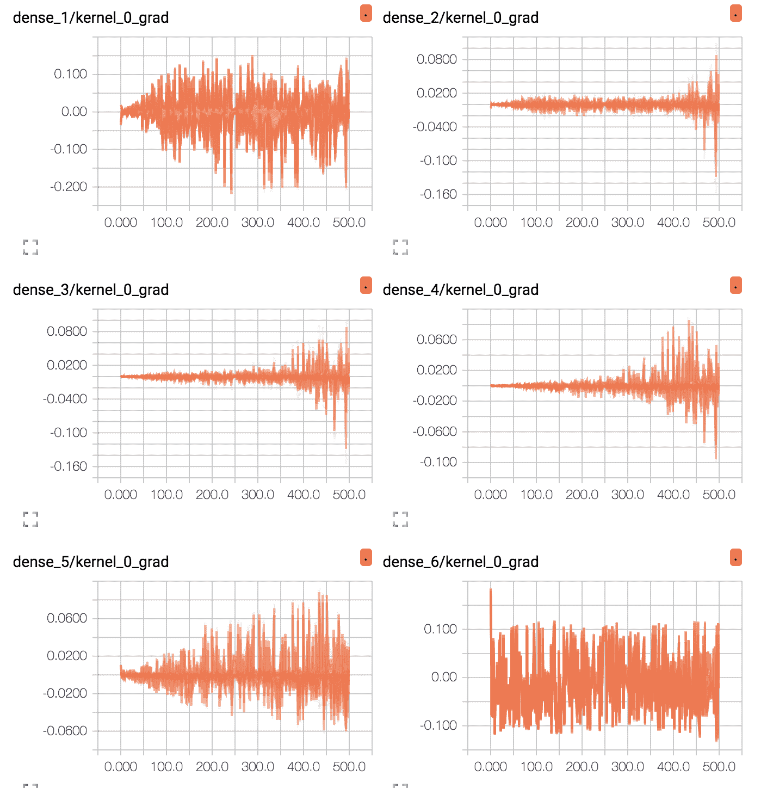
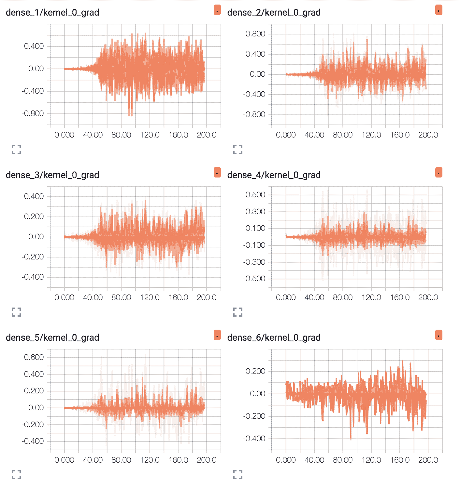
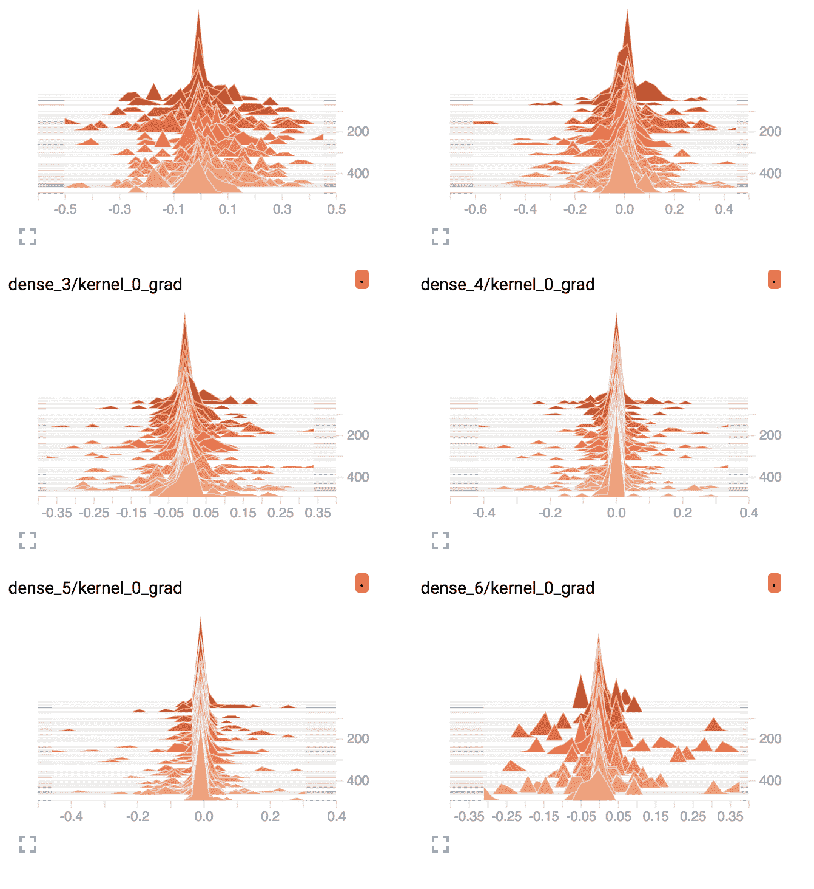

# 如何使用 ReLU

修复渐变消失问题

> 原文:[https://machinelearning master . com/如何使用校正线性激活函数修复消失梯度/](https://machinelearningmastery.com/how-to-fix-vanishing-gradients-using-the-rectified-linear-activation-function/)

最后更新于 2020 年 8 月 25 日

消失梯度问题是训练深度神经网络时可能遇到的不稳定行为的一个例子。

它描述了深层多层前馈网络或递归神经网络无法将有用的梯度信息从模型的输出端传播回模型输入端附近的层的情况。

结果是具有许多层的模型通常无法在给定的数据集上学习，或者具有许多层的模型过早地收敛到一个糟糕的解决方案。

已经提出并研究了许多修复和解决方法，例如替代权重初始化方案、无监督预训练、[分层训练](https://machinelearningmastery.com/greedy-layer-wise-pretraining-tutorial/)以及梯度下降的变化。或许最常见的变化是使用了[修正线性激活函数](https://machinelearningmastery.com/rectified-linear-activation-function-for-deep-learning-neural-networks/)，该函数已成为新的默认函数，而不是上世纪 90 年代末和 2000 年代默认的双曲正切激活函数。

在本教程中，您将发现如何在训练神经网络模型时诊断消失梯度问题，以及如何使用替代激活函数和权重初始化方案来修复它。

完成本教程后，您将知道:

*   消失梯度问题限制了具有经典流行的激活函数(如双曲正切)的深度神经网络的发展。
*   如何使用 ReLU 和 He 权重初始化来固定用于分类的深度神经网络多层感知器。
*   如何使用 TensorBoard 诊断一个消失的梯度问题，并确认 ReLU 的影响，以改善通过模型的梯度流。

**用我的新书[更好的深度学习](https://machinelearningmastery.com/better-deep-learning/)启动你的项目**，包括*分步教程*和所有示例的 *Python 源代码*文件。

我们开始吧。

*   **2019 年 10 月更新**:针对 Keras 2.3 和 TensorFlow 2.0 更新。


如何使用校正的线性激活功能来修复消失的渐变
图片由[利亚姆·莫洛尼](https://www.flickr.com/photos/tir_na_nog/2930119078/)提供，版权所有。

## 教程概述

本教程分为五个部分；它们是:

1.  消失梯度问题
2.  两个圆的二元分类问题
3.  两个圆问题的多层感知器模型
4.  两个圆问题的 ReLU 深 MLP 模型
5.  查看培训期间的平均梯度大小

## 消失梯度问题

使用随机梯度下降来训练神经网络。

这包括首先计算模型产生的预测误差，并使用该误差来估计用于更新网络中每个权重的梯度，以便下次产生较小的误差。这种误差梯度通过网络从输出层向后传播到输入层。

期望训练具有许多层的神经网络，因为更多层的增加增加了网络的容量，使其能够学习大的训练数据集，并有效地表示从输入到输出的更复杂的映射函数。

具有许多层的训练网络(例如深度神经网络)的一个问题是，当梯度通过网络向后传播时，梯度急剧减小。当误差到达接近模型输入的层时，误差可能非常小，以至于影响很小。因此，这个问题被称为“*消失渐变*”问题。

> 消失梯度使得很难知道参数应该向哪个方向移动来改善成本函数…

—第 290 页，[深度学习](https://amzn.to/2RP7GW2)，2016。

事实上，误差梯度在深度神经网络中可能是不稳定的，不仅会消失，还会爆炸，其中梯度随着它在网络中向后传播而呈指数级增加。这被称为“[爆炸渐变](https://machinelearningmastery.com/exploding-gradients-in-neural-networks/)”问题。

> 术语消失梯度指的是这样一个事实，即在前馈网络(FFN)中，反向传播的误差信号通常作为距最终层的距离的函数而指数地减小(或增大)。

——[训练超深前馈网络的随机游走初始化](https://arxiv.org/abs/1412.6558)，2014。

消失梯度是递归神经网络的一个特殊问题，因为网络的更新包括为每个输入时间步长展开网络，实际上创建了一个需要权重更新的非常深的网络。一个适度的递归神经网络可能有 200 到 400 个输入时间步长，在概念上形成一个非常深的网络。

在多层感知器中，消失梯度问题可以通过训练期间模型的缓慢改进速率以及可能的过早收敛来表现，例如，持续训练不会导致任何进一步的改进。检查训练期间权重的变化，我们会看到更靠近输出层的层中发生更多的变化(即更多的学习)，而靠近输入层的层中发生更少的变化。

有许多技术可以用来降低前馈神经网络的消失梯度问题的影响，最显著的是交替权重初始化方案和交替激活函数的使用。

> 已经研究并应用了训练深度网络(前馈和递归)的不同方法[以努力解决消失梯度]，例如预训练、更好的随机初始缩放、更好的优化方法、特定架构、正交初始化等。

——[训练超深前馈网络的随机游走初始化](https://arxiv.org/abs/1412.6558)，2014。

在本教程中，我们将仔细研究替代权重初始化方案和激活函数的使用，以允许更深层次的神经网络模型的训练。

## 两个圆的二元分类问题

作为我们探索的基础，我们将使用一个非常简单的两类或二元分类问题。

scikit-learn 类提供了 [make_circles()函数](http://scikit-learn.org/stable/modules/generated/sklearn.datasets.make_circles.html)，该函数可用于创建具有规定样本数和统计噪声的二进制分类问题。

每个示例都有两个输入变量，用于定义点在二维平面上的 *x* 和 *y* 坐标。这两个类的点排列成两个同心圆(它们有相同的中心)。

数据集中的点数由参数指定，其中一半将从每个圆中绘制。通过定义噪声标准偏差的“*噪声*”参数对点进行采样时，可以添加高斯噪声，其中 0.0 表示没有噪声或从圆圈中精确绘制的点。伪随机数发生器的种子可以通过“ *random_state* ”参数指定，该参数允许每次调用函数时对完全相同的点进行采样。

下面的示例从两个带有噪声且值为 1 的圆生成 1，000 个示例来播种伪随机数发生器。

```py
# generate circles
X, y = make_circles(n_samples=1000, noise=0.1, random_state=1)
```

我们可以创建数据集的图形，绘制输入变量( *X* )的 *x* 和 *y* 坐标，并用类值(0 或 1)给每个点着色。

下面列出了完整的示例。

```py
# scatter plot of the circles dataset with points colored by class
from sklearn.datasets import make_circles
from numpy import where
from matplotlib import pyplot
# generate circles
X, y = make_circles(n_samples=1000, noise=0.1, random_state=1)
# select indices of points with each class label
for i in range(2):
	samples_ix = where(y == i)
	pyplot.scatter(X[samples_ix, 0], X[samples_ix, 1], label=str(i))
pyplot.legend()
pyplot.show()
```

运行该示例会创建一个图，显示 1，000 个生成的数据点以及用于给每个点着色的每个点的类值。

我们可以看到 0 类的点是蓝色的，代表外圆，1 类的点是橙色的，代表内圆。

生成样本的统计噪声意味着两个圆之间有一些点的重叠，给问题增加了一些模糊性，使其变得不平凡。这是所希望的，因为神经网络可以从许多可能的解决方案中选择一个来分类两个圆之间的点，并且总是产生一些误差。


点按类值着色的圆形数据集散点图

既然我们已经定义了一个问题作为我们探索的基础，我们可以考虑开发一个模型来解决它。

## 两个圆问题的多层感知器模型

我们可以开发一个多层感知器模型来解决两个圆的问题。

这将是一个简单的前馈神经网络模型，是按照我们在 20 世纪 90 年代末和 21 世纪初被教导的那样设计的。

首先，我们将从两个圆的问题中生成 1000 个数据点，并将输入重新缩放到范围[-1，1]。数据几乎已经在这个范围内，但我们会确保。

通常，我们会使用训练数据集准备数据缩放，并将其应用于测试数据集。为了在本教程中保持简单，我们将在将数据分割成训练集和测试集之前，将所有数据一起缩放。

```py
# generate 2d classification dataset
X, y = make_circles(n_samples=1000, noise=0.1, random_state=1)
# scale input data to [-1,1]
scaler = MinMaxScaler(feature_range=(-1, 1))
X = scaler.fit_transform(X)
```

接下来，我们将把数据分成训练集和测试集。

一半的数据将用于训练，剩下的 500 个例子将用作测试集。在本教程中，测试集也将作为验证数据集，因此我们可以了解模型在训练期间如何在保持集上执行。

```py
# split into train and test
n_train = 500
trainX, testX = X[:n_train, :], X[n_train:, :]
trainy, testy = y[:n_train], y[n_train:]
```

接下来，我们将定义模型。

对于数据集中的两个变量，该模型将有一个带有两个输入的输入层，一个带有五个节点的隐藏层，以及一个带有一个节点的输出层，用于预测类概率。隐藏层将使用双曲正切激活函数(tanh)，输出层将使用逻辑激活函数(sigmoid)来预测 0 类或 1 类或介于两者之间的东西。

在隐藏层中使用双曲正切激活函数是 20 世纪 90 年代和 2000 年代的最佳实践，当在隐藏层中使用时，其性能通常优于逻辑函数。将网络权重从均匀分布初始化为小的随机值也是一种好的做法。这里，我们将从范围[0.0，1.0]中随机初始化权重。

```py
# define model
model = Sequential()
init = RandomUniform(minval=0, maxval=1)
model.add(Dense(5, input_dim=2, activation='tanh', kernel_initializer=init))
model.add(Dense(1, activation='sigmoid', kernel_initializer=init))
```

该模型使用二元交叉熵损失函数，并使用随机梯度下降进行优化，学习率为 0.01，大动量为 0.9。

```py
# compile model
opt = SGD(lr=0.01, momentum=0.9)
model.compile(loss='binary_crossentropy', optimizer=opt, metrics=['accuracy'])
```

该模型针对 500 个训练时期进行训练，并且在每个时期结束时与训练数据集一起评估测试数据集。

```py
# fit model
history = model.fit(trainX, trainy, validation_data=(testX, testy), epochs=500, verbose=0)
```

模型拟合后，在训练和测试数据集上对其进行评估，并显示准确度分数。

```py
# evaluate the model
_, train_acc = model.evaluate(trainX, trainy, verbose=0)
_, test_acc = model.evaluate(testX, testy, verbose=0)
print('Train: %.3f, Test: %.3f' % (train_acc, test_acc))
```

最后，模型在每一步训练中的准确性被绘制成线图，显示了模型在学习问题时的动态。

```py
# plot training history
pyplot.plot(history.history['accuracy'], label='train')
pyplot.plot(history.history['val_accuracy'], label='test')
pyplot.legend()
pyplot.show()
```

将所有这些结合在一起，下面列出了完整的示例。

```py
# mlp for the two circles classification problem
from sklearn.datasets import make_circles
from sklearn.preprocessing import MinMaxScaler
from keras.layers import Dense
from keras.models import Sequential
from keras.optimizers import SGD
from keras.initializers import RandomUniform
from matplotlib import pyplot
# generate 2d classification dataset
X, y = make_circles(n_samples=1000, noise=0.1, random_state=1)
# scale input data to [-1,1]
scaler = MinMaxScaler(feature_range=(-1, 1))
X = scaler.fit_transform(X)
# split into train and test
n_train = 500
trainX, testX = X[:n_train, :], X[n_train:, :]
trainy, testy = y[:n_train], y[n_train:]
# define model
model = Sequential()
init = RandomUniform(minval=0, maxval=1)
model.add(Dense(5, input_dim=2, activation='tanh', kernel_initializer=init))
model.add(Dense(1, activation='sigmoid', kernel_initializer=init))
# compile model
opt = SGD(lr=0.01, momentum=0.9)
model.compile(loss='binary_crossentropy', optimizer=opt, metrics=['accuracy'])
# fit model
history = model.fit(trainX, trainy, validation_data=(testX, testy), epochs=500, verbose=0)
# evaluate the model
_, train_acc = model.evaluate(trainX, trainy, verbose=0)
_, test_acc = model.evaluate(testX, testy, verbose=0)
print('Train: %.3f, Test: %.3f' % (train_acc, test_acc))
# plot training history
pyplot.plot(history.history['accuracy'], label='train')
pyplot.plot(history.history['val_accuracy'], label='test')
pyplot.legend()
pyplot.show()
```

运行该示例只需几秒钟就能适应模型。

**注**:考虑到算法或评估程序的随机性，或数值精度的差异，您的[结果可能会有所不同](https://machinelearningmastery.com/different-results-each-time-in-machine-learning/)。考虑运行该示例几次，并比较平均结果。

我们可以看到，在这种情况下，模型很好地学习了问题，在训练数据集和测试数据集上都达到了大约 81.6%的准确率。

```py
Train: 0.816, Test: 0.816
```

创建了列车和测试集上模型精度的线图，显示了所有 500 个训练时期的性能变化。

该图表明，对于本次运行，列车和测试集的性能在 epoch 300 附近以大约 80%的精度开始下降。


MLP 在两个圆问题中训练和测试集精度在训练时期的线图

既然我们已经看到了如何使用 tanh 激活函数来开发一个经典的 MLP 来解决两个圆的问题，我们可以考虑修改模型，使其具有更多的隐藏层。

## 两个圆问题的更深 MLP 模型

传统上，开发深度多层感知器模型具有挑战性。

使用双曲正切激活函数的深度模型不容易训练，这种糟糕的性能大部分归咎于消失梯度问题。

我们可以尝试使用上一节中开发的 MLP 模型对此进行研究。

隐藏层数可以从 1 层增加到 5 层；例如:

```py
# define model
init = RandomUniform(minval=0, maxval=1)
model = Sequential()
model.add(Dense(5, input_dim=2, activation='tanh', kernel_initializer=init))
model.add(Dense(5, activation='tanh', kernel_initializer=init))
model.add(Dense(5, activation='tanh', kernel_initializer=init))
model.add(Dense(5, activation='tanh', kernel_initializer=init))
model.add(Dense(5, activation='tanh', kernel_initializer=init))
model.add(Dense(1, activation='sigmoid', kernel_initializer=init))
```

然后，我们可以重新运行该示例并查看结果。

下面列出了更深的 MLP 的完整例子。

```py
# deeper mlp for the two circles classification problem
from sklearn.datasets import make_circles
from sklearn.preprocessing import MinMaxScaler
from keras.layers import Dense
from keras.models import Sequential
from keras.optimizers import SGD
from keras.initializers import RandomUniform
from matplotlib import pyplot
# generate 2d classification dataset
X, y = make_circles(n_samples=1000, noise=0.1, random_state=1)
scaler = MinMaxScaler(feature_range=(-1, 1))
X = scaler.fit_transform(X)
# split into train and test
n_train = 500
trainX, testX = X[:n_train, :], X[n_train:, :]
trainy, testy = y[:n_train], y[n_train:]
# define model
init = RandomUniform(minval=0, maxval=1)
model = Sequential()
model.add(Dense(5, input_dim=2, activation='tanh', kernel_initializer=init))
model.add(Dense(5, activation='tanh', kernel_initializer=init))
model.add(Dense(5, activation='tanh', kernel_initializer=init))
model.add(Dense(5, activation='tanh', kernel_initializer=init))
model.add(Dense(5, activation='tanh', kernel_initializer=init))
model.add(Dense(1, activation='sigmoid', kernel_initializer=init))
# compile model
opt = SGD(lr=0.01, momentum=0.9)
model.compile(loss='binary_crossentropy', optimizer=opt, metrics=['accuracy'])
# fit model
history = model.fit(trainX, trainy, validation_data=(testX, testy), epochs=500, verbose=0)
# evaluate the model
_, train_acc = model.evaluate(trainX, trainy, verbose=0)
_, test_acc = model.evaluate(testX, testy, verbose=0)
print('Train: %.3f, Test: %.3f' % (train_acc, test_acc))
# plot training history
pyplot.plot(history.history['accuracy'], label='train')
pyplot.plot(history.history['val_accuracy'], label='test')
pyplot.legend()
pyplot.show()
```

运行该示例首先打印拟合模型在训练和测试数据集上的性能。

**注**:考虑到算法或评估程序的随机性，或数值精度的差异，您的[结果可能会有所不同](https://machinelearningmastery.com/different-results-each-time-in-machine-learning/)。考虑运行该示例几次，并比较平均结果。

在这种情况下，我们可以看到，在达到大约 50%准确率的训练集和测试集上，性能都很差。这表明所配置的模型不能了解问题，也不能概括解决方案。

```py
Train: 0.530, Test: 0.468
```

列车上模型精度的线图和训练期间的测试集讲述了类似的故事。我们可以看到表现很糟糕，实际上随着训练的进行会变得更糟。



两个圆问题中深 MLP 超训练时段的训练和测试集精度的线图

## 两个圆问题的 ReLU 深 MLP 模型

在开发多层感知器网络以及其他网络类型(如中枢神经系统)时，修正后的线性激活函数取代了双曲正切激活函数，成为新的首选默认值。

这是因为激活函数看起来和行为都像一个线性函数，使得它更容易训练，更不容易饱和，但实际上是一个非线性函数，迫使负输入值为 0。当训练更深的模型时，它被认为是解决消失梯度问题的一种可能方法。

使用[整流线性激活函数(或简称 ReLU)](https://machinelearningmastery.com/rectified-linear-activation-function-for-deep-learning-neural-networks/)时，最好使用 he 权重初始化方案。我们可以使用 ReLU 和何初始化定义的五个隐藏层，如下所示。

```py
# define model
model = Sequential()
model.add(Dense(5, input_dim=2, activation='relu', kernel_initializer='he_uniform'))
model.add(Dense(5, activation='relu', kernel_initializer='he_uniform'))
model.add(Dense(5, activation='relu', kernel_initializer='he_uniform'))
model.add(Dense(5, activation='relu', kernel_initializer='he_uniform'))
model.add(Dense(5, activation='relu', kernel_initializer='he_uniform'))
model.add(Dense(1, activation='sigmoid'))
```

将这些结合在一起，下面列出了完整的代码示例。

```py
# deeper mlp with relu for the two circles classification problem
from sklearn.datasets import make_circles
from sklearn.preprocessing import MinMaxScaler
from keras.layers import Dense
from keras.models import Sequential
from keras.optimizers import SGD
from keras.initializers import RandomUniform
from matplotlib import pyplot
# generate 2d classification dataset
X, y = make_circles(n_samples=1000, noise=0.1, random_state=1)
scaler = MinMaxScaler(feature_range=(-1, 1))
X = scaler.fit_transform(X)
# split into train and test
n_train = 500
trainX, testX = X[:n_train, :], X[n_train:, :]
trainy, testy = y[:n_train], y[n_train:]
# define model
model = Sequential()
model.add(Dense(5, input_dim=2, activation='relu', kernel_initializer='he_uniform'))
model.add(Dense(5, activation='relu', kernel_initializer='he_uniform'))
model.add(Dense(5, activation='relu', kernel_initializer='he_uniform'))
model.add(Dense(5, activation='relu', kernel_initializer='he_uniform'))
model.add(Dense(5, activation='relu', kernel_initializer='he_uniform'))
model.add(Dense(1, activation='sigmoid'))
# compile model
opt = SGD(lr=0.01, momentum=0.9)
model.compile(loss='binary_crossentropy', optimizer=opt, metrics=['accuracy'])
# fit model
history = model.fit(trainX, trainy, validation_data=(testX, testy), epochs=500, verbose=0)
# evaluate the model
_, train_acc = model.evaluate(trainX, trainy, verbose=0)
_, test_acc = model.evaluate(testX, testy, verbose=0)
print('Train: %.3f, Test: %.3f' % (train_acc, test_acc))
# plot training history
pyplot.plot(history.history['accuracy'], label='train')
pyplot.plot(history.history['val_accuracy'], label='test')
pyplot.legend()
pyplot.show()
```

运行该示例将打印模型在列车和测试数据集上的性能。

**注**:考虑到算法或评估程序的随机性，或数值精度的差异，您的[结果可能会有所不同](https://machinelearningmastery.com/different-results-each-time-in-machine-learning/)。考虑运行该示例几次，并比较平均结果。

在这种情况下，我们可以看到，这一小小的改变已经允许模型学习问题，在两个数据集上实现了大约 84%的准确率，优于使用 tanh 激活函数的单层模型。

```py
Train: 0.836, Test: 0.840
```

还创建了列车上的模型精度和训练时期的测试集的线图。这个情节显示了与我们目前所看到的截然不同的动态。

这个模型似乎很快就学会了这个问题，并在大约 100 个时代内达成了一个解决方案。


用两个圆问题中的 ReLU 对深 MLP 进行超训练时的训练和测试集精度的线图

ReLU 激活函数的使用使我们能够为这个简单的问题拟合一个更深层次的模型，但是这种能力不会无限扩展。例如，增加层数会导致学习速度变慢，达到大约 20 层时，模型不再能够学习问题，至少在所选的配置下是如此。

例如，下面是具有 15 个隐藏层的同一模型的训练和测试精度的线图，表明它仍然能够学习问题。


带 15 个隐层的 ReLU 深 MLP 训练和超训练时段测试集精度线图

下面是具有 20 层的相同模型的各个时期的列车和测试精度的线图，显示配置不再能够学习问题。



具有 20 个隐藏层的 ReLU 的深 MLP 超训练时期的训练和测试集精度的线图

虽然 ReLU 的使用是有效的，但我们不能确信 tanh 函数的使用会因为渐变消失而失败，ReLU 会成功，因为它克服了这个问题。

## 查看培训期间的平均梯度大小

本节假设您使用的是带有 Keras 的 TensorFlow 后端。如果不是这样，您可以跳过这一部分。

在使用 tanh 激活函数的情况下，我们知道网络有足够的容量来学习问题，但是层数的增加阻止了它这样做。

很难将渐变消失诊断为性能不佳的原因。一个可能的信号是查看每个训练时期每层梯度的平均大小。

我们期望靠近输出的层比靠近输入的层具有更大的平均梯度。

Keras 提供了 [TensorBoard 回调](https://keras.io/callbacks/#tensorboard)，可用于记录训练期间模型的属性，例如每层的平均梯度。然后，可以使用张量流提供的[张量板界面](https://www.tensorflow.org/guide/summaries_and_tensorboard)查看这些统计数据。

我们可以配置这个回调来记录每层每训练时期的平均梯度，然后确保回调被用作训练模型的一部分。

```py
# prepare callback
tb = TensorBoard(histogram_freq=1, write_grads=True)
# fit model
model.fit(trainX, trainy, validation_data=(testX, testy), epochs=500, verbose=0, callbacks=[tb])
```

我们可以使用这个回调，首先使用双曲正切激活函数研究深度模型拟合中梯度的动态，然后使用修正的线性激活函数将动态与相同的模型拟合进行比较。

首先，下面列出了使用 tanh 和 TensorBoard 回调的深度 MLP 模型的完整示例。

```py
# deeper mlp for the two circles classification problem with callback
from sklearn.datasets import make_circles
from sklearn.preprocessing import MinMaxScaler
from keras.layers import Dense
from keras.models import Sequential
from keras.optimizers import SGD
from keras.initializers import RandomUniform
from keras.callbacks import TensorBoard
# generate 2d classification dataset
X, y = make_circles(n_samples=1000, noise=0.1, random_state=1)
scaler = MinMaxScaler(feature_range=(-1, 1))
X = scaler.fit_transform(X)
# split into train and test
n_train = 500
trainX, testX = X[:n_train, :], X[n_train:, :]
trainy, testy = y[:n_train], y[n_train:]
# define model
init = RandomUniform(minval=0, maxval=1)
model = Sequential()
model.add(Dense(5, input_dim=2, activation='tanh', kernel_initializer=init))
model.add(Dense(5, activation='tanh', kernel_initializer=init))
model.add(Dense(5, activation='tanh', kernel_initializer=init))
model.add(Dense(5, activation='tanh', kernel_initializer=init))
model.add(Dense(5, activation='tanh', kernel_initializer=init))
model.add(Dense(1, activation='sigmoid', kernel_initializer=init))
# compile model
opt = SGD(lr=0.01, momentum=0.9)
model.compile(loss='binary_crossentropy', optimizer=opt, metrics=['accuracy'])
# prepare callback
tb = TensorBoard(histogram_freq=1, write_grads=True)
# fit model
model.fit(trainX, trainy, validation_data=(testX, testy), epochs=500, verbose=0, callbacks=[tb])
```

运行该示例会创建一个新的“ *logs/* ”子目录，其中包含一个文件，该文件包含回调在训练期间记录的统计信息。

我们可以在 TensorBoard 网络界面查看统计数据。该接口可以从命令行启动，要求您指定日志目录的完整路径。

例如，如果您在“ */code* ”目录中运行代码，那么日志目录的完整路径将是“ */code/logs/* ”。

下面是启动要在命令行(命令提示符)上执行的 TensorBoard 界面的命令。请务必更改日志目录的路径。

```py
python -m tensorboard.main --logdir=/code/logs/
```

接下来，打开您的网络浏览器并输入以下网址:

*   [http://localhost:6006](http://localhost:6006)

如果一切顺利，你会看到 TensorBoard 的网页界面。

可以在界面的“*分布*”和“*直方图*选项卡下查看每个训练时期每层平均梯度的图。使用搜索过滤器“ *kernel_0_grad* ”，可以过滤图以仅显示密集层的梯度，不包括偏差。

**注**:考虑到算法或评估程序的随机性，或数值精度的差异，您的[结果可能会有所不同](https://machinelearningmastery.com/different-results-each-time-in-machine-learning/)。考虑运行该示例几次，并比较平均结果。

首先，为 6 个图层中的每一个图层创建线图(5 个隐藏，1 个输出)。地块名称表示图层，其中“ *dense_1* ”表示输入图层后的隐藏图层，“ *dense_6* ”表示输出图层。

我们可以看到输出层在整个运行过程中有很多活动，每个时期的平均梯度在 0.05 到 0.1 左右。我们还可以在第一个隐藏层看到一些类似范围的活动。因此，渐变会穿透到第一个隐藏层，但最后一个层和最后一个隐藏层会看到大部分活动。



深 MLP 平均每层梯度的张量板线图


深 MLP 平均每层梯度的张量板密度图

我们可以通过 ReLU 激活功能从深 MLP 收集同样的信息。

下面列出了完整的示例。

```py
# deeper mlp with relu for the two circles classification problem with callback
from sklearn.datasets import make_circles
from sklearn.preprocessing import MinMaxScaler
from keras.layers import Dense
from keras.models import Sequential
from keras.optimizers import SGD
from keras.callbacks import TensorBoard
# generate 2d classification dataset
X, y = make_circles(n_samples=1000, noise=0.1, random_state=1)
scaler = MinMaxScaler(feature_range=(-1, 1))
X = scaler.fit_transform(X)
# split into train and test
n_train = 500
trainX, testX = X[:n_train, :], X[n_train:, :]
trainy, testy = y[:n_train], y[n_train:]
# define model
model = Sequential()
model.add(Dense(5, input_dim=2, activation='relu', kernel_initializer='he_uniform'))
model.add(Dense(5, activation='relu', kernel_initializer='he_uniform'))
model.add(Dense(5, activation='relu', kernel_initializer='he_uniform'))
model.add(Dense(5, activation='relu', kernel_initializer='he_uniform'))
model.add(Dense(5, activation='relu', kernel_initializer='he_uniform'))
model.add(Dense(1, activation='sigmoid'))
# compile model
opt = SGD(lr=0.01, momentum=0.9)
model.compile(loss='binary_crossentropy', optimizer=opt, metrics=['accuracy'])
# prepare callback
tb = TensorBoard(histogram_freq=1, write_grads=True)
# fit model
model.fit(trainX, trainy, validation_data=(testX, testy), epochs=500, verbose=0, callbacks=[tb])
```

如果您是新手，TensorBoard 界面可能会令人困惑。

为了简单起见，在运行第二个示例之前，删除“*日志”*”子目录。

运行后，您可以以同样的方式启动 TensorBoard 界面，并通过网络浏览器访问它。

与使用 tanh 的深度模型的梯度相比，每个训练时期的每层平均梯度图显示了不同的情况。

我们可以看到，第一个隐藏层看到更多的梯度，更一致的更大的传播，可能是 0.2 到 0.4，而不是 0.05 和 0.1 看到的 tanh。我们还可以看到中间的隐藏层会看到很大的渐变。



用 ReLU 绘制深 MLP 每层平均梯度的张量板线图



用 ReLU 绘制深 MLP 每层平均梯度的张量板密度图

ReLU 激活功能允许更多的梯度在训练过程中通过模型反向流动，这可能是性能提高的原因。

## 扩展ˌ扩张

本节列出了一些您可能希望探索的扩展教程的想法。

*   **重量初始化**。使用 tanh 激活更新深度 MLP，以使用 Xavier 均匀权重初始化并报告结果。
*   **学习算法**。使用 tanh 激活更新深度 MLP，以使用自适应学习算法(如 Adam)并报告结果。
*   **体重变化**。更新 tanh 和 relu 示例，以记录和绘制每个时期模型权重的 [L1 向量范数](https://machinelearningmastery.com/vector-norms-machine-learning/)，作为训练期间每个层改变多少的代理，并比较结果。
*   **研究模型深度**。使用 tanh 激活的 MLP 创建一个实验，并报告模型的性能，因为隐藏层数从 1 增加到 10。
*   **增加宽度**。将 tanh 激活的 MLP 隐藏层中的节点数量从 5 增加到 25，并在层数从 1 增加到 10 时报告性能。

如果你探索这些扩展，我很想知道。

## 进一步阅读

如果您想更深入地了解这个主题，本节将提供更多资源。

### 邮件

*   [深度学习神经网络整流线性激活单元(ReLU)简介](https://machinelearningmastery.com/rectified-linear-activation-function-for-deep-learning-neural-networks/)

### 报纸

*   [训练超深前馈网络的随机游走初始化](https://arxiv.org/abs/1412.6558)，2014。
*   [递归网络中的梯度流:学习长期依赖的难度](http://www.iro.umontreal.ca/~lisa/publications2/index.php/publications/show/55)，2001。

### 书

*   [第 8.2.5 节长期依赖，深度学习](https://amzn.to/2RP7GW2)，2016。
*   [第五章为什么深层神经网络很难训练？，神经网络和深度学习](http://neuralnetworksanddeeplearning.com/chap5.html)。

### 应用程序接口

*   [RandomUniform Keras 权重初始化 API](https://keras.io/initializers/#randomuniform)
*   [SGD 硬优化器 API](https://keras.io/optimizers/#sgd)
*   [张量板硬回调 API](https://keras.io/callbacks/#tensorboard)
*   [张量低张量板指南](https://www.tensorflow.org/guide/summaries_and_tensorboard)

### 文章

*   [消失渐变问题，维基百科](https://en.wikipedia.org/wiki/Vanishing_gradient_problem)。

## 摘要

在本教程中，您发现了如何在训练神经网络模型时诊断消失梯度问题，以及如何使用替代激活函数和权重初始化方案来修复它。

具体来说，您了解到:

*   消失梯度问题限制了具有经典流行的激活函数(如双曲正切)的深度神经网络的发展。
*   如何使用 ReLU 和 He 权重初始化来固定用于分类的深度神经网络多层感知器。
*   如何使用 TensorBoard 诊断一个消失的梯度问题，并确认 ReLU 的影响，以改善通过模型的梯度流。

你有什么问题吗？
在下面的评论中提问，我会尽力回答。