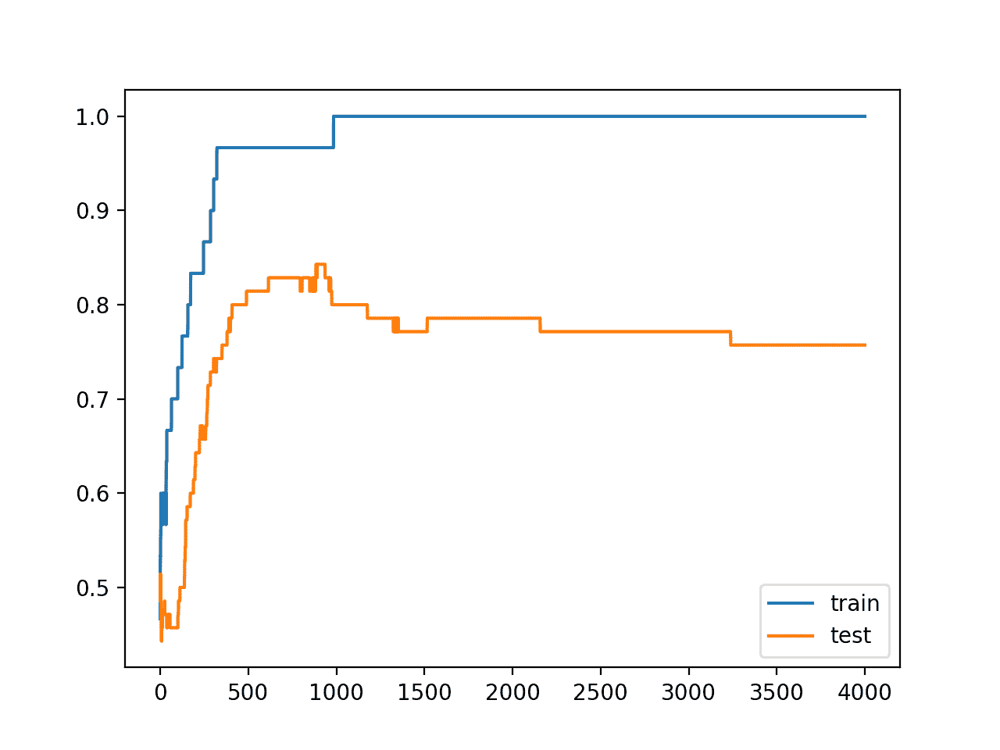
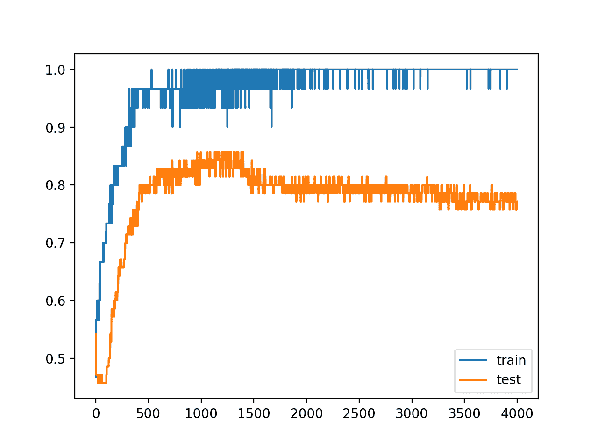
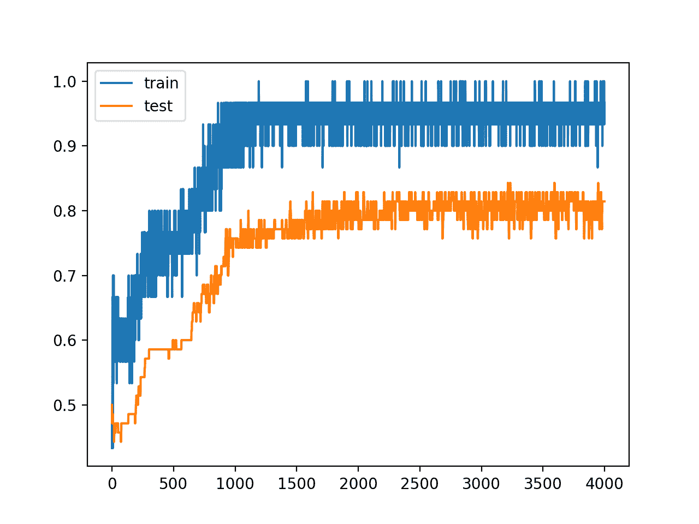

# 如何通过添加噪声来提高深度学习模型的鲁棒性

> 原文：<https://machinelearningmastery.com/how-to-improve-deep-learning-model-robustness-by-adding-noise/>

最后更新于 2020 年 8 月 28 日

用小的训练数据集向约束不足的神经网络模型添加噪声可以产生正则化效果并减少过拟合。

Keras 支持通过称为高斯噪声层的单独层添加高斯噪声。此图层可用于向现有模型添加噪波。

在本教程中，您将发现如何在 Keras 中向深度学习模型添加噪声，以便[减少过拟合并提高模型泛化](https://machinelearningmastery.com/introduction-to-regularization-to-reduce-overfitting-and-improve-generalization-error/)。

完成本教程后，您将知道:

*   噪声可以通过高斯噪声层添加到神经网络模型中。
*   高斯噪声可用于向输入值或隐藏层之间添加噪声。
*   如何在多层感知器分类模型中添加高斯分布层以减少过拟合。

**用我的新书[更好的深度学习](https://machinelearningmastery.com/better-deep-learning/)启动你的项目**，包括*分步教程*和所有示例的 *Python 源代码*文件。

我们开始吧。

*   **2019 年 10 月更新**:针对 Keras 2.3 和 TensorFlow 2.0 更新。


如何通过添加噪声来提高深度学习模型的鲁棒性[迈克尔·穆勒](https://www.flickr.com/photos/104342908@N08/32070485934/)摄，版权所有。

## 教程概述

本教程分为三个部分；它们是:

1.  喀拉斯噪声正则化
2.  模型中的噪声正则化
3.  噪声正则化案例研究

## 喀拉斯噪声正则化

Keras 支持通过 GaussianNoise 层向模型添加噪声。

这是一个会给给定形状的输入添加噪声的层。噪声的平均值为零，要求将噪声的标准偏差指定为一个参数。例如:

```py
# import noise layer
from keras.layers import GaussianNoise
# define noise layer
layer = GaussianNoise(0.1)
```

图层的输出将具有与输入相同的形状，唯一的修改是将噪声添加到值中。

## 模型中的噪声正则化

神经网络模型可以以几种不同的方式使用高斯神经网络。

首先，它可以用作输入层，直接向输入变量添加噪声。这是神经网络中传统的使用噪声作为正则化方法。

下面是一个将高斯图层定义为采用两个输入变量的模型的输入图层的示例。

```py
...
model.add(GaussianNoise(0.01, input_shape=(2,)))
...
```

噪声也可以添加到模型中的隐藏层之间。考虑到 Keras 的灵活性，可以在使用激活功能之前或之后添加噪声。在激活之前添加可能更有意义；然而，两种选择都是可能的。

下面是一个 GaussianNoise 层的示例，它在[校正线性激活函数(ReLU)](https://machinelearningmastery.com/rectified-linear-activation-function-for-deep-learning-neural-networks/) 之前将噪声添加到密集层的线性输出中，这可能是隐藏层之间更合适的噪声使用方式。

```py
...
model.add(Dense(32))
model.add(GaussianNoise(0.1))
model.add(Activation('relu'))
model.add(Dense(32))
...
```

噪声也可以在激活功能后添加，很像使用噪声激活功能。这种用法的一个缺点是，结果值可能超出激活函数正常提供的范围。例如，具有附加噪声的值可能小于零，而 relu 激活函数将只输出 0 或更大的值。

```py
...
model.add(Dense(32, activation='reu'))
model.add(GaussianNoise(0.1))
model.add(Dense(32))
...
```

让我们来看看噪声正则化如何与一些常见的网络类型一起使用。

### MLP 噪声正则化

下面的示例在两个密集的完全连接的层之间添加了噪声。

```py
# example of noise between fully connected layers
from keras.layers import Dense
from keras.layers import GaussianNoise
from keras.layers import Activation
...
model.add(Dense(32))
model.add(GaussianNoise(0.1))
model.add(Activation('relu'))
model.add(Dense(1))
...
```

### 噪声正则化

下面的例子在卷积网络的汇聚层之后增加了噪声。

```py
# example of noise for a CNN
from keras.layers import Dense
from keras.layers import Conv2D
from keras.layers import MaxPooling2D
from keras.layers import GaussianNoise
...
model.add(Conv2D(32, (3,3)))
model.add(Conv2D(32, (3,3)))
model.add(MaxPooling2D())
model.add(GaussianNoise(0.1))
model.add(Dense(1))
...
```

### RNN 辍学正规化

以下示例在 LSTM 循环层和密集全连接层之间添加了噪声。

```py
# example of noise between LSTM and fully connected layers
from keras.layers import Dense
from keras.layers import Activation
from keras.layers import LSTM
from keras.layers import GaussianNoise
...
model.add(LSTM(32))
model.add(GaussianNoise(0.5))
model.add(Activation('relu'))
model.add(Dense(1))
...
```

既然我们已经看到了如何向神经网络模型添加噪声，让我们来看一个向 overfit 模型添加噪声以减少泛化误差的案例研究。

## 噪声正则化案例研究

在本节中，我们将演示如何使用噪声正则化来减少简单二进制分类问题上 MLP 的过拟合。

此示例提供了一个模板，用于将噪声正则化应用于您自己的神经网络，以解决分类和回归问题。

### 二元分类问题

我们将使用一个标准的二元分类问题，它定义了两个观察值的二维同心圆，每个类一个半圆。

每个观察都有两个相同规模的输入变量和一个 0 或 1 的类输出值。该数据集被称为“*圆*”数据集，这是因为绘制时每个类中观测值的形状。

我们可以使用 [make_circles()函数](http://Sklearn.org/stable/modules/generated/sklearn.datasets.make_circles.html)从这个问题中生成观察值。我们将向数据中添加噪声，并为随机数生成器播种，这样每次运行代码时都会生成相同的样本。

```py
# generate 2d classification dataset
X, y = make_circles(n_samples=100, noise=0.1, random_state=1)
```

我们可以绘制数据集，其中两个变量作为图形上的 x 和 y 坐标，类值作为观察的颜色。

下面列出了生成数据集并绘制它的完整示例。

```py
# generate two circles dataset
from sklearn.datasets import make_circles
from matplotlib import pyplot
from pandas import DataFrame
# generate 2d classification dataset
X, y = make_circles(n_samples=100, noise=0.1, random_state=1)
# scatter plot, dots colored by class value
df = DataFrame(dict(x=X[:,0], y=X[:,1], label=y))
colors = {0:'red', 1:'blue'}
fig, ax = pyplot.subplots()
grouped = df.groupby('label')
for key, group in grouped:
    group.plot(ax=ax, kind='scatter', x='x', y='y', label=key, color=colors[key])
pyplot.show()
```

运行该示例会创建一个散点图，显示每个类中观察值的同心圆形状。我们可以看到点扩散的噪音使得圆圈不那么明显。


带有显示每个样本类别值的颜色的圆形数据集散点图

这是一个很好的测试问题，因为类不能用一条线分开，例如不能线性分开，需要一个非线性的方法，如神经网络来解决。

我们只生成了 100 个样本，这对于神经网络来说是很小的，提供了对训练数据集进行过度训练的机会，并且在测试数据集上具有更高的误差，这是使用正则化的一个很好的例子。此外，样本有噪声，这使得模型有机会学习样本中不一般化的方面。

### 过采样多层感知器

我们可以开发一个 MLP 模型来解决这个二元分类问题。

该模型将有一个隐藏层，该隐藏层的节点可能比解决该问题所需的节点更多，这为过度填充提供了机会。我们还将对模型进行比要求更长时间的训练，以确保模型溢出。

在定义模型之前，我们将把数据集分成训练集和测试集，用 30 个例子训练模型，用 70 个例子评估拟合模型的表现。

```py
# generate 2d classification dataset
X, y = make_circles(n_samples=100, noise=0.1, random_state=1)
# split into train and test
n_train = 30
trainX, testX = X[:n_train, :], X[n_train:, :]
trainy, testy = y[:n_train], y[n_train:]
```

接下来，我们可以定义模型。

隐藏层使用隐藏层中的 500 个节点和校正的线性激活函数。输出层使用 sigmoid 激活函数来预测类值 0 或 1。该模型使用二元交叉熵损失函数进行优化，适用于二元分类问题和高效的 Adam 版本梯度下降。

```py
# define model
model = Sequential()
model.add(Dense(500, input_dim=2, activation='relu'))
model.add(Dense(1, activation='sigmoid'))
model.compile(loss='binary_crossentropy', optimizer='adam', metrics=['accuracy'])
```

然后，定义的模型适用于 4000 个时期的训练数据，默认批量为 32。

我们还将使用测试数据集作为验证数据集。

```py
# fit model
history = model.fit(trainX, trainy, validation_data=(testX, testy), epochs=4000, verbose=0)
```

我们可以在测试数据集上评估模型的表现并报告结果。

```py
# evaluate the model
_, train_acc = model.evaluate(trainX, trainy, verbose=0)
_, test_acc = model.evaluate(testX, testy, verbose=0)
print('Train: %.3f, Test: %.3f' % (train_acc, test_acc))
```

最后，我们将绘制模型在每个时期的列车和测试集上的表现。

如果模型确实过度训练了训练数据集，那么随着模型学习训练数据集中的统计噪声，我们将期望训练集上的精度线图继续增加，并且测试集上升，然后再次下降。

```py
# plot history
pyplot.plot(history.history['accuracy'], label='train')
pyplot.plot(history.history['val_accuracy'], label='test')
pyplot.legend()
pyplot.show()
```

我们可以把所有这些部分绑在一起；下面列出了完整的示例。

```py
# mlp overfit on the two circles dataset
from sklearn.datasets import make_circles
from keras.layers import Dense
from keras.models import Sequential
from matplotlib import pyplot
# generate 2d classification dataset
X, y = make_circles(n_samples=100, noise=0.1, random_state=1)
# split into train and test
n_train = 30
trainX, testX = X[: n_train, :], X[n_train:, :]
trainy, testy = y[:n_train], y[n_train:]
# define model
model = Sequential()
model.add(Dense(500, input_dim=2, activation='relu'))
model.add(Dense(1, activation='sigmoid'))
model.compile(loss='binary_crossentropy', optimizer='adam', metrics=['accuracy'])
# fit model
history = model.fit(trainX, trainy, validation_data=(testX, testy), epochs=4000, verbose=0)
# evaluate the model
_, train_acc = model.evaluate(trainX, trainy, verbose=0)
_, test_acc = model.evaluate(testX, testy, verbose=0)
print('Train: %.3f, Test: %.3f' % (train_acc, test_acc))
# plot history
pyplot.plot(history.history['accuracy'], label='train')
pyplot.plot(history.history['val_accuracy'], label='test')
pyplot.legend()
pyplot.show()
```

运行该示例会报告列车和测试数据集上的模型表现。

**注**:考虑到算法或评估程序的随机性，或数值精度的差异，您的[结果可能会有所不同](https://machinelearningmastery.com/different-results-each-time-in-machine-learning/)。考虑运行该示例几次，并比较平均结果。

我们可以看到，该模型在训练数据集上的表现优于测试数据集，这可能是过度拟合的一个迹象。

```py
Train: 1.000, Test: 0.757
```

创建一个图形，显示列车和测试集上模型精度的线图。

我们可以看到过拟合模型的预期形状，其中测试精度增加到一个点，然后开始再次降低。



训练时训练和测试数据集上的精度线图显示出过度拟合

## 具有输入层噪声的 MLP

数据集由具有受控统计噪声量的点定义。

然而，由于数据集很小，我们可以给输入值添加更多的噪声。这将产生创建更多样本或对域进行重采样的效果，使输入空间的结构人为地更加平滑。这可能会使问题更容易学习，并提高泛化表现。

我们可以添加一个高斯图层作为输入图层。噪音必须很小。假设输入值在范围[0，1]内，我们将添加平均值为 0.0、标准偏差为 0.01 的高斯噪声，这是任意选择的。

```py
# define model
model = Sequential()
model.add(GaussianNoise(0.01, input_shape=(2,)))
model.add(Dense(500, activation='relu'))
model.add(Dense(1, activation='sigmoid'))
model.compile(loss='binary_crossentropy', optimizer='adam', metrics=['accuracy'])
```

下面列出了此更改的完整示例。

```py
# mlp overfit on the two circles dataset with input noise
from sklearn.datasets import make_circles
from keras.models import Sequential
from keras.layers import Dense
from keras.layers import GaussianNoise
from matplotlib import pyplot
# generate 2d classification dataset
X, y = make_circles(n_samples=100, noise=0.1, random_state=1)
# split into train and test
n_train = 30
trainX, testX = X[:n_train, :], X[n_train:, :]
trainy, testy = y[:n_train], y[n_train:]
# define model
model = Sequential()
model.add(GaussianNoise(0.01, input_shape=(2,)))
model.add(Dense(500, activation='relu'))
model.add(Dense(1, activation='sigmoid'))
model.compile(loss='binary_crossentropy', optimizer='adam', metrics=['accuracy'])
# fit model
history = model.fit(trainX, trainy, validation_data=(testX, testy), epochs=4000, verbose=0)
# evaluate the model
_, train_acc = model.evaluate(trainX, trainy, verbose=0)
_, test_acc = model.evaluate(testX, testy, verbose=0)
print('Train: %.3f, Test: %.3f' % (train_acc, test_acc))
# plot history
pyplot.plot(history.history['accuracy'], label='train')
pyplot.plot(history.history['val_accuracy'], label='test')
pyplot.legend()
pyplot.show()
```

运行该示例会报告列车和测试数据集上的模型表现。

**注**:考虑到算法或评估程序的随机性，或数值精度的差异，您的[结果可能会有所不同](https://machinelearningmastery.com/different-results-each-time-in-machine-learning/)。考虑运行该示例几次，并比较平均结果。

在这种情况下，我们可能会在测试数据集上看到模型表现的小幅提升，而不会对训练数据集产生负面影响。

```py
Train: 1.000, Test: 0.771
```

我们清楚地看到在训练过程中添加的噪声对模型评估的影响，如线图所示。噪声会影响模型在训练期间跳跃的准确性，这可能是由于噪声引入了与训练数据集中的真实点相冲突的点。

也许较低的输入噪声标准偏差会更合适。

该模型仍然显示出一种过度训练的模式，随着训练时间的推移，测试精度先上升后下降。



列车线形图和带有输入层噪声的测试精度

## 具有隐藏层噪声的 MLP

向输入值添加噪声的另一种方法是在隐藏层之间添加噪声。

这可以通过在应用激活函数之前向层的线性输出(加权和)添加噪声来实现，在这种情况下是整流的线性激活函数。我们还可以对噪声使用较大的标准偏差，因为在这个水平上，模型对噪声不太敏感，因为过度拟合可能会导致较大的权重。我们将使用 0.1 的标准偏差，同样是任意选择的。

```py
# define model
model = Sequential()
model.add(Dense(500, input_dim=2))
model.add(GaussianNoise(0.1))
model.add(Activation('relu'))
model.add(Dense(1, activation='sigmoid'))
model.compile(loss='binary_crossentropy', optimizer='adam', metrics=['accuracy'])
```

下面列出了隐藏层之间有高斯噪声的完整示例。

```py
# mlp overfit on the two circles dataset with hidden layer noise
from sklearn.datasets import make_circles
from keras.models import Sequential
from keras.layers import Dense
from keras.layers import Activation
from keras.layers import GaussianNoise
from matplotlib import pyplot
# generate 2d classification dataset
X, y = make_circles(n_samples=100, noise=0.1, random_state=1)
# split into train and test
n_train = 30
trainX, testX = X[:n_train, :], X[n_train:, :]
trainy, testy = y[:n_train], y[n_train:]
# define model
model = Sequential()
model.add(Dense(500, input_dim=2))
model.add(GaussianNoise(0.1))
model.add(Activation('relu'))
model.add(Dense(1, activation='sigmoid'))
model.compile(loss='binary_crossentropy', optimizer='adam', metrics=['accuracy'])
# fit model
history = model.fit(trainX, trainy, validation_data=(testX, testy), epochs=4000, verbose=0)
# evaluate the model
_, train_acc = model.evaluate(trainX, trainy, verbose=0)
_, test_acc = model.evaluate(testX, testy, verbose=0)
print('Train: %.3f, Test: %.3f' % (train_acc, test_acc))
# plot history
pyplot.plot(history.history['accuracy'], label='train')
pyplot.plot(history.history['val_accuracy'], label='test')
pyplot.legend()
pyplot.show()
```

运行该示例会报告列车和测试数据集上的模型表现。

**注**:考虑到算法或评估程序的随机性，或数值精度的差异，您的[结果可能会有所不同](https://machinelearningmastery.com/different-results-each-time-in-machine-learning/)。考虑运行该示例几次，并比较平均结果。

在这种情况下，我们可以看到模型在等待测试集上的表现显著提高。

```py
# Train: 0.967, Test: 0.814
```

我们还可以从训练时期的精度线图中看到，模型似乎不再显示过度拟合的特性。



列车线形图及隐层噪声测试精度

我们还可以在第一个隐藏层的输出通过激活函数后进行实验并添加噪声。

```py
# define model
model = Sequential()
model.add(Dense(500, input_dim=2, activation='relu'))
model.add(GaussianNoise(0.1))
model.add(Dense(1, activation='sigmoid'))
model.compile(loss='binary_crossentropy', optimizer='adam', metrics=['accuracy'])
```

下面列出了完整的示例。

```py
# mlp overfit on the two circles dataset with hidden layer noise (alternate)
from sklearn.datasets import make_circles
from keras.models import Sequential
from keras.layers import Dense
from keras.layers import GaussianNoise
from matplotlib import pyplot
# generate 2d classification dataset
X, y = make_circles(n_samples=100, noise=0.1, random_state=1)
# split into train and test
n_train = 30
trainX, testX = X[:n_train, :], X[n_train:, :]
trainy, testy = y[:n_train], y[n_train:]
# define model
model = Sequential()
model.add(Dense(500, input_dim=2, activation='relu'))
model.add(GaussianNoise(0.1))
model.add(Dense(1, activation='sigmoid'))
model.compile(loss='binary_crossentropy', optimizer='adam', metrics=['accuracy'])
# fit model
history = model.fit(trainX, trainy, validation_data=(testX, testy), epochs=4000, verbose=0)
# evaluate the model
_, train_acc = model.evaluate(trainX, trainy, verbose=0)
_, test_acc = model.evaluate(testX, testy, verbose=0)
print('Train: %.3f, Test: %.3f' % (train_acc, test_acc))
# plot history
pyplot.plot(history.history['accuracy'], label='train')
pyplot.plot(history.history['val_accuracy'], label='test')
pyplot.legend()
pyplot.show()
```

运行该示例会报告列车和测试数据集上的模型表现。

**注**:考虑到算法或评估程序的随机性，或数值精度的差异，您的[结果可能会有所不同](https://machinelearningmastery.com/different-results-each-time-in-machine-learning/)。考虑运行该示例几次，并比较平均结果。

令人惊讶的是，我们在模型的表现上几乎看不到差异。

```py
Train: 0.967, Test: 0.814
```

同样，我们可以从训练时期的精度线图中看到，模型不再显示过度拟合的迹象。


列车线形图和带隐层噪声的测试精度(备选)

## 扩展ˌ扩张

本节列出了一些您可能希望探索的扩展教程的想法。

*   **重复评估**。更新示例，使用有无噪声模型的重复评估，并将表现报告为重复的平均值和标准偏差。
*   **网格搜索标准差**。开发网格搜索，以便发现可靠地产生最佳表现模型的噪声量。
*   **输入和隐藏噪声**。更新示例，在模型的输入层和隐藏层引入噪声。

如果你探索这些扩展，我很想知道。

## 进一步阅读

如果您想更深入地了解这个主题，本节将提供更多资源。

*   [硬正则器 API](https://keras.io/regularizers/)
*   [硬核层 API](https://keras.io/layers/core/)
*   [喀拉斯卷积层应用编程接口](https://keras.io/layers/convolutional/)
*   [喀拉斯循环层原料药](https://keras.io/layers/recurrent/)
*   [高噪声 API](https://keras.io/layers/noise/)
*   [sklearn . dataset . make _ circles API](http://Sklearn.org/stable/modules/generated/sklearn.datasets.make_circles.html)

## 摘要

在本教程中，您发现了如何在 Keras 中向深度学习模型添加噪声，以减少过拟合并提高模型泛化能力。

具体来说，您了解到:

*   噪声可以通过高斯噪声层添加到神经网络模型中。
*   高斯噪声可用于向输入值或隐藏层之间添加噪声。
*   如何在多层感知器分类模型中添加高斯分布层以减少过拟合。

你有什么问题吗？
在下面的评论中提问，我会尽力回答。