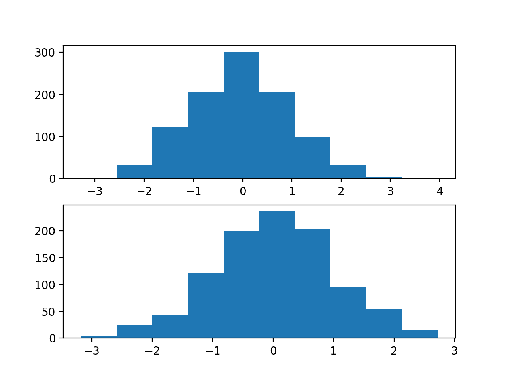
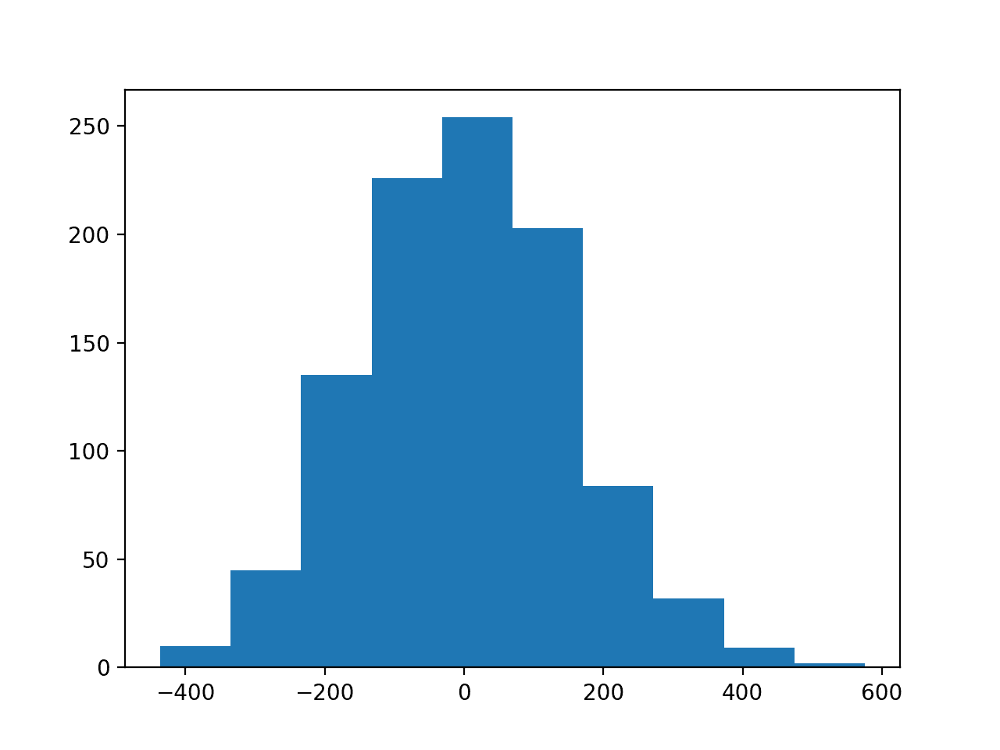
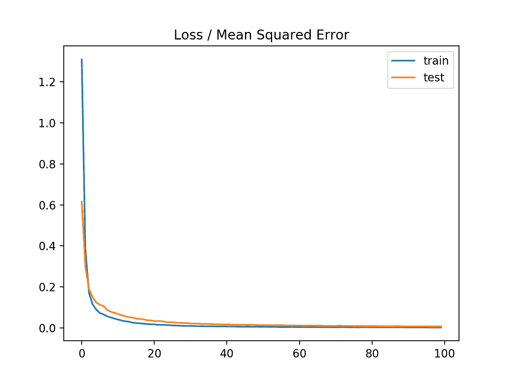
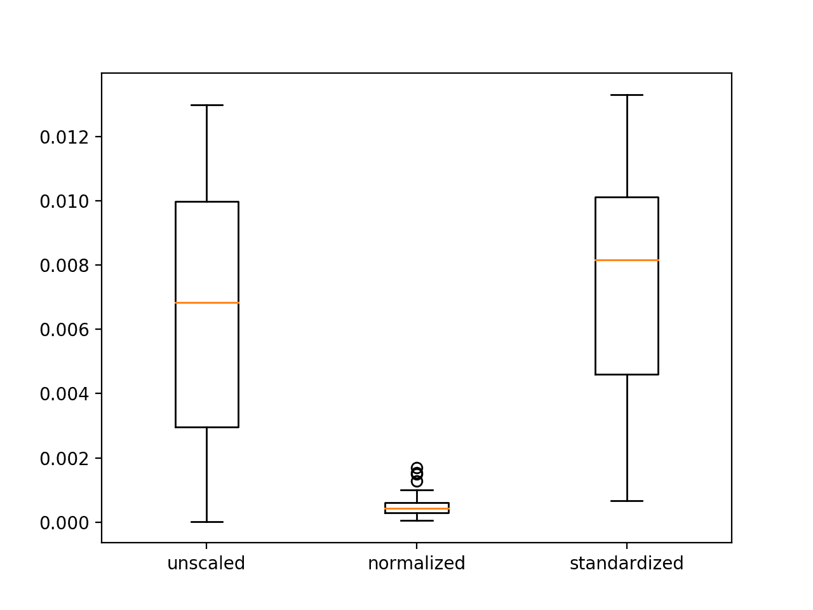

# 如何使用数据缩放提高深度学习模型的稳定性和表现

> 原文：<https://machinelearningmastery.com/how-to-improve-neural-network-stability-and-modeling-performance-with-data-scaling/>

最后更新于 2020 年 8 月 25 日

深度学习神经网络学习如何从训练数据集中的示例将输入映射到输出。

模型的权重被初始化为小的随机值，并且响应于训练数据集上的误差估计，通过优化算法被更新。

考虑到模型中使用的权重较小，以及预测值和期望值之间的误差，用于训练模型的输入和输出规模是一个重要因素。未缩放的输入变量会导致学习过程缓慢或不稳定，而回归问题中未缩放的目标变量会导致梯度爆炸，导致学习过程失败。

数据准备包括在训练神经网络模型之前，使用标准化和规范化等技术来重新调整输入和输出变量。

在本教程中，您将发现如何通过缩放数据来提高神经网络的稳定性和建模表现。

完成本教程后，您将知道:

*   当使用深度学习神经网络时，数据缩放是推荐的预处理步骤。
*   数据缩放可以通过规范化或标准化实值输入和输出变量来实现。
*   如何应用标准化和规范化来提高多层感知器模型在回归预测建模问题上的表现。

**用我的新书[更好的深度学习](https://machinelearningmastery.com/better-deep-learning/)启动你的项目**，包括*分步教程*和所有示例的 *Python 源代码*文件。

我们开始吧。


如何通过数据缩放提高神经网络的稳定性和建模表现
图片由[哈维尔·桑切斯·波特罗](https://www.flickr.com/photos/javiersanp/14202569306/)提供，版权所有。

## 教程概述

本教程分为六个部分；它们是:

1.  您的数据规模很重要
2.  数据缩放方法
3.  回归预测建模问题
4.  具有未缩放数据的多层感知器
5.  具有缩放输出变量的多层感知器
6.  具有缩放输入变量的多层感知器

## 您的数据规模很重要

深度学习神经网络模型学习从输入变量到输出变量的映射。

因此，从域中提取的数据的规模和分布对于每个变量可能是不同的。

输入变量可能具有不同的单位(例如英尺、公里和小时)，这反过来意味着变量具有不同的标度。

输入变量之间的比例差异可能会增加建模问题的难度。这方面的一个例子是，大的输入值(例如数百或数千个单位的分布)会导致模型学习大的权重值。具有大权重值的模型通常是不稳定的，这意味着它可能在学习过程中表现不佳，并且对输入值敏感，从而导致较高的泛化误差。

> 预处理最常见的形式之一是对输入变量进行简单的线性重新缩放。

—第 298 页，[用于模式识别的神经网络](https://amzn.to/2S8qdwt)，1995。

具有大范围值的目标变量反过来可能导致大的误差梯度值，导致权重值急剧变化，使得学习过程不稳定。

缩放输入和输出变量是使用神经网络模型的关键步骤。

> 在实践中，在将输入数据呈现给网络之前，对其应用预处理变换几乎总是有利的。类似地，网络的输出经常被后处理以给出所需的输出值。

—第 296 页，[用于模式识别的神经网络](https://amzn.to/2S8qdwt)，1995。

### 缩放输入变量

输入变量是网络在输入层或可见层进行预测的变量。

一个好的经验法则是，输入变量应该是小值，可能在 0-1 的范围内，或者用零平均值和一个标准偏差标准化。

输入变量是否需要缩放取决于您的问题和每个变量的具体情况。

您可能有一系列数量作为输入，例如价格或温度。

如果数量的分布是正态的，那么就应该标准化，否则数据就应该标准化。如果数量值的范围很大(10s、100s 等)，则适用。)或小(0.01，0.0001)。

如果数量值很小(接近 0-1)并且分布有限(例如，标准偏差接近 1)，那么也许您可以不按比例缩放数据。

问题可能很复杂，并且可能不清楚如何最好地缩放输入数据。

如果有疑问，标准化输入序列。如果您有资源，探索使用原始数据、标准化数据和规范化数据建模，并查看结果模型的表现是否有有益的差异。

> 如果输入变量是线性组合的，如在 MLP[多层感知器]中，那么很少严格需要标准化输入，至少在理论上是这样。[……]然而，有各种各样的实际原因，为什么标准化输入可以使训练更快，并减少陷入局部最优的机会。

— [我应该对数据进行规范化/标准化/重新缩放吗？神经网络常见问题](ftp://ftp.sas.com/pub/neural/FAQ2.html#A_std)

### 缩放输出变量

输出变量是网络预测的变量。

您必须确保输出变量的比例与网络输出层上激活函数(传递函数)的比例相匹配。

> 如果您的输出激活函数的范围为[0，1]，那么显然您必须确保目标值在该范围内。但是选择一个适合目标分布的输出激活函数通常比强迫你的数据符合输出激活函数要好。

— [我应该对数据进行规范化/标准化/重新缩放吗？神经网络常见问题](ftp://ftp.sas.com/pub/neural/FAQ2.html#A_std)

如果你的问题是一个回归问题，那么输出将是一个实值。

这最好用线性激活函数来建模。如果值的分布是正态的，那么可以标准化输出变量。否则，输出变量可以规范化。

## 数据缩放方法

您可能需要考虑两种类型的数据缩放:规范化和标准化。

这些都可以通过 scikit-learn 库来实现。

### 数据标准化

规范化是从原始范围对数据进行重新缩放，以便所有值都在 0 和 1 的范围内。

规范化要求您知道或能够准确估计最小和最大可观察值。您可能能够从您的可用数据中估计这些值。

值标准化如下:

```py
y = (x - min) / (max - min)
```

其中最小值和最大值属于被归一化的值 *x* 。

例如，对于数据集，我们可以将最小和最大可观察值估计为 30 和-10。然后，我们可以对任何值进行归一化，如 18.8，如下所示:

```py
y = (x - min) / (max - min)
y = (18.8 - (-10)) / (30 - (-10))
y = 28.8 / 40
y = 0.72
```

您可以看到，如果提供的 *x* 值超出了最小值和最大值的界限，则结果值将不会在 0 和 1 的范围内。您可以在进行预测之前检查这些观察值，并从数据集中删除它们，或者将它们限制在预定义的最大值或最小值。

您可以使用 scikit-learn 对象[最小最大缩放器](http://scikit-learn.org/stable/modules/generated/sklearn.preprocessing.MinMaxScaler.html)来规范化数据集。

*最小最大缩放器*和其他缩放技术的良好实践用法如下:

*   **使用可用的训练数据**安装定标器。对于归一化，这意味着训练数据将用于估计最小和最大可观察值。这是通过调用 *fit()* 函数来实现的。
*   **将量表应用于训练数据**。这意味着您可以使用规范化的数据来训练您的模型。这是通过调用*变换()*函数来完成的。
*   **将刻度应用于向前的数据**。这意味着你可以在未来准备新的数据来做预测。

*最小最大缩放器*的默认比例是将变量重新缩放到范围[0，1]，尽管可以通过“*特征 _ 范围*参数指定首选比例，并为所有变量指定包含最小值和最大值的元组。

```py
# create scaler
scaler = MinMaxScaler(feature_range=(-1,1))
```

如果需要，可以反转变换。这对于将预测转换回其原始比例以进行报告或绘图非常有用。这可以通过调用 *inverse_transform()* 函数来实现。

以下示例提供了使用*最小最大缩放器*来规范化数据的一般演示。

```py
# demonstrate data normalization with sklearn
from sklearn.preprocessing import MinMaxScaler
# load data
data = ...
# create scaler
scaler = MinMaxScaler()
# fit scaler on data
scaler.fit(data)
# apply transform
normalized = scaler.transform(data)
# inverse transform
inverse = scaler.inverse_transform(normalized)
```

也可以使用 *fit_transform()* 功能，一步完成拟合和变换；例如:

```py
# demonstrate data normalization with sklearn
from sklearn.preprocessing import MinMaxScaler
# load data
data = ...
# create scaler
scaler = MinMaxScaler()
# fit and transform in one step
normalized = scaler.fit_transform(data)
# inverse transform
inverse = scaler.inverse_transform(normalized)
```

### 数据标准化

数据集标准化涉及重新调整值的分布，以便观察值的平均值为 0，标准偏差为 1。有时被称为“T0”美白

这可以被认为是减去平均值或使数据居中。

像标准化一样，标准化可能是有用的，甚至在某些机器学习算法中，当您的数据具有不同比例的输入值时，标准化是必需的。

标准化假设您的观测值符合高斯分布(钟形曲线)，具有良好的平均值和标准偏差。如果没有达到这个期望，你仍然可以标准化你的数据，但是你可能得不到可靠的结果。

标准化要求你知道或能够准确估计可观察值的平均值和标准偏差。您可能能够从您的培训数据中估计这些值。

值标准化如下:

```py
y = (x - mean) / standard_deviation
```

其中*表示*计算如下:

```py
mean = sum(x) / count(x)
```

*标准偏差*计算如下:

```py
standard_deviation = sqrt( sum( (x - mean)^2 ) / count(x))
```

我们可以推测平均值为 10，标准偏差约为 5。使用这些值，我们可以将第一个值 20.7 标准化如下:

```py
y = (x - mean) / standard_deviation
y = (20.7 - 10) / 5
y = (10.7) / 5
y = 2.14
```

数据集的均值和标准差估计值比最小值和最大值对新数据更稳健。

您可以使用 scikit-learn 对象[标准缩放器](http://scikit-learn.org/stable/modules/generated/sklearn.preprocessing.StandardScaler.html)来标准化数据集。

```py
# demonstrate data standardization with sklearn
from sklearn.preprocessing import StandardScaler
# load data
data = ...
# create scaler
scaler = StandardScaler()
# fit scaler on data
scaler.fit(data)
# apply transform
standardized = scaler.transform(data)
# inverse transform
inverse = scaler.inverse_transform(standardized)
```

也可以使用 *fit_transform()* 功能，一步完成拟合和变换；例如:

```py
# demonstrate data standardization with sklearn
from sklearn.preprocessing import StandardScaler
# load data
data = ...
# create scaler
scaler = StandardScaler()
# fit and transform in one step
standardized = scaler.fit_transform(data)
# inverse transform
inverse = scaler.inverse_transform(standardized)
```

## 回归预测建模问题

回归[预测建模](https://machinelearningmastery.com/gentle-introduction-to-predictive-modeling/)问题涉及预测实值量。

我们可以在[make _ revolution()函数](http://scikit-learn.org/stable/modules/generated/sklearn.datasets.make_regression.html)中使用 scikit-learn 库提供的标准回归问题生成器。该函数将从具有给定数量的输入变量、统计噪声和其他属性的简单回归问题中生成示例。

我们将使用这个函数来定义一个有 20 个输入特征的问题；其中 10 个功能将是有意义的，10 个将不相关。总共将随机生成 1000 个示例。[伪随机数发生器](https://machinelearningmastery.com/how-to-generate-random-numbers-in-python/)将被固定，以确保我们每次运行代码时都能得到相同的 1000 个例子。

```py
# generate regression dataset
X, y = make_regression(n_samples=1000, n_features=20, noise=0.1, random_state=1)
```

每个输入变量都具有高斯分布，目标变量也是如此。

我们可以通过创建一些输入变量和输出变量的直方图来演示这一点。

```py
# regression predictive modeling problem
from sklearn.datasets import make_regression
from matplotlib import pyplot
# generate regression dataset
X, y = make_regression(n_samples=1000, n_features=20, noise=0.1, random_state=1)
# histograms of input variables
pyplot.subplot(211)
pyplot.hist(X[:, 0])
pyplot.subplot(212)
pyplot.hist(X[:, 1])
pyplot.show()
# histogram of target variable
pyplot.hist(y)
pyplot.show()
```

运行该示例会创建两个图形。

第一个显示了二十个输入变量中前两个的直方图，显示每个变量都有一个高斯数据分布。



回归问题二十个输入变量中两个的直方图

第二个图显示了目标变量的直方图，与输入变量相比，显示了更大的变量范围，并且还是高斯数据分布。



回归问题目标变量的直方图

现在我们有了一个可以作为调查基础的回归问题，我们可以开发一个模型来解决它。

## 具有未缩放数据的多层感知器

我们可以为回归问题开发一个多层感知器(MLP)模型。

将在原始数据上演示一个模型，不需要对输入或输出变量进行任何缩放。我们预计模型表现将普遍较差。

第一步是将数据分成训练集和测试集，这样我们就可以拟合和评估模型。我们将从域中生成 1，000 个示例，并将数据集分成两半，为训练和测试数据集使用 500 个示例。

```py
# split into train and test
n_train = 500
trainX, testX = X[:n_train, :], X[n_train:, :]
trainy, testy = y[:n_train], y[n_train:]
```

接下来，我们可以定义一个 MLP 模型。该模型将在问题的 20 个输入变量中有 20 个输入。

单个隐藏层将使用 25 个节点和一个校正的线性激活函数。输出层有一个单目标变量节点和一个线性激活函数来直接预测真实值。

```py
# define model
model = Sequential()
model.add(Dense(25, input_dim=20, activation='relu', kernel_initializer='he_uniform'))
model.add(Dense(1, activation='linear'))
```

均方误差损失函数将用于优化模型，随机梯度下降优化算法将用于学习率为 0.01、动量为 0.9 的合理默认配置。

```py
# compile model
model.compile(loss='mean_squared_error', optimizer=SGD(lr=0.01, momentum=0.9))
```

该模型将适用于 100 个训练时期，测试集将用作验证集，在每个训练时期结束时进行评估。

训练结束时，在训练和测试数据集上计算均方误差，以了解模型学习问题的程度。

```py
# evaluate the model
train_mse = model.evaluate(trainX, trainy, verbose=0)
test_mse = model.evaluate(testX, testy, verbose=0)
```

最后，在每个训练周期结束时，训练集和测试集的均方误差的学习曲线用线图表示，在学习问题的同时，提供学习曲线以获得模型的动力学概念。

```py
# plot loss during training
pyplot.title('Mean Squared Error')
pyplot.plot(history.history['loss'], label='train')
pyplot.plot(history.history['val_loss'], label='test')
pyplot.legend()
pyplot.show()
```

将这些元素结合在一起，下面列出了完整的示例。

```py
# mlp with unscaled data for the regression problem
from sklearn.datasets import make_regression
from keras.layers import Dense
from keras.models import Sequential
from keras.optimizers import SGD
from matplotlib import pyplot
# generate regression dataset
X, y = make_regression(n_samples=1000, n_features=20, noise=0.1, random_state=1)
# split into train and test
n_train = 500
trainX, testX = X[:n_train, :], X[n_train:, :]
trainy, testy = y[:n_train], y[n_train:]
# define model
model = Sequential()
model.add(Dense(25, input_dim=20, activation='relu', kernel_initializer='he_uniform'))
model.add(Dense(1, activation='linear'))
# compile model
model.compile(loss='mean_squared_error', optimizer=SGD(lr=0.01, momentum=0.9))
# fit model
history = model.fit(trainX, trainy, validation_data=(testX, testy), epochs=100, verbose=0)
# evaluate the model
train_mse = model.evaluate(trainX, trainy, verbose=0)
test_mse = model.evaluate(testX, testy, verbose=0)
print('Train: %.3f, Test: %.3f' % (train_mse, test_mse))
# plot loss during training
pyplot.title('Mean Squared Error')
pyplot.plot(history.history['loss'], label='train')
pyplot.plot(history.history['val_loss'], label='test')
pyplot.legend()
pyplot.show()
```

运行该示例符合模型，并计算列车和测试集的均方误差。

在这种情况下，模型无法学习问题，导致对 NaN 值的预测。在训练期间，[模型权重爆炸](https://machinelearningmastery.com/exploding-gradients-in-neural-networks/)给出了非常大的误差，反过来，为权重更新计算误差梯度。

```py
Train: nan, Test: nan
```

这表明，至少目标变量需要一些数据缩放。

创建训练历史的线图，但不显示任何内容，因为模型几乎立即导致 NaN 均方误差。

## 具有缩放输出变量的多层感知器

可以更新 MLP 模型来缩放目标变量。

减小目标变量的规模将反过来减小用于更新权重的梯度的大小，并导致更稳定的模型和训练过程。

给定目标变量的高斯分布，重新缩放变量的自然方法是标准化变量。这需要估计变量的平均值和标准偏差，并使用这些估计值来执行重新缩放。

最佳实践是估计训练数据集的均值和标准差，并使用这些变量来缩放训练和测试数据集。这是为了避免在模型评估过程中出现任何数据泄露。

scikit-learn 转换器期望输入数据是行和列的矩阵，因此在转换之前，目标变量的 1D 数组必须被重新整形为 2D 数组。

```py
# reshape 1d arrays to 2d arrays
trainy = trainy.reshape(len(trainy), 1)
testy = testy.reshape(len(trainy), 1)
```

然后我们可以创建并应用*标准缩放器*来重新缩放目标变量。

```py
# created scaler
scaler = StandardScaler()
# fit scaler on training dataset
scaler.fit(trainy)
# transform training dataset
trainy = scaler.transform(trainy)
# transform test dataset
testy = scaler.transform(testy)
```

重新缩放目标变量意味着估计模型的表现和绘制学习曲线将以缩放变量的平方单位而不是原始比例的平方单位来计算均方误差。这使得在该领域的上下文中解释错误具有挑战性。

在实践中，通过首先反转测试数据集目标变量和模型预测的变换，并使用未缩放数据的均方根误差来估计模型表现，来估计模型的表现可能是有帮助的。这是留给读者的练习。

下面列出了回归问题中标准化 MLP 目标变量的完整示例。

```py
# mlp with scaled outputs on the regression problem
from sklearn.datasets import make_regression
from sklearn.preprocessing import StandardScaler
from keras.layers import Dense
from keras.models import Sequential
from keras.optimizers import SGD
from matplotlib import pyplot
# generate regression dataset
X, y = make_regression(n_samples=1000, n_features=20, noise=0.1, random_state=1)
# split into train and test
n_train = 500
trainX, testX = X[:n_train, :], X[n_train:, :]
trainy, testy = y[:n_train], y[n_train:]
# reshape 1d arrays to 2d arrays
trainy = trainy.reshape(len(trainy), 1)
testy = testy.reshape(len(trainy), 1)
# created scaler
scaler = StandardScaler()
# fit scaler on training dataset
scaler.fit(trainy)
# transform training dataset
trainy = scaler.transform(trainy)
# transform test dataset
testy = scaler.transform(testy)
# define model
model = Sequential()
model.add(Dense(25, input_dim=20, activation='relu', kernel_initializer='he_uniform'))
model.add(Dense(1, activation='linear'))
# compile model
model.compile(loss='mean_squared_error', optimizer=SGD(lr=0.01, momentum=0.9))
# fit model
history = model.fit(trainX, trainy, validation_data=(testX, testy), epochs=100, verbose=0)
# evaluate the model
train_mse = model.evaluate(trainX, trainy, verbose=0)
test_mse = model.evaluate(testX, testy, verbose=0)
print('Train: %.3f, Test: %.3f' % (train_mse, test_mse))
# plot loss during training
pyplot.title('Loss / Mean Squared Error')
pyplot.plot(history.history['loss'], label='train')
pyplot.plot(history.history['val_loss'], label='test')
pyplot.legend()
pyplot.show()
```

运行该示例符合模型，并计算列车和测试集的均方误差。

**注**:考虑到算法或评估程序的随机性，或数值精度的差异，您的[结果可能会有所不同](https://machinelearningmastery.com/different-results-each-time-in-machine-learning/)。考虑运行该示例几次，并比较平均结果。

在这种情况下，模型似乎确实学会了这个问题，并实现了接近零的均方误差，至少达到了小数点后三位。

```py
Train: 0.003, Test: 0.007
```

创建每个训练时期的训练(蓝色)和测试(橙色)数据集的均方误差线图。

在这种情况下，我们可以看到模型快速学会有效地将输入映射到回归问题的输出，并在运行过程中在两个数据集上都取得了良好的表现，既没有过度拟合也没有欠拟合训练数据集。



每个训练时期训练 a 测试数据集的均方误差线图

重复这个实验并标准化目标变量并比较结果可能会很有趣。

## 具有缩放输入变量的多层感知器

我们已经看到，当拟合具有广泛分布的目标变量的回归模型时，数据缩放可以稳定训练过程。

还可以通过缩放输入变量来提高模型的稳定性和表现。

在本节中，我们将设计一个实验来比较不同缩放方法对输入变量的表现。

输入变量也有高斯数据分布，就像目标变量一样，因此我们认为数据标准化是最好的方法。情况并非总是如此。

我们可以将未缩放输入变量的表现与符合标准化和规范化输入变量的模型进行比较。

第一步是定义一个函数来创建相同的 1000 个数据样本，将它们分成训练集和测试集，并应用通过输入参数指定的数据缩放方法。下面的 *get_dataset()* 函数实现了这一点，要求为输入和目标变量提供定标器，并返回分割成输入和输出组件的训练和测试数据集，准备训练和评估模型。

```py
# prepare dataset with input and output scalers, can be none
def get_dataset(input_scaler, output_scaler):
	# generate dataset
	X, y = make_regression(n_samples=1000, n_features=20, noise=0.1, random_state=1)
	# split into train and test
	n_train = 500
	trainX, testX = X[:n_train, :], X[n_train:, :]
	trainy, testy = y[:n_train], y[n_train:]
	# scale inputs
	if input_scaler is not None:
		# fit scaler
		input_scaler.fit(trainX)
		# transform training dataset
		trainX = input_scaler.transform(trainX)
		# transform test dataset
		testX = input_scaler.transform(testX)
	if output_scaler is not None:
		# reshape 1d arrays to 2d arrays
		trainy = trainy.reshape(len(trainy), 1)
		testy = testy.reshape(len(trainy), 1)
		# fit scaler on training dataset
		output_scaler.fit(trainy)
		# transform training dataset
		trainy = output_scaler.transform(trainy)
		# transform test dataset
		testy = output_scaler.transform(testy)
	return trainX, trainy, testX, testy
```

接下来，我们可以定义一个函数来拟合给定数据集上的 MLP 模型，并返回测试数据集上拟合模型的均方误差。

下面的 *evaluate_model()* 函数实现了这个行为。

```py
# fit and evaluate mse of model on test set
def evaluate_model(trainX, trainy, testX, testy):
	# define model
	model = Sequential()
	model.add(Dense(25, input_dim=20, activation='relu', kernel_initializer='he_uniform'))
	model.add(Dense(1, activation='linear'))
	# compile model
	model.compile(loss='mean_squared_error', optimizer=SGD(lr=0.01, momentum=0.9))
	# fit model
	model.fit(trainX, trainy, epochs=100, verbose=0)
	# evaluate the model
	test_mse = model.evaluate(testX, testy, verbose=0)
	return test_mse
```

使用随机学习算法训练神经网络。这意味着相同的模型适合相同的数据可能会导致不同的表现。

在我们的实验中，我们可以通过重复评估每个模型配置来解决这个问题，在这种情况下，可以选择数据缩放、多次并报告表现作为所有运行的错误分数的平均值。我们将重复每次运行 30 次，以确保平均值在统计上是稳健的。

下面的*repeat _ evaluation()*函数实现了这一点，将输入和输出变量的定标器作为参数，用这些定标器对一个模型进行 30 次评估，一路上打印错误分数，并返回每次运行计算出的错误分数列表。

```py
# evaluate model multiple times with given input and output scalers
def repeated_evaluation(input_scaler, output_scaler, n_repeats=30):
	# get dataset
	trainX, trainy, testX, testy = get_dataset(input_scaler, output_scaler)
	# repeated evaluation of model
	results = list()
	for _ in range(n_repeats):
		test_mse = evaluate_model(trainX, trainy, testX, testy)
		print('>%.3f' % test_mse)
		results.append(test_mse)
	return results
```

最后，我们可以运行实验，并以三种不同的方式评估同一数据集上的同一模型:

*   没有输入的缩放，标准化的输出。
*   标准化的输入，标准化的输出。
*   标准化的输入，标准化的输出。

报告每种配置的误差平均值和标准偏差，然后创建方框图和须图来总结每种配置的误差分数。

```py
# unscaled inputs
results_unscaled_inputs = repeated_evaluation(None, StandardScaler())
# normalized inputs
results_normalized_inputs = repeated_evaluation(MinMaxScaler(), StandardScaler())
# standardized inputs
results_standardized_inputs = repeated_evaluation(StandardScaler(), StandardScaler())
# summarize results
print('Unscaled: %.3f (%.3f)' % (mean(results_unscaled_inputs), std(results_unscaled_inputs)))
print('Normalized: %.3f (%.3f)' % (mean(results_normalized_inputs), std(results_normalized_inputs)))
print('Standardized: %.3f (%.3f)' % (mean(results_standardized_inputs), std(results_standardized_inputs)))
# plot results
results = [results_unscaled_inputs, results_normalized_inputs, results_standardized_inputs]
labels = ['unscaled', 'normalized', 'standardized']
pyplot.boxplot(results, labels=labels)
pyplot.show()
```

将这些元素结合在一起，下面列出了完整的示例。

```py
# compare scaling methods for mlp inputs on regression problem
from sklearn.datasets import make_regression
from sklearn.preprocessing import StandardScaler
from sklearn.preprocessing import MinMaxScaler
from keras.layers import Dense
from keras.models import Sequential
from keras.optimizers import SGD
from matplotlib import pyplot
from numpy import mean
from numpy import std

# prepare dataset with input and output scalers, can be none
def get_dataset(input_scaler, output_scaler):
	# generate dataset
	X, y = make_regression(n_samples=1000, n_features=20, noise=0.1, random_state=1)
	# split into train and test
	n_train = 500
	trainX, testX = X[:n_train, :], X[n_train:, :]
	trainy, testy = y[:n_train], y[n_train:]
	# scale inputs
	if input_scaler is not None:
		# fit scaler
		input_scaler.fit(trainX)
		# transform training dataset
		trainX = input_scaler.transform(trainX)
		# transform test dataset
		testX = input_scaler.transform(testX)
	if output_scaler is not None:
		# reshape 1d arrays to 2d arrays
		trainy = trainy.reshape(len(trainy), 1)
		testy = testy.reshape(len(trainy), 1)
		# fit scaler on training dataset
		output_scaler.fit(trainy)
		# transform training dataset
		trainy = output_scaler.transform(trainy)
		# transform test dataset
		testy = output_scaler.transform(testy)
	return trainX, trainy, testX, testy

# fit and evaluate mse of model on test set
def evaluate_model(trainX, trainy, testX, testy):
	# define model
	model = Sequential()
	model.add(Dense(25, input_dim=20, activation='relu', kernel_initializer='he_uniform'))
	model.add(Dense(1, activation='linear'))
	# compile model
	model.compile(loss='mean_squared_error', optimizer=SGD(lr=0.01, momentum=0.9))
	# fit model
	model.fit(trainX, trainy, epochs=100, verbose=0)
	# evaluate the model
	test_mse = model.evaluate(testX, testy, verbose=0)
	return test_mse

# evaluate model multiple times with given input and output scalers
def repeated_evaluation(input_scaler, output_scaler, n_repeats=30):
	# get dataset
	trainX, trainy, testX, testy = get_dataset(input_scaler, output_scaler)
	# repeated evaluation of model
	results = list()
	for _ in range(n_repeats):
		test_mse = evaluate_model(trainX, trainy, testX, testy)
		print('>%.3f' % test_mse)
		results.append(test_mse)
	return results

# unscaled inputs
results_unscaled_inputs = repeated_evaluation(None, StandardScaler())
# normalized inputs
results_normalized_inputs = repeated_evaluation(MinMaxScaler(), StandardScaler())
# standardized inputs
results_standardized_inputs = repeated_evaluation(StandardScaler(), StandardScaler())
# summarize results
print('Unscaled: %.3f (%.3f)' % (mean(results_unscaled_inputs), std(results_unscaled_inputs)))
print('Normalized: %.3f (%.3f)' % (mean(results_normalized_inputs), std(results_normalized_inputs)))
print('Standardized: %.3f (%.3f)' % (mean(results_standardized_inputs), std(results_standardized_inputs)))
# plot results
results = [results_unscaled_inputs, results_normalized_inputs, results_standardized_inputs]
labels = ['unscaled', 'normalized', 'standardized']
pyplot.boxplot(results, labels=labels)
pyplot.show()
```

运行该示例会打印沿途每个模型运行的均方误差。

在三种配置中的每一种都被评估了 30 次之后，报告每种配置的平均误差。

**注**:考虑到算法或评估程序的随机性，或数值精度的差异，您的[结果可能会有所不同](https://machinelearningmastery.com/different-results-each-time-in-machine-learning/)。考虑运行该示例几次，并比较平均结果。

在这种情况下，我们可以看到，正如我们预期的那样，缩放输入变量确实会导致模型具有更好的表现。出乎意料的是，使用标准化输入代替标准化输入可以获得更好的表现。这可能与第一隐藏层中整流线性激活函数的选择有关。

```py
...
>0.010
>0.012
>0.005
>0.008
>0.008
Unscaled: 0.007 (0.004)
Normalized: 0.001 (0.000)
Standardized: 0.008 (0.004)
```

创建了一个带有三个方框图和触须图的图形，总结了每种配置的误差分数分布。

曲线图显示，未缩放和标准化输入变量的误差分数分布之间几乎没有差异，标准化输入变量导致更好的表现和更稳定或更紧密的误差分数分布。

这些结果突出表明，重要的是实际实验和确认数据缩放方法的结果，而不是假设给定的数据准备方案将根据观察到的数据分布发挥最佳作用。



回归问题的具有未标度、标准化和标准化输入变量的均方误差的盒形和须形图

## 扩展ˌ扩张

本节列出了一些您可能希望探索的扩展教程的想法。

*   **标准化目标变量**。更新示例并标准化，而不是标准化目标变量并比较结果。
*   **目标变量的比较缩放**。更新示例，使用重复实验比较标准化和规范化目标变量，并比较结果。
*   **其他刻度**。更新示例以评估标准化和比较表现时的其他最小/最大比例，例如[-1，1]和[0.0，0.5]。

如果你探索这些扩展，我很想知道。

## 进一步阅读

如果您想更深入地了解这个主题，本节将提供更多资源。

### 邮件

*   [如何在 Python 中扩展长短期记忆网络的数据](https://machinelearningmastery.com/how-to-scale-data-for-long-short-term-memory-networks-in-python/)
*   [如何用 Python 从头开始扩展机器学习数据](https://machinelearningmastery.com/scale-machine-learning-data-scratch-python/)
*   [如何在 Python 中对时间序列数据进行规范化和标准化](https://machinelearningmastery.com/normalize-standardize-time-series-data-python/)
*   [如何用 Scikit-Learn 为 Python 机器学习准备数据](https://machinelearningmastery.com/prepare-data-machine-learning-python-scikit-learn/)

### 书

*   第 8.2 节输入标准化和编码，[模式识别的神经网络](https://amzn.to/2S8qdwt)，1995。

### 应用程序接口

*   [sklearn . dataset . make _ revolution API](http://scikit-learn.org/stable/modules/generated/sklearn.datasets.make_regression.html)
*   [硬化。预处理。MinMaxScaler API](http://scikit-learn.org/stable/modules/generated/sklearn.preprocessing.MinMaxScaler.html)
*   [硬化。预处理。标准锅炉 API](http://scikit-learn.org/stable/modules/generated/sklearn.preprocessing.StandardScaler.html)

### 文章

*   [我是否应该对数据进行规范化/标准化/重新缩放？神经网络常见问题](ftp://ftp.sas.com/pub/neural/FAQ2.html#A_std)

## 摘要

在本教程中，您发现了如何通过缩放数据来提高神经网络的稳定性和建模表现。

具体来说，您了解到:

*   当使用深度学习神经网络时，数据缩放是推荐的预处理步骤。
*   数据缩放可以通过规范化或标准化实值输入和输出变量来实现。
*   如何应用标准化和规范化来提高多层感知器模型在回归预测建模问题上的表现。

你有什么问题吗？
在下面的评论中提问，我会尽力回答。