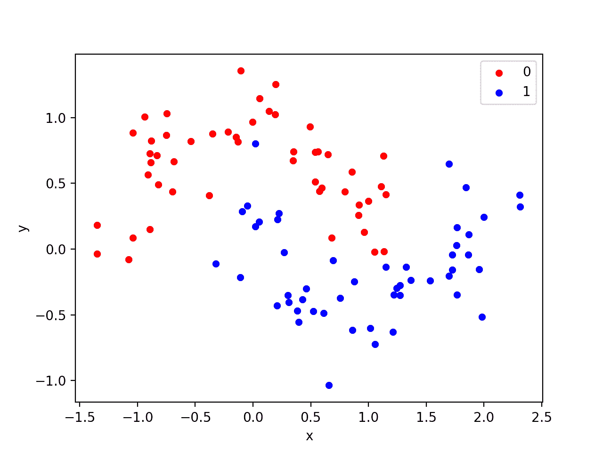
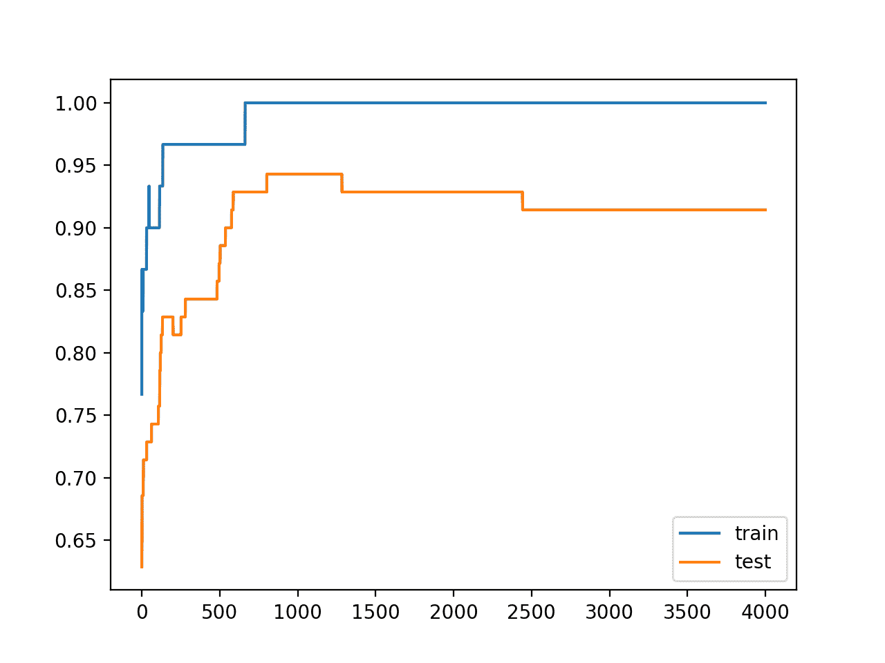
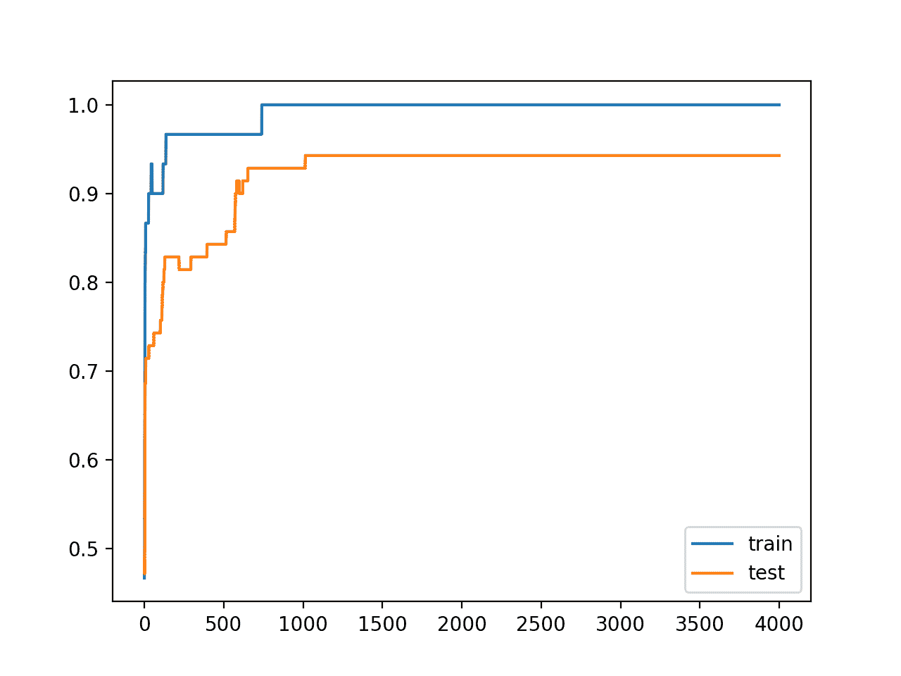
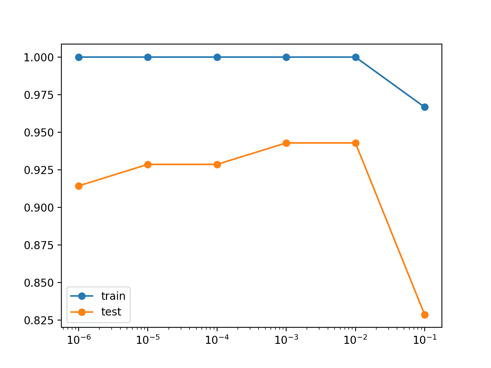

# 如何在 Keras 中利用权重衰减减少神经网络的过拟合

> 原文：<https://machinelearningmastery.com/how-to-reduce-overfitting-in-deep-learning-with-weight-regularization/>

最后更新于 2020 年 8 月 25 日

权重正则化提供了一种方法来减少深度学习神经网络模型对训练数据的过拟合，并提高模型对新数据(如保持测试集)的表现。

权重正则化有多种类型，如 [L1 和 L2 向量范数](https://machinelearningmastery.com/vector-norms-machine-learning/)，每种都需要一个必须配置的超参数。

在本教程中，您将发现如何使用 Keras 在 Python 中应用权重正则化来提高过拟合深度学习神经网络的表现。

完成本教程后，您将知道:

*   如何使用 Keras API 为 MLP、CNN 或 LSTM 神经网络添加权重正则化。
*   书籍和近期研究论文中使用的权重正则化配置示例。
*   如何通过一个案例研究来识别 overfit 模型并使用权重正则化来提高测试表现。

**用我的新书[更好的深度学习](https://machinelearningmastery.com/better-deep-learning/)启动你的项目**，包括*分步教程*和所有示例的 *Python 源代码*文件。

我们开始吧。

*   **2019 年 10 月更新**:针对 Keras 2.3 和 TensorFlow 2.0 更新。


如何通过权重调整减少深度学习中的过拟合
图片由[海阿米尔姆](https://www.flickr.com/photos/seabamirum/8231235048/)提供，保留部分权利。

## 教程概述

本教程分为三个部分；它们是:

1.  Keras 中的权重正则化
2.  权重正则化示例
3.  权重正则化案例研究

## Keras 中的权重正则化应用编程接口

Keras 提供了一个权重调整 API，允许你在[损失函数](https://machinelearningmastery.com/how-to-choose-loss-functions-when-training-deep-learning-neural-networks/)中加入权重大小的惩罚。

提供了三个不同的正则化实例；它们是:

*   L1:绝对重量的总和。
*   L2:重量平方的总和。
*   L1L2:绝对权重和平方权重之和。

正则项在 keras .正则项下提供，名称为 l1、l2 和 l1_l2。每一个都以正则超参数为自变量。例如:

```py
keras.regularizers.l1(0.01)
keras.regularizers.l2(0.01)
keras.regularizers.l1_l2(l1=0.01, l2=0.01)
```

默认情况下，任何层都不使用正则化。

当层在 Keras 模型中定义时，权重正则化器可以被添加到每个层。

这是通过在每一层设置 kernel _ regularizer 参数来实现的。通过 bias _ regularizer 参数，也可以为偏差使用单独的正则化器，尽管这种方法不常用。

让我们看一些例子。

### 致密层的权重正则化

以下示例在密集全连通层上设置 l2 正则化:

```py
# example of l2 on a dense layer
from keras.layers import Dense
from keras.regularizers import l2
...
model.add(Dense(32, kernel_regularizer=l2(0.01), bias_regularizer=l2(0.01)))
...
```

### 卷积层的权重正则化

像密集层一样，卷积层(例如，Conv1D 和 Conv2D)也使用核正则化和偏置正则化参数来定义正则化。

以下示例在 Conv2D 卷积层上设置 l2 正则化:

```py
# example of l2 on a convolutional layer
from keras.layers import Conv2D
from keras.regularizers import l2
...
model.add(Conv2D(32, (3,3), kernel_regularizer=l2(0.01), bias_regularizer=l2(0.01)))
...
```

### 递归层的权重正则化

像 LSTM 这样的循环层在调整权重方面提供了更大的灵活性。

输入、递归和偏差权重都可以通过核正则化、递归正则化和偏差正则化参数分别正则化。

以下示例在 LSTM 递归层上设置 l2 正则化:

```py
# example of l2 on an lstm layer
from keras.layers import LSTM
from keras.regularizers import l2
...
model.add(LSTM(32, kernel_regularizer=l2(0.01), recurrent_regularizer=l2(0.01), bias_regularizer=l2(0.01)))
...
```

## 权重正则化示例

查看文献中报告的一些权重正则化配置的示例可能会有所帮助。

选择和调整特定于您的网络和数据集的正则化技术非常重要，尽管实际示例也可以提供可能是有用的起点的常见配置的概念。

回想一下，0.1 可以用科学符号写成 1E-1 或 1e-1，也可以写成指数 10^-1，0.01 可以写成 1e-2 或 10^-2 等等。

### MLP 权重正则化示例

权重正则化借用了统计学中的惩罚回归模型。

最常见的正则化类型是 L2，也简称为“*权重衰减*”，其值通常在 0 到 0.1 之间的对数标度上，例如 0.1、0.001、0.0001 等。

> λ[正则化超参数]的合理值在 0 和 0.1 之间。

—第 144 页，[应用预测建模](https://amzn.to/2oX2qCD)，2013 年。

多层感知器上的经典文本“[神经锻造:前馈人工神经网络中的监督学习”](https://amzn.to/2PBsezv)”提供了一个工作示例，通过首先在没有任何正则化的情况下训练模型，然后稳步增加惩罚来演示权重衰减的影响。他们用图表证明了权重衰减具有改善最终决策函数的效果。

> ……net 被训练………,权重衰减在 1200 个时期从 0 增加到 1E-5，在 2500 个时期增加到 1E-4，在 400 个时期增加到 1E-3。[……]表面更平滑，过渡更平缓

—第 270 页，[神经锻造:前馈人工神经网络中的监督学习](https://amzn.to/2PBsezv)，1999。

这是一个有趣的过程，可能值得研究。作者还评论了预测重量衰减对问题影响的难度。

> ……很难提前预测需要什么价值才能达到预期的结果。0.001 的值是任意选择的，因为它是一个典型的引用的整数

—第 270 页，[神经锻造:前馈人工神经网络中的监督学习](https://amzn.to/2PBsezv)，1999。

### 美国有线电视新闻网权重正则化示例

权重正则化似乎没有在 CNN 模型中广泛使用，或者如果使用，它的使用也没有被广泛报道。

具有非常小的正则化超参数(例如 0.0005 或 5×10^−4)的 L2 权重正则化可能是一个很好的起点。

多伦多大学的 Alex Krizhevsky 等人在他们 2012 年发表的题为“使用深度卷积神经网络进行图像网络分类”的论文中，为图像网络数据集开发了深度 CNN 模型，实现了当时最先进的结果报告:

> …重量衰减 0.0005。我们发现这少量的重量衰减对模型学习很重要。换句话说，这里的权重衰减不仅仅是一个正则化:它减少了模型的训练误差。

牛津大学的卡伦·西蒙扬和安德鲁·齐塞曼在他们 2015 年发表的题为“用于大规模图像识别的非常深的卷积网络”的论文中，为 ImageNet 数据集开发了一个 CNN，并报告:

> 通过权重衰减(L2 惩罚乘数设置为 5×10^−4)来调整训练

谷歌的 Francois Chollet(也是 Keras 的作者)在 2016 年发表的题为“T0”异常:深度可分离卷积的深度学习的论文中报告了来自谷歌的Inception V3 CNN 模型的权重衰减(从Inception V3 论文中不清楚)以及他对 ImageNet 数据集的改进异常中使用的权重衰减:

> Inception V3 模型使用 4e-5 的权重衰减(L2 正则化)率，这是针对 ImageNet 上的表现精心调整的。我们发现这个速率对于异常来说是非常次优的，而是稳定在 1e-5。

### LSTM 权重正则化示例

LSTM 模型通常使用权重正则化。

经常使用的配置是 L2(权重衰减)和非常小的超参数(例如 10^−6).经常没有报告什么权重是正则化的(输入、递归和/或偏差)，尽管人们会假设输入和递归权重都是正则化的。

来自谷歌大脑的 Gabriel Pereyra 等人在 2017 年发表的题为“通过惩罚自信的输出分布来规范神经网络”的论文中应用 seq2seq LSTMs 模型来预测《华尔街日报》的人物，并报告:

> 所有模型都使用 10^−6 的重量衰减

来自 Google Brain 的 Barret Zoph 和 Quoc Le 在 2017 年发表的题为“使用强化学习的[神经架构搜索](https://arxiv.org/abs/1611.01578)”的论文中提到，“使用 LSTMs 和强化学习来学习网络架构，以最好地解决 CIFAR-10 数据集并报告:

> 1e-4 的重量衰减

来自 Google Brain 和 Nvidia 的 Ron Weiss 等人在他们 2017 年发表的题为“[序列到序列模型可以直接翻译外来语音](https://arxiv.org/abs/1703.08581)”的论文中开发了一个用于语音翻译的序列到序列 LSTM，并报告:

> L2 权重衰减用于 10^−6 权重

## 权重正则化案例研究

在本节中，我们将演示如何使用权重正则化来减少简单二元分类问题上 MLP 的过拟合。

此示例提供了一个模板，用于将权重正则化应用于您自己的神经网络，以解决分类和回归问题。

### 二元分类问题

我们将使用一个标准的二进制分类问题，它定义了两个半圆的观测值:每个类一个半圆。

每个观察都有两个相同规模的输入变量和一个 0 或 1 的类输出值。这个数据集被称为“*卫星*”数据集，因为绘制时每个类别中观测值的形状。

我们可以使用 [make_moons()函数](http://Sklearn.org/stable/modules/generated/sklearn.datasets.make_moons.html)从这个问题中生成观测值。我们将向数据中添加噪声，并为随机数生成器播种，这样每次运行代码时都会生成相同的样本。

```py
# generate 2d classification dataset
X, y = make_moons(n_samples=100, noise=0.2, random_state=1)
```

我们可以绘制数据集，其中两个变量作为图形上的 x 和 y 坐标，类值作为观察的颜色。

下面列出了生成数据集并绘制它的完整示例。

```py
# generate two moons dataset
from sklearn.datasets import make_moons
from matplotlib import pyplot
from pandas import DataFrame
# generate 2d classification dataset
X, y = make_moons(n_samples=100, noise=0.2, random_state=1)
# scatter plot, dots colored by class value
df = DataFrame(dict(x=X[:,0], y=X[:,1], label=y))
colors = {0:'red', 1:'blue'}
fig, ax = pyplot.subplots()
grouped = df.groupby('label')
for key, group in grouped:
    group.plot(ax=ax, kind='scatter', x='x', y='y', label=key, color=colors[key])
pyplot.show()
```

运行该示例会创建一个散点图，显示每个类别中观测值的半圆或月亮形状。我们可以看到点扩散的噪音使得卫星不那么明显。



卫星数据集散点图，带有显示每个样本类别值的颜色

这是一个很好的测试问题，因为类不能用一条线分开，例如不能线性分开，需要一个非线性的方法，如神经网络来解决。

我们只生成了 100 个样本，这对于神经网络来说是很小的，这提供了对训练数据集进行过度训练的机会，并且在测试数据集上具有更高的误差:这是使用正则化的一个很好的例子。此外，样本有噪声，这使得模型有机会学习样本中不一般化的方面。

### 过采样多层感知器模型

我们可以开发一个 MLP 模型来解决这个二元分类问题。

该模型将有一个隐藏层，其中可能需要更多的节点来解决这个问题，从而提供了一个过度填充的机会。我们还将对模型进行比要求更长时间的训练，以确保模型溢出。

在定义模型之前，我们将把数据集分成训练集和测试集，用 30 个例子训练模型，用 70 个例子评估拟合模型的表现。

```py
# generate 2d classification dataset
X, y = make_moons(n_samples=100, noise=0.2, random_state=1)
# split into train and test
n_train = 30
trainX, testX = X[:n_train, :], X[n_train:, :]
trainy, testy = y[:n_train], y[n_train:]
```

接下来，我们可以定义模型。

该模型使用隐藏层中的 500 个节点和校正后的线性激活函数。

输出层使用 sigmoid 激活函数来预测类值 0 或 1。

该模型使用二元交叉熵损失函数进行优化，适用于二元分类问题和高效的 Adam 版本梯度下降。

```py
# define model
model = Sequential()
model.add(Dense(500, input_dim=2, activation='relu'))
model.add(Dense(1, activation='sigmoid'))
model.compile(loss='binary_crossentropy', optimizer='adam', metrics=['accuracy'])
```

然后，定义的模型适用于 4000 个时期的训练数据，默认批量为 32。

```py
# fit model
model.fit(trainX, trainy, epochs=4000, verbose=0)
```

最后，我们可以在测试数据集上评估模型的表现并报告结果。

```py
# evaluate the model
_, train_acc = model.evaluate(trainX, trainy, verbose=0)
_, test_acc = model.evaluate(testX, testy, verbose=0)
print('Train: %.3f, Test: %.3f' % (train_acc, test_acc))
```

我们可以把所有这些部分绑在一起；下面列出了完整的示例。

```py
# overfit mlp for the moons dataset
from sklearn.datasets import make_moons
from keras.layers import Dense
from keras.models import Sequential
# generate 2d classification dataset
X, y = make_moons(n_samples=100, noise=0.2, random_state=1)
# split into train and test
n_train = 30
trainX, testX = X[:n_train, :], X[n_train:, :]
trainy, testy = y[:n_train], y[n_train:]
# define model
model = Sequential()
model.add(Dense(500, input_dim=2, activation='relu'))
model.add(Dense(1, activation='sigmoid'))
model.compile(loss='binary_crossentropy', optimizer='adam', metrics=['accuracy'])
# fit model
model.fit(trainX, trainy, epochs=4000, verbose=0)
# evaluate the model
_, train_acc = model.evaluate(trainX, trainy, verbose=0)
_, test_acc = model.evaluate(testX, testy, verbose=0)
print('Train: %.3f, Test: %.3f' % (train_acc, test_acc))
```

运行该示例会报告列车和测试数据集上的模型表现。

我们可以看到，该模型在训练数据集上的表现优于测试数据集，这可能是过拟合的一个迹象。

**注**:考虑到算法或评估程序的随机性，或数值准确率的差异，您的[结果可能会有所不同](https://machinelearningmastery.com/different-results-each-time-in-machine-learning/)。考虑运行该示例几次，并比较平均结果。

因为模型被严重过拟合，我们通常不会期望模型在同一数据集上重复运行时的准确率有太大差异。

```py
Train: 1.000, Test: 0.914
```

过拟合的另一个标志是训练和测试数据集的模型学习曲线图。

overfit 模型应该在训练和测试中显示准确率增加，并且在某一点上，准确率在测试数据集中下降，但在训练数据集中继续上升。

我们可以更新示例来绘制这些曲线。下面列出了完整的示例。

```py
# overfit mlp for the moons dataset plotting history
from sklearn.datasets import make_moons
from keras.layers import Dense
from keras.models import Sequential
from matplotlib import pyplot
# generate 2d classification dataset
X, y = make_moons(n_samples=100, noise=0.2, random_state=1)
# split into train and test
n_train = 30
trainX, testX = X[:n_train, :], X[n_train:, :]
trainy, testy = y[:n_train], y[n_train:]
# define model
model = Sequential()
model.add(Dense(500, input_dim=2, activation='relu'))
model.add(Dense(1, activation='sigmoid'))
model.compile(loss='binary_crossentropy', optimizer='adam', metrics=['accuracy'])
# fit model
history = model.fit(trainX, trainy, validation_data=(testX, testy), epochs=4000, verbose=0)
# plot history
# summarize history for accuracy
pyplot.plot(history.history['accuracy'], label='train')
pyplot.plot(history.history['val_accuracy'], label='test')
pyplot.legend()
pyplot.show()
```

运行该示例会在列车和测试集上创建模型准确率的线图。

我们可以看到过拟合模型的预期形状，其中测试准确率增加到一个点，然后开始再次降低。



训练时训练和测试数据集的准确率线图

### 带权重正则化的 MLP 模型

我们可以给隐藏层增加权重正则化，以减少模型对训练数据集的过拟合，并提高保持集的表现。

我们将使用 L2 向量范数，也称为权重衰减，正则化参数(称为α或λ)为 0.001，可以任意选择。

这可以通过向层添加 kernel _ regularizer 参数并将其设置为 l2 实例来实现。

```py
model.add(Dense(500, input_dim=2, activation='relu', kernel_regularizer=l2(0.001)))
```

下面列出了使用权重正则化在 moons 数据集上拟合和评估模型的更新示例。

```py
# mlp with weight regularization for the moons dataset
from sklearn.datasets import make_moons
from keras.layers import Dense
from keras.models import Sequential
from keras.regularizers import l2
# generate 2d classification dataset
X, y = make_moons(n_samples=100, noise=0.2, random_state=1)
# split into train and test
n_train = 30
trainX, testX = X[:n_train, :], X[n_train:, :]
trainy, testy = y[:n_train], y[n_train:]
# define model
model = Sequential()
model.add(Dense(500, input_dim=2, activation='relu', kernel_regularizer=l2(0.001)))
model.add(Dense(1, activation='sigmoid'))
model.compile(loss='binary_crossentropy', optimizer='adam', metrics=['accuracy'])
# fit model
model.fit(trainX, trainy, epochs=4000, verbose=0)
# evaluate the model
_, train_acc = model.evaluate(trainX, trainy, verbose=0)
_, test_acc = model.evaluate(testX, testy, verbose=0)
print('Train: %.3f, Test: %.3f' % (train_acc, test_acc))
```

运行该示例会报告模型在列车和测试数据集上的表现。

**注**:考虑到算法或评估程序的随机性，或数值准确率的差异，您的[结果可能会有所不同](https://machinelearningmastery.com/different-results-each-time-in-machine-learning/)。考虑运行该示例几次，并比较平均结果。

我们可以看到训练数据集的准确性没有变化，测试数据集有所改进。

```py
Train: 1.000, Test: 0.943
```

我们预计，过拟合的指示性学习曲线也会通过使用权重正则化而改变。

我们不应该看到模型在测试集上的准确性不断增加，然后又下降，而应该看到它在训练过程中不断上升。

下面列出了拟合模型、绘制训练和测试学习曲线的完整示例。

```py
# mlp with weight regularization for the moons dataset plotting history
from sklearn.datasets import make_moons
from keras.layers import Dense
from keras.models import Sequential
from keras.regularizers import l2
from matplotlib import pyplot
# generate 2d classification dataset
X, y = make_moons(n_samples=100, noise=0.2, random_state=1)
# split into train and test
n_train = 30
trainX, testX = X[:n_train, :], X[n_train:, :]
trainy, testy = y[:n_train], y[n_train:]
# define model
model = Sequential()
model.add(Dense(500, input_dim=2, activation='relu', kernel_regularizer=l2(0.001)))
model.add(Dense(1, activation='sigmoid'))
model.compile(loss='binary_crossentropy', optimizer='adam', metrics=['accuracy'])
# fit model
history = model.fit(trainX, trainy, validation_data=(testX, testy), epochs=4000, verbose=0)
# plot history
# summarize history for accuracy
pyplot.plot(history.history['accuracy'], label='train')
pyplot.plot(history.history['val_accuracy'], label='test')
pyplot.legend()
pyplot.show()
```

运行该示例会创建列车的线形图，并在训练期间测试每个时期的模型准确率。

不出所料，我们看到测试数据集上的学习曲线先上升后平稳，这表明模型可能没有过度训练训练数据集。



在没有过拟合的情况下训练时训练和测试数据集上的准确率线图

### 网格搜索正则化超参数

一旦您可以确认权重正则化可以改进您的 overfit 模型，您就可以测试正则化参数的不同值。

一个好的做法是首先通过 0.0 到 0.1 之间的数量级进行网格搜索，然后一旦找到一个级别，就在该级别上进行网格搜索。

我们可以通过定义要测试的值，循环遍历每个值并记录训练和测试表现，在数量级中进行网格搜索。

```py
...
# grid search values
values = [1e-1, 1e-2, 1e-3, 1e-4, 1e-5, 1e-6]
all_train, all_test = list(), list()
for param in values:
	...
	model.add(Dense(500, input_dim=2, activation='relu', kernel_regularizer=l2(param)))
	...
	all_train.append(train_acc)
	all_test.append(test_acc)
```

一旦我们有了所有的值，我们就可以将结果绘制成线图，以帮助发现列车配置中的任何模式，并测试准确性。

因为参数跳跃数量级(10 的幂)，我们可以使用对数标度创建结果的线图。Matplotlib 库允许通过[semi ogx()函数](https://matplotlib.org/api/_as_gen/matplotlib.pyplot.semilogx.html)进行此操作。例如:

```py
pyplot.semilogx(values, all_train, label='train', marker='o')
pyplot.semilogx(values, all_test, label='test', marker='o')
```

下面列出了月球数据集上网格搜索权重正则化值的完整示例。

```py
# grid search regularization values for moons dataset
from sklearn.datasets import make_moons
from keras.layers import Dense
from keras.models import Sequential
from keras.regularizers import l2
from matplotlib import pyplot
# generate 2d classification dataset
X, y = make_moons(n_samples=100, noise=0.2, random_state=1)
# split into train and test
n_train = 30
trainX, testX = X[:n_train, :], X[n_train:, :]
trainy, testy = y[:n_train], y[n_train:]
# grid search values
values = [1e-1, 1e-2, 1e-3, 1e-4, 1e-5, 1e-6]
all_train, all_test = list(), list()
for param in values:
	# define model
	model = Sequential()
	model.add(Dense(500, input_dim=2, activation='relu', kernel_regularizer=l2(param)))
	model.add(Dense(1, activation='sigmoid'))
	model.compile(loss='binary_crossentropy', optimizer='adam', metrics=['accuracy'])
	# fit model
	model.fit(trainX, trainy, epochs=4000, verbose=0)
	# evaluate the model
	_, train_acc = model.evaluate(trainX, trainy, verbose=0)
	_, test_acc = model.evaluate(testX, testy, verbose=0)
	print('Param: %f, Train: %.3f, Test: %.3f' % (param, train_acc, test_acc))
	all_train.append(train_acc)
	all_test.append(test_acc)
# plot train and test means
pyplot.semilogx(values, all_train, label='train', marker='o')
pyplot.semilogx(values, all_test, label='test', marker='o')
pyplot.legend()
pyplot.show()
```

运行该示例会打印每个评估模型在列车和测试集上的参数值和准确率。

**注**:考虑到算法或评估程序的随机性，或数值准确率的差异，您的[结果可能会有所不同](https://machinelearningmastery.com/different-results-each-time-in-machine-learning/)。考虑运行该示例几次，并比较平均结果。

结果表明，0.01 或 0.001 可能就足够了，并且可以为进一步的网格搜索提供良好的界限。

```py
Param: 0.100000, Train: 0.967, Test: 0.829
Param: 0.010000, Train: 1.000, Test: 0.943
Param: 0.001000, Train: 1.000, Test: 0.943
Param: 0.000100, Train: 1.000, Test: 0.929
Param: 0.000010, Train: 1.000, Test: 0.929
Param: 0.000001, Train: 1.000, Test: 0.914
```

还创建了结果的线图，显示了随着更大的权重正则化参数值，测试准确率的增加，至少在一点上。

我们可以看到，使用最大值 0.1 会导致列车和测试准确率大幅下降。



不同权重正则化参数下训练和测试数据集模型准确率的线图

## 扩展ˌ扩张

本节列出了一些您可能希望探索的扩展教程的想法。

*   **尝试候补**。更新示例以使用 L1 或组合 L1L2 方法代替 L2 正则化。
*   **报告权重定额**。更新示例以计算网络权重的大小，并证明正则化确实使大小变小。
*   **正则化输出层**。更新示例以调整模型的输出层并比较结果。
*   **规范偏差**。更新示例以调整偏差权重并比较结果。
*   **重复模型评估**。更新示例以多次拟合和评估模型，并报告模型表现的平均值和标准差。
*   **沿数量级**的网格搜索。将网格搜索示例更新为在表现最佳的参数值数量级内进行网格搜索。
*   **模型的重复正则化**。创建一个新的示例，继续训练具有不断增加的正则化级别的拟合模型(例如 1E-6、1E-5 等)。)并查看它是否会在测试集上产生表现更好的模型。

如果你探索这些扩展，我很想知道。

## 进一步阅读

如果您想更深入地了解这个主题，本节将提供更多资源。

### 邮件

*   [如何利用 LSTM 网络的权重正则化进行时间序列预测](https://machinelearningmastery.com/use-weight-regularization-lstm-networks-time-series-forecasting/)
*   [机器学习中向量规范的温和介绍](https://machinelearningmastery.com/vector-norms-machine-learning/)

### 应用程序接口

*   [Keras 正则化 API](https://keras.io/regularizers/)
*   [硬核层 API](https://keras.io/layers/core/)
*   [Keras卷积层应用编程接口](https://keras.io/layers/convolutional/)
*   [Keras循环层原料药](https://keras.io/layers/recurrent/)
*   [sklearn . dataset . make _ moons API](http://Sklearn.org/stable/modules/generated/sklearn.datasets.make_moons.html)
*   [matplot lib . pyplot . semilogx API](https://matplotlib.org/api/_as_gen/matplotlib.pyplot.semilogx.html)

## 摘要

在本教程中，您发现了如何使用 Keras 在 Python 中应用权重正则化来提高过拟合深度学习神经网络的表现。

具体来说，您了解到:

*   如何使用 Keras API 为 MLP、CNN 或 LSTM 神经网络添加权重正则化。
*   书籍和近期研究论文中使用的权重正则化配置示例。
*   如何通过一个案例研究来识别 overfit 模型并使用权重正则化来提高测试表现。

你有什么问题吗？
在下面的评论中提问，我会尽力回答。