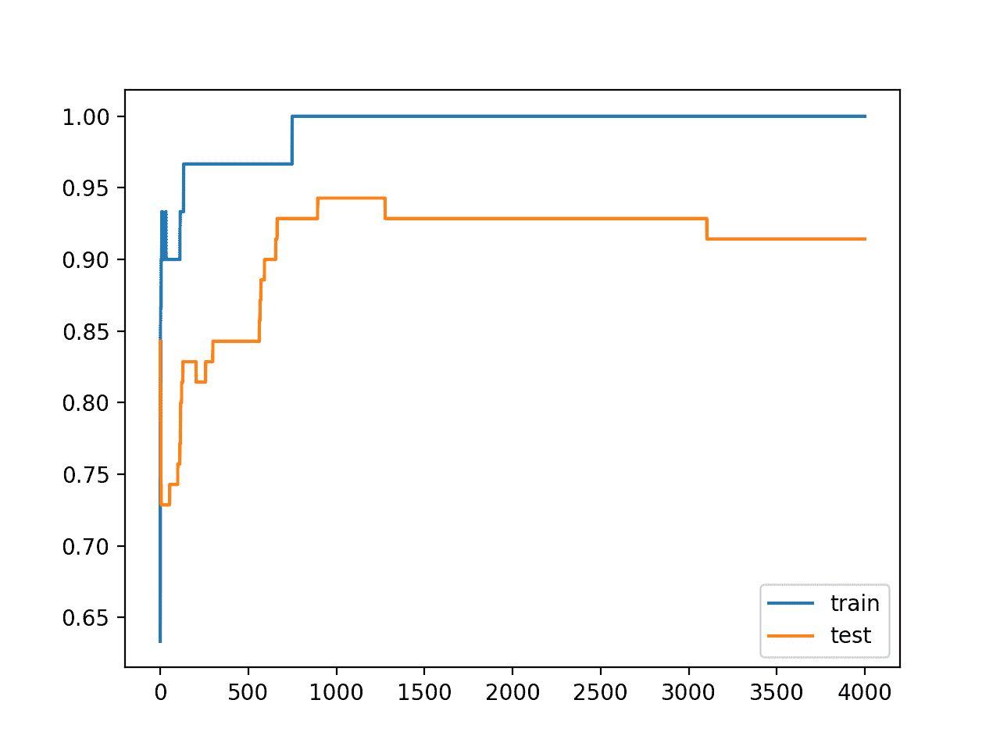
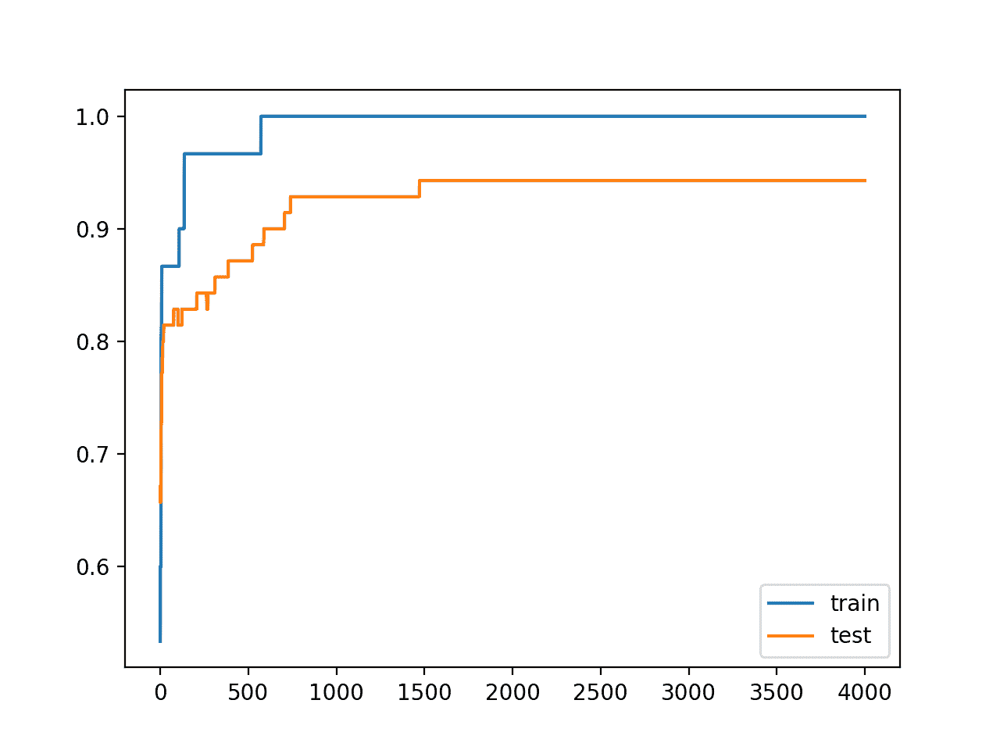

# 如何利用 Keras 中的权重约束减少过拟合

> 原文:[https://machinelearning master . com/如何减少深度神经网络中的过度拟合-权重受限-in-keras/](https://machinelearningmastery.com/how-to-reduce-overfitting-in-deep-neural-networks-with-weight-constraints-in-keras/)

最后更新于 2020 年 8 月 25 日

权重约束提供了一种方法来减少深度学习神经网络模型对训练数据的过拟合，并提高模型对新数据(如保持测试集)的性能。

权重约束有多种类型，如最大和单位[向量范数](https://machinelearningmastery.com/vector-norms-machine-learning/)，有些需要必须配置的超参数。

在本教程中，您将发现用于向深度学习神经网络模型添加权重约束以减少过拟合的 Keras API。

完成本教程后，您将知道:

*   如何使用 Keras API 创建向量范数约束。
*   如何使用 Keras API 为 MLP、CNN 和 RNN 图层添加权重约束。
*   如何通过向现有模型添加权重约束来减少过拟合？

**用我的新书[更好的深度学习](https://machinelearningmastery.com/better-deep-learning/)启动你的项目**，包括*分步教程*和所有示例的 *Python 源代码*文件。

我们开始吧。

*   **2019 年 3 月更新**:修正了一些用法示例中使用等式代替赋值的错别字。
*   **2019 年 10 月更新**:针对 Keras 2.3 和 TensorFlow 2.0 更新。


如何减少深度神经网络中的过拟合在 Keras
中有权重约束。

## 教程概述

本教程分为三个部分；它们是:

1.  喀拉斯的体重限制
2.  层的权重约束
3.  权重约束案例研究

## 喀拉斯的体重限制

Keras API 支持重量限制。

约束是按层指定的，但在层中按节点应用和实施。

使用约束通常包括为输入权重在图层上设置*内核约束*参数，为偏置权重设置*偏置约束*。

通常，权重约束不用于偏置权重。

一组不同的向量规范可以用作约束，在 [keras.constraints 模块](https://github.com/keras-team/keras/blob/master/keras/constraints.py)中作为类提供。它们是:

*   **最大范数** ( *最大 _ 范数*)，强制砝码的量值等于或低于给定限值。
*   **非负范数** ( *非负*，强制权重为正。
*   **单位定额** ( *单位 _ 定额*)，强制砝码的量值为 1.0。
*   **最小-最大范数** ( *最小 _ 最大 _ 范数*)，强制权重的大小在一个范围内。

例如，可以导入和实例化约束:

```
# import norm
from keras.constraints import max_norm
# instantiate norm
norm = max_norm(3.0)
```

## 层的权重约束

重量标准可以用于喀拉斯的大多数图层。

在本节中，我们将看一些常见的例子。

### MLP 权重约束

以下示例在密集完全连接图层上设置最大范数权重约束。

```
# example of max norm on a dense layer
from keras.layers import Dense
from keras.constraints import max_norm
...
model.add(Dense(32, kernel_constraint=max_norm(3), bias_constraint=max_norm(3)))
...
```

### 美国有线电视新闻网重量限制

下面的示例在卷积层上设置了最大范数权重约束。

```
# example of max norm on a cnn layer
from keras.layers import Conv2D
from keras.constraints import max_norm
...
model.add(Conv2D(32, (3,3), kernel_constraint=max_norm(3), bias_constraint=max_norm(3)))
...
```

### RNN 权重约束

与其他层类型不同，递归神经网络允许您对输入权重和偏差以及递归输入权重设置权重约束。

循环权重的约束是通过图层的*循环约束*参数设置的。

以下示例在 LSTM 图层上设置了最大标准权重约束。

```
# example of max norm on an lstm layer
from keras.layers import LSTM
from keras.constraints import max_norm
...
model.add(LSTM(32, kernel_constraint=max_norm(3), recurrent_constraint=max_norm(3), bias_constraint=max_norm(3)))
...
```

既然我们知道了如何使用权重约束应用编程接口，让我们来看看一个成功的例子。

## 权重约束案例研究

在本节中，我们将演示如何使用权重约束来减少简单二元分类问题上 MLP 的过拟合。

此示例提供了一个模板，用于将权重约束应用于您自己的神经网络，以解决分类和回归问题。

### 二元分类问题

我们将使用一个标准的二进制分类问题，它定义了两个半圆的观测值，每个类一个半圆。

每个观察都有两个相同规模的输入变量和一个 0 或 1 的类输出值。这个数据集被称为“*卫星*”数据集，因为绘制时每个类别中观测值的形状。

我们可以使用 [make_moons()函数](http://scikit-learn.org/stable/modules/generated/sklearn.datasets.make_moons.html)从这个问题中生成观测值。我们将向数据中添加噪声，并为随机数生成器播种，这样每次运行代码时都会生成相同的样本。

```
# generate 2d classification dataset
X, y = make_moons(n_samples=100, noise=0.2, random_state=1)
```

我们可以绘制数据集，其中两个变量作为图形上的 x 和 y 坐标，类值作为观察的颜色。

下面列出了生成数据集并绘制它的完整示例。

```
# generate two moons dataset
from sklearn.datasets import make_moons
from matplotlib import pyplot
from pandas import DataFrame
# generate 2d classification dataset
X, y = make_moons(n_samples=100, noise=0.2, random_state=1)
# scatter plot, dots colored by class value
df = DataFrame(dict(x=X[:,0], y=X[:,1], label=y))
colors = {0:'red', 1:'blue'}
fig, ax = pyplot.subplots()
grouped = df.groupby('label')
for key, group in grouped:
    group.plot(ax=ax, kind='scatter', x='x', y='y', label=key, color=colors[key])
pyplot.show()
```

运行该示例会创建一个散点图，显示每个类别中观测值的半圆或月亮形状。我们可以看到点扩散的噪音使得卫星不那么明显。


卫星数据集散点图，带有显示每个样本类别值的颜色

这是一个很好的测试问题，因为类不能用一条线分开，例如不能线性分开，需要一个非线性的方法，如神经网络来解决。

我们只生成了 100 个样本，这对于神经网络来说是很小的，这提供了对训练数据集进行过度训练的机会，并且在测试数据集上具有更高的误差:这是使用正则化的一个很好的例子。此外，样本有噪声，这使得模型有机会学习样本中不一般化的方面。

### 过采样多层感知器

我们可以开发一个 MLP 模型来解决这个二元分类问题。

该模型将有一个隐藏层，该隐藏层的节点可能比解决该问题所需的节点更多，这为过度填充提供了机会。我们还将对模型进行比要求更长时间的训练，以确保模型溢出。

在定义模型之前，我们将把数据集分成训练集和测试集，用 30 个例子训练模型，用 70 个例子评估拟合模型的性能。

```
# generate 2d classification dataset
X, y = make_moons(n_samples=100, noise=0.2, random_state=1)
# split into train and test
n_train = 30
trainX, testX = X[:n_train, :], X[n_train:, :]
trainy, testy = y[:n_train], y[n_train:]
```

接下来，我们可以定义模型。

隐藏层使用隐藏层中的 500 个节点和校正的线性激活函数。输出层使用 sigmoid 激活函数来预测类值 0 或 1。

该模型使用二元交叉熵损失函数进行优化，适用于二元分类问题和高效的 Adam 版本梯度下降。

```
# define model
model = Sequential()
model.add(Dense(500, input_dim=2, activation='relu'))
model.add(Dense(1, activation='sigmoid'))
model.compile(loss='binary_crossentropy', optimizer='adam', metrics=['accuracy'])
```

然后，定义的模型适用于 4000 个时期的训练数据，默认批量为 32。

我们还将使用测试数据集作为验证数据集。

```
# fit model
history = model.fit(trainX, trainy, validation_data=(testX, testy), epochs=4000, verbose=0)
```

我们可以在测试数据集上评估模型的性能并报告结果。

```
# evaluate the model
_, train_acc = model.evaluate(trainX, trainy, verbose=0)
_, test_acc = model.evaluate(testX, testy, verbose=0)
print('Train: %.3f, Test: %.3f' % (train_acc, test_acc))
```

最后，我们将绘制模型在每个时期的列车和测试集上的性能。

如果模型确实过度训练了训练数据集，那么随着模型学习训练数据集中的统计噪声，我们将期望训练集上的精度线图继续增加，并且测试集上升，然后再次下降。

```
# plot history
pyplot.plot(history.history['accuracy'], label='train')
pyplot.plot(history.history['val_accuracy'], label='test')
pyplot.legend()
pyplot.show()
```

我们可以把所有这些部分绑在一起；下面列出了完整的示例。

```
# mlp overfit on the moons dataset
from sklearn.datasets import make_moons
from keras.layers import Dense
from keras.models import Sequential
from matplotlib import pyplot
# generate 2d classification dataset
X, y = make_moons(n_samples=100, noise=0.2, random_state=1)
# split into train and test
n_train = 30
trainX, testX = X[:n_train, :], X[n_train:, :]
trainy, testy = y[:n_train], y[n_train:]
# define model
model = Sequential()
model.add(Dense(500, input_dim=2, activation='relu'))
model.add(Dense(1, activation='sigmoid'))
model.compile(loss='binary_crossentropy', optimizer='adam', metrics=['accuracy'])
# fit model
history = model.fit(trainX, trainy, validation_data=(testX, testy), epochs=4000, verbose=0)
# evaluate the model
_, train_acc = model.evaluate(trainX, trainy, verbose=0)
_, test_acc = model.evaluate(testX, testy, verbose=0)
print('Train: %.3f, Test: %.3f' % (train_acc, test_acc))
# plot history
pyplot.plot(history.history['accuracy'], label='train')
pyplot.plot(history.history['val_accuracy'], label='test')
pyplot.legend()
pyplot.show()
```

运行该示例会报告列车和测试数据集上的模型性能。

我们可以看到，该模型在训练数据集上的性能优于测试数据集，这可能是过度拟合的一个迹象。

**注**:考虑到算法或评估程序的随机性，或数值精度的差异，您的[结果可能会有所不同](https://machinelearningmastery.com/different-results-each-time-in-machine-learning/)。考虑运行该示例几次，并比较平均结果。

因为模型过于精确，我们通常不会期望在同一数据集上模型的重复运行中有太多(如果有的话)精度差异。

```
Train: 1.000, Test: 0.914
```

创建一个图形，显示列车和测试集上模型精度的线图。

我们可以看到过拟合模型的预期形状，其中测试精度增加到一个点，然后开始再次降低。



训练时训练和测试数据集上的精度线图显示出过度拟合

### 重量受限的 MLP 过度捕捞

我们可以更新示例以使用权重约束。

有一些不同的重量限制可供选择。这个模型的一个很好的简单约束是简单地归一化权重，使得范数等于 1.0。

该约束具有强制所有传入权重变小的效果。

我们可以通过使用 Keras 中的*单位 _ 范数*来做到这一点。该约束可以添加到第一个隐藏层，如下所示:

```
model.add(Dense(500, input_dim=2, activation='relu', kernel_constraint=unit_norm()))
```

我们也可以通过使用 *min_max_norm* 并将最小值和最大值设置为 1.0 来获得相同的结果，例如:

```
model.add(Dense(500, input_dim=2, activation='relu', kernel_constraint=min_max_norm(min_value=1.0, max_value=1.0)))
```

我们不能用最大范数约束来达到同样的结果，因为它允许范数等于或低于指定的极限；例如:

```
model.add(Dense(500, input_dim=2, activation='relu', kernel_constraint=max_norm(1.0)))
```

下面列出了带有单位定额约束的完整更新示例:

```
# mlp overfit on the moons dataset with a unit norm constraint
from sklearn.datasets import make_moons
from keras.layers import Dense
from keras.models import Sequential
from keras.constraints import unit_norm
from matplotlib import pyplot
# generate 2d classification dataset
X, y = make_moons(n_samples=100, noise=0.2, random_state=1)
# split into train and test
n_train = 30
trainX, testX = X[:n_train, :], X[n_train:, :]
trainy, testy = y[:n_train], y[n_train:]
# define model
model = Sequential()
model.add(Dense(500, input_dim=2, activation='relu', kernel_constraint=unit_norm()))
model.add(Dense(1, activation='sigmoid'))
model.compile(loss='binary_crossentropy', optimizer='adam', metrics=['accuracy'])
# fit model
history = model.fit(trainX, trainy, validation_data=(testX, testy), epochs=4000, verbose=0)
# evaluate the model
_, train_acc = model.evaluate(trainX, trainy, verbose=0)
_, test_acc = model.evaluate(testX, testy, verbose=0)
print('Train: %.3f, Test: %.3f' % (train_acc, test_acc))
# plot history
pyplot.plot(history.history['accuracy'], label='train')
pyplot.plot(history.history['val_accuracy'], label='test')
pyplot.legend()
pyplot.show()
```

运行该示例会报告列车和测试数据集上的模型性能。

**注**:考虑到算法或评估程序的随机性，或数值精度的差异，您的[结果可能会有所不同](https://machinelearningmastery.com/different-results-each-time-in-machine-learning/)。考虑运行该示例几次，并比较平均结果。

我们可以看到，对权重大小的严格约束确实提高了模型在保持集上的性能，而不影响训练集的性能。

```
Train: 1.000, Test: 0.943
```

回顾训练和测试精度的线图，我们可以看到模型似乎不再过度拟合训练数据集。

列车和测试集上的模型精度继续增加到平稳状态。



带权重约束的训练和测试数据集上的精度线图

## 扩展ˌ扩张

本节列出了一些您可能希望探索的扩展教程的想法。

*   **报告体重定额**。更新示例以计算网络权重的大小，并演示约束确实使大小变小了。
*   **约束输出图层**。更新示例，将约束添加到模型的输出层，并比较结果。
*   **约束偏差**。更新示例，为偏差权重添加约束，并比较结果。
*   **重复评估**。更新示例以多次拟合和评估模型，并报告模型性能的平均值和标准差。

如果你探索这些扩展，我很想知道。

## 进一步阅读

如果您想更深入地了解这个主题，本节将提供更多资源。

### 邮件

*   [机器学习中向量规范的温和介绍](https://machinelearningmastery.com/vector-norms-machine-learning/)

### 应用程序接口

*   [喀拉斯约束应用编程接口](https://keras.io/constraints/)
*   [喀拉斯约束. py](https://github.com/keras-team/keras/blob/master/keras/constraints.py)
*   [硬核层 API](https://keras.io/layers/core/)
*   [喀拉斯卷积层应用编程接口](https://keras.io/layers/convolutional/)
*   [喀拉斯循环层原料药](https://keras.io/layers/recurrent/)
*   [sklearn . dataset . make _ moons API](http://scikit-learn.org/stable/modules/generated/sklearn.datasets.make_moons.html)

## 摘要

在本教程中，您发现了用于向深度学习神经网络模型添加权重约束的 Keras API。

具体来说，您了解到:

*   如何使用 Keras API 创建向量范数约束。
*   如何使用 Keras API 为 MLP、CNN 和 RNN 图层添加权重约束。
*   如何通过向现有模型添加权重约束来减少过拟合？

你有什么问题吗？
在下面的评论中提问，我会尽力回答。