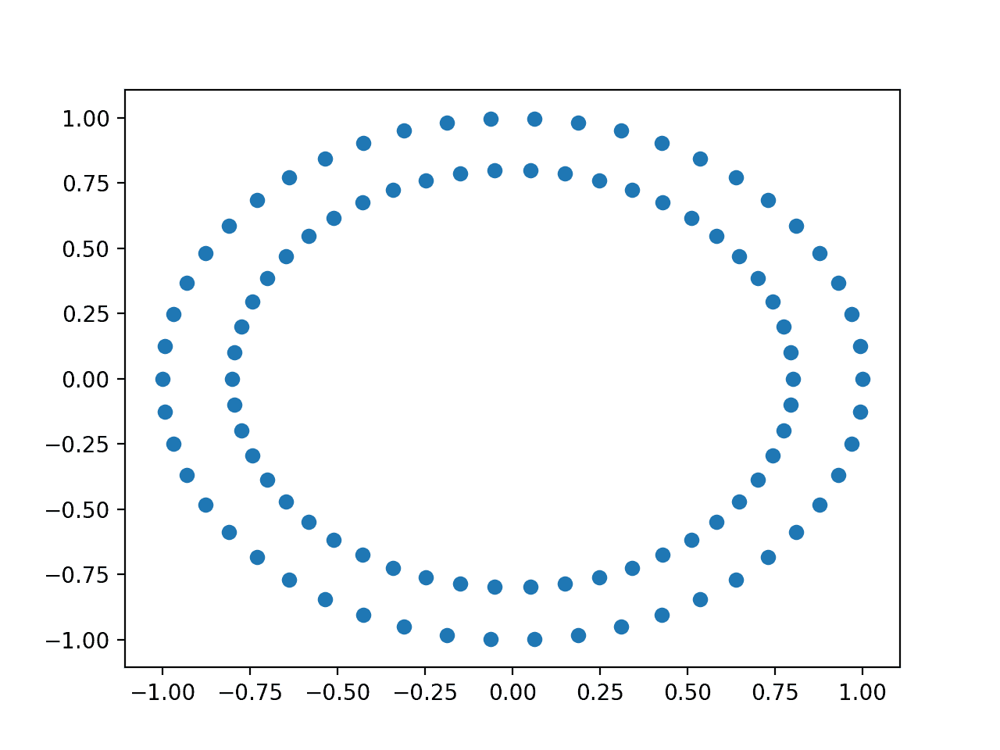
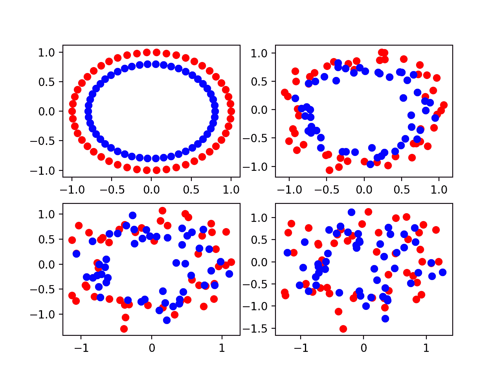
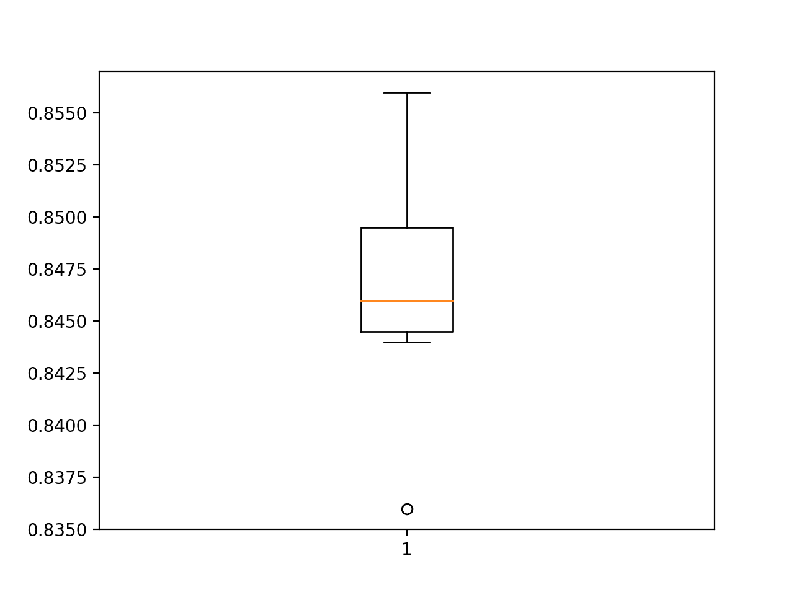
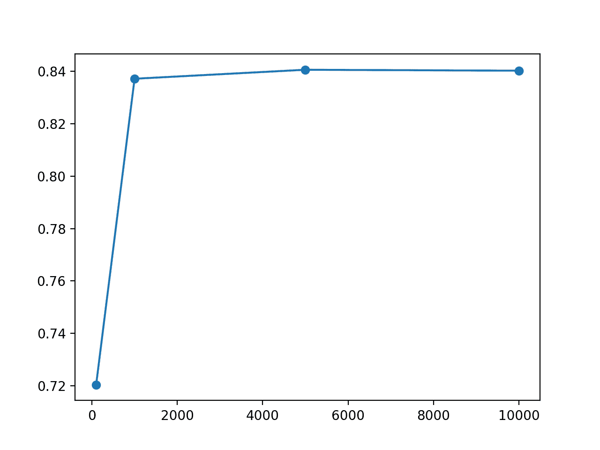
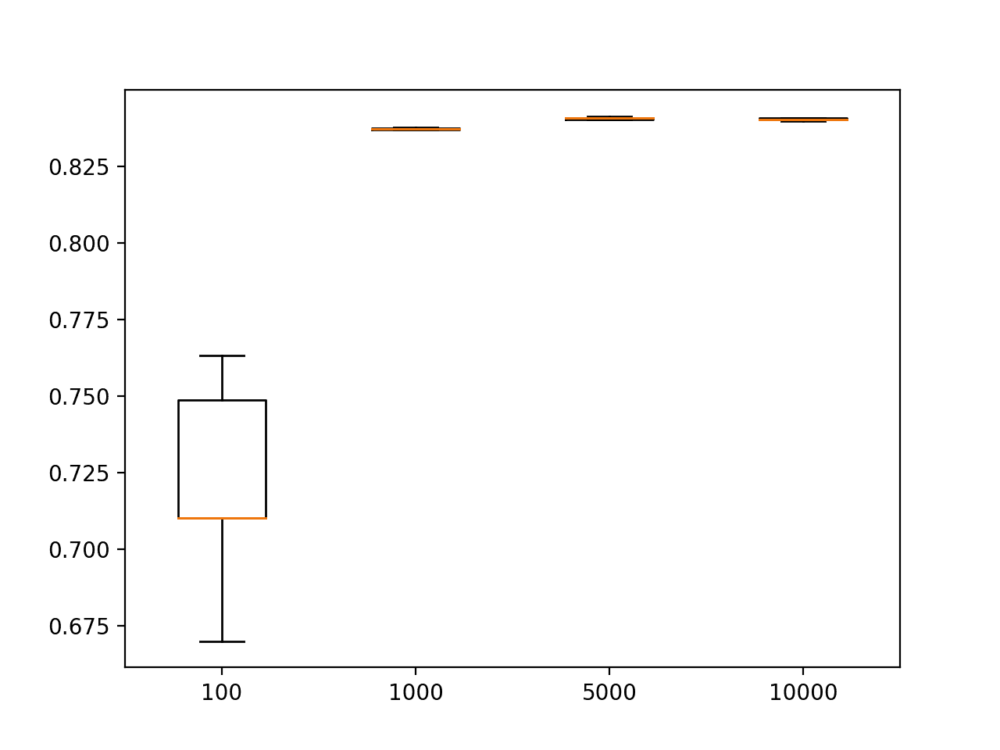
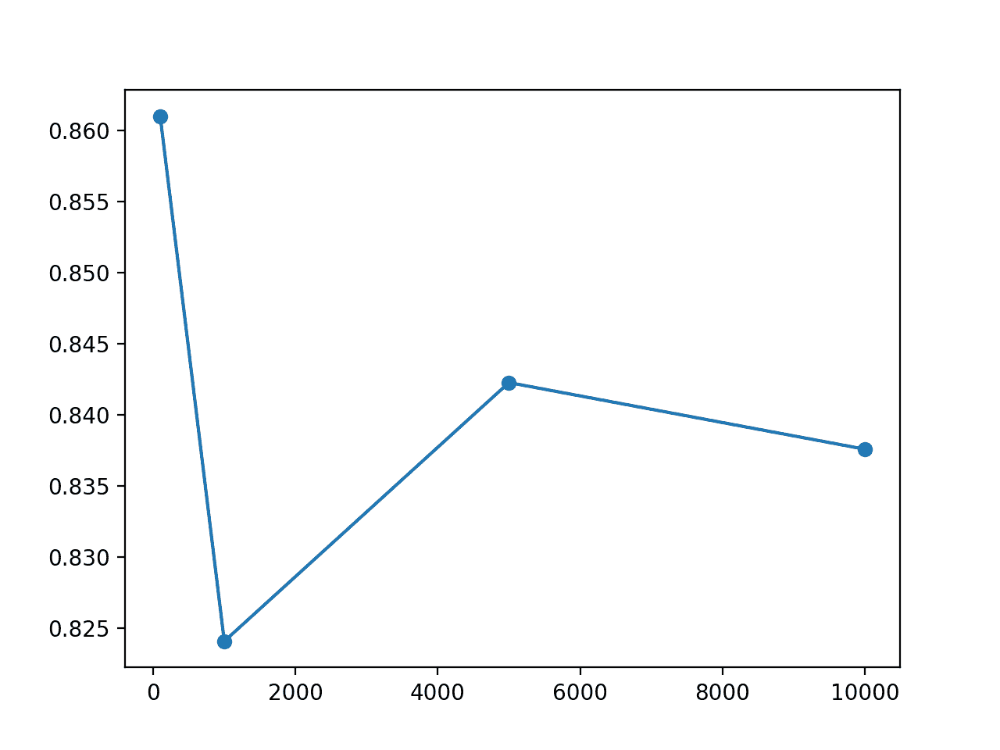
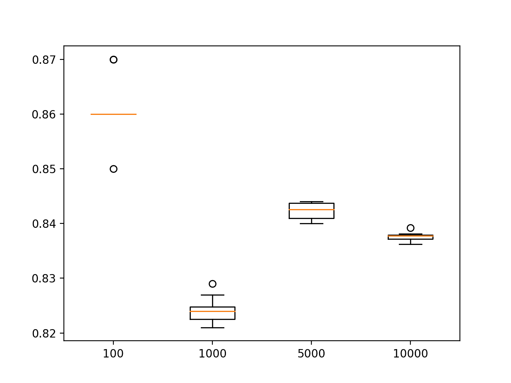

# 数据集大小对深度学习模型技能和表现评估的影响

> 原文：<https://machinelearningmastery.com/impact-of-dataset-size-on-deep-learning-model-skill-and-performance-estimates/>

最后更新于 2020 年 8 月 25 日

监督学习是具有挑战性的，尽管这种挑战的深度经常被学习，然后被遗忘或故意忽略。

情况肯定是这样的，因为在这个挑战上停留太久可能会导致悲观的前景。尽管面临挑战，我们仍继续使用监督学习算法，它们在实践中表现良好。

监督学习挑战的基础是以下问题:

*   从输入到输出合理地逼近未知的底层映射函数需要多少数据？
*   需要多少数据来合理地估计映射函数的近似值的表现？

一般来说，众所周知，训练数据太少会导致近似性差。过度约束的模型会使小的训练数据集不足，而欠约束的模型反过来可能会使训练数据过多，两者都会导致较差的表现。太少的测试数据将导致对模型表现的乐观和高方差估计。

关键是要用工作实例将这个“*常识*”具体化。

在这篇文章中，我们将通过一个详细的案例研究来开发一个关于简单的两类分类问题的多层感知器神经网络。你会发现，在实践中，我们没有足够的数据来学习映射函数或评估模型，然而像神经网络这样的监督学习算法仍然非常有效。

*   如何分析两个圆的分类问题并测量神经网络学习算法引入的方差？
*   训练数据集大小的变化如何直接影响由神经网络近似的映射函数的质量。
*   测试数据集大小的变化如何直接影响拟合神经网络模型表现的估计质量。

**用我的新书[更好的深度学习](https://machinelearningmastery.com/better-deep-learning/)启动你的项目**，包括*分步教程*和所有示例的 *Python 源代码*文件。

我们开始吧。


数据集大小对深度学习模型技能和表现评估的影响
图片由 [Eneas De Troya](https://www.flickr.com/photos/eneas/13632855754/) 提供，保留部分权利。

## 教程概述

本教程分为五个部分；它们是:

1.  监督学习的挑战
2.  圆问题导论
3.  神经网络模型方差
4.  研究测试精度与训练集大小的关系
5.  研究测试集大小与测试集准确性

## 圆问题导论

作为我们探索的基础，我们将使用一个非常简单的两类或二元分类问题。

Sklearn 库提供了 [make_circles()函数](http://Sklearn.org/stable/modules/generated/sklearn.datasets.make_circles.html)，该函数可用于创建具有规定样本数和统计噪声的二进制分类问题。

每个示例都有两个输入变量，用于定义点在二维平面上的 *x* 和 *y* 坐标。这两个类的点排列成两个同心圆(它们有相同的中心)。

数据集中的点数由参数指定，其中一半将从每个圆中绘制。通过定义噪声标准偏差的“*噪声*”参数对点进行采样时，可以添加高斯噪声，其中 0.0 表示没有噪声或从圆圈中精确绘制的点。[伪随机数发生器](https://machinelearningmastery.com/how-to-generate-random-numbers-in-python/)的种子可以通过“*随机状态*参数指定，该参数允许每次调用函数时对完全相同的点进行采样。

下面的示例从两个没有噪声且值为 1 的圆生成 100 个示例来播种伪随机数发生器。

```py
# example of generating circles dataset
from sklearn.datasets import make_circles
# generate circles
X, y = make_circles(n_samples=100, noise=0.0, random_state=1)
# show size of the dataset
print(X.shape, y.shape)
# show first few examples
for i in range(5):
	print(X[i], y[i])
```

运行该示例会生成点，并打印样本的输入( *X* )和输出( *y* )组件的形状。我们可以看到，对于 *x* 和 *y* 坐标，有 100 个输入示例，每个示例有两个特征，输出变量或类值的 100 个匹配示例有 1 个变量。

显示了数据集的前五个示例。我们可以看到输入变量的 *x* 和 *y* 分量以 0.0 为中心，并且有边界[-1，1]。我们还可以看到，类值是 0 或 1 的整数，并且示例在类之间进行了混合。

```py
(100, 2) (100,)
[-0.6472136 -0.4702282] 1
[-0.34062343 -0.72386164] 1
[-0.53582679 -0.84432793] 0
[-0.5831749  -0.54763768] 1
[ 0.50993919 -0.61641059] 1
```

### 绘制数据集

我们可以重新运行该示例，并在给定相同伪随机数发生器种子的情况下，始终获得相同的“*随机生成的*”点。

下面的示例生成相同的点，并使用散点图绘制样本的输入变量。我们可以使用[散点()matplotlib 函数](https://matplotlib.org/api/_as_gen/matplotlib.pyplot.scatter.html)来创建图，并将第一个变量用于 *x* 坐标，第二个变量用于图中的 *y* 坐标传递到 *X* 数组的所有行中。

```py
# example of creating a scatter plot of the circles dataset
from sklearn.datasets import make_circles
from matplotlib import pyplot
# generate circles
X, y = make_circles(n_samples=100, noise=0.0, random_state=1)
# scatter plot of generated dataset
pyplot.scatter(X[:, 0], X[:, 1])
pyplot.show()
```

运行该示例会创建一个散点图，清晰显示数据集的同心圆。



圆形数据集输入变量的散点图

我们可以重新创建散点图，而是绘制 0 类蓝色的所有输入样本和 1 类红色的所有点。

我们可以使用 [where() NumPy 函数](https://docs.scipy.org/doc/numpy/reference/generated/numpy.where.html)选择 y 数组中具有给定值的样本的索引，然后使用这些索引选择 *X* 数组中的行。完整的例子如下。

```py
#  scatter plot of the circles dataset with points colored by class
from sklearn.datasets import make_circles
from numpy import where
from matplotlib import pyplot
# generate circles
X, y = make_circles(n_samples=100, noise=0.0, random_state=1)
# select indices of points with each class label
zero_ix, one_ix = where(y == 0), where(y == 1)
# points for class zero
pyplot.scatter(X[zero_ix, 0], X[zero_ix, 1], color='red')
# points for class one
pyplot.scatter(X[one_ix, 0], X[one_ix, 1], color='blue')
pyplot.show()
```

运行该示例，我们可以看到类 0 的样本是蓝色的内圆，类的样本属于红色的外圆。


按类别值着色的圆形数据集的输入变量散点图

### 具有不同噪声的图

所有真实数据都有统计噪声。更多的统计噪声意味着学习算法将输入变量映射到输出或目标变量的问题更具挑战性。

圆形数据集允许我们通过“*噪声*”参数模拟噪声对样本的添加。

我们可以创建一个名为*散点图 _ 圆 _ 问题()*的新函数，该函数创建一个具有给定噪声量的数据集，并创建一个散点图，其中的点按其类值着色。

```py
# create a scatter plot of the circles dataset with the given amount of noise
def scatter_plot_circles_problem(noise_value):
	# generate circles
	X, y = make_circles(n_samples=100, noise=noise_value, random_state=1)
	# select indices of points with each class label
	zero_ix, one_ix = where(y == 0), where(y == 1)
	# points for class zero
	pyplot.scatter(X[zero_ix, 0], X[zero_ix, 1], color='red')
	# points for class one
	pyplot.scatter(X[one_ix, 0], X[one_ix, 1], color='blue')
```

我们可以用不同数量的噪声多次调用这个函数，看看对问题复杂性的影响。

我们将通过 4 乘 4 矩阵中的[子图()matplotlib 函数](https://matplotlib.org/api/_as_gen/matplotlib.pyplot.subplot.html)创建四个散点图作为子图，噪声值为[0.0，0.1，0.2，0.3]。下面列出了完整的示例。

```py
# scatter plots of the circles dataset with varied amounts of noise
from sklearn.datasets import make_circles
from numpy import where
from matplotlib import pyplot

# create a scatter plot of the circles dataset with the given amount of noise
def scatter_plot_circles_problem(noise_value):
	# generate circles
	X, y = make_circles(n_samples=100, noise=noise_value, random_state=1)
	# select indices of points with each class label
	zero_ix, one_ix = where(y == 0), where(y == 1)
	# points for class zero
	pyplot.scatter(X[zero_ix, 0], X[zero_ix, 1], color='red')
	# points for class one
	pyplot.scatter(X[one_ix, 0], X[one_ix, 1], color='blue')

# vary noise and plot
values = [0.0, 0.1, 0.2, 0.3]
for i in range(len(values)):
	value = 220 + (i+1)
	pyplot.subplot(value)
	scatter_plot_circles_problem(values[i])
pyplot.show()
```

运行该示例，创建了一个具有四个子情节的绘图，分别针对左上角、右上角、左下角和右下角的四个不同噪声值[0.0、0.1、0.2、0.3]中的每一个。

我们可以看到，少量的噪声 0.1 使问题具有挑战性，但仍然可以区分。0.0 的噪声值是不现实的，如此完美的数据集不需要机器学习。0.2 的噪声值会使问题变得非常有挑战性，而 0.3 的值可能会使问题变得太有挑战性而无法学习。



根据统计噪声量变化的圆形数据集的四个散点图

### 不同样本量的图

我们可以用不同数量的样本创建一个类似的问题图。

更多的样本给了学习算法更多的机会去理解输入到输出的潜在映射，进而得到一个更好的模型。

我们可以更新*散点图圆问题()*函数，把要生成的样本数作为自变量，也可以把噪声量作为自变量，将噪声设置为默认值 0.1，这样会让问题有噪声，但不会太吵。

```py
# create a scatter plot of the circles problem
def scatter_plot_circles_problem(n_samples, noise_value=0.1):
	# generate circles
	X, y = make_circles(n_samples=n_samples, noise=noise_value, random_state=1)
	# select indices of points with each class label
	zero_ix, one_ix = where(y == 0), where(y == 1)
	# points for class zero
	pyplot.scatter(X[zero_ix, 0], X[zero_ix, 1], color='red')
	# points for class one
	pyplot.scatter(X[one_ix, 0], X[one_ix, 1], color='blue')
```

我们可以调用这个函数来创建多个具有不同点数的散点图，在两个圆或类之间均匀分布。

我们将使用以下大小的样本[50，100，500，1000]来尝试问题的版本。下面列出了完整的示例。

```py
# scatter plots of the circles dataset with varied sample sizes
from sklearn.datasets import make_circles
from numpy import where
from matplotlib import pyplot

# create a scatter plot of the circles problem
def scatter_plot_circles_problem(n_samples, noise_value=0.1):
	# generate circles
	X, y = make_circles(n_samples=n_samples, noise=noise_value, random_state=1)
	# select indices of points with each class label
	zero_ix, one_ix = where(y == 0), where(y == 1)
	# points for class zero
	pyplot.scatter(X[zero_ix, 0], X[zero_ix, 1], color='red')
	# points for class one
	pyplot.scatter(X[one_ix, 0], X[one_ix, 1], color='blue')

# vary sample size and plot
values = [50, 100, 500, 1000]
for i in range(len(values)):
	value = 220 + (i+1)
	pyplot.subplot(value)
	scatter_plot_circles_problem(values[i])
pyplot.show()
```

运行该示例会创建一个包含四个子情节的绘图，分别针对左上角、右上角、左下角和右下角不同大小的样本[50、100、500、1000]各一个。

我们可以看到，50 个例子可能太少，甚至 100 分看起来也不足以真正学会这个问题。这些图表明，500 个和 1000 个例子可能更容易学习，尽管隐藏了许多“*异常值*”导致两个圆圈重叠的事实。


圆形数据集的四个散点图因样本量而异

## 神经网络模型方差

我们可以用神经网络来模拟圆的问题。

具体来说，我们可以训练一个多层感知器模型，简称 MLP，为模型提供从圆问题生成的输入和输出示例。一旦学会，我们可以通过使用模型对新的例子进行预测并评估其准确性来评估模型对问题的学习程度。

我们可以使用 [Keras 深度学习库](https://keras.io/)为该问题开发一个小 MLP，该库有两个输入、隐藏层中的 25 个节点和一个输出。修正的线性激活函数可以用于隐藏层中的节点。由于该问题是一个二元分类问题，因此该模型可以使用输出层上的 sigmoid 激活函数来预测样本属于类别 0 或 1 的概率。

可以使用称为 [Adam](https://machinelearningmastery.com/adam-optimization-algorithm-for-deep-learning/) 的小批量随机梯度下降的有效版本来训练模型，其中模型中的每个权重都有其自己的自适应学习速率。二元交叉熵损失函数可以用作优化的基础，其中较小的损失值表示更好的模型拟合。

```py
# define model
model = Sequential()
model.add(Dense(25, input_dim=2, activation='relu'))
model.add(Dense(1, activation='sigmoid'))
model.compile(loss='binary_crossentropy', optimizer='adam', metrics=['accuracy'])
```

我们需要从圆问题生成的样本来训练模型，并且需要一个单独的测试集来训练模型，该测试集可用于估计模型在对新数据进行预测时的平均表现。

下面的 *create_dataset()* 函数将创建这些给定大小的训练和测试集，并使用 0.1 的默认噪声。

```py
# create a test dataset
def create_dataset(n_train, n_test, noise=0.1):
	# generate samples
	n_samples = n_train + n_test
	X, y = make_circles(n_samples=n_samples, noise=noise, random_state=1)
	# split into train and test
	trainX, testX = X[:n_train, :], X[n_train:, :]
	trainy, testy = y[:n_train], y[n_train:]
	# return samples
	return trainX, trainy, testX, testy
```

我们可以调用这个函数来准备分成输入和输出组件的训练和测试集。

```py
# create dataset
trainX, trainy, testX, testy = create_dataset(500, 500)
```

一旦我们定义了数据集和模型，我们就可以训练模型了。我们将在训练数据集上训练模型 500 个时期。

```py
# fit model
history = model.fit(trainX, trainy, epochs=500, verbose=0)
```

一旦拟合，我们使用模型对测试集的输入示例进行预测，并将它们与测试集的真实输出值进行比较，然后计算准确性分数。

*evaluate()* 函数执行此操作，返回测试数据集上模型的损失和精度。我们可以忽略损失并显示精度，以了解模型在将随机示例从圆形域映射到 0 类或 1 类方面的表现。

```py
# evaluate the model
_, test_acc = model.evaluate(testX, testy, verbose=0)
print('Test Accuracy: %.3f' % (test_acc*100))
```

将所有这些结合在一起，下面列出了完整的示例。

```py
# mlp evaluated on the circles dataset
from sklearn.datasets import make_circles
from keras.layers import Dense
from keras.models import Sequential

# create a test dataset
def create_dataset(n_train, n_test, noise=0.1):
	# generate samples
	n_samples = n_train + n_test
	X, y = make_circles(n_samples=n_samples, noise=noise, random_state=1)
	# split into train and test
	trainX, testX = X[:n_train, :], X[n_train:, :]
	trainy, testy = y[:n_train], y[n_train:]
	# return samples
	return trainX, trainy, testX, testy

# create dataset
trainX, trainy, testX, testy = create_dataset(500, 500)
# define model
model = Sequential()
model.add(Dense(25, input_dim=2, activation='relu'))
model.add(Dense(1, activation='sigmoid'))
model.compile(loss='binary_crossentropy', optimizer='adam', metrics=['accuracy'])
# fit model
history = model.fit(trainX, trainy, epochs=500, verbose=0)
# evaluate the model
_, test_acc = model.evaluate(testX, testy, verbose=0)
print('Test Accuracy: %.3f' % (test_acc*100))
```

运行该示例会生成数据集，在训练数据集上拟合模型，并在测试数据集上评估模型。

**注**:考虑到算法或评估程序的随机性，或数值精度的差异，您的[结果可能会有所不同](https://machinelearningmastery.com/different-results-each-time-in-machine-learning/)。考虑运行该示例几次，并比较平均结果。

在这种情况下，模型达到了大约 84.4%的估计精度。

```py
Test Accuracy: 84.400
```

### 随机学习算法

这个例子的一个问题是你的结果可能会有所不同。

每次运行示例时，您可能会看到不同的估计精度。

再次运行该示例，我看到估计准确率约为 84.8%。同样，您的具体结果可能会有所不同。

```py
Test Accuracy: 84.800
```

每次运行示例时，数据集中的示例都是相同的。这是因为我们在创建样本时修复了伪随机数发生器。样本确实有噪音，但我们每次都收到相同的噪音。

神经网络是一种非线性学习算法，意味着它们可以学习输入变量和输出变量之间复杂的非线性关系。它们可以逼近具有挑战性的非线性函数。

因此，我们称神经网络模型具有低偏差和高方差。它们的偏差很小，因为该方法对映射函数的数学函数形式几乎不做假设。它们具有很高的方差，因为它们对用于训练模型的具体例子很敏感。训练示例中的差异可能意味着非常不同的结果模型，进而具有不同的技能。

尽管神经网络是一种高方差低偏差的方法，但这并不是在相同生成的数据点上运行相同算法时估计表现差异的原因。

相反，由于学习算法是随机的，我们在多次运行中看到了表现的差异。

学习算法使用随机性元素来帮助模型平均学习如何在训练数据集中将输入变量映射到输出变量。随机性的示例包括用于初始化模型权重的小随机值，以及在每个训练时期之前对训练数据集中的示例进行随机排序。

这是有用的随机性，因为它允许模型自动“*”发现*”映射函数的好解。

这可能会令人沮丧，因为每次运行学习算法时，它经常会找到不同的解决方案，有时解决方案之间的差异很大，导致在对新数据进行预测时模型的估计表现存在差异。

### 平均模型表现

我们可以通过总结该方法在多次运行中的表现来抵消特定神经网络发现的解决方案中的差异。

这包括在同一数据集上多次拟合同一算法，但允许每次运行算法时，学习算法中使用的随机性发生变化。每次运行时，在相同的测试集上评估模型，并记录分数。在所有重复结束时，使用平均值和标准偏差总结分数的分布。

模型在多次运行中的平均表现给出了特定数据集上特定模型的平均表现。分数的分布或标准差给出了学习算法引入的方差的概念。

我们可以将单个 MLP 的评估转移到一个获取数据集并返回测试集精度的函数。下面的 *evaluate_model()* 函数实现了这个行为。

```py
# evaluate an mlp model
def evaluate_model(trainX, trainy, testX, testy):
	# define model
	model = Sequential()
	model.add(Dense(25, input_dim=2, activation='relu'))
	model.add(Dense(1, activation='sigmoid'))
	model.compile(loss='binary_crossentropy', optimizer='adam', metrics=['accuracy'])
	# fit model
	model.fit(trainX, trainy, epochs=500, verbose=0)
	# evaluate the model
	_, test_acc = model.evaluate(testX, testy, verbose=0)
	return test_acc
```

然后我们可以多次调用这个函数，比如 10 次、30 次或更多次。

考虑到[大数定律](https://machinelearningmastery.com/a-gentle-introduction-to-the-law-of-large-numbers-in-machine-learning/)，更多的运行将意味着更精确的估计。为了保持跑步时间适中，我们将重复跑步 10 次。

```py
# evaluate model
n_repeats = 10
scores = list()
for i in range(n_repeats):
	# evaluate model
	score = evaluate_model(trainX, trainy, testX, testy)
	# store score
	scores.append(score)
	# summarize score for this run
	print('>%d: %.3f' % (i+1, score*100))
```

然后，在这些运行结束时，将报告分数的平均值和标准偏差。我们也可以通过[箱线图()matplotlib 函数](https://matplotlib.org/api/_as_gen/matplotlib.pyplot.boxplot.html)使用箱线图和触须图来总结分布。

```py
# report distribution of scores
mean_score, std_score = mean(scores)*100, std(scores)*100
print('Score Over %d Runs: %.3f (%.3f)' % (n_repeats, mean_score, std_score))
# plot distribution
pyplot.boxplot(scores)
pyplot.show()
```

将所有这些元素结合在一起，下面列出了在圆形数据集上重复评估 MLP 模型的示例。

```py
# repeated evaluation of mlp on the circles dataset
from sklearn.datasets import make_circles
from keras.layers import Dense
from keras.models import Sequential
from numpy import mean
from numpy import std
from matplotlib import pyplot

# create a test dataset
def create_dataset(n_train, n_test, noise=0.1):
	# generate samples
	n_samples = n_train + n_test
	X, y = make_circles(n_samples=n_samples, noise=noise, random_state=1)
	# split into train and test
	trainX, testX = X[:n_train, :], X[n_train:, :]
	trainy, testy = y[:n_train], y[n_train:]
	# return samples
	return trainX, trainy, testX, testy

# evaluate an mlp model
def evaluate_model(trainX, trainy, testX, testy):
	# define model
	model = Sequential()
	model.add(Dense(25, input_dim=2, activation='relu'))
	model.add(Dense(1, activation='sigmoid'))
	model.compile(loss='binary_crossentropy', optimizer='adam', metrics=['accuracy'])
	# fit model
	model.fit(trainX, trainy, epochs=500, verbose=0)
	# evaluate the model
	_, test_acc = model.evaluate(testX, testy, verbose=0)
	return test_acc

# create dataset
trainX, trainy, testX, testy = create_dataset(500, 500)
# evaluate model
n_repeats = 10
scores = list()
for i in range(n_repeats):
	# evaluate model
	score = evaluate_model(trainX, trainy, testX, testy)
	# store score
	scores.append(score)
	# summarize score for this run
	print('>%d: %.3f' % (i+1, score*100))
# report distribution of scores
mean_score, std_score = mean(scores)*100, std(scores)*100
print('Score Over %d Runs: %.3f (%.3f)' % (n_repeats, mean_score, std_score))
# plot distribution
pyplot.boxplot(scores)
pyplot.show()
```

运行示例首先报告模型在每次重复评估中的得分。

**注**:考虑到算法或评估程序的随机性，或数值精度的差异，您的[结果可能会有所不同](https://machinelearningmastery.com/different-results-each-time-in-machine-learning/)。考虑运行该示例几次，并比较平均结果。

重复结束时，平均分数约为 84.7%，标准偏差约为 0.5%。这意味着，对于在特定训练集上训练并在特定测试集上评估的特定模型，99%的运行将导致 83.2%到 86.2%之间的测试精度，给定与平均值的三个标准偏差。

毫无疑问，10 的小样本量导致了这些估计的一些误差。

```py
>1: 84.600
>2: 84.800
>3: 85.400
>4: 85.000
>5: 83.600
>6: 85.600
>7: 84.400
>8: 84.600
>9: 84.600
>10: 84.400
Score Over 10 Runs: 84.700 (0.531)
```

创建了测试准确度分数的方框图，显示了由方框表示的分数的中间 50%(称为四分位数范围)，范围从略低于 84.5%到略低于 85%。

我们还可以看到，观察到的 83%的值可能是一个异常值，因为它被表示为一个点。



MLP 圆问题测试精度的盒须图

## 研究测试精度与训练集大小的关系

给定固定数量的统计噪声和固定但合理配置的模型，学习圆问题需要多少个例子？

我们可以通过评估适合不同大小训练数据集的 MLP 模型的表现来研究这个问题。

作为一个基础，我们可以定义大量的例子，我们认为这些例子足以学习这个问题，比如 10 万个。我们可以将此作为训练示例数量的上限，并在测试集中使用这许多示例。我们将定义一个在这个数据集上表现良好的模型，作为有效地学习了两个圆问题的模型。

然后，我们可以通过用不同大小的训练数据集拟合模型来进行实验，并在测试集上评估它们的表现。

太少的例子将导致低的测试精度，可能是因为所选择的模型超过了训练集或者训练集不足以代表问题。

太多的例子会导致好的，但可能比理想的测试精度稍低，可能是因为所选的模型没有能力学习如此大的训练数据集的细微差别，或者数据集过度代表了问题。

训练数据集大小对模型测试准确性的线形图应该显示收益递减点的增长趋势，甚至可能是表现的最终轻微下降。

我们可以使用上一节中定义的 *create_dataset()* 函数来创建训练和测试数据集，并将测试集参数的大小设置为默认值 100，000 个示例，同时允许指定训练集的大小，并随每次调用而变化。重要的是，我们希望对每个不同大小的训练数据集使用相同的测试集。

```py
# create train and test datasets
def create_dataset(n_train, n_test=100000, noise=0.1):
	# generate samples
	n_samples = n_train + n_test
	X, y = make_circles(n_samples=n_samples, noise=noise, random_state=1)
	# split into train and test, first n for test
	trainX, testX = X[n_test:, :], X[:n_test, :]
	trainy, testy = y[n_test:], y[:n_test]
	# return samples
	return trainX, trainy, testX, testy
```

我们可以直接使用上一节中相同的 *evaluate_model()* 函数来拟合和评估给定列车和测试集上的 MLP 模型。

```py
# evaluate an mlp model
def evaluate_model(trainX, trainy, testX, testy):
	# define model
	model = Sequential()
	model.add(Dense(25, input_dim=2, activation='relu'))
	model.add(Dense(1, activation='sigmoid'))
	model.compile(loss='binary_crossentropy', optimizer='adam', metrics=['accuracy'])
	# fit model
	model.fit(trainX, trainy, epochs=500, verbose=0)
	# evaluate the model
	_, test_acc = model.evaluate(testX, testy, verbose=0)
	return test_acc
```

我们可以创建一个新的函数来执行给定模型的重复评估，以解释随机学习算法。

下面的 *evaluate_size()* 函数将训练集的大小以及重复次数作为参数，默认为 5 次，以保持运行时间下降。创建 *create_dataset()* 函数来创建训练集和测试集，然后重复调用 *evaluate_model()* 函数来评估模型。然后，该函数返回重复得分列表。

```py
# repeated evaluation of mlp model with dataset of a given size
def evaluate_size(n_train, n_repeats=5):
	# create dataset
	trainX, trainy, testX, testy = create_dataset(n_train)
	# repeat evaluation of model with dataset
	scores = list()
	for _ in range(n_repeats):
		# evaluate model for size
		score = evaluate_model(trainX, trainy, testX, testy)
		scores.append(score)
	return scores
```

然后可以重复调用这个函数。我猜想，在 1000 到 10000 个问题的例子之间的某个地方就足以学会这个问题，其中足够意味着测试精度只有很小的分数差异。

因此，我们将调查 100、1，000、5，000 和 10，000 个示例的训练集大小。将报告每种测试规模的平均测试精度，以便了解进展情况。

```py
# define dataset sizes to evaluate
sizes = [100, 1000, 5000, 10000]
score_sets, means = list(), list()
for n_train in sizes:
	# repeated evaluate model with training set size
	scores = evaluate_size(n_train)
	score_sets.append(scores)
	# summarize score for size
	mean_score = mean(scores)
	means.append(mean_score)
	print('Train Size=%d, Test Accuracy %.3f' % (n_train, mean_score*100))
```

在运行结束时，将创建一个线图来显示列车组大小和模型测试组精度之间的关系。我们预计会看到一个指数曲线，从低精度到收益递减点。

还创建了每个测试集大小的分数分布的方框图和触须图。随着训练集大小的增加，我们预计测试精度的分布会缩小。

下面列出了完整的示例。

```py
# study of training set size for an mlp on the circles problem
from sklearn.datasets import make_circles
from keras.layers import Dense
from keras.models import Sequential
from numpy import mean
from matplotlib import pyplot

# create train and test datasets
def create_dataset(n_train, n_test=100000, noise=0.1):
	# generate samples
	n_samples = n_train + n_test
	X, y = make_circles(n_samples=n_samples, noise=noise, random_state=1)
	# split into train and test, first n for test
	trainX, testX = X[n_test:, :], X[:n_test, :]
	trainy, testy = y[n_test:], y[:n_test]
	# return samples
	return trainX, trainy, testX, testy

# evaluate an mlp model
def evaluate_model(trainX, trainy, testX, testy):
	# define model
	model = Sequential()
	model.add(Dense(25, input_dim=2, activation='relu'))
	model.add(Dense(1, activation='sigmoid'))
	model.compile(loss='binary_crossentropy', optimizer='adam', metrics=['accuracy'])
	# fit model
	model.fit(trainX, trainy, epochs=500, verbose=0)
	# evaluate the model
	_, test_acc = model.evaluate(testX, testy, verbose=0)
	return test_acc

# repeated evaluation of mlp model with dataset of a given size
def evaluate_size(n_train, n_repeats=5):
	# create dataset
	trainX, trainy, testX, testy = create_dataset(n_train)
	# repeat evaluation of model with dataset
	scores = list()
	for _ in range(n_repeats):
		# evaluate model for size
		score = evaluate_model(trainX, trainy, testX, testy)
		scores.append(score)
	return scores

# define dataset sizes to evaluate
sizes = [100, 1000, 5000, 10000]
score_sets, means = list(), list()
for n_train in sizes:
	# repeated evaluate model with training set size
	scores = evaluate_size(n_train)
	score_sets.append(scores)
	# summarize score for size
	mean_score = mean(scores)
	means.append(mean_score)
	print('Train Size=%d, Test Accuracy %.3f' % (n_train, mean_score*100))
# summarize relationship of train size to test accuracy
pyplot.plot(sizes, means, marker='o')
pyplot.show()
# plot distributions of test accuracy for train size
pyplot.boxplot(score_sets, labels=sizes)
pyplot.show()
```

在现代硬件上运行该示例可能需要几分钟时间。

**注**:考虑到算法或评估程序的随机性，或数值精度的差异，您的[结果可能会有所不同](https://machinelearningmastery.com/different-results-each-time-in-machine-learning/)。考虑运行该示例几次，并比较平均结果。

报告了每个训练集大小的平均模型表现，如我们所料，随着训练集的增加，测试精度稳步提高。我们还看到平均模型表现从 5，000 个示例下降到 10，000 个示例，这很可能突出了数据样本中的差异已经超过了所选模型配置的容量(层数和节点数)。

```py
Train Size=100, Test Accuracy 72.041
Train Size=1000, Test Accuracy 83.719
Train Size=5000, Test Accuracy 84.062
Train Size=10000, Test Accuracy 84.025
```

创建测试精度与训练集大小的线图。

我们可以看到测试精度从 100 个示例急剧增加到 1000 个示例，之后表现似乎趋于平稳。



圆问题上 MLP 模型的训练集大小与测试集精度的线图

创建了一个方框和触须图，显示了每个大小的训练数据集的测试准确度分数的分布。正如预期的那样，我们可以看到，随着训练集大小的增加，测试集准确性分数的分布急剧缩小，尽管在给定所选比例的情况下，在图中仍然很小。



用不同大小的训练集训练的多层线性规划在圆问题上的测试集精度的盒须图

结果表明，所选的 MLP 模型配置可以通过 1，000 个示例很好地学习问题，通过 5，000 个和 10，000 个示例可以看到相当适度的改进。也许有一个 2500 个例子的最佳点，用不到 5000 个例子就能得到 84%的测试集准确率。

随着越来越多的数据被提供给模型，神经网络的表现可以不断提高，但是模型的容量必须被调整以支持数据的增加。最终，会有一个收益递减点，在这个点上，更多的数据将无法提供更多关于如何最好地建模映射问题的洞察。对于更简单的问题，比如两个圆，这个点会比更复杂的问题更快达到，比如对象的照片分类。

这项研究强调了应用机器学习的一个基本方面，具体来说，你需要足够多的问题示例来学习未知底层映射函数的有用近似。

我们几乎从来没有丰富或过多的训练数据。因此，我们的重点通常是如何最经济地使用可用数据，以及如何避免过拟合训练数据集中存在的统计噪声。

## 研究测试集大小与测试集准确性

给定一个固定的模型和一个固定的训练数据集，需要多少测试数据来实现模型表现的准确估计？

我们可以通过用固定大小的训练集拟合 MLP，并用不同大小的测试集评估模型来研究这个问题。

我们可以使用与上一节中的研究大致相同的策略。我们将把训练集的大小固定为 1000 个例子，因为当对 100000 个例子进行评估时，它产生了一个估计准确率约为 83.7%的合理有效的模型。我们希望有一个更小的测试集大小可以合理地接近这个值。

可以更新 *create_dataset()* 函数来指定测试集大小，并使用默认的 1000 个示例作为训练集大小。重要的是，每次测试集的大小发生变化时，训练集都会使用相同的 1000 个示例。

```py
# create dataset
def create_dataset(n_test, n_train=1000, noise=0.1):
	# generate samples
	n_samples = n_train + n_test
	X, y = make_circles(n_samples=n_samples, noise=noise, random_state=1)
	# split into train and test, first n for test
	trainX, testX = X[:n_train, :], X[n_train:, :]
	trainy, testy = y[:n_train], y[n_train:]
	# return samples
	return trainX, trainy, testX, testy
```

我们可以使用同样的 *fit_model()* 函数来拟合模型。因为我们使用相同的训练数据集和不同的测试数据集，我们可以创建和拟合模型一次，并为每个不同大小的测试集重用它们。在这种情况下，我们将在同一训练数据集上拟合 10 个模型来模拟 10 次重复。

```py
# create fixed training dataset
trainX, trainy, _, _ = create_dataset(10)
# fit one model for each repeat
n_repeats = 10
models = [fit_model(trainX, trainy) for _ in range(n_repeats)]
print('Fit %d models' % n_repeats)
```

一旦适合，我们就可以使用给定大小的测试数据集来评估每个模型。下面的 *evaluate_test_set_size()* 函数实现了这一行为，返回拟合模型列表和给定测试集大小的测试集准确度分数列表。

```py
# evaluate a test set of a given size on the fit models
def evaluate_test_set_size(models, n_test):
	# create dataset
	_, _, testX, testy = create_dataset(n_test)
	scores = list()
	for model in models:
		# evaluate the model
		_, test_acc = model.evaluate(testX, testy, verbose=0)
		scores.append(test_acc)
	return scores
```

我们将用 100、1，000、5，000 和 10，000 个例子来评估四个不同大小的测试集。然后，我们可以报告每个大小的测试集的平均分数，并创建相同的直线、方框和触须图。

```py
# define test set sizes to evaluate
sizes = [100, 1000, 5000, 10000]
score_sets, means = list(), list()
for n_test in sizes:
	# evaluate a test set of a given size on the models
	scores = evaluate_test_set_size(models, n_test)
	score_sets.append(scores)
	# summarize score for size
	mean_score = mean(scores)
	means.append(mean_score)
	print('Test Size=%d, Test Accuracy %.3f' % (n_test, mean_score*100))
# summarize relationship of test size to test accuracy
pyplot.plot(sizes, means, marker='o')
pyplot.show()
# plot distributions of test size to test accuracy
pyplot.boxplot(score_sets, labels=sizes)
pyplot.show()
```

将这些元素结合在一起，下面列出了完整的示例。

```py
# study of test set size for an mlp on the circles problem
from sklearn.datasets import make_circles
from keras.layers import Dense
from keras.models import Sequential
from numpy import mean
from matplotlib import pyplot

# create dataset
def create_dataset(n_test, n_train=1000, noise=0.1):
	# generate samples
	n_samples = n_train + n_test
	X, y = make_circles(n_samples=n_samples, noise=noise, random_state=1)
	# split into train and test, first n for test
	trainX, testX = X[:n_train, :], X[n_train:, :]
	trainy, testy = y[:n_train], y[n_train:]
	# return samples
	return trainX, trainy, testX, testy

# fit an mlp model
def fit_model(trainX, trainy):
	# define model
	model = Sequential()
	model.add(Dense(25, input_dim=2, activation='relu'))
	model.add(Dense(1, activation='sigmoid'))
	model.compile(loss='binary_crossentropy', optimizer='adam', metrics=['accuracy'])
	# fit model
	model.fit(trainX, trainy, epochs=500, verbose=0)
	return model

# evaluate a test set of a given size on the fit models
def evaluate_test_set_size(models, n_test):
	# create dataset
	_, _, testX, testy = create_dataset(n_test)
	scores = list()
	for model in models:
		# evaluate the model
		_, test_acc = model.evaluate(testX, testy, verbose=0)
		scores.append(test_acc)
	return scores

# create fixed training dataset
trainX, trainy, _, _ = create_dataset(10)
# fit one model for each repeat
n_repeats = 10
models = [fit_model(trainX, trainy) for _ in range(n_repeats)]
print('Fit %d models' % n_repeats)
# define test set sizes to evaluate
sizes = [100, 1000, 5000, 10000]
score_sets, means = list(), list()
for n_test in sizes:
	# evaluate a test set of a given size on the models
	scores = evaluate_test_set_size(models, n_test)
	score_sets.append(scores)
	# summarize score for size
	mean_score = mean(scores)
	means.append(mean_score)
	print('Test Size=%d, Test Accuracy %.3f' % (n_test, mean_score*100))
# summarize relationship of test size to test accuracy
pyplot.plot(sizes, means, marker='o')
pyplot.show()
# plot distributions of test size to test accuracy
pyplot.boxplot(score_sets, labels=sizes)
pyplot.show()
```

运行该示例会报告每个不同大小测试集的测试集精度，在同一数据集上训练的 10 个模型之间取平均值。

**注**:考虑到算法或评估程序的随机性，或数值精度的差异，您的[结果可能会有所不同](https://machinelearningmastery.com/different-results-each-time-in-machine-learning/)。考虑运行该示例几次，并比较平均结果。

如果我们将前一部分的 83.7%的结果作为对 100，000 个例子的评估，那么我们可以看到较小规模的测试集在这个评估的上下变化。

```py
Fit 10 models
Test Size=100, Test Accuracy 86.100
Test Size=1000, Test Accuracy 82.410
Test Size=5000, Test Accuracy 84.228
Test Size=10000, Test Accuracy 83.760
```

创建测试集大小与测试集精度的线图。

该图显示，100 个和 1000 个示例的较小测试集大小分别高估和低估了模型的准确性。测试集 5000 和 10000 的结果更接近，后者可能显示出最佳匹配。

这令人惊讶，因为天真的预期可能是，与训练集大小相同的测试集将是模型精度的合理近似值，例如，就好像我们对 2000 个示例数据集执行了 50%/50%的分割。



MLP 圆问题中测试集大小与测试集精度的线图

方框图和触须图显示，较小的测试集显示了较大的分数分布，所有这些都是乐观的。



圆问题上不同测试集尺寸的测试集精度分布的盒须图

应该指出的是，我们并没有报告所选模型在从领域中随机抽取的示例上的平均表现。模型和例子是固定的，唯一的变化来源是学习算法。

该研究证明了模型的估计精度对测试数据集的大小有多敏感。这是一个重要的考虑因素，因为通常很少考虑测试集的大小，使用 70%/30%或 80%/20%的常见分割进行训练/测试分割。

正如上一节所指出的，我们通常很少拥有足够的数据，并且在测试甚至验证数据集上花费宝贵的一部分数据通常很少被深入考虑。结果强调了交叉验证方法的重要性，例如省略交叉验证，允许模型对数据集中的每个示例进行测试预测，但计算成本如此之高，需要为数据集中的每个示例训练几乎一个模型。

在实践中，我们必须与太小而无法学习未知底层映射函数的训练数据集和太小而无法合理逼近模型在问题上的表现的测试数据集作斗争。

## 进一步阅读

如果您想更深入地了解这个主题，本节将提供更多资源。

*   [sklearn . dataset . make _ circles API](http://Sklearn.org/stable/modules/generated/sklearn.datasets.make_circles.html)
*   [matplotlib . pyplot . scatter API](https://matplotlib.org/api/_as_gen/matplotlib.pyplot.scatter.html)
*   [matplotlib . pyplot . subplot API](https://matplotlib.org/api/_as_gen/matplotlib.pyplot.subplot.html)
*   [numpy.where API](https://docs.scipy.org/doc/numpy/reference/generated/numpy.where.html)
*   [硬性主页](https://keras.io/)
*   [Keras 顺序模型 API](https://keras.io/getting-started/sequential-model-guide/)

## 摘要

在本教程中，您发现在实践中，我们没有足够的数据来学习映射函数或评估模型，然而像神经网络这样的监督学习算法仍然非常有效。

具体来说，您了解到:

*   如何分析两个圆的分类问题并测量神经网络学习算法引入的方差？
*   训练数据集大小的变化如何直接影响由神经网络近似的映射函数的质量。
*   测试数据集大小的变化如何直接影响拟合神经网络模型表现的估计质量。

你有什么问题吗？
在下面的评论中提问，我会尽力回答。