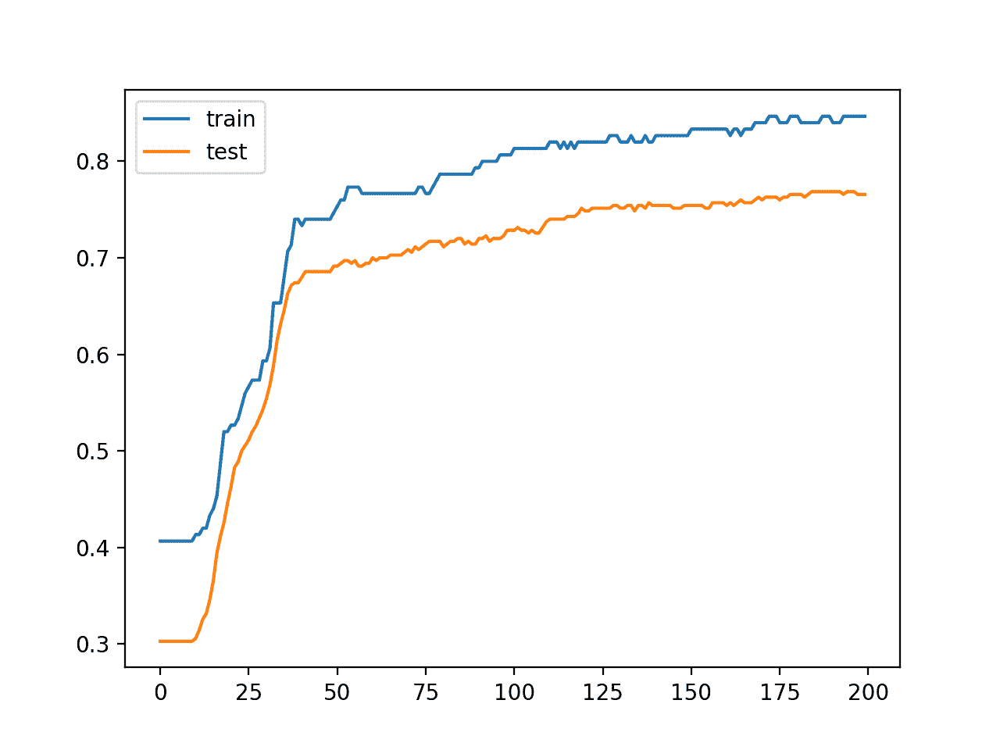
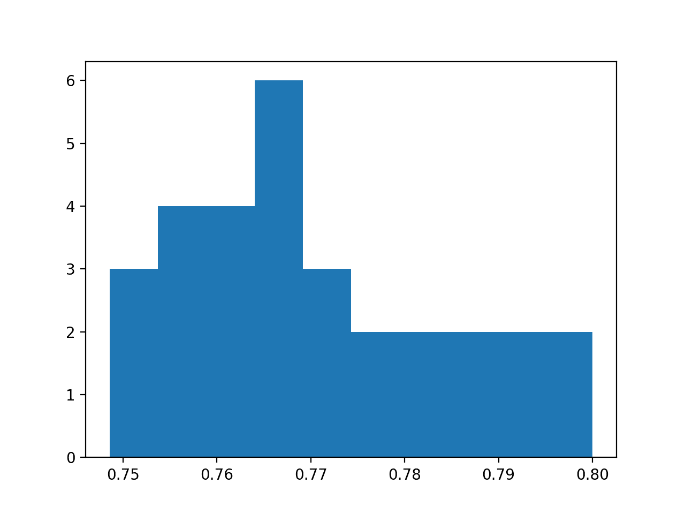
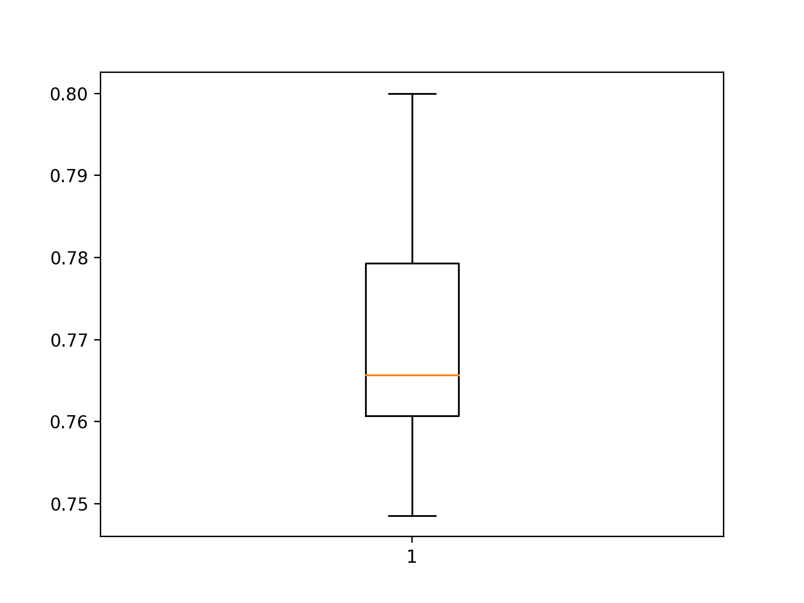
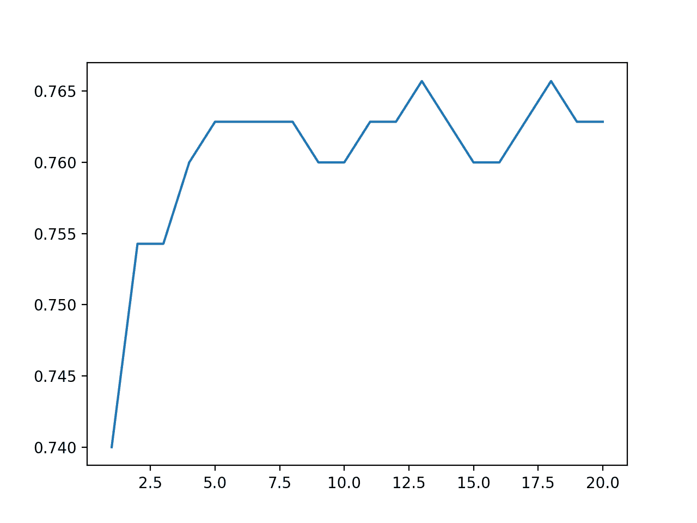

# 如何在 Keras 开发深度学习模型集成

> 原文：<https://machinelearningmastery.com/model-averaging-ensemble-for-deep-learning-neural-networks/>

最后更新于 2020 年 8 月 28 日

深度学习神经网络模型是高度灵活的非线性算法，能够学习几乎无限数量的映射函数。

这种灵活性的一个令人沮丧的地方是最终模型的高度差异。在同一数据集上训练的同一神经网络模型可能会在每次运行时找到许多不同的可能“足够好”的解决方案之一。

模型平均是一种[集成学习技术](https://machinelearningmastery.com/ensemble-methods-for-deep-learning-neural-networks/)，它减少了最终神经网络模型中的方差，牺牲了模型表现的分布，以获得对模型预期表现的信心。

在本教程中，您将发现如何在 Keras 中开发模型平均集成，以减少最终模型中的方差。

完成本教程后，您将知道:

*   模型平均是一种集成学习技术，可用于降低深度学习神经网络模型的期望方差。
*   分类和回归预测建模问题如何在 Keras 中实现模型平均。
*   如何解决一个多类分类问题，并使用模型平均来减少最终模型的方差。

**用我的新书[更好的深度学习](https://machinelearningmastery.com/better-deep-learning/)启动你的项目**，包括*分步教程*和所有示例的 *Python 源代码*文件。

我们开始吧。

*   **2019 年 10 月更新**:针对 Keras 2.3 和 TensorFlow 2.0 更新。
*   **2020 年 1 月更新**:针对 Sklearn v0.22 API 的变化进行了更新。


如何用模型平均集成减少 Keras 中深度学习模型的差异
图片由[约翰·梅森](https://www.flickr.com/photos/91451979@N00/5942977611/)提供，保留部分权利。

## 教程概述

本教程分为六个部分；它们是:

1.  模型平均
2.  如何在 Keras 中平均模型
3.  多类分类问题
4.  多类分类的 MLP 模型
5.  MLP 模型的高方差
6.  模型平均集成

## 模型平均

深度学习神经网络模型是通过随机训练算法进行学习的非线性方法。

这意味着它们高度灵活，能够学习变量之间的复杂关系，并在给定足够资源的情况下逼近任何映射函数。这种灵活性的缺点是模型的方差很大。

这意味着模型高度依赖于用于训练模型的特定训练数据，以及训练过程中的初始条件(随机初始权重)和意外发现。结果是，每次在同一数据集上训练[相同的模型配置时，最终模型都会做出不同的预测。](https://machinelearningmastery.com/randomness-in-machine-learning/)

当训练最终模型用于对新数据进行预测时，例如在操作上或机器学习竞赛中，这可能会令人沮丧。

该方法的高方差可以通过为问题训练多个模型并组合它们的预测来解决。这种方法被称为模型平均，属于称为集成学习的技术家族。

## 如何在 Keras 中平均模型

在 Keras 中开发模型平均集成的最简单方法是在同一数据集上训练多个模型，然后组合来自每个训练模型的预测。

### 训练多个模型

根据模型的大小和训练数据的大小，训练多个模型可能是资源密集型的。

您可能需要在相同的硬件上顺序训练模型。对于非常大的模型，使用云基础设施并行训练模型可能是值得的，例如[亚马逊网络服务](https://machinelearningmastery.com/develop-evaluate-large-deep-learning-models-keras-amazon-web-services/)。

集合所需的模型数量可能因问题和模型的复杂性而异。这种方法的一个好处是，您可以继续创建模型，将它们添加到集合中，并通过对保持测试集进行预测来评估它们对表现的影响。

对于小模型，您可以按顺序训练模型，并将它们保存在内存中，以便在实验中使用。例如:

```py
...
# train models and keep them in memory
n_members = 10
models = list()
for _ in range(n_members):
	# define and fit model
	model = ...
	# store model in memory as ensemble member
	models.add(models)
...
```

对于大型模型，也许是在不同的硬件上训练的，你可以[将每个模型保存到文件](https://machinelearningmastery.com/save-load-keras-deep-learning-models/)中。

```py
...
# train models and keep them to file
n_members = 10
for i in range(n_members):
	# define and fit model
	model = ...
	# save model to file
	filename = 'model_' + str(i + 1) + '.h5'
	model.save(filename)
	print('Saved: %s' % filename)
...
```

随后可以加载模型。

小模型可以同时加载到内存中，而非常大的模型可能需要一次加载一个来进行预测，然后再进行组合。

```py
from keras.models import load_model
...
# load pre-trained ensemble members
n_members = 10
models = list()
for i in range(n_members):
	# load model
	filename = 'model_' + str(i + 1) + '.h5'
	model = load_model(filename)
	# store in memory
	models.append(model)
...
```

### 组合预测

一旦模型准备好了，每个模型都可以用来进行预测，并且可以组合预测。

在回归问题的情况下，每个模型都在预测实值输出，可以收集值并计算平均值。

```py
...
# make predictions
yhats = [model.predict(testX) for model in models]
yhats = array(yhats)
# calculate average
outcomes = mean(yhats)
```

在分类问题的情况下，有两种选择。

首先是计算预测整数类值的[模式](https://docs.scipy.org/doc/scipy/reference/generated/scipy.stats.mode.html)。

```py
...
# make predictions
yhats = [model.predict_classes(testX) for model in models]
yhats = array(yhats)
# calculate mode
outcomes, _ = mode(yhats)
```

这种方法的缺点是，对于小的集合或有大量类的问题，预测样本可能不够大，模式没有意义。

在二元分类问题的情况下，在输出层使用 sigmoid 激活函数，预测概率的平均值可以像回归问题一样计算。

在具有两个以上类别的多类别分类问题的情况下，在输出层上使用 softmax 激活函数，并且在取 [argmax](https://docs.scipy.org/doc/numpy/reference/generated/numpy.argmax.html) 以获得类别值之前，可以计算每个预测类别的概率之和。

```py
...
# make predictions
yhats = [model.predict(testX) for model in models]
yhats = array(yhats)
# sum across ensembles
summed = numpy.sum(yhats, axis=0)
# argmax across classes
outcomes = argmax(summed, axis=1)
```

这些组合 Keras 模型预测的方法同样适用于多层感知器、卷积和递归神经网络。

现在我们知道了如何在 Keras 中平均来自多个神经网络模型的预测，让我们通过一个案例研究来工作。

## 多类分类问题

我们将使用一个小的多类分类问题作为基础来演示模型平均集成。

Sklearn 类提供了 [make_blobs()函数](http://Sklearn.org/stable/modules/generated/sklearn.datasets.make_blobs.html)，该函数可用于创建具有规定数量的样本、输入变量、类和类内样本方差的多类分类问题。

我们用 500 个例子来说明这个问题，输入变量(代表点的 x 和 y 坐标)和每个组内点的标准偏差为 2.0。我们将使用相同的随机状态(伪随机数发生器的种子)来确保我们总是获得相同的 500 分。

```py
# generate 2d classification dataset
X, y = make_blobs(n_samples=500, centers=3, n_features=2, cluster_std=2, random_state=2)
```

结果是我们可以建模的数据集的输入和输出元素。

为了了解问题的复杂性，我们可以在二维散点图上绘制每个点，并按类值给每个点着色。

下面列出了完整的示例。

```py
# scatter plot of blobs dataset
from sklearn.datasets import make_blobs
from matplotlib import pyplot
from pandas import DataFrame
# generate 2d classification dataset
X, y = make_blobs(n_samples=500, centers=3, n_features=2, cluster_std=2, random_state=2)
# scatter plot, dots colored by class value
df = DataFrame(dict(x=X[:,0], y=X[:,1], label=y))
colors = {0:'red', 1:'blue', 2:'green'}
fig, ax = pyplot.subplots()
grouped = df.groupby('label')
for key, group in grouped:
    group.plot(ax=ax, kind='scatter', x='x', y='y', label=key, color=colors[key])
pyplot.show()
```

运行该示例会创建整个数据集的散点图。我们可以看到，2.0 的标准偏差意味着类不是线性可分的(用一条线可分的)，导致了很多不明确的点。

这是可取的，因为这意味着问题不是微不足道的，并且将允许神经网络模型找到许多不同的“T0”足够好的“T1”候选解，从而导致高方差。


具有三个类和按类值着色的点的斑点数据集的散点图

## 多类分类的 MLP 模型

既然我们已经定义了一个问题，我们就可以定义一个模型来解决它。

我们将定义一个可能约束不足且不适应问题的模型。这是为了证明神经网络模型在真正大而有挑战性的监督学习问题上的高方差。

该问题是一个多类分类问题，我们将在输出层使用 softmax 激活函数对其进行建模。这意味着该模型将以样本属于 3 类中每一类的概率来预测具有 3 个元素的向量。因此，第一步是对类值进行热编码。

```py
y = to_categorical(y)
```

接下来，我们必须将数据集分成训练集和测试集。我们将使用测试集来评估模型的表现，并使用学习曲线绘制训练期间的表现。我们将使用 30%的数据用于训练，70%用于测试集。

这是一个具有挑战性的问题的例子，在这个问题中，我们没有标记的例子比有标记的例子多。

```py
# split into train and test
n_train = int(0.3 * X.shape[0])
trainX, testX = X[:n_train, :], X[n_train:, :]
trainy, testy = y[:n_train], y[n_train:]
```

接下来，我们可以定义和编译模型。

该模型将预期具有两个输入变量的样本。然后，该模型有一个具有 15 种模式和一个校正线性激活函数的隐藏层，然后是一个具有 3 个节点的输出层，用于预测 3 个类别中每一个的概率和一个 softmax 激活函数。

由于问题是多类的，我们将使用分类交叉熵损失函数来优化模型和随机梯度下降的有效[亚当味](https://machinelearningmastery.com/adam-optimization-algorithm-for-deep-learning/)。

```py
# define model
model = Sequential()
model.add(Dense(15, input_dim=2, activation='relu'))
model.add(Dense(3, activation='softmax'))
model.compile(loss='categorical_crossentropy', optimizer='adam', metrics=['accuracy'])
```

该模型适合 200 个训练时期，我们将在测试集上评估每个时期的模型，使用测试集作为验证集。

```py
# fit model
history = model.fit(trainX, trainy, validation_data=(testX, testy), epochs=200, verbose=0)
```

在运行结束时，我们将评估模型在列车和测试集上的表现。

```py
# evaluate the model
_, train_acc = model.evaluate(trainX, trainy, verbose=0)
_, test_acc = model.evaluate(testX, testy, verbose=0)
print('Train: %.3f, Test: %.3f' % (train_acc, test_acc))
```

最后，我们将在训练和测试数据集上绘制每个训练时期的模型准确率的学习曲线。

```py
# plot history
pyplot.plot(history.history['accuracy'], label='train')
pyplot.plot(history.history['val_accuracy'], label='test')
pyplot.legend()
pyplot.show()
```

下面列出了完整的示例。

```py
# fit high variance mlp on blobs classification problem
from sklearn.datasets import make_blobs
from keras.utils import to_categorical
from keras.models import Sequential
from keras.layers import Dense
from matplotlib import pyplot
# generate 2d classification dataset
X, y = make_blobs(n_samples=500, centers=3, n_features=2, cluster_std=2, random_state=2)
y = to_categorical(y)
# split into train and test
n_train = int(0.3 * X.shape[0])
trainX, testX = X[:n_train, :], X[n_train:, :]
trainy, testy = y[:n_train], y[n_train:]
# define model
model = Sequential()
model.add(Dense(15, input_dim=2, activation='relu'))
model.add(Dense(3, activation='softmax'))
model.compile(loss='categorical_crossentropy', optimizer='adam', metrics=['accuracy'])
# fit model
history = model.fit(trainX, trainy, validation_data=(testX, testy), epochs=200, verbose=0)
# evaluate the model
_, train_acc = model.evaluate(trainX, trainy, verbose=0)
_, test_acc = model.evaluate(testX, testy, verbose=0)
print('Train: %.3f, Test: %.3f' % (train_acc, test_acc))
# learning curves of model accuracy
pyplot.plot(history.history['accuracy'], label='train')
pyplot.plot(history.history['val_accuracy'], label='test')
pyplot.legend()
pyplot.show()
```

运行该示例首先打印最终模型在列车和测试数据集上的表现。

**注**:考虑到算法或评估程序的随机性，或数值准确率的差异，您的[结果可能会有所不同](https://machinelearningmastery.com/different-results-each-time-in-machine-learning/)。考虑运行该示例几次，并比较平均结果。

在这种情况下，我们可以看到该模型在训练数据集上实现了约 84%的准确率，在测试数据集上实现了约 76%的准确率；不可怕。

```py
Train: 0.847, Test: 0.766
```

还创建了一个线图，显示了在每个训练周期内，训练和测试集上模型准确率的学习曲线。

我们可以看到，该模型并没有真正过量，但可能有点不足，可能会受益于容量的增加、更多的培训以及一些正则化。所有这些改进，我们都有意抑制，以迫使我们的案例研究出现高方差。



每个训练时期训练和测试数据集上模型准确率的线图学习曲线

## MLP 模型的高方差

重要的是要证明模型的预测确实存在差异。

我们可以通过在同一数据集上重复相同模型配置的拟合和评估，并总结模型的最终表现来演示这一点。

为此，我们首先将模型的拟合和评估拆分为一个可以重复调用的函数。下面的 evaluate_model()函数获取训练和测试数据集，拟合一个模型，然后对其进行评估，在测试数据集上重新调整模型的准确率。

```py
# fit and evaluate a neural net model on the dataset
def evaluate_model(trainX, trainy, testX, testy):
	# define model
	model = Sequential()
	model.add(Dense(15, input_dim=2, activation='relu'))
	model.add(Dense(3, activation='softmax'))
	model.compile(loss='categorical_crossentropy', optimizer='adam', metrics=['accuracy'])
	# fit model
	model.fit(trainX, trainy, epochs=200, verbose=0)
	# evaluate the model
	_, test_acc = model.evaluate(testX, testy, verbose=0)
	return test_acc
```

我们可以调用这个函数 30 次，节省了测试的准确率分数。

```py
# repeated evaluation
n_repeats = 30
scores = list()
for _ in range(n_repeats):
	score = evaluate_model(trainX, trainy, testX, testy)
	print('> %.3f' % score)
	scores.append(score)
```

一旦收集到，我们可以总结分布分数，首先根据平均值和标准差，假设分布是高斯的，这是非常合理的。

```py
# summarize the distribution of scores
print('Scores Mean: %.3f, Standard Deviation: %.3f' % (mean(scores), std(scores)))
```

然后，我们可以将分布总结为直方图以显示分布的形状，以及方框和须状图以显示分布的范围和主体。

```py
# histogram of distribution
pyplot.hist(scores, bins=10)
pyplot.show()
# boxplot of distribution
pyplot.boxplot(scores)
pyplot.show()
```

下面列出了在所选斑点数据集上总结 MLP 模型方差的完整示例。

```py
# demonstrate high variance of mlp model on blobs classification problem
from sklearn.datasets import make_blobs
from keras.utils import to_categorical
from keras.models import Sequential
from keras.layers import Dense
from numpy import mean
from numpy import std
from matplotlib import pyplot

# fit and evaluate a neural net model on the dataset
def evaluate_model(trainX, trainy, testX, testy):
	# define model
	model = Sequential()
	model.add(Dense(15, input_dim=2, activation='relu'))
	model.add(Dense(3, activation='softmax'))
	model.compile(loss='categorical_crossentropy', optimizer='adam', metrics=['accuracy'])
	# fit model
	model.fit(trainX, trainy, epochs=200, verbose=0)
	# evaluate the model
	_, test_acc = model.evaluate(testX, testy, verbose=0)
	return test_acc

# generate 2d classification dataset
X, y = make_blobs(n_samples=500, centers=3, n_features=2, cluster_std=2, random_state=2)
y = to_categorical(y)
# split into train and test
n_train = int(0.3 * X.shape[0])
trainX, testX = X[:n_train, :], X[n_train:, :]
trainy, testy = y[:n_train], y[n_train:]
# repeated evaluation
n_repeats = 30
scores = list()
for _ in range(n_repeats):
	score = evaluate_model(trainX, trainy, testX, testy)
	print('> %.3f' % score)
	scores.append(score)
# summarize the distribution of scores
print('Scores Mean: %.3f, Standard Deviation: %.3f' % (mean(scores), std(scores)))
# histogram of distribution
pyplot.hist(scores, bins=10)
pyplot.show()
# boxplot of distribution
pyplot.boxplot(scores)
pyplot.show()
```

运行该示例首先打印测试集上每个模型的准确性，最后打印准确性分数样本的平均值和标准偏差。

**注**:考虑到算法或评估程序的随机性，或数值准确率的差异，您的[结果可能会有所不同](https://machinelearningmastery.com/different-results-each-time-in-machine-learning/)。考虑运行该示例几次，并比较平均结果。

在这种情况下，我们可以看到样本的平均值为 77%，标准偏差约为 1.4%。假设为高斯分布，我们预计 99%的准确率会在 73%到 81%之间(即高于和低于平均值的 3 个标准差)。

我们可以将模型在测试集上的准确度的标准偏差作为模型所做预测的方差的估计。

```py
> 0.749
> 0.771
> 0.763
> 0.760
> 0.783
> 0.780
> 0.769
> 0.754
> 0.766
> 0.786
> 0.766
> 0.774
> 0.757
> 0.754
> 0.771
> 0.749
> 0.763
> 0.800
> 0.774
> 0.777
> 0.766
> 0.794
> 0.797
> 0.757
> 0.763
> 0.751
> 0.789
> 0.791
> 0.766
> 0.766
Scores Mean: 0.770, Standard Deviation: 0.014
```

还创建了准确度分数的直方图，显示了非常粗糙的高斯形状，可能带有较长的右尾巴。

图中的大样本和不同数量的箱可能会更好地揭示分布的真实基本形状。



超过 30 次重复的模型测试准确率直方图

还创建了一个方框和触须图，显示了测试集上准确度约为 76.5%的中位数处的一条线，以及约 78%至 76%之间的样本的四分位数范围或中间 50%。



模型试验准确率超过 30 次重复的盒须图

对测试分数样本的分析清楚地表明了在相同数据集上训练的相同模型的表现差异。

测试集上大约 8 个百分点(81%–73%)的可能分数的分布可以被合理地认为是大的，例如高方差结果。

## 模型平均集成

我们可以使用模型平均来降低模型的方差，并可能降低模型的泛化误差。

具体来说，这将导致保持测试集的标准偏差更小，而训练集的表现更好。我们可以检查这两个假设。

首先，我们必须开发一个函数来准备和返回训练数据集上的拟合模型。

```py
# fit model on dataset
def fit_model(trainX, trainy):
	# define model
	model = Sequential()
	model.add(Dense(15, input_dim=2, activation='relu'))
	model.add(Dense(3, activation='softmax'))
	model.compile(loss='categorical_crossentropy', optimizer='adam', metrics=['accuracy'])
	# fit model
	model.fit(trainX, trainy, epochs=200, verbose=0)
	return model
```

接下来，我们需要一个函数，它可以获取集合成员的列表，并对样本外数据集进行预测。这可以是排列在样本和输入特征的二维阵列中的一个或多个样本。

**提示**:你可以自己使用这个函数来测试集合，以及用集合对新数据进行预测。

```py
# make an ensemble prediction for multi-class classification
def ensemble_predictions(members, testX):
	# make predictions
	yhats = [model.predict(testX) for model in members]
	yhats = array(yhats)
	# sum across ensemble members
	summed = numpy.sum(yhats, axis=0)
	# argmax across classes
	result = argmax(summed, axis=1)
	return result
```

我们不知道有多少文工团成员适合这个问题。

因此，我们可以对集合成员的数量及其如何影响测试准确率进行敏感性分析。这意味着我们需要一个函数来评估指定数量的集合成员，并返回这些成员组合的预测的准确性。

```py
# evaluate a specific number of members in an ensemble
def evaluate_n_members(members, n_members, testX, testy):
	# select a subset of members
	subset = members[:n_members]
	print(len(subset))
	# make prediction
	yhat = ensemble_predictions(subset, testX)
	# calculate accuracy
	return accuracy_score(testy, yhat)
```

最后，我们可以创建集成成员数量(x 轴)与测试数据集(y 轴)上许多成员的平均预测准确率的线图。

```py
# plot score vs number of ensemble members
x_axis = [i for i in range(1, n_members+1)]
pyplot.plot(x_axis, scores)
pyplot.show()
```

下面列出了完整的示例。

```py
# model averaging ensemble and a study of ensemble size on test accuracy
from sklearn.datasets import make_blobs
from keras.utils import to_categorical
from keras.models import Sequential
from keras.layers import Dense
import numpy
from numpy import array
from numpy import argmax
from sklearn.metrics import accuracy_score
from matplotlib import pyplot

# fit model on dataset
def fit_model(trainX, trainy):
	# define model
	model = Sequential()
	model.add(Dense(15, input_dim=2, activation='relu'))
	model.add(Dense(3, activation='softmax'))
	model.compile(loss='categorical_crossentropy', optimizer='adam', metrics=['accuracy'])
	# fit model
	model.fit(trainX, trainy, epochs=200, verbose=0)
	return model

# make an ensemble prediction for multi-class classification
def ensemble_predictions(members, testX):
	# make predictions
	yhats = [model.predict(testX) for model in members]
	yhats = array(yhats)
	# sum across ensemble members
	summed = numpy.sum(yhats, axis=0)
	# argmax across classes
	result = argmax(summed, axis=1)
	return result

# evaluate a specific number of members in an ensemble
def evaluate_n_members(members, n_members, testX, testy):
	# select a subset of members
	subset = members[:n_members]
	print(len(subset))
	# make prediction
	yhat = ensemble_predictions(subset, testX)
	# calculate accuracy
	return accuracy_score(testy, yhat)

# generate 2d classification dataset
X, y = make_blobs(n_samples=500, centers=3, n_features=2, cluster_std=2, random_state=2)
# split into train and test
n_train = int(0.3 * X.shape[0])
trainX, testX = X[:n_train, :], X[n_train:, :]
trainy, testy = y[:n_train], y[n_train:]
trainy = to_categorical(trainy)
# fit all models
n_members = 20
members = [fit_model(trainX, trainy) for _ in range(n_members)]
# evaluate different numbers of ensembles
scores = list()
for i in range(1, n_members+1):
	score = evaluate_n_members(members, i, testX, testy)
	print('> %.3f' % score)
	scores.append(score)
# plot score vs number of ensemble members
x_axis = [i for i in range(1, n_members+1)]
pyplot.plot(x_axis, scores)
pyplot.show()
```

运行该示例首先将 20 个模型放在同一个训练数据集上，这在现代硬件上可能不到一分钟。

**注**:考虑到算法或评估程序的随机性，或数值准确率的差异，您的[结果可能会有所不同](https://machinelearningmastery.com/different-results-each-time-in-machine-learning/)。考虑运行该示例几次，并比较平均结果。

然后，从 1 个成员到所有 20 个成员测试不同大小的集成，并打印每个集成大小的测试准确率结果。

```py
1
> 0.740
2
> 0.754
3
> 0.754
4
> 0.760
5
> 0.763
6
> 0.763
7
> 0.763
8
> 0.763
9
> 0.760
10
> 0.760
11
> 0.763
12
> 0.763
13
> 0.766
14
> 0.763
15
> 0.760
16
> 0.760
17
> 0.763
18
> 0.766
19
> 0.763
20
> 0.763
```

最后，创建一个折线图，显示测试集上集合大小和表现之间的关系。

我们可以看到，表现提高到大约五个成员，之后表现稳定在 76%左右。这接近于在分析模型的重复评估期间观察到的平均测试集表现。



集合大小对模型检验准确率的线图

最后，我们可以更新重复评估实验，使用五个模型的集合来代替单个模型，并比较分数的分布。

下面列出了一个完整的重复评估的五个成员的斑点数据集集合的例子。

```py
# repeated evaluation of model averaging ensemble on blobs dataset
from sklearn.datasets import make_blobs
from keras.utils import to_categorical
from keras.models import Sequential
from keras.layers import Dense
import numpy
from numpy import array
from numpy import argmax
from numpy import mean
from numpy import std
from sklearn.metrics import accuracy_score

# fit model on dataset
def fit_model(trainX, trainy):
	# define model
	model = Sequential()
	model.add(Dense(15, input_dim=2, activation='relu'))
	model.add(Dense(3, activation='softmax'))
	model.compile(loss='categorical_crossentropy', optimizer='adam', metrics=['accuracy'])
	# fit model
	model.fit(trainX, trainy, epochs=200, verbose=0)
	return model

# make an ensemble prediction for multi-class classification
def ensemble_predictions(members, testX):
	# make predictions
	yhats = [model.predict(testX) for model in members]
	yhats = array(yhats)
	# sum across ensemble members
	summed = numpy.sum(yhats, axis=0)
	# argmax across classes
	result = argmax(summed, axis=1)
	return result

# evaluate ensemble model
def evaluate_members(members, testX, testy):
	# make prediction
	yhat = ensemble_predictions(members, testX)
	# calculate accuracy
	return accuracy_score(testy, yhat)

# generate 2d classification dataset
X, y = make_blobs(n_samples=500, centers=3, n_features=2, cluster_std=2, random_state=2)
# split into train and test
n_train = int(0.3 * X.shape[0])
trainX, testX = X[:n_train, :], X[n_train:, :]
trainy, testy = y[:n_train], y[n_train:]
trainy = to_categorical(trainy)
# repeated evaluation
n_repeats = 30
n_members = 5
scores = list()
for _ in range(n_repeats):
	# fit all models
	members = [fit_model(trainX, trainy) for _ in range(n_members)]
	# evaluate ensemble
	score = evaluate_members(members, testX, testy)
	print('> %.3f' % score)
	scores.append(score)
# summarize the distribution of scores
print('Scores Mean: %.3f, Standard Deviation: %.3f' % (mean(scores), std(scores)))
```

运行该示例可能需要几分钟的时间，因为五个模型被拟合和评估，并且该过程被重复 30 次。

打印测试集上每个模型的表现，以提供进度指示。

**注**:考虑到算法或评估程序的随机性，或数值准确率的差异，您的[结果可能会有所不同](https://machinelearningmastery.com/different-results-each-time-in-machine-learning/)。考虑运行该示例几次，并比较平均结果。

模型表现的平均值和标准偏差在运行结束时打印。

```py
> 0.769
> 0.757
> 0.754
> 0.780
> 0.771
> 0.774
> 0.766
> 0.769
> 0.774
> 0.771
> 0.760
> 0.766
> 0.766
> 0.769
> 0.766
> 0.771
> 0.763
> 0.760
> 0.771
> 0.780
> 0.769
> 0.757
> 0.769
> 0.771
> 0.771
> 0.766
> 0.763
> 0.766
> 0.771
> 0.769
Scores Mean: 0.768, Standard Deviation: 0.006
```

在这种情况下，我们可以看到数据集上五人集成的平均表现为 76%。这非常接近单个模型 77%的平均值。

重要的区别是标准偏差从单个模型的 1.4%缩小到五个模型的 0.6%。我们可能预计，在这个问题上，给定的五个模型的集合的表现下降在大约 74%到大约 78%之间，可能性为 99%。

对在相同数据集上训练的相同模型求平均值，可以提高可靠性，这是最终模型在操作中非常需要的特性。

在给定大数定律的情况下，集合中的更多模型将进一步降低集合在测试数据集上的准确度的标准偏差，至少降低到收益递减的程度。

这表明对于这个特定的模型和预测问题，具有五个成员的模型平均集成足以减少模型的方差。这种方差的减少，反过来也意味着在准备最终模型时有更好的平均表现。

## 扩展ˌ扩张

本节列出了一些您可能希望探索的扩展教程的想法。

*   **平均等级预测**。更新示例以平均类整数预测，而不是类概率预测，并比较结果。
*   **保存和加载模型**。更新示例，将集合成员保存到文件中，然后从单独的脚本中加载它们进行评估。
*   **方差敏感度**。创建一个新的示例，根据给定重复次数的测试集上模型表现的标准偏差，对集合成员的数量进行敏感性分析，并报告收益递减点。

如果你探索这些扩展，我很想知道。

## 进一步阅读

如果您想更深入地了解这个主题，本节将提供更多资源。

*   [开始使用 Keras 顺序模型](https://keras.io/getting-started/sequential-model-guide/)
*   [硬核层 API](https://keras.io/layers/core/)
*   [scipy . stat . mode API](https://docs.scipy.org/doc/scipy/reference/generated/scipy.stats.mode.html)
*   num py . argmax API
*   [sklearn . dataset . make _ blobs API](http://Sklearn.org/stable/modules/generated/sklearn.datasets.make_blobs.html)

## 摘要

在本教程中，您发现了如何在 Keras 中开发模型平均集成来减少最终模型中的方差。

具体来说，您了解到:

*   模型平均是一种集成学习技术，可用于降低深度学习神经网络模型的期望方差。
*   分类和回归预测建模问题如何在 Keras 中实现模型平均。
*   如何解决一个多类分类问题，并使用模型平均来减少最终模型的方差。

你有什么问题吗？
在下面的评论中提问，我会尽力回答。