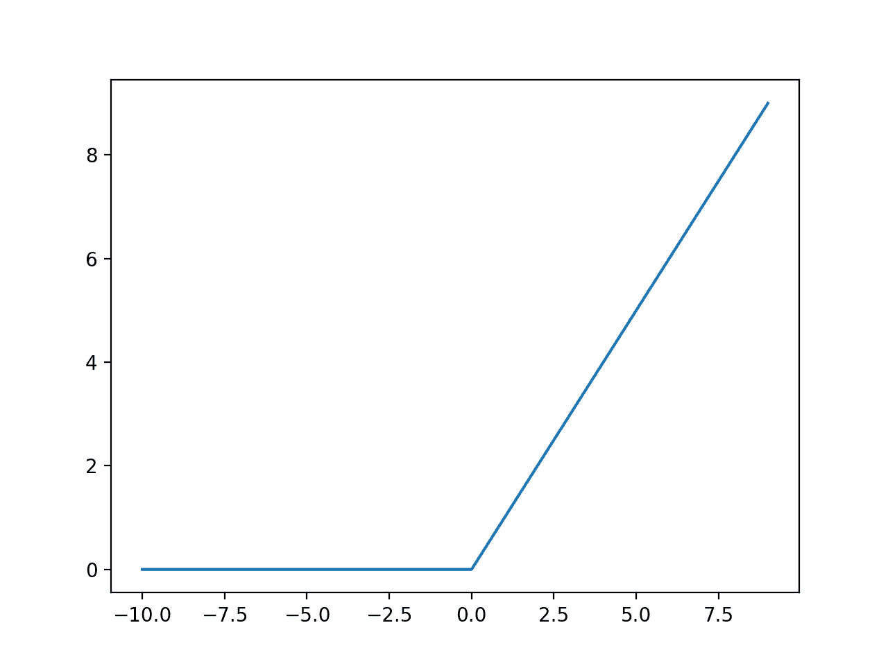

# 整流线性单元的温和介绍

> 原文：<https://machinelearningmastery.com/rectified-linear-activation-function-for-deep-learning-neural-networks/>

最后更新于 2020 年 8 月 20 日

在神经网络中，激活函数负责将来自节点的加权总输入转换为该节点的激活或该输入的输出。

**整流线性激活函数**或 **ReLU** 简称为分段线性函数，为正则直接输出输入，否则输出零。它已经成为许多类型神经网络的默认激活函数，因为使用它的模型更容易训练，并且通常会获得更好的性能。

在本教程中，您将发现深度学习神经网络的校正线性激活函数。

完成本教程后，您将知道:

*   由于消失梯度问题，sigmoid 和双曲正切激活函数不能用于具有许多层的网络。
*   修正后的线性激活函数克服了消失梯度问题，使模型学习更快，性能更好。
*   修正后的线性激活是开发多层感知器和卷积神经网络时的默认激活。

**用我的新书[更好的深度学习](https://machinelearningmastery.com/better-deep-learning/)启动你的项目**，包括*分步教程*和所有示例的 *Python 源代码*文件。

我们开始吧。

*   **2019 年 6 月**:修正了 he 权重初始化公式的错误(感谢 Maltev)。


深度学习神经网络校正线性激活函数简介
图片由[土地管理局](https://www.flickr.com/photos/mypubliclands/19929406464/)提供，版权所有。

## 教程概述

本教程分为六个部分；它们是:

1.  Sigmoid 和 Tanh 激活函数的局限性
2.  整流器线性激活函数
3.  如何实现整流器线性激活功能
4.  整流器线性激活的优点
5.  整流器线性激活的使用技巧
6.  ReLU 的扩展和替代

## Sigmoid 和 Tanh 激活函数的局限性

神经网络由多层节点组成，并学习将输入示例映射到输出。

对于给定的节点，输入与节点中的权重相乘并相加。该值被称为节点的总激活。然后，通过[激活函数](https://en.wikipedia.org/wiki/Activation_function)转换相加的激活，并定义节点的特定输出或“激活”。

最简单的激活函数称为线性激活，其中根本不应用任何变换。仅由线性激活函数组成的网络非常容易训练，但是不能学习复杂的映射函数。线性激活函数仍然用于预测数量的网络的输出层(例如回归问题)。

非线性激活函数是优选的，因为它们允许节点学习数据中更复杂的结构。传统上，两个广泛使用的非线性激活函数是 **sigmoid** 和**双曲正切**激活函数。

sigmoid 激活函数，也称为逻辑函数，传统上是非常流行的神经网络激活函数。函数的输入被转换为 0.0 到 1.0 之间的值。比 1.0 大得多的输入被转换为值 1.0，类似地，比 0.0 小得多的值被捕捉到 0.0。所有可能输入的函数形状都是从零到 0.5 到 1.0 的 S 形。在很长一段时间里，直到 20 世纪 90 年代初，这是神经网络上使用的默认激活。

双曲正切函数，简称 tanh，是一种类似形状的非线性激活函数，输出值介于-1.0 和 1.0 之间。在 20 世纪 90 年代后期和 21 世纪初，tanh 函数比 sigmoid 激活函数更受青睐，因为使用它的模型更容易训练，通常具有更好的预测性能。

> …双曲正切激活函数的性能通常优于逻辑 sigmoid。

—第 195 页，[深度学习](https://amzn.to/2QHVWmW)，2016。

sigmoid 和 tanh 函数的一个普遍问题是它们饱和。这意味着，对于 tanh 和 sigmoid，大值会捕捉到 1.0，小值会捕捉到-1 或 0。此外，这些函数只对输入中点附近的变化非常敏感，例如 sigmoid 为 0.5，tanh 为 0.0。

不管作为输入提供的节点的总激活是否包含有用信息，函数的有限灵敏度和饱和都会发生。一旦饱和，学习算法继续调整权重以提高模型的性能就变得具有挑战性。

> ……sigmoxic 单位在其大部分域内饱和——当 z 非常正时饱和到高值，当 z 非常负时饱和到低值，并且仅当 z 接近 0 时对其输入非常敏感。

—第 195 页，[深度学习](https://amzn.to/2QHVWmW)，2016。

最后，随着硬件能力的提高，使用 sigmoid 和 tanh 激活函数的 GPU 深度神经网络不容易训练。

使用这些非线性激活函数的大型网络中的深层无法接收有用的梯度信息。误差通过网络反向传播，并用于更新权重。给定所选激活函数的导数，误差量随着传播通过的每个附加层而显著减少。这被称为[消失梯度问题](https://machinelearningmastery.com/how-to-fix-vanishing-gradients-using-the-rectified-linear-activation-function/)，阻碍了深层(多层)网络的有效学习。

> 消失梯度使得很难知道参数应该向哪个方向移动来改善成本函数

—第 290 页，[深度学习](https://amzn.to/2QHVWmW)，2016。

有关 ReLU 如何修复渐变消失问题的示例，请参见教程:

*   [如何使用校正后的线性激活函数](https://machinelearningmastery.com/how-to-fix-vanishing-gradients-using-the-rectified-linear-activation-function/)固定消失梯度

虽然非线性激活函数的使用允许神经网络学习复杂的映射函数，但它们有效地阻止了学习算法与深度网络一起工作。

在 2000 年代末和 2010 年代初，使用替代网络类型(如玻尔兹曼机器和[分层训练](https://machinelearningmastery.com/greedy-layer-wise-pretraining-tutorial/)或无监督预训练)找到了解决方法。

## 整流器线性激活函数

为了使用误差反向传播的随机梯度下降来训练深度神经网络，需要一个激活函数，它看起来和行为都像线性函数，但实际上是一个非线性函数，允许学习数据中的复杂关系。

该功能还必须对激活和输入提供更高的灵敏度，并避免容易饱和。

这一解决方案已经在该领域出现了一段时间，尽管直到 2009 年和 2011 年的论文对此有所提及。

解决方案是使用整流线性激活函数，简称 ReL。

实现该激活功能的节点或单元被称为**整流线性激活单元**，简称 ReLU。通常，对隐藏层使用整流功能的网络称为整流网络。

ReLU 的采用很容易被认为是深度学习革命中为数不多的里程碑之一，例如，现在允许非常深的神经网络的常规开发的技术。

> [另一个]大大改善前馈网络性能的主要算法变化是用分段线性隐藏单元替换 sigmoid 隐藏单元，例如整流线性单元。

—第 226 页，[深度学习](https://amzn.to/2QHVWmW)，2016。

整流线性激活函数是一个简单的计算，它直接返回作为输入提供的值，如果输入为 0.0 或更小，则返回值 0.0。

我们可以用一个简单的 if 语句来描述这一点:

```py
if input > 0:
	return input
else:
	return 0
```

我们可以使用 0.0 集合上的 *max()* 函数和输入 *z* 对该函数 *g()* 进行数学描述；例如:

```py
g(z) = max{0, z}
```

对于大于零的值，该函数是线性的，这意味着当使用反向传播训练神经网络时，它具有线性激活函数的许多理想特性。然而，这是一个非线性函数，因为负值总是输出为零。

> 因为校正后的线性单位几乎是线性的，所以它们保留了许多属性，使得线性模型易于使用基于梯度的方法进行优化。它们还保留了许多使线性模型很好地推广的特性。

—第 175 页，[深度学习](https://amzn.to/2QHVWmW)，2016。

因为整流函数对于输入域的一半是线性的，而对于另一半是非线性的，所以它被称为[分段线性函数](https://en.wikipedia.org/wiki/Piecewise_linear_function)或铰链函数。

> 然而，该函数仍然非常接近线性，即具有两个线性部分的分段线性函数。

—第 175 页，[深度学习](https://amzn.to/2QHVWmW)，2016。

现在我们已经熟悉了校正后的线性激活函数，让我们看看如何在 Python 中实现它。

## 整流器线性激活函数如何编码

我们可以在 Python 中轻松实现校正后的线性激活函数。

或许最简单的实现就是使用 [max()函数](https://docs.python.org/3/library/functions.html#max)；例如:

```py
# rectified linear function
def rectified(x):
	return max(0.0, x)
```

我们期望任何正值都不变地返回，而输入值 0.0 或负值将作为值 0.0 返回。

下面是整流线性激活函数的一些输入和输出示例。

```py
# demonstrate the rectified linear function

# rectified linear function
def rectified(x):
	return max(0.0, x)

# demonstrate with a positive input
x = 1.0
print('rectified(%.1f) is %.1f' % (x, rectified(x)))
x = 1000.0
print('rectified(%.1f) is %.1f' % (x, rectified(x)))
# demonstrate with a zero input
x = 0.0
print('rectified(%.1f) is %.1f' % (x, rectified(x)))
# demonstrate with a negative input
x = -1.0
print('rectified(%.1f) is %.1f' % (x, rectified(x)))
x = -1000.0
print('rectified(%.1f) is %.1f' % (x, rectified(x)))
```

运行该示例，我们可以看到，无论正值的大小如何，都会返回正值，而负值会被捕捉到值 0.0。

```py
rectified(1.0) is 1.0
rectified(1000.0) is 1000.0
rectified(0.0) is 0.0
rectified(-1.0) is 0.0
rectified(-1000.0) is 0.0
```

通过绘制一系列输入和计算的输出，我们可以了解函数的输入和输出之间的关系。

下面的示例生成一系列从-10 到 10 的整数，并计算每个输入的校正线性激活，然后绘制结果。

```py
# plot inputs and outputs
from matplotlib import pyplot

# rectified linear function
def rectified(x):
	return max(0.0, x)

# define a series of inputs
series_in = [x for x in range(-10, 11)]
# calculate outputs for our inputs
series_out = [rectified(x) for x in series_in]
# line plot of raw inputs to rectified outputs
pyplot.plot(series_in, series_out)
pyplot.show()
```

运行该示例会创建一个折线图，显示所有负值和零输入被捕捉到 0.0，而正输出按原样返回，导致斜率线性增加，假设我们创建了一系列线性增加的正值(例如 1 到 10)。



正负输入的整流线性激活线图

整流后的线性函数的导数也很容易计算。回想一下，作为误差反向传播的一部分，当更新节点的权重时，需要激活函数的导数。

函数的导数是斜率。负值的斜率为 0.0，正值的斜率为 1.0。

传统上，神经网络领域避免了任何不完全可微的激活函数，这可能会延迟校正线性函数和其他分段线性函数的采用。技术上，当输入为 0.0 时，我们无法计算导数，因此，我们可以假设它为零。这在实践中不是问题。

> 例如，整流后的线性函数 g(z) = max{0，z}在 z = 0 时不可微。这看起来像是使 g 在基于梯度的学习算法中无效。在实践中，梯度下降仍然表现得足够好，可以将这些模型用于机器学习任务。

—第 192 页，[深度学习](https://amzn.to/2QHVWmW)，2016。

使用整流线性激活函数有许多优点；让我们在下一节看几个。

## 整流器线性激活功能的优点

在开发大多数类型的神经网络时，校正的线性激活函数已经迅速成为默认的激活函数。

因此，花点时间回顾一下这种方法的一些好处是很重要的，Xavier Glorot 等人在他们 2012 年关于使用 ReLU 的里程碑式论文中首次强调了这一点，论文标题为“[深度稀疏整流神经网络](http://proceedings.mlr.press/v15/glorot11a)”。

### 1.计算简单性。

整流器功能实现起来很简单，需要 *max()* 功能。

这与需要使用指数计算的 tanh 和 sigmoid 激活函数不同。

> 计算也更便宜:激活时不需要计算指数函数

——[深度稀疏整流神经网络](http://proceedings.mlr.press/v15/glorot11a)，2011。

### 2.表征稀疏性

整流器功能的一个重要好处是它能够输出真正的零值。

这与 tanh 和 sigmoid 激活函数不同，后者学习逼近零输出，例如非常接近零的值，但不是真正的零值。

这意味着负输入可以输出真零值，允许神经网络中隐藏层的激活包含一个或多个真零值。这被称为稀疏表示，是表示学习中的一个理想特性，因为它可以加速学习并简化模型。

自动编码器是研究和寻找稀疏性等高效表示的一个领域，在该领域中，网络在从紧凑表示重构输入(称为代码层)之前，先学习该输入的紧凑表示，例如图像或序列。

> 稀疏(和去噪)自动编码器在 h 中实现实际零点的一种方法是……这种想法是使用整流的线性单元来产生代码层。有了实际将表示推至零的先验知识(如绝对值罚分)，就可以间接控制表示中零的平均数量。

—第 507 页，[深度学习](https://amzn.to/2QHVWmW)，2016。

### 3.线性性质

整流器功能看起来和行为都像一个线性激活功能。

一般来说，当神经网络的行为是线性或接近线性时，它更容易优化。

> 修正的线性单位【…】基于这样的原则，即如果模型的行为更接近线性，则模型更容易优化。

—第 194 页，[深度学习](https://amzn.to/2QHVWmW)，2016。

这个特性的关键是，用这个激活函数训练的网络几乎完全避免了梯度消失的问题，因为梯度保持与节点激活成比例。

> 由于这种线性，梯度在神经元的活动路径上流动良好(由于 sigmoid 或 tanh 单元的激活非线性，没有梯度消失效应)。

——[深度稀疏整流神经网络](http://proceedings.mlr.press/v15/glorot11a)，2011。

### 4.训练深层网络

重要的是，整流线性激活函数的(重新)发现和采用意味着有可能利用硬件的改进，并使用反向传播成功地训练具有非线性激活函数的深层多层网络。

反过来，像玻尔兹曼机器这样繁琐的网络以及像分层训练和无标记预训练这样繁琐的训练计划可能会被抛在后面。

> ……深度整流器网络可以达到最佳性能，而不需要对带有大型标记数据集的纯监督任务进行任何无监督预训练。因此，这些结果可以被视为一个新的里程碑，试图理解训练深度但纯监督的神经网络的难度，并缩小在无监督预训练和有监督预训练下学习的神经网络之间的性能差距。

——[深度稀疏整流神经网络](http://proceedings.mlr.press/v15/glorot11a)，2011。

## 整流器线性激活的使用技巧

在本节中，我们将了解在您自己的深度学习神经网络中使用校正线性激活函数时的一些技巧。

### 使用 ReLU 作为默认激活功能

长期以来，默认使用的激活是 sigmoid 激活功能。后来，这是 tanh 激活功能。

对于现代深度学习神经网络，默认激活函数是校正线性激活函数。

> 在引入整流线性单元之前，大多数神经网络使用逻辑 sigmoid 激活函数或双曲正切激活函数。

—第 195 页，[深度学习](https://amzn.to/2QHVWmW)，2016。

大多数获得最先进结果的论文将描述一个使用 ReLU 的网络。例如，在 Alex Krizhevsky 等人于 2012 年发表的里程碑式论文《使用深度卷积神经网络进行 ImageNet 分类》中，作者开发了一种具有 ReLU 激活的深度卷积神经网络，该网络在 ImageNet 照片分类数据集上取得了最先进的结果。

> ……我们将具有这种非线性的神经元称为整流线性单位(ReLUs)。带有 ReLUs 的深度卷积神经网络比带有 tanh 单元的同类网络训练速度快几倍。

如果有疑问，从你的神经网络中的 ReLU 开始，然后也许尝试其他分段线性激活函数，看看它们的性能比较如何。

> 在现代神经网络中，默认的建议是使用校正后的线性单位或 ReLU

—第 174 页，[深度学习](https://amzn.to/2QHVWmW)，2016。

### 将 ReLU 用于 MLPs、CNNs，但可能不用于 RNNs

ReLU 可以用于大多数类型的神经网络。

建议将其作为多层感知器(MLP)和卷积神经网络(中枢神经系统)的默认值。

已对使用氯化萘的 ReLU 进行了彻底调查，几乎普遍的结果是结果有所改善，最初，令人惊讶的是。

> ……滤波器组之后的非线性如何影响识别精度。令人惊讶的答案是，使用校正非线性是提高识别系统性能的最重要因素。

——[物体识别的最佳多级架构是什么？](https://ieeexplore.ieee.org/document/5459469)，2009 年

用氯化萘调查 ReLU 的工作引发了它们在其他网络类型中的使用。

> [其他人]已经在卷积网络的环境中探索了各种校正的非线性……,并且已经发现它们改善了鉴别性能。

——[整流线性单元改进受限玻尔兹曼机](https://dl.acm.org/citation.cfm?id=3104425)，2010。

当将 ReLU 与 CNNs 一起使用时，它们可以用作过滤器映射本身的激活功能，然后是一个池层。

> 卷积网络的典型层由三个阶段组成[…]在第二阶段，每个线性激活通过非线性激活函数运行，例如校正的线性激活函数。这个阶段有时被称为探测器阶段。

—第 339 页，[深度学习](https://amzn.to/2QHVWmW)，2016。

传统上，LSTMs 使用 tanh 激活函数激活单元状态，使用 sigmoid 激活函数激活节点输出。考虑到它们的精心设计，ReLU 被认为不适合递归神经网络，例如长短期记忆网络(LSTM)。

> 乍一看，ReLUs 似乎不适合 rnn，因为它们可以有非常大的输出，所以它们可能比具有有界值的单元更有可能爆炸。

——[一种初始化整流线性单元递归网络的简单方法](https://arxiv.org/abs/1504.00941)，2015。

尽管如此，已经有一些工作在调查在 LSTMs 中使用 ReLU 作为输出激活，其结果是仔细初始化网络权重，以确保网络在训练之前是稳定的。这在 2015 年的论文《初始化整流线性单元循环网络的简单方法》中有所概述

### 尝试较小的偏置输入值

偏置是节点上具有固定值的输入。

偏置具有移动激活函数的效果，传统上将偏置输入值设置为 1.0。

在网络中使用 ReLU 时，请考虑将偏差设置为较小的值，例如 0.1。

> …将[偏差]的所有元素都设置为一个小的正值(如 0.1)可能是一个很好的做法。这使得整流后的线性单元很有可能最初对训练集中的大多数输入有效，并允许导数通过。

—第 193 页，[深度学习](https://amzn.to/2QHVWmW)，2016。

关于是否需要这样做，有一些相互矛盾的报告，因此将性能与带有 1.0 偏差输入的模型进行比较。

### 使用“重量初始化”

在训练神经网络之前，网络的权重必须初始化为小的随机值。

当在网络中使用 ReLU 并将权重初始化为以零为中心的小随机值时，默认情况下，网络中一半的单位将输出零值。

> 例如，在权重统一初始化之后，大约 50%的隐藏单元连续输出值是实零

——[深度稀疏整流神经网络](http://proceedings.mlr.press/v15/glorot11a)，2011。

有许多启发式方法来初始化神经网络的权重，然而除了将权重初始化方案映射到激活函数的选择的一般准则之外，没有最佳的权重初始化方案，并且几乎没有关系。

在 ReLU 被广泛采用之前，Xavier Glorot 和 Yoshua Bengio 在 2010 年发表的题为《[理解训练深度前馈神经网络](http://proceedings.mlr.press/v9/glorot10a.html)的难度》的论文中提出了一种初始化方案，该方案在使用 sigmoid 和 tanh 激活函数时迅速成为默认值，一般称为“ *Xavier 初始化*”。权重被设置为从与前一层中的节点数量的大小成比例的范围中均匀采样的随机值(具体地说+/*1/sqrt(n)*，其中 *n* 是前一层中的节点数量)。

何等人在 2015 年发表的论文《深入研究整流器:在 ImageNet 分类上超越人类水平的性能》中提出，Xavier 初始化和其他方案不适用于 ReLU 和扩展。

> 格洛特和本吉奥建议采用适当比例的均匀分布进行初始化。这被称为“泽维尔”初始化[…]。其推导基于激活是线性的假设。这个假设对 ReLU 无效

——[深入探究整流器:在 ImageNet 分类](https://arxiv.org/abs/1502.01852)上超越人类水平的表现，2015。

他们提出了对 Xavier 初始化的一个小修改，使其适合与 ReLU 一起使用，现在通常称为“ *He 初始化*”(具体来说是+/*sqrt(2/n)*，其中 *n* 是前一层中的节点数，称为扇入)。在实践中，高斯和均匀版本的方案都可以使用。

### 缩放输入数据

在使用神经网络之前对输入数据进行缩放是一种良好的做法。

这可能涉及标准化变量，使其均值和单位方差为零，或者将每个值标准化为 0 到 1。

在许多问题上没有数据缩放，神经网络的权重会变大，使网络不稳定并增加泛化误差。

无论您的网络是否使用 ReLU，这种缩放输入的良好做法都适用。

### 使用重量惩罚

根据设计，ReLU 的输出在正域中是无界的。

这意味着在某些情况下，产量可以继续增长。因此，使用一种形式的权重正则化可能是一个好主意，例如 [L1 或 L2 向量范数](https://machinelearningmastery.com/vector-norms-machine-learning/)。

> 另一个问题可能会由于激活的无界行为而出现；因此，人们可能希望使用正则化来防止潜在的数值问题。因此，我们对激活值使用 L1 惩罚，这也促进了额外的稀疏性

——[深度稀疏整流神经网络](http://proceedings.mlr.press/v15/glorot11a)，2011。

这对于促进稀疏表示(例如，使用 L1 正则化)和降低模型的泛化误差都是一个很好的实践。

## ReLU 的扩展和替代

ReLU 确实有一些限制。

ReLU 的局限性之一是，大权重更新可能意味着激活函数的总输入总是负的，而与网络的输入无关。

这意味着有此问题的节点将永远输出 0.0 的激活值。这被称为一个“*垂死的 ReLU* ”。

> 每当设备不活动时，梯度为 0。这可能导致单元从不激活的情况，因为基于梯度的优化算法不会调整最初从不激活的单元的权重。此外，就像消失梯度问题一样，当训练具有恒定 0 梯度的 ReL 网络时，我们可能期望学习是缓慢的。

——[整流器非线性改善神经网络声学模型](http://ai.stanford.edu/~amaas/papers/relu_hybrid_icml2013_final.pdf)，2013 年。

ReLU 的一些流行扩展放松了函数的非线性输出，以某种方式允许小的负值。

当输入小于 0 时，泄漏 ReLU (LReLU 或 LReL)修改函数以允许小负值。

> 当装置饱和且不活动时，泄漏整流器允许小的非零梯度

——[整流器非线性改善神经网络声学模型](http://ai.stanford.edu/~amaas/papers/relu_hybrid_icml2013_final.pdf)，2013 年。

指数线性单位，或称 ELU，是 r ELU 的推广，它使用参数化的指数函数从正值过渡到小负值。

> elu 具有负值，这使得激活的平均值接近于零。接近于零的平均激活使得学习更快，因为它们使梯度更接近自然梯度

——[指数线性单位快速准确的深度网络学习(ELUs)](https://arxiv.org/abs/1511.07289) ，2016。

参数 ReLU，或 PReLU，学习控制函数形状和泄漏的参数。

> ……我们提出了 ReLU 的一个新的推广，我们称之为参数整流线性单元(PReLU)。该激活函数自适应地学习整流器的参数

——[深入探究整流器:在 ImageNet 分类](https://arxiv.org/abs/1502.01852)上超越人类水平的表现，2015。

Maxout 是一种可选的分段线性函数，返回输入的最大值，设计用于与压差正则化技术结合使用。

> 我们定义了一个简单的新模型，称为 maxout(之所以这样命名，是因为它的输出是一组输入的最大值，也因为它是 drop 的自然伴侣)，旨在通过 drop 促进优化，并提高 drop 的快速近似模型平均技术的精度。

——[Maxout Networks](https://arxiv.org/abs/1302.4389)，2013 年。

## 进一步阅读

如果您想更深入地了解这个主题，本节将提供更多资源。

### 邮件

*   [如何使用校正后的线性激活函数](https://machinelearningmastery.com/how-to-fix-vanishing-gradients-using-the-rectified-linear-activation-function/)固定消失梯度

### 书

*   第 6.3.1 节矫正线性单位及其推广，[深度学习](https://amzn.to/2QHVWmW)，2016。

### 报纸

*   [物体识别的最佳多级架构是什么？](https://ieeexplore.ieee.org/document/5459469)，2009 年
*   [整流线性单元改善受限玻尔兹曼机器](https://dl.acm.org/citation.cfm?id=3104425)，2010。
*   [深度稀疏整流神经网络](http://proceedings.mlr.press/v15/glorot11a)，2011。
*   [整流器非线性改善神经网络声学模型](http://ai.stanford.edu/~amaas/papers/relu_hybrid_icml2013_final.pdf)，2013。
*   [理解深度前馈神经网络的训练难度](http://proceedings.mlr.press/v9/glorot10a.html)，2010。
*   [深究整流器:在 ImageNet 分类上超越人类水平的表现](https://arxiv.org/abs/1502.01852)，2015。
*   [Maxout Networks](https://arxiv.org/abs/1302.4389) ，2013 年。

### 应用程序接口

*   最大 API

### 文章

*   [神经网络常见问题](ftp://ftp.sas.com/pub/neural/FAQ.html)
*   [激活功能，维基百科](https://en.wikipedia.org/wiki/Activation_function)。
*   [消失渐变问题，维基百科](https://en.wikipedia.org/wiki/Vanishing_gradient_problem)。
*   [整流器(神经网络)，维基百科](https://en.wikipedia.org/wiki/Rectifier_(neural_networks))。
*   [分段线性函数，维基百科](https://en.wikipedia.org/wiki/Piecewise_linear_function)。

## 摘要

在本教程中，您发现了深度学习神经网络的校正线性激活函数。

具体来说，您了解到:

*   由于消失梯度问题，sigmoid 和双曲正切激活函数不能用于具有许多层的网络。
*   修正后的线性激活函数克服了消失梯度问题，使模型学习更快，性能更好。
*   修正后的线性激活是开发多层感知器和卷积神经网络时的默认激活。

**你有什么问题吗？**
在下面的评论中提问，我会尽力回答。