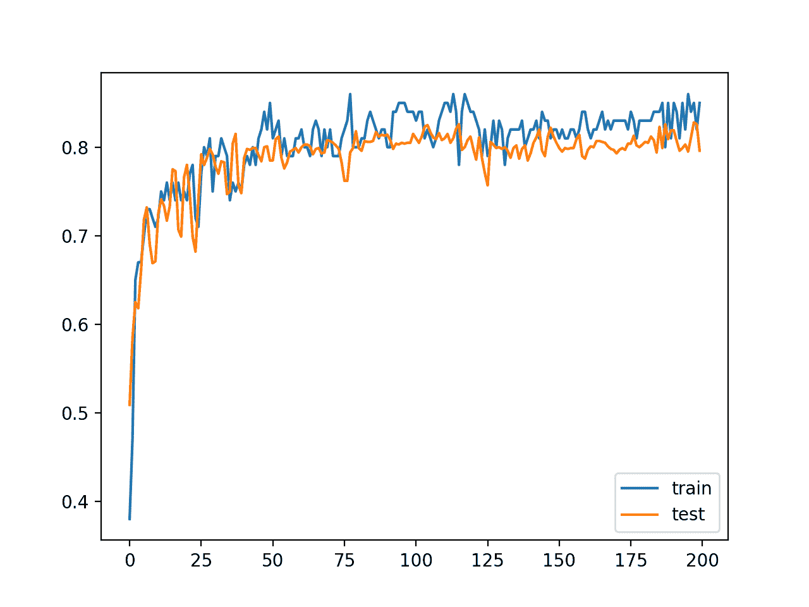
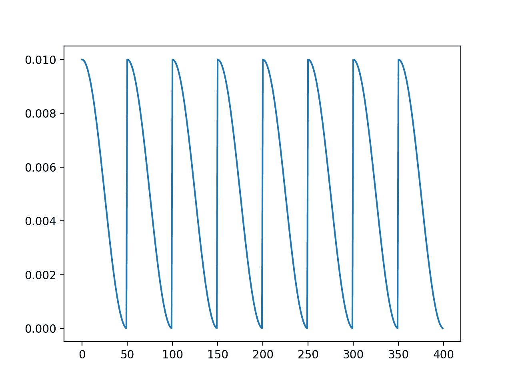
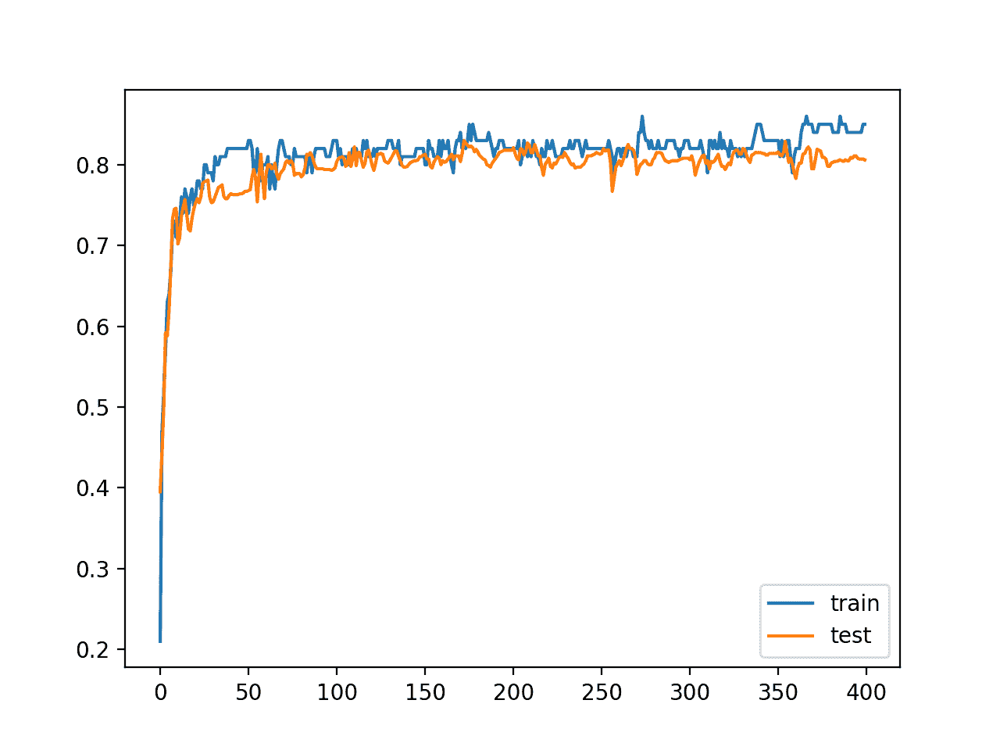
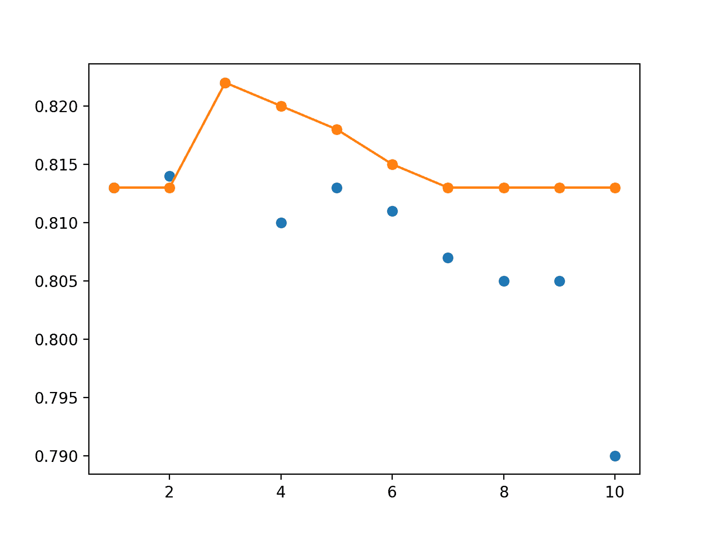

# Python 中深度学习神经网络的快照集成

> 原文：<https://machinelearningmastery.com/snapshot-ensemble-deep-learning-neural-network/>

最后更新于 2020 年 8 月 28 日

模型集成可以实现比单个模型更低的泛化误差，但是考虑到训练每个单个模型的计算成本，使用深度学习神经网络进行开发是具有挑战性的。

另一种方法是在一次训练运行中训练多个模型快照，并结合它们的预测进行集成预测。这种方法的一个限制是，保存的模型将是相似的，导致相似的预测和预测误差，并且不能从组合它们的预测中提供太多好处。

[有效的集成](https://machinelearningmastery.com/ensemble-methods-for-deep-learning-neural-networks/)需要一组不同的熟练集成成员，这些成员具有不同的预测误差分布。一种促进在单次训练运行期间保存的模型多样性的方法是使用积极的学习率计划，该计划迫使模型权重发生大的变化，进而迫使在每次快照时保存的模型的性质发生大的变化。

在本教程中，您将发现如何在一次训练中使用积极的学习率计划来开发保存的模型的快照集合。

完成本教程后，您将知道:

*   快照集成组合了单次训练运行期间保存的多个模型的预测。
*   模型快照的多样性可以通过在单次训练中积极循环使用学习率来实现。
*   如何在单次运行期间保存模型快照并加载快照模型以进行集成预测。

**用我的新书[更好的深度学习](https://machinelearningmastery.com/better-deep-learning/)启动你的项目**，包括*分步教程*和所有示例的 *Python 源代码*文件。

我们开始吧。

*   **2019 年 10 月更新**:针对 Keras 2.3 和 TensorFlow 2.0 更新。
*   **2020 年 1 月更新**:针对 Sklearn v0.22 API 的变化进行了更新。


如何用 Keras 开发 Python 中的快照集成深度学习神经网络图片作者:杰森·雅各布斯，版权所有。

## 教程概述

本教程分为五个部分；它们是:

1.  快照集
2.  多类分类问题
3.  多层感知器模型
4.  余弦退火学习率
5.  MLP 快照一起

## 快照集

使用深度学习方法的集成学习的一个问题是训练多个模型的巨大计算成本。

这是因为使用了非常深的模型和非常大的数据集，导致模型训练时间可能会延长到几天、几周甚至几个月。

> 尽管集成具有明显的优势，但它在深度网络中的使用远不如在其他算法中广泛。缺乏适应性的一个可能原因可能是学习多个神经网络的成本。训练深度网络可以持续数周，即使是在具有 GPU 加速的高表现硬件上。

——[快照合集:1 号列车，免费获得 M](https://arxiv.org/abs/1704.00109)，2017。

深度学习神经网络集成学习的一种方法是从单次训练中收集多个模型。这解决了训练多个深度学习模型的计算成本，因为模型可以在训练期间被选择和保存，然后用于进行集成预测。

与单个模型的预测相比，集成学习的一个主要好处是提高了表现。这可以通过选择具有良好技能的成员来实现，但是以不同的方式，提供一组不同的预测来组合。在一次训练中收集多个模型的一个限制是模型可能很好，但过于相似。

这可以通过改变深度神经网络的学习算法来解决，以在单次训练运行期间强制探索不同的网络权重，这将反过来导致具有不同表现的模型。实现这一点的一种方法是积极改变训练中使用的[学习率](https://machinelearningmastery.com/learning-rate-for-deep-learning-neural-networks/)。

一种在训练过程中系统地、积极地改变学习率以产生非常不同的网络权重的方法被称为“*带温重启的随机梯度下降*”或简称为 SGDR，由 Ilya Loshchilov 和 Frank Hutter 在他们 2017 年的论文“ [SGDR:带温重启的随机梯度下降](https://arxiv.org/abs/1608.03983)”中描述

他们的方法包括在训练阶段系统地改变学习率，称为余弦退火。这种方法需要指定两个超参数:初始学习率和训练时期的总数。

“*余弦退火*”方法具有以较大的学习率开始的效果，该学习率在再次急剧增加之前相对快速地降低到最小值。模型权重在训练过程中会发生剧烈变化，其效果是使用“*好权重*”作为后续学习率周期的起点，但允许学习算法收敛到不同的解。

学习率的重置类似于学习过程的模拟重启，并且重新使用好的权重作为重启的起点被称为“*热重启*”，而不是“*冷重启*”，在冷重启中可以使用一组新的小随机数作为起点。

每个循环底部的“*好权重*”可以保存到文件中，提供模型的快照。这些快照可以在运行结束时一起收集，并在模型平均集成中使用。在积极的学习进度计划中保存和使用这些模型被称为“*快照集合*”，由黄高等人在他们 2017 年发表的题为“[快照集合:火车 1，免费获得 M](https://arxiv.org/abs/1704.00109)”的论文中进行了描述，随后也用于更新版本的洛希洛夫和赫特论文中。

> ……我们让 SGD 沿着它的优化路径收敛 M 次到局部极小值。每次模型收敛时，我们保存权重并将相应的网络添加到我们的集成中。然后，我们以较大的学习率重新开始优化，以避开当前的局部最小值。

——[快照合集:1 号列车，免费获得 M](https://arxiv.org/abs/1704.00109)，2017。

模式集合是在训练单个模式的过程中创建的，因此，作者声称集合预报是免费提供的。

> [该方法允许]学习多个神经网络的集合，而不会产生任何额外的训练成本。

——[快照合集:1 号列车，免费获得 M](https://arxiv.org/abs/1704.00109)，2017。

虽然余弦退火计划用于学习率，但也可以使用其他积极的学习率计划，例如莱斯利·史密斯在 2017 年题为“训练神经网络的循环学习率”的论文中描述的更简单的循环学习率计划

现在我们已经熟悉了快照集成技术，我们可以看看如何用 Keras 在 Python 中实现它。

## 多类分类问题

我们将使用一个小的多类分类问题作为基础来演示快照集成。

Sklearn 类提供了 [make_blobs()函数](http://Sklearn.org/stable/modules/generated/sklearn.datasets.make_blobs.html)，该函数可用于创建具有规定数量的样本、输入变量、类和类内样本方差的多类分类问题。

该问题有两个输入变量(表示点的 *x* 和 *y* 坐标)和每组内点的标准偏差 2.0。我们将使用相同的随机状态(伪随机数发生器的种子)来确保我们总是获得相同的数据点。

```py
# generate 2d classification dataset
X, y = make_blobs(n_samples=1000, centers=3, n_features=2, cluster_std=2, random_state=2)
```

结果是我们可以建模的数据集的输入和输出元素。

为了了解问题的复杂性，我们可以在二维散点图上绘制每个点，并按类值给每个点着色。

下面列出了完整的示例。

```py
# scatter plot of blobs dataset
from sklearn.datasets import make_blobs
from matplotlib import pyplot
from numpy import where
# generate 2d classification dataset
X, y = make_blobs(n_samples=1000, centers=3, n_features=2, cluster_std=2, random_state=2)
# scatter plot for each class value
for class_value in range(3):
	# select indices of points with the class label
	row_ix = where(y == class_value)
	# scatter plot for points with a different color
	pyplot.scatter(X[row_ix, 0], X[row_ix, 1])
# show plot
pyplot.show()
```

运行该示例会创建整个数据集的散点图。我们可以看到，2.0 的标准偏差意味着类不是线性可分的(用一条线可分的)，导致很多不明确的点。

这是可取的，因为这意味着问题不是微不足道的，并将允许神经网络模型找到许多不同的“足够好”的候选解决方案，从而导致高方差。


具有三个类和按类值着色的点的斑点数据集的散点图

## 多层感知器模型

在我们定义一个模型之前，我们需要设计一个适合整体的问题。

在我们的问题中，训练数据集相对较小。具体来说，训练数据集中的示例与保持数据集中的示例的比例为 10:1。这模拟了一种情况，即我们可能有大量未标记的示例和少量已标记的示例来训练模型。

我们将从斑点问题中创建 1100 个数据点。模型将在前 100 个点上进行训练，剩余的 1000 个点将保留在测试数据集中，模型无法使用。

该问题是一个多类分类问题，我们将在输出层使用 softmax 激活函数对其进行建模。这意味着模型将以样本属于三类中每一类的概率来预测具有三个元素的向量。因此，在将行分割成训练和测试数据集之前，我们必须对类值进行热编码。我们可以使用 Keras *到 _ classic()*函数来实现这一点。

```py
# generate 2d classification dataset
X, y = make_blobs(n_samples=1100, centers=3, n_features=2, cluster_std=2, random_state=2)
# one hot encode output variable
y = to_categorical(y)
# split into train and test
n_train = 100
trainX, testX = X[:n_train, :], X[n_train:, :]
trainy, testy = y[:n_train], y[n_train:]
```

接下来，我们可以定义和编译模型。

该模型将预期具有两个输入变量的样本。然后，该模型有一个具有 25 个节点的单个隐藏层和一个校正的线性激活函数，然后有一个具有三个节点的输出层来预测三个类中每一个的概率，还有一个 softmax 激活函数。

由于问题是多类的，我们将使用分类交叉熵损失函数来优化模型和具有小学习率和动量的[随机梯度下降](https://keras.io/optimizers/#sgd)。

```py
# define model
model = Sequential()
model.add(Dense(25, input_dim=2, activation='relu'))
model.add(Dense(3, activation='softmax'))
opt = SGD(lr=0.01, momentum=0.9)
model.compile(loss='categorical_crossentropy', optimizer=opt, metrics=['accuracy'])
```

该模型适合 200 个训练时期，我们将在测试集上评估每个时期的模型，使用测试集作为验证集。

```py
# fit model
history = model.fit(trainX, trainy, validation_data=(testX, testy), epochs=200, verbose=0)
```

在运行结束时，我们将评估模型在列车和测试集上的表现。

```py
# evaluate the model
_, train_acc = model.evaluate(trainX, trainy, verbose=0)
_, test_acc = model.evaluate(testX, testy, verbose=0)
print('Train: %.3f, Test: %.3f' % (train_acc, test_acc))
```

最后，我们将在训练和验证数据集上绘制每个训练时期的模型精度的学习曲线。

```py
# learning curves of model accuracy
pyplot.plot(history.history['accuracy'], label='train')
pyplot.plot(history.history['val_accuracy'], label='test')
pyplot.legend()
pyplot.show()
```

将所有这些结合在一起，下面列出了完整的示例。

```py
# develop an mlp for blobs dataset
from sklearn.datasets import make_blobs
from keras.utils import to_categorical
from keras.models import Sequential
from keras.layers import Dense
from keras.optimizers import SGD
from matplotlib import pyplot
# generate 2d classification dataset
X, y = make_blobs(n_samples=1100, centers=3, n_features=2, cluster_std=2, random_state=2)
# one hot encode output variable
y = to_categorical(y)
# split into train and test
n_train = 100
trainX, testX = X[:n_train, :], X[n_train:, :]
trainy, testy = y[:n_train], y[n_train:]
# define model
model = Sequential()
model.add(Dense(25, input_dim=2, activation='relu'))
model.add(Dense(3, activation='softmax'))
opt = SGD(lr=0.01, momentum=0.9)
model.compile(loss='categorical_crossentropy', optimizer=opt, metrics=['accuracy'])
# fit model
history = model.fit(trainX, trainy, validation_data=(testX, testy), epochs=200, verbose=0)
# evaluate the model
_, train_acc = model.evaluate(trainX, trainy, verbose=0)
_, test_acc = model.evaluate(testX, testy, verbose=0)
print('Train: %.3f, Test: %.3f' % (train_acc, test_acc))
# learning curves of model accuracy
pyplot.plot(history.history['accuracy'], label='train')
pyplot.plot(history.history['val_accuracy'], label='test')
pyplot.legend()
pyplot.show()
```

运行该示例将打印最终模型在列车和测试数据集上的表现。

**注**:考虑到算法或评估程序的随机性，或数值精度的差异，您的[结果可能会有所不同](https://machinelearningmastery.com/different-results-each-time-in-machine-learning/)。考虑运行该示例几次，并比较平均结果。

在这种情况下，我们可以看到该模型在训练数据集上获得了大约 84%的准确率，我们知道这是乐观的，在测试数据集上获得了大约 79%的准确率，我们预计这将更加真实。

```py
Train: 0.840, Test: 0.796
```

还创建了一个线图，显示了在每个训练周期内，训练和测试集上模型精度的学习曲线。

我们可以看到，在大部分跑步过程中，训练的准确性更加乐观，我们也注意到了最终得分。



每个训练时期训练和测试数据集上模型精度的线图学习曲线

接下来，我们可以看看如何实现积极的学习进度计划。

## 余弦退火学习率

一个有效的快照集成需要训练一个具有积极学习率计划的神经网络。

余弦退火调度是主动学习率调度的一个例子，其中学习率开始较高，并且在再次增加到最大值之前相对快速地下降到接近零的最小值。

我们可以按照 2017 年论文《[快照合集:1 号列车，免费获得 M](https://arxiv.org/abs/1704.00109)》中描述的时间表执行该等式需要总训练时期、最大学习率和周期数作为自变量以及当前时期数。然后，该函数返回给定时期的学习率。


余弦退火学习率表的等式
其中 a(t)是在时间点 T 的学习率，a0 是最大学习率，T 是总时间点，M 是周期数，mod 是模运算，方括号表示下限运算。
摘自《快照合集:1 号列车，免费取 M》。

下面的函数*余弦 _ 退火()*实现了这个等式。

```py
# cosine annealing learning rate schedule
def cosine_annealing(epoch, n_epochs, n_cycles, lrate_max):
	epochs_per_cycle = floor(n_epochs/n_cycles)
	cos_inner = (pi * (epoch % epochs_per_cycle)) / (epochs_per_cycle)
	return lrate_max/2 * (cos(cos_inner) + 1)
```

我们可以通过绘制具有五个周期(例如 20 个时期长)的 100 个时期的学习率和 0.01 的最大学习率来测试这种实现。下面列出了完整的示例。

```py
# example of a cosine annealing learning rate schedule
from matplotlib import pyplot
from math import pi
from math import cos
from math import floor

# cosine annealing learning rate schedule
def cosine_annealing(epoch, n_epochs, n_cycles, lrate_max):
	epochs_per_cycle = floor(n_epochs/n_cycles)
	cos_inner = (pi * (epoch % epochs_per_cycle)) / (epochs_per_cycle)
	return lrate_max/2 * (cos(cos_inner) + 1)

# create learning rate series
n_epochs = 100
n_cycles = 5
lrate_max = 0.01
series = [cosine_annealing(i, n_epochs, n_cycles, lrate_max) for i in range(n_epochs)]
# plot series
pyplot.plot(series)
pyplot.show()
```

运行该示例会创建一个超过 100 个时期的学习进度线图。

我们可以看到，学习率从历元 0 处的最大值开始，并迅速降低到历元 19，然后在历元 20 处复位，即下一个周期的开始。按照参数中的指定，循环重复五次。


余弦退火学习率表的线图

我们可以在 Keras 中将这个时间表实现为自定义回调。这允许指定时间表的参数并记录学习率，以便我们可以确保它具有预期的效果。

自定义回调可以定义为扩展 Keras 回调类的 Python 类。

在类构造器中，我们可以将所需的配置作为参数保存起来以备使用，具体来说就是训练时期的总数、学习率计划的周期数以及最大学习率。

我们可以使用上面定义的*余弦 _ 退火()*来计算给定训练时期的学习率。

回调类允许在每个训练时期之前调用的 *on_epoch_begin()* 函数被覆盖。我们可以覆盖这个函数来计算当前时期的学习率，并在优化器中设置它。我们还可以在内部列表中记录学习率。

完整的自定义回调定义如下。

```py
# define custom learning rate schedule
class CosineAnnealingLearningRateSchedule(Callback):
	# constructor
	def __init__(self, n_epochs, n_cycles, lrate_max, verbose=0):
		self.epochs = n_epochs
		self.cycles = n_cycles
		self.lr_max = lrate_max
		self.lrates = list()

	# calculate learning rate for an epoch
	def cosine_annealing(self, epoch, n_epochs, n_cycles, lrate_max):
		epochs_per_cycle = floor(n_epochs/n_cycles)
		cos_inner = (pi * (epoch % epochs_per_cycle)) / (epochs_per_cycle)
		return lrate_max/2 * (cos(cos_inner) + 1)

	# calculate and set learning rate at the start of the epoch
	def on_epoch_begin(self, epoch, logs=None):
		# calculate learning rate
		lr = self.cosine_annealing(epoch, self.epochs, self.cycles, self.lr_max)
		# set learning rate
		backend.set_value(self.model.optimizer.lr, lr)
		# log value
		self.lrates.append(lr)
```

我们可以创建回调的实例并设置参数。我们将针对 400 个时期对模型进行培训，并将周期数设置为 50 个时期长，即 500 / 50，这是一个建议，并在整个快照合集论文中进行了配置。

> 我们以非常快的速度降低学习率，鼓励模型在短短 50 个时期后收敛到其第一个局部最小值。

——[快照合集:1 号列车，免费获得 M](https://arxiv.org/abs/1704.00109)，2017。

该文件还建议，可以为每个样本或每个小批量设置学习率，而不是在每个时期之前，以便为更新提供更多的细微差别，但我们将把这作为未来的练习。

> ……我们在每次迭代而不是每个时期更新学习率。这改善了短周期的收敛性，即使当使用大的初始学习率时。

——[快照合集:1 号列车，免费获得 M](https://arxiv.org/abs/1704.00109)，2017。

一旦回调被实例化和配置，我们可以将其指定为回调列表的一部分，以调用 *fit()* 函数来训练模型。

```py
# define learning rate callback
n_epochs = 400
n_cycles = n_epochs / 50
ca = CosineAnnealingLearningRateSchedule(n_epochs, n_cycles, 0.01)
# fit model
history = model.fit(trainX, trainy, validation_data=(testX, testy), epochs=n_epochs, verbose=0, callbacks=[ca])
```

在运行结束时，我们可以通过绘制*列表和*列表的内容来确认学习率计划的执行。

```py
# plot learning rate
pyplot.plot(ca.lrates)
pyplot.show()
```

将这些元素结合在一起，下面列出了用余弦退火学习率训练 MLP 的完整例子。

```py
# mlp with cosine annealing learning rate schedule on blobs problem
from sklearn.datasets import make_blobs
from keras.utils import to_categorical
from keras.models import Sequential
from keras.layers import Dense
from keras.callbacks import Callback
from keras.optimizers import SGD
from keras import backend
from math import pi
from math import cos
from math import floor
from matplotlib import pyplot

# define custom learning rate schedule
class CosineAnnealingLearningRateSchedule(Callback):
	# constructor
	def __init__(self, n_epochs, n_cycles, lrate_max, verbose=0):
		self.epochs = n_epochs
		self.cycles = n_cycles
		self.lr_max = lrate_max
		self.lrates = list()

	# calculate learning rate for an epoch
	def cosine_annealing(self, epoch, n_epochs, n_cycles, lrate_max):
		epochs_per_cycle = floor(n_epochs/n_cycles)
		cos_inner = (pi * (epoch % epochs_per_cycle)) / (epochs_per_cycle)
		return lrate_max/2 * (cos(cos_inner) + 1)

	# calculate and set learning rate at the start of the epoch
	def on_epoch_begin(self, epoch, logs=None):
		# calculate learning rate
		lr = self.cosine_annealing(epoch, self.epochs, self.cycles, self.lr_max)
		# set learning rate
		backend.set_value(self.model.optimizer.lr, lr)
		# log value
		self.lrates.append(lr)

# generate 2d classification dataset
X, y = make_blobs(n_samples=1100, centers=3, n_features=2, cluster_std=2, random_state=2)
# one hot encode output variable
y = to_categorical(y)
# split into train and test
n_train = 100
trainX, testX = X[:n_train, :], X[n_train:, :]
trainy, testy = y[:n_train], y[n_train:]
# define model
model = Sequential()
model.add(Dense(25, input_dim=2, activation='relu'))
model.add(Dense(3, activation='softmax'))
opt = SGD(momentum=0.9)
model.compile(loss='categorical_crossentropy', optimizer=opt, metrics=['accuracy'])
# define learning rate callback
n_epochs = 400
n_cycles = n_epochs / 50
ca = CosineAnnealingLearningRateSchedule(n_epochs, n_cycles, 0.01)
# fit model
history = model.fit(trainX, trainy, validation_data=(testX, testy), epochs=n_epochs, verbose=0, callbacks=[ca])
# evaluate the model
_, train_acc = model.evaluate(trainX, trainy, verbose=0)
_, test_acc = model.evaluate(testX, testy, verbose=0)
print('Train: %.3f, Test: %.3f' % (train_acc, test_acc))
# plot learning rate
pyplot.plot(ca.lrates)
pyplot.show()
# learning curves of model accuracy
pyplot.plot(history.history['accuracy'], label='train')
pyplot.plot(history.history['val_accuracy'], label='test')
pyplot.legend()
pyplot.show()
```

运行该示例首先报告模型在训练集和测试集上的准确性。

**注**:考虑到算法或评估程序的随机性，或数值精度的差异，您的[结果可能会有所不同](https://machinelearningmastery.com/different-results-each-time-in-machine-learning/)。考虑运行该示例几次，并比较平均结果。

在这种情况下，与前一部分相比，我们看不出最终模型的表现有多大差异。

```py
Train: 0.850, Test: 0.806
```

创建学习率时间表的线图，显示每个 50 个时代的八个周期。



布洛布问题拟合 MLP 时的余弦退火学习率调度

最后，在每个训练时期，在训练集和测试集上创建模型精度的线图。

我们可以看到，虽然学习率发生了巨大的变化，但对模型的准确性没有显著的影响，这可能是因为所选的分类问题并不是很难。



余弦退火学习率调度下 Blobs 数据集上训练和测试集精度的线图

现在我们知道如何实现余弦退火学习调度，我们可以使用它来准备快照集成。

## MLP 快照一起

我们可以分两部分开发快照集合。

第一部分包括创建一个自定义回调，将模型保存在每个学习进度计划的底部。第二部分包括加载保存的模型，并使用它们来进行集成预测。

### 培训期间保存快照模型

可以更新*cosineannealinglearningletschedule*以覆盖在每个训练周期结束时调用的 *on_epoch_end()* 函数。在这个函数中，我们可以检查刚刚结束的当前纪元是否是一个周期的结束。如果是这样，我们可以将模型保存到文件中。

下面是更新后的回调，命名为 *SnapshotEnsemble* 类。

每次保存模型时都会打印一条调试消息，以确认模型保存的时间是正确的。例如，对于 50 个周期的长周期，我们希望在 49、99 等周期保存一个模型。并且在时期 50、100 等重置学习率。

```py
# snapshot ensemble with custom learning rate schedule
class SnapshotEnsemble(Callback):
	# constructor
	def __init__(self, n_epochs, n_cycles, lrate_max, verbose=0):
		self.epochs = n_epochs
		self.cycles = n_cycles
		self.lr_max = lrate_max
		self.lrates = list()

	# calculate learning rate for epoch
	def cosine_annealing(self, epoch, n_epochs, n_cycles, lrate_max):
		epochs_per_cycle = floor(n_epochs/n_cycles)
		cos_inner = (pi * (epoch % epochs_per_cycle)) / (epochs_per_cycle)
		return lrate_max/2 * (cos(cos_inner) + 1)

	# calculate and set learning rate at the start of the epoch
	def on_epoch_begin(self, epoch, logs={}):
		# calculate learning rate
		lr = self.cosine_annealing(epoch, self.epochs, self.cycles, self.lr_max)
		# set learning rate
		backend.set_value(self.model.optimizer.lr, lr)
		# log value
		self.lrates.append(lr)

	# save models at the end of each cycle
	def on_epoch_end(self, epoch, logs={}):
		# check if we can save model
		epochs_per_cycle = floor(self.epochs / self.cycles)
		if epoch != 0 and (epoch + 1) % epochs_per_cycle == 0:
			# save model to file
			filename = "snapshot_model_%d.h5" % int((epoch + 1) / epochs_per_cycle)
			self.model.save(filename)
			print('>saved snapshot %s, epoch %d' % (filename, epoch))
```

我们将为 500 个时期训练模型，以便在以后进行集合预测时给出 10 个模型供选择。

下面列出了使用这种新的快照集成将模型保存到文件中的完整示例。

```py
# example of saving models for a snapshot ensemble
from sklearn.datasets import make_blobs
from keras.utils import to_categorical
from keras.models import Sequential
from keras.layers import Dense
from keras.callbacks import Callback
from keras.optimizers import SGD
from keras import backend
from math import pi
from math import cos
from math import floor

# snapshot ensemble with custom learning rate schedule
class SnapshotEnsemble(Callback):
	# constructor
	def __init__(self, n_epochs, n_cycles, lrate_max, verbose=0):
		self.epochs = n_epochs
		self.cycles = n_cycles
		self.lr_max = lrate_max
		self.lrates = list()

	# calculate learning rate for epoch
	def cosine_annealing(self, epoch, n_epochs, n_cycles, lrate_max):
		epochs_per_cycle = floor(n_epochs/n_cycles)
		cos_inner = (pi * (epoch % epochs_per_cycle)) / (epochs_per_cycle)
		return lrate_max/2 * (cos(cos_inner) + 1)

	# calculate and set learning rate at the start of the epoch
	def on_epoch_begin(self, epoch, logs={}):
		# calculate learning rate
		lr = self.cosine_annealing(epoch, self.epochs, self.cycles, self.lr_max)
		# set learning rate
		backend.set_value(self.model.optimizer.lr, lr)
		# log value
		self.lrates.append(lr)

	# save models at the end of each cycle
	def on_epoch_end(self, epoch, logs={}):
		# check if we can save model
		epochs_per_cycle = floor(self.epochs / self.cycles)
		if epoch != 0 and (epoch + 1) % epochs_per_cycle == 0:
			# save model to file
			filename = "snapshot_model_%d.h5" % int((epoch + 1) / epochs_per_cycle)
			self.model.save(filename)
			print('>saved snapshot %s, epoch %d' % (filename, epoch))

# generate 2d classification dataset
X, y = make_blobs(n_samples=1100, centers=3, n_features=2, cluster_std=2, random_state=2)
# one hot encode output variable
y = to_categorical(y)
# split into train and test
n_train = 100
trainX, testX = X[:n_train, :], X[n_train:, :]
trainy, testy = y[:n_train], y[n_train:]
# define model
model = Sequential()
model.add(Dense(50, input_dim=2, activation='relu'))
model.add(Dense(3, activation='softmax'))
opt = SGD(momentum=0.9)
model.compile(loss='categorical_crossentropy', optimizer=opt, metrics=['accuracy'])
# create snapshot ensemble callback
n_epochs = 500
n_cycles = n_epochs / 50
ca = SnapshotEnsemble(n_epochs, n_cycles, 0.01)
# fit model
model.fit(trainX, trainy, validation_data=(testX, testy), epochs=n_epochs, verbose=0, callbacks=[ca])
```

运行该示例报告，余弦退火学习率计划的 10 端保存了 10 个模型。

```py
>saved snapshot snapshot_model_1.h5, epoch 49
>saved snapshot snapshot_model_2.h5, epoch 99
>saved snapshot snapshot_model_3.h5, epoch 149
>saved snapshot snapshot_model_4.h5, epoch 199
>saved snapshot snapshot_model_5.h5, epoch 249
>saved snapshot snapshot_model_6.h5, epoch 299
>saved snapshot snapshot_model_7.h5, epoch 349
>saved snapshot snapshot_model_8.h5, epoch 399
>saved snapshot snapshot_model_9.h5, epoch 449
>saved snapshot snapshot_model_10.h5, epoch 499
```

### 加载模型并进行集成预测

一旦快照模型被保存到文件中，它们就可以被加载并用于进行集成预测。

第一步是将模型载入内存。对于大型模型，这可以一次一个模型来完成，进行预测，并在组合预测之前继续下一个模型。在这种情况下，模型相对较小，我们可以从文件中以列表的形式加载所有 10 个模型。

```py
# load models from file
def load_all_models(n_models):
	all_models = list()
	for i in range(n_models):
		# define filename for this ensemble
		filename = 'snapshot_model_' + str(i + 1) + '.h5'
		# load model from file
		model = load_model(filename)
		# add to list of members
		all_models.append(model)
		print('>loaded %s' % filename)
	return all_models
```

我们预计在运行结束时保存的模型可能比运行早期保存的模型具有更好的表现。因此，我们可以颠倒加载模型的列表，以便旧模型是第一个。

```py
# reverse loaded models so we build the ensemble with the last models first
members = list(reversed(members))
```

我们不知道需要多少快照才能对这个问题做出很好的预测。我们可以通过从 499 时期的最终模型开始创建尺寸不断增加的集成，然后添加 449 时期保存的模型，以此类推，直到包括所有 10 个模型，来探索集成成员的数量对测试集准确性的影响。

首先，我们需要一个函数在给定一系列模型的情况下进行预测。给定每个模型预测每个输出类的概率，我们可以对模型的预测概率求和，并通过 [argmax()函数](https://machinelearningmastery.com/argmax-in-machine-learning/)选择支持度最高的类。下面的*集合 _ 预测()*函数实现了这个功能。

```py
# make an ensemble prediction for multi-class classification
def ensemble_predictions(members, testX):
	# make predictions
	yhats = [model.predict(testX) for model in members]
	yhats = array(yhats)
	# sum across ensemble members
	summed = numpy.sum(yhats, axis=0)
	# argmax across classes
	result = argmax(summed, axis=1)
	return result
```

然后，我们可以通过从模型列表中选择前 n 个成员来评估给定大小的集成，通过调用*集成 _ 预测()*函数进行预测，然后计算并返回预测的精度。下面的 *evaluate_n_members()* 函数实现了这个行为。

```py
# evaluate a specific number of members in an ensemble
def evaluate_n_members(members, n_members, testX, testy):
	# select a subset of members
	subset = members[:n_members]
	# make prediction
	yhat = ensemble_predictions(subset, testX)
	# calculate accuracy
	return accuracy_score(testy, yhat)
```

每个集合的表现也可以与每个独立模型的表现和所有独立模型的平均表现进行对比。

```py
# evaluate different numbers of ensembles on hold out set
single_scores, ensemble_scores = list(), list()
for i in range(1, len(members)+1):
	# evaluate model with i members
	ensemble_score = evaluate_n_members(members, i, testX, testy)
	# evaluate the i'th model standalone
	testy_enc = to_categorical(testy)
	_, single_score = members[i-1].evaluate(testX, testy_enc, verbose=0)
	# summarize this step
	print('> %d: single=%.3f, ensemble=%.3f' % (i, single_score, ensemble_score))
	ensemble_scores.append(ensemble_score)
	single_scores.append(single_score)
# summarize average accuracy of a single final model
print('Accuracy %.3f (%.3f)' % (mean(single_scores), std(single_scores)))
```

最后，我们可以将每个单个快照模型(蓝点)的表现与包括所有模型直到每个单个模型(橙色线)的集合的表现进行比较。

```py
# plot score vs number of ensemble members
x_axis = [i for i in range(1, len(members)+1)]
pyplot.plot(x_axis, single_scores, marker='o', linestyle='None')
pyplot.plot(x_axis, ensemble_scores, marker='o')
pyplot.show()
```

下面列出了使用不同大小的集成进行快照集成预测的完整示例。

```py
# load models and make a snapshot ensemble prediction
from sklearn.datasets import make_blobs
from sklearn.metrics import accuracy_score
from keras.utils import to_categorical
from keras.models import load_model
from keras.models import Sequential
from keras.layers import Dense
from matplotlib import pyplot
from numpy import mean
from numpy import std
import numpy
from numpy import array
from numpy import argmax

# load models from file
def load_all_models(n_models):
	all_models = list()
	for i in range(n_models):
		# define filename for this ensemble
		filename = 'snapshot_model_' + str(i + 1) + '.h5'
		# load model from file
		model = load_model(filename)
		# add to list of members
		all_models.append(model)
		print('>loaded %s' % filename)
	return all_models

# make an ensemble prediction for multi-class classification
def ensemble_predictions(members, testX):
	# make predictions
	yhats = [model.predict(testX) for model in members]
	yhats = array(yhats)
	# sum across ensemble members
	summed = numpy.sum(yhats, axis=0)
	# argmax across classes
	result = argmax(summed, axis=1)
	return result

# evaluate a specific number of members in an ensemble
def evaluate_n_members(members, n_members, testX, testy):
	# select a subset of members
	subset = members[:n_members]
	# make prediction
	yhat = ensemble_predictions(subset, testX)
	# calculate accuracy
	return accuracy_score(testy, yhat)

# generate 2d classification dataset
X, y = make_blobs(n_samples=1100, centers=3, n_features=2, cluster_std=2, random_state=2)
# split into train and test
n_train = 100
trainX, testX = X[:n_train, :], X[n_train:, :]
trainy, testy = y[:n_train], y[n_train:]
print(trainX.shape, testX.shape)
# load models in order
members = load_all_models(10)
print('Loaded %d models' % len(members))
# reverse loaded models so we build the ensemble with the last models first
members = list(reversed(members))
# evaluate different numbers of ensembles on hold out set
single_scores, ensemble_scores = list(), list()
for i in range(1, len(members)+1):
	# evaluate model with i members
	ensemble_score = evaluate_n_members(members, i, testX, testy)
	# evaluate the i'th model standalone
	testy_enc = to_categorical(testy)
	_, single_score = members[i-1].evaluate(testX, testy_enc, verbose=0)
	# summarize this step
	print('> %d: single=%.3f, ensemble=%.3f' % (i, single_score, ensemble_score))
	ensemble_scores.append(ensemble_score)
	single_scores.append(single_score)
# summarize average accuracy of a single final model
print('Accuracy %.3f (%.3f)' % (mean(single_scores), std(single_scores)))
# plot score vs number of ensemble members
x_axis = [i for i in range(1, len(members)+1)]
pyplot.plot(x_axis, single_scores, marker='o', linestyle='None')
pyplot.plot(x_axis, ensemble_scores, marker='o')
pyplot.show()
```

运行该示例首先将所有 10 个模型加载到内存中。

```py
>loaded snapshot_model_1.h5
>loaded snapshot_model_2.h5
>loaded snapshot_model_3.h5
>loaded snapshot_model_4.h5
>loaded snapshot_model_5.h5
>loaded snapshot_model_6.h5
>loaded snapshot_model_7.h5
>loaded snapshot_model_8.h5
>loaded snapshot_model_9.h5
>loaded snapshot_model_10.h5
Loaded 10 models
```

接下来，在测试数据集上评估每个快照模型，并报告准确性。这与快照集成的准确性形成对比，快照集成包括从运行结束后向后工作的所有快照模型，包括单个模型。

结果显示，当我们从运行结束向后工作时，快照模型的表现会变得更差，正如我们可能预期的那样。

**注**:考虑到算法或评估程序的随机性，或数值精度的差异，您的[结果可能会有所不同](https://machinelearningmastery.com/different-results-each-time-in-machine-learning/)。考虑运行该示例几次，并比较平均结果。

将快照模型组合成一个集合表明，表现提高到包括最后 3 到 5 个模型，达到大约 82%。这可以与大约 80%测试集准确度的快照模型的平均表现相比较。

```py
> 1: single=0.813, ensemble=0.813
> 2: single=0.814, ensemble=0.813
> 3: single=0.822, ensemble=0.822
> 4: single=0.810, ensemble=0.820
> 5: single=0.813, ensemble=0.818
> 6: single=0.811, ensemble=0.815
> 7: single=0.807, ensemble=0.813
> 8: single=0.805, ensemble=0.813
> 9: single=0.805, ensemble=0.813
> 10: single=0.790, ensemble=0.813
Accuracy 0.809 (0.008)
```

最后，创建一个线图，绘制相同的测试集准确度分数。

我们可以将每个单独快照模型的表现设置为一个蓝点，将大小(成员数量)从 1 增加到 10 的快照集合设置为一条橙色线。

至少在这次运行中，我们可以看到快照集成在表现降级回 81.3%的最终模型之前，以 82.2%的速度快速超越了具有 3 个成员的最终模型和所有其他保存的模型。



单一快照模型(蓝点)与不同大小快照集合(橙色线)的线图

## 扩展ˌ扩张

本节列出了一些您可能希望探索的扩展教程的想法。

*   **改变周期长度**。更新示例以使用更短或更长的周期长度并比较结果。
*   **改变最大学习率**。更新示例以使用更大或更小的最大学习率并比较结果。
*   **更新每批学习率**。更新示例以计算每批而不是每时期的学习率。
*   **重复评估**。更新示例以重复模型的评估，从而确认该方法确实在斑点问题上比最终模型有所改进。
*   **循环学习率**。更新示例以使用循环学习率计划并比较结果。

如果你探索这些扩展，我很想知道。

## 进一步阅读

如果您想更深入地了解这个主题，本节将提供更多资源。

### 报纸

*   [快照合集:1 号列车，免费获得 M](https://arxiv.org/abs/1704.00109)，2017。
*   [SGDR:温重启随机梯度下降](https://arxiv.org/abs/1608.03983)，2017。
*   [训练神经网络的循环学习率](https://arxiv.org/abs/1506.01186)，2017。

### 应用程序接口

*   [开始使用 Keras 顺序模型](https://keras.io/getting-started/sequential-model-guide/)
*   [硬核层 API](https://keras.io/layers/core/)
*   [Keras随机梯度下降 API](https://keras.io/optimizers/#sgd)
*   [硬回调接口](https://keras.io/callbacks/)
*   num py . argmax API
*   [sklearn . dataset . make _ blobs API](http://Sklearn.org/stable/modules/generated/sklearn.datasets.make_blobs.html)

### 文章

*   [2017 年深度学习亮点优化](http://ruder.io/deep-learning-optimization-2017/)。
*   [GitHub](https://github.com/bckenstler/CLR)Keras 的循环学习率(CLR)。
*   喀拉拉邦、吉卜赛邦的快照集。
*   [用学习率改善我们的工作方式](https://techburst.io/improving-the-way-we-work-with-learning-rate-5e99554f163b)，2017。
*   [循环学习率技术](http://teleported.in/posts/cyclic-learning-rate/)，2017。

## 摘要

在本教程中，您发现了如何在一次训练中使用积极的学习率计划来开发保存的模型的快照集合。

具体来说，您了解到:

*   快照集成组合了单次训练运行期间保存的多个模型的预测。
*   模型快照的多样性可以通过在单次训练中积极循环使用学习率来实现。
*   如何在单次运行期间保存模型快照并加载快照模型以进行集成预测。

你有什么问题吗？
在下面的评论中提问，我会尽力回答。