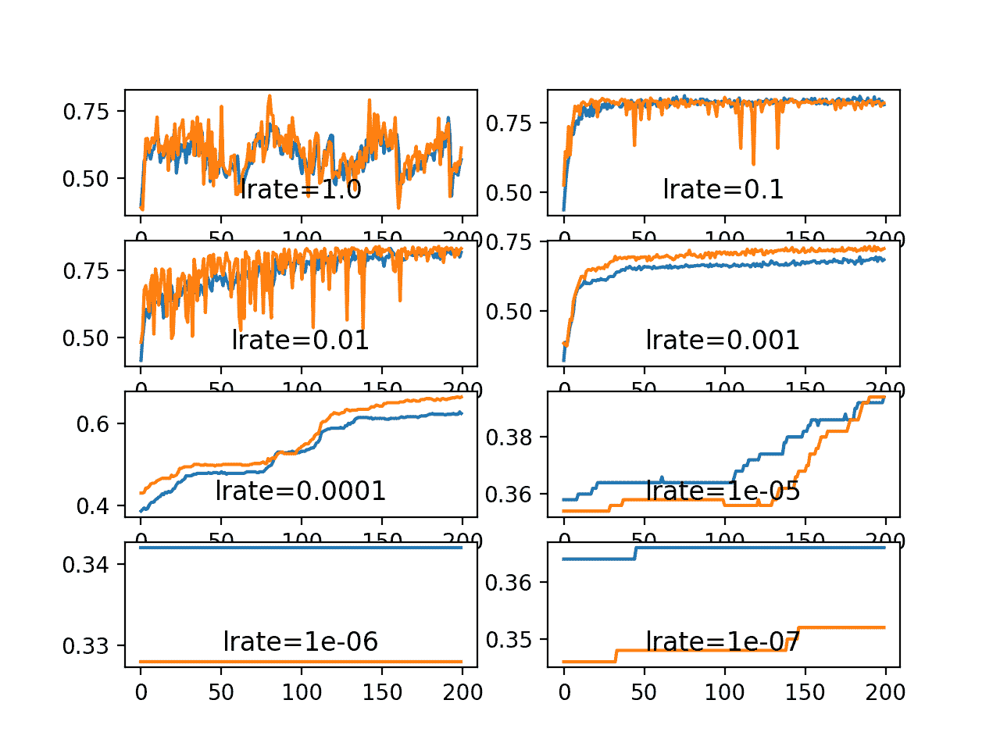
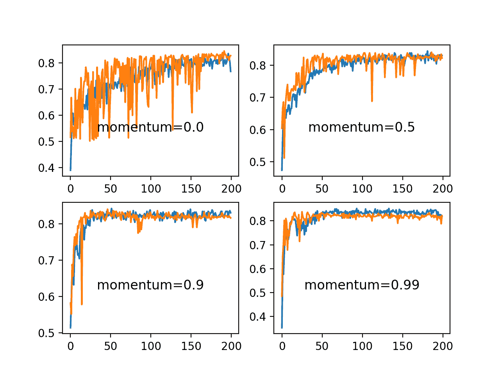
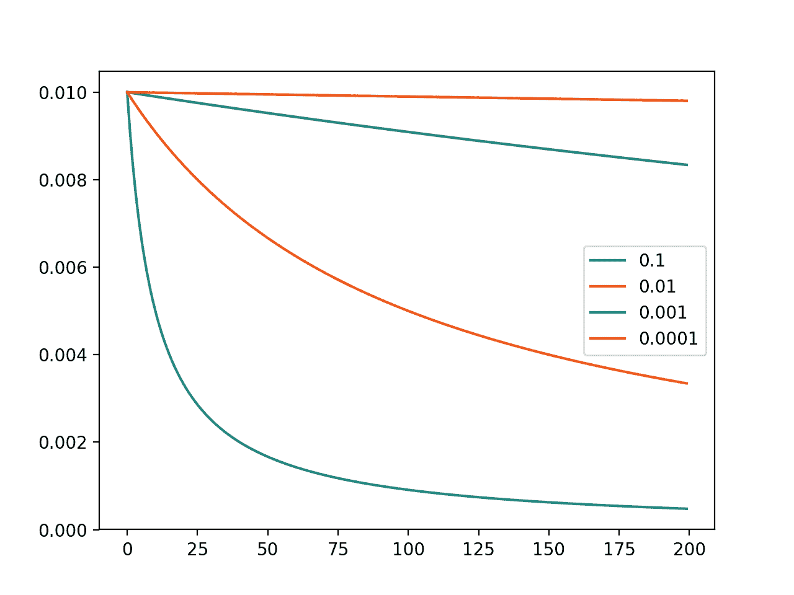
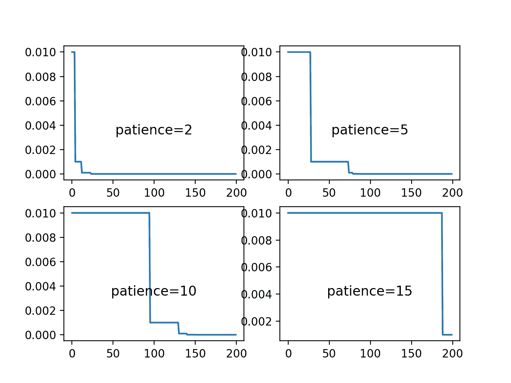
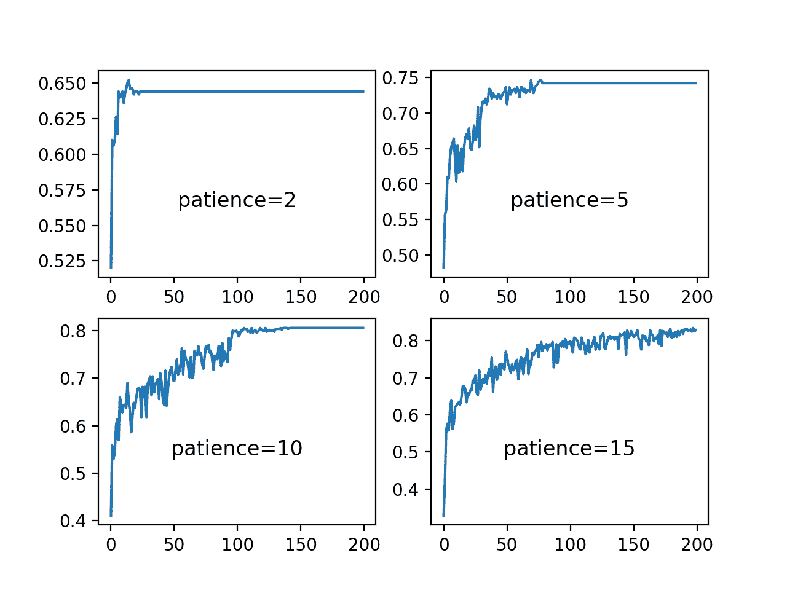
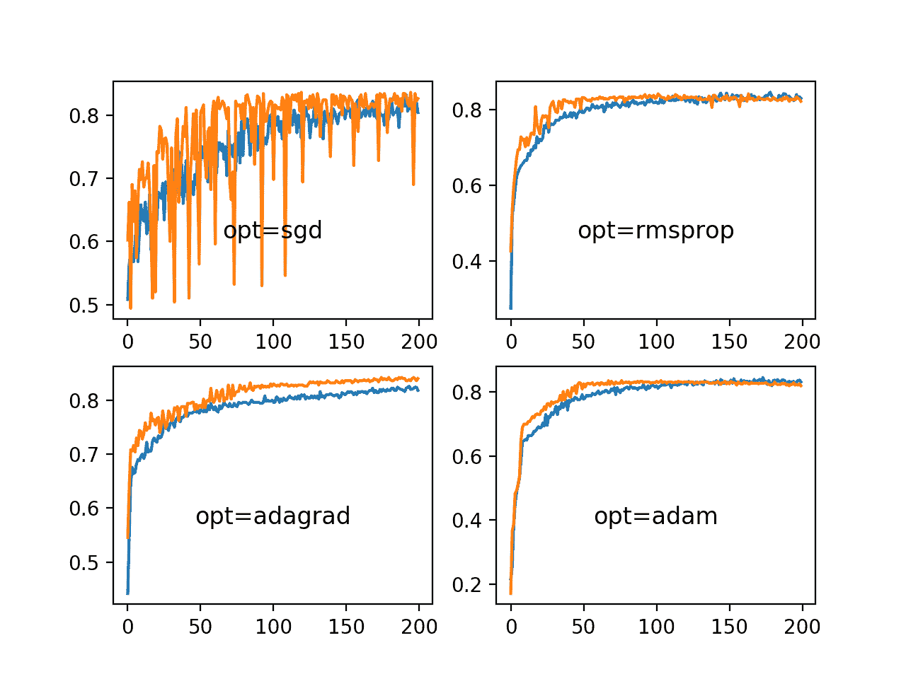

# 了解学习率对神经网络表现的影响

> 原文：<https://machinelearningmastery.com/understand-the-dynamics-of-learning-rate-on-deep-learning-neural-networks/>

最后更新于 2020 年 9 月 12 日

使用随机梯度下降优化算法训练深度学习神经网络。

学习率是一个超参数，它控制每次更新模型权重时，响应估计误差而改变模型的程度。选择学习率具有挑战性，因为值太小可能会导致长时间的训练过程，从而陷入停滞，而值太大可能会导致学习次优权重集的速度过快或训练过程不稳定。

在配置神经网络时，学习率可能是最重要的超参数。因此，了解如何研究学习率对模型表现的影响以及建立学习率对模型行为动态的直觉是至关重要的。

在本教程中，您将发现学习率、学习率计划和自适应学习率对模型表现的影响。

完成本教程后，您将知道:

*   多大的学习率导致训练不稳定，小的学习率导致训练失败。
*   动量可以加速训练，学习率计划可以帮助收敛优化过程。
*   自适应学习率可以加速训练，减轻选择学习率和学习率时间表的压力。

**用我的新书[更好的深度学习](https://machinelearningmastery.com/better-deep-learning/)启动你的项目**，包括*分步教程*和所有示例的 *Python 源代码*文件。

我们开始吧。

*   **2019 年 2 月更新**:修复了在编译()而不是 fit()函数上错误定义回调的问题。
*   **2019 年 10 月更新**:针对 Keras 2.3 和 TensorFlow 2.0 更新。
*   **2020 年 1 月更新**:针对 Sklearn v0.22 API 的变化进行了更新。


通过深度学习神经网络了解学习率对模型表现的动态影响

## 教程概述

本教程分为六个部分；它们是:

1.  学习率和梯度下降
2.  在 Keras 中配置学习率
3.  多类分类问题
4.  学习速度和动量的影响
5.  学习进度计划的影响
6.  适应性学习率的影响

## 学习率和梯度下降

使用随机梯度下降算法训练深度学习神经网络。

随机梯度下降是一种优化算法，它使用来自训练数据集的示例来估计模型当前状态的误差梯度，然后使用误差反向传播算法更新模型的权重，简称反向传播。

训练期间更新的权重量被称为步长或“*学习率*”

具体而言，学习率是用于神经网络训练的可配置超参数，其具有小的正值，通常在 0.0 和 1.0 之间的范围内。

学习率控制模型适应问题的速度。较小的学习率需要更多的[训练时期](https://machinelearningmastery.com/difference-between-a-batch-and-an-epoch/)，因为每次更新对权重所做的改变较小，而较大的学习率会导致快速变化，并且需要较少的训练时期。

太大的学习率会导致模型过快地收敛到次优解，而太小的学习率会导致过程停滞。

训练深度学习神经网络的挑战包括仔细选择学习率。它可能是模型最重要的超参数。

> 学习率可能是最重要的超参数。如果你有时间只调整一个超参数，调整学习率。

—第 429 页，[深度学习](https://amzn.to/2NJW3gE)，2016。

既然我们已经熟悉了什么是学习率，那么让我们来看看如何为神经网络配置学习率。

有关学习率及其工作原理的更多信息，请参见帖子:

*   [训练深度学习神经网络时如何配置学习率超参数](https://machinelearningmastery.com/learning-rate-for-deep-learning-neural-networks/)

## 在 Keras 中配置学习率

Keras 深度学习库允许您轻松配置随机梯度下降优化算法的多种不同变体的学习率。

### 随机梯度下降

Keras 提供了实现随机梯度下降优化器的 SGD 类，具有学习率和动量。

首先，必须创建和配置类的实例，然后在模型上调用 *fit()* 函数时，将其指定给“*优化器*”参数。

默认学习率为 0.01，默认不使用动量。

```py
from keras.optimizers import SGD
...
opt = SGD()
model.compile(..., optimizer=opt)
```

学习率可以通过“ *lr* 参数指定，动量可以通过“*动量*参数指定。

```py
from keras.optimizers import SGD
...
opt = SGD(lr=0.01, momentum=0.9)
model.compile(..., optimizer=opt)
```

该类还通过“*衰减*”参数支持学习率衰减。

随着学习率的衰减，每次更新(例如，每个小批量的结束)都会计算学习率，如下所示:

```py
lrate = initial_lrate * (1 / (1 + decay * iteration))
```

其中 *lrate* 是当前纪元的学习率， *initial_lrate* 是指定为 SGD 参数的学习率，*衰减*是大于零的衰减速率，*迭代*是当前更新号。

```py
from keras.optimizers import SGD
...
opt = SGD(lr=0.01, momentum=0.9, decay=0.01)
model.compile(..., optimizer=opt)
```

### 学习进度计划

Keras 通过回调支持学习率计划。

回调与优化算法分开操作，尽管它们调整优化算法使用的学习率。建议在使用学习进度回拨时使用 SGD。

回调被实例化和配置，然后在训练模型时在 fit()函数的“*回调*”参数的列表中指定。

Keras 提供了[reduce lronplateaau](https://keras.io/callbacks/#reducelronplateau)，当检测到模型表现平稳时，例如给定数量的训练时期没有变化时，它将调整学习率。该回调旨在降低模型停止改进后的学习率，希望微调模型权重。

*reduce lronplateaau*要求您通过“ *monitor* ”参数指定训练期间要监控的指标，学习率将通过“*因子*”参数乘以的值，以及指定在触发学习率变化之前要等待的训练时期数的“*耐心*”参数。

例如，如果验证损失在 100 个时期内没有改善，我们可以监控验证损失，并将学习率降低一个数量级:

```py
# snippet of using the ReduceLROnPlateau callback
from keras.callbacks import ReduceLROnPlateau
...
rlrop = ReduceLROnPlateau(monitor='val_loss', factor=0.1, patience=100)
model.fit(..., callbacks=[rlrop])
```

Keras 还提供了[学习率调度器](https://keras.io/callbacks/#learningratescheduler)回调，允许您指定在每个时期调用的函数，以调整学习率。

您可以定义您的 Python 函数，该函数接受两个参数(纪元和当前学习率)并返回新的学习率。

```py
# snippet of using the LearningRateScheduler callback
from keras.callbacks import LearningRateScheduler
...

def my_learning_rate(epoch, lrate):
	return lrate

lrs = LearningRateScheduler(my_learning_rate)
model.fit(..., callbacks=[lrs])
```

### 自适应学习率梯度下降

Keras 还提供了一套简单随机梯度下降的扩展，支持自适应学习率。

因为每种方法都适应学习率，通常每个模型权重一个学习率，所以通常只需要很少的配置。

三种常用的自适应学习率方法包括:

#### 优化器

```py
from keras.optimizers import RMSprop
...
opt = RMSprop()
model.compile(..., optimizer=opt)
```

#### Adagrad 优化器

```py
from keras.optimizers import Adagrad
...
opt = Adagrad()
model.compile(..., optimizer=opt)
```

#### 亚当优化器

```py
from keras.optimizers import Adam
...
opt = Adam()
model.compile(..., optimizer=opt)
```

## 多类分类问题

我们将使用一个小的多类分类问题作为基础来演示学习率对模型表现的影响。

Sklearn 类提供了 [make_blobs()函数](http://Sklearn.org/stable/modules/generated/sklearn.datasets.make_blobs.html)，该函数可用于创建具有规定数量的样本、输入变量、类和类内样本方差的多类分类问题。

该问题有两个输入变量(表示点的 *x* 和 *y* 坐标)和每组内点的标准偏差 2.0。我们将使用相同的随机状态(伪随机数发生器的种子)来确保我们总是获得相同的数据点。

```py
# generate 2d classification dataset
X, y = make_blobs(n_samples=1000, centers=3, n_features=2, cluster_std=2, random_state=2)
```

结果是我们可以建模的数据集的输入和输出元素。

为了了解问题的复杂性，我们可以在二维散点图上绘制每个点，并按类值给每个点着色。

下面列出了完整的示例。

```py
# scatter plot of blobs dataset
from sklearn.datasets import make_blobs
from matplotlib import pyplot
from numpy import where
# generate 2d classification dataset
X, y = make_blobs(n_samples=1000, centers=3, n_features=2, cluster_std=2, random_state=2)
# scatter plot for each class value
for class_value in range(3):
	# select indices of points with the class label
	row_ix = where(y == class_value)
	# scatter plot for points with a different color
	pyplot.scatter(X[row_ix, 0], X[row_ix, 1])
# show plot
pyplot.show()
```

运行该示例会创建整个数据集的散点图。我们可以看到，2.0 的标准差意味着类不是线性可分的(用一条线可分)，造成了很多模棱两可的点。

这是可取的，因为这意味着问题不是微不足道的，并将允许神经网络模型找到许多不同的“足够好”的候选解决方案。


具有三个类和按类值着色的点的斑点数据集的散点图

## 学习速度和动量的影响

在本节中，我们将开发一个多层感知器(MLP)模型来解决斑点分类问题，并研究不同学习率和动量的影响。

### 学习速度动态

第一步是开发一个函数，该函数将从问题中创建样本，并将它们分成训练和测试数据集。

此外，我们还必须对目标变量进行热编码，这样我们就可以开发一个模型来预测一个例子属于每个类的概率。

下面的 *prepare_data()* 函数实现了这种行为，返回分割成输入和输出元素的训练和测试集。

```py
# prepare train and test dataset
def prepare_data():
	# generate 2d classification dataset
	X, y = make_blobs(n_samples=1000, centers=3, n_features=2, cluster_std=2, random_state=2)
	# one hot encode output variable
	y = to_categorical(y)
	# split into train and test
	n_train = 500
	trainX, testX = X[:n_train, :], X[n_train:, :]
	trainy, testy = y[:n_train], y[n_train:]
	return trainX, trainy, testX, testy
```

接下来，我们可以开发一个函数来拟合和评估 MLP 模型。

首先，我们将定义一个简单的 MLP 模型，该模型期望来自 blobs 问题的两个输入变量，具有一个包含 50 个节点的隐藏层，以及一个包含三个节点的输出层，以预测三个类中每个类的概率。隐藏层的节点将使用[整流线性激活函数(ReLU)](https://machinelearningmastery.com/rectified-linear-activation-function-for-deep-learning-neural-networks/) ，而输出层的节点将使用 softmax 激活函数。

```py
# define model
model = Sequential()
model.add(Dense(50, input_dim=2, activation='relu', kernel_initializer='he_uniform'))
model.add(Dense(3, activation='softmax'))
```

我们将使用随机梯度下降优化器，并要求指定学习率，以便我们可以评估不同的速率。该模型将被训练为最小化交叉熵。

```py
# compile model
opt = SGD(lr=lrate)
model.compile(loss='categorical_crossentropy', optimizer=opt, metrics=['accuracy'])
```

该模型将适合 200 个训练时期，通过少量的试错发现，测试集将用作验证数据集，因此我们可以在训练过程中了解模型的泛化误差。

```py
# fit model
history = model.fit(trainX, trainy, validation_data=(testX, testy), epochs=200, verbose=0)
```

一旦合适，我们将在训练和测试集上绘制模型的准确性。

```py
# plot learning curves
pyplot.plot(history.history['accuracy'], label='train')
pyplot.plot(history.history['val_accuracy'], label='test')
pyplot.title('lrate='+str(lrate), pad=-50)
```

下面的 *fit_model()* 函数将这些元素联系在一起，并在给定要评估的训练和测试数据集以及特定学习率的情况下，拟合模型并绘制其表现。

```py
# fit a model and plot learning curve
def fit_model(trainX, trainy, testX, testy, lrate):
	# define model
	model = Sequential()
	model.add(Dense(50, input_dim=2, activation='relu', kernel_initializer='he_uniform'))
	model.add(Dense(3, activation='softmax'))
	# compile model
	opt = SGD(lr=lrate)
	model.compile(loss='categorical_crossentropy', optimizer=opt, metrics=['accuracy'])
	# fit model
	history = model.fit(trainX, trainy, validation_data=(testX, testy), epochs=200, verbose=0)
	# plot learning curves
	pyplot.plot(history.history['accuracy'], label='train')
	pyplot.plot(history.history['val_accuracy'], label='test')
	pyplot.title('lrate='+str(lrate), pad=-50)
```

我们现在可以研究火车上不同学习率的动态，并测试模型的准确性。

在本例中，我们将在 1E-0 (1.0)到 1E-7 的对数标度上评估学习率，并通过调用 *fit_model()* 函数为每个学习率创建线图。

```py
# create learning curves for different learning rates
learning_rates = [1E-0, 1E-1, 1E-2, 1E-3, 1E-4, 1E-5, 1E-6, 1E-7]
for i in range(len(learning_rates)):
	# determine the plot number
	plot_no = 420 + (i+1)
	pyplot.subplot(plot_no)
	# fit model and plot learning curves for a learning rate
	fit_model(trainX, trainy, testX, testy, learning_rates[i])
# show learning curves
pyplot.show()
```

将所有这些结合在一起，下面列出了完整的示例。

```py
# study of learning rate on accuracy for blobs problem
from sklearn.datasets import make_blobs
from keras.layers import Dense
from keras.models import Sequential
from keras.optimizers import SGD
from keras.utils import to_categorical
from matplotlib import pyplot

# prepare train and test dataset
def prepare_data():
	# generate 2d classification dataset
	X, y = make_blobs(n_samples=1000, centers=3, n_features=2, cluster_std=2, random_state=2)
	# one hot encode output variable
	y = to_categorical(y)
	# split into train and test
	n_train = 500
	trainX, testX = X[:n_train, :], X[n_train:, :]
	trainy, testy = y[:n_train], y[n_train:]
	return trainX, trainy, testX, testy

# fit a model and plot learning curve
def fit_model(trainX, trainy, testX, testy, lrate):
	# define model
	model = Sequential()
	model.add(Dense(50, input_dim=2, activation='relu', kernel_initializer='he_uniform'))
	model.add(Dense(3, activation='softmax'))
	# compile model
	opt = SGD(lr=lrate)
	model.compile(loss='categorical_crossentropy', optimizer=opt, metrics=['accuracy'])
	# fit model
	history = model.fit(trainX, trainy, validation_data=(testX, testy), epochs=200, verbose=0)
	# plot learning curves
	pyplot.plot(history.history['accuracy'], label='train')
	pyplot.plot(history.history['val_accuracy'], label='test')
	pyplot.title('lrate='+str(lrate), pad=-50)

# prepare dataset
trainX, trainy, testX, testy = prepare_data()
# create learning curves for different learning rates
learning_rates = [1E-0, 1E-1, 1E-2, 1E-3, 1E-4, 1E-5, 1E-6, 1E-7]
for i in range(len(learning_rates)):
	# determine the plot number
	plot_no = 420 + (i+1)
	pyplot.subplot(plot_no)
	# fit model and plot learning curves for a learning rate
	fit_model(trainX, trainy, testX, testy, learning_rates[i])
# show learning curves
pyplot.show()
```

运行该示例会创建一个包含八个不同评估学习率的八条线图的图形。训练数据集上的分类精度用蓝色标记，而测试数据集上的精度用橙色标记。

**注**:考虑到算法或评估程序的随机性，或数值精度的差异，您的[结果可能会有所不同](https://machinelearningmastery.com/different-results-each-time-in-machine-learning/)。考虑运行该示例几次，并比较平均结果。

这些图显示了在过大的学习率为 1.0 时的行为振荡，以及模型在过小的学习率为 1E-6 和 1E-7 时无法学习任何东西。

我们可以看到，该模型能够以 1E-1、1E-2 和 1E-3 的学习率很好地学习问题，尽管随着学习率的降低，学习速度逐梯度慢。对于所选择的模型配置，结果表明 0.1 的中等学习率在训练和测试集上产生良好的模型表现。



斑点分类问题上一组学习率的训练和测试精度的线图

### 动量动力学

动量可以平滑学习算法的进程，进而可以加速训练过程。

我们可以改编上一节的例子，用固定的学习率来评估动量的效果。在这种情况下，我们将选择 0.01 的学习率，在前一节中，该学习率收敛到一个合理的解决方案，但是需要比 0.1 的学习率更多的时期

*fit_model()* 函数可以更新为取一个“*动量*参数，而不是学习率参数，该参数可以在 SGD 类的配置中使用，并在生成的图中报告。

下面列出了该功能的更新版本。

```py
# fit a model and plot learning curve
def fit_model(trainX, trainy, testX, testy, momentum):
	# define model
	model = Sequential()
	model.add(Dense(50, input_dim=2, activation='relu', kernel_initializer='he_uniform'))
	model.add(Dense(3, activation='softmax'))
	# compile model
	opt = SGD(lr=0.01, momentum=momentum)
	model.compile(loss='categorical_crossentropy', optimizer=opt, metrics=['accuracy'])
	# fit model
	history = model.fit(trainX, trainy, validation_data=(testX, testy), epochs=200, verbose=0)
	# plot learning curves
	pyplot.plot(history.history['accuracy'], label='train')
	pyplot.plot(history.history['val_accuracy'], label='test')
	pyplot.title('momentum='+str(momentum), pad=-80)
```

通常使用接近 1.0 的动量值，例如 0.9 和 0.99。

在本例中，我们将演示与动量值为 0.5 和更高动量值的模型相比，没有动量的模型的动力学。

```py
# create learning curves for different momentums
momentums = [0.0, 0.5, 0.9, 0.99]
for i in range(len(momentums)):
	# determine the plot number
	plot_no = 220 + (i+1)
	pyplot.subplot(plot_no)
	# fit model and plot learning curves for a momentum
	fit_model(trainX, trainy, testX, testy, momentums[i])
# show learning curves
pyplot.show()
```

将所有这些结合在一起，下面列出了完整的示例。

```py
# study of momentum on accuracy for blobs problem
from sklearn.datasets import make_blobs
from keras.layers import Dense
from keras.models import Sequential
from keras.optimizers import SGD
from keras.utils import to_categorical
from matplotlib import pyplot

# prepare train and test dataset
def prepare_data():
	# generate 2d classification dataset
	X, y = make_blobs(n_samples=1000, centers=3, n_features=2, cluster_std=2, random_state=2)
	# one hot encode output variable
	y = to_categorical(y)
	# split into train and test
	n_train = 500
	trainX, testX = X[:n_train, :], X[n_train:, :]
	trainy, testy = y[:n_train], y[n_train:]
	return trainX, trainy, testX, testy

# fit a model and plot learning curve
def fit_model(trainX, trainy, testX, testy, momentum):
	# define model
	model = Sequential()
	model.add(Dense(50, input_dim=2, activation='relu', kernel_initializer='he_uniform'))
	model.add(Dense(3, activation='softmax'))
	# compile model
	opt = SGD(lr=0.01, momentum=momentum)
	model.compile(loss='categorical_crossentropy', optimizer=opt, metrics=['accuracy'])
	# fit model
	history = model.fit(trainX, trainy, validation_data=(testX, testy), epochs=200, verbose=0)
	# plot learning curves
	pyplot.plot(history.history['accuracy'], label='train')
	pyplot.plot(history.history['val_accuracy'], label='test')
	pyplot.title('momentum='+str(momentum), pad=-80)

# prepare dataset
trainX, trainy, testX, testy = prepare_data()
# create learning curves for different momentums
momentums = [0.0, 0.5, 0.9, 0.99]
for i in range(len(momentums)):
	# determine the plot number
	plot_no = 220 + (i+1)
	pyplot.subplot(plot_no)
	# fit model and plot learning curves for a momentum
	fit_model(trainX, trainy, testX, testy, momentums[i])
# show learning curves
pyplot.show()
```

运行该示例会创建一个图形，其中包含四个不同动量值的线图。训练数据集上的分类精度用蓝色标记，而测试数据集上的精度用橙色标记。

**注**:考虑到算法或评估程序的随机性，或数值精度的差异，您的[结果可能会有所不同](https://machinelearningmastery.com/different-results-each-time-in-machine-learning/)。考虑运行该示例几次，并比较平均结果。

我们可以看到动量的加入确实加速了模型的训练。具体而言，0.9 和 0.99 的动量值在大约 50 个训练时期内实现了合理的训练和测试精度，而当不使用动量时为 200 个训练时期。

在所有使用动量的情况下，模型在保持测试数据集上的精度看起来更稳定，在训练时期表现出较少的波动性。



关于斑点分类问题的列车线图和一组动量的检验精度

## 学习进度计划的影响

我们将在这一部分看两个学习进度。

第一个是内置在 SGD 类中的衰减，第二个是*reduce lronplateaau*回调。

### 学习率衰减

*SGD* 类提供了指定学习率衰减的“*衰减*”参数。

从等式或代码中可能不清楚这种衰减对更新后的学习率有什么影响。我们可以用一个工作实例来说明这一点。

下面的函数实现了在 [SGD 类](https://github.com/keras-team/keras/blob/master/keras/optimizers.py)中实现的学习率衰减。

```py
# learning rate decay
def decay_lrate(initial_lrate, decay, iteration):
	return initial_lrate * (1.0 / (1.0 + decay * iteration))
```

我们可以使用这个函数来计算具有不同衰减值的多次更新的学习率。

我们将比较一系列衰减值[1E-1，1E-2，1E-3，1E-4]，初始学习率为 0.01，权重更新为 200。

```py
decays = [1E-1, 1E-2, 1E-3, 1E-4]
lrate = 0.01
n_updates = 200
for decay in decays:
	# calculate learning rates for updates
	lrates = [decay_lrate(lrate, decay, i) for i in range(n_updates)]
	# plot result
	pyplot.plot(lrates, label=str(decay))
```

下面列出了完整的示例。

```py
# demonstrate the effect of decay on the learning rate
from matplotlib import pyplot

# learning rate decay
def	decay_lrate(initial_lrate, decay, iteration):
	return initial_lrate * (1.0 / (1.0 + decay * iteration))

decays = [1E-1, 1E-2, 1E-3, 1E-4]
lrate = 0.01
n_updates = 200
for decay in decays:
	# calculate learning rates for updates
	lrates = [decay_lrate(lrate, decay, i) for i in range(n_updates)]
	# plot result
	pyplot.plot(lrates, label=str(decay))
pyplot.legend()
pyplot.show()
```

运行该示例会创建一个折线图，显示不同衰减值的学习率随更新的变化。

我们可以看到，在所有情况下，学习率都是从初始值 0.01 开始的。我们可以看到，1E-4 的小衰减值(红色)几乎没有影响，而 1E-1 的大衰减值(蓝色)有着戏剧性的效果，在 50 个纪元内将学习率降低到 0.002 以下(比初始值小一个数量级左右)，并达到最终值 0.0004 左右(比初始值小两个数量级左右)。

我们可以看到学习率的变化不是线性的。我们还可以看到，学习率的变化取决于批次大小，之后会执行更新。在上一节的示例中，500 个示例中 32 的[默认批处理大小](https://machinelearningmastery.com/difference-between-a-batch-and-an-epoch/)导致每个时期 16 次更新和 200 个时期的 3，200 次更新。

使用 0.1 的衰减和 0.01 的初始学习率，我们可以计算出最终学习率是大约 3.1E-05 的微小值。



多次权重更新中衰减对学习率影响的线图

我们可以更新上一节中的示例，以评估不同学习率衰减值的动态性。

将学习率固定在 0.01 并且不使用动量，我们将期望非常小的学习率衰减将是优选的，因为大的学习率衰减将迅速导致学习率太小，模型无法有效学习。

*fit_model()* 函数可以更新为采用“*衰减*参数，该参数可用于配置 SGD 类的衰减。

下面列出了该功能的更新版本。

```py
# fit a model and plot learning curve
def fit_model(trainX, trainy, testX, testy, decay):
	# define model
	model = Sequential()
	model.add(Dense(50, input_dim=2, activation='relu', kernel_initializer='he_uniform'))
	model.add(Dense(3, activation='softmax'))
	# compile model
	opt = SGD(lr=0.01, decay=decay)
	model.compile(loss='categorical_crossentropy', optimizer=opt, metrics=['accuracy'])
	# fit model
	history = model.fit(trainX, trainy, validation_data=(testX, testy), epochs=200, verbose=0)
	# plot learning curves
	pyplot.plot(history.history['accuracy'], label='train')
	pyplot.plot(history.history['val_accuracy'], label='test')
	pyplot.title('decay='+str(decay), pad=-80)
```

我们可以评估[1E-1，1E-2，1E-3，1E-4]的相同四个衰减值及其对模型精度的影响。

下面列出了完整的示例。

```py
# study of decay rate on accuracy for blobs problem
from sklearn.datasets import make_blobs
from keras.layers import Dense
from keras.models import Sequential
from keras.optimizers import SGD
from keras.utils import to_categorical
from matplotlib import pyplot

# prepare train and test dataset
def prepare_data():
	# generate 2d classification dataset
	X, y = make_blobs(n_samples=1000, centers=3, n_features=2, cluster_std=2, random_state=2)
	# one hot encode output variable
	y = to_categorical(y)
	# split into train and test
	n_train = 500
	trainX, testX = X[:n_train, :], X[n_train:, :]
	trainy, testy = y[:n_train], y[n_train:]
	return trainX, trainy, testX, testy

# fit a model and plot learning curve
def fit_model(trainX, trainy, testX, testy, decay):
	# define model
	model = Sequential()
	model.add(Dense(50, input_dim=2, activation='relu', kernel_initializer='he_uniform'))
	model.add(Dense(3, activation='softmax'))
	# compile model
	opt = SGD(lr=0.01, decay=decay)
	model.compile(loss='categorical_crossentropy', optimizer=opt, metrics=['accuracy'])
	# fit model
	history = model.fit(trainX, trainy, validation_data=(testX, testy), epochs=200, verbose=0)
	# plot learning curves
	pyplot.plot(history.history['accuracy'], label='train')
	pyplot.plot(history.history['val_accuracy'], label='test')
	pyplot.title('decay='+str(decay), pad=-80)

# prepare dataset
trainX, trainy, testX, testy = prepare_data()
# create learning curves for different decay rates
decay_rates = [1E-1, 1E-2, 1E-3, 1E-4]
for i in range(len(decay_rates)):
	# determine the plot number
	plot_no = 220 + (i+1)
	pyplot.subplot(plot_no)
	# fit model and plot learning curves for a decay rate
	fit_model(trainX, trainy, testX, testy, decay_rates[i])
# show learning curves
pyplot.show()
```

运行该示例会创建一个图形，其中包含不同评估学习率衰减值的四条线图。训练数据集上的分类精度用蓝色标记，而测试数据集上的精度用橙色标记。

**注**:考虑到算法或评估程序的随机性，或数值精度的差异，您的[结果可能会有所不同](https://machinelearningmastery.com/different-results-each-time-in-machine-learning/)。考虑运行该示例几次，并比较平均结果。

我们可以看到，1E-1 和 1E-2 的大衰减值确实会使该模型在这个问题上的学习率衰减过快，从而导致表现不佳。衰减值越小，表现越好，1E-4 的值可能会导致完全不使用衰减的类似结果。事实上，我们可以计算出 1E-4 衰减的最终学习率约为 0.0075，只比初始值 0.01 小一点点。


斑点分类问题上一组衰减率的训练和检验精度的线图

### 高原学习率下降

在给定数量的时期内，在监控指标没有变化的情况下，*减少学习率*会将学习率降低一个因子。

我们可以探究不同“*耐心*”值的效果，即在降低学习率之前等待改变的纪元数。我们将使用默认的学习率 0.01，并将“*因子*”参数设置为 0.1，从而将学习率降低一个数量级。

```py
rlrp = ReduceLROnPlateau(monitor='val_loss', factor=0.1, patience=patience, min_delta=1E-7)
```

回顾培训期间对学习率的影响将会很有趣。我们可以通过创建一个新的 Keras Callback 来做到这一点，它负责记录每个训练时期结束时的学习率。然后，我们可以检索记录的学习率，并创建一个折线图来查看学习率如何受到下降的影响。

我们可以创建一个名为*学习率监视器*的自定义*回调*。在训练开始时调用 *on_train_begin()* 函数，在该函数中我们可以定义一个学习率的空列表。在每个训练时期结束时调用 *on_epoch_end()* 函数，在该函数中，我们可以从优化器中检索优化器和当前学习率，并将其存储在列表中。下面列出了完整的*学习率监视器*回调。

```py
# monitor the learning rate
class LearningRateMonitor(Callback):
	# start of training
	def on_train_begin(self, logs={}):
		self.lrates = list()

	# end of each training epoch
	def on_epoch_end(self, epoch, logs={}):
		# get and store the learning rate
		optimizer = self.model.optimizer
		lrate = float(backend.get_value(self.model.optimizer.lr))
		self.lrates.append(lrate)
```

在前几节中开发的 *fit_model()* 函数可以更新，以创建和配置 *ReduceLROnPlateau* 回调和我们新的 *LearningRateMonitor* 回调，并在 fit 调用中向模型注册它们。

该函数还会以“*耐心*”作为参数，这样我们就可以评估不同的值。

```py
# fit model
rlrp = ReduceLROnPlateau(monitor='val_loss', factor=0.1, patience=patience, min_delta=1E-7)
lrm = LearningRateMonitor()
history = model.fit(trainX, trainy, validation_data=(testX, testy), epochs=200, verbose=0, callbacks=[rlrp, lrm])
```

在本例中，我们将希望创建几个图，因此 *fit_model()* 函数将返回每个训练时期的学习率以及训练数据集上的损失和准确性的列表，而不是直接创建子图。

下面列出了这些更新的功能。

```py
# fit a model and plot learning curve
def fit_model(trainX, trainy, testX, testy, patience):
	# define model
	model = Sequential()
	model.add(Dense(50, input_dim=2, activation='relu', kernel_initializer='he_uniform'))
	model.add(Dense(3, activation='softmax'))
	# compile model
	opt = SGD(lr=0.01)
	model.compile(loss='categorical_crossentropy', optimizer=opt, metrics=['accuracy'])
	# fit model
	rlrp = ReduceLROnPlateau(monitor='val_loss', factor=0.1, patience=patience, min_delta=1E-7)
	lrm = LearningRateMonitor()
	history = model.fit(trainX, trainy, validation_data=(testX, testy), epochs=200, verbose=0, callbacks=[rlrp, lrm])
	return lrm.lrates, history.history['loss'], history.history['accuracy']
```

*ReduceLROnPlateau* 中的耐心控制学习率下降的频率。

我们将在 blobs 问题上测试适合该模型的几个不同的耐心值，并跟踪每次运行的学习率、损失和准确性系列。

```py
# create learning curves for different patiences
patiences = [2, 5, 10, 15]
lr_list, loss_list, acc_list, = list(), list(), list()
for i in range(len(patiences)):
	# fit model and plot learning curves for a patience
	lr, loss, acc = fit_model(trainX, trainy, testX, testy, patiences[i])
	lr_list.append(lr)
	loss_list.append(loss)
	acc_list.append(acc)
```

在运行结束时，我们将为每个耐心值的学习率、训练损失和每个耐心值的训练精度创建带有线图的数字。

我们可以创建一个助手函数来轻松地为我们记录的每个系列创建一个带有子情节的图形。

```py
# create line plots for a series
def line_plots(patiences, series):
	for i in range(len(patiences)):
		pyplot.subplot(220 + (i+1))
		pyplot.plot(series[i])
		pyplot.title('patience='+str(patiences[i]), pad=-80)
	pyplot.show()
```

将这些元素结合在一起，下面列出了完整的示例。

```py
# study of patience for the learning rate drop schedule on the blobs problem
from sklearn.datasets import make_blobs
from keras.layers import Dense
from keras.models import Sequential
from keras.optimizers import SGD
from keras.utils import to_categorical
from keras.callbacks import Callback
from keras.callbacks import ReduceLROnPlateau
from keras import backend
from matplotlib import pyplot

# monitor the learning rate
class LearningRateMonitor(Callback):
	# start of training
	def on_train_begin(self, logs={}):
		self.lrates = list()

	# end of each training epoch
	def on_epoch_end(self, epoch, logs={}):
		# get and store the learning rate
		optimizer = self.model.optimizer
		lrate = float(backend.get_value(self.model.optimizer.lr))
		self.lrates.append(lrate)

# prepare train and test dataset
def prepare_data():
	# generate 2d classification dataset
	X, y = make_blobs(n_samples=1000, centers=3, n_features=2, cluster_std=2, random_state=2)
	# one hot encode output variable
	y = to_categorical(y)
	# split into train and test
	n_train = 500
	trainX, testX = X[:n_train, :], X[n_train:, :]
	trainy, testy = y[:n_train], y[n_train:]
	return trainX, trainy, testX, testy

# fit a model and plot learning curve
def fit_model(trainX, trainy, testX, testy, patience):
	# define model
	model = Sequential()
	model.add(Dense(50, input_dim=2, activation='relu', kernel_initializer='he_uniform'))
	model.add(Dense(3, activation='softmax'))
	# compile model
	opt = SGD(lr=0.01)
	model.compile(loss='categorical_crossentropy', optimizer=opt, metrics=['accuracy'])
	# fit model
	rlrp = ReduceLROnPlateau(monitor='val_loss', factor=0.1, patience=patience, min_delta=1E-7)
	lrm = LearningRateMonitor()
	history = model.fit(trainX, trainy, validation_data=(testX, testy), epochs=200, verbose=0, callbacks=[rlrp, lrm])
	return lrm.lrates, history.history['loss'], history.history['accuracy']

# create line plots for a series
def line_plots(patiences, series):
	for i in range(len(patiences)):
		pyplot.subplot(220 + (i+1))
		pyplot.plot(series[i])
		pyplot.title('patience='+str(patiences[i]), pad=-80)
	pyplot.show()

# prepare dataset
trainX, trainy, testX, testy = prepare_data()
# create learning curves for different patiences
patiences = [2, 5, 10, 15]
lr_list, loss_list, acc_list, = list(), list(), list()
for i in range(len(patiences)):
	# fit model and plot learning curves for a patience
	lr, loss, acc = fit_model(trainX, trainy, testX, testy, patiences[i])
	lr_list.append(lr)
	loss_list.append(loss)
	acc_list.append(acc)
# plot learning rates
line_plots(patiences, lr_list)
# plot loss
line_plots(patiences, loss_list)
# plot accuracy
line_plots(patiences, acc_list)
```

运行该示例会创建三个图形，每个图形包含不同耐心值的线图。

**注**:考虑到算法或评估程序的随机性，或数值精度的差异，您的[结果可能会有所不同](https://machinelearningmastery.com/different-results-each-time-in-machine-learning/)。考虑运行该示例几次，并比较平均结果。

第一个图显示了每个评估的耐心值在训练时期的学习率的线图。我们可以看到，最小的两个耐心值在 25 个纪元内迅速将学习率降至最小值，最大的 15 个耐心值仅遭受一次学习率下降。

从这些图中，我们可以预期这个模型在这个问题上的 5 和 10 的耐心值会导致更好的表现，因为它们允许在降低学习率以细化权重之前使用更大的学习率一段时间。



减少延迟计划中使用的不同耐心值在不同时期的学习率线图

下图显示了每个耐心值在训练数据集中的损失。

该图显示，耐心值 2 和 5 导致模型快速收敛，可能达到次优损失值。在耐心水平为 10 和 15 的情况下，损失会合理下降，直到学习率下降到可以看到损失的巨大变化的水平以下。这发生在耐心 10 的中途，接近耐心 15 的运行结束。


减少延迟计划中使用的不同耐心值在不同时期的训练损失线图

最后一个图显示了每个耐心值在不同训练时期的训练集准确度。

我们可以看到，事实上，2 和 5 个时期的小耐心值导致模型过早收敛到低于最优的模型，准确率分别约为 65%和低于 75%。更大的耐心值导致更好的模型表现，耐心 10 在 150 个纪元之前显示出收敛，而耐心 15 在给定几乎完全不变的学习率的情况下继续显示出不稳定的精度的影响。

这些图显示了学习率的降低是解决问题的一种明智方式，所选择的模型配置可以产生一组熟练且收敛的稳定的最终权重，这是训练结束时最终模型的一个理想特性。



减少延迟计划中使用的不同耐心值在不同时期的训练精度线图

## 适应性学习率的影响

学习率和学习率计划对于深度学习神经网络模型的配置和表现都是具有挑战性的。

Keras 提供了许多具有自适应学习率的随机梯度下降的流行变体，例如:

*   自适应梯度算法。
*   均方根传播。
*   自适应矩估计。

每种方法都为网络中的每个权重提供了不同的学习率调整方法。

没有单一的最佳算法，赛车优化算法在一个问题上的结果不太可能转移到新的问题上。

我们可以研究不同的自适应学习率方法对 blobs 问题的动态性。可以更新 *fit_model()* 函数，取一个优化算法的名字进行求值，在编译 MLP 模型时可以指定给“*优化器*”参数。然后将使用每个方法的默认参数。下面列出了该功能的更新版本。

```py
# fit a model and plot learning curve
def fit_model(trainX, trainy, testX, testy, optimizer):
	# define model
	model = Sequential()
	model.add(Dense(50, input_dim=2, activation='relu', kernel_initializer='he_uniform'))
	model.add(Dense(3, activation='softmax'))
	# compile model
	model.compile(loss='categorical_crossentropy', optimizer=optimizer, metrics=['accuracy'])
	# fit model
	history = model.fit(trainX, trainy, validation_data=(testX, testy), epochs=200, verbose=0)
	# plot learning curves
	pyplot.plot(history.history['accuracy'], label='train')
	pyplot.plot(history.history['val_accuracy'], label='test')
	pyplot.title('opt='+optimizer, pad=-80)
```

我们可以探索 RMSprop、AdaGrad 和 Adam 这三种流行的方法，并将它们的行为与具有静态学习率的简单随机梯度下降进行比较。

我们期望算法的自适应学习率版本表现相似或更好，也许在更少的训练时期适应问题，但重要的是，产生更稳定的模型。

```py
# prepare dataset
trainX, trainy, testX, testy = prepare_data()
# create learning curves for different optimizers
momentums = ['sgd', 'rmsprop', 'adagrad', 'adam']
for i in range(len(momentums)):
	# determine the plot number
	plot_no = 220 + (i+1)
	pyplot.subplot(plot_no)
	# fit model and plot learning curves for an optimizer
	fit_model(trainX, trainy, testX, testy, momentums[i])
# show learning curves
pyplot.show()
```

将这些元素结合在一起，下面列出了完整的示例。

```py
# study of sgd with adaptive learning rates in the blobs problem
from sklearn.datasets import make_blobs
from keras.layers import Dense
from keras.models import Sequential
from keras.optimizers import SGD
from keras.utils import to_categorical
from keras.callbacks import Callback
from keras import backend
from matplotlib import pyplot

# prepare train and test dataset
def prepare_data():
	# generate 2d classification dataset
	X, y = make_blobs(n_samples=1000, centers=3, n_features=2, cluster_std=2, random_state=2)
	# one hot encode output variable
	y = to_categorical(y)
	# split into train and test
	n_train = 500
	trainX, testX = X[:n_train, :], X[n_train:, :]
	trainy, testy = y[:n_train], y[n_train:]
	return trainX, trainy, testX, testy

# fit a model and plot learning curve
def fit_model(trainX, trainy, testX, testy, optimizer):
	# define model
	model = Sequential()
	model.add(Dense(50, input_dim=2, activation='relu', kernel_initializer='he_uniform'))
	model.add(Dense(3, activation='softmax'))
	# compile model
	model.compile(loss='categorical_crossentropy', optimizer=optimizer, metrics=['accuracy'])
	# fit model
	history = model.fit(trainX, trainy, validation_data=(testX, testy), epochs=200, verbose=0)
	# plot learning curves
	pyplot.plot(history.history['accuracy'], label='train')
	pyplot.plot(history.history['val_accuracy'], label='test')
	pyplot.title('opt='+optimizer, pad=-80)

# prepare dataset
trainX, trainy, testX, testy = prepare_data()
# create learning curves for different optimizers
momentums = ['sgd', 'rmsprop', 'adagrad', 'adam']
for i in range(len(momentums)):
	# determine the plot number
	plot_no = 220 + (i+1)
	pyplot.subplot(plot_no)
	# fit model and plot learning curves for an optimizer
	fit_model(trainX, trainy, testX, testy, momentums[i])
# show learning curves
pyplot.show()
```

运行该示例会创建一个图形，其中包含不同优化算法的四条线图。训练数据集上的分类精度用蓝色标记，而测试数据集上的精度用橙色标记。

**注**:考虑到算法或评估程序的随机性，或数值精度的差异，您的[结果可能会有所不同](https://machinelearningmastery.com/different-results-each-time-in-machine-learning/)。考虑运行该示例几次，并比较平均结果。

同样，我们可以看到，默认学习率为 0.01 并且没有动量的 SGD 确实学习了问题，但是需要几乎所有 200 个时期，并且导致训练数据的不稳定精度，并且在测试数据集上更是如此。这些图显示，所有三种自适应学习率方法都能够更快地学习问题，并且在训练和测试集准确性方面波动性显著更小。

RMSProp 和 Adam 都表现出了相似的表现，在 50 个训练期内有效地学习了问题，并花费剩余的训练时间进行了非常小的权重更新，但没有像我们在上一节中看到的学习率计划那样收敛。



一套自适应学习率方法在斑点分类问题上的训练和测试精度的线图

## 进一步阅读

如果您想更深入地了解这个主题，本节将提供更多资源。

### 邮件

*   [训练深度学习神经网络时如何配置学习率超参数](https://machinelearningmastery.com/learning-rate-for-deep-learning-neural-networks/)

### 报纸

*   [深度架构基于梯度训练的实用建议](https://arxiv.org/abs/1206.5533)，2012。

### 书

*   第八章:深度模型训练优化，[深度学习](https://amzn.to/2NJW3gE)，2016。
*   第 6 章:学习率和动量，[神经锻造:前馈人工神经网络中的监督学习](https://amzn.to/2S8qRdI)，1999。
*   第 5.7 节:梯度下降，[用于模式识别的神经网络](https://amzn.to/2S8qdwt)，1995。

### 应用程序接口

*   [硬优化器 API](https://keras.io/optimizers/)
*   [硬回调接口](https://keras.io/callbacks/)
*   [优化器. py Keras 源代码](https://github.com/keras-team/keras/blob/master/keras/optimizers.py)

### 文章

*   [随机梯度下降，维基百科](https://en.wikipedia.org/wiki/Stochastic_gradient_descent)。
*   [反向钻取应该使用什么学习率？，神经网络常见问题](ftp://ftp.sas.com/pub/neural/FAQ2.html#A_learn_rate)。

## 摘要

在本教程中，您发现了学习率、学习率计划和自适应学习率对模型表现的影响。

具体来说，您了解到:

*   多大的学习率导致训练不稳定，小的学习率导致训练失败。
*   动量可以加速训练，学习率计划可以帮助收敛优化过程。
*   自适应学习率可以加速训练，减轻选择学习率和学习率时间表的压力。

你有什么问题吗？
在下面的评论中提问，我会尽力回答。