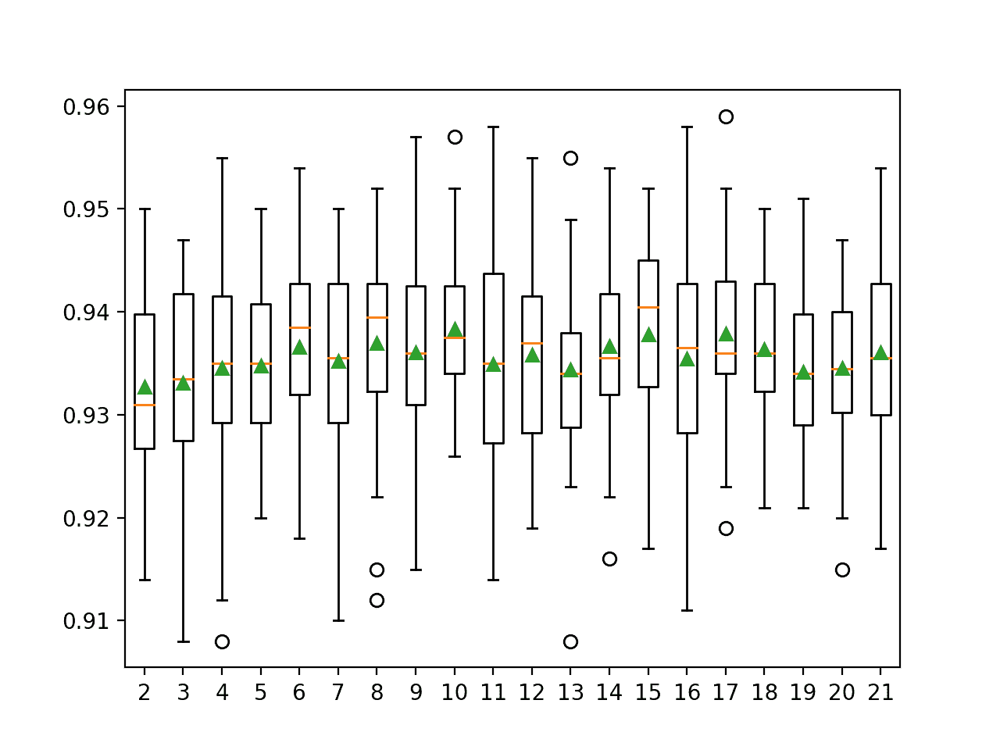

# Python 中分类的动态集成选择(DES)

> 原文：<https://machinelearningmastery.com/dynamic-ensemble-selection-in-python/>

最后更新于 2021 年 4 月 27 日

**动态集成选择**是一种集成学习技术，在进行预测时，可以及时自动选择集成成员的子集。

该技术包括在训练数据集上拟合多个机器学习模型，然后基于要预测的示例的细节，选择在对特定新示例进行预测时预期表现最佳的模型。

这可以通过使用 k-最近邻模型来定位训练数据集中最接近要预测的新示例的示例，评估该邻域上池中的所有模型，并使用邻域上表现最好的模型来对新示例进行预测来实现。

因此，动态集成选择通常可以比池中的任何单个模型表现得更好，并且比池中所有成员的平均表现得更好，这就是所谓的静态集成选择。

在本教程中，您将发现如何在 Python 中开发动态集成选择模型。

完成本教程后，您将知道:

*   动态集成选择算法在对新数据进行预测时自动选择集成成员。
*   如何使用 scikit-learn API 开发和评估分类任务的动态集成选择模型。
*   如何探索动态集成选择模型超参数对分类精度的影响？

**用我的新书[Python 集成学习算法](https://machinelearningmastery.com/ensemble-learning-algorithms-with-python/)启动你的项目**，包括*分步教程*和所有示例的 *Python 源代码*文件。

我们开始吧。


Python 中的动态合奏选择
图片由[西蒙·哈罗德](https://www.flickr.com/photos/sidibousaid/6917935007/)提供，保留部分权利。

## 教程概述

本教程分为三个部分；它们是:

1.  动态系综选择
2.  k-最近邻甲骨文(KNORA)与 Scikit-Learn
    1.  克诺尔-消除(克诺尔-E)
    2.  克诺拉联盟(克诺拉-U)
3.  KNORA 的超参数调谐
    1.  在 k-最近邻中探索 k
    2.  探索分类器池的算法

## 动态系综选择

多分类器系统是指机器学习算法的一个领域，它使用多个模型来解决分类预测建模问题。

第一类发现成功的多分类器系统被称为动态分类器选择，简称 DCS。

*   **动态分类器选择**:从众多训练好的模型中动态选择一个，根据输入的具体细节进行预测的算法。

动态分类器选择算法通常涉及以某种方式划分输入特征空间，并分配特定的模型来负责为每个划分做出预测。有各种不同的分布式控制系统算法，研究工作主要集中在如何评估和分配分类器到输入空间的特定区域。

> 在训练多个个体学习者之后，分布式控制系统为每个测试实例动态选择一个学习者。[……]分布式控制系统通过使用单个学习者进行预测。

—第 93 页，[集成方法:基础和算法](https://amzn.to/32L1yWD)，2012。

分布式控制系统的一个自然扩展是动态选择一个或多个模型以进行预测的算法。也就是说，动态地选择分类器的子集或集合。这些技术被称为动态集合选择(DES)。

*   **动态集成选择**:根据输入的具体细节动态选择训练模型子集进行预测的算法。

动态集成选择算法的操作与分布式控制系统算法非常相似，只是预测是使用多个分类器模型的投票来进行的，而不是使用单个最佳模型。实际上，输入要素空间的每个区域都属于在该区域中表现最佳的模型子集。

> ……鉴于只选择一个分类器可能非常容易出错，一些研究人员决定从分类器池中选择一个子集，而不仅仅是一个基本分类器。所有获得一定能力水平的基本分类器被用于组成 EoC，并且它们的输出被聚集以预测标签…

——[动态分类器选择:最新进展与展望](https://www.sciencedirect.com/science/article/pii/S1566253517304074)，2018。

动态集成选择的典型方法可能是 k-最近邻甲骨文或 KNORA 算法，因为它是典型动态分类器选择算法“*动态分类器选择局部精度*”或 DCS-LA 的自然扩展。

DCS-LA 包括从训练或验证数据集中为给定的新输入模式选择 k 个最近邻，然后基于其在 k 个示例的邻域中的性能选择单个最佳分类器，以对新示例进行预测。

Albert Ko 等人在 2008 年发表的题为“从动态分类器选择到动态集成选择”的论文中描述了 KNORA 它是 DCS-LA 的扩展，选择在邻域上表现良好的多个模型，然后使用多数投票对这些模型的预测进行组合，以做出最终的输出预测。

> 对于任何测试数据点，KNORA 只需在验证集中找到它最近的 K 个邻居，计算出哪些分类器可以正确地对验证集中的这些邻居进行分类，并将它们用作对该测试集中的给定模式进行分类的集合。

——[从动态分类器选择到动态集成选择](https://www.sciencedirect.com/science/article/abs/pii/S0031320307004499)，2008。

所选的分类器模型被称为“*神谕*，因此在方法的名称中使用了神谕。

该集合被认为是动态的，因为成员是根据需要预测的特定输入模式及时选择的。这与静态相反，在静态中，集成成员被选择一次，例如平均来自模型中所有分类器的预测。

> 这是通过动态方式完成的，因为不同的模式可能需要不同的分类器集合。因此，我们称我们的方法为动态集成选择。

——[从动态分类器选择到动态集成选择](https://www.sciencedirect.com/science/article/abs/pii/S0031320307004499)，2008。

描述了 KNORA 的两个版本，包括 KNORA-消除和 KNORA-联合。

*   **KNORA-exclude(KNORA-E)**:在新示例的邻域上实现完美精度的分类器的集成，邻域大小减小，直到找到至少一个完美的分类器。
*   **KNORA-Union (KNORA-U)** :所有分类器的集成，通过加权投票和与邻域准确度成比例的投票，对邻域做出至少一个正确的预测。

**KNORA-exclude**，简称 KNORA-E，包括选择在邻域中 k 个示例的邻域上实现完美预测的所有分类器。如果没有分类器达到 100%的准确率，邻域大小将减少 1，模型将被重新评估。重复这个过程，直到发现一个或多个具有完美性能的模型，然后用于对新示例进行预测。

> 在没有分类器能够正确分类测试模式的所有 K 个最近邻居的情况下，我们简单地降低 K 的值，直到至少有一个分类器正确分类它的邻居

——[从动态分类器选择到动态集成选择](https://www.sciencedirect.com/science/article/abs/pii/S0031320307004499)，2008。

**KNORA-Union** ，简称 KNORA-U，包括选择在邻域中至少做出一个正确预测的所有分类器。然后使用加权平均来组合来自每个分类器的预测，其中邻域中正确预测的数量指示分配给每个分类器的票数。

> 分类器正确分类的邻居越多，该分类器对测试模式的投票就越多

——[从动态分类器选择到动态集成选择](https://www.sciencedirect.com/science/article/abs/pii/S0031320307004499)，2008。

现在我们已经熟悉了 DES 和 KNORA 算法，让我们看看如何在我们自己的分类预测建模项目中使用它。

## k-最近邻甲骨文(KNORA)与 Scikit-Learn

动态集成库，简称 DESlib，是一个 Python 机器学习库，提供了许多不同的动态分类器和动态集成选择算法的实现。

DESlib 是一个易于使用的集成学习库，专注于实现动态分类器和集成选择的最新技术。

*   [动态选择库项目，GitHub](https://github.com/scikit-learn-contrib/DESlib) 。

首先，我们可以使用 pip 包管理器安装 DESlib 库，如果它还没有安装的话。

```py
sudo pip install deslib
```

安装后，我们可以通过加载库并打印安装的版本来检查库是否安装正确并准备好使用。

```py
# check deslib version
import deslib
print(deslib.__version__)
```

运行该脚本将打印您安装的 DESlib 库的版本。

您的版本应该相同或更高。如果没有，您必须升级您的 DESlib 库版本。

```py
0.3
```

DESlib 分别通过 [KNORAE](https://deslib.readthedocs.io/en/latest/modules/des/knora_e.html) 和 [KNORAU](https://deslib.readthedocs.io/en/latest/modules/des/knora_u.html) 类为 KNORA 算法提供了每种动态集成选择技术的实现。

每个类都可以直接用作 scikit-learn 模型，允许直接使用全套 scikit-learn 数据准备、建模管道和模型评估技术。

这两个类都使用 k 最近邻算法来选择默认值为 *k=7* 的邻居。

决策树的[自举聚合](https://machinelearningmastery.com/bagging-ensemble-with-python/)(打包)集成被用作为默认进行的每个分类考虑的分类器模型池，尽管这可以通过将“ *pool_classifiers* ”设置为模型列表来改变。

我们可以使用 [make_classification()函数](https://scikit-learn.org/stable/modules/generated/sklearn.datasets.make_classification.html)创建一个包含 10，000 个示例和 20 个输入特征的合成二进制分类问题。

```py
# synthetic binary classification dataset
from sklearn.datasets import make_classification
# define dataset
X, y = make_classification(n_samples=10000, n_features=20, n_informative=15, n_redundant=5, random_state=7)
# summarize the dataset
print(X.shape, y.shape)
```

运行该示例将创建数据集并总结输入和输出组件的形状。

```py
(10000, 20) (10000,)
```

现在我们已经熟悉了 DESlib API，让我们看看如何在我们的合成分类数据集上使用每个 KNORA 算法。

### 克诺尔-消除(克诺尔-E)

我们可以在合成数据集上评估 KNORA-exclude 动态集成选择算法。

在这种情况下，我们将使用默认的模型超参数，包括袋装决策树作为分类器模型池，以及一个 *k=7* 用于在进行预测时选择局部邻域。

我们将使用三次重复和 10 次折叠的重复分层 k 折叠交叉验证来评估模型。我们将报告所有重复和折叠的模型精度的平均值和标准偏差。

下面列出了完整的示例。

```py
# evaluate dynamic KNORA-E dynamic ensemble selection for binary classification
from numpy import mean
from numpy import std
from sklearn.datasets import make_classification
from sklearn.model_selection import cross_val_score
from sklearn.model_selection import RepeatedStratifiedKFold
from deslib.des.knora_e import KNORAE
# define dataset
X, y = make_classification(n_samples=10000, n_features=20, n_informative=15, n_redundant=5, random_state=7)
# define the model
model = KNORAE()
# define the evaluation procedure
cv = RepeatedStratifiedKFold(n_splits=10, n_repeats=3, random_state=1)
# evaluate the model
n_scores = cross_val_score(model, X, y, scoring='accuracy', cv=cv, n_jobs=-1)
# report performance
print('Mean Accuracy: %.3f (%.3f)' % (mean(n_scores), std(n_scores)))
```

运行该示例会报告模型的均值和标准差精度。

**注**:考虑到算法或评估程序的随机性，或数值精度的差异，您的[结果可能会有所不同](https://machinelearningmastery.com/different-results-each-time-in-machine-learning/)。考虑运行该示例几次，并比较平均结果。

在这种情况下，我们可以看到 KNORA-E 集成和默认超参数实现了大约 91.5%的分类准确率。

```py
Mean Accuracy: 0.915 (0.009)
```

我们也可以使用 KNORA-E 集合作为最终模型，并对分类进行预测。

首先，模型适合所有可用数据，然后可以调用 *predict()* 函数对新数据进行预测。

下面的示例在我们的二进制分类数据集上演示了这一点。

```py
# make a prediction with KNORA-E dynamic ensemble selection
from sklearn.datasets import make_classification
from deslib.des.knora_e import KNORAE
# define dataset
X, y = make_classification(n_samples=10000, n_features=20, n_informative=15, n_redundant=5, random_state=7)
# define the model
model = KNORAE()
# fit the model on the whole dataset
model.fit(X, y)
# make a single prediction
row = [0.2929949,-4.21223056,-1.288332,-2.17849815,-0.64527665,2.58097719,0.28422388,-7.1827928,-1.91211104,2.73729512,0.81395695,3.96973717,-2.66939799,3.34692332,4.19791821,0.99990998,-0.30201875,-4.43170633,-2.82646737,0.44916808]
yhat = model.predict([row])
print('Predicted Class: %d' % yhat[0])
```

运行该示例使 KNORA-E 动态集成选择算法适用于整个数据集，然后用于对新的数据行进行预测，就像我们在应用程序中使用该模型时可能做的那样。

```py
Predicted Class: 0
```

现在我们已经熟悉了 KNORA-E 的使用，让我们来看看 KNORA-Union 方法。

### 克诺拉联盟(克诺拉-U)

我们可以在合成数据集上评估 KNORA-Union 模型。

在这种情况下，我们将使用默认的模型超参数，包括袋装决策树作为分类器模型池，以及一个 *k=7* 用于在进行预测时选择局部邻域。

我们将使用三次重复和 10 次折叠的重复分层 k 折叠交叉验证来评估模型。我们将报告所有重复和折叠的模型精度的平均值和标准偏差。

下面列出了完整的示例。

```py
# evaluate dynamic KNORA-U dynamic ensemble selection for binary classification
from numpy import mean
from numpy import std
from sklearn.datasets import make_classification
from sklearn.model_selection import cross_val_score
from sklearn.model_selection import RepeatedStratifiedKFold
from deslib.des.knora_u import KNORAU
# define dataset
X, y = make_classification(n_samples=10000, n_features=20, n_informative=15, n_redundant=5, random_state=7)
# define the model
model = KNORAU()
# define the evaluation procedure
cv = RepeatedStratifiedKFold(n_splits=10, n_repeats=3, random_state=1)
# evaluate the model
n_scores = cross_val_score(model, X, y, scoring='accuracy', cv=cv, n_jobs=-1)
# report performance
print('Mean Accuracy: %.3f (%.3f)' % (mean(n_scores), std(n_scores)))
```

运行该示例会报告模型的均值和标准差精度。

**注**:考虑到算法或评估程序的随机性，或数值精度的差异，您的[结果可能会有所不同](https://machinelearningmastery.com/different-results-each-time-in-machine-learning/)。考虑运行该示例几次，并比较平均结果。

在这种情况下，我们可以看到 KNORA-U 动态集成选择模型和默认超参数实现了大约 93.3%的分类精度。

```py
Mean Accuracy: 0.933 (0.009)
```

我们也可以用 KNORA-U 模型作为最终模型，进行分类预测。

首先，模型适合所有可用数据，然后可以调用 *predict()* 函数对新数据进行预测。

下面的示例在我们的二进制分类数据集上演示了这一点。

```py
# make a prediction with KNORA-U dynamic ensemble selection
from sklearn.datasets import make_classification
from deslib.des.knora_u import KNORAU
# define dataset
X, y = make_classification(n_samples=10000, n_features=20, n_informative=15, n_redundant=5, random_state=7)
# define the model
model = KNORAU()
# fit the model on the whole dataset
model.fit(X, y)
# make a single prediction
row = [0.2929949,-4.21223056,-1.288332,-2.17849815,-0.64527665,2.58097719,0.28422388,-7.1827928,-1.91211104,2.73729512,0.81395695,3.96973717,-2.66939799,3.34692332,4.19791821,0.99990998,-0.30201875,-4.43170633,-2.82646737,0.44916808]
yhat = model.predict([row])
print('Predicted Class: %d' % yhat[0])
```

运行该示例使 KNORA-U 模型适合整个数据集，然后用于对新的数据行进行预测，就像我们在应用程序中使用该模型时可能做的那样。

```py
Predicted Class: 0
```

既然我们已经熟悉了使用 scikit-learn API 来评估和使用 KNORA 模型，那么让我们来看看如何配置模型。

## KNORA 的超参数调谐

在本节中，我们将仔细研究一些您应该考虑为 KNORA 模型进行调整的超参数，以及它们对模型性能的影响。

对于 KNORA，我们可以查看许多超参数，尽管在这种情况下，我们将查看在模型的局部评估中使用的 *k* 最近邻模型中 *k* 的值，以及如何使用自定义的分类器池。

我们将使用 KNORA-Union 作为这些实验的基础，尽管具体方法的选择是任意的。

### 在 k 近邻中探索 k

k-最近邻算法的配置对于 KNORA 模型至关重要，因为它定义了考虑选择每个集成的邻域范围。

k 值控制邻域的大小，重要的是将其设置为适合数据集的值，特别是特征空间中样本的密度。太小的值意味着训练集中的相关例子可能被排除在邻域之外，而太大的值可能意味着信号被太多的例子冲掉。

下面的代码示例探讨了 k 值从 2 到 21 的 KNORA-U 算法的分类精度。

```py
# explore k in knn for KNORA-U dynamic ensemble selection
from numpy import mean
from numpy import std
from sklearn.datasets import make_classification
from sklearn.model_selection import cross_val_score
from sklearn.model_selection import RepeatedStratifiedKFold
from deslib.des.knora_u import KNORAU
from matplotlib import pyplot

# get the dataset
def get_dataset():
	X, y = make_classification(n_samples=10000, n_features=20, n_informative=15, n_redundant=5, random_state=7)
	return X, y

# get a list of models to evaluate
def get_models():
	models = dict()
	for n in range(2,22):
		models[str(n)] = KNORAU(k=n)
	return models

# evaluate a give model using cross-validation
def evaluate_model(model):
	cv = RepeatedStratifiedKFold(n_splits=10, n_repeats=3, random_state=1)
	scores = cross_val_score(model, X, y, scoring='accuracy', cv=cv, n_jobs=-1)
	return scores

# define dataset
X, y = get_dataset()
# get the models to evaluate
models = get_models()
# evaluate the models and store results
results, names = list(), list()
for name, model in models.items():
	scores = evaluate_model(model)
	results.append(scores)
	names.append(name)
	print('>%s %.3f (%.3f)' % (name, mean(scores), std(scores)))
# plot model performance for comparison
pyplot.boxplot(results, labels=names, showmeans=True)
pyplot.show()
```

运行该示例首先报告每个配置的邻域大小的平均精度。

**注**:考虑到算法或评估程序的随机性，或数值精度的差异，您的[结果可能会有所不同](https://machinelearningmastery.com/different-results-each-time-in-machine-learning/)。考虑运行该示例几次，并比较平均结果。

在这种情况下，我们可以看到精度会随着邻域大小的增加而增加，可能会增加到 k=10，此时精度会趋于平稳。

```py
>2 0.933 (0.008)
>3 0.933 (0.010)
>4 0.935 (0.011)
>5 0.935 (0.007)
>6 0.937 (0.009)
>7 0.935 (0.011)
>8 0.937 (0.010)
>9 0.936 (0.009)
>10 0.938 (0.007)
>11 0.935 (0.010)
>12 0.936 (0.009)
>13 0.934 (0.009)
>14 0.937 (0.009)
>15 0.938 (0.009)
>16 0.935 (0.010)
>17 0.938 (0.008)
>18 0.936 (0.007)
>19 0.934 (0.007)
>20 0.935 (0.007)
>21 0.936 (0.009)
```

为每个配置的邻域大小的精度分数分布创建一个方框和须图。

我们可以看到模型性能和 k 值在达到平稳之前增加的总体趋势。



KNORA-U 中 k 值精度分布的方框图和触须图

### 探索分类器池的算法

KNORA 池中使用的算法选择是另一个重要的超参数。

默认情况下，使用袋装决策树，因为它已被证明是一系列分类任务的有效方法。然而，可以考虑定制分类器池。

> 在大多数 DS 出版物中，分类器池是使用众所周知的集成生成方法(如 Bagging)或使用异构分类器生成的。

——[动态分类器选择:最新进展与展望](https://www.sciencedirect.com/science/article/pii/S1566253517304074)，2018。

这需要首先定义一个分类器模型列表，以便在训练数据集中使用和拟合每个分类器模型。不幸的是，这意味着 scikit-learn 中的自动 k-fold 交叉验证模型评估方法不能用于这种情况。相反，我们将使用训练-测试分割，这样我们就可以在训练数据集上手动调整分类器池。

然后，可以通过“*池分类器*”参数将拟合分类器列表指定给 KNORA-Union(或 KNORA-exclude)类。在这种情况下，我们将使用包含逻辑回归、决策树和朴素贝叶斯分类器的池。

下面列出了在合成数据集上评估 KNORA 集成和一组自定义分类器的完整示例。

```py
# evaluate KNORA-U dynamic ensemble selection with a custom pool of algorithms
from sklearn.datasets import make_classification
from sklearn.model_selection import train_test_split
from sklearn.metrics import accuracy_score
from deslib.des.knora_u import KNORAU
from sklearn.linear_model import LogisticRegression
from sklearn.tree import DecisionTreeClassifier
from sklearn.naive_bayes import GaussianNB
X, y = make_classification(n_samples=10000, n_features=20, n_informative=15, n_redundant=5, random_state=7)
# split the dataset into train and test sets
X_train, X_test, y_train, y_test = train_test_split(X, y, test_size=0.5, random_state=1)
# define classifiers to use in the pool
classifiers = [
	LogisticRegression(),
	DecisionTreeClassifier(),
	GaussianNB()]
# fit each classifier on the training set
for c in classifiers:
	c.fit(X_train, y_train)
# define the KNORA-U model
model = KNORAU(pool_classifiers=classifiers)
# fit the model
model.fit(X_train, y_train)
# make predictions on the test set
yhat = model.predict(X_test)
# evaluate predictions
score = accuracy_score(y_test, yhat)
print('Accuracy: %.3f' % (score))
```

运行该示例首先报告具有自定义分类器池的模型的平均准确度。

**注**:考虑到算法或评估程序的随机性，或数值精度的差异，您的[结果可能会有所不同](https://machinelearningmastery.com/different-results-each-time-in-machine-learning/)。考虑运行该示例几次，并比较平均结果。

在这种情况下，我们可以看到模型达到了大约 91.3%的准确率。

```py
Accuracy: 0.913
```

为了采用 KNORA 模型，它必须比任何贡献模型表现得更好。否则，我们只会使用表现更好的贡献模型。

我们可以通过评估测试集中每个有贡献的分类器的性能来检查这一点。

```py
...
# evaluate contributing models
for c in classifiers:
	yhat = c.predict(X_test)
	score = accuracy_score(y_test, yhat)
	print('>%s: %.3f' % (c.__class__.__name__, score))
```

下面列出了 KNORA 的更新示例，该示例具有一个自定义的分类器池，这些分类器也是独立评估的。

```py
# evaluate KNORA-U dynamic ensemble selection with a custom pool of algorithms
from sklearn.datasets import make_classification
from sklearn.model_selection import train_test_split
from sklearn.metrics import accuracy_score
from deslib.des.knora_u import KNORAU
from sklearn.linear_model import LogisticRegression
from sklearn.tree import DecisionTreeClassifier
from sklearn.naive_bayes import GaussianNB
X, y = make_classification(n_samples=10000, n_features=20, n_informative=15, n_redundant=5, random_state=7)
# split the dataset into train and test sets
X_train, X_test, y_train, y_test = train_test_split(X, y, test_size=0.5, random_state=1)
# define classifiers to use in the pool
classifiers = [
	LogisticRegression(),
	DecisionTreeClassifier(),
	GaussianNB()]
# fit each classifier on the training set
for c in classifiers:
	c.fit(X_train, y_train)
# define the KNORA-U model
model = KNORAU(pool_classifiers=classifiers)
# fit the model
model.fit(X_train, y_train)
# make predictions on the test set
yhat = model.predict(X_test)
# evaluate predictions
score = accuracy_score(y_test, yhat)
print('Accuracy: %.3f' % (score))
# evaluate contributing models
for c in classifiers:
	yhat = c.predict(X_test)
	score = accuracy_score(y_test, yhat)
	print('>%s: %.3f' % (c.__class__.__name__, score))
```

运行该示例首先报告带有自定义分类器池的模型的平均精度和每个贡献模型的精度。

**注**:考虑到算法或评估程序的随机性，或数值精度的差异，您的[结果可能会有所不同](https://machinelearningmastery.com/different-results-each-time-in-machine-learning/)。考虑运行该示例几次，并比较平均结果。

在这种情况下，我们可以再次看到 KNORAU 达到了大约 91.3%的准确率，这比任何贡献模型都好。

```py
Accuracy: 0.913
>LogisticRegression: 0.878
>DecisionTreeClassifier: 0.885
>GaussianNB: 0.873
```

代替指定分类器池，也可以从 scikit-learn 库中指定单个集成算法，KNORA 算法将自动使用内部集成成员作为分类器。

例如，我们可以使用具有 1，000 个成员的随机森林集成作为基本分类器，在 KNORA 中考虑如下:

```py
...
# define classifiers to use in the pool
pool = RandomForestClassifier(n_estimators=1000)
# fit the classifiers on the training set
pool.fit(X_train, y_train)
# define the KNORA-U model
model = KNORAU(pool_classifiers=pool)
```

将这些联系在一起，下面列出了以随机森林集成成员作为分类器的完整 KNORA-U 示例。

```py
# evaluate KNORA-U with a random forest ensemble as the classifier pool
from sklearn.datasets import make_classification
from sklearn.model_selection import train_test_split
from sklearn.metrics import accuracy_score
from deslib.des.knora_u import KNORAU
from sklearn.ensemble import RandomForestClassifier
X, y = make_classification(n_samples=10000, n_features=20, n_informative=15, n_redundant=5, random_state=7)
# split the dataset into train and test sets
X_train, X_test, y_train, y_test = train_test_split(X, y, test_size=0.5, random_state=1)
# define classifiers to use in the pool
pool = RandomForestClassifier(n_estimators=1000)
# fit the classifiers on the training set
pool.fit(X_train, y_train)
# define the KNORA-U model
model = KNORAU(pool_classifiers=pool)
# fit the model
model.fit(X_train, y_train)
# make predictions on the test set
yhat = model.predict(X_test)
# evaluate predictions
score = accuracy_score(y_test, yhat)
print('Accuracy: %.3f' % (score))
# evaluate the standalone model
yhat = pool.predict(X_test)
score = accuracy_score(y_test, yhat)
print('>%s: %.3f' % (pool.__class__.__name__, score))
```

运行该示例首先报告带有自定义分类器池的模型的平均精度和随机森林模型的精度。

**注**:考虑到算法或评估程序的随机性，或数值精度的差异，您的[结果可能会有所不同](https://machinelearningmastery.com/different-results-each-time-in-machine-learning/)。考虑运行该示例几次，并比较平均结果。

在这种情况下，我们可以看到，具有动态选择的集成成员的 KNORA 模型比具有静态选择的(完全集合)集成成员的随机森林表现更好。

```py
Accuracy: 0.968
>RandomForestClassifier: 0.967
```

## 进一步阅读

如果您想更深入地了解这个主题，本节将提供更多资源。

### 相关教程

*   [如何使用一比一休息和一比一进行多类分类](https://machinelearningmastery.com/one-vs-rest-and-one-vs-one-for-multi-class-classification/)

### 报纸

*   [从动态分类器选择到动态集成选择](https://www.sciencedirect.com/science/article/abs/pii/S0031320307004499)，2008。
*   [量词的动态选择——综述](https://www.sciencedirect.com/science/article/abs/pii/S0031320314001885)，2014。
*   [动态分类器选择:最新进展和展望](https://www.sciencedirect.com/science/article/pii/S1566253517304074)，2018。

### 书

*   [集成方法:基础与算法](https://amzn.to/32L1yWD)，2012。

### 蜜蜂

*   [动态选择库项目，GitHub](https://github.com/scikit-learn-contrib/DESlib) 。
*   [脱 lib API 文件](https://deslib.readthedocs.io/en/latest/api.html)。

## 摘要

在本教程中，您发现了如何在 Python 中开发动态集成选择模型。

具体来说，您了解到:

*   动态集成选择算法在对新数据进行预测时自动选择集成成员。
*   如何使用 scikit-learn API 开发和评估分类任务的动态集成选择模型。
*   如何探索动态集成选择模型超参数对分类精度的影响？

**你有什么问题吗？**
在下面的评论中提问，我会尽力回答。