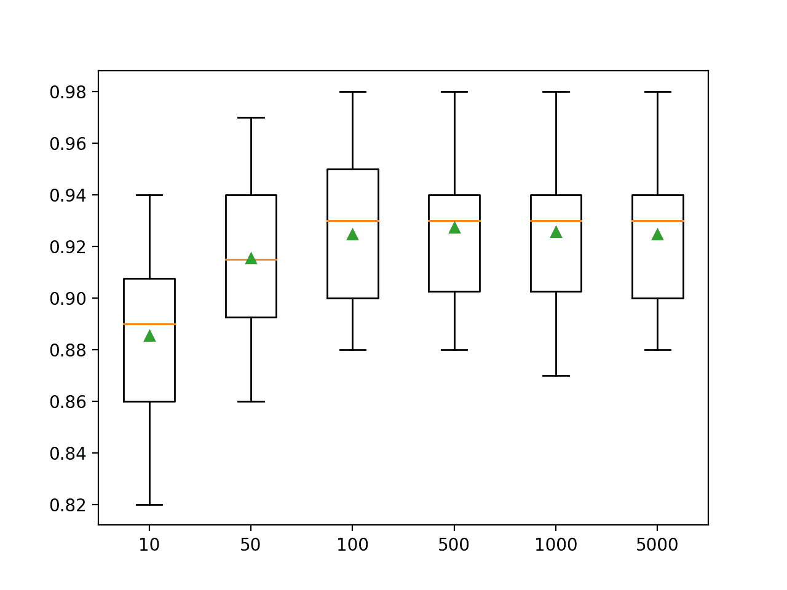
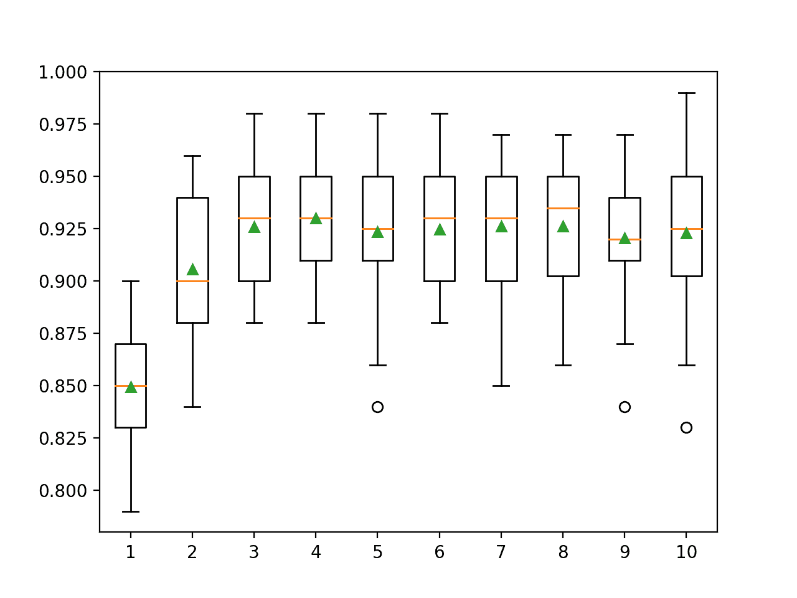
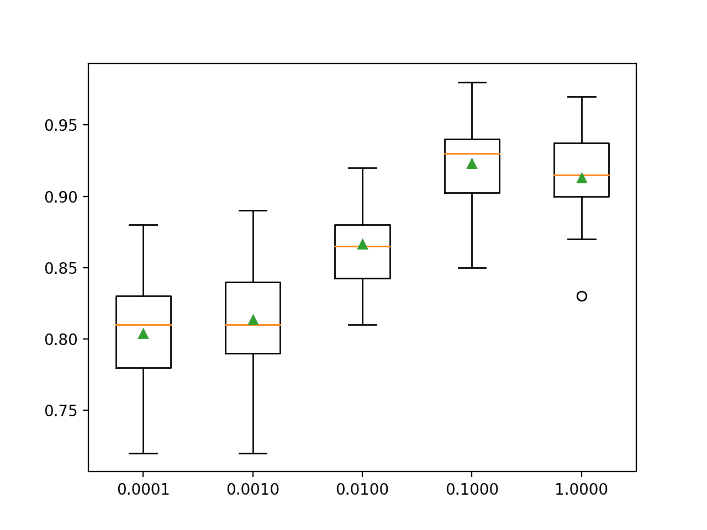
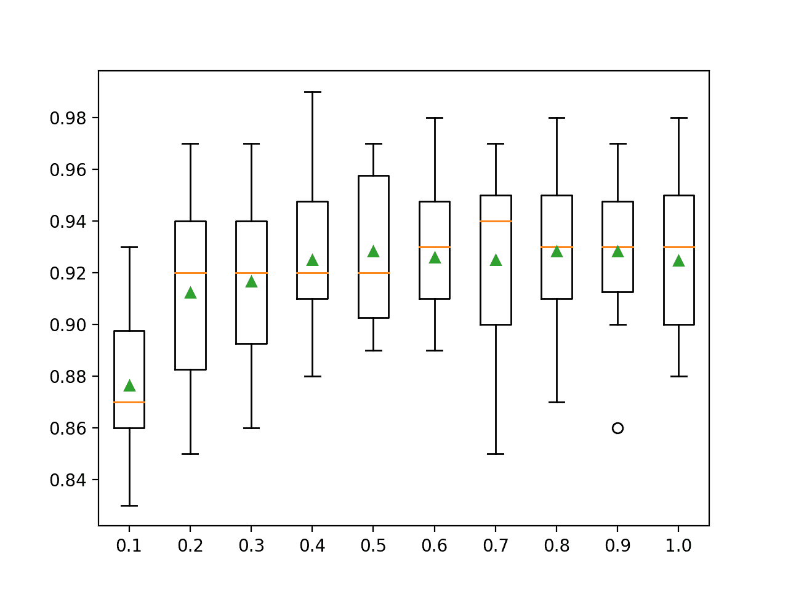

# Python 中的极限梯度提升（XGBoost）集成

> 原文：<https://machinelearningmastery.com/extreme-gradient-boosting-ensemble-in-python/>

最后更新于 2021 年 4 月 27 日

极限梯度提升(XGBoost)是一个开源库，它提供了梯度提升算法的高效和有效的实现。

尽管这种方法的其他开源实现在 XGBoost 之前就已经存在，但 XGBoost 的发布似乎释放了这种技术的力量，并使应用机器学习社区更普遍地注意到梯度提升。

在开发和最初发布后不久，XGBoost 就成为了一种流行的方法，并且经常是在机器学习竞赛中赢得分类和回归问题解决方案的关键组件。

在本教程中，您将发现如何为分类和回归开发极端梯度提升集成。

完成本教程后，您将知道:

*   极端梯度提升是随机梯度提升集成算法的一个有效的开源实现。
*   如何用 Sklearn API 开发用于分类和回归的 XGBoost 集成？
*   如何探索 XGBoost 模型超参数对模型表现的影响？

**用我的新书[Python 集成学习算法](https://machinelearningmastery.com/ensemble-learning-algorithms-with-python/)启动你的项目**，包括*分步教程*和所有示例的 *Python 源代码*文件。

我们开始吧。


巨蟒极限梯度提升(XGBoost)集成
安德烈斯·涅托·波拉斯摄，版权所有。

## 教程概述

本教程分为三个部分；它们是:

1.  极端梯度提升算法
2.  xboost Scikit-学习应用编程接口
    1.  用于分类的 XGBoost 集成
    2.  回归的 XGBoost 集成
3.  XGBoost 超参数
    1.  探索树的数量
    2.  探索树的深度
    3.  探索学习率
    4.  探索样本数量
    5.  探索功能数量

## 极端梯度提升算法

[梯度提升](https://machinelearningmastery.com/gradient-boosting-machine-ensemble-in-python/)是指一类可用于分类或回归预测建模问题的集成机器学习算法。

集成是由决策树模型构建的。树被一次一个地添加到集合中，并且适合于校正由先前模型产生的预测误差。这是一种称为 boosting 的集成机器学习模型。

使用任意可微损失函数和梯度下降优化算法拟合模型。这给这项技术起了一个名字，“梯度提升”，因为随着模型的拟合，损失梯度被最小化，很像一个神经网络。

有关梯度提升的更多信息，请参见教程:

*   [机器学习梯度提升算法的简单介绍](https://machinelearningmastery.com/gentle-introduction-gradient-boosting-algorithm-machine-learning/)

极限梯度提升(简称 XGBoost)是梯度提升算法的一个高效开源实现。因此，XGBoost 是一个算法、一个开源项目和一个 Python 库。

它最初是由[陈天棋](https://www.linkedin.com/in/tianqi-chen-679a9856/)开发的，并由陈和在他们 2016 年的论文《XGBoost:一个可扩展的树木提升系统》中进行了描述

它被设计为既有计算效率(例如，执行速度快)，又非常有效，可能比其他开源实现更有效。

> 然而，xgboost 这个名字实际上指的是工程目标，即提升树算法的计算资源极限。这也是很多人使用 xgboost 的原因。

—陈天琪在回答问题“[R GBM(梯度助推机)和 xgboost(极限梯度助推)有什么区别？](https://www.quora.com/What-is-the-difference-between-the-R-gbm-gradient-boosting-machine-and-xgboost-extreme-gradient-boosting/answer/Tianqi-Chen-1)“在 Quora 上

使用 XGBoost 的两个主要原因是执行速度和模型表现。

一般来说，与其他梯度提升实现相比，XGBoost 速度更快。Szilard Pafka 执行了一些客观的基准测试，将 XGBoost 的表现与梯度提升和袋装决策树的其他实现进行了比较。2015 年 5 月，他在名为“[基准测试随机森林实现](http://datascience.la/benchmarking-random-forest-implementations/)”的博客文章中写下了自己的结果

他的结果显示，XGBoost 几乎总是比来自 R、Python Spark 和 H2O 的其他基准实现更快。

从他的实验中，他评论道:

> 我还尝试了 xgboost，这是一个流行的增强库，它也能构建随机森林。它速度快，内存效率高，精度高

——[基准测试随机森林实现，Szilard Pafka](http://datascience.la/benchmarking-random-forest-implementations/) ，2015 年。

XGBoost 在分类和回归预测建模问题上主导结构化或表格数据集。证据是，它是 Kaggle 竞争数据科学平台上竞争赢家的 go-to 算法。

> 在 2015 年 Kaggle 博客上发布的 29 个挑战获胜解决方案 3 中，有 17 个解决方案使用了 XGBoost。[……]该系统的成功也在 KDDCup 2015 中得到了见证，在该赛事中，XGBoost 被前 10 名中的每一个获胜团队所使用。

——[xboost:一个可扩展的树提升系统](https://arxiv.org/abs/1603.02754)，2016。

既然我们已经熟悉了什么是 XGBoost 以及它为什么重要，那么让我们更仔细地看看如何在我们的预测建模项目中使用它。

## xboost Scikit-学习应用编程接口

xboost 可以作为一个独立的库安装，并且可以使用 Sklearn API 开发一个 xboost 模型。

第一步是安装尚未安装的 XGBoost 库。这可以在大多数平台上使用 pip python 包管理器来实现；例如:

```py
sudo pip install xgboost
```

然后，您可以通过运行以下脚本来确认 XGBoost 库安装正确，并且可以使用。

```py
# check xgboost version
import xgboost
print(xgboost.__version__)
```

运行该脚本将打印您安装的 XGBoost 库的版本。

您的版本应该相同或更高。如果没有，您必须升级 XGBoost 库的版本。

```py
1.1.1
```

您可能对最新版本的库有问题。这不是你的错。

有时，库的最新版本会带来额外的要求，或者可能不太稳定。

如果您在尝试运行上述脚本时确实有错误，我建议降级到 1.0.1 版(或更低版本)。这可以通过指定要安装到 pip 命令的版本来实现，如下所示:

```py
sudo pip install xgboost==1.0.1
```

如果您看到一条警告消息，您可以暂时忽略它。例如，下面是一个警告消息示例，您可能会看到它，但可以忽略它:

```py
FutureWarning: pandas.util.testing is deprecated. Use the functions in the public API at pandas.testing instead.
```

如果您需要开发环境的特定说明，请参阅教程:

*   [XGBoost 安装指南](https://xgboost.readthedocs.io/en/latest/build.html)

尽管我们将通过 Sklearn 包装类使用这个方法:[xgbreversor](https://xgboost.readthedocs.io/en/latest/python/python_api.html#xgboost.XGBRegressor)和 [XGBClassifier](https://xgboost.readthedocs.io/en/latest/python/python_api.html#xgboost.XGBClassifier) ，但是 XGBoost 库有自己的自定义 API。这将允许我们使用 Sklearn 机器学习库中的全套工具来准备数据和评估模型。

这两个模型以相同的方式运行，并采用相同的参数来影响决策树的创建和添加。

随机性用于模型的构建。这意味着算法每次在相同的数据上运行时，都会产生稍微不同的模型。

当使用具有随机学习算法的机器学习算法时，最好通过在多次运行或重复交叉验证中平均它们的表现来评估它们。当拟合最终模型时，可能需要增加树的数量，直到模型的方差在重复评估中减小，或者拟合多个最终模型并对它们的预测进行平均。

让我们看看如何为分类和回归开发一个 XGBoost 集成。

### 用于分类的 XGBoost 集成

在本节中，我们将研究如何使用 XGBoost 解决分类问题。

首先，我们可以使用 [make_classification()函数](https://Sklearn.org/stable/modules/generated/sklearn.datasets.make_classification.html)创建一个包含 1000 个示例和 20 个输入特征的合成二进制分类问题。

下面列出了完整的示例。

```py
# test classification dataset
from sklearn.datasets import make_classification
# define dataset
X, y = make_classification(n_samples=1000, n_features=20, n_informative=15, n_redundant=5, random_state=7)
# summarize the dataset
print(X.shape, y.shape)
```

运行该示例将创建数据集并总结输入和输出组件的形状。

```py
(1000, 20) (1000,)
```

接下来，我们可以在这个数据集上评估一个 XGBoost 模型。

我们将使用重复的分层 k 折叠交叉验证来评估模型，重复 3 次，折叠 10 次。我们将报告所有重复和折叠的模型精度的平均值和标准偏差。

```py
# evaluate xgboost algorithm for classification
from numpy import mean
from numpy import std
from sklearn.datasets import make_classification
from sklearn.model_selection import cross_val_score
from sklearn.model_selection import RepeatedStratifiedKFold
from xgboost import XGBClassifier
# define dataset
X, y = make_classification(n_samples=1000, n_features=20, n_informative=15, n_redundant=5, random_state=7)
# define the model
model = XGBClassifier()
# evaluate the model
cv = RepeatedStratifiedKFold(n_splits=10, n_repeats=3, random_state=1)
n_scores = cross_val_score(model, X, y, scoring='accuracy', cv=cv, n_jobs=-1)
# report performance
print('Accuracy: %.3f (%.3f)' % (mean(n_scores), std(n_scores)))
```

运行该示例会报告模型的均值和标准差精度。

**注**:考虑到算法或评估程序的随机性，或数值精度的差异，您的[结果可能会有所不同](https://machinelearningmastery.com/different-results-each-time-in-machine-learning/)。考虑运行该示例几次，并比较平均结果。

在这种情况下，我们可以看到带有默认超参数的 XGBoost 集成在这个测试数据集上实现了大约 92.5%的分类精度。

```py
Accuracy: 0.925 (0.028)
```

我们也可以使用 XGBoost 模型作为最终模型，并对分类进行预测。

首先，XGBoost 集合适合所有可用数据，然后可以调用 *predict()* 函数对新数据进行预测。重要的是，该函数期望数据总是以 NumPy 数组的形式提供，即每个输入样本一行的矩阵。

下面的示例在我们的二进制类别数据集上演示了这一点。

```py
# make predictions using xgboost for classification
from numpy import asarray
from sklearn.datasets import make_classification
from xgboost import XGBClassifier
# define dataset
X, y = make_classification(n_samples=1000, n_features=20, n_informative=15, n_redundant=5, random_state=7)
# define the model
model = XGBClassifier()
# fit the model on the whole dataset
model.fit(X, y)
# make a single prediction
row = [0.2929949,-4.21223056,-1.288332,-2.17849815,-0.64527665,2.58097719,0.28422388,-7.1827928,-1.91211104,2.73729512,0.81395695,3.96973717,-2.66939799,3.34692332,4.19791821,0.99990998,-0.30201875,-4.43170633,-2.82646737,0.44916808]
row = asarray([row])
yhat = model.predict(row)
print('Predicted Class: %d' % yhat[0])
```

运行该示例使 XGBoost 集成模型适合整个数据集，然后用于对新的数据行进行预测，就像我们在应用程序中使用该模型时可能做的那样。

```py
Predicted Class: 1
```

现在我们已经熟悉了使用 XGBoost 进行分类，让我们看看回归的 API。

### 回归的 XGBoost 集成

在本节中，我们将研究如何使用 XGBoost 解决回归问题。

首先，我们可以使用[make _ revolution()函数](https://Sklearn.org/stable/modules/generated/sklearn.datasets.make_regression.html)创建一个包含 1000 个示例和 20 个输入特征的合成回归问题。

下面列出了完整的示例。

```py
# test regression dataset
from sklearn.datasets import make_regression
# define dataset
X, y = make_regression(n_samples=1000, n_features=20, n_informative=15, noise=0.1, random_state=7)
# summarize the dataset
print(X.shape, y.shape)
```

运行该示例将创建数据集并总结输入和输出组件的形状。

```py
(1000, 20) (1000,)
```

接下来，我们可以在这个数据集上评估一个 XGBoost 算法。

正如我们在上一节中所做的，我们将使用重复的 k-fold 交叉验证来评估模型，重复 3 次，重复 10 次。我们将报告所有重复和折叠模型的平均绝对误差(MAE)。Sklearn 库使 MAE 为负，因此它被最大化而不是最小化。这意味着负 MAE 越大越好，完美模型的 MAE 为 0。

下面列出了完整的示例。

```py
# evaluate xgboost ensemble for regression
from numpy import mean
from numpy import std
from sklearn.datasets import make_regression
from sklearn.model_selection import cross_val_score
from sklearn.model_selection import RepeatedKFold
from xgboost import XGBRegressor
# define dataset
X, y = make_regression(n_samples=1000, n_features=20, n_informative=15, noise=0.1, random_state=7)
# define the model
model = XGBRegressor()
# evaluate the model
cv = RepeatedKFold(n_splits=10, n_repeats=3, random_state=1)
n_scores = cross_val_score(model, X, y, scoring='neg_mean_absolute_error', cv=cv, n_jobs=-1, error_score='raise')
# report performance
print('MAE: %.3f (%.3f)' % (mean(n_scores), std(n_scores)))
```

运行该示例会报告模型的均值和标准差精度。

**注**:考虑到算法或评估程序的随机性，或数值精度的差异，您的[结果可能会有所不同](https://machinelearningmastery.com/different-results-each-time-in-machine-learning/)。考虑运行该示例几次，并比较平均结果。

在这种情况下，我们可以看到带有默认超参数的 XGBoost 集成实现了大约 76 的 MAE。

```py
MAE: -76.447 (3.859)
```

我们也可以使用 XGBoost 模型作为最终模型，并对回归进行预测。

首先，XGBoost 集合适合所有可用数据，然后可以调用 *predict()* 函数对新数据进行预测。与分类一样，单行数据必须以 NumPy 数组格式表示为二维矩阵。

下面的例子在我们的回归数据集上演示了这一点。

```py
# gradient xgboost for making predictions for regression
from numpy import asarray
from sklearn.datasets import make_regression
from xgboost import XGBRegressor
# define dataset
X, y = make_regression(n_samples=1000, n_features=20, n_informative=15, noise=0.1, random_state=7)
# define the model
model = XGBRegressor()
# fit the model on the whole dataset
model.fit(X, y)
# make a single prediction
row = [0.20543991,-0.97049844,-0.81403429,-0.23842689,-0.60704084,-0.48541492,0.53113006,2.01834338,-0.90745243,-1.85859731,-1.02334791,-0.6877744,0.60984819,-0.70630121,-1.29161497,1.32385441,1.42150747,1.26567231,2.56569098,-0.11154792]
row = asarray([row])
yhat = model.predict(row)
print('Prediction: %d' % yhat[0])
```

运行该示例使 XGBoost 集成模型适合整个数据集，然后用于对新的数据行进行预测，就像我们在应用程序中使用该模型时可能做的那样。

```py
Prediction: 50
```

现在我们已经熟悉了如何使用 xboost Sklearn API 来评估和使用 xboost 集成，让我们来看看如何配置模型。

## XGBoost 超参数

在本节中，我们将仔细研究一些您应该考虑为梯度提升集成进行调整的超参数，以及它们对模型表现的影响。

### 探索树的数量

XGBoost 集成算法的一个重要超参数是集成中使用的决策树的数量。

回想一下，决策树被顺序地添加到模型中，以努力纠正和改进先前的树所做的预测。因此，更多的树往往更好。

树的数量可以通过“*n _ estimates*”参数设置，默认为 100。

下面的示例探讨了值在 10 到 5，000 之间的树的数量的影响。

```py
# explore xgboost number of trees effect on performance
from numpy import mean
from numpy import std
from sklearn.datasets import make_classification
from sklearn.model_selection import cross_val_score
from sklearn.model_selection import RepeatedStratifiedKFold
from xgboost import XGBClassifier
from matplotlib import pyplot

# get the dataset
def get_dataset():
	X, y = make_classification(n_samples=1000, n_features=20, n_informative=15, n_redundant=5, random_state=7)
	return X, y

# get a list of models to evaluate
def get_models():
	models = dict()
	trees = [10, 50, 100, 500, 1000, 5000]
	for n in trees:
		models[str(n)] = XGBClassifier(n_estimators=n)
	return models

# evaluate a give model using cross-validation
def evaluate_model(model):
	cv = RepeatedStratifiedKFold(n_splits=10, n_repeats=3, random_state=1)
	scores = cross_val_score(model, X, y, scoring='accuracy', cv=cv, n_jobs=-1)
	return scores

# define dataset
X, y = get_dataset()
# get the models to evaluate
models = get_models()
# evaluate the models and store results
results, names = list(), list()
for name, model in models.items():
	scores = evaluate_model(model)
	results.append(scores)
	names.append(name)
	print('>%s %.3f (%.3f)' % (name, mean(scores), std(scores)))
# plot model performance for comparison
pyplot.boxplot(results, labels=names, showmeans=True)
pyplot.show()
```

运行该示例首先报告每个配置数量的决策树的平均准确性。

**注**:考虑到算法或评估程序的随机性，或数值精度的差异，您的[结果可能会有所不同](https://machinelearningmastery.com/different-results-each-time-in-machine-learning/)。考虑运行该示例几次，并比较平均结果。

在这种情况下，我们可以看到该数据集上的表现有所提高，直到大约 500 棵树，之后表现似乎趋于平稳或下降。

```py
>10 0.885 (0.029)
>50 0.915 (0.029)
>100 0.925 (0.028)
>500 0.927 (0.028)
>1000 0.926 (0.028)
>5000 0.925 (0.027)
```

为每个配置数量的树的准确度分数的分布创建一个方框和须图。

我们可以看到模型表现和集合规模增加的总体趋势。



XGBoost 集合大小与分类精度的箱线图

### 探索树的深度

改变加入集成的每棵树的深度是梯度提升的另一个重要超参数。

树深度控制每棵树对训练数据集的专门化程度:它可能有多一般或多复杂。优选不太浅和一般的树(如 [AdaBoost](https://machinelearningmastery.com/adaboost-ensemble-in-python/) )和不太深和专门化的树(如 [bootstrap aggregation](https://machinelearningmastery.com/bagging-ensemble-with-python/) )。

梯度提升通常在深度适中的树中表现良好，在技能和通用性之间找到了平衡。

树深度通过“*最大深度*参数控制，默认为 6。

下面的示例探讨了 1 到 10 之间的树深度以及对模型表现的影响。

```py
# explore xgboost tree depth effect on performance
from numpy import mean
from numpy import std
from sklearn.datasets import make_classification
from sklearn.model_selection import cross_val_score
from sklearn.model_selection import RepeatedStratifiedKFold
from xgboost import XGBClassifier
from matplotlib import pyplot

# get the dataset
def get_dataset():
	X, y = make_classification(n_samples=1000, n_features=20, n_informative=15, n_redundant=5, random_state=7)
	return X, y

# get a list of models to evaluate
def get_models():
	models = dict()
	for i in range(1,11):
		models[str(i)] = XGBClassifier(max_depth=i)
	return models

# evaluate a give model using cross-validation
def evaluate_model(model):
	cv = RepeatedStratifiedKFold(n_splits=10, n_repeats=3, random_state=1)
	scores = cross_val_score(model, X, y, scoring='accuracy', cv=cv, n_jobs=-1)
	return scores

# define dataset
X, y = get_dataset()
# get the models to evaluate
models = get_models()
# evaluate the models and store results
results, names = list(), list()
for name, model in models.items():
	scores = evaluate_model(model)
	results.append(scores)
	names.append(name)
	print('>%s %.3f (%.3f)' % (name, mean(scores), std(scores)))
# plot model performance for comparison
pyplot.boxplot(results, labels=names, showmeans=True)
pyplot.show()
```

运行该示例首先报告每个配置的树深度的平均精度。

**注**:考虑到算法或评估程序的随机性，或数值精度的差异，您的[结果可能会有所不同](https://machinelearningmastery.com/different-results-each-time-in-machine-learning/)。考虑运行该示例几次，并比较平均结果。

在这种情况下，我们可以看到表现随着树的深度而提高，可能在 3 到 8 的深度附近窥视，之后更深、更专门化的树会导致更差的表现。

```py
>1 0.849 (0.028)
>2 0.906 (0.032)
>3 0.926 (0.027)
>4 0.930 (0.027)
>5 0.924 (0.031)
>6 0.925 (0.028)
>7 0.926 (0.030)
>8 0.926 (0.029)
>9 0.921 (0.032)
>10 0.923 (0.035)
```

为每个配置的树深度的精度分数分布创建一个方框和须图。

我们可以看到模型表现随着树的深度增加到一定程度的总体趋势，在此之后，表现开始持平或随着过度专门化的树而下降。



XGBoost 集合树深度与分类精度的方框图

### 探索学习率

学习率控制每个模型对集成预测的贡献量。

较小的速率可能需要集合中更多的决策树。

学习率可以通过“ *eta* ”参数控制，默认为 0.3。

下面的示例探讨了学习率，并比较了 0.0001 和 1.0 之间的值的效果。

```py
# explore xgboost learning rate effect on performance
from numpy import mean
from numpy import std
from sklearn.datasets import make_classification
from sklearn.model_selection import cross_val_score
from sklearn.model_selection import RepeatedStratifiedKFold
from xgboost import XGBClassifier
from matplotlib import pyplot

# get the dataset
def get_dataset():
	X, y = make_classification(n_samples=1000, n_features=20, n_informative=15, n_redundant=5, random_state=7)
	return X, y

# get a list of models to evaluate
def get_models():
	models = dict()
	rates = [0.0001, 0.001, 0.01, 0.1, 1.0]
	for r in rates:
		key = '%.4f' % r
		models[key] = XGBClassifier(eta=r)
	return models

# evaluate a give model using cross-validation
def evaluate_model(model):
	cv = RepeatedStratifiedKFold(n_splits=10, n_repeats=3, random_state=1)
	scores = cross_val_score(model, X, y, scoring='accuracy', cv=cv, n_jobs=-1)
	return scores

# define dataset
X, y = get_dataset()
# get the models to evaluate
models = get_models()
# evaluate the models and store results
results, names = list(), list()
for name, model in models.items():
	scores = evaluate_model(model)
	results.append(scores)
	names.append(name)
	print('>%s %.3f (%.3f)' % (name, mean(scores), std(scores)))
# plot model performance for comparison
pyplot.boxplot(results, labels=names, showmeans=True)
pyplot.show()
```

运行示例首先报告每个配置的学习率的平均准确性。

**注**:考虑到算法或评估程序的随机性，或数值精度的差异，您的[结果可能会有所不同](https://machinelearningmastery.com/different-results-each-time-in-machine-learning/)。考虑运行该示例几次，并比较平均结果。

在这种情况下，我们可以看到，较大的学习率会在该数据集上产生更好的表现。我们预计，为较小的学习率向集合中添加更多的树将进一步提升表现。

这突出了树的数量(训练速度)和学习率之间的权衡，例如，我们可以通过使用更少的树和更大的学习率来更快地拟合模型。

```py
>0.0001 0.804 (0.039)
>0.0010 0.814 (0.037)
>0.0100 0.867 (0.027)
>0.1000 0.923 (0.030)
>1.0000 0.913 (0.030)
```

为每个配置的学习率的准确度分数的分布创建一个方框和须图。

我们可以看到随着学习率提高 0.1，模型表现提高的大趋势，之后表现会下降。



XGBoost 学习率与分类精度的箱线图

### 探索样本数量

用于拟合每棵树的样本数量可以变化。这意味着每棵树都适合随机选择的训练数据集子集。

使用更少的样本会为每棵树引入更多的方差，尽管这可以提高模型的整体表现。

用于拟合每棵树的样本数量由“*子样本*参数指定，并且可以设置为训练数据集大小的一小部分。默认情况下，它被设置为 1.0 以使用整个训练数据集。

下面的示例演示了样本大小对模型表现的影响，比率从 10%到 100%以 10%的增量变化。

```py
# explore xgboost subsample ratio effect on performance
from numpy import arange
from numpy import mean
from numpy import std
from sklearn.datasets import make_classification
from sklearn.model_selection import cross_val_score
from sklearn.model_selection import RepeatedStratifiedKFold
from xgboost import XGBClassifier
from matplotlib import pyplot

# get the dataset
def get_dataset():
	X, y = make_classification(n_samples=1000, n_features=20, n_informative=15, n_redundant=5, random_state=7)
	return X, y

# get a list of models to evaluate
def get_models():
	models = dict()
	for i in arange(0.1, 1.1, 0.1):
		key = '%.1f' % i
		models[key] = XGBClassifier(subsample=i)
	return models

# evaluate a give model using cross-validation
def evaluate_model(model):
	cv = RepeatedStratifiedKFold(n_splits=10, n_repeats=3, random_state=1)
	scores = cross_val_score(model, X, y, scoring='accuracy', cv=cv, n_jobs=-1)
	return scores

# define dataset
X, y = get_dataset()
# get the models to evaluate
models = get_models()
# evaluate the models and store results
results, names = list(), list()
for name, model in models.items():
	scores = evaluate_model(model)
	results.append(scores)
	names.append(name)
	print('>%s %.3f (%.3f)' % (name, mean(scores), std(scores)))
# plot model performance for comparison
pyplot.boxplot(results, labels=names, showmeans=True)
pyplot.show()
```

运行示例首先报告每个配置样本大小的平均准确度。

**注**:考虑到算法或评估程序的随机性，或数值精度的差异，您的[结果可能会有所不同](https://machinelearningmastery.com/different-results-each-time-in-machine-learning/)。考虑运行该示例几次，并比较平均结果。

在这种情况下，我们可以看到平均表现对于覆盖大部分数据集的样本大小来说可能是最好的，例如 80%或更高。

```py
>0.1 0.876 (0.027)
>0.2 0.912 (0.033)
>0.3 0.917 (0.032)
>0.4 0.925 (0.026)
>0.5 0.928 (0.027)
>0.6 0.926 (0.024)
>0.7 0.925 (0.031)
>0.8 0.928 (0.028)
>0.9 0.928 (0.025)
>1.0 0.925 (0.028)
```

为每个配置的采样比率的准确度分数分布创建一个方框和须图。

我们可以看到提高模型表现的总体趋势，可能在 80%左右达到峰值，并保持一定水平。



XGBoost 集合样本比与分类精度的箱线图

### 探索功能数量

用于拟合每个决策树的特征数量可以变化。

像改变样本的数量一样，改变特征的数量会在模型中引入额外的方差，这可能会提高表现，尽管这可能需要增加树的数量。

每个树使用的特征数量被视为随机样本，由“ *colsample_bytree* ”参数指定，默认为训练数据集中的所有特征，例如 100%或值 1.0。您也可以对每个拆分的列进行采样，这是由“ *colsample_bylevel* ”参数控制的，但是这里我们不看这个超参数。

下面的示例探讨了特征数量对模型表现的影响，比率从 10%到 100%以 10%的增量变化。

```py
# explore xgboost column ratio per tree effect on performance
from numpy import arange
from numpy import mean
from numpy import std
from sklearn.datasets import make_classification
from sklearn.model_selection import cross_val_score
from sklearn.model_selection import RepeatedStratifiedKFold
from xgboost import XGBClassifier
from matplotlib import pyplot

# get the dataset
def get_dataset():
	X, y = make_classification(n_samples=1000, n_features=20, n_informative=15, n_redundant=5, random_state=7)
	return X, y

# get a list of models to evaluate
def get_models():
	models = dict()
	for i in arange(0.1, 1.1, 0.1):
		key = '%.1f' % i
		models[key] = XGBClassifier(colsample_bytree=i)
	return models

# evaluate a give model using cross-validation
def evaluate_model(model):
	cv = RepeatedStratifiedKFold(n_splits=10, n_repeats=3, random_state=1)
	scores = cross_val_score(model, X, y, scoring='accuracy', cv=cv, n_jobs=-1)
	return scores

# define dataset
X, y = get_dataset()
# get the models to evaluate
models = get_models()
# evaluate the models and store results
results, names = list(), list()
for name, model in models.items():
	scores = evaluate_model(model)
	results.append(scores)
	names.append(name)
	print('>%s %.3f (%.3f)' % (name, mean(scores), std(scores)))
# plot model performance for comparison
pyplot.boxplot(results, labels=names, showmeans=True)
pyplot.show()
```

运行该示例首先报告每个配置的列比率的平均精度。

**注**:考虑到算法或评估程序的随机性，或数值精度的差异，您的[结果可能会有所不同](https://machinelearningmastery.com/different-results-each-time-in-machine-learning/)。考虑运行该示例几次，并比较平均结果。

在这种情况下，我们可以看到平均表现增加到功能数量的一半(50%)，之后保持在一定水平。令人惊讶的是，删除每棵树一半的输入变量收效甚微。

```py
>0.1 0.861 (0.033)
>0.2 0.906 (0.027)
>0.3 0.923 (0.029)
>0.4 0.917 (0.029)
>0.5 0.928 (0.030)
>0.6 0.929 (0.031)
>0.7 0.924 (0.027)
>0.8 0.931 (0.025)
>0.9 0.927 (0.033)
>1.0 0.925 (0.028)
```

为每个配置的柱比率的准确度分数的分布创建了一个方框和触须图。

我们可以看到提高模型表现的总体趋势，可能会达到 60%的峰值，并保持一定水平。


XGBoost 集合柱比率与分类精度的箱线图

## 进一步阅读

如果您想更深入地了解这个主题，本节将提供更多资源。

### 教程

*   [机器学习梯度提升算法简介](https://machinelearningmastery.com/gentle-introduction-gradient-boosting-algorithm-machine-learning/)
*   [使用 Sklearn、XGBoost、LightGBM 和 CatBoost 进行梯度提升](https://machinelearningmastery.com/gradient-boosting-with-Sklearn-xgboost-lightgbm-and-catboost/)
*   [应用机器学习 XGBoost 的温和介绍](https://machinelearningmastery.com/gentle-introduction-xgboost-applied-machine-learning/)

### 报纸

*   [XGBoost:一个可扩展的树木助推系统](https://arxiv.org/abs/1603.02754)，2016。

### 项目

*   [xboost 项目，GitHub](https://github.com/dmlc/xgboost) 。
*   [XGBoost 文档](https://xgboost.readthedocs.io/en/latest/)

### 蜜蜂

*   [XGBoost 安装指南](https://xgboost.readthedocs.io/en/latest/build.html)
*   [xboost。xgbreversor API](https://xgboost.readthedocs.io/en/latest/python/python_api.html#xgboost.XGBRegressor)。
*   [xgboost。xgbcclassifier API](https://xgboost.readthedocs.io/en/latest/python/python_api.html#xgboost.XGBClassifier)。

### 文章

*   [梯度助推，维基百科](https://en.wikipedia.org/wiki/Gradient_boosting)。
*   [XGBoost，维基百科](https://en.wikipedia.org/wiki/XGBoost)。

## 摘要

在本教程中，您发现了如何为分类和回归开发极端梯度提升集成。

具体来说，您了解到:

*   极端梯度提升是随机梯度提升集成算法的一个有效的开源实现。
*   如何用 Sklearn API 开发用于分类和回归的 XGBoost 集成？
*   如何探索 XGBoost 模型超参数对模型表现的影响？

**你有什么问题吗？**
在下面的评论中提问，我会尽力回答。