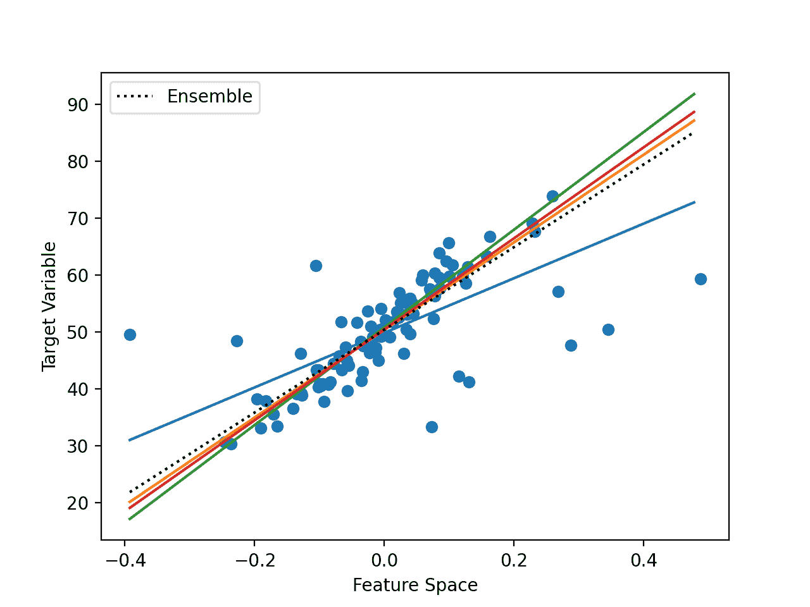

# 培养对集成学习如何工作的直觉

> 原文：<https://machinelearningmastery.com/how-ensemble-learning-works/>

最后更新于 2021 年 4 月 27 日

集成是一种机器学习方法，它结合了来自多个模型的预测，以获得更好的预测性能。

有许多不同类型的集成，尽管所有方法都有两个关键属性:它们要求贡献模型不同，从而产生不同的误差；它们组合预测，试图利用每个不同模型的优点。

然而，尚不清楚集成如何实现这一点，尤其是在分类和回归类型预测建模问题的背景下。重要的是要培养一种直觉，即当集合组合预测时，它们到底在做什么，因为这将有助于在预测建模项目中选择和配置合适的模型。

在这篇文章中，你将发现集成学习方法背后的直觉。

看完这篇文章，你会知道:

*   集成学习方法通过组合贡献成员学习的映射函数来工作。
*   分类的集合最好通过成员决策边界的组合来理解。
*   回归的集合最好通过成员超平面的组合来理解。

**用我的新书[Python 集成学习算法](https://machinelearningmastery.com/ensemble-learning-algorithms-with-python/)启动你的项目**，包括*分步教程*和所有示例的 *Python 源代码*文件。

我们开始吧。

培养对集合学习如何工作的直觉
照片由[马可·韦奇](https://www.flickr.com/photos/160866001@N07/45967563051/)拍摄，版权所有。

## 教程概述

本教程分为三个部分；它们是:

1.  系综是如何工作的
2.  分类集成的直觉
3.  回归集成的直觉

## 系综是如何工作的

集成学习指的是组合来自两个或更多模型的预测。

使用集合方法的目标是提高预测的技巧，而不是任何一个贡献成员的技巧。

这个目标很简单，但是不太清楚集成方法是如何实现的。

培养对集成技术如何工作的直觉很重要，因为它将帮助您为预测任务选择和配置特定的集成方法，并解释它们的结果，以提出进一步提高性能的替代方法。

考虑一个简单的集合，它在训练数据集稍微不同的样本上训练两个模型，并对它们的预测进行平均。

每个成员模型都可以以独立的方式进行预测，尽管希望对它们的预测进行平均可以提高它们的性能。只有当每个模型做出不同的预测时，才会出现这种情况。

不同的预测意味着在某些情况下，模型 1 会产生很少的误差，而模型 2 会产生更多的误差，而对于其他情况则相反。平均他们的预测试图减少这两个模型预测的误差。

反过来，模型要做出不同的预测，就必须对预测问题做出不同的假设。更具体地说，他们必须学习从输入到输出的不同映射函数。在简单的情况下，我们可以通过在训练数据集的不同样本上训练每个模型来实现这一点，但是还有许多其他方法可以实现这种差异；训练不同的模型类型是其一。

这些元素是一般意义上的合奏方法的工作原理，即:

1.  **成员针对同一个问题学习不同的映射函数**。这是为了确保模型产生不同的预测误差。
2.  **成员做出的预测以某种方式组合**。这是为了确保利用预测误差的差异。

我们不能简单地消除预测误差，尽管我们可以；相反，我们平滑了贡献成员学习的映射函数。

改进的映射功能允许进行更好的预测。

这是一个更深层次的问题，理解它很重要。让我们仔细看看这对分类和回归任务意味着什么。

## 分类集成的直觉

[分类预测建模](https://machinelearningmastery.com/types-of-classification-in-machine-learning/)是指必须从输入的例子中预测类别标签的问题。

模型可以预测清晰的类别标签，例如分类变量，或者所有可能的分类结果的概率。

在简单的情况下，可以通过投票来组合由集成成员预测的清晰类别标签，例如，具有最多投票的统计模式或标签决定了集成结果。系综成员预测的类概率可以被求和和归一化。

在功能上，类似这样的过程发生在分类任务的集成中，但是影响的是从输入示例到类标签或概率的映射函数。现在让我们坚持标签。

考虑分类映射函数的最常见方式是使用一个图，其中输入数据表示由输入变量范围定义的 n 维空间中的一个点，称为特征空间。例如，如果我们有两个输入要素，x 和 y，都在 0 到 1 的范围内，那么输入空间将是二维平面，并且数据集中的每个示例都是该平面上的一个点。然后，可以根据类别标签为每个点指定颜色或形状。

学习如何对点进行分类的模型实际上是在特征空间中绘制线来分隔示例。我们可以对网格中的特征空间中的点进行采样，并通过每个类标签获得模型认为特征空间应该如何的地图。

模型对特征空间中的示例的分离称为决策边界，模型如何对特征空间中的点进行分类的网格或地图的图称为决策边界图。

现在考虑一个集合，其中每个模型都有不同的输入到输出的映射。实际上，每个模型都有不同的决策边界，或者对如何在特征空间中通过类标签进行分割有不同的想法。每个模型会画出不同的线，并犯不同的错误。

当我们组合来自这些多个不同模型的预测时，我们实际上是在平均决策边界。我们正在定义一个新的决策边界，试图从贡献成员所了解的特征空间的所有不同视图中学习。

下图取自“[集成机器学习](https://amzn.to/2C7syo5)”的第 1 页，提供了这方面的有用描述。

使用集成组合决策边界的示例
摘自集成机器学习，2012 年。

我们可以看到顶部的贡献成员，每个成员在特征空间中都有不同的决策边界。然后左下角在同一个图上画出所有的决策边界，显示它们是如何不同并产生不同的错误的。

最后，我们可以将这些边界组合起来，在右下角创建一个新的广义决策边界，它可以更好地捕捉特征空间的真实但未知的划分，从而获得更好的预测性能。

## 回归集成的直觉

回归预测建模指的是必须从输入的例子中预测数值的问题。

在简单的情况下，系综成员所做的数值预测可以使用统计方法(如平均值)进行组合，尽管也可以使用更复杂的组合。

像分类一样，集合的效果是每个贡献成员的映射函数被平均或组合。

考虑回归的映射函数的最常见方式是使用线图，其中输出变量是添加到输入要素空间的另一个维度。特征空间和目标变量维度的关系然后可以被总结为超平面，例如多个维度中的线。

这是令人费解的，所以让我们考虑一个最简单的情况，我们有一个数字输入和一个数字输出。考虑一个平面或图形，其中 x 轴代表输入特征，y 轴代表目标变量。我们可以将数据集中的每个示例绘制为图上的一个点。

学习从输入到输出的映射的模型实际上学习了将特征空间中的点连接到目标变量的超平面。我们可以对输入特征空间中的点网格进行采样，以设计目标变量的值，并绘制一条线来连接它们，以表示这个超平面。

在我们的二维例子中，这是一条穿过图上点的线。线不穿过图的任何点表示预测误差，并且从线到点的距离是误差的大小。

现在考虑一个集合，其中每个模型都有不同的输入到输出的映射。实际上，每个模型都有一个连接特征空间和目标的不同超平面。每个模型会画出不同的线，并以不同的幅度产生不同的误差。

当我们结合这些多个不同模型的预测时，我们实际上是在平均超平面。我们正在定义一个新的超平面，试图从所有不同的特征中学习如何将输入映射到输出。

下图给出了具有不同学习超平面映射的一维输入特征空间和目标空间的示例。

使用集成组合超平面的示例

我们可以从训练数据集中看到代表点的点。我们还可以通过数据看到许多不同的直线。模型不需要学习直线，但在这种情况下，它们需要。

最后，我们可以看到一条黑色虚线，显示了所有模型的总体平均值，从而降低了预测误差。

## 进一步阅读

如果您想更深入地了解这个主题，本节将提供更多资源。

### 书

*   [使用集成方法的模式分类](https://amzn.to/2zxc0F7)，2010。
*   [集成方法](https://amzn.to/2XZzrjG)，2012。
*   [集成机器学习](https://amzn.to/2C7syo5)，2012。
*   [数据挖掘中的集成方法](https://amzn.to/3frGM1A)，2010。

### 文章

*   一起学习，维基百科。
*   [一起学习，学院派](http://www.scholarpedia.org/article/Ensemble_learning)。

## 摘要

在这篇文章中，你发现了集成学习方法背后的直觉。

具体来说，您了解到:

*   集成学习方法通过组合贡献成员学习的映射函数来工作。
*   分类的集合最好通过成员决策边界的组合来理解。
*   回归的集合最好通过成员超平面的组合来理解。

**你有什么问题吗？**
在下面的评论中提问，我会尽力回答。