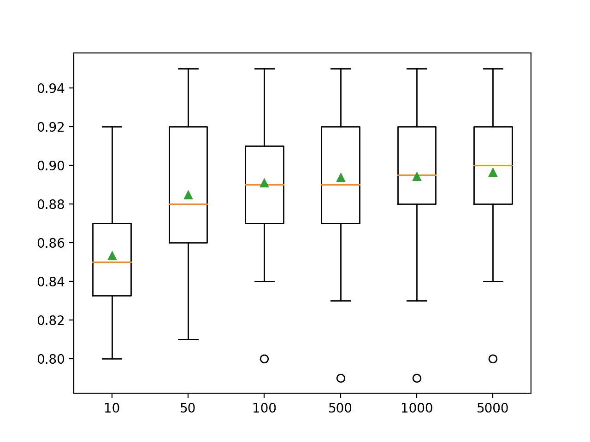

# 如何用 Python 开发随机子空间集成

> 原文:[https://machinelearning master . com/random-subspace-ensemble-with-python/](https://machinelearningmastery.com/random-subspace-ensemble-with-python/)

最后更新于 2021 年 4 月 27 日

**随机子空间集成**是一种机器学习算法，它结合了在训练数据集中不同列子集上训练的多个决策树的预测。

随机改变用于训练集成的每个贡献成员的列具有将多样性引入集成的效果，并且反过来，可以使用单个决策树提升性能。

它与决策树的其他集成相关，例如使用训练数据集中不同行样本创建树的自举聚合(bagging)，以及结合 bagging 和随机子空间集成思想的随机森林。

尽管决策树经常被使用，但是一般的随机子空间方法可以用于任何机器学习模型，其性能随着输入特征的选择而有意义地变化。

在本教程中，您将发现如何开发用于分类和回归的随机子空间集成。

完成本教程后，您将知道:

*   随机子空间集成是由决策树生成的，决策树适合训练数据集中不同的特征样本(列)。
*   如何用 scikit-learn 使用随机子空间集成进行分类和回归？
*   如何探索随机子空间模型超参数对模型性能的影响？

**用我的新书[Python 集成学习算法](https://machinelearningmastery.com/ensemble-learning-algorithms-with-python/)启动你的项目**，包括*分步教程*和所有示例的 *Python 源代码*文件。

我们开始吧。


如何用 Python 开发随机子空间集成
图片由[马塞尔·阿明](https://www.flickr.com/photos/mars_/18002370619/)提供，版权所有。

## 教程概述

本教程分为三个部分；它们是:

1.  随机子空间集成
2.  基于打包的随机子空间集成
    1.  分类的随机子空间集成
    2.  回归的随机子空间集成
3.  随机子空间集成超参数
    1.  探索树的数量
    2.  探索功能数量
    3.  探索替代算法

## 随机子空间集成

预测建模问题由一个或多个输入变量和一个目标变量组成。

变量是数据中的一列，通常也称为特征。我们可以将所有输入要素一起视为定义了一个 n 维向量空间，其中 n 是输入要素的数量，每个示例(数据的输入行)是要素空间中的一个点。

这是机器学习中常见的概念化，随着输入特征空间变大，空间中点之间的距离增加，一般称为[维数灾难](https://en.wikipedia.org/wiki/Curse_of_dimensionality)。

因此，输入特征的子集可以被认为是输入特征空间或子空间的子集。

选择特征是定义输入特征空间的子空间的一种方式。例如，[特征选择](https://machinelearningmastery.com/feature-selection-with-real-and-categorical-data/)是指通过选择要保留的特征子集或要删除的特征子集来减少输入特征空间的维数的尝试，通常基于它们与目标变量的关系。

或者，我们可以选择输入特征的随机子集来定义随机子空间。这可以用作集成学习算法的基础，其中模型可以适合每个特征的随机子空间。这被称为随机子空间集成或**随机子空间方法**。

> 训练数据通常由一组特征描述。不同的特征子集，或称为子空间，提供不同的数据视图。因此，从不同子空间训练的个体学习者通常是不同的。

—第 116 页，[集合方法](https://amzn.to/2XZzrjG)，2012。

这是由田锦浩在 1998 年的论文《构建决策森林的随机子空间方法》中提出的，其中决策树适合于每个随机子空间。

更一般地说，这是一种用于集成学习的多样性技术，属于一类改变每个模型的训练数据集以试图降低集成中模型预测之间的相关性的方法。

过程很简单，只需为集合中的每个模型选择输入特征(列)的随机子集，并在整个训练数据集中的模型上拟合模型。它可以通过额外的更改进行扩充，例如使用自举或训练数据集中的随机行样本。

> 该分类器由通过伪随机选择特征向量的分量子集而系统地构建的多个树组成，即在随机选择的子空间中构建的树。

——[构建决策森林的随机子空间方法](https://ieeexplore.ieee.org/abstract/document/709601/)，1998。

因此，随机子空间集成与自举聚集(bagging)相关，该自举聚集通过用替换(例如自举采样方法)在训练数据集的不同随机样本上训练每个模型(通常是决策树)来引入多样性。随机森林集成也可以被认为是装袋和随机子集集成方法的混合。

> 使用不同特征子集的算法通常被称为随机子空间方法…

—第 21 页，[集成机器学习](https://amzn.to/2C7syo5)，2012。

随机子空间方法可以用于任何机器学习算法，尽管它非常适合对输入特征的大变化敏感的模型，例如决策树和 k 近邻。

它适用于具有大量输入要素的数据集，因为它可以带来良好的性能和效率。如果数据集包含许多不相关的输入特征，使用特征选择作为数据准备技术可能会更好，因为子空间中不相关特征的普遍存在可能会损害集成的性能。

> 对于具有大量冗余特征的数据，在子空间中训练学习者不仅有效，而且高效。

—第 116 页，[集合方法](https://amzn.to/2XZzrjG)，2012。

现在我们已经熟悉了随机子空间集成，让我们来探索如何实现这种方法。

## 基于打包的随机子空间集成

我们可以在 scikit-learn 中使用 bagging 实现随机子空间集成。

装袋通过[装袋分类器](https://scikit-learn.org/stable/modules/generated/sklearn.ensemble.BaggingRegressor.html)和[装袋分类器](https://scikit-learn.org/stable/modules/generated/sklearn.ensemble.BaggingClassifier.html)类提供。

我们可以将 bagging 配置为随机子空间集成，方法是将“ *bootstrap* ”参数设置为“ *False* ”以关闭训练数据集行的采样，并通过“ *max_features* ”参数将最大特征数设置为给定值。

打包的默认模型是决策树，但它可以更改为我们喜欢的任何模型。

我们可以演示使用 bagging 来实现带有决策树的随机子空间集成，用于分类和回归。

### 分类的随机子空间集成

在这一节中，我们将考虑使用 bagging 为分类问题开发一个随机子空间集成。

首先，我们可以使用 [make_classification()函数](https://scikit-learn.org/stable/modules/generated/sklearn.datasets.make_classification.html)创建一个包含 1000 个示例和 20 个输入特征的合成二进制分类问题。

下面列出了完整的示例。

```py
# test classification dataset
from sklearn.datasets import make_classification
# define dataset
X, y = make_classification(n_samples=1000, n_features=20, n_informative=15, n_redundant=5, random_state=5)
# summarize the dataset
print(X.shape, y.shape)
```

运行该示例将创建数据集并总结输入和输出组件的形状。

```py
(1000, 20) (1000,)
```

接下来，我们可以将 bagging 模型配置为该数据集上决策树的随机子空间集成。

每一个模型都适合于一个随机的子空间，这个子空间由 10 个任意选择的输入特征组成。

```py
...
# define the random subspace ensemble model
model = BaggingClassifier(bootstrap=False, max_features=10)
```

我们将使用重复的分层 k 折叠交叉验证来评估模型，重复 3 次，折叠 10 次。我们将报告所有重复和折叠的模型精度的平均值和标准偏差。

```py
# evaluate random subspace ensemble via bagging for classification
from numpy import mean
from numpy import std
from sklearn.datasets import make_classification
from sklearn.model_selection import cross_val_score
from sklearn.model_selection import RepeatedStratifiedKFold
from sklearn.ensemble import BaggingClassifier
# define dataset
X, y = make_classification(n_samples=1000, n_features=20, n_informative=15, n_redundant=5, random_state=5)
# define the random subspace ensemble model
model = BaggingClassifier(bootstrap=False, max_features=10)
# define the evaluation method
cv = RepeatedStratifiedKFold(n_splits=10, n_repeats=3, random_state=1)
# evaluate the model on the dataset
n_scores = cross_val_score(model, X, y, scoring='accuracy', cv=cv, n_jobs=-1)
# report performance
print('Mean Accuracy: %.3f (%.3f)' % (mean(n_scores), std(n_scores)))
```

运行该示例会报告模型的均值和标准差精度。

**注**:考虑到算法或评估程序的随机性，或数值精度的差异，您的[结果可能会有所不同](https://machinelearningmastery.com/different-results-each-time-in-machine-learning/)。考虑运行该示例几次，并比较平均结果。

在这种情况下，我们可以看到具有默认超参数的随机子空间集成在这个测试数据集上实现了大约 85.4%的分类精度。

```py
Mean Accuracy: 0.854 (0.039)
```

我们还可以使用随机子空间集成模型作为最终模型，并对分类进行预测。

首先，对所有可用数据进行集合拟合，然后调用 *predict()* 函数对新数据进行预测。

下面的示例在我们的二进制分类数据集上演示了这一点。

```py
# make predictions using random subspace ensemble via bagging for classification
from sklearn.datasets import make_classification
from sklearn.ensemble import BaggingClassifier
# define dataset
X, y = make_classification(n_samples=1000, n_features=20, n_informative=15, n_redundant=5, random_state=5)
# define the model
model = BaggingClassifier(bootstrap=False, max_features=10)
# fit the model on the whole dataset
model.fit(X, y)
# make a single prediction
row = [[-4.7705504,-1.88685058,-0.96057964,2.53850317,-6.5843005,3.45711663,-7.46225013,2.01338213,-0.45086384,-1.89314931,-2.90675203,-0.21214568,-0.9623956,3.93862591,0.06276375,0.33964269,4.0835676,1.31423977,-2.17983117,3.1047287]]
yhat = model.predict(row)
print('Predicted Class: %d' % yhat[0])
```

运行该示例使随机子空间集成模型适合整个数据集，然后用于对新的数据行进行预测，就像我们在应用程序中使用该模型时可能做的那样。

```py
Predicted Class: 1
```

现在我们已经熟悉了使用 bagging 进行分类，让我们看看回归的 API。

### 回归的随机子空间集成

在这一节中，我们将研究使用 bagging 解决回归问题。

首先，我们可以使用[make _ revolution()函数](https://scikit-learn.org/stable/modules/generated/sklearn.datasets.make_regression.html)创建一个包含 1000 个示例和 20 个输入特征的合成回归问题。

下面列出了完整的示例。

```py
# test regression dataset
from sklearn.datasets import make_regression
# define dataset
X, y = make_regression(n_samples=1000, n_features=20, n_informative=15, noise=0.1, random_state=5)
# summarize the dataset
print(X.shape, y.shape)
```

运行该示例将创建数据集并总结输入和输出组件的形状。

```py
(1000, 20) (1000,)
```

接下来，我们可以通过对该数据集进行打包来评估随机子空间集成。

和前面一样，我们必须配置 bagging 来使用训练数据集的所有行，并指定要随机选择的输入要素的数量。

```py
...
# define the model
model = BaggingRegressor(bootstrap=False, max_features=10)
```

正如我们在上一节中所做的，我们将使用重复的 k-fold 交叉验证来评估模型，重复 3 次，重复 10 次。我们将报告所有重复和折叠模型的平均绝对误差(MAE)。scikit-learn 库使 MAE 为负，因此它被最大化而不是最小化。这意味着负 MAE 越大越好，完美模型的 MAE 为 0。

下面列出了完整的示例。

```py
# evaluate random subspace ensemble via bagging for regression
from numpy import mean
from numpy import std
from sklearn.datasets import make_regression
from sklearn.model_selection import cross_val_score
from sklearn.model_selection import RepeatedKFold
from sklearn.ensemble import BaggingRegressor
# define dataset
X, y = make_regression(n_samples=1000, n_features=20, n_informative=15, noise=0.1, random_state=5)
# define the model
model = BaggingRegressor(bootstrap=False, max_features=10)
# define the evaluation procedure
cv = RepeatedKFold(n_splits=10, n_repeats=3, random_state=1)
# evaluate the model
n_scores = cross_val_score(model, X, y, scoring='neg_mean_absolute_error', cv=cv, n_jobs=-1, error_score='raise')
# report performance
print('MAE: %.3f (%.3f)' % (mean(n_scores), std(n_scores)))
```

运行该示例会报告模型的均值和标准差精度。

**注**:考虑到算法或评估程序的随机性，或数值精度的差异，您的[结果可能会有所不同](https://machinelearningmastery.com/different-results-each-time-in-machine-learning/)。考虑运行该示例几次，并比较平均结果。

在这种情况下，我们可以看到具有默认超参数的 bagging 集成实现了大约 114 的 MAE。

```py
MAE: -114.630 (10.920)
```

我们也可以使用随机子空间集成模型作为最终模型，并对回归进行预测。

首先，集合适合所有可用数据，然后可以调用 predict()函数对新数据进行预测。

下面的例子在我们的回归数据集上演示了这一点。

```py
# random subspace ensemble via bagging for making predictions for regression
from sklearn.datasets import make_regression
from sklearn.ensemble import BaggingRegressor
# define dataset
X, y = make_regression(n_samples=1000, n_features=20, n_informative=15, noise=0.1, random_state=5)
# define the model
model = BaggingRegressor(bootstrap=False, max_features=10)
# fit the model on the whole dataset
model.fit(X, y)
# make a single prediction
row = [[0.88950817,-0.93540416,0.08392824,0.26438806,-0.52828711,-1.21102238,-0.4499934,1.47392391,-0.19737726,-0.22252503,0.02307668,0.26953276,0.03572757,-0.51606983,-0.39937452,1.8121736,-0.00775917,-0.02514283,-0.76089365,1.58692212]]
yhat = model.predict(row)
print('Prediction: %d' % yhat[0])
```

运行该示例使随机子空间集成模型适合整个数据集，然后用于对新的数据行进行预测，就像我们在应用程序中使用该模型时可能做的那样。

```py
Prediction: -157
```

现在我们已经熟悉了使用 scikit-learn API 来评估和使用随机子空间集成，让我们来看看如何配置模型。

## 随机子空间集成超参数

在本节中，我们将仔细研究一些您应该考虑为随机子空间集成进行调整的超参数，以及它们对模型性能的影响。

### 探索树的数量

随机子空间方法的一个重要超参数是集成中使用的决策树的数量。更多的树将稳定模型的方差，抵消每个树选择的引入多样性的特征数量的影响。

树的数量可以通过“*n _ estimates*”参数设置，默认为 10。

下面的示例探讨了值在 10 到 5，000 之间的树的数量的影响。

```py
# explore random subspace ensemble number of trees effect on performance
from numpy import mean
from numpy import std
from sklearn.datasets import make_classification
from sklearn.model_selection import cross_val_score
from sklearn.model_selection import RepeatedStratifiedKFold
from sklearn.ensemble import BaggingClassifier
from matplotlib import pyplot

# get the dataset
def get_dataset():
	X, y = make_classification(n_samples=1000, n_features=20, n_informative=15, n_redundant=5, random_state=5)
	return X, y

# get a list of models to evaluate
def get_models():
	models = dict()
	n_trees = [10, 50, 100, 500, 1000, 5000]
	for n in n_trees:
		models[str(n)] = BaggingClassifier(n_estimators=n, bootstrap=False, max_features=10)
	return models

# evaluate a given model using cross-validation
def evaluate_model(model):
	cv = RepeatedStratifiedKFold(n_splits=10, n_repeats=3, random_state=1)
	scores = cross_val_score(model, X, y, scoring='accuracy', cv=cv, n_jobs=-1)
	return scores

# define dataset
X, y = get_dataset()
# get the models to evaluate
models = get_models()
# evaluate the models and store results
results, names = list(), list()
for name, model in models.items():
	scores = evaluate_model(model)
	results.append(scores)
	names.append(name)
	print('>%s %.3f (%.3f)' % (name, mean(scores), std(scores)))
# plot model performance for comparison
pyplot.boxplot(results, labels=names, showmeans=True)
pyplot.show()
```

运行该示例首先报告每个配置数量的决策树的平均准确性。

**注**:考虑到算法或评估程序的随机性，或数值精度的差异，您的[结果可能会有所不同](https://machinelearningmastery.com/different-results-each-time-in-machine-learning/)。考虑运行该示例几次，并比较平均结果。

在这种情况下，我们可以看到，随着合奏成员的数量增加到 5000 人，这种表现似乎在继续改善。

```py
>10 0.853 (0.030)
>50 0.885 (0.038)
>100 0.891 (0.034)
>500 0.894 (0.036)
>1000 0.894 (0.034)
>5000 0.896 (0.033)
```

为每个配置数量的树的准确度分数的分布创建一个方框和须图。

随着集成中使用的决策树数量的增加，我们可以看到进一步改进的总体趋势。



随机子空间集合大小与分类精度的箱线图

### 探索功能数量

为每个随机子空间选择的特征数量控制着整体的多样性。

更少的特征意味着更多的多样性，而更多的特征意味着更少的多样性。更多的多样性可能需要更多的树来减少模型预测的方差。

我们可以通过设置“ *max_features* ”参数来改变随机特征的数量，从而改变集合的多样性。

下面的示例使用系综中固定数量的树将值从 1 更改为 20。

```py
# explore random subspace ensemble number of features effect on performance
from numpy import mean
from numpy import std
from sklearn.datasets import make_classification
from sklearn.model_selection import cross_val_score
from sklearn.model_selection import RepeatedStratifiedKFold
from sklearn.ensemble import BaggingClassifier
from matplotlib import pyplot

# get the dataset
def get_dataset():
	X, y = make_classification(n_samples=1000, n_features=20, n_informative=15, n_redundant=5, random_state=5)
	return X, y

# get a list of models to evaluate
def get_models():
	models = dict()
	for n in range(1,21):
		models[str(n)] = BaggingClassifier(n_estimators=100, bootstrap=False, max_features=n)
	return models

# evaluate a given model using cross-validation
def evaluate_model(model):
	cv = RepeatedStratifiedKFold(n_splits=10, n_repeats=3, random_state=1)
	scores = cross_val_score(model, X, y, scoring='accuracy', cv=cv, n_jobs=-1)
	return scores

# define dataset
X, y = get_dataset()
# get the models to evaluate
models = get_models()
# evaluate the models and store results
results, names = list(), list()
for name, model in models.items():
	scores = evaluate_model(model)
	results.append(scores)
	names.append(name)
	print('>%s %.3f (%.3f)' % (name, mean(scores), std(scores)))
# plot model performance for comparison
pyplot.boxplot(results, labels=names, showmeans=True)
pyplot.show()
```

运行示例首先报告每个特征数量的平均精度。

**注**:考虑到算法或评估程序的随机性，或数值精度的差异，您的[结果可能会有所不同](https://machinelearningmastery.com/different-results-each-time-in-machine-learning/)。考虑运行该示例几次，并比较平均结果。

在这种情况下，我们可以看到，当使用 100 棵决策树时，在随机子空间中使用 8 到 11 个特征可能适合这个数据集。这可能建议首先将树的数量增加到一个较大的值，然后调整在每个子集中选择的特征的数量。

```py
>1 0.607 (0.036)
>2 0.771 (0.042)
>3 0.837 (0.036)
>4 0.858 (0.037)
>5 0.869 (0.034)
>6 0.883 (0.033)
>7 0.887 (0.038)
>8 0.894 (0.035)
>9 0.893 (0.035)
>10 0.885 (0.038)
>11 0.892 (0.034)
>12 0.883 (0.036)
>13 0.881 (0.044)
>14 0.875 (0.038)
>15 0.869 (0.041)
>16 0.861 (0.044)
>17 0.851 (0.041)
>18 0.831 (0.046)
>19 0.815 (0.046)
>20 0.801 (0.049)
```

为每个随机子集特征的精度分数分布创建一个方框和须图。

我们可以看到一个普遍的趋势，即精度增加到一个点，并且在 11 个特征之后性能稳步下降。


随机子空间集成特征与分类精度的箱线图

### 探索替代算法

决策树是随机子空间集成中最常用的算法。

这是因为它们易于配置，并且在大多数问题上运行良好。

其他算法可以用来构造随机子空间，并且必须被配置为具有适度高的方差。一个例子是 k 近邻算法，其中 *k* 值可以设置为低值。

集合中使用的算法是通过“ *base_estimator* ”参数指定的，并且必须设置为要使用的算法和算法配置的实例。

下面的例子演示了使用一个[kneighgborcsclassifier](https://scikit-learn.org/stable/modules/generated/sklearn.neighbors.KNeighborsClassifier.html)作为通过 bagging 类在随机子空间集成中使用的基本算法。这里，算法与默认超参数一起使用，其中 k 设置为 5。

```py
...
# define the model
model = BaggingClassifier(base_estimator=KNeighborsClassifier(), bootstrap=False, max_features=10)
```

下面列出了完整的示例。

```py
# evaluate random subspace ensemble with knn algorithm for classification
from numpy import mean
from numpy import std
from sklearn.datasets import make_classification
from sklearn.model_selection import cross_val_score
from sklearn.model_selection import RepeatedStratifiedKFold
from sklearn.neighbors import KNeighborsClassifier
from sklearn.ensemble import BaggingClassifier
# define dataset
X, y = make_classification(n_samples=1000, n_features=20, n_informative=15, n_redundant=5, random_state=5)
# define the model
model = BaggingClassifier(base_estimator=KNeighborsClassifier(), bootstrap=False, max_features=10)
# define the evaluation procedure
cv = RepeatedStratifiedKFold(n_splits=10, n_repeats=3, random_state=1)
# evaluate the model
n_scores = cross_val_score(model, X, y, scoring='accuracy', cv=cv, n_jobs=-1, error_score='raise')
# report performance
print('Accuracy: %.3f (%.3f)' % (mean(n_scores), std(n_scores)))
```

运行该示例会报告模型的均值和标准差精度。

**注**:考虑到算法或评估程序的随机性，或数值精度的差异，您的[结果可能会有所不同](https://machinelearningmastery.com/different-results-each-time-in-machine-learning/)。考虑运行该示例几次，并比较平均结果。

在这种情况下，我们可以看到具有 KNN 和默认超参数的随机子空间集成在这个测试数据集上实现了大约 90%的分类精度。

```py
Accuracy: 0.901 (0.032)
```

## 进一步阅读

如果您想更深入地了解这个主题，本节将提供更多资源。

### 报纸

*   [构建决策森林的随机子空间方法](https://ieeexplore.ieee.org/abstract/document/709601/)，1998。

### 书

*   [使用集成方法的模式分类](https://amzn.to/2zxc0F7)，2010。
*   [集成方法](https://amzn.to/2XZzrjG)，2012。
*   [集成机器学习](https://amzn.to/2C7syo5)，2012。

### 蜜蜂

*   [硬化。一起。bagginclassifier API](https://scikit-learn.org/stable/modules/generated/sklearn.ensemble.BaggingClassifier.html)。

### 文章

*   [随机子空间法，维基百科](https://en.wikipedia.org/wiki/Random_subspace_method)。

## 摘要

在本教程中，您发现了如何开发用于分类和回归的随机子空间集成。

具体来说，您了解到:

*   随机子空间集成是由决策树生成的，决策树适合训练数据集中不同的特征样本(列)。
*   如何用 scikit-learn 使用随机子空间集成进行分类和回归？
*   如何探索随机子空间模型超参数对模型性能的影响？

**你有什么问题吗？**
在下面的评论中提问，我会尽力回答。