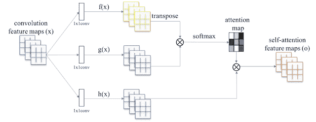
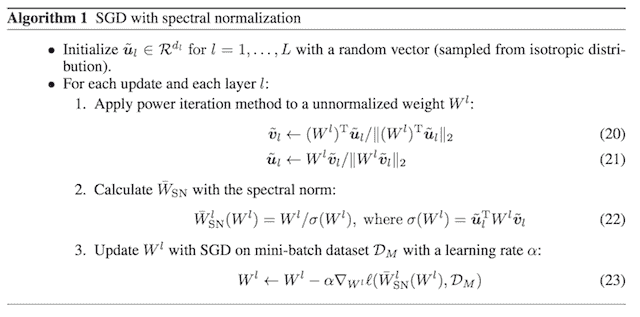
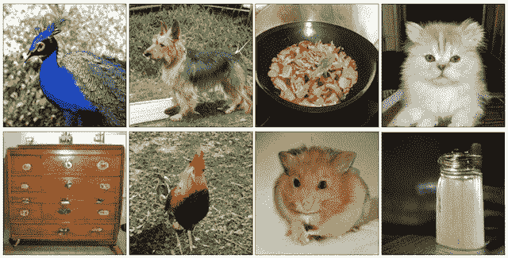
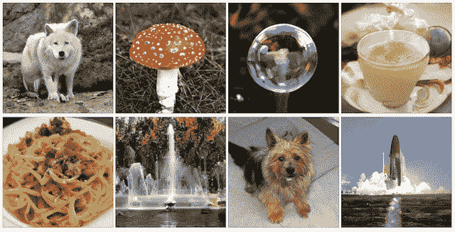

# 大型生成对抗网络 BigGAN 的温和介绍

> 原文：<https://machinelearningmastery.com/a-gentle-introduction-to-the-biggan/>

生成对抗网络，或 GANs ，可能是最有效的图像合成生成模型。

然而，它们通常局限于生成小图像，并且训练过程仍然脆弱，依赖于特定的增强和超参数以获得良好的结果。

BigGAN 是一种方法，它池化了一套最近在训练类条件图像和按比例增加批量大小和模型参数数量方面的最佳实践。结果是常规生成高分辨率(大)和高质量(高保真)图像。

在这篇文章中，你将发现用于放大类条件图像合成的 BigGAN 模型。

看完这篇文章，你会知道:

*   图像大小和训练脆性仍然是 GANs 的大问题。
*   放大模型尺寸和批次尺寸可以产生更大更高质量的图像。
*   扩大 GANs 规模所需的特定模型架构和培训配置。

**用我的新书[Python 生成对抗网络](https://machinelearningmastery.com/generative_adversarial_networks/)启动你的项目**，包括*分步教程*和所有示例的 *Python 源代码*文件。

我们开始吧。

雷伊·佩雷佐索拍摄的《大人物简介》图片，版权所有。

## 概观

本教程分为四个部分；它们是:

1.  GAN训练的脆性
2.  通过扩大规模开发更好的 GANs
3.  如何使用 BigGAN 扩展 GANs
4.  BigGAN 生成的图像示例

## GAN训练的脆性

生成对抗网络，简称 GANs，能够生成高质量的合成图像。

然而，生成的图像的尺寸保持相对较小，例如 64×64 或 128×128 像素。

此外，尽管进行了大量研究并提出了改进建议，模型训练过程仍然脆弱。

> 没有辅助稳定技术，这种训练过程是出了名的脆弱，需要微调超参数和架构选择才能工作。

——[高保真自然图像合成的大规模 GAN 训练](https://arxiv.org/abs/1809.11096)，2018。

对训练过程的大部分改进都集中在目标函数的改变或训练过程中对鉴别器模型的约束上。

> 许多最近的研究相应地集中在对香草甘程序的修改上，以赋予稳定性，利用越来越多的经验和理论见解。一个工作重点是改变目标函数[……]以鼓励趋同。另一条线侧重于通过梯度惩罚[…]或归一化[…]来约束 D，以抵消无界损失函数的使用，并确保 D 在任何地方都向 g 提供梯度。

——[高保真自然图像合成的大规模 GAN 训练](https://arxiv.org/abs/1809.11096)，2018。

最近，工作集中在有效应用GAN生成高质量和更大的图像。

一种方法是尝试扩大已经运行良好的 GAN 模型。

## 通过扩大规模开发更好的 GANs

BigGAN 是 GAN 架构的一个实现，旨在利用已报道的更普遍的最佳工作方式。

由 [Andrew Brock](https://twitter.com/ajmooch) 等人在他们 2018 年发表的题为“[用于高保真自然图像合成的大规模 GAN 训练](https://arxiv.org/abs/1809.11096)”的论文中进行了描述，并在 [ICLR 2019 会议](https://openreview.net/forum?id=B1xsqj09Fm)上进行了介绍。

具体来说，BigGAN 是为类条件图像生成而设计的。即，使用来自潜在空间的点和图像类别信息作为输入来生成图像。用于训练类条件 GANs 的示例数据集包括具有几十个、几百个或几千个图像类的 [CIFAR](https://machinelearningmastery.com/how-to-develop-a-cnn-from-scratch-for-cifar-10-photo-classification/) 或 [ImageNet](https://machinelearningmastery.com/introduction-to-the-imagenet-large-scale-visual-recognition-challenge-ilsvrc/) 图像类别数据集。

顾名思义，BigGAN 专注于放大 GAN 模型。

这包括具有以下特点的GAN型号:

*   更多模型参数(例如，更多要素图)。
*   更大的批量
*   建筑变化

> 我们证明，与现有技术相比，GANs 从扩展中受益匪浅，训练模型的参数数量是现有技术的 2 到 4 倍，批处理大小是现有技术的 8 倍。我们引入了两个简单、通用的架构更改来提高可扩展性，并修改正则化方案来改善条件，从而显著提高表现。

——[高保真自然图像合成的大规模 GAN 训练](https://arxiv.org/abs/1809.11096)，2018。

BigGAN 架构还引入了在图像生成期间使用的“*截断技巧*”，从而提高了图像质量，并引入了相应的正则化技术来更好地支持这一技巧。

结果是一种能够生成更大和更高质量图像的方法，例如 256×256 和 512×512 图像。

> 当在 ImageNet 上以 128×128 的分辨率进行训练时，我们的模型(BigGANs)提高了最先进的水平……我们还成功地在 ImageNet 上以 256×256 和 512×512 的分辨率训练了 BigGANs…

——[高保真自然图像合成的大规模 GAN 训练](https://arxiv.org/abs/1809.11096)，2018。

## 如何使用 BigGAN 扩展 GANs

BigGAN 模型的贡献在于模型和训练过程的设计决策。

这些设计决策不仅对重新实现 BigGAN 很重要，而且对深入了解配置选项也很重要，这些选项可能对更广泛的 GANs 有益。

BigGAN 模型的重点是增加模型参数的数量和批量，然后配置模型和训练过程以达到最佳效果。

在本节中，我们将回顾 BigGAN 中的具体设计决策。

### 1.自关注模块和铰链损耗

该模型的基础是[张寒](https://sites.google.com/view/hanzhang)等人在 2018 年的论文《倾斜的”[自我注意生成对抗网络](https://arxiv.org/abs/1805.08318)中描述的自我注意 GAN，简称 SAGAN 这包括引入应用于特征图的注意力图，允许生成器和鉴别器模型关注图像的不同部分。

这包括在深度卷积模型架构中添加一个注意力模块。

自我关注 GAN 中使用的自我关注模块概述。
摘自:自我注意生成对抗网络。

此外，模型通过[铰链损失](https://machinelearningmastery.com/how-to-choose-loss-functions-when-training-deep-learning-neural-networks/)进行训练，常用于训练支持向量机。

> 在 SAGAN 中，所提出的注意模块被应用于发生器和鉴别器，它们通过最小化对抗性损失的铰链版本以交替的方式被训练

——[自我注意生成对抗网络](https://arxiv.org/abs/1805.08318)，2018。

BigGAN 使用的模型架构带有来自 SAGAN 的注意力模块，并通过铰链损失进行训练。

标题为*架构细节*的论文附录 B 提供了生成器和鉴别器模型中使用的模块及其配置的摘要。有两个版本的模型分别描述了 BigGAN 和 BigGAN-deep，后者涉及更深的 [resnet 模块](https://machinelearningmastery.com/how-to-implement-major-architecture-innovations-for-convolutional-neural-networks/)，进而获得更好的结果。

### 2.类条件信息

类信息通过类条件批处理规范化提供给生成器模型。

文森特·杜穆林等人在 2016 年的论文《T2:艺术风格的学术表现》中对此进行了描述在本文中，该技术被称为“T4”条件实例规范化，其涉及基于来自给定风格的图像的统计来规范化激活，或者在 BigGAN 的情况下，给定类别的图像。

> 我们称这种方法为条件实例规范化。该过程的目标是将层的激活 x 转换为特定于绘画风格 s 的规范化激活 z。

——[艺术风格的学术表达](https://arxiv.org/abs/1610.07629)，2016 年。

类别信息通过投影提供给鉴别器。

这是由[takentu Miyato](https://twitter.com/takeru_miyato?lang=en)等人在他们 2018 年的论文《生成对抗网络的[谱归一化](https://arxiv.org/abs/1802.05957)中描述的这包括使用类值的整数嵌入，该类值被连接到网络的中间层。

> 条件 GANs 的鉴别器。为了便于计算，我们将整数标签 y 嵌入到{0，.。。，1000)转换为 128 维，然后将向量连接到中间层的输出。

——[生成对抗网络的谱归一化](https://arxiv.org/abs/1802.05957)，2018。

为了减少权重的数量，使用了共享嵌入，而不是每个类标签使用一个类嵌入。

> 我们选择使用共享嵌入，而不是每个嵌入都有一个单独的层，共享嵌入是线性投影到每个层的增益和偏差。这降低了计算和内存成本，并将训练速度(达到给定表现所需的迭代次数)提高了 37%。

——[高保真自然图像合成的大规模 GAN 训练](https://arxiv.org/abs/1809.11096)，2018。

### 3.光谱归一化

使用频谱归一化来归一化生成器的权重。

[takentu Miyato](https://twitter.com/takeru_miyato?lang=en)等人在他们 2018 年发表的题为“生成对抗网络的[光谱归一化](https://arxiv.org/abs/1802.05957)的论文中描述了用于 GANs 的光谱归一化具体来说，它包括归一化权重矩阵的谱范数。

> 我们的谱归一化将权重矩阵 W 的谱范数归一化，使得它满足李普希茨约束σ(W)= 1:

——[生成对抗网络的谱归一化](https://arxiv.org/abs/1802.05957)，2018。

高效的实现要求在小批量随机梯度下降过程中改变权重更新，如光谱归一化论文附录一所述。

带谱归一化的 SGD 算法
摘自:生成对抗网络的谱归一化

### 4.更新鉴别器多于生成器

在 GAN 训练算法中，通常先更新鉴别器模型，再更新生成器模型。

BigGAN 对此稍作修改，并在每次训练迭代中更新生成器模型之前更新鉴别器模型两次。

### 5.模型权重的移动平均值

基于生成的图像评估生成器模型。

在生成用于评估的图像之前，使用[移动平均值](https://machinelearningmastery.com/polyak-neural-network-model-weight-ensemble/)在先前的训练迭代中平均模型权重。

[Tero Karras](https://research.nvidia.com/person/tero-karras) 等人在 2017 年发表的题为“T2”的论文中描述并使用了发电机评估的加权移动平均模型，以提高质量、稳定性和变化性

> ……为了在训练期间可视化任意给定点的生成器输出，我们使用衰减为 0.999 的生成器权重的指数运行平均值。

——[为提高质量、稳定性和变化性而进行的肝的渐进式增长](https://arxiv.org/abs/1710.10196)，2017 年。

### 6.正交权重初始化

使用正交初始化初始化模型权重。

安德鲁·萨克斯(Andrew Saxe)等人在 2013 年发表的题为“深度线性神经网络中学习的非线性动力学的 T2 精确解”的论文中对此进行了描述这包括将权重设置为随机正交矩阵。

> …每一层中的初始权重为随机正交矩阵(满足 w^t w = I)…

——[深度线性神经网络中学习的非线性动力学的精确解](https://arxiv.org/abs/1312.6120)，2013。

注意，Keras 直接支持[正交权重初始化](https://keras.io/initializers/)。

### 7.更大的批量

测试和评估了非常大的批次尺寸。

这包括批量大小为 256、512、1024 和 2，048 的图像。

批量越大，图像质量通常越好，批量为 2，048 张时图像质量最好。

> …只需将批量增加 8 倍，就可以将最先进的信息系统提高 46%。

——[高保真自然图像合成的大规模 GAN 训练](https://arxiv.org/abs/1809.11096)，2018。

直觉是批量越大，提供的“*模式*越多”，反过来也为更新模型提供了更好的梯度信息。

> 我们推测这是每批覆盖更多模式的结果，为两个网络提供了更好的梯度。

——[高保真自然图像合成的大规模 GAN 训练](https://arxiv.org/abs/1809.11096)，2018。

### 8.更多模型参数

模型参数的数量也大幅增加。

这是通过将每个层中的通道或要素图(过滤器)的数量增加一倍来实现的。

> 然后，我们将每一层的宽度(通道数)增加 50%，大约是两个模型中参数数量的两倍。这导致信息系统进一步提高了 21%，我们认为这是由于相对于数据集的复杂性，模型的容量增加了。

——[高保真自然图像合成的大规模 GAN 训练](https://arxiv.org/abs/1809.11096)，2018。

### 9.跳过 z 连接

生成器模型中添加了跳过连接，将输入潜在点直接连接到网络深处的特定层。

这些被称为 skip-z 连接，其中 z 指的是输入潜在向量。

> 接下来，我们将噪声向量 z 中的直接跳过连接(skip-z)添加到 G 的多个层，而不仅仅是初始层。这种设计背后的直觉是允许 G 使用潜在空间来直接影响不同分辨率和层次的特征。[……]Skip-z 提供了大约 4%的适度表现提升，并将训练速度进一步提高了 18%。

——[高保真自然图像合成的大规模 GAN 训练](https://arxiv.org/abs/1809.11096)，2018。

### 10.截断技巧

截断技巧包括在训练期间对生成器的潜在空间使用不同于推理或图像合成期间的分布。

训练时使用[高斯分布](https://machinelearningmastery.com/statistical-data-distributions/)，推理时使用截断高斯。这被称为“*截断绝招*”

> 我们称之为截断技巧:通过对幅度高于所选阈值的值进行重新采样来截断 z 向量，以减少总体样本种类为代价来提高单个样本的质量。

——[高保真自然图像合成的大规模 GAN 训练](https://arxiv.org/abs/1809.11096)，2018。

截断技巧提供了图像质量或保真度与图像多样性之间的权衡。采样范围越窄，质量越好，而采样范围越大，采样图像越多样。

> 对于给定的样品，这种技术允许在样品质量和品种之间进行精细的事后选择

——[高保真自然图像合成的大规模 GAN 训练](https://arxiv.org/abs/1809.11096)，2018。

### 11.正交正则化

并非所有的模型都能很好地响应截断技巧。

当使用截断技巧时，一些更深层次的模型会提供饱和伪影。

为了更好地鼓励更广泛的模型很好地使用截断技巧，使用了正交正则化。

这是由[安德鲁·布洛克](https://twitter.com/ajmooch?lang=en)等人在 2016 年发表的题为“[带有内省对抗网络的神经照片编辑](https://arxiv.org/abs/1609.07093)的论文中介绍的

这与正交权重初始化相关，并且引入了[权重正则化](https://machinelearningmastery.com/weight-regularization-to-reduce-overfitting-of-deep-learning-models/)项来鼓励权重保持其正交属性。

> 正交性是 ConvNet 滤波器的一个理想品质，部分原因是与正交矩阵相乘会保持原始矩阵的范数不变。[……]我们提出了一种简单的权重正则化技术——正交正则化，通过将权重推向最近的正交流形来鼓励权重正交。

——[内省对抗网络神经照片编辑](https://arxiv.org/abs/1609.07093)，2016。

## BigGAN 生成的图像示例

BigGAN 能够生成大而高质量的图像。

在这一节中，我们将回顾论文中介绍的几个示例。

下面是一些由 BigGAN 生成的高质量图像的例子。

BigGAN 生成的高质量类条件图像示例。
取自:高保真自然图像合成的大规模 GAN 训练。

下面是 BigGAN 生成的大而高质量的图像示例。

BigGAN 生成的大型高质量类条件图像示例。
取自:高保真自然图像合成的大规模 GAN 训练。

训练 BigGAN 发电机时描述的问题之一是“类泄漏”的想法，这是一种新型的故障模式。

下面是一个部分训练的比格的漏课例子，显示了一个网球和一只狗之间的交叉。

部分训练的 BigGAN 生成的图像中的类泄漏示例。
取自:高保真自然图像合成的大规模 GAN 训练。

下面是一些由 BigGAN 以 256×256 分辨率生成的附加图像。

BigGAN 生成的大型高质量 256×256 类条件图像示例。
取自:高保真自然图像合成的大规模 GAN 训练。

下面是一些由 BigGAN 以 512×512 分辨率生成的更多图像。

BigGAN 生成的大型高质量 512×512 类条件图像示例。
取自:高保真自然图像合成的大规模 GAN 训练。

## 进一步阅读

如果您想更深入地了解这个主题，本节将提供更多资源。

### 报纸

*   [高保真自然图像合成的大规模 GAN 训练](https://arxiv.org/abs/1809.11096)，2018。
*   [用于高保真自然图像合成的大规模 GAN 训练，ICLR 2019](https://openreview.net/forum?id=B1xsqj09Fm) 。
*   [自我注意生成对抗网络](https://arxiv.org/abs/1805.08318)，2018。
*   [艺术风格的学术表达](https://arxiv.org/abs/1610.07629)，2016 年。
*   [生成对抗网络的谱归一化](https://arxiv.org/abs/1802.05957)，2018。
*   [为改善质量、稳定性和变异而进行的肝的渐进式增长](https://arxiv.org/abs/1710.10196)，2017 年。
*   [深度线性神经网络中学习的非线性动力学的精确解](https://arxiv.org/abs/1312.6120)，2013。
*   [内省对抗网络神经照片编辑](https://arxiv.org/abs/1609.07093)，2016。

### 密码

*   [TensorFlow Hub 上的 BigGAN，官方](https://tfhub.dev/s?q=biggan)。
*   [BigGAN 演示](https://colab.research.google.com/github/tensorflow/hub/blob/master/examples/colab/biggan_generation_with_tf_hub.ipynb)

### 文章

*   [减少生成对抗网络中对标签数据的需求，谷歌 AI 博客](https://ai.googleblog.com/2019/03/reducing-need-for-labeled-data-in.html)。

## 摘要

在这篇文章中，你发现了放大类条件图像合成的 BigGAN 模型。

具体来说，您了解到:

*   图像大小和训练脆性仍然是 GANs 的大问题。
*   放大模型尺寸和批次尺寸可以产生更大更高质量的图像。
*   扩大 GANs 规模所需的特定模型架构和培训配置。

你有什么问题吗？
在下面的评论中提问，我会尽力回答。